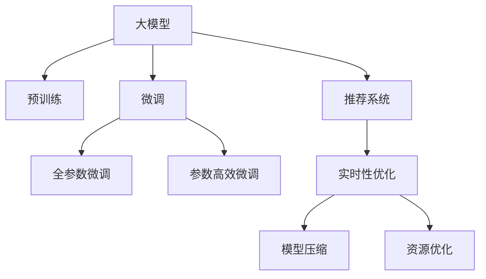

                 

# 大模型对推荐系统实时性的影响

## 1. 背景介绍

推荐系统是当前互联网应用中最为活跃的领域之一，它通过分析用户的交互行为和反馈，为用户推荐最符合其需求和兴趣的商品或内容。推荐系统的实时性直接影响到用户体验和平台收益。传统推荐系统主要依赖于机器学习算法，如协同过滤、基于内容的推荐等。这些算法在预测准确性和多样性方面取得了很好的效果，但由于其复杂度较高，计算资源消耗较大，无法满足实时性要求。

近年来，随着深度学习的发展，大模型在推荐系统中的应用变得愈发广泛。大模型通过预训练大量无标签数据，学习到丰富的语言、视觉等知识，具备强大的表达能力和泛化能力。在大模型的帮助下，推荐系统能够实现更加精准的推荐，覆盖更加广泛的场景，如新闻推荐、商品推荐、视频推荐等。

## 2. 核心概念与联系

### 2.1 核心概念概述

本节将介绍几个与大模型在推荐系统中的应用密切相关的核心概念：

- **大模型**：指基于大规模深度学习模型（如BERT、GPT-3等）的推荐系统，通过在大规模数据上进行预训练，学习到丰富的知识表示。

- **推荐系统**：通过分析用户行为和反馈，向用户推荐个性化商品或内容的系统，其核心目标是提升用户体验和平台收益。

- **预训练**：指在大规模无标签数据上进行自监督学习，学习到通用语言、视觉等表示的过程。

- **微调**：在大模型的基础上，通过有监督的标注数据，优化模型在特定推荐任务上的性能。

- **实时性**：推荐系统实时响应用户请求，快速获取推荐结果的能力，是用户体验的重要指标。

- **模型压缩**：通过剪枝、量化、蒸馏等方法，减小模型体积，提高推理速度和内存效率。

- **资源优化**：通过模型并行、混合精度训练、数据分片等技术，优化推荐系统的计算资源和存储资源。

### 2.2 核心概念原理和架构的 Mermaid 流程图



这个流程图展示了大模型在推荐系统中的应用流程：

1. 大模型通过预训练学习通用知识表示。
2. 在大模型的基础上，进行微调以适应推荐任务。
3. 微调后的模型通过优化技术提升实时性。
4. 实时性优化过程中使用模型压缩和资源优化技术。

## 3. 核心算法原理 & 具体操作步骤

### 3.1 算法原理概述

大模型在推荐系统中的应用主要基于两个核心思想：

1. **知识迁移**：通过在大模型上进行预训练，学习到通用的知识表示，然后在推荐系统任务上进行微调，以实现从通用知识到推荐任务的知识迁移。

2. **优化实时性**：大模型由于参数量较大，推理时间较长，需要通过模型压缩和优化资源分配等技术，提升实时性。

### 3.2 算法步骤详解

以下是基于大模型在推荐系统中进行微调和优化实时性的详细步骤：

**Step 1: 准备数据集**

- 收集推荐系统任务的数据集，如用户行为记录、商品信息、用户画像等。
- 将数据集分为训练集、验证集和测试集，用于模型训练、调参和评估。

**Step 2: 选择大模型**

- 选择合适的大模型作为预训练模型，如BERT、GPT等。
- 确保所选模型与推荐系统任务具有较好的匹配性。

**Step 3: 预训练**

- 在大规模无标签数据上对大模型进行预训练，学习到通用的语言、视觉等知识表示。
- 可以使用自监督学习任务，如掩码语言模型、视觉识别任务等。

**Step 4: 微调**

- 在预训练模型基础上，使用推荐系统任务的标注数据进行微调，学习到任务特定的知识表示。
- 可以采用全参数微调或参数高效微调（如Adapter、Prompt Tuning等）。

**Step 5: 实时性优化**

- 对微调后的模型进行优化，提升实时性。
- 可以使用模型压缩技术，如剪枝、量化、蒸馏等。
- 可以使用资源优化技术，如模型并行、混合精度训练、数据分片等。

**Step 6: 部署**

- 将优化后的模型部署到生产环境中，实时响应用户请求。
- 定期更新模型，保持模型性能。

### 3.3 算法优缺点

大模型在推荐系统中的应用具有以下优点：

1. **表达能力强**：大模型能够学习到丰富的知识表示，提升推荐精度。
2. **泛化能力强**：大模型具备较强的泛化能力，能够在不同的推荐任务上表现出色。
3. **覆盖面广**：大模型可以覆盖多种推荐场景，如新闻推荐、商品推荐等。

同时，大模型也存在以下缺点：

1. **计算资源消耗大**：大模型参数量较大，推理时间较长，计算资源消耗较大。
2. **存储需求高**：大模型需要占用较大的存储空间，存储和加载时间较长。
3. **可解释性差**：大模型的内部机制难以解释，难以理解模型的推理过程。

### 3.4 算法应用领域

大模型在推荐系统中的应用广泛，包括：

- **新闻推荐**：通过分析用户的历史阅读记录和兴趣，为用户推荐个性化新闻。
- **商品推荐**：根据用户的浏览记录和购买历史，推荐用户可能感兴趣的商品。
- **视频推荐**：通过分析用户的观看历史和评分，为用户推荐视频内容。
- **个性化广告**：根据用户的在线行为和兴趣，推荐个性化广告。

## 4. 数学模型和公式 & 详细讲解

### 4.1 数学模型构建

在本节中，我们将构建一个基于大模型的推荐系统数学模型。假设用户 $u$ 对商品 $i$ 的评分 $r_{ui}$ 遵循伯努利分布：

$$
P(r_{ui}=k) = \frac{e^{z_{ui}^{(k)}}}{1+\sum_{l}e^{z_{ui}^{(l)}}}
$$

其中 $z_{ui}^{(k)}$ 为模型对用户 $u$ 和商品 $i$ 进行推荐时的嵌入表示，$k$ 为评分值（0或1）。推荐模型需要学习到 $z_{ui}^{(k)}$ 的表示。

### 4.2 公式推导过程

我们可以将 $z_{ui}^{(k)}$ 表示为：

$$
z_{ui}^{(k)} = W_u V_i^{(k)} + W_i V_u^{(k)} + W_u W_i
$$

其中 $W_u$ 和 $V_i^{(k)}$ 分别为用户 $u$ 和商品 $i$ 的表示矩阵，$W_i$ 和 $V_u^{(k)}$ 分别为商品 $i$ 和用户 $u$ 的表示矩阵。通过矩阵乘法，我们可以得到推荐模型的预测值：

$$
\hat{r}_{ui} = sigmoid(z_{ui}^{(1)}) - sigmoid(z_{ui}^{(0)})
$$

其中 $sigmoid$ 函数用于将预测值映射到 $[0,1]$ 区间内。

### 4.3 案例分析与讲解

在实际应用中，大模型的推荐模型可以应用于多场景。以下是两个具体的案例：

**案例1: 新闻推荐**

假设用户 $u$ 对新闻 $n$ 的阅读行为 $r_{un}$ 遵循伯努利分布：

$$
P(r_{un}=1) = \frac{e^{z_{un}}}{1+e^{-z_{un}}}
$$

其中 $z_{un}$ 为模型对用户 $u$ 阅读新闻 $n$ 的表示。新闻推荐模型需要学习到 $z_{un}$ 的表示。

**案例2: 商品推荐**

假设用户 $u$ 对商品 $i$ 的评分 $r_{ui}$ 遵循伯努利分布：

$$
P(r_{ui}=1) = \frac{e^{z_{ui}}}{1+e^{-z_{ui}}}
$$

其中 $z_{ui}$ 为模型对用户 $u$ 和商品 $i$ 进行推荐时的表示。商品推荐模型需要学习到 $z_{ui}$ 的表示。

## 5. 项目实践：代码实例和详细解释说明

### 5.1 开发环境搭建

在进行项目实践前，我们需要准备好开发环境。以下是使用Python进行PyTorch开发的环境配置流程：

1. 安装Anaconda：从官网下载并安装Anaconda，用于创建独立的Python环境。

2. 创建并激活虚拟环境：
```bash
conda create -n pytorch-env python=3.8 
conda activate pytorch-env
```

3. 安装PyTorch：根据CUDA版本，从官网获取对应的安装命令。例如：
```bash
conda install pytorch torchvision torchaudio cudatoolkit=11.1 -c pytorch -c conda-forge
```

4. 安装Transformers库：
```bash
pip install transformers
```

5. 安装各类工具包：
```bash
pip install numpy pandas scikit-learn matplotlib tqdm jupyter notebook ipython
```

完成上述步骤后，即可在`pytorch-env`环境中开始项目实践。

### 5.2 源代码详细实现

下面我们以新闻推荐任务为例，给出使用Transformers库对BERT模型进行微调的PyTorch代码实现。

首先，定义新闻推荐任务的数据处理函数：

```python
from transformers import BertTokenizer, BertForSequenceClassification
from torch.utils.data import Dataset
import torch

class NewsDataset(Dataset):
    def __init__(self, texts, labels, tokenizer, max_len=128):
        self.texts = texts
        self.labels = labels
        self.tokenizer = tokenizer
        self.max_len = max_len
        
    def __len__(self):
        return len(self.texts)
    
    def __getitem__(self, item):
        text = self.texts[item]
        label = self.labels[item]
        
        encoding = self.tokenizer(text, return_tensors='pt', max_length=self.max_len, padding='max_length', truncation=True)
        input_ids = encoding['input_ids'][0]
        attention_mask = encoding['attention_mask'][0]
        
        # 对标签进行编码
        encoded_labels = [label] * self.max_len
        labels = torch.tensor(encoded_labels, dtype=torch.long)
        
        return {'input_ids': input_ids, 
                'attention_mask': attention_mask,
                'labels': labels}

# 标签与id的映射
label2id = {'0': 0, '1': 1}
id2label = {v: k for k, v in label2id.items()}

# 创建dataset
tokenizer = BertTokenizer.from_pretrained('bert-base-uncased')

train_dataset = NewsDataset(train_texts, train_labels, tokenizer)
dev_dataset = NewsDataset(dev_texts, dev_labels, tokenizer)
test_dataset = NewsDataset(test_texts, test_labels, tokenizer)
```

然后，定义模型和优化器：

```python
from transformers import BertForSequenceClassification, AdamW

model = BertForSequenceClassification.from_pretrained('bert-base-uncased', num_labels=2)

optimizer = AdamW(model.parameters(), lr=2e-5)
```

接着，定义训练和评估函数：

```python
from torch.utils.data import DataLoader
from tqdm import tqdm
from sklearn.metrics import classification_report

device = torch.device('cuda') if torch.cuda.is_available() else torch.device('cpu')
model.to(device)

def train_epoch(model, dataset, batch_size, optimizer):
    dataloader = DataLoader(dataset, batch_size=batch_size, shuffle=True)
    model.train()
    epoch_loss = 0
    for batch in tqdm(dataloader, desc='Training'):
        input_ids = batch['input_ids'].to(device)
        attention_mask = batch['attention_mask'].to(device)
        labels = batch['labels'].to(device)
        model.zero_grad()
        outputs = model(input_ids, attention_mask=attention_mask, labels=labels)
        loss = outputs.loss
        epoch_loss += loss.item()
        loss.backward()
        optimizer.step()
    return epoch_loss / len(dataloader)

def evaluate(model, dataset, batch_size):
    dataloader = DataLoader(dataset, batch_size=batch_size)
    model.eval()
    preds, labels = [], []
    with torch.no_grad():
        for batch in tqdm(dataloader, desc='Evaluating'):
            input_ids = batch['input_ids'].to(device)
            attention_mask = batch['attention_mask'].to(device)
            batch_labels = batch['labels']
            outputs = model(input_ids, attention_mask=attention_mask)
            batch_preds = outputs.logits.argmax(dim=1).to('cpu').tolist()
            batch_labels = batch_labels.to('cpu').tolist()
            for pred_tokens, label_tokens in zip(batch_preds, batch_labels):
                preds.append(pred_tokens)
                labels.append(label_tokens)
                
    print(classification_report(labels, preds))
```

最后，启动训练流程并在测试集上评估：

```python
epochs = 5
batch_size = 16

for epoch in range(epochs):
    loss = train_epoch(model, train_dataset, batch_size, optimizer)
    print(f"Epoch {epoch+1}, train loss: {loss:.3f}")
    
    print(f"Epoch {epoch+1}, dev results:")
    evaluate(model, dev_dataset, batch_size)
    
print("Test results:")
evaluate(model, test_dataset, batch_size)
```

以上就是使用PyTorch对BERT进行新闻推荐任务微调的完整代码实现。可以看到，得益于Transformers库的强大封装，我们可以用相对简洁的代码完成BERT模型的加载和微调。

### 5.3 代码解读与分析

让我们再详细解读一下关键代码的实现细节：

**NewsDataset类**：
- `__init__`方法：初始化文本、标签、分词器等关键组件。
- `__len__`方法：返回数据集的样本数量。
- `__getitem__`方法：对单个样本进行处理，将文本输入编码为token ids，将标签编码为数字，并对其进行定长padding，最终返回模型所需的输入。

**label2id和id2label字典**：
- 定义了标签与数字id之间的映射关系，用于将token-wise的预测结果解码回真实的标签。

**训练和评估函数**：
- 使用PyTorch的DataLoader对数据集进行批次化加载，供模型训练和推理使用。
- 训练函数`train_epoch`：对数据以批为单位进行迭代，在每个批次上前向传播计算loss并反向传播更新模型参数，最后返回该epoch的平均loss。
- 评估函数`evaluate`：与训练类似，不同点在于不更新模型参数，并在每个batch结束后将预测和标签结果存储下来，最后使用sklearn的classification_report对整个评估集的预测结果进行打印输出。

**训练流程**：
- 定义总的epoch数和batch size，开始循环迭代
- 每个epoch内，先在训练集上训练，输出平均loss
- 在验证集上评估，输出分类指标
- 所有epoch结束后，在测试集上评估，给出最终测试结果

可以看到，PyTorch配合Transformers库使得BERT微调的代码实现变得简洁高效。开发者可以将更多精力放在数据处理、模型改进等高层逻辑上，而不必过多关注底层的实现细节。

当然，工业级的系统实现还需考虑更多因素，如模型的保存和部署、超参数的自动搜索、更灵活的任务适配层等。但核心的微调范式基本与此类似。

## 6. 实际应用场景

### 6.1 智能客服系统

基于大模型的推荐系统，可以广泛应用于智能客服系统的构建。传统客服往往需要配备大量人力，高峰期响应缓慢，且一致性和专业性难以保证。使用推荐系统，可以通过分析用户的历史交互记录和行为，推荐最合适的解决方案，提升客服响应速度和效率。

在技术实现上，可以收集企业内部的历史客服记录，将用户的问题和解决方案构建成监督数据，在此基础上对预训练推荐模型进行微调。微调后的推荐模型能够自动理解用户问题，匹配最合适的答案模板进行推荐。对于客户提出的新问题，还可以接入检索系统实时搜索相关内容，动态组织生成推荐列表。如此构建的智能客服系统，能大幅提升客户咨询体验和问题解决效率。

### 6.2 金融舆情监测

金融机构需要实时监测市场舆论动向，以便及时应对负面信息传播，规避金融风险。传统的人工监测方式成本高、效率低，难以应对网络时代海量信息爆发的挑战。基于大模型的推荐系统，可以实时分析用户对新闻、文章等的情感倾向，快速识别市场舆情变化，提供预警信息，帮助金融机构快速应对潜在风险。

具体而言，可以收集金融领域相关的新闻、报道、评论等文本数据，并对其进行情感标注。在此基础上对预训练推荐模型进行微调，使其能够自动判断文本的情感倾向。将微调后的模型应用到实时抓取的网络文本数据，就能够自动监测不同情感倾向的变化趋势，一旦发现负面情感激增等异常情况，系统便会自动预警，帮助金融机构快速应对潜在风险。

### 6.3 个性化推荐系统

当前的推荐系统往往只依赖用户的历史行为数据进行物品推荐，无法深入理解用户的真实兴趣偏好。基于大模型的推荐系统，可以更好地挖掘用户行为背后的语义信息，从而提供更精准、多样的推荐内容。

在实践中，可以收集用户浏览、点击、评论、分享等行为数据，提取和用户交互的物品标题、描述、标签等文本内容。将文本内容作为模型输入，用户的后续行为（如是否点击、购买等）作为监督信号，在此基础上微调预训练语言模型。微调后的模型能够从文本内容中准确把握用户的兴趣点。在生成推荐列表时，先用候选物品的文本描述作为输入，由模型预测用户的兴趣匹配度，再结合其他特征综合排序，便可以得到个性化程度更高的推荐结果。

### 6.4 未来应用展望

随着大模型和推荐系统的发展，未来基于大模型的推荐系统将在更多领域得到应用，为各行各业带来变革性影响。

在智慧医疗领域，基于大模型的医疗推荐系统可以帮助医生诊断疾病、推荐治疗方案，辅助医生诊疗，加速新药开发进程。

在智能教育领域，微调技术可应用于作业批改、学情分析、知识推荐等方面，因材施教，促进教育公平，提高教学质量。

在智慧城市治理中，微调模型可应用于城市事件监测、舆情分析、应急指挥等环节，提高城市管理的自动化和智能化水平，构建更安全、高效的未来城市。

此外，在企业生产、社会治理、文娱传媒等众多领域，基于大模型微调的人工智能应用也将不断涌现，为NLP技术带来新的突破。相信随着预训练语言模型和微调方法的不断进步，推荐系统将在更广阔的应用领域大放异彩。

## 7. 工具和资源推荐

### 7.1 学习资源推荐

为了帮助开发者系统掌握大模型在推荐系统中的应用理论基础和实践技巧，这里推荐一些优质的学习资源：

1. 《Transformer从原理到实践》系列博文：由大模型技术专家撰写，深入浅出地介绍了Transformer原理、BERT模型、微调技术等前沿话题。

2. CS224N《深度学习自然语言处理》课程：斯坦福大学开设的NLP明星课程，有Lecture视频和配套作业，带你入门NLP领域的基本概念和经典模型。

3. 《Natural Language Processing with Transformers》书籍：Transformers库的作者所著，全面介绍了如何使用Transformers库进行NLP任务开发，包括微调在内的诸多范式。

4. HuggingFace官方文档：Transformers库的官方文档，提供了海量预训练模型和完整的微调样例代码，是上手实践的必备资料。

5. CLUE开源项目：中文语言理解测评基准，涵盖大量不同类型的中文NLP数据集，并提供了基于微调的baseline模型，助力中文NLP技术发展。

通过对这些资源的学习实践，相信你一定能够快速掌握大模型在推荐系统中的微调技巧，并用于解决实际的推荐问题。

### 7.2 开发工具推荐

高效的开发离不开优秀的工具支持。以下是几款用于大模型推荐系统开发的常用工具：

1. PyTorch：基于Python的开源深度学习框架，灵活动态的计算图，适合快速迭代研究。大部分预训练语言模型都有PyTorch版本的实现。

2. TensorFlow：由Google主导开发的开源深度学习框架，生产部署方便，适合大规模工程应用。同样有丰富的预训练语言模型资源。

3. Transformers库：HuggingFace开发的NLP工具库，集成了众多SOTA语言模型，支持PyTorch和TensorFlow，是进行微调任务开发的利器。

4. Weights & Biases：模型训练的实验跟踪工具，可以记录和可视化模型训练过程中的各项指标，方便对比和调优。与主流深度学习框架无缝集成。

5. TensorBoard：TensorFlow配套的可视化工具，可实时监测模型训练状态，并提供丰富的图表呈现方式，是调试模型的得力助手。

6. Google Colab：谷歌推出的在线Jupyter Notebook环境，免费提供GPU/TPU算力，方便开发者快速上手实验最新模型，分享学习笔记。

合理利用这些工具，可以显著提升大模型推荐系统的开发效率，加快创新迭代的步伐。

### 7.3 相关论文推荐

大模型和推荐系统的研究源于学界的持续研究。以下是几篇奠基性的相关论文，推荐阅读：

1. Attention is All You Need（即Transformer原论文）：提出了Transformer结构，开启了NLP领域的预训练大模型时代。

2. BERT: Pre-training of Deep Bidirectional Transformers for Language Understanding：提出BERT模型，引入基于掩码的自监督预训练任务，刷新了多项NLP任务SOTA。

3. Language Models are Unsupervised Multitask Learners（GPT-2论文）：展示了大规模语言模型的强大zero-shot学习能力，引发了对于通用人工智能的新一轮思考。

4. Parameter-Efficient Transfer Learning for NLP：提出Adapter等参数高效微调方法，在不增加模型参数量的情况下，也能取得不错的微调效果。

5. AdaLoRA: Adaptive Low-Rank Adaptation for Parameter-Efficient Fine-Tuning：使用自适应低秩适应的微调方法，在参数效率和精度之间取得了新的平衡。

6. Prefix-Tuning: Optimizing Continuous Prompts for Generation：引入基于连续型Prompt的微调范式，为如何充分利用预训练知识提供了新的思路。

这些论文代表了大模型和推荐系统的发展脉络。通过学习这些前沿成果，可以帮助研究者把握学科前进方向，激发更多的创新灵感。

## 8. 总结：未来发展趋势与挑战

### 8.1 总结

本文对基于大模型的推荐系统进行了全面系统的介绍。首先阐述了大模型和推荐系统的研究背景和意义，明确了推荐系统在提升用户体验和平台收益方面的独特价值。其次，从原理到实践，详细讲解了推荐系统的数学模型和核心算法，给出了微调任务开发的完整代码实例。同时，本文还广泛探讨了推荐系统在大规模场景中的应用前景，展示了推荐系统的大有可为。

通过本文的系统梳理，可以看到，基于大模型的推荐系统正在成为推荐系统应用的重要范式，极大地拓展了推荐系统的应用边界，带来了新的技术突破。未来，伴随大模型和微调方法的持续演进，推荐系统将在更广阔的应用领域大放异彩，深刻影响人类的生产生活方式。

### 8.2 未来发展趋势

展望未来，大模型在推荐系统中的应用将呈现以下几个发展趋势：

1. **模型规模持续增大**：随着算力成本的下降和数据规模的扩张，大模型的参数量还将持续增长。超大规模语言模型蕴含的丰富语言知识，有望支撑更加复杂多变的推荐任务。

2. **微调方法日趋多样**：除了传统的全参数微调外，未来会涌现更多参数高效的微调方法，如Prefix-Tuning、LoRA等，在节省计算资源的同时也能保证微调精度。

3. **持续学习成为常态**：随着数据分布的不断变化，推荐模型也需要持续学习新知识以保持性能。如何在不遗忘原有知识的同时，高效吸收新样本信息，将成为重要的研究课题。

4. **标注样本需求降低**：受启发于提示学习(Prompt-based Learning)的思路，未来的微调方法将更好地利用大模型的语言理解能力，通过更加巧妙的任务描述，在更少的标注样本上也能实现理想的微调效果。

5. **多模态推荐崛起**：当前推荐主要聚焦于纯文本数据，未来会进一步拓展到图像、视频、语音等多模态数据推荐。多模态信息的融合，将显著提升推荐系统的表现力。

6. **推荐系统智能化提升**：基于大模型的推荐系统将更加智能，能够处理更复杂的多模态推荐任务，如跨模态推荐、视频推荐等。

以上趋势凸显了大模型在推荐系统中的应用前景。这些方向的探索发展，必将进一步提升推荐系统的性能和应用范围，为推荐系统带来新的突破。

### 8.3 面临的挑战

尽管大模型在推荐系统中的应用取得了一定进展，但在迈向更加智能化、普适化应用的过程中，它仍面临着诸多挑战：

1. **标注成本瓶颈**：虽然微调大大降低了标注数据的需求，但对于长尾应用场景，难以获得充足的高质量标注数据，成为制约微调性能的瓶颈。如何进一步降低微调对标注样本的依赖，将是一大难题。

2. **模型鲁棒性不足**：当前推荐模型面对域外数据时，泛化性能往往大打折扣。对于测试样本的微小扰动，推荐模型的预测也容易发生波动。如何提高推荐模型的鲁棒性，避免灾难性遗忘，还需要更多理论和实践的积累。

3. **推理效率有待提高**：大规模语言模型虽然精度高，但在实际部署时往往面临推理速度慢、内存占用大等效率问题。如何在保证性能的同时，简化模型结构，提升推理速度，优化资源占用，将是重要的优化方向。

4. **可解释性亟需加强**：当前推荐模型更像是"黑盒"系统，难以解释其内部工作机制和决策逻辑。对于医疗、金融等高风险应用，算法的可解释性和可审计性尤为重要。如何赋予推荐模型更强的可解释性，将是亟待攻克的难题。

5. **安全性有待保障**：推荐系统中的恶意推荐、虚假信息等问题日益凸显，如何确保推荐内容的安全性，确保用户权益，也将是重要的研究课题。

6. **知识整合能力不足**：现有的推荐模型往往局限于任务内数据，难以灵活吸收和运用更广泛的先验知识。如何让推荐过程更好地与外部知识库、规则库等专家知识结合，形成更加全面、准确的信息整合能力，还有很大的想象空间。

正视推荐系统面临的这些挑战，积极应对并寻求突破，将是大模型推荐系统走向成熟的必由之路。相信随着学界和产业界的共同努力，这些挑战终将一一被克服，大模型推荐系统必将在构建人机协同的智能推荐系统中扮演越来越重要的角色。

### 8.4 研究展望

面向未来，大模型推荐系统的研究需要在以下几个方面寻求新的突破：

1. **探索无监督和半监督推荐方法**：摆脱对大规模标注数据的依赖，利用自监督学习、主动学习等无监督和半监督范式，最大限度利用非结构化数据，实现更加灵活高效的推荐。

2. **研究参数高效和计算高效的推荐范式**：开发更加参数高效的推荐方法，在固定大部分预训练参数的同时，只更新极少量的任务相关参数。同时优化推荐模型的计算图，减少前向传播和反向传播的资源消耗，实现更加轻量级、实时性的部署。

3. **融合因果和对比学习范式**：通过引入因果推断和对比学习思想，增强推荐模型建立稳定因果关系的能力，学习更加普适、鲁棒的语言表征，从而提升推荐泛化性和抗干扰能力。

4. **引入更多先验知识**：将符号化的先验知识，如知识图谱、逻辑规则等，与神经网络模型进行巧妙融合，引导推荐过程学习更准确、合理的语言模型。同时加强不同模态数据的整合，实现视觉、语音等多模态信息与文本信息的协同建模。

5. **结合因果分析和博弈论工具**：将因果分析方法引入推荐模型，识别出推荐决策的关键特征，增强输出解释的因果性和逻辑性。借助博弈论工具刻画人机交互过程，主动探索并规避推荐系统的脆弱点，提高系统稳定性。

6. **纳入伦理道德约束**：在推荐模型训练目标中引入伦理导向的评估指标，过滤和惩罚有偏见、有害的推荐结果。同时加强人工干预和审核，建立推荐行为的监管机制，确保输出符合人类价值观和伦理道德。

这些研究方向的探索，必将引领大模型推荐系统技术迈向更高的台阶，为推荐系统带来新的突破。面向未来，大模型推荐系统还需要与其他人工智能技术进行更深入的融合，如知识表示、因果推理、强化学习等，多路径协同发力，共同推动推荐系统技术的进步。只有勇于创新、敢于突破，才能不断拓展推荐系统的边界，让智能推荐系统更好地造福人类社会。

## 9. 附录：常见问题与解答

**Q1：大模型在推荐系统中是否适用于所有应用场景？**

A: 大模型在推荐系统中具有一定的适用范围，但并非所有应用场景都适用。对于数据量较小、计算资源有限的应用场景，大模型的性能可能不如传统机器学习模型。对于需要实时性特别高的场景，大模型的推理速度可能成为瓶颈。在实际应用中，需要根据具体场景和数据特点进行选择。

**Q2：微调过程中如何选择合适的学习率？**

A: 微调的学习率一般要比预训练时小1-2个数量级，如果使用过大的学习率，容易破坏预训练权重，导致过拟合。一般建议从1e-5开始调参，逐步减小学习率，直至收敛。也可以使用warmup策略，在开始阶段使用较小的学习率，再逐渐过渡到预设值。需要注意的是，不同的优化器(如AdamW、Adafactor等)以及不同的学习率调度策略，可能需要设置不同的学习率阈值。

**Q3：采用大模型推荐时会面临哪些资源瓶颈？**

A: 当前主流的预训练大模型动辄以亿计的参数规模，对算力、内存、存储都提出了很高的要求。GPU/TPU等高性能设备是必不可少的，但即便如此，超大批次的训练和推理也可能遇到显存不足的问题。因此需要采用一些资源优化技术，如梯度积累、混合精度训练、模型并行等，来突破硬件瓶颈。同时，模型的存储和读取也可能占用大量时间和空间，需要采用模型压缩、稀疏化存储等方法进行优化。

**Q4：如何缓解推荐系统中的过拟合问题？**

A: 推荐系统中的过拟合问题可以通过数据增强、正则化、对抗训练等技术进行缓解。数据增强可以通过回译、近义替换等方式扩充训练集；正则化可以通过L2正则、Dropout等避免过拟合；对抗训练可以通过引入对抗样本，提高推荐模型的鲁棒性。这些技术需要根据具体任务和数据特点进行灵活组合，以最小化推荐模型的过拟合风险。

**Q5：推荐系统在部署时需要注意哪些问题？**

A: 将推荐系统部署到生产环境中，还需要考虑以下因素：

1. 模型裁剪：去除不必要的层和参数，减小模型尺寸，加快推理速度。
2. 量化加速：将浮点模型转为定点模型，压缩存储空间，提高计算效率。
3. 服务化封装：将模型封装为标准化服务接口，便于集成调用。
4. 弹性伸缩：根据请求流量动态调整资源配置，平衡服务质量和成本。
5. 监控告警：实时采集系统指标，设置异常告警阈值，确保服务稳定性。
6. 安全防护：采用访问鉴权、数据脱敏等措施，保障数据和模型安全。

大模型推荐系统在落地部署时，还需要考虑模型的大小、推理速度、服务性能等问题，需要从数据、算法、工程、业务等多个维度协同发力，方能得到理想的效果。

---

作者：禅与计算机程序设计艺术 / Zen and the Art of Computer Programming

