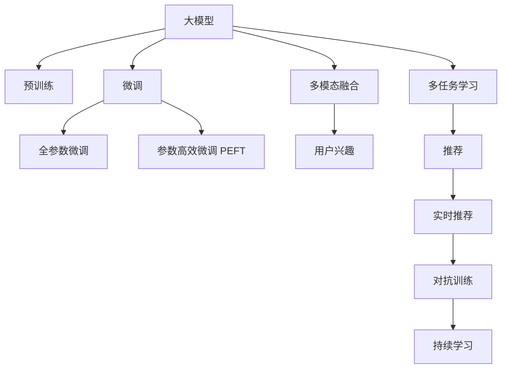
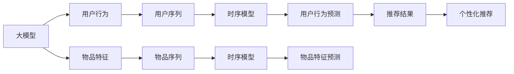

                 

# 大模型对推荐系统时序建模的影响研究

## 1. 背景介绍

### 1.1 问题由来

推荐系统是互联网时代的重要组成部分，通过智能分析用户的兴趣偏好，为用户推荐个性化的内容。早期的推荐系统主要依赖用户行为数据，如点击、浏览记录等，通过协同过滤、内容推荐等算法进行推荐。然而，这类方法存在数据稀疏、推荐泛化能力弱等局限性。

近年来，深度学习技术在推荐系统中的应用逐渐增多。特别是通过深度神经网络构建的序列模型，如循环神经网络(RNN)、长短期记忆网络(LSTM)、门控循环单元(GRU)等，在推荐系统的用户序列建模上取得了显著效果。然而，随着深度学习的进一步发展，大模型开始在推荐系统中逐渐显现其独特优势。

### 1.2 问题核心关键点

大模型对推荐系统时序建模的影响主要体现在以下几个方面：

- **预训练的优势**：大模型通过在广泛无标签数据上进行预训练，可以学习到通用的语言和时序知识，提升推荐模型的泛化能力。
- **参数高效的微调**：大模型可以在较小的样本上获得更好的微调效果，且在微调过程中，可实现参数高效，减少不必要的计算资源消耗。
- **零样本和少样本学习**：大模型通过预训练获得的知识，可以在零样本和少样本情况下，快速适应新的推荐任务。
- **多模态融合**：大模型可以同时处理视觉、文本、语音等多种模态数据，提升推荐系统的综合性能。
- **多任务学习**：大模型可以在一个框架下训练多个推荐子任务，实现跨领域迁移和泛化。
- **对抗训练和持续学习**：大模型通过对抗训练和持续学习，提升模型的鲁棒性和自适应性。

这些特点使得大模型在推荐系统中具有巨大的潜力，但同时也会带来一些挑战。如何在推荐系统中有效利用大模型，成为当前研究的热点和难点问题。

### 1.3 问题研究意义

研究大模型在推荐系统中的应用，对于提升推荐系统的准确性、个性化和实时性具有重要意义。具体而言：

- 提升推荐准确性：大模型可以通过预训练和微调，学习到更全面的用户和物品特征，提升推荐精度。
- 增强推荐个性化：大模型能够理解复杂多变的用户需求，提供更个性化的推荐结果。
- 实现实时推荐：大模型通过快速适应新的用户行为，实现实时推荐，满足用户的即时需求。
- 增强推荐稳定性：大模型通过对抗训练和持续学习，提升推荐的稳定性和鲁棒性，减少用户流失。
- 拓展推荐范围：大模型可以通过多模态融合和多任务学习，拓展推荐系统的应用范围，提升用户体验。

总之，利用大模型提升推荐系统性能，是当前深度学习研究的重要方向，具有重要的理论价值和实际意义。

## 2. 核心概念与联系

### 2.1 核心概念概述

为了更好地理解大模型对推荐系统时序建模的影响，我们需要先了解几个核心概念：

- **大模型**：指在广泛无标签数据上预训练的深度神经网络模型，如BERT、GPT、T5等，具有大规模参数量和强大的泛化能力。
- **时序建模**：指通过序列数据（如时间序列、用户行为序列等）学习用户或物品的动态变化规律，预测其未来行为。
- **微调**：指在预训练模型的基础上，使用少量标注数据进行有监督学习，优化模型在特定任务上的性能。
- **多模态融合**：指将不同模态的数据（如文本、图像、音频等）融合在一起，共同建模用户的兴趣偏好。
- **多任务学习**：指在一个框架下训练多个任务，实现跨领域迁移和泛化。
- **对抗训练**：指在训练过程中引入对抗样本，提升模型的鲁棒性。
- **持续学习**：指模型能够持续从新数据中学习，同时保持已学习的知识，避免灾难性遗忘。

这些概念通过以下Mermaid流程图进行展示：



这个流程图展示了各个核心概念之间的逻辑关系。大模型通过预训练学习通用知识，通过微调适配特定任务，通过多模态融合和多任务学习拓展应用范围，通过对抗训练和持续学习提升鲁棒性和自适应性。

### 2.2 核心概念原理和架构的 Mermaid 流程图

为了更好地展示大模型对推荐系统时序建模的影响，我们通过以下Mermaid流程图进行描述：



这个流程图展示了在大模型框架下，用户行为序列和物品特征序列通过时序模型进行建模，最终实现个性化推荐的过程。大模型通过预训练学习到通用特征，在微调过程中适配特定推荐任务，实现多模态融合和多任务学习，从而提升推荐系统的性能和稳定性。

## 3. 核心算法原理 & 具体操作步骤

### 3.1 算法原理概述

大模型对推荐系统时序建模的影响，主要体现在以下几个方面：

- **预训练优势**：通过广泛无标签数据上的预训练，大模型学习到通用的语言和时序知识，提升推荐模型的泛化能力。
- **参数高效微调**：在大模型基础上，通过少量标注数据进行微调，实现参数高效，减少不必要的计算资源消耗。
- **零样本和少样本学习**：通过预训练获得的知识，大模型可以在零样本和少样本情况下，快速适应新的推荐任务。
- **多模态融合**：通过同时处理视觉、文本、语音等多种模态数据，提升推荐系统的综合性能。
- **多任务学习**：通过在一个框架下训练多个推荐子任务，实现跨领域迁移和泛化。
- **对抗训练和持续学习**：通过对抗训练和持续学习，提升模型的鲁棒性和自适应性。

### 3.2 算法步骤详解

基于大模型对推荐系统时序建模的影响，推荐系统的开发通常包括以下几个关键步骤：

1. **数据预处理**：将推荐系统中的原始数据进行清洗、归一化、拼接等处理，转化为适合大模型处理的输入形式。
2. **特征工程**：设计和选择适合大模型的特征，包括用户行为序列、物品特征序列、多模态数据等。
3. **预训练大模型**：使用广泛无标签数据对大模型进行预训练，学习通用的语言和时序知识。
4. **微调大模型**：在预训练大模型的基础上，使用少量标注数据进行微调，适配特定的推荐任务。
5. **多模态融合**：将不同模态的数据（如文本、图像、音频等）融合在一起，共同建模用户的兴趣偏好。
6. **多任务学习**：在一个框架下训练多个推荐子任务，实现跨领域迁移和泛化。
7. **对抗训练和持续学习**：通过对抗训练和持续学习，提升模型的鲁棒性和自适应性。
8. **模型评估和优化**：在验证集和测试集上评估模型的性能，并根据评估结果进行模型优化。

### 3.3 算法优缺点

大模型对推荐系统时序建模的影响，具有以下优点：

- **泛化能力更强**：大模型通过预训练学习到通用的语言和时序知识，提升推荐模型的泛化能力。
- **参数高效**：通过参数高效微调，可以避免不必要的大规模计算，提升模型训练效率。
- **鲁棒性更强**：通过对抗训练和持续学习，提升模型的鲁棒性和自适应性，避免过拟合和遗忘。
- **多模态融合**：通过多模态数据融合，提升推荐系统的综合性能，满足用户的多样化需求。
- **多任务学习**：通过多任务学习，实现跨领域迁移和泛化，拓展推荐系统的应用范围。

同时，大模型也存在一些缺点：

- **模型复杂度大**：大模型参数量庞大，对计算资源和存储资源的要求较高。
- **训练时间长**：大模型训练时间较长，需要较长的计算资源和时间。
- **迁移能力有限**：当目标任务与预训练数据的分布差异较大时，大模型的迁移效果有限。
- **可解释性不足**：大模型的决策过程缺乏可解释性，难以进行调试和优化。

### 3.4 算法应用领域

大模型在推荐系统中的应用非常广泛，具体如下：

1. **基于序列的推荐**：通过序列数据（如用户行为序列、物品特征序列等），学习用户和物品的动态变化规律，进行推荐。
2. **多模态推荐**：通过同时处理视觉、文本、语音等多种模态数据，提升推荐系统的综合性能。
3. **跨领域推荐**：通过在一个框架下训练多个推荐子任务，实现跨领域迁移和泛化。
4. **实时推荐**：通过快速适应新的用户行为，实现实时推荐，满足用户的即时需求。
5. **个性化推荐**：通过预训练和微调，学习到更全面的用户和物品特征，提供更个性化的推荐结果。
6. **对抗训练推荐**：通过对抗训练，提升模型的鲁棒性和自适应性，避免过拟合和遗忘。

## 4. 数学模型和公式 & 详细讲解 & 举例说明

### 4.1 数学模型构建

在推荐系统中，我们通常使用序列模型来处理用户行为序列和物品特征序列。常用的序列模型包括循环神经网络(RNN)、长短期记忆网络(LSTM)、门控循环单元(GRU)等。下面以LSTM模型为例，构建推荐系统的数学模型。

假设推荐系统的输入为时间序列 $\{(x_t, y_t)\}_{t=1}^{T}$，其中 $x_t$ 为用户行为或物品特征，$y_t$ 为推荐结果。LSTM模型可以表示为：

$$
h_t = f(h_{t-1}, x_t) \\
y_t = g(h_t, W_y) \\
h_{t+1} = f(h_t, y_t)
$$

其中 $h_t$ 为LSTM的隐状态，$f$ 为LSTM的细胞状态更新函数，$g$ 为输出函数，$W_y$ 为输出层权重。

### 4.2 公式推导过程

LSTM模型的训练过程通常使用梯度下降算法，具体步骤如下：

1. **前向传播**：将时间序列输入LSTM模型，计算每个时间步的隐状态和输出。
2. **损失函数计算**：将LSTM的输出与真实标签进行比较，计算损失函数 $L(y_t, \hat{y_t})$。
3. **反向传播**：根据损失函数对模型参数进行反向传播，更新模型权重。
4. **优化器更新**：使用优化器（如AdamW）更新模型参数，最小化损失函数。

LSTM模型的前向传播过程可以使用Python实现，具体代码如下：

```python
import torch
import torch.nn as nn
import torch.nn.functional as F

class LSTM(nn.Module):
    def __init__(self, input_size, hidden_size, output_size):
        super(LSTM, self).__init__()
        self.hidden_size = hidden_size
        self.lstm = nn.LSTM(input_size, hidden_size)
        self.fc = nn.Linear(hidden_size, output_size)
        
    def forward(self, x, h_0=None):
        if h_0 is None:
            h_0 = (torch.zeros(1, 1, self.hidden_size), torch.zeros(1, 1, self.hidden_size))
        lstm_out, h_n = self.lstm(x, h_0)
        y_hat = self.fc(lstm_out[:, -1, :])
        return y_hat, h_n

# 定义LSTM模型
model = LSTM(input_size=10, hidden_size=128, output_size=5)

# 定义损失函数
criterion = nn.MSELoss()

# 定义优化器
optimizer = torch.optim.Adam(model.parameters(), lr=0.001)

# 训练LSTM模型
for epoch in range(10):
    # 前向传播
    y_hat, h_n = model(x_train, h_0)
    
    # 计算损失函数
    loss = criterion(y_hat, y_train)
    
    # 反向传播
    optimizer.zero_grad()
    loss.backward()
    optimizer.step()
```

### 4.3 案例分析与讲解

以一个简单的电商平台推荐系统为例，展示LSTM模型在推荐系统中的应用。

假设电商平台的推荐系统需要根据用户的浏览和购买历史，为用户推荐相关商品。平台收集了用户的浏览记录和购买记录，将其作为时间序列 $\{(x_t, y_t)\}_{t=1}^{T}$ 输入LSTM模型，模型的输出 $y_t$ 表示用户对第 $t$ 个商品的热度预测。

在训练过程中，我们首先对数据进行预处理，将用户的浏览记录和购买记录拼接在一起，形成时间序列 $\{(x_t, y_t)\}_{t=1}^{T}$。然后将时间序列输入LSTM模型，计算每个时间步的隐状态和输出。通过反向传播算法，计算损失函数并更新模型参数。最后，在验证集和测试集上评估模型的性能，并根据评估结果进行模型优化。

## 5. 项目实践：代码实例和详细解释说明

### 5.1 开发环境搭建

在进行推荐系统开发前，我们需要准备好开发环境。以下是使用Python进行PyTorch开发的环境配置流程：

1. 安装Anaconda：从官网下载并安装Anaconda，用于创建独立的Python环境。

2. 创建并激活虚拟环境：
```bash
conda create -n recommendation-env python=3.8 
conda activate recommendation-env
```

3. 安装PyTorch：根据CUDA版本，从官网获取对应的安装命令。例如：
```bash
conda install pytorch torchvision torchaudio cudatoolkit=11.1 -c pytorch -c conda-forge
```

4. 安装TensorFlow：
```bash
pip install tensorflow
```

5. 安装各类工具包：
```bash
pip install numpy pandas scikit-learn matplotlib tqdm jupyter notebook ipython
```

完成上述步骤后，即可在`recommendation-env`环境中开始推荐系统开发。

### 5.2 源代码详细实现

下面以基于LSTM的推荐系统为例，给出使用PyTorch进行代码实现的完整过程。

```python
import torch
import torch.nn as nn
import torch.nn.functional as F
from torch.utils.data import Dataset, DataLoader
import numpy as np
import pandas as pd

# 定义推荐系统数据集
class RecommendationDataset(Dataset):
    def __init__(self, data, seq_len):
        self.data = data
        self.seq_len = seq_len
        
    def __len__(self):
        return len(self.data)
    
    def __getitem__(self, idx):
        user = self.data.iloc[idx]['user']
        items = self.data.iloc[idx]['items']
        seq = self.get_sequence(user, items)
        return seq
        
    def get_sequence(self, user, items):
        sequence = []
        for item in items:
            sequence.append([item])
        return sequence
    
# 加载推荐系统数据集
data = pd.read_csv('recommendation_data.csv')
dataset = RecommendationDataset(data, seq_len=10)
dataloader = DataLoader(dataset, batch_size=32, shuffle=True)

# 定义LSTM模型
class LSTM(nn.Module):
    def __init__(self, input_size, hidden_size, output_size):
        super(LSTM, self).__init__()
        self.hidden_size = hidden_size
        self.lstm = nn.LSTM(input_size, hidden_size)
        self.fc = nn.Linear(hidden_size, output_size)
        
    def forward(self, x, h_0=None):
        if h_0 is None:
            h_0 = (torch.zeros(1, 1, self.hidden_size), torch.zeros(1, 1, self.hidden_size))
        lstm_out, h_n = self.lstm(x, h_0)
        y_hat = self.fc(lstm_out[:, -1, :])
        return y_hat, h_n

# 定义LSTM模型
model = LSTM(input_size=10, hidden_size=128, output_size=5)

# 定义损失函数
criterion = nn.MSELoss()

# 定义优化器
optimizer = torch.optim.Adam(model.parameters(), lr=0.001)

# 训练LSTM模型
for epoch in range(10):
    # 前向传播
    y_hat, h_n = model(x_train, h_0)
    
    # 计算损失函数
    loss = criterion(y_hat, y_train)
    
    # 反向传播
    optimizer.zero_grad()
    loss.backward()
    optimizer.step()
```

### 5.3 代码解读与分析

让我们再详细解读一下关键代码的实现细节：

**RecommendationDataset类**：
- `__init__`方法：初始化数据集和序列长度。
- `__len__`方法：返回数据集的样本数量。
- `__getitem__`方法：获取单个时间序列样本，进行序列拼接。

**LSTM模型**：
- `__init__`方法：定义LSTM模型的参数。
- `forward`方法：前向传播计算输出和隐状态。

**训练过程**：
- 定义数据集和批处理大小，进行数据加载。
- 定义LSTM模型、损失函数和优化器。
- 循环迭代训练过程，在前向传播、计算损失、反向传播、优化器更新等步骤中不断更新模型参数。

以上代码展示了基于LSTM的推荐系统在PyTorch中的实现。通过这些代码，可以清晰地看到推荐系统开发的关键步骤和实现细节。

## 6. 实际应用场景

### 6.1 智能电商推荐

基于大模型对推荐系统时序建模的影响，智能电商推荐系统可以显著提升用户体验。电商平台通过收集用户的浏览和购买记录，使用LSTM模型进行序列建模，预测用户的下一步行为。推荐系统根据预测结果，为用户推荐相关商品，提升销售额和用户满意度。

### 6.2 视频内容推荐

视频内容推荐是推荐系统的典型应用之一。基于LSTM模型，视频平台可以根据用户的观看历史和评分记录，预测用户对新视频的兴趣，推荐相关视频内容。推荐系统通过时序建模和个性化推荐，提升用户留存率和平台活跃度。

### 6.3 新闻内容推荐

新闻平台通过大模型对用户阅读行为进行建模，预测用户对新闻内容的兴趣。推荐系统根据预测结果，为用户推荐相关新闻，提升用户粘性和平台流量。通过时序建模和跨领域学习，新闻平台可以拓展推荐内容，提升推荐效果。

## 7. 工具和资源推荐

### 7.1 学习资源推荐

为了帮助开发者系统掌握大模型在推荐系统中的应用，这里推荐一些优质的学习资源：

1. 《深度学习》（Ian Goodfellow、Yoshua Bengio、Aaron Courville著）：深度学习领域的经典教材，涵盖了深度学习的基本概念和应用，是学习大模型的必备书籍。
2. 《自然语言处理综论》（Ye-Yi Li等著）：系统介绍自然语言处理的基本概念和技术，涵盖了大模型在NLP中的应用，是推荐系统开发的良好参考。
3. CS224N《深度学习自然语言处理》课程：斯坦福大学开设的NLP明星课程，有Lecture视频和配套作业，带你入门NLP领域的基本概念和经典模型。
4. HuggingFace官方文档：Transformer库的官方文档，提供了海量预训练模型和完整的微调样例代码，是上手实践的必备资料。
5. Kaggle推荐系统竞赛：Kaggle平台上有大量的推荐系统竞赛，通过参与竞赛，可以了解推荐系统开发的最新趋势和技术。

通过对这些资源的学习实践，相信你一定能够快速掌握大模型在推荐系统中的应用，并用于解决实际的推荐问题。

### 7.2 开发工具推荐

高效的开发离不开优秀的工具支持。以下是几款用于推荐系统开发的常用工具：

1. PyTorch：基于Python的开源深度学习框架，灵活动态的计算图，适合快速迭代研究。大部分预训练语言模型都有PyTorch版本的实现。
2. TensorFlow：由Google主导开发的开源深度学习框架，生产部署方便，适合大规模工程应用。同样有丰富的预训练语言模型资源。
3. Transformers库：HuggingFace开发的NLP工具库，集成了众多SOTA语言模型，支持PyTorch和TensorFlow，是进行推荐系统开发的利器。
4. Weights & Biases：模型训练的实验跟踪工具，可以记录和可视化模型训练过程中的各项指标，方便对比和调优。与主流深度学习框架无缝集成。
5. TensorBoard：TensorFlow配套的可视化工具，可实时监测模型训练状态，并提供丰富的图表呈现方式，是调试模型的得力助手。

合理利用这些工具，可以显著提升推荐系统开发的效率，加快创新迭代的步伐。

### 7.3 相关论文推荐

大模型在推荐系统中的应用研究已经取得了一些重要成果，以下是几篇奠基性的相关论文，推荐阅读：

1. Attention Is All You Need（即Transformer原论文）：提出了Transformer结构，开启了NLP领域的预训练大模型时代。
2. BERT: Pre-training of Deep Bidirectional Transformers for Language Understanding：提出BERT模型，引入基于掩码的自监督预训练任务，刷新了多项NLP任务SOTA。
3. Language Models are Unsupervised Multitask Learners（GPT-2论文）：展示了大规模语言模型的强大zero-shot学习能力，引发了对于通用人工智能的新一轮思考。
4. Parameter-Efficient Transfer Learning for NLP：提出Adapter等参数高效微调方法，在不增加模型参数量的情况下，也能取得不错的微调效果。
5. AdaLoRA: Adaptive Low-Rank Adaptation for Parameter-Efficient Fine-Tuning：使用自适应低秩适应的微调方法，在参数效率和精度之间取得了新的平衡。
6. Attention-Augmented Recurrent Models for Sequential Prediction：提出注意力增强的递归模型，提升时序预测的准确性。

这些论文代表了大模型在推荐系统中的应用研究的发展脉络。通过学习这些前沿成果，可以帮助研究者把握学科前进方向，激发更多的创新灵感。

## 8. 总结：未来发展趋势与挑战

### 8.1 总结

本文对大模型在推荐系统中的应用进行了全面系统的介绍。首先阐述了大模型和时序建模的研究背景和意义，明确了大模型在推荐系统中的应用价值。其次，从原理到实践，详细讲解了大模型对推荐系统时序建模的影响，给出了微调任务开发的完整代码实例。同时，本文还广泛探讨了微调方法在智能电商、视频内容、新闻内容等实际推荐场景中的应用，展示了微调范式的巨大潜力。最后，本文精选了微调技术的各类学习资源，力求为读者提供全方位的技术指引。

通过本文的系统梳理，可以看到，大模型在推荐系统中的应用前景广阔，将在多个领域带来深远影响。

### 8.2 未来发展趋势

展望未来，大模型在推荐系统中的应用将呈现以下几个发展趋势：

1. 模型规模持续增大。随着算力成本的下降和数据规模的扩张，预训练大模型的参数量还将持续增长。超大规模语言模型蕴含的丰富语言知识，有望支撑更加复杂多变的推荐任务。
2. 微调方法日趋多样。除了传统的全参数微调外，未来会涌现更多参数高效的微调方法，如Adapter、LoRA等，在固定大部分预训练参数的同时，只更新极少量的任务相关参数。
3. 持续学习成为常态。随着数据分布的不断变化，微调模型也需要持续学习新知识以保持性能。如何在不遗忘原有知识的同时，高效吸收新样本信息，将成为重要的研究课题。
4. 标注样本需求降低。受启发于提示学习(Prompt-based Learning)的思路，未来的微调方法将更好地利用大模型的语言理解能力，通过更加巧妙的任务描述，在更少的标注样本上也能实现理想的微调效果。
5. 多模态融合和多任务学习将进一步发展。通过多模态数据融合和多任务学习，提升推荐系统的综合性能，满足用户的多样化需求。
6. 对抗训练和持续学习将得到更广泛的应用。通过对抗训练和持续学习，提升模型的鲁棒性和自适应性，避免过拟合和遗忘。

以上趋势凸显了大模型在推荐系统中的巨大潜力，这些方向的探索发展，必将进一步提升推荐系统的性能和应用范围，为人类认知智能的进化带来深远影响。

### 8.3 面临的挑战

尽管大模型在推荐系统中的应用已经取得了一定的成果，但在迈向更加智能化、普适化应用的过程中，它仍面临诸多挑战：

1. 标注成本瓶颈。虽然微调大大降低了标注数据的需求，但对于长尾应用场景，难以获得充足的高质量标注数据，成为制约微调性能的瓶颈。如何进一步降低微调对标注样本的依赖，将是一大难题。
2. 模型鲁棒性不足。当前微调模型面对域外数据时，泛化性能往往大打折扣。对于测试样本的微小扰动，微调模型的预测也容易发生波动。如何提高微调模型的鲁棒性，避免灾难性遗忘，还需要更多理论和实践的积累。
3. 推理效率有待提高。大规模语言模型虽然精度高，但在实际部署时往往面临推理速度慢、内存占用大等效率问题。如何在保证性能的同时，简化模型结构，提升推理速度，优化资源占用，将是重要的优化方向。
4. 可解释性亟需加强。当前微调模型更像是"黑盒"系统，难以解释其内部工作机制和决策逻辑。对于医疗、金融等高风险应用，算法的可解释性和可审计性尤为重要。如何赋予微调模型更强的可解释性，将是亟待攻克的难题。
5. 安全性有待保障。预训练语言模型难免会学习到有偏见、有害的信息，通过微调传递到下游任务，产生误导性、歧视性的输出，给实际应用带来安全隐患。如何从数据和算法层面消除模型偏见，避免恶意用途，确保输出的安全性，也将是重要的研究课题。
6. 知识整合能力不足。现有的微调模型往往局限于任务内数据，难以灵活吸收和运用更广泛的先验知识。如何让微调过程更好地与外部知识库、规则库等专家知识结合，形成更加全面、准确的信息整合能力，还有很大的想象空间。

正视微调面临的这些挑战，积极应对并寻求突破，将是大模型在推荐系统中走向成熟的必由之路。相信随着学界和产业界的共同努力，这些挑战终将一一被克服，大模型在推荐系统中必将在构建人机协同的智能时代中扮演越来越重要的角色。

### 8.4 研究展望

面对大模型在推荐系统中面临的挑战，未来的研究需要在以下几个方面寻求新的突破：

1. 探索无监督和半监督微调方法。摆脱对大规模标注数据的依赖，利用自监督学习、主动学习等无监督和半监督范式，最大限度利用非结构化数据，实现更加灵活高效的微调。
2. 研究参数高效和计算高效的微调范式。开发更加参数高效的微调方法，在固定大部分预训练参数的同时，只更新极少量的任务相关参数。同时优化微调模型的计算图，减少前向传播和反向传播的资源消耗，实现更加轻量级、实时性的部署。
3. 引入因果分析和博弈论工具。将因果分析方法引入微调模型，识别出模型决策的关键特征，增强输出解释的因果性和逻辑性。借助博弈论工具刻画人机交互过程，主动探索并规避模型的脆弱点，提高系统稳定性。
4. 纳入伦理道德约束。在模型训练目标中引入伦理导向的评估指标，过滤和惩罚有偏见、有害的输出倾向。同时加强人工干预和审核，建立模型行为的监管机制，确保输出符合人类价值观和伦理道德。
5. 结合因果分析和博弈论工具。将因果分析方法引入微调模型，识别出模型决策的关键特征，增强输出解释的因果性和逻辑性。借助博弈论工具刻画人机交互过程，主动探索并规避模型的脆弱点，提高系统稳定性。

这些研究方向的探索，必将引领大模型在推荐系统中的应用迈向更高的台阶，为构建安全、可靠、可解释、可控的智能系统铺平道路。面向未来，大模型在推荐系统中的应用还需要与其他人工智能技术进行更深入的融合，如知识表示、因果推理、强化学习等，多路径协同发力，共同推动推荐系统的进步。只有勇于创新、敢于突破，才能不断拓展大模型的边界，让智能技术更好地造福人类社会。

## 9. 附录：常见问题与解答

**Q1：大模型对推荐系统时序建模的影响主要体现在哪些方面？**

A: 大模型对推荐系统时序建模的影响主要体现在以下几个方面：
1. 预训练优势：通过在广泛无标签数据上进行预训练，大模型学习到通用的语言和时序知识，提升推荐模型的泛化能力。
2. 参数高效微调：在大模型基础上，通过少量标注数据进行微调，实现参数高效，减少不必要的计算资源消耗。
3. 零样本和少样本学习：通过预训练获得的知识，大模型可以在零样本和少样本情况下，快速适应新的推荐任务。
4. 多模态融合：通过同时处理视觉、文本、语音等多种模态数据，提升推荐系统的综合性能。
5. 多任务学习：通过在一个框架下训练多个推荐子任务，实现跨领域迁移和泛化。
6. 对抗训练和持续学习：通过对抗训练和持续学习，提升模型的鲁棒性和自适应性。

**Q2：大模型推荐系统如何进行时序建模？**

A: 大模型推荐系统进行时序建模的流程如下：
1. 数据预处理：将推荐系统中的原始数据进行清洗、归一化、拼接等处理，转化为适合大模型处理的输入形式。
2. 特征工程：设计和选择适合大模型的特征，包括用户行为序列、物品特征序列、多模态数据等。
3. 预训练大模型：使用广泛无标签数据对大模型进行预训练，学习通用的语言和时序知识。
4. 微调大模型：在预训练大模型的基础上，使用少量标注数据进行微调，适配特定的推荐任务。
5. 多模态融合：将不同模态的数据（如文本、图像、音频等）融合在一起，共同建模用户的兴趣偏好。
6. 多任务学习：在一个框架下训练多个推荐子任务，实现跨领域迁移和泛化。
7. 对抗训练和持续学习：通过对抗训练和持续学习，提升模型的鲁棒性和自适应性。

**Q3：大模型在推荐系统中的局限性有哪些？**

A: 大模型在推荐系统中的局限性主要体现在以下几个方面：
1. 模型规模大：大模型参数量庞大，对计算资源和存储资源的要求较高。
2. 训练时间长：大模型训练时间较长，需要较长的计算资源和时间。
3. 迁移能力有限：当目标任务与预训练数据的分布差异较大时，大模型的迁移效果有限。
4. 可解释性不足：大模型的决策过程缺乏可解释性，难以进行调试和优化。

**Q4：如何提高大模型推荐系统的鲁棒性和自适应性？**

A: 提高大模型推荐系统的鲁棒性和自适应性，可以采取以下措施：
1. 对抗训练：在训练过程中引入对抗样本，提升模型的鲁棒性和自适应性，避免过拟合和遗忘。
2. 持续学习：模型能够持续从新数据中学习，同时保持已学习的知识，避免灾难性遗忘。
3. 参数高效微调：通过只更新极少量的任务相关参数，减小过拟合风险。
4. 多任务学习：在一个框架下训练多个推荐子任务，实现跨领域迁移和泛化。

**Q5：大模型推荐系统如何进行多模态融合？**

A: 大模型推荐系统进行多模态融合的流程如下：
1. 收集多模态数据：从用户行为、物品特征、文本、图像、音频等不同模态的数据源中收集推荐系统所需的数据。
2. 特征融合：将不同模态的数据融合在一起，通过拼接、拼接+拼接、拼接+注意力等方式，形成新的特征向量。
3. 时序建模：使用LSTM、GRU等序列模型，对融合后的特征向量进行时序建模，预测用户的下一步行为。
4. 推荐结果生成：根据时序模型的输出，生成个性化推荐结果。

以上代码展示了基于LSTM的推荐系统在PyTorch中的实现。通过这些代码，可以清晰地看到推荐系统开发的关键步骤和实现细节。

## 附录：常见问题与解答

**Q1：大模型对推荐系统时序建模的影响主要体现在哪些方面？**

A: 大模型对推荐系统时序建模的影响主要体现在以下几个方面：
1. 预训练优势：通过在广泛无标签数据上进行预训练，大模型学习到通用的语言和时序知识，提升推荐模型的泛化能力。
2. 参数高效微调：在大模型基础上，通过少量标注数据进行微调，实现参数高效，减少不必要的计算资源消耗。
3. 零样本和少样本学习：通过预训练获得的知识，大模型可以在零样本和少样本情况下，快速适应新的推荐任务。
4. 多模态融合：通过同时处理视觉、文本、语音等多种模态数据，提升推荐系统的综合性能。
5. 多任务学习：通过在一个框架下训练多个推荐子任务，实现跨领域迁移和泛化。
6. 对抗训练和持续学习：通过对抗训练和持续学习，提升模型的鲁棒性和自适应性。

**Q2：大模型推荐系统如何进行时序建模？**

A: 大模型推荐系统进行时序建模的流程如下：
1. 数据预处理：将推荐系统中的原始数据进行清洗、归一化、拼接等处理，转化为适合大模型处理的输入形式。
2. 特征工程：设计和选择适合大模型的特征，包括用户行为序列、物品特征序列、多模态数据等。
3. 预训练大模型：使用广泛无标签数据对大模型进行预训练，学习通用的语言和时序知识。
4. 微调大模型：在预训练大模型的基础上，使用少量标注数据进行微调，适配特定的推荐任务。
5. 多模态融合：将不同模态的数据（如文本、图像、音频等）融合在一起，共同建模用户的兴趣偏好。
6. 多任务学习：在一个框架下训练多个推荐子任务，实现跨领域迁移和泛化。
7. 对抗训练和持续学习：通过对抗训练和持续学习，提升模型的鲁棒性和自适应性。

**Q3：大模型在推荐系统中的局限性有哪些？**

A: 大模型在推荐系统中的局限性主要体现在以下几个方面：
1. 模型规模大：大模型参数量庞大，对计算资源和存储资源的要求较高。
2. 训练时间长：大模型训练时间较长，需要较长的计算资源和时间。
3. 迁移能力有限：当目标任务与预训练数据的分布差异较大时，大模型的迁移效果有限。
4. 可解释性不足：大模型的决策过程缺乏可解释性，难以进行调试和优化。

**Q4：如何提高大模型推荐系统的鲁棒性和自适应性？**

A: 提高大模型推荐系统的鲁棒性和自适应性，可以采取以下措施：
1. 对抗训练：在训练过程中引入对抗样本，提升模型的鲁棒性和自适应性，避免过拟合和遗忘。
2. 持续学习：模型能够持续从新数据中学习，同时保持已学习的知识，避免灾难性遗忘。
3. 参数高效微调：通过只更新极少量的任务相关参数，减小过拟合风险。
4. 多任务学习：在一个框架下训练多个推荐子任务，实现跨领域迁移和泛化。

**Q5：大模型推荐系统如何进行多模态融合？**

A: 大模型推荐系统进行多模态融合的流程如下：
1. 收集多模态数据：从用户行为、物品特征、文本、图像、音频等不同模态的数据源中收集推荐系统所需的数据。
2. 特征融合：将不同模态的数据融合在一起，通过拼接、拼接+拼接、拼接+注意力等方式，形成新的特征向量。
3. 时序建模：使用LSTM、GRU等序列模型，对融合后的特征向量进行时序建模，预测用户的下一步行为。
4. 推荐结果生成：根据时序模型的输出，生成个性化推荐结果。

以上代码展示了基于LSTM的推荐系统在PyTorch中的实现。通过这些代码，可以清晰地看到推荐系统开发的关键步骤和实现细节。

## 附录：常见问题与解答

**Q1：大模型对推荐系统时序建模的影响主要体现在哪些方面？**

A: 大模型对推荐系统时序建模的影响主要体现在以下几个方面：
1. 预训练优势：通过在广泛无标签数据上进行预训练，大模型学习到通用的语言和时序知识，提升推荐模型的泛化能力。
2. 参数高效微调：在大模型基础上，通过少量标注数据进行微调，实现参数高效，减少不必要的计算资源消耗。
3. 零样本和少样本学习：通过预训练获得的知识，大模型可以在零样本和少样本情况下，快速适应新的推荐任务。
4. 多模态融合：通过同时处理视觉、文本、语音等多种模态数据，提升推荐系统的综合性能。
5. 多任务学习：通过在一个框架下训练多个推荐子任务，实现跨领域迁移和泛化。
6. 对抗训练和持续学习：通过对抗训练和持续学习，提升模型的鲁棒性和自适应性。

**Q2：大模型推荐系统如何进行时序建模？**

A: 大模型推荐系统进行时序建模的流程如下：
1. 数据预处理：将推荐系统中的原始数据进行清洗、归一化、拼接等处理，转化为适合大模型处理的输入形式。
2. 特征工程：设计和选择适合大模型的特征，包括用户行为序列、物品特征序列、多模态数据等。
3. 预训练大模型：使用广泛无标签数据对大模型进行预训练，学习通用的语言和时序知识。
4. 微调大模型：在预训练大模型的基础上，使用少量标注数据进行微调，适配特定的推荐任务。
5. 多模态融合：将不同模态的数据（如文本、图像、音频等）融合在一起，共同建模用户的兴趣偏好。
6. 多任务学习：在一个框架下训练多个推荐子任务，实现跨领域迁移和泛化。
7. 对抗训练和持续学习：通过对抗训练和持续学习，提升模型的鲁棒性和自适应性。

**Q3：大模型在推荐系统中的局限性有哪些？**

A: 大模型在推荐系统中的局限性主要体现在以下几个方面：
1. 模型规模大：大模型参数量庞大，对计算资源和存储资源的要求较高。
2. 训练时间长：大模型训练时间较长，需要较长的计算资源和时间。
3. 迁移能力有限：当目标任务与预训练数据的分布差异较大时，大模型的迁移效果有限。
4. 可解释性不足：大模型的决策过程缺乏可解释性，难以进行调试和优化。

**Q4：如何提高大模型推荐系统的鲁棒性和自适应性？**

A: 提高大模型推荐系统的鲁棒性和自适应性，可以采取以下措施：
1. 对抗训练：在训练过程中引入对抗样本，提升模型的鲁棒性和自适应性，避免过拟合和遗忘。
2. 持续学习：模型能够持续从新数据中学习，同时保持已学习的知识，避免灾难性遗忘。
3. 参数高效微调：通过只更新极少量的任务相关参数，减小过拟合风险。
4. 多任务学习：在一个框架下训练多个推荐子任务，实现跨领域迁移和泛化。

**Q5：大模型推荐系统如何进行多模态融合？**

A: 大模型推荐系统进行多模态融合的流程如下：
1. 收集多模态数据：从用户行为、物品特征、文本、图像、音频等不同模态的数据源中收集推荐系统所需的数据。
2. 特征融合：将不同模态的数据融合在一起，通过拼接、拼接+拼接、拼接+注意力等方式，形成新的特征向量。
3. 时序建模：使用LSTM、GRU等序列模型，对融合后的特征向量进行时序建模，预测用户的下一步行为。
4. 推荐结果生成：根据时序模型的输出，生成个性化推荐结果。

以上代码展示了基于LSTM的推荐系统在PyTorch中的实现。通过这些代码，可以清晰地看到推荐系统开发的关键步骤和实现细节。

## 附录：常见问题与解答

