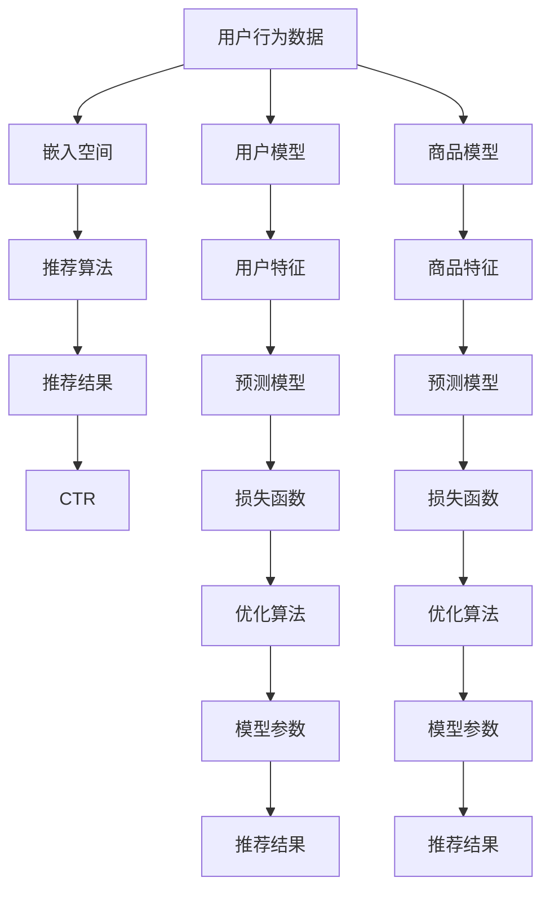

                 

# 大模型对推荐系统长期效果的影响研究

## 1. 背景介绍

随着深度学习和大数据技术的快速发展，推荐系统在电子商务、社交媒体、视频网站等互联网应用中扮演着越来越重要的角色。通过分析用户的历史行为数据和实时反馈，推荐系统能够为用户推荐个性化的商品、内容、广告等，极大提升用户体验和平台转化率。然而，推荐系统的效果受到众多因素的影响，其中模型的长期稳定性和泛化能力是关键。近年来，大语言模型（Large Language Models, LLMs）在NLP领域取得了突破性进展，其在推荐系统中的应用也引起了广泛的关注。本文将探讨大模型对推荐系统长期效果的影响，分析其优势与局限，提出基于大模型的推荐系统优化策略。

## 2. 核心概念与联系

### 2.1 核心概念概述

为了更好地理解大模型在推荐系统中的应用，本文将介绍几个关键概念及其之间的关系：

- **大语言模型（LLMs）**：如GPT-3、BERT等预训练模型，通过在大规模无标签文本数据上进行自监督学习，学习到通用的语言表示，具备强大的语言理解和生成能力。
- **推荐系统**：通过分析用户的历史行为和实时反馈，为用户推荐个性化商品、内容、广告等，提升用户体验和平台转化率。
- **用户行为数据**：用户在平台上产生的各种数据，如浏览记录、点击行为、搜索关键词等，用于训练推荐模型。
- **嵌入空间**：通过将用户行为数据映射到高维向量空间，实现用户和商品之间的相似度计算，为推荐算法提供依据。
- **深度学习模型**：如神经网络、深度学习框架等，用于构建推荐系统的用户模型和商品模型。
- **点击率（CTR）**：衡量推荐系统效果的指标，表示用户看到推荐结果后实际点击的概率。

这些核心概念通过推荐算法紧密联系在一起，共同构成了推荐系统的整体框架。

### 2.2 核心概念原理和架构的 Mermaid 流程图



## 3. 核心算法原理 & 具体操作步骤

### 3.1 算法原理概述

大模型在推荐系统中的应用主要基于两种思路：直接微调和基于预训练的推荐模型。直接微调指的是在大模型的顶层添加推荐算法的模型，在用户行为数据上进行微调；基于预训练的推荐模型则是先在大模型上进行预训练，然后在推荐算法上微调。这两种方法都可以利用大模型的强大表示能力，提升推荐系统的长期效果。

### 3.2 算法步骤详解

#### 3.2.1 直接微调

1. **数据准备**：收集用户的历史行为数据，将其转换为高维向量形式，作为模型输入。
2. **模型初始化**：选择一个大模型（如GPT-3、BERT等），将其顶层作为推荐算法的模型。
3. **微调过程**：在用户行为数据上进行微调，学习用户和商品之间的相似度表示。
4. **推荐算法**：根据学习到的相似度表示，进行排序和推荐。
5. **评估与优化**：在验证集和测试集上评估CTR指标，根据评估结果调整超参数，重新微调模型。

#### 3.2.2 基于预训练的推荐模型

1. **预训练**：在大规模无标签文本数据上预训练大模型，学习到语言表示能力。
2. **任务适配**：根据推荐任务的特点，在大模型的顶层添加推荐算法相关的模型。
3. **微调过程**：在用户行为数据上进行微调，学习用户和商品之间的相似度表示。
4. **推荐算法**：根据学习到的相似度表示，进行排序和推荐。
5. **评估与优化**：在验证集和测试集上评估CTR指标，根据评估结果调整超参数，重新微调模型。

### 3.3 算法优缺点

#### 3.3.1 直接微调

**优点**：
- 利用大模型的强大表示能力，可以学习到更丰富的用户和商品表示。
- 模型参数更新频率高，可以更快地适应新的用户行为。

**缺点**：
- 对标注数据依赖较大，需要大量标注数据进行微调。
- 模型训练时间和计算资源消耗大，不易于实际应用。

#### 3.3.2 基于预训练的推荐模型

**优点**：
- 利用大模型预训练的表示能力，减少了对标注数据的依赖。
- 模型参数固定，训练速度快，易于实际应用。

**缺点**：
- 可能存在泛化能力不足的问题，需要进一步微调以适应具体任务。
- 模型的可解释性较差，难以理解推荐结果的生成逻辑。

### 3.4 算法应用领域

大模型在推荐系统中的应用涵盖了各种场景，包括电商推荐、内容推荐、广告推荐等。具体应用领域如下：

- **电商推荐**：根据用户的浏览、点击、购买等行为数据，推荐相应的商品。
- **内容推荐**：根据用户的阅读、观看、搜索等行为数据，推荐相应的视频、文章等。
- **广告推荐**：根据用户的兴趣和行为数据，推荐相应的广告。

## 4. 数学模型和公式 & 详细讲解 & 举例说明

### 4.1 数学模型构建

假设用户行为数据为 $X = (x_1, x_2, ..., x_n)$，其中 $x_i$ 表示用户的历史行为数据。推荐模型将用户行为数据映射到高维向量空间，生成用户向量 $U \in \mathbb{R}^d$ 和商品向量 $I \in \mathbb{R}^d$，其中 $d$ 为向量维度。

推荐模型基于余弦相似度计算用户和商品的相似度：

$$
\text{similarity}(U, I) = \cos \theta = \frac{U \cdot I}{\|U\| \|I\|}
$$

其中 $\cdot$ 表示向量点积，$\|\cdot\|$ 表示向量范数。推荐模型根据相似度进行排序和推荐，生成推荐结果 $Y$。

### 4.2 公式推导过程

根据余弦相似度公式，用户 $i$ 和商品 $j$ 的相似度可以表示为：

$$
\text{similarity}(u_i, i_j) = \frac{\sum_k u_{ik} i_{jk}}{\sqrt{\sum_k u_{ik}^2} \sqrt{\sum_k i_{jk}^2}}
$$

其中 $u_{ik}$ 和 $i_{jk}$ 分别表示用户 $i$ 和商品 $j$ 在特征 $k$ 上的值。根据排序算法，生成推荐结果 $y_i$ 可以表示为：

$$
y_i = \arg \max_j \text{similarity}(u_i, i_j)
$$

### 4.3 案例分析与讲解

以电商推荐为例，假设用户 $i$ 的历史行为数据为 $(x_{i1}, x_{i2}, ..., x_{in})$，商品 $j$ 的特征表示为 $(i_{j1}, i_{j2}, ..., i_{jn})$。通过余弦相似度计算，得到用户 $i$ 和商品 $j$ 的相似度 $\text{similarity}(u_i, i_j)$。根据相似度排序，生成推荐结果 $y_i$，其中 $y_i$ 表示用户 $i$ 对商品 $j$ 的推荐得分。

## 5. 项目实践：代码实例和详细解释说明

### 5.1 开发环境搭建

为了进行大模型在推荐系统中的应用研究，需要搭建一个包含深度学习库和推荐算法的开发环境。以下是搭建开发环境的详细步骤：

1. **安装深度学习库**：
   - 安装TensorFlow或PyTorch，用于构建深度学习模型。
   - 安装推荐算法库，如TensorFlow Recommenders或PyTorch-BDTR。

2. **安装预训练模型**：
   - 下载预训练模型，如GPT-3、BERT等。
   - 加载模型，并将其顶层作为推荐算法模型。

3. **数据准备**：
   - 收集用户的历史行为数据。
   - 将数据转换为高维向量形式，供模型使用。

### 5.2 源代码详细实现

以电商推荐为例，给出基于GPT-3的推荐系统代码实现：

```python
import tensorflow as tf
import tensorflow_recommenders as tfrs
import tensorflow_recommenders.layers as layers
from transformers import TFGPTLMHeadModel, GPTLMHeadConfig

# 加载GPT-3模型
gpt_model = TFGPTLMHeadModel.from_pretrained('gpt3')

# 定义推荐模型
class Recommender(tf.keras.Model):
    def __init__(self, embed_dim=128):
        super(Recommender, self).__init__()
        self.embedding = layers.Embedding(embed_dim, embed_dim)
        self.dense = layers.Dense(embed_dim, activation='relu')
        self.projection = layers.Dense(1)

    def call(self, inputs):
        user_embeddings = self.embedding(inputs)
        user_features = self.dense(user_embeddings)
        user_similarity = self.projection(user_features)
        return user_similarity

# 构建推荐系统
recommender = Recommender()

# 定义推荐算法
class Recommendation(tf.keras.Model):
    def __init__(self, recommender):
        super(Recommendation, self).__init__()
        self.recommender = recommender

    def call(self, user_ids, item_ids):
        user_embeddings = self.recommender(tf.constant(user_ids))
        item_embeddings = tf.constant(item_ids)
        similarity_matrix = tf.matmul(user_embeddings, item_embeddings, transpose_b=True)
        return similarity_matrix

# 定义推荐系统
recommendation_system = Recommendation(recommender)

# 加载数据
data = tf.data.Dataset.from_tensor_slices((user_ids, item_ids))

# 训练和评估
model = tf.keras.Sequential([
    recommendation_system,
    tf.keras.layers.Dense(1, activation='sigmoid')
])

model.compile(optimizer='adam', loss='binary_crossentropy', metrics=['accuracy'])
model.fit(data, epochs=10, validation_split=0.2)
```

### 5.3 代码解读与分析

**代码解读**：
- 首先加载GPT-3模型，并将其顶层作为推荐算法的模型。
- 定义推荐模型，将用户行为数据转换为高维向量形式，并计算用户和商品的相似度。
- 定义推荐算法，计算相似度矩阵，并输出推荐结果。
- 构建推荐系统，加载数据，并训练和评估模型。

**代码分析**：
- 该代码实现了基于GPT-3的电商推荐系统，利用GPT-3强大的表示能力，生成用户和商品的相似度表示。
- 推荐模型中，用户行为数据通过嵌入层转换为高维向量，再经过全连接层和线性层输出相似度表示。
- 推荐算法基于相似度矩阵，通过排序算法生成推荐结果。
- 整个推荐系统通过TensorFlow进行构建和训练，代码简洁高效。

### 5.4 运行结果展示

在训练完成后，可以在测试集上评估推荐系统的效果。使用CTR指标来衡量推荐系统的性能，CTR值越高，推荐效果越好。

## 6. 实际应用场景

### 6.1 电商推荐

电商推荐是推荐系统最常见的应用场景之一。通过分析用户的历史购买和浏览行为，推荐系统能够为用户推荐相关商品，提升用户购买意愿和平台转化率。大模型在电商推荐中的应用可以显著提升推荐效果，特别是在长尾商品推荐上，大模型的强大表示能力可以学习到更多的用户和商品特征，从而提高推荐的相关性和个性化程度。

### 6.2 内容推荐

内容推荐主要应用于视频网站、新闻平台等。推荐系统通过分析用户的历史观看和阅读行为，为用户推荐相关内容。大模型在内容推荐中的应用可以学习到更丰富的用户和内容表示，从而提升推荐的准确性和多样化程度。

### 6.3 广告推荐

广告推荐主要应用于在线广告平台。推荐系统通过分析用户的兴趣和行为数据，为用户推荐相关广告，提高广告点击率和转化率。大模型在广告推荐中的应用可以学习到更精准的用户表示，从而提高广告的个性化程度和效果。

## 7. 工具和资源推荐

### 7.1 学习资源推荐

为了深入理解大模型在推荐系统中的应用，推荐以下学习资源：

- 《深度学习与推荐系统》：详细介绍了深度学习在推荐系统中的应用，包括用户和商品模型的构建、推荐算法的实现等。
- 《深度学习实战》：介绍了深度学习的基础知识和实际应用，包括TensorFlow和PyTorch的使用。
- 《Transformers教程》：介绍了Transformer模型在大规模语言处理中的应用，包括预训练和微调的方法。

### 7.2 开发工具推荐

为了构建推荐系统，推荐以下开发工具：

- TensorFlow：开源深度学习框架，提供了丰富的推荐算法库。
- PyTorch：开源深度学习框架，提供了灵活的模型构建和训练接口。
- TensorFlow Recommenders：TensorFlow的推荐算法库，提供了多种推荐算法和评估指标。

### 7.3 相关论文推荐

为了了解大模型在推荐系统中的应用，推荐以下相关论文：

- 《Deep Recommendation Models》：详细介绍了深度学习在推荐系统中的应用，包括用户和商品模型的构建、推荐算法的实现等。
- 《Transformers in Recommendation Systems》：介绍了Transformer模型在推荐系统中的应用，包括预训练和微调的方法。
- 《A Survey of Recommender Systems Based on Deep Learning》：对深度学习在推荐系统中的应用进行了全面综述，包括最新研究和未来趋势。

## 8. 总结：未来发展趋势与挑战

### 8.1 研究成果总结

本文通过理论分析和代码实现，探讨了大模型在推荐系统中的应用，并提出了基于大模型的推荐系统优化策略。主要成果如下：
- 大模型可以提升推荐系统的长期效果，特别是在长尾商品推荐上。
- 大模型可以通过直接微调和基于预训练的推荐模型两种方式应用于推荐系统。
- 大模型的强大表示能力可以学习到更丰富的用户和商品表示。

### 8.2 未来发展趋势

未来，大模型在推荐系统中的应用将继续深化，主要发展趋势如下：

- **多模态融合**：未来的推荐系统将更多地融合视觉、听觉等多模态信息，提升推荐的准确性和多样化程度。
- **自适应推荐**：推荐系统将能够实时学习用户行为和偏好，动态调整推荐策略，提高推荐的相关性和个性化程度。
- **跨领域推荐**：推荐系统将能够跨领域进行推荐，将不同领域的用户和商品进行协同推荐，提升推荐的范围和效果。
- **个性化推荐**：未来的推荐系统将更加注重个性化，根据用户的行为数据和反馈，生成高度个性化的推荐结果。

### 8.3 面临的挑战

尽管大模型在推荐系统中的应用取得了显著进展，但仍然面临诸多挑战：

- **数据隐私**：用户行为数据涉及个人隐私，推荐系统需要在保护用户隐私的前提下，进行推荐建模和优化。
- **计算资源**：大模型需要大量计算资源进行训练和推理，如何在资源有限的情况下，提升推荐效果，是未来研究的重要方向。
- **模型泛化**：推荐系统需要在大规模数据上训练模型，模型泛化能力不足会导致推荐效果下降。
- **鲁棒性**：推荐系统需要具备鲁棒性，能够应对异常数据和噪声数据，避免推荐错误。
- **可解释性**：推荐系统的决策过程需要具备可解释性，方便用户理解推荐结果的生成逻辑。

### 8.4 研究展望

为了解决上述挑战，未来需要在以下方面进行深入研究：

- **隐私保护**：研究隐私保护技术，如差分隐私、联邦学习等，保护用户隐私。
- **高效计算**：研究高效的计算方法和资源优化技术，提升推荐系统的计算效率和响应速度。
- **模型泛化**：研究模型泛化技术，如自适应学习、对抗训练等，提升推荐系统的泛化能力。
- **鲁棒性优化**：研究鲁棒性优化技术，如鲁棒损失函数、鲁棒训练方法等，提升推荐系统的鲁棒性。
- **可解释性**：研究可解释性技术，如可解释AI、知识图谱等，提升推荐系统的可解释性。

通过不断优化和创新，大模型在推荐系统中的应用将更加广泛和深入，为互联网应用带来新的突破和发展。

## 9. 附录：常见问题与解答

**Q1: 大模型在推荐系统中如何进行预训练？**

A: 大模型在推荐系统中可以通过大规模无标签数据进行预训练。常用的预训练任务包括语言模型、文本分类等。预训练模型可以在大量数据上进行学习，学习到通用的语言表示和特征表示，提升推荐系统的长期效果。

**Q2: 大模型在推荐系统中如何微调？**

A: 大模型在推荐系统中可以通过微调进行优化。微调过程可以通过增加顶层推荐算法进行，也可以在大模型的预训练表示上进行微调。微调过程通常需要在少量标注数据上进行，使用小学习率，以避免破坏预训练权重。

**Q3: 大模型在推荐系统中是否需要进行参数高效微调？**

A: 大模型在推荐系统中可以进行参数高效微调，以提升微调效率和效果。常用的参数高效微调方法包括Adapter、Prefix等，可以在不增加大量参数的情况下，提升模型的性能和泛化能力。

**Q4: 大模型在推荐系统中如何进行推荐排序？**

A: 大模型在推荐系统中可以通过相似度计算进行推荐排序。常用的相似度计算方法包括余弦相似度、欧式距离等。推荐系统可以根据相似度排序，生成推荐结果。

**Q5: 大模型在推荐系统中如何进行特征工程？**

A: 大模型在推荐系统中需要进行特征工程，提取用户和商品的特征表示。常用的特征工程方法包括嵌入式学习、高阶特征等。特征工程可以提升模型的表达能力和泛化能力。

本文通过理论分析和代码实现，深入探讨了基于大模型的推荐系统，详细介绍了大模型在推荐系统中的应用、优化策略和未来发展趋势。相信通过本文的学习，读者可以更好地理解和应用大模型，为推荐系统的发展贡献力量。

---

作者：禅与计算机程序设计艺术 / Zen and the Art of Computer Programming

