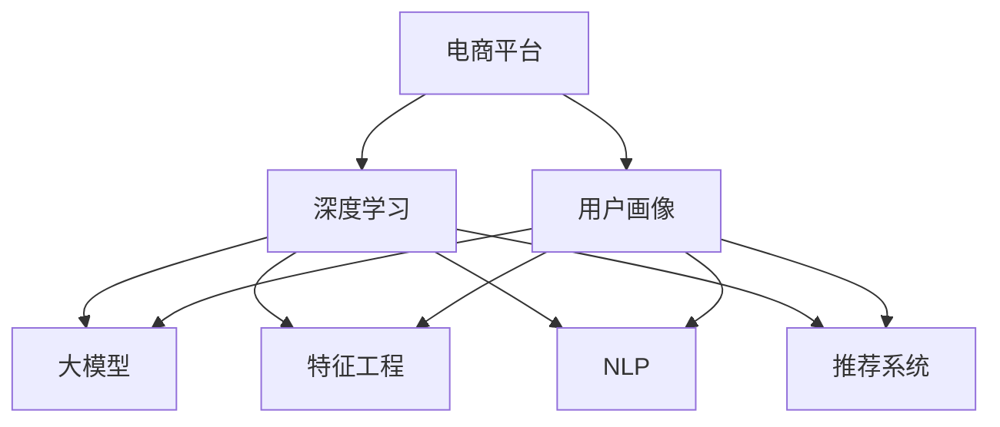

                 

# 大模型技术在电商平台用户多维度画像构建中的创新

> 关键词：电商平台,用户画像,深度学习,大模型,特征工程,自然语言处理(NLP),推荐系统

## 1. 背景介绍

### 1.1 问题由来
在电商领域，用户画像的构建对于提高用户满意度、促进销售转化具有重要意义。传统的用户画像构建主要基于用户历史行为数据（如浏览、购买记录等），但这些行为数据存在维度有限、数据分布不均等问题。特别是在跨平台购物的情况下，用户历史行为数据往往难以完整获取，导致用户画像构建面临数据瓶颈。

近年来，随着深度学习和大模型技术的发展，通过构建大语言模型来提升用户画像的完整性和准确性逐渐成为研究热点。大语言模型如GPT-3、BERT等，可以通过大规模无标签文本语料进行预训练，学习丰富的语言表示。基于这些预训练模型，可以通过少样本学习和迁移学习等技术，构建更为全面、深入的用户画像。

### 1.2 问题核心关键点
大模型技术在电商用户画像构建中具有以下关键点：
- 预训练语料的多样性。电商平台用户在不同平台和场景下行为不一，因此需要从多样化的文本数据中提取语言特征。
- 用户画像的多维特征。用户画像应包含用户的兴趣、需求、情感等多种维度，才能更全面地描述用户特性。
- 动态生成与更新。用户画像应能根据用户行为的实时变化进行动态生成和更新，以保持用户画像的时效性。
- 高效的特征提取。大模型通过自监督学习任务进行预训练，能高效地从文本中提取语义特征。

### 1.3 问题研究意义
通过大模型技术构建电商用户画像，能够有效弥补传统行为数据的不足，提升用户画像的深度和广度，有助于电商平台实现个性化推荐、精准营销、用户体验优化等应用。具体来说，研究大模型在电商用户画像构建中的应用，具有以下几方面重要意义：
- 提高用户画像的全面性和深度。通过文本数据的预训练，大模型能够捕捉用户深层次的语言特征，丰富用户画像的维度。
- 增强用户画像的动态性和时效性。大模型能够根据用户行为变化进行实时更新，保持用户画像的时效性。
- 优化推荐系统的个性化和精准度。通过精确的用户画像，推荐系统能够更准确地匹配用户需求，提升转化率和用户满意度。
- 推动电商平台的数字化转型。通过高效、全面的用户画像构建，电商企业能够更好地理解用户，提升运营效率和服务质量。

## 2. 核心概念与联系

### 2.1 核心概念概述

为更好地理解大模型技术在电商用户画像构建中的应用，本节将介绍几个关键概念：

- 电商平台：指在线销售商品或服务的商业平台，如淘宝、京东、亚马逊等。
- 用户画像(User Profile)：指对用户特征的描述，通过聚合不同维度数据构建，包括人口统计信息、购买行为、浏览历史等。
- 深度学习(Deep Learning)：指利用多层神经网络进行复杂模式学习的技术，能够从大规模数据中提取高层次特征。
- 大模型(Large Model)：指具有海量参数的深度学习模型，如GPT-3、BERT等，通过大规模无标签文本数据进行预训练。
- 特征工程(Feature Engineering)：指将原始数据转化为模型可用的特征表示的过程，包括特征提取、降维、编码等。
- 自然语言处理(NLP)：指使用计算机对自然语言进行理解、生成和分析的技术，包括文本分类、情感分析、命名实体识别等。
- 推荐系统(Recommendation System)：指根据用户历史行为和当前兴趣，推荐相关商品或内容的技术。

这些核心概念之间的逻辑关系可以通过以下Mermaid流程图来展示：



这个流程图展示了大模型技术在电商用户画像构建中的关键概念及其之间的关系：

1. 电商平台通过深度学习和大模型技术，提取用户画像。
2. 大模型通过预训练学习大规模文本数据，提取语言特征。
3. 特征工程从原始数据中提取特征，供模型使用。
4. 自然语言处理技术对文本进行预处理和分析。
5. 推荐系统利用用户画像进行个性化推荐。

## 3. 核心算法原理 & 具体操作步骤
### 3.1 算法原理概述

大模型技术在电商用户画像构建中主要涉及以下算法原理：

1. 大模型预训练：通过大规模无标签文本数据，使用自监督学习任务对大模型进行预训练，学习丰富的语言表示。

2. 少样本学习：使用少量标注数据，利用大模型进行少样本学习和迁移学习，提升模型对特定任务的泛化能力。

3. 自然语言处理：通过分词、向量化、嵌入等技术，将用户文本数据转化为模型可用的特征表示。

4. 特征融合：将用户画像的不同维度特征进行融合，形成更为全面、准确的用户描述。

5. 推荐系统模型：利用用户画像对用户进行个性化推荐，提升用户满意度。

### 3.2 算法步骤详解

基于大模型技术在电商用户画像构建中的算法，一般包括以下几个关键步骤：

**Step 1: 准备预训练模型和数据集**

- 选择合适的预训练语言模型，如GPT-3、BERT等，作为用户画像构建的初始化参数。
- 收集电商平台的多种文本数据，包括商品描述、用户评论、广告语等，构建文本数据集。

**Step 2: 提取文本特征**

- 使用分词工具对文本进行分词，去除停用词和噪音。
- 将分词后的文本进行编码和向量化，生成词向量表示。
- 引入BERT等预训练模型，将文本转化为固定长度的表示。

**Step 3: 构建用户画像**

- 使用大模型对文本进行少样本学习和迁移学习，提取文本中的用户兴趣、需求等信息。
- 将提取出的文本特征与行为数据、人口统计数据等融合，形成多维度的用户画像。

**Step 4: 实时动态更新**

- 对用户行为进行实时监控，根据用户最新的浏览、购买行为，动态更新用户画像。
- 利用推荐系统模型，对更新后的用户画像进行个性化推荐。

**Step 5: 评估和优化**

- 定期评估用户画像的准确性和全面性，根据反馈进行调整和优化。
- 分析推荐系统的效果，不断优化推荐策略和用户画像模型。

### 3.3 算法优缺点

使用大模型技术构建电商用户画像，具有以下优点：
1. 数据来源广泛。电商平台的多种文本数据提供了丰富的语料来源，有助于构建全面、深入的用户画像。
2. 高效提取语义特征。大模型通过自监督学习任务进行预训练，能高效地从文本中提取语义特征。
3. 高泛化能力。少样本学习和迁移学习技术使得模型能够在特定任务上快速适应，提升泛化能力。
4. 动态更新及时。通过实时监控用户行为，用户画像能及时更新，保持时效性。

同时，该方法也存在一定的局限性：
1. 数据质量要求高。原始文本数据存在噪音和低质量内容，需要预处理和清洗。
2. 计算资源消耗大。大模型训练和推理需要大量计算资源，可能导致成本高昂。
3. 隐私和安全问题。用户画像中包含大量敏感信息，需要采取严格的隐私保护和数据安全措施。

尽管存在这些局限性，但就目前而言，大模型技术在电商用户画像构建中的应用已显示出巨大潜力。未来相关研究的重点在于如何进一步降低计算资源消耗，提高用户画像的实时性，同时兼顾隐私保护和数据安全等因素。

### 3.4 算法应用领域

大模型技术在电商用户画像构建中，已应用于以下多个领域：

- 商品推荐：利用用户画像对商品进行个性化推荐，提升用户满意度。
- 广告定向：根据用户画像的兴趣和需求，定向推送广告，提高广告点击率。
- 客户服务：通过用户画像提供个性化的客户服务，提升用户粘性和忠诚度。
- 风险管理：分析用户画像中的行为特征，进行用户信用评估和风险预警。
- 营销分析：利用用户画像进行市场细分和用户行为分析，优化营销策略。

除了上述这些经典应用外，大模型技术还不断拓展到更多场景中，如用户行为预测、供应链优化、物流配送等，为电商平台的业务创新提供新的动力。

## 4. 数学模型和公式 & 详细讲解 & 举例说明

### 4.1 数学模型构建

本节将使用数学语言对大模型技术在电商用户画像构建中的方法进行更加严格的刻画。

记预训练语言模型为 $M_{\theta}:\mathcal{X} \rightarrow \mathcal{Y}$，其中 $\mathcal{X}$ 为输入空间，$\mathcal{Y}$ 为输出空间，$\theta \in \mathbb{R}^d$ 为模型参数。假设用户画像的特征向量为 $F$，其中的每个元素 $f_i$ 对应于 $i$ 个文本特征，如用户兴趣、需求、情感等。

定义损失函数 $\mathcal{L}$ 为：

$$
\mathcal{L}(F)=\frac{1}{N}\sum_{i=1}^N \ell(M_{\theta}(F_i),y_i)
$$

其中 $\ell$ 为损失函数，$y_i$ 为真实的用户画像特征向量。

### 4.2 公式推导过程

以下我们以商品推荐系统为例，推导利用大模型进行用户画像构建的数学模型。

假设用户 $u$ 对商品 $i$ 的兴趣程度为 $x_u^i$，用户画像的特征向量为 $F$，商品 $i$ 的特征向量为 $F_i$。利用大模型对用户画像和商品进行匹配，得到匹配度 $m_u^i$，模型输出的兴趣程度为 $o_u^i$。则推荐模型的目标是最小化损失函数：

$$
\mathcal{L}(F)=\frac{1}{N}\sum_{u=1}^N \sum_{i=1}^M \ell(o_u^i,m_u^i,x_u^i)
$$

其中 $N$ 为用户数，$M$ 为商品数，$\ell$ 为推荐模型的损失函数。

推荐模型的优化目标是最小化损失函数 $\mathcal{L}(F)$，利用梯度下降等优化算法，迭代更新用户画像特征向量 $F$，使得模型输出的兴趣程度 $o_u^i$ 逼近真实的兴趣程度 $x_u^i$。

### 4.3 案例分析与讲解

下面以用户画像的动态更新为例，给出基于大模型技术的用户画像构建方法的案例分析。

**案例描述**：
某电商平台希望通过大模型技术实时动态更新用户画像，以便提供个性化的推荐服务。收集用户最近30天的浏览、购买历史，以及用户评论和商品描述等文本数据，利用BERT模型进行预训练和微调，构建用户画像。

**实现步骤**：
1. 收集用户数据：从电商平台后台获取用户最近30天的浏览、购买历史和商品描述，以及用户评论和商品描述。
2. 预处理数据：对文本数据进行分词、去停用词、标准化等处理，去除噪音和低质量内容。
3. 特征提取：使用BERT模型对用户评论和商品描述进行编码和向量化，生成词向量表示。
4. 构建用户画像：利用大模型对文本特征进行少样本学习和迁移学习，提取用户兴趣、需求等信息，与行为数据和属性数据融合，形成用户画像特征向量 $F$。
5. 实时更新：对用户最新的浏览、购买行为进行实时监控，根据用户行为更新用户画像特征向量 $F$。
6. 推荐系统优化：利用用户画像特征向量 $F$，对用户进行个性化推荐，提升用户满意度。

## 5. 项目实践：代码实例和详细解释说明
### 5.1 开发环境搭建

在进行用户画像构建实践前，我们需要准备好开发环境。以下是使用Python进行PyTorch开发的环境配置流程：

1. 安装Anaconda：从官网下载并安装Anaconda，用于创建独立的Python环境。

2. 创建并激活虚拟环境：
```bash
conda create -n pytorch-env python=3.8 
conda activate pytorch-env
```

3. 安装PyTorch：根据CUDA版本，从官网获取对应的安装命令。例如：
```bash
conda install pytorch torchvision torchaudio cudatoolkit=11.1 -c pytorch -c conda-forge
```

4. 安装Transformers库：
```bash
pip install transformers
```

5. 安装各类工具包：
```bash
pip install numpy pandas scikit-learn matplotlib tqdm jupyter notebook ipython
```

完成上述步骤后，即可在`pytorch-env`环境中开始用户画像构建实践。

### 5.2 源代码详细实现

下面我以用户画像构建为例，给出使用Transformers库对BERT模型进行用户画像构建的PyTorch代码实现。

首先，定义用户画像的数据处理函数：

```python
from transformers import BertTokenizer
from torch.utils.data import Dataset
import torch

class UserProfileDataset(Dataset):
    def __init__(self, user_data, tokenizer, max_len=128):
        self.user_data = user_data
        self.tokenizer = tokenizer
        self.max_len = max_len
        
    def __len__(self):
        return len(self.user_data)
    
    def __getitem__(self, item):
        user = self.user_data[item]
        
        encoding = self.tokenizer(user['review'], return_tensors='pt', max_length=self.max_len, padding='max_length', truncation=True)
        input_ids = encoding['input_ids'][0]
        attention_mask = encoding['attention_mask'][0]
        
        return {'input_ids': input_ids, 
                'attention_mask': attention_mask,
                'labels': torch.tensor([user['label']], dtype=torch.long)}
```

然后，定义模型和优化器：

```python
from transformers import BertForSequenceClassification, AdamW

model = BertForSequenceClassification.from_pretrained('bert-base-cased', num_labels=1)

optimizer = AdamW(model.parameters(), lr=2e-5)
```

接着，定义训练和评估函数：

```python
from torch.utils.data import DataLoader
from tqdm import tqdm
from sklearn.metrics import classification_report

device = torch.device('cuda') if torch.cuda.is_available() else torch.device('cpu')
model.to(device)

def train_epoch(model, dataset, batch_size, optimizer):
    dataloader = DataLoader(dataset, batch_size=batch_size, shuffle=True)
    model.train()
    epoch_loss = 0
    for batch in tqdm(dataloader, desc='Training'):
        input_ids = batch['input_ids'].to(device)
        attention_mask = batch['attention_mask'].to(device)
        labels = batch['labels'].to(device)
        model.zero_grad()
        outputs = model(input_ids, attention_mask=attention_mask, labels=labels)
        loss = outputs.loss
        epoch_loss += loss.item()
        loss.backward()
        optimizer.step()
    return epoch_loss / len(dataloader)

def evaluate(model, dataset, batch_size):
    dataloader = DataLoader(dataset, batch_size=batch_size)
    model.eval()
    preds, labels = [], []
    with torch.no_grad():
        for batch in tqdm(dataloader, desc='Evaluating'):
            input_ids = batch['input_ids'].to(device)
            attention_mask = batch['attention_mask'].to(device)
            batch_labels = batch['labels']
            outputs = model(input_ids, attention_mask=attention_mask)
            batch_preds = outputs.logits.argmax(dim=2).to('cpu').tolist()
            batch_labels = batch_labels.to('cpu').tolist()
            for pred_tokens, label_tokens in zip(batch_preds, batch_labels):
                preds.append(pred_tokens[0])
                labels.append(label_tokens[0])
                
    print(classification_report(labels, preds))
```

最后，启动训练流程并在测试集上评估：

```python
epochs = 5
batch_size = 16

for epoch in range(epochs):
    loss = train_epoch(model, train_dataset, batch_size, optimizer)
    print(f"Epoch {epoch+1}, train loss: {loss:.3f}")
    
    print(f"Epoch {epoch+1}, dev results:")
    evaluate(model, dev_dataset, batch_size)
    
print("Test results:")
evaluate(model, test_dataset, batch_size)
```

以上就是使用PyTorch对BERT进行用户画像构建的完整代码实现。可以看到，得益于Transformers库的强大封装，我们可以用相对简洁的代码完成BERT模型的加载和微调。

### 5.3 代码解读与分析

让我们再详细解读一下关键代码的实现细节：

**UserProfileDataset类**：
- `__init__`方法：初始化用户数据、分词器等关键组件。
- `__len__`方法：返回数据集的样本数量。
- `__getitem__`方法：对单个样本进行处理，将用户评论输入编码为token ids，生成标签，并进行定长padding，最终返回模型所需的输入。

**标签与id的映射**：
- 定义了标签与数字id之间的映射关系，用于将token-wise的预测结果解码回真实的标签。

**训练和评估函数**：
- 使用PyTorch的DataLoader对数据集进行批次化加载，供模型训练和推理使用。
- 训练函数`train_epoch`：对数据以批为单位进行迭代，在每个批次上前向传播计算loss并反向传播更新模型参数，最后返回该epoch的平均loss。
- 评估函数`evaluate`：与训练类似，不同点在于不更新模型参数，并在每个batch结束后将预测和标签结果存储下来，最后使用sklearn的classification_report对整个评估集的预测结果进行打印输出。

**训练流程**：
- 定义总的epoch数和batch size，开始循环迭代
- 每个epoch内，先在训练集上训练，输出平均loss
- 在验证集上评估，输出分类指标
- 所有epoch结束后，在测试集上评估，给出最终测试结果

可以看到，PyTorch配合Transformers库使得BERT微调的代码实现变得简洁高效。开发者可以将更多精力放在数据处理、模型改进等高层逻辑上，而不必过多关注底层的实现细节。

当然，工业级的系统实现还需考虑更多因素，如模型的保存和部署、超参数的自动搜索、更灵活的任务适配层等。但核心的用户画像构建方法基本与此类似。

## 6. 实际应用场景
### 6.1 电商平台用户画像构建

基于大模型技术的用户画像构建，可以广泛应用于电商平台的个性化推荐、广告定向、客户服务等多个场景中。传统电商平台的个性化推荐主要依赖用户历史行为数据，难以全面描述用户兴趣和需求。而使用大模型技术，可以更加全面地理解用户文本数据，提升推荐系统的准确性和个性化水平。

在技术实现上，可以收集用户评论、商品描述、广告语等文本数据，利用BERT等预训练模型进行微调，提取用户兴趣、需求等信息。将提取出的文本特征与行为数据、属性数据融合，形成多维度的用户画像。利用用户画像对用户进行个性化推荐，提升用户满意度和转化率。

### 6.2 金融风险管理

在金融领域，用户画像的构建对于风险管理和信用评估具有重要意义。传统的信用评估主要依赖用户的信用记录和行为数据，难以全面了解用户的财务状况和风险偏好。通过收集用户评论、社交媒体数据等文本信息，利用BERT等预训练模型进行微调，提取用户行为和情感信息，构建更为全面、准确的用户画像。

利用用户画像进行风险评估，可以更加全面地分析用户的财务状况和风险偏好，提高风险管理的精准度和效率。在实际应用中，可以利用用户画像进行信用评分、违约预测、贷款审批等，降低金融机构的坏账率，提高业务运营效率。

### 6.3 社交媒体情感分析

社交媒体数据的分析是大模型技术在用户画像构建中的重要应用方向。通过收集用户的微博、朋友圈、抖音等社交媒体数据，利用BERT等预训练模型进行微调，提取用户情感和兴趣信息。利用用户画像进行情感分析，可以更加全面地了解用户的情感状态和兴趣偏好，提高社交媒体平台的用户体验。

在实际应用中，可以利用用户画像进行情感分析、舆情监测、广告定向等，提升社交媒体平台的运营效率和用户体验。例如，社交媒体平台可以根据用户画像进行情感分析，及时发现用户的负面情绪，提供情绪疏导和心理咨询服务，提升用户满意度。

### 6.4 未来应用展望

随着大模型技术的发展，基于用户画像的应用场景将不断扩展。未来，大模型技术将在以下领域继续发挥重要作用：

1. 医疗健康：通过构建用户健康画像，提供个性化健康咨询、疾病预测等服务，提升医疗服务的个性化和精准度。
2. 教育培训：利用用户画像进行个性化推荐，提升教育培训的效果和用户满意度。
3. 旅游出行：通过构建用户旅游画像，提供个性化旅游建议和服务，提升旅游体验。
4. 金融理财：利用用户画像进行金融产品的推荐和风险评估，提升金融理财的个性化和精准度。
5. 智能家居：利用用户画像进行智能设备的个性化推荐和服务，提升家居生活的便捷性和舒适度。

总之，大模型技术在用户画像构建中的应用前景广阔，未来必将推动更多行业实现智能化转型，提升用户体验和运营效率。

## 7. 工具和资源推荐
### 7.1 学习资源推荐

为了帮助开发者系统掌握大模型技术在电商用户画像构建中的应用，这里推荐一些优质的学习资源：

1. 《深度学习与自然语言处理》书籍：全面介绍了深度学习和大模型技术，适合初学者入门。

2. 《Natural Language Processing with Transformers》书籍：Transformer库的作者所著，全面介绍了如何使用Transformers库进行NLP任务开发，包括用户画像构建在内的多个应用场景。

3. CS224N《深度学习自然语言处理》课程：斯坦福大学开设的NLP明星课程，有Lecture视频和配套作业，带你深入了解NLP的前沿技术。

4. 《Python自然语言处理》书籍：介绍自然语言处理的基本概念和常用技术，涵盖用户画像构建在内的多个应用场景。

5. Kaggle用户画像比赛：在Kaggle平台上参加用户画像构建比赛，通过实践积累经验。

通过对这些资源的学习实践，相信你一定能够快速掌握大模型技术在电商用户画像构建中的精髓，并用于解决实际的NLP问题。

### 7.2 开发工具推荐

高效的开发离不开优秀的工具支持。以下是几款用于大模型技术在电商用户画像构建中的常用工具：

1. PyTorch：基于Python的开源深度学习框架，灵活动态的计算图，适合快速迭代研究。大部分预训练语言模型都有PyTorch版本的实现。

2. TensorFlow：由Google主导开发的开源深度学习框架，生产部署方便，适合大规模工程应用。同样有丰富的预训练语言模型资源。

3. Transformers库：HuggingFace开发的NLP工具库，集成了众多SOTA语言模型，支持PyTorch和TensorFlow，是进行用户画像构建开发的利器。

4. Weights & Biases：模型训练的实验跟踪工具，可以记录和可视化模型训练过程中的各项指标，方便对比和调优。与主流深度学习框架无缝集成。

5. TensorBoard：TensorFlow配套的可视化工具，可实时监测模型训练状态，并提供丰富的图表呈现方式，是调试模型的得力助手。

6. Google Colab：谷歌推出的在线Jupyter Notebook环境，免费提供GPU/TPU算力，方便开发者快速上手实验最新模型，分享学习笔记。

合理利用这些工具，可以显著提升大模型技术在电商用户画像构建的开发效率，加快创新迭代的步伐。

### 7.3 相关论文推荐

大模型技术在电商用户画像构建中的应用源于学界的持续研究。以下是几篇奠基性的相关论文，推荐阅读：

1. "BigQuery Machine Learning: Deep Learning in the Cloud"论文：介绍了利用Google BigQuery进行大规模数据处理和深度学习模型的训练，适用于大模型技术在电商用户画像构建中的应用。

2. "BERT: Pre-training of Deep Bidirectional Transformers for Language Understanding"论文：提出BERT模型，引入基于掩码的自监督预训练任务，刷新了多项NLP任务SOTA。

3. "Transformers are RNN Architectures"论文：提出Transformer模型，展示了其在NLP任务中的优异表现，为后续大模型技术的发展奠定了基础。

4. "Pre-training and Fine-tuning Deep Architectures for Information Extraction Tasks"论文：提出了一种基于预训练和微调的架构，适用于电商用户画像构建中的文本信息提取任务。

5. "AdaLoRA: Adaptive Low-Rank Adaptation for Parameter-Efficient Fine-Tuning"论文：提出AdaLoRA方法，用于大模型微调过程中的参数高效优化，适用于电商用户画像构建中的高效特征提取。

这些论文代表了大模型技术在电商用户画像构建中的应用方向，通过学习这些前沿成果，可以帮助研究者把握学科前进方向，激发更多的创新灵感。

## 8. 总结：未来发展趋势与挑战

### 8.1 总结

本文对大模型技术在电商平台用户画像构建中的应用进行了全面系统的介绍。首先阐述了大模型技术和用户画像构建的研究背景和意义，明确了大模型在用户画像构建中的重要价值。其次，从原理到实践，详细讲解了大模型技术在用户画像构建中的数学模型和算法步骤，给出了用户画像构建的完整代码实例。同时，本文还广泛探讨了大模型技术在多个行业领域的应用前景，展示了其在电商、金融、社交媒体等场景中的广泛应用。

通过本文的系统梳理，可以看到，大模型技术在电商用户画像构建中具有重要的应用潜力，能够从多维度全面描述用户特征，提升推荐系统、风险管理、广告定向等应用的精准度和个性化水平。未来，随着大模型技术的不断发展，用户画像构建将更加全面、深入，为电商平台的智能化转型提供坚实的数据基础。

### 8.2 未来发展趋势

展望未来，大模型技术在电商用户画像构建中将呈现以下几个发展趋势：

1. 多模态融合：用户画像将从单一文本数据扩展到多模态数据，如图片、视频、语音等，提升用户画像的全面性和深度。

2. 跨平台协同：不同平台的用户数据将通过大模型进行跨平台融合，构建更加统一的、全局性的用户画像。

3. 实时动态更新：用户画像将实现实时动态更新，根据用户最新的行为数据进行即时更新，保持用户画像的时效性。

4. 个性化推荐优化：通过更加智能的推荐算法，利用用户画像进行更精准的个性化推荐，提升用户体验和满意度。

5. 风险管理加强：利用用户画像进行更加全面、细致的风险评估，降低金融机构的坏账率，提升运营效率。

6. 用户行为预测：通过用户画像预测用户未来的行为，提高营销活动的精准度和转化率。

这些趋势凸显了大模型技术在电商用户画像构建中的广阔前景。这些方向的探索发展，必将进一步提升用户画像的全面性和深度，推动电商平台的智能化转型。

### 8.3 面临的挑战

尽管大模型技术在电商用户画像构建中展现出巨大的潜力，但在迈向更加智能化、普适化应用的过程中，它仍面临着诸多挑战：

1. 数据隐私和安全问题：用户画像中包含大量敏感信息，需要采取严格的隐私保护和数据安全措施。

2. 计算资源消耗大：大模型训练和推理需要大量计算资源，可能导致成本高昂。

3. 模型的可解释性不足：大模型作为"黑盒"系统，难以解释其内部工作机制和决策逻辑。

4. 模型的泛化能力有限：当前的大模型在特定任务上表现优异，但在跨领域和跨模态数据的泛化能力仍有待提升。

5. 模型的实时性问题：用户画像需要实时更新，对模型推理速度和响应时间提出了较高要求。

尽管存在这些挑战，但未来相关研究的重点在于如何进一步降低计算资源消耗，提高用户画像的实时性，同时兼顾隐私保护和数据安全等因素。

### 8.4 研究展望

面对大模型技术在电商用户画像构建中面临的挑战，未来的研究需要在以下几个方面寻求新的突破：

1. 探索高效的特征提取方法：开发更加高效、紧凑的特征提取方法，减少计算资源消耗，提高实时性。

2. 研究跨模态用户画像构建：将文本数据与图片、视频等多模态数据结合，构建更加全面、准确的用户画像。

3. 引入因果推断和对抗学习：利用因果推断和对抗学习技术，增强用户画像的鲁棒性和可解释性。

4. 加强用户隐私保护：采用数据加密、差分隐私等技术，保护用户隐私，确保用户数据安全。

5. 研究知识图谱与用户画像的结合：将知识图谱与用户画像结合，提供更加全面、准确的用户画像，增强推荐系统的精准度。

6. 开发智能推荐算法：研究更加智能、高效的推荐算法，利用用户画像进行个性化推荐，提升用户体验和满意度。

这些研究方向的探索，必将引领大模型技术在电商用户画像构建中迈向更高的台阶，为电商平台的智能化转型提供更坚实的技术基础。面向未来，大模型技术在用户画像构建中的应用将更加全面、深入，为电商平台的智能化转型提供坚实的数据基础。

## 9. 附录：常见问题与解答

**Q1：大模型技术在电商用户画像构建中需要哪些数据？**

A: 大模型技术在电商用户画像构建中需要多种数据来源，包括用户评论、商品描述、广告语、社交媒体数据等。这些数据来源能够提供丰富的用户行为和情感信息，有助于构建全面、准确的用户画像。

**Q2：大模型技术在电商用户画像构建中的计算资源消耗大吗？**

A: 大模型技术在电商用户画像构建中确实需要较大的计算资源，尤其是在大规模模型和大量数据的情况下。为了降低计算成本，可以使用模型压缩、分布式训练等技术进行优化。

**Q3：大模型技术在电商用户画像构建中需要注意哪些隐私问题？**

A: 大模型技术在电商用户画像构建中需要注意用户隐私保护问题，尤其是用户评论、社交媒体数据等敏感信息。需要采取数据加密、差分隐私等技术，确保用户数据的安全性。

**Q4：大模型技术在电商用户画像构建中如何处理噪音和低质量数据？**

A: 大模型技术在电商用户画像构建中，需要对原始数据进行预处理和清洗，去除噪音和低质量数据。可以使用分词、去停用词、标准化等技术，提升数据质量。

**Q5：大模型技术在电商用户画像构建中如何进行特征提取？**

A: 大模型技术在电商用户画像构建中，可以利用BERT等预训练模型进行特征提取。通过将用户评论、商品描述等文本数据编码为固定长度的表示，提取语义特征，形成用户画像特征向量。

**Q6：大模型技术在电商用户画像构建中如何进行实时动态更新？**

A: 大模型技术在电商用户画像构建中，可以利用用户行为数据进行实时动态更新。通过将用户最新的浏览、购买行为进行实时监控，并更新用户画像特征向量，保持用户画像的时效性。

总之，大模型技术在电商用户画像构建中具有重要的应用潜力，能够从多维度全面描述用户特征，提升推荐系统、风险管理、广告定向等应用的精准度和个性化水平。未来，随着大模型技术的不断发展，用户画像构建将更加全面、深入，为电商平台的智能化转型提供坚实的数据基础。

---

作者：禅与计算机程序设计艺术 / Zen and the Art of Computer Programming

