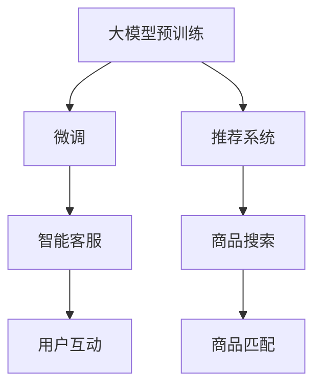

                 

# 大模型技术在跨境电商中的应用与挑战

大模型技术在跨境电商领域的应用，随着近年来人工智能技术的快速发展和市场需求的不断变化，正在成为推动行业数字化转型和提升竞争力的重要手段。本文将系统探讨大模型技术在跨境电商中的应用场景、实现方法以及面临的挑战，为相关从业者和研究者提供深入的分析和可行的建议。

## 1. 背景介绍

### 1.1 跨境电商行业现状
跨境电商是指跨国买卖商品和服务的电子商务活动，涵盖了国际贸易、物流、支付等多个环节。当前，跨境电商市场规模持续增长，消费者对于购物体验和商品多样性的需求也在不断提升，这对平台和商家提出了更高的技术要求。

### 1.2 大模型技术发展
大模型技术是指基于深度学习和人工智能的大规模预训练语言模型，如BERT、GPT、T5等。这些模型通过在大规模数据上进行自监督预训练，学习到通用的语言表示，具备强大的语言理解和生成能力，能够在各种NLP任务上取得优异表现。

近年来，大模型技术在电商领域的应用主要体现在用户推荐、智能客服、商品搜索等方面，带来了显著的效率提升和用户体验改善。但同时也面临着数据隐私、计算资源、应用落地等诸多挑战。

## 2. 核心概念与联系

### 2.1 核心概念概述

大模型技术在跨境电商中的应用主要涉及以下几个关键概念：

- **大模型预训练**：利用大规模无标签数据对语言模型进行预训练，学习到通用的语言表示。
- **微调**：在预训练模型的基础上，使用特定的电商数据进行有监督的微调，使其适应电商领域的具体任务。
- **推荐系统**：通过学习用户行为和商品属性，生成个性化的商品推荐。
- **智能客服**：基于自然语言处理技术，实现自动化的客户咨询回复和问题解答。
- **商品搜索**：利用自然语言处理技术，实现商品的精准搜索和匹配。

这些概念相互关联，共同构成了大模型技术在跨境电商中的应用框架。

### 2.2 核心概念原理和架构的 Mermaid 流程图


## 3. 核心算法原理 & 具体操作步骤

### 3.1 算法原理概述

大模型技术在跨境电商中的应用，核心在于利用预训练语言模型在大规模无标签数据上学习通用的语言表示，再在电商任务数据上通过微调学习特定领域的知识，提升在电商任务上的表现。主要算法原理如下：

1. **预训练**：在大规模无标签数据上，如亚马逊商品描述、评论、用户行为记录等，对语言模型进行预训练，学习到通用的语言表示。
2. **微调**：在电商任务数据上，使用少量的标注数据，对预训练模型进行微调，使其适应电商领域的具体任务。
3. **推荐系统**：利用微调后的模型，根据用户行为和商品属性生成个性化的推荐结果。
4. **智能客服**：基于微调后的模型，实现自动化的客户咨询回复和问题解答。
5. **商品搜索**：利用微调后的模型，实现商品的精准搜索和匹配。

### 3.2 算法步骤详解

以下是基于大模型技术的跨境电商应用的具体实现步骤：

1. **数据准备**：收集电商领域的各类数据，包括商品描述、用户评论、用户行为记录等，并进行清洗和标注。
2. **模型选择**：选择适合的预训练语言模型，如BERT、GPT等，并根据需要对模型进行相应的修改和调整。
3. **微调训练**：使用电商任务数据，对预训练模型进行微调训练。根据不同的电商任务，设计合适的损失函数和优化器。
4. **应用集成**：将微调后的模型集成到电商平台的推荐系统、智能客服、商品搜索等应用中，实现相应的功能。
5. **效果评估**：在实际应用中，对推荐效果、客服响应准确率、搜索精度等指标进行评估，不断优化模型参数和应用效果。

### 3.3 算法优缺点

大模型技术在跨境电商中的应用具有以下优点：

- **高效性**：利用预训练语言模型的通用能力，通过微调快速适应特定任务，提升推荐和搜索效果。
- **个性化**：通过学习用户行为和商品属性，生成个性化的推荐和搜索结果，提升用户体验。
- **自动化**：智能客服和搜索系统可以自动化处理大量用户咨询和查询，减少人工成本。

同时，也存在一些缺点：

- **数据隐私**：电商数据涉及用户隐私，数据处理和存储需遵守相关法律法规。
- **计算资源需求高**：大模型训练和微调需要大量的计算资源和存储空间。
- **模型可解释性差**：大模型通常被视为"黑盒"，其决策过程难以解释和调试。
- **泛化能力有限**：微调模型可能因数据集规模小而出现泛化能力不足的问题。

### 3.4 算法应用领域

大模型技术在跨境电商中的应用，主要集中在以下几个领域：

- **推荐系统**：基于用户行为和商品属性生成个性化的推荐。
- **智能客服**：自动化的客户咨询回复和问题解答。
- **商品搜索**：商品的精准搜索和匹配。
- **内容生成**：生成商品描述、用户评价等内容。

## 4. 数学模型和公式 & 详细讲解 & 举例说明

### 4.1 数学模型构建

假设预训练语言模型为 $M_{\theta}$，在电商任务数据上进行微调，微调目标函数为：

$$
\mathcal{L}(\theta) = \sum_{i=1}^N w_i \ell(M_{\theta}(x_i), y_i)
$$

其中 $w_i$ 为第 $i$ 个样本的权重，$\ell$ 为损失函数，$x_i$ 为电商任务数据，$y_i$ 为标注结果。

### 4.2 公式推导过程

对于推荐系统，假设目标为预测用户对商品 $j$ 的评分 $y_i$，可以利用点击率预测模型：

$$
y_i = \sigma(\langle \text{softmax}(M_{\theta}(x_i)), \theta_j \rangle)
$$

其中 $\sigma$ 为sigmoid函数，$\theta_j$ 为商品 $j$ 的表示向量。

### 4.3 案例分析与讲解

以亚马逊的推荐系统为例，该系统通过学习用户行为和商品属性，生成个性化的推荐结果。具体步骤如下：

1. **数据准备**：收集用户点击、浏览、购买等行为数据，以及商品的属性数据。
2. **模型选择**：选择BERT作为预训练模型，并根据需要对模型进行微调。
3. **微调训练**：使用点击率预测任务对BERT进行微调，生成用户对商品的评分。
4. **推荐生成**：利用微调后的模型，根据用户行为和商品属性生成推荐列表。
5. **效果评估**：在实际应用中，对推荐结果进行效果评估，不断优化模型参数和推荐算法。

## 5. 项目实践：代码实例和详细解释说明

### 5.1 开发环境搭建

在进行大模型技术应用开发前，需要搭建好开发环境，包括：

1. 安装Python和相关库，如TensorFlow、PyTorch等。
2. 准备电商数据集，并进行预处理和标注。
3. 选择预训练语言模型，并加载模型参数。
4. 设置微调超参数，如学习率、批量大小、迭代轮数等。

### 5.2 源代码详细实现

以推荐系统为例，以下是基于TensorFlow的推荐模型代码实现：

```python
import tensorflow as tf
from transformers import TFBertForSequenceClassification

# 加载预训练模型
model = TFBertForSequenceClassification.from_pretrained('bert-base-uncased')

# 定义数据输入和输出
input_ids = tf.placeholder(tf.int32, shape=(None, 128), name='input_ids')
attention_mask = tf.placeholder(tf.int32, shape=(None, 128), name='attention_mask')
labels = tf.placeholder(tf.int32, shape=(None, 1), name='labels')

# 定义模型计算图
with tf.variable_scope('bert'):
    outputs = model(input_ids, attention_mask=attention_mask, trainable=True)
    logits = outputs[0]

# 定义损失函数和优化器
loss = tf.losses.sparse_softmax_cross_entropy(labels=labels, logits=logits)
optimizer = tf.train.AdamOptimizer(learning_rate=2e-5)

# 定义训练步骤
train_op = optimizer.minimize(loss)

# 加载数据集
train_dataset = load_train_dataset()
val_dataset = load_val_dataset()

# 开始训练
with tf.Session() as sess:
    sess.run(tf.global_variables_initializer())
    for epoch in range(num_epochs):
        # 训练
        for batch in train_dataset:
            sess.run(train_op, feed_dict={input_ids: batch['input_ids'], 
                                        attention_mask: batch['attention_mask'], 
                                        labels: batch['labels']})
        # 验证
        val_loss = sess.run(loss, feed_dict={input_ids: val_dataset['input_ids'], 
                                           attention_mask: val_dataset['attention_mask'], 
                                           labels: val_dataset['labels']})
        print(f'Epoch {epoch+1}, val loss: {val_loss:.3f}')
```

### 5.3 代码解读与分析

上述代码实现了基于BERT的推荐模型训练过程，主要步骤如下：

1. **加载预训练模型**：从HuggingFace模型库中加载预训练的BERT模型。
2. **定义数据输入和输出**：使用TensorFlow的占位符定义输入的输入序列、注意力掩码和标签。
3. **定义模型计算图**：构建BERT模型的计算图，并定义输出层的softmax层和交叉熵损失函数。
4. **定义优化器**：使用Adam优化器进行模型参数更新。
5. **训练步骤**：定义训练操作，并使用TensorFlow会话进行模型训练。
6. **数据加载和处理**：从数据集加载输入序列、注意力掩码和标签，并进行预处理。

## 6. 实际应用场景

### 6.1 智能客服系统

智能客服系统利用大模型技术实现自动化的客户咨询回复和问题解答，大幅提升客户咨询体验和响应效率。具体应用场景包括：

1. **问题分类**：利用微调后的模型，对客户咨询问题进行分类。
2. **自动回复**：根据问题分类，自动生成合适的回复。
3. **对话管理**：利用上下文信息，管理对话流程，提升对话效果。

### 6.2 商品搜索系统

商品搜索系统通过大模型技术实现商品的精准搜索和匹配，提升用户搜索体验。具体应用场景包括：

1. **查询理解**：利用微调后的模型，理解用户查询意图。
2. **商品匹配**：根据查询意图，生成相关商品的搜索结果。
3. **推荐排序**：利用用户行为和商品属性，生成排序后的推荐列表。

### 6.3 个性化推荐系统

个性化推荐系统通过大模型技术生成个性化的推荐结果，提升用户体验和满意度。具体应用场景包括：

1. **用户画像**：利用用户行为数据，构建用户画像。
2. **商品匹配**：根据用户画像和商品属性，生成个性化的推荐列表。
3. **推荐评估**：根据用户反馈和点击率，评估推荐效果，不断优化推荐模型。

## 7. 工具和资源推荐

### 7.1 学习资源推荐

1. **《深度学习与自然语言处理》课程**：斯坦福大学课程，介绍深度学习在NLP中的应用。
2. **《推荐系统基础与算法》书籍**：详细讲解推荐系统的原理和算法。
3. **HuggingFace官方文档**：提供丰富的预训练模型和微调样例代码。
4. **TensorFlow官网**：提供TensorFlow的使用指南和文档。
5. **推荐系统开源项目**：如Amazon的Farewell，提供推荐系统的实现代码。

### 7.2 开发工具推荐

1. **Jupyter Notebook**：免费的交互式编程环境，适合快速原型开发。
2. **Google Colab**：Google提供的云端Jupyter Notebook环境，方便进行大规模模型训练。
3. **PyTorch和TensorFlow**：主流的深度学习框架，支持GPU/TPU加速。
4. **Weights & Biases**：模型训练的实验跟踪工具，可记录和可视化模型训练过程中的各项指标。
5. **TensorBoard**：TensorFlow配套的可视化工具，可实时监测模型训练状态，并提供丰富的图表呈现方式。

### 7.3 相关论文推荐

1. **《深度学习与推荐系统》论文**：介绍深度学习在推荐系统中的应用。
2. **《神经网络语言模型》论文**：提出神经网络语言模型，推动预训练语言模型的发展。
3. **《推荐系统的最新进展》论文**：总结推荐系统的最新研究成果和应用。

## 8. 总结：未来发展趋势与挑战

### 8.1 研究成果总结

大模型技术在跨境电商中的应用，已经展现出显著的效果和潜力，提升了电商平台的运营效率和用户满意度。但同时，也面临着数据隐私、计算资源、模型可解释性等诸多挑战。

### 8.2 未来发展趋势

未来，大模型技术在跨境电商中的应用将呈现以下几个发展趋势：

1. **多模态融合**：结合视觉、语音等多模态数据，提升推荐的丰富性和准确性。
2. **联邦学习**：通过分布式学习，保护用户数据隐私，提高推荐模型的泛化能力。
3. **跨领域迁移**：将电商领域知识迁移到其他领域，提升跨领域推荐效果。
4. **自动化推荐**：利用自动化推荐算法，实现全渠道、全场景的推荐服务。

### 8.3 面临的挑战

大模型技术在跨境电商中的应用，仍面临着以下挑战：

1. **数据隐私和安全**：电商数据涉及用户隐私，需严格遵守数据保护法规。
2. **计算资源限制**：大模型训练和微调需要高昂的计算资源和存储成本。
3. **模型可解释性差**：大模型通常被视为"黑盒"，难以解释其决策过程。
4. **泛化能力不足**：微调模型可能因数据集规模小而出现泛化能力不足的问题。

### 8.4 研究展望

为应对以上挑战，未来的研究方向可以包括：

1. **隐私保护技术**：研究分布式学习、联邦学习等技术，保护用户数据隐私。
2. **计算资源优化**：研究模型压缩、量化加速等技术，降低计算和存储成本。
3. **模型可解释性**：研究模型解释方法，提高大模型的可解释性和可控性。
4. **泛化能力提升**：研究小样本学习、自监督学习等技术，提高模型的泛化能力。

总之，大模型技术在跨境电商中的应用前景广阔，但仍需进一步探索和优化，以克服其面临的挑战，发挥更大的价值。

## 9. 附录：常见问题与解答

### 9.1 Q1: 大模型技术在跨境电商中应用的优势是什么？

A: 大模型技术在跨境电商中的应用优势主要体现在以下几个方面：

1. **高效性**：利用预训练语言模型的通用能力，通过微调快速适应特定任务，提升推荐和搜索效果。
2. **个性化**：通过学习用户行为和商品属性，生成个性化的推荐和搜索结果，提升用户体验。
3. **自动化**：智能客服和搜索系统可以自动化处理大量用户咨询和查询，减少人工成本。

### 9.2 Q2: 大模型技术在跨境电商中的应用存在哪些挑战？

A: 大模型技术在跨境电商中的应用存在以下挑战：

1. **数据隐私**：电商数据涉及用户隐私，数据处理和存储需遵守相关法律法规。
2. **计算资源需求高**：大模型训练和微调需要大量的计算资源和存储空间。
3. **模型可解释性差**：大模型通常被视为"黑盒"，其决策过程难以解释和调试。
4. **泛化能力有限**：微调模型可能因数据集规模小而出现泛化能力不足的问题。

### 9.3 Q3: 如何提高大模型技术的泛化能力？

A: 提高大模型技术的泛化能力可以从以下几个方面入手：

1. **数据增强**：通过数据增强技术，扩充训练集，提升模型泛化能力。
2. **模型正则化**：使用L2正则、Dropout等正则化技术，避免模型过拟合。
3. **多任务学习**：利用多任务学习，提高模型对不同任务的泛化能力。
4. **自监督学习**：利用自监督学习任务，提高模型对无标签数据的泛化能力。

### 9.4 Q4: 大模型技术在跨境电商中如何应用？

A: 大模型技术在跨境电商中的应用主要包括以下几个方面：

1. **推荐系统**：基于用户行为和商品属性生成个性化的推荐结果。
2. **智能客服**：自动化的客户咨询回复和问题解答。
3. **商品搜索**：商品的精准搜索和匹配。
4. **内容生成**：生成商品描述、用户评价等内容。

通过深入理解和应用大模型技术，跨境电商企业可以大幅提升运营效率和用户体验，保持市场竞争力。

---

作者：禅与计算机程序设计艺术 / Zen and the Art of Computer Programming

