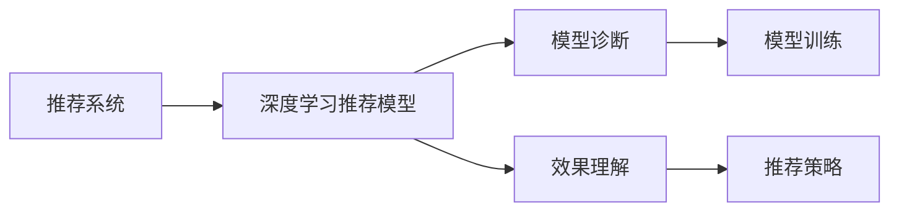

                 

## 1. 背景介绍

在当今信息爆炸的时代，搜索引擎、音乐推荐、新闻推荐等应用已经深入我们生活的方方面面。推荐系统的目标是为用户提供个性化、多样化的服务，提高用户满意度。随着推荐技术的不断进步，基于深度学习的推荐模型已经取代了传统的协同过滤模型，成为主流的推荐方法。深度学习推荐系统通过模型训练和推理过程，从用户行为数据中学习到用户的兴趣偏好，从而为用户推荐其可能感兴趣的内容。

然而，推荐系统的效果依赖于模型的质量。模型越优秀，能够捕捉到更丰富的用户兴趣信息，推荐结果的质量越高。但如何诊断模型，理解模型效果，是构建优秀推荐系统的重要步骤。本文将深入探讨推荐系统中的模型诊断和效果理解，以帮助开发者更好地构建和优化推荐系统。

## 2. 核心概念与联系

### 2.1 核心概念概述

在推荐系统中，模型诊断和效果理解涉及以下关键概念：

- **推荐系统**：旨在根据用户的历史行为，为用户推荐可能感兴趣的内容，包括商品、文章、视频等。
- **深度学习推荐模型**：如基于神经网络、注意力机制、协同过滤等方法的推荐模型。
- **模型诊断**：通过分析模型的训练过程、参数分布等，评估模型的质量，发现潜在问题。
- **效果理解**：通过分析模型的输出结果、推荐质量指标等，理解模型的表现，改进推荐策略。

这些概念之间的联系可以简单概括为：通过模型诊断发现模型问题，优化模型；通过效果理解评估模型效果，改进推荐策略。

### 2.2 核心概念原理和架构的 Mermaid 流程图

以下是推荐系统、模型诊断和效果理解之间的逻辑关系：



在推荐系统中，深度学习推荐模型是核心组件。通过模型训练得到推荐模型后，使用模型诊断评估模型质量，并结合效果理解改进推荐策略，最终得到优质的推荐结果。

## 3. 核心算法原理 & 具体操作步骤

### 3.1 算法原理概述

推荐系统的模型诊断和效果理解，本质上是通过模型训练和推理过程中的各种指标和统计信息，评估模型的质量和效果。以下是推荐系统中常用的模型诊断和效果理解方法：

- **训练损失**：衡量模型在训练集上的预测误差，反映模型的学习效果。
- **验证集性能**：通过在验证集上的性能评估，监测模型泛化能力，发现模型过拟合或欠拟合的问题。
- **特征重要性分析**：分析模型中各个特征对推荐结果的影响，帮助理解模型的决策机制。
- **推荐效果评估**：通过点击率、转化率、召回率等指标，评估模型推荐的实际效果，改进推荐策略。

这些方法通过统计模型训练和推理过程中的各种指标，为推荐系统的优化提供了数据基础。

### 3.2 算法步骤详解

以下是推荐系统中模型诊断和效果理解的具体操作步骤：

**Step 1: 收集训练数据和测试数据**
- 准备推荐系统的训练数据集 $D_{train}$ 和测试数据集 $D_{test}$。训练数据集用于模型训练，测试数据集用于模型评估。

**Step 2: 构建推荐模型**
- 选择合适的深度学习推荐模型，如基于神经网络的模型、协同过滤模型等。构建模型结构，设置模型参数。

**Step 3: 模型训练**
- 在训练数据集 $D_{train}$ 上训练推荐模型，调整模型参数，最小化训练损失。
- 记录训练过程中的损失曲线、验证集性能等关键指标，监测模型训练状态。

**Step 4: 模型诊断**
- 分析训练损失、验证集性能等指标，评估模型泛化能力和学习效果。
- 使用特征重要性分析方法，评估模型中各个特征的贡献，理解模型决策机制。
- 通过对抗样本分析等方法，评估模型鲁棒性，发现潜在问题。

**Step 5: 模型测试**
- 在测试数据集 $D_{test}$ 上测试推荐模型，评估模型实际效果。
- 记录测试过程中的推荐效果指标，如点击率、转化率、召回率等。
- 使用效果理解方法，分析推荐结果，改进推荐策略。

**Step 6: 模型优化**
- 根据模型诊断结果，调整模型参数，优化模型性能。
- 根据效果理解结果，调整推荐策略，提高推荐效果。

通过上述步骤，可以系统地进行推荐系统中的模型诊断和效果理解，不断优化模型和推荐策略，提高推荐系统的效果。

### 3.3 算法优缺点

推荐系统中的模型诊断和效果理解方法具有以下优点：
1. 可操作性强。通过分析模型训练和推理过程中的各种指标，可以直观地评估模型质量和效果。
2. 发现问题及时。通过监测模型训练和测试过程中的关键指标，可以及时发现模型问题，进行优化。
3. 提升推荐效果。通过优化模型和改进推荐策略，可以显著提升推荐系统的效果，提高用户满意度。

同时，这些方法也存在一些局限性：
1. 依赖标注数据。部分方法如特征重要性分析需要标注数据进行训练，标注成本较高。
2. 模型复杂度高。深度学习推荐模型参数量较大，训练复杂度高。
3. 泛化能力不足。模型训练和测试数据集的分布差异较大时，模型泛化能力可能较弱。

尽管存在这些局限性，但就目前而言，这些方法仍然是推荐系统中最常用的诊断和效果理解手段。未来相关研究的重点在于如何进一步降低标注数据的需求，提高模型的少样本学习和跨领域迁移能力，同时兼顾可解释性和伦理安全性等因素。

### 3.4 算法应用领域

推荐系统中的模型诊断和效果理解方法，在多个领域得到了广泛应用，例如：

- 电子商务推荐：为电商网站用户推荐可能感兴趣的商品，提升用户体验和购物转化率。
- 内容推荐：为用户推荐新闻、文章、视频等，提高用户粘性和平台流量。
- 视频推荐：为用户推荐电影、电视剧、综艺节目等，增加用户观看时长和平台收入。
- 金融推荐：为用户推荐理财产品、保险产品等，提升用户满意度和金融机构收益。

除了这些常见的应用领域外，推荐系统还在教育、旅游、娱乐等多个领域得到广泛应用，为各行业带来新的增长点。

## 4. 数学模型和公式 & 详细讲解

### 4.1 数学模型构建

本节将使用数学语言对推荐系统中的模型诊断和效果理解过程进行更加严格的刻画。

记推荐系统模型为 $M$，输入为 $x$，输出为 $y$。假设训练数据集为 $D_{train}=\{(x_i,y_i)\}_{i=1}^N$，测试数据集为 $D_{test}=\{(x_i,y_i)\}_{i=1}^M$。定义模型在训练集和测试集上的损失函数分别为 $\ell_{train}(M,x_i)$ 和 $\ell_{test}(M,x_i)$。训练过程中，模型参数 $\theta$ 通过梯度下降等优化算法更新。

### 4.2 公式推导过程

以基于神经网络的推荐模型为例，推导训练损失和验证集性能的计算公式。

假设推荐模型 $M$ 为多层神经网络，输入 $x$ 为用户的特征向量，输出 $y$ 为推荐的商品或内容的评分。训练损失定义为模型在训练集上的均方误差损失：

$$
\ell_{train}(M) = \frac{1}{N} \sum_{i=1}^N (y_i - M(x_i))^2
$$

验证集性能通常使用准确率、召回率、F1分数等指标进行评估。以准确率为例，计算公式为：

$$
\text{Accuracy} = \frac{1}{M} \sum_{i=1}^M \mathbb{I}(M(x_i) = y_i)
$$

其中 $\mathbb{I}(\cdot)$ 为示性函数，当 $M(x_i) = y_i$ 时取1，否则取0。

### 4.3 案例分析与讲解

以基于神经网络的推荐模型为例，进行案例分析与讲解。

假设推荐模型 $M$ 为两层全连接神经网络，输入 $x$ 为用户的年龄、性别、购买历史等特征，输出 $y$ 为推荐的商品评分。训练过程中，使用均方误差损失进行优化：

$$
\ell_{train}(M) = \frac{1}{N} \sum_{i=1}^N (y_i - M(x_i))^2
$$

其中 $M(x_i)$ 为模型对用户特征 $x_i$ 的预测输出。训练过程中，通过梯度下降等优化算法，最小化训练损失。同时，在验证集上计算模型性能：

$$
\text{Accuracy} = \frac{1}{M} \sum_{i=1}^M \mathbb{I}(M(x_i) = y_i)
$$

通过训练集和验证集上的损失和准确率，可以评估模型的泛化能力和学习效果。如果训练损失较小，验证集准确率较低，可能存在过拟合问题，需要进行相应的正则化处理。

## 5. 项目实践：代码实例和详细解释说明

### 5.1 开发环境搭建

在进行模型诊断和效果理解实践前，我们需要准备好开发环境。以下是使用Python进行TensorFlow开发的环境配置流程：

1. 安装Anaconda：从官网下载并安装Anaconda，用于创建独立的Python环境。

2. 创建并激活虚拟环境：
```bash
conda create -n tf-env python=3.8 
conda activate tf-env
```

3. 安装TensorFlow：根据CUDA版本，从官网获取对应的安装命令。例如：
```bash
conda install tensorflow=2.8.0 
```

4. 安装各类工具包：
```bash
pip install numpy pandas scikit-learn matplotlib tqdm jupyter notebook ipython
```

完成上述步骤后，即可在`tf-env`环境中开始模型诊断和效果理解实践。

### 5.2 源代码详细实现

这里我们以基于神经网络的推荐模型为例，给出TensorFlow代码实现。

首先，定义推荐模型的神经网络结构：

```python
import tensorflow as tf

class RecommendationModel(tf.keras.Model):
    def __init__(self, input_dim, output_dim, hidden_units):
        super(RecommendationModel, self).__init__()
        self.dense1 = tf.keras.layers.Dense(hidden_units, activation='relu')
        self.dense2 = tf.keras.layers.Dense(output_dim, activation='sigmoid')
    
    def call(self, inputs):
        x = self.dense1(inputs)
        return self.dense2(x)
```

然后，定义模型训练和测试函数：

```python
def train_model(model, train_data, epochs):
    batch_size = 32
    optimizer = tf.keras.optimizers.Adam(learning_rate=0.001)
    loss_fn = tf.keras.losses.MeanSquaredError()
    
    for epoch in range(epochs):
        for i in range(0, len(train_data), batch_size):
            batch_data = train_data[i:i+batch_size]
            inputs, labels = batch_data[:, :-1], batch_data[:, -1]
            with tf.GradientTape() as tape:
                predictions = model(inputs)
                loss = loss_fn(predictions, labels)
            gradients = tape.gradient(loss, model.trainable_variables)
            optimizer.apply_gradients(zip(gradients, model.trainable_variables))
    
    return model

def test_model(model, test_data):
    correct_predictions = 0
    total_predictions = 0
    for inputs, labels in test_data:
        predictions = model(inputs)
        predictions = tf.round(predictions)
        for i in range(len(predictions)):
            if predictions[i].numpy() == labels[i]:
                correct_predictions += 1
            total_predictions += 1
    accuracy = correct_predictions / total_predictions
    return accuracy
```

最后，启动训练流程并在测试集上评估：

```python
model = RecommendationModel(input_dim=10, output_dim=1, hidden_units=64)
train_data = ...
train_model(model, train_data, epochs=10)

test_data = ...
accuracy = test_model(model, test_data)
print("Accuracy: {:.2f}%".format(accuracy * 100))
```

以上就是使用TensorFlow对基于神经网络的推荐模型进行训练、测试的完整代码实现。可以看到，TensorFlow提供了方便的API，可以轻松构建神经网络模型，并进行训练和评估。

### 5.3 代码解读与分析

让我们再详细解读一下关键代码的实现细节：

**RecommendationModel类**：
- `__init__`方法：初始化神经网络层。
- `call`方法：实现前向传播计算，返回模型的输出。

**训练和测试函数**：
- 使用TensorFlow的`tf.keras`模块定义神经网络模型，设置输入、隐藏层和输出层。
- 使用`Adam`优化器，设置学习率。
- 定义均方误差损失函数。
- 在每个epoch内，对训练集数据进行批处理，前向传播计算损失和梯度，使用梯度下降算法更新模型参数。
- 在测试集上评估模型准确率，计算并输出结果。

**训练流程**：
- 定义模型结构，初始化参数。
- 准备训练数据和测试数据。
- 调用训练函数，进行模型训练。
- 调用测试函数，在测试集上评估模型准确率。

可以看到，TensorFlow提供了方便的API和组件，使得模型诊断和效果理解任务的实现变得简洁高效。开发者可以将更多精力放在模型构建、优化和评估上，而不必过多关注底层实现细节。

当然，工业级的系统实现还需考虑更多因素，如模型的保存和部署、超参数的自动搜索、更灵活的任务适配层等。但核心的模型诊断和效果理解基本与此类似。

## 6. 实际应用场景

### 6.1 电商推荐系统

电商推荐系统是推荐系统中最常见的应用场景之一。在电商平台上，通过用户的历史购买记录、浏览记录等数据，为用户推荐可能感兴趣的商品，提升用户体验和购物转化率。

在技术实现上，可以收集用户的历史购买记录、浏览记录等行为数据，将这些数据输入到推荐模型中，训练出适合用户兴趣偏好的模型。通过模型诊断和效果理解，可以评估模型的泛化能力和学习效果，优化模型参数和推荐策略，提升推荐效果。例如，通过分析模型训练损失和验证集准确率，可以发现模型是否过拟合，通过特征重要性分析，可以了解哪些特征对推荐结果影响最大，进而优化特征选择和模型结构。

### 6.2 视频推荐系统

视频推荐系统旨在为用户推荐可能感兴趣的视频内容，提高用户观看时长和平台收入。通过用户的历史观看记录、评分等数据，训练推荐模型，并结合视频的热门度、时长等信息，为用户推荐视频内容。

在技术实现上，可以收集用户的历史观看记录、评分等数据，将这些数据输入到推荐模型中，训练出适合用户兴趣偏好的模型。通过模型诊断和效果理解，可以评估模型的泛化能力和学习效果，优化模型参数和推荐策略，提升推荐效果。例如，通过分析模型训练损失和验证集准确率，可以发现模型是否过拟合，通过特征重要性分析，可以了解哪些特征对推荐结果影响最大，进而优化特征选择和模型结构。

### 6.3 金融推荐系统

金融推荐系统为用户推荐理财产品、保险产品等，提升用户满意度和金融机构收益。通过用户的历史交易记录、评分等数据，训练推荐模型，并结合产品的高频、时长、收益率等信息，为用户推荐金融产品。

在技术实现上，可以收集用户的历史交易记录、评分等数据，将这些数据输入到推荐模型中，训练出适合用户兴趣偏好的模型。通过模型诊断和效果理解，可以评估模型的泛化能力和学习效果，优化模型参数和推荐策略，提升推荐效果。例如，通过分析模型训练损失和验证集准确率，可以发现模型是否过拟合，通过特征重要性分析，可以了解哪些特征对推荐结果影响最大，进而优化特征选择和模型结构。

### 6.4 未来应用展望

随着推荐技术的不断进步，基于深度学习的推荐模型在更多领域得到了广泛应用，为各行各业带来了新的增长点。

在智慧医疗领域，推荐系统可以推荐适合患者的医疗方案、药品等，提升医疗服务水平和患者满意度。在教育领域，推荐系统可以推荐适合学生的课程、教材等，提升教育质量和学生学习效果。在智能家居领域，推荐系统可以推荐适合用户的智能设备、智能场景等，提升用户生活体验和设备利用率。

未来，推荐系统将进一步拓展应用领域，结合更多数据源和智能算法，提升推荐效果，助力各行各业数字化转型升级。

## 7. 工具和资源推荐

### 7.1 学习资源推荐

为了帮助开发者系统掌握推荐系统中的模型诊断和效果理解理论基础和实践技巧，这里推荐一些优质的学习资源：

1. 《深度学习推荐系统》系列书籍：介绍了推荐系统的基本概念、算法和应用，涵盖基于协同过滤、基于神经网络等多种推荐方法。
2. CS644《推荐系统》课程：斯坦福大学开设的推荐系统经典课程，涵盖推荐系统的基本理论和算法，并有配套作业和项目实践。
3. 《Recommender Systems: Algorithms and Applications》书籍：介绍推荐系统的基本理论和算法，适合深入学习推荐系统的理论基础。
4. 《Applied Deep Learning for Recommendation Systems》书籍：介绍深度学习在推荐系统中的应用，适合实战项目开发。
5. 《推荐系统实战》书籍：介绍推荐系统的实战项目开发，适合了解推荐系统应用场景和实际开发。

通过对这些资源的学习实践，相信你一定能够快速掌握推荐系统中的模型诊断和效果理解精髓，并用于解决实际的推荐问题。

### 7.2 开发工具推荐

高效的开发离不开优秀的工具支持。以下是几款用于推荐系统开发常用的工具：

1. TensorFlow：基于Python的开源深度学习框架，灵活动态的计算图，适合快速迭代研究。TensorFlow提供了方便的API和组件，使得推荐系统的实现变得简洁高效。
2. PyTorch：基于Python的开源深度学习框架，灵活性高，适合研究型项目。PyTorch提供了丰富的深度学习组件和工具，方便开发者进行模型构建和优化。
3. Scikit-learn：Python中的经典机器学习库，适合进行特征工程和模型评估。Scikit-learn提供了丰富的机器学习算法和工具，方便开发者进行数据处理和模型优化。
4. Jupyter Notebook：交互式编程环境，方便开发者进行模型训练和调试。Jupyter Notebook支持多种编程语言和库，适合进行复杂算法和模型开发。
5. Kaggle：数据科学竞赛平台，提供大量公开数据集和竞赛任务，适合进行模型评估和优化。Kaggle提供了丰富的数据集和算法库，方便开发者进行实战项目开发。

合理利用这些工具，可以显著提升推荐系统开发效率，加快创新迭代的步伐。

### 7.3 相关论文推荐

推荐系统中的模型诊断和效果理解技术的发展源于学界的持续研究。以下是几篇奠基性的相关论文，推荐阅读：

1. Improving Recommendation Algorithms by Attention and Memory Networks（即Attention-based推荐论文）：提出了基于注意力机制的推荐模型，利用用户兴趣特征和物品特征进行推荐。
2. Deep Collaborative Filtering（即DeepCF推荐论文）：提出了基于深度神经网络的协同过滤模型，通过多层神经网络捕捉用户和物品间的复杂关系。
3. Contextual Recommendations for News Article Reading（即基于上下文的推荐论文）：提出了基于上下文特征的推荐模型，利用用户上下文特征提升推荐效果。
4. Contextual Recommendations for News Article Reading（即基于上下文的推荐论文）：提出了基于上下文特征的推荐模型，利用用户上下文特征提升推荐效果。
5. Parameter-Efficient Training of Neural Networks（即高效训练论文）：提出了基于参数高效的训练方法，在固定部分预训练参数的情况下，优化推荐模型效果。

这些论文代表了大模型推荐技术的进展脉络。通过学习这些前沿成果，可以帮助研究者把握学科前进方向，激发更多的创新灵感。

## 8. 总结：未来发展趋势与挑战

### 8.1 研究成果总结

本文对推荐系统中的模型诊断和效果理解方法进行了全面系统的介绍。首先阐述了推荐系统中的模型诊断和效果理解方法的逻辑关系和重要性，明确了其对推荐系统优化和推荐效果提升的关键作用。其次，从原理到实践，详细讲解了模型诊断和效果理解的方法、步骤和具体操作步骤，给出了推荐系统开发的完整代码实例。同时，本文还广泛探讨了模型诊断和效果理解方法在电商、视频、金融等多个行业领域的应用前景，展示了其在推荐系统优化和效果提升中的巨大潜力。此外，本文精选了模型诊断和效果理解技术的各类学习资源，力求为读者提供全方位的技术指引。

通过本文的系统梳理，可以看到，模型诊断和效果理解方法在推荐系统中的应用前景广阔，是优化推荐系统性能的重要手段。模型诊断通过评估模型训练和推理过程中的各种指标，帮助发现模型问题并进行优化。效果理解通过分析模型输出结果和推荐效果指标，帮助改进推荐策略，提升推荐效果。

### 8.2 未来发展趋势

展望未来，推荐系统中的模型诊断和效果理解技术将呈现以下几个发展趋势：

1. 数据驱动的优化。随着数据量的增加和数据质量的提升，推荐系统将更加依赖数据驱动的优化方法，如基于强化学习的推荐系统、基于多任务学习的推荐系统等。
2. 跨领域迁移能力。推荐系统将更加注重跨领域迁移能力，通过在不同数据集上的微调，提升模型泛化能力和适用性。
3. 多模态融合。推荐系统将更加注重多模态信息的融合，利用文本、图像、语音等多种模态信息，提升推荐效果。
4. 个性化推荐。推荐系统将更加注重个性化推荐，通过深入挖掘用户兴趣和行为特征，为用户提供更加精准、多样化的推荐内容。
5. 智能推荐。推荐系统将更加注重智能推荐，通过引入因果推断、博弈论等智能算法，提升推荐模型的决策能力和解释性。

这些趋势凸显了推荐系统中的模型诊断和效果理解技术的广阔前景。这些方向的探索发展，必将进一步提升推荐系统的效果和应用范围，为各行各业带来新的增长点。

### 8.3 面临的挑战

尽管推荐系统中的模型诊断和效果理解技术已经取得了显著进展，但在实际应用中，仍然面临一些挑战：

1. 数据质量问题。推荐系统的性能很大程度上依赖于数据质量，数据噪声、数据不均衡等问题会导致推荐效果下降。如何提升数据质量，优化数据处理流程，将是一大挑战。
2. 模型复杂性问题。推荐系统中的深度学习模型参数量较大，训练复杂度高，如何降低模型复杂性，提高模型训练和推理效率，将是一大难题。
3. 推荐效果泛化问题。推荐系统在不同领域和场景下的泛化能力不足，如何提升模型的泛化能力，是未来研究的重要方向。
4. 模型解释性问题。推荐系统中的深度学习模型往往缺乏可解释性，如何赋予模型更强的可解释性，将是一大挑战。

尽管存在这些挑战，但就目前而言，这些技术仍然是推荐系统中最常用的诊断和效果理解手段。未来相关研究的重点在于如何进一步降低数据的需求，提高模型的少样本学习和跨领域迁移能力，同时兼顾可解释性和伦理安全性等因素。

### 8.4 研究展望

面对推荐系统中的模型诊断和效果理解技术所面临的种种挑战，未来的研究需要在以下几个方面寻求新的突破：

1. 探索无监督和半监督学习。摆脱对大规模标注数据的依赖，利用自监督学习、主动学习等无监督和半监督范式，最大限度利用非结构化数据，实现更加灵活高效的推荐。
2. 研究参数高效和计算高效的推荐方法。开发更加参数高效的推荐方法，在固定部分预训练参数的情况下，只更新极少量的任务相关参数。同时优化推荐模型的计算图，减少前向传播和反向传播的资源消耗，实现更加轻量级、实时性的部署。
3. 融合因果和对比学习范式。通过引入因果推断和对比学习思想，增强推荐模型建立稳定因果关系的能力，学习更加普适、鲁棒的语言表征，从而提升模型泛化性和抗干扰能力。
4. 引入更多先验知识。将符号化的先验知识，如知识图谱、逻辑规则等，与神经网络模型进行巧妙融合，引导推荐过程学习更准确、合理的语言模型。同时加强不同模态数据的整合，实现视觉、语音等多模态信息与文本信息的协同建模。
5. 结合因果分析和博弈论工具。将因果分析方法引入推荐模型，识别出模型决策的关键特征，增强推荐模型的决策能力和解释性。借助博弈论工具刻画人机交互过程，主动探索并规避推荐模型的脆弱点，提高系统稳定性。
6. 纳入伦理道德约束。在推荐模型训练目标中引入伦理导向的评估指标，过滤和惩罚有害的推荐内容，确保推荐内容符合人类价值观和伦理道德。同时加强人工干预和审核，建立推荐模型的监管机制，确保推荐内容的安全性。

这些研究方向的探索，必将引领推荐系统技术迈向更高的台阶，为构建安全、可靠、可解释、可控的推荐系统铺平道路。面向未来，推荐系统技术还需要与其他人工智能技术进行更深入的融合，如知识表示、因果推理、强化学习等，多路径协同发力，共同推动推荐系统的进步。只有勇于创新、敢于突破，才能不断拓展推荐系统的边界，让智能推荐更好地服务于人类社会。

## 9. 附录：常见问题与解答

**Q1：推荐系统中的模型诊断和效果理解方法适用于所有推荐任务吗？**

A: 推荐系统中的模型诊断和效果理解方法适用于大多数推荐任务，特别是基于深度学习的推荐任务。但对于一些特定领域的推荐任务，如医疗、法律等，仅仅依靠通用语料预训练的模型可能难以很好地适应。此时需要在特定领域语料上进一步预训练，再进行微调，才能获得理想效果。此外，对于一些需要时效性、个性化很强的任务，如对话、推荐等，推荐方法也需要针对性的改进优化。

**Q2：推荐系统中的模型诊断和效果理解方法需要标注数据吗？**

A: 部分推荐系统中的模型诊断和效果理解方法需要标注数据进行训练，如特征重要性分析、对抗样本分析等。但大多数方法如训练损失、验证集性能等，可以通过无监督和半监督学习实现，不需要标注数据。因此，推荐系统中的模型诊断和效果理解方法需要根据具体任务和需求进行选择。

**Q3：推荐系统中的模型诊断和效果理解方法可以应用在哪些领域？**

A: 推荐系统中的模型诊断和效果理解方法在多个领域得到了广泛应用，例如：

- 电子商务推荐：为电商网站用户推荐可能感兴趣的商品，提升用户体验和购物转化率。
- 内容推荐：为用户推荐新闻、文章、视频等，提高用户粘性和平台流量。
- 视频推荐：为用户推荐电影、电视剧、综艺节目等，增加用户观看时长和平台收入。
- 金融推荐：为用户推荐理财产品、保险产品等，提升用户满意度和金融机构收益。

除了这些常见的应用领域外，推荐系统还在教育、旅游、娱乐等多个领域得到广泛应用，为各行业带来新的增长点。

**Q4：推荐系统中的模型诊断和效果理解方法如何影响推荐效果？**

A: 推荐系统中的模型诊断和效果理解方法通过分析模型训练和推理过程中的各种指标，帮助评估模型的质量和效果。通过优化模型参数和改进推荐策略，可以显著提升推荐效果。例如，通过分析模型训练损失和验证集准确率，可以发现模型是否过拟合，通过特征重要性分析，可以了解哪些特征对推荐结果影响最大，进而优化特征选择和模型结构。

**Q5：推荐系统中的模型诊断和效果理解方法有哪些局限性？**

A: 推荐系统中的模型诊断和效果理解方法存在一些局限性：

1. 数据质量问题。推荐系统的性能很大程度上依赖于数据质量，数据噪声、数据不均衡等问题会导致推荐效果下降。
2. 模型复杂性问题。推荐系统中的深度学习模型参数量较大，训练复杂度高，如何降低模型复杂性，提高模型训练和推理效率，将是一大难题。
3. 推荐效果泛化问题。推荐系统在不同领域和场景下的泛化能力不足，如何提升模型的泛化能力，是未来研究的重要方向。
4. 模型解释性问题。推荐系统中的深度学习模型往往缺乏可解释性，如何赋予模型更强的可解释性，将是一大挑战。

尽管存在这些局限性，但就目前而言，这些方法仍然是推荐系统中最常用的诊断和效果理解手段。未来相关研究的重点在于如何进一步降低数据的需求，提高模型的少样本学习和跨领域迁移能力，同时兼顾可解释性和伦理安全性等因素。

总之，推荐系统中的模型诊断和效果理解方法通过系统分析模型训练和推理过程中的各种指标，帮助评估模型质量和效果，优化模型参数和推荐策略，提升推荐系统的效果。开发者可以根据具体任务和需求，灵活选择和使用这些方法，实现推荐系统的优化和改进。

