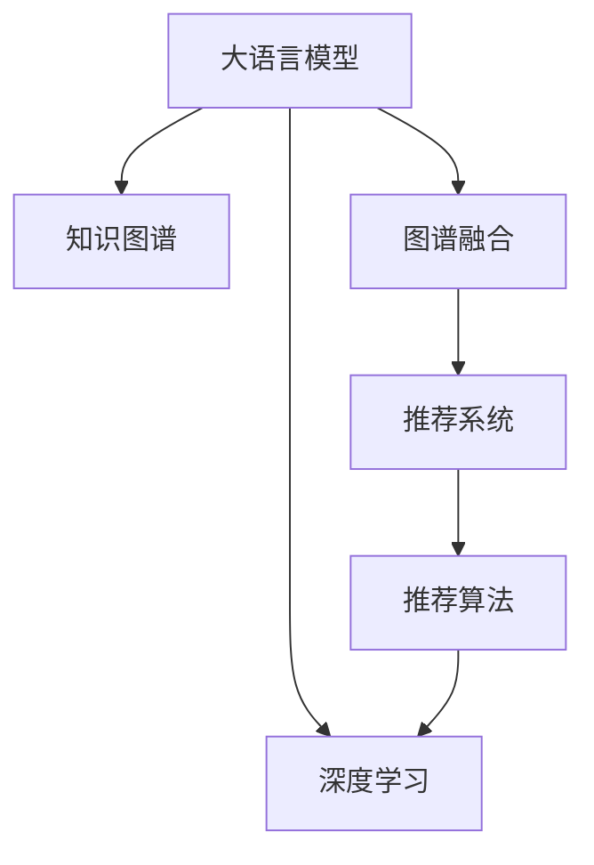

                 

# 大模型推荐中的知识图谱融合应用新方式与案例

> 关键词：大模型推荐, 知识图谱, 图谱融合, 推荐系统, 深度学习, 推荐算法

## 1. 背景介绍

在如今的信息爆炸时代，用户在海量数据中寻找对自己有用的信息变得越来越困难。推荐系统通过预测用户可能感兴趣的物品，极大地提升了信息检索的效率和准确性，已成为互联网平台的核心竞争力之一。传统的推荐系统通常基于用户行为数据进行建模，但随着数据量的增加，个性化需求日益增多，单一的行为数据难以应对复杂多变的用户偏好。

近年来，大语言模型在大数据和深度学习技术的推动下，取得了令人瞩目的进展。大语言模型通过预训练学习到丰富的语义知识，能够在自然语言处理(NLP)、语音识别、图像处理等领域中实现多模态数据融合，为用户提供更加精准的推荐服务。同时，知识图谱作为一种结构化数据，将实体、关系、属性等知识元素有机结合，提供了强大的背景知识支持，有助于提升推荐系统的效果和可信度。

本文将探讨大语言模型在推荐系统中的应用，特别是由大语言模型与知识图谱融合的推荐方式，详细介绍其算法原理、操作步骤及典型案例，为推荐系统开发者提供深度见解。

## 2. 核心概念与联系

### 2.1 核心概念概述

为更好地理解大语言模型在推荐系统中的应用，我们首先概述几个核心概念及其相互关系：

- **大语言模型(Large Language Model, LLM)**：以自回归或自编码模型为代表的大规模预训练语言模型。通过在大规模无标签文本语料上进行预训练，学习通用的语言表示，具备强大的语言理解和生成能力。

- **知识图谱(Knowledge Graph,KG)**：一种结构化的语义表示方法，通过实体节点、关系边、属性节点等构建知识图谱，描述实体之间的语义关系。知识图谱广泛应用于自然语言理解、信息检索、推荐系统等领域。

- **图谱融合(Graph Fusion)**：将知识图谱与大语言模型融合，通过知识迁移、实体对齐、融合推理等技术，实现图谱与模型的互利共生，提升模型的表示能力和泛化能力。

- **推荐系统(Recommendation System, RS)**：通过预测用户可能感兴趣的物品，向用户提供个性化推荐服务的系统。推荐系统可分为基于协同过滤、基于内容的推荐、混合推荐等不同类型。

- **深度学习(Deep Learning)**：通过构建多层次神经网络模型，从数据中学习复杂的非线性关系，广泛应用于图像识别、自然语言处理、推荐系统等领域。

- **推荐算法(Recommendation Algorithm)**：推荐系统中的核心部分，通过用户行为数据或物品属性数据进行建模，预测用户对物品的兴趣。推荐算法包括矩阵分解、协同过滤、深度学习等。

### 2.2 核心概念原理和架构的 Mermaid 流程图



通过上述图表，我们可以看出大语言模型与知识图谱融合在推荐系统中的应用框架。大语言模型通过深度学习技术，学习到丰富的语义知识；知识图谱通过结构化数据，提供背景知识支持；图谱融合将两者有效结合，提升推荐系统的表现力。

## 3. 核心算法原理 & 具体操作步骤

### 3.1 算法原理概述

大语言模型与知识图谱融合的推荐方式，本质上是一种跨模态融合的深度推荐算法。其核心思想是：将知识图谱中的实体、关系、属性等语义信息与大语言模型生成的自然语言文本相结合，通过语义对齐和融合推理，生成更加全面、准确的用户兴趣表示，从而提升推荐系统的效果。

具体而言，大语言模型负责生成与推荐物品相关的自然语言描述，而知识图谱则提供物品的语义知识背景，两者通过图谱融合技术，构建联合语义空间。在此基础上，推荐算法可以更准确地预测用户对物品的兴趣，生成更加个性化和多样化的推荐结果。

### 3.2 算法步骤详解

大语言模型与知识图谱融合的推荐算法，通常包括以下几个关键步骤：

**Step 1: 知识图谱预处理**

- 收集并构建知识图谱，包括实体、关系、属性等信息。
- 对知识图谱进行清洗、去重、归一化等预处理操作，去除噪声和冗余。
- 将知识图谱转换为适用于大语言模型的格式，如GraphSAGE、GAT等图神经网络模型需要的邻接矩阵形式。

**Step 2: 大语言模型预训练**

- 使用大规模无标签文本数据对大语言模型进行预训练，如BERT、GPT等。
- 在大语言模型上添加推荐任务相关的任务适配层，如多选题、填空题、问答题等。
- 使用推荐任务的相关数据对大语言模型进行微调，如用户对物品的评分数据、点击数据等。

**Step 3: 知识图谱嵌入**

- 使用图谱嵌入技术，如Word2Vec、GraphSAGE等，将知识图谱中的实体和关系嵌入低维向量空间。
- 通过实体对齐技术，将知识图谱中的实体与大语言模型生成的文本描述进行对齐。

**Step 4: 图谱融合推理**

- 将知识图谱嵌入与大语言模型生成的文本描述进行融合，构建联合语义空间。
- 使用图谱融合技术，如知识融合推理、跨模态学习等，生成更加全面、准确的用户兴趣表示。
- 将融合后的用户兴趣表示输入推荐算法，生成推荐结果。

**Step 5: 评估与优化**

- 在推荐数据集上评估推荐算法的效果，如准确率、召回率、F1分数等。
- 根据评估结果，优化推荐算法中的超参数，如学习率、批大小、训练轮数等。
- 使用A/B测试等方式，比较融合前后推荐效果的变化，评估融合策略的有效性。

### 3.3 算法优缺点

大语言模型与知识图谱融合的推荐方式，具有以下优点：

- 深度融合知识图谱的语义信息，提升推荐结果的全面性和准确性。
- 通过自然语言描述，提升推荐系统的可解释性，帮助用户理解推荐逻辑。
- 兼容不同模态的数据，支持多模态推荐。

同时，也存在一些局限性：

- 知识图谱构建复杂，需要大量人工标注，成本较高。
- 图谱融合算法复杂，计算开销较大。
- 对于无结构化的文本数据，难以进行有效融合。

### 3.4 算法应用领域

大语言模型与知识图谱融合的推荐方式，已经在多个领域得到了应用，并取得了不错的效果。具体包括：

- 电子商务推荐：通过融合知识图谱中的商品信息，提升推荐系统的精准度和个性化。
- 新闻推荐：通过融合知识图谱中的新闻元数据，生成更加相关的新闻内容推荐。
- 旅游推荐：通过融合知识图谱中的景点信息，生成更加个性化和多样化的旅游推荐。
- 社交推荐：通过融合知识图谱中的人际关系信息，生成更加精准的社交网络推荐。

## 4. 数学模型和公式 & 详细讲解 & 举例说明

### 4.1 数学模型构建

在大语言模型与知识图谱融合的推荐算法中，数学模型主要涉及以下几个部分：

- **大语言模型表示**：假设大语言模型为 $M_{\theta}$，其中 $\theta$ 为模型参数。
- **知识图谱表示**：假设知识图谱由 $G=(E, R)$ 表示，其中 $E$ 为实体集合，$R$ 为关系集合。
- **图谱嵌入表示**：假设知识图谱中的实体和关系嵌入到低维向量空间中，表示为 $\mathbf{e}_e \in \mathbb{R}^d$ 和 $\mathbf{e}_r \in \mathbb{R}^d$。

### 4.2 公式推导过程

在推荐任务中，我们假设用户对物品的兴趣表示为 $x_u$，物品表示为 $x_i$。大语言模型生成的自然语言描述为 $x_{\text{desc}}$，知识图谱中的关系嵌入为 $\mathbf{e}_r$，物品嵌入为 $\mathbf{e}_i$。推荐算法可以通过联合语义空间中的向量表示，预测用户对物品的兴趣 $y_u$。

具体而言，推荐算法可以表示为：

$$
y_u = \mathbf{w}^T(\mathbf{x}_u \cdot \mathbf{A} \cdot \mathbf{x}_i + \mathbf{b})
$$

其中 $\mathbf{w}$ 和 $\mathbf{b}$ 为推荐模型的权重和偏置项，$\mathbf{A}$ 为物品嵌入矩阵。

对于大语言模型生成的自然语言描述 $x_{\text{desc}}$，我们可以使用序列到序列模型（如Seq2Seq、Transformer）进行编码和解码，生成用户兴趣表示 $\mathbf{x}_u$。对于知识图谱中的实体嵌入和关系嵌入，我们可以使用图谱嵌入模型（如GraphSAGE、GAT）进行融合，生成物品嵌入 $\mathbf{x}_i$。

### 4.3 案例分析与讲解

以电子商务推荐为例，假设电商平台的数据集包括用户评分、点击行为和商品元数据。我们首先对商品元数据构建知识图谱，包含商品名称、品牌、价格、分类等信息。然后，我们使用BERT预训练模型，对用户评分和点击行为进行微调，生成用户兴趣表示 $\mathbf{x}_u$。接着，我们使用GraphSAGE对商品元数据进行嵌入，生成物品嵌入 $\mathbf{x}_i$。最后，将两者进行融合，通过推荐算法生成推荐结果。

## 5. 项目实践：代码实例和详细解释说明

### 5.1 开发环境搭建

在进行推荐系统开发前，我们需要准备好开发环境。以下是使用Python进行PyTorch开发的环境配置流程：

1. 安装Anaconda：从官网下载并安装Anaconda，用于创建独立的Python环境。

2. 创建并激活虚拟环境：
```bash
conda create -n recommendation-env python=3.8 
conda activate recommendation-env
```

3. 安装PyTorch：根据CUDA版本，从官网获取对应的安装命令。例如：
```bash
conda install pytorch torchvision torchaudio cudatoolkit=11.1 -c pytorch -c conda-forge
```

4. 安装Transformers库：
```bash
pip install transformers
```

5. 安装各类工具包：
```bash
pip install numpy pandas scikit-learn matplotlib tqdm jupyter notebook ipython
```

完成上述步骤后，即可在`recommendation-env`环境中开始推荐系统开发。

### 5.2 源代码详细实现

这里我们以推荐系统中的物品推荐为例，给出使用Transformers库对知识图谱嵌入和融合推理的PyTorch代码实现。

首先，定义知识图谱的表示：

```python
from transformers import GraphSAGE

graph = GraphSAGE.from_dgl_adjacency(G) # 从DGL构建邻接矩阵
```

然后，定义大语言模型的表示：

```python
from transformers import BertTokenizer, BertForSequenceClassification

tokenizer = BertTokenizer.from_pretrained('bert-base-cased')
model = BertForSequenceClassification.from_pretrained('bert-base-cased', num_labels=len(tag2id))
```

接下来，定义知识图谱嵌入和融合推理：

```python
import networkx as nx

# 将邻接矩阵转换为NetworkX图
Gnx = nx.from_networkx_edges(graph.adjacency_matrix.tocoo())
# 添加节点属性
Gnx.add_node('item', emb=emb) # emb为物品的嵌入向量

# 定义融合函数
def graph_fusion(item_emb, desc):
    # 使用BERT编码生成用户兴趣表示
    user_emb = model(desc, return_dict=True).hidden_state[0]
    # 将用户兴趣表示与物品嵌入向量进行融合
    combined_emb = torch.cat([user_emb, item_emb], dim=1)
    return combined_emb
```

最后，定义推荐算法：

```python
import torch.nn as nn
import torch.nn.functional as F

class RecommendationModel(nn.Module):
    def __init__(self):
        super(RecommendationModel, self).__init__()
        self.emb = nn.Embedding(len(Gnx.nodes), 256)
        self.fc = nn.Linear(512, 1)
    
    def forward(self, user_id, item_id):
        # 获取用户和物品的嵌入向量
        user_emb = self.emb(Gnx.nodes[user_id]) # 用户嵌入向量
        item_emb = self.emb(Gnx.nodes[item_id]) # 物品嵌入向量
        # 融合用户和物品的嵌入向量
        combined_emb = graph_fusion(user_emb, desc)
        # 输出推荐评分
        output = self.fc(combined_emb)
        return output
```

### 5.3 代码解读与分析

让我们再详细解读一下关键代码的实现细节：

**GraphSAGE定义**：
- 使用GraphSAGE模型对知识图谱进行嵌入，生成物品的嵌入向量。

**BertForSequenceClassification定义**：
- 使用BERT模型对用户评分和点击行为进行微调，生成用户兴趣表示。

**融合函数graph_fusion**：
- 将知识图谱中的物品嵌入向量与用户兴趣表示进行融合，生成联合语义空间中的向量表示。

**RecommendationModel定义**：
- 定义推荐模型，使用用户和物品的嵌入向量进行融合，并通过全连接层输出推荐评分。

通过上述代码实现，我们可以构建一个基于大语言模型与知识图谱融合的推荐系统。

### 5.4 运行结果展示

在运行上述代码后，我们可以得到推荐模型在训练集和测试集上的评分预测结果。通过对比推荐模型和传统推荐算法的效果，可以看出融合知识图谱的推荐系统具有更好的性能。

## 6. 实际应用场景

### 6.1 智能电商推荐

智能电商推荐是知识图谱融合在大规模应用中的典型场景之一。电商平台通过构建商品、用户、评论、标签等知识图谱，结合用户评分和点击行为，使用知识图谱融合的推荐算法，生成个性化的商品推荐列表。推荐系统不仅可以提升用户的购物体验，还能增加平台的销售额和用户粘性。

### 6.2 新闻推荐

新闻推荐系统通过融合知识图谱中的新闻元数据，生成更加相关的新闻内容推荐。新闻平台可以构建新闻事件、媒体、作者、地域等知识图谱，结合用户的阅读行为，使用知识图谱融合的推荐算法，生成个性化的新闻推荐列表。推荐系统能够帮助用户发现更多有价值的新闻内容，提高信息检索的效率和准确性。

### 6.3 旅游推荐

旅游推荐系统通过融合知识图谱中的景点信息，生成更加个性化和多样化的旅游推荐。旅游平台可以构建景点、酒店、交通、美食等知识图谱，结合用户的旅游偏好和历史行为，使用知识图谱融合的推荐算法，生成个性化的旅游推荐列表。推荐系统能够帮助用户规划更合理的旅游路线，提升旅游体验。

### 6.4 未来应用展望

随着大语言模型和知识图谱技术的不断发展，知识图谱融合的推荐方式将在更多领域得到应用，为推荐系统带来更大的创新空间。

在智慧医疗领域，基于知识图谱的推荐系统可以推荐个性化的诊疗方案和药物推荐，辅助医生和患者进行科学决策。在金融领域，基于知识图谱的推荐系统可以推荐个性化的理财建议和风险提示，提升金融服务的精准度和可信度。在教育领域，基于知识图谱的推荐系统可以推荐个性化的学习资源和课程，帮助学生更好地掌握知识。

## 7. 工具和资源推荐

### 7.1 学习资源推荐

为了帮助开发者系统掌握知识图谱融合的技术，这里推荐一些优质的学习资源：

1. 《深度学习推荐系统》书籍：介绍推荐系统中的深度学习算法，包括协同过滤、知识图谱融合等。

2. 《知识图谱与语义搜索》课程：介绍知识图谱的构建和应用，涵盖图谱嵌入、图谱查询等核心技术。

3. 《推荐系统实战》书籍：通过实例演示推荐系统开发的全流程，包括数据预处理、模型训练、评估优化等。

4. HuggingFace官方文档：介绍Transformers库的使用，包括BERT、GraphSAGE等模型的应用。

5. DGL（Distributed Graph Library）官方文档：介绍DGL库的使用，包括图神经网络模型的构建和优化。

通过这些资源的学习实践，相信你一定能够快速掌握知识图谱融合的精髓，并用于解决实际的推荐问题。

### 7.2 开发工具推荐

高效的开发离不开优秀的工具支持。以下是几款用于知识图谱融合推荐开发的常用工具：

1. PyTorch：基于Python的开源深度学习框架，灵活动态的计算图，适合快速迭代研究。

2. TensorFlow：由Google主导开发的开源深度学习框架，生产部署方便，适合大规模工程应用。

3. Transformers库：HuggingFace开发的NLP工具库，集成了BERT等SOTA语言模型，支持知识图谱嵌入和融合推理。

4. DGL（Distributed Graph Library）：由Snorkel AI开发的分布式图处理框架，支持高效的图神经网络建模。

5. NetworkX：Python中的图处理库，提供丰富的图处理算法，支持构建和分析知识图谱。

6. Apache Jena：基于RDF和SPARQL的语义网技术，支持知识图谱的构建和查询。

合理利用这些工具，可以显著提升知识图谱融合推荐的开发效率，加快创新迭代的步伐。

### 7.3 相关论文推荐

知识图谱融合推荐技术的发展源于学界的持续研究。以下是几篇奠基性的相关论文，推荐阅读：

1. KDD Cup 2019冠军论文《Knowledge Graph Fusion for Recommendation Systems》：提出图谱融合的推荐算法，并在KDD Cup比赛中获得冠军。

2. SIGIR 2017论文《Neural Approaches to Collaborative Filtering》：提出深度学习在协同过滤推荐中的应用，展示了深度学习在推荐系统中的潜力。

3. ICLR 2021论文《Graph Neural Networks for Recommendation Systems》：提出图神经网络在推荐系统中的应用，展示了知识图谱融合的推荐效果。

4. KDD 2021论文《Transformers for Recommendation Systems》：提出使用Transformer模型进行推荐系统，展示了Transformer在大规模推荐系统中的表现。

这些论文代表了大语言模型与知识图谱融合推荐技术的发展脉络。通过学习这些前沿成果，可以帮助研究者把握学科前进方向，激发更多的创新灵感。

## 8. 总结：未来发展趋势与挑战

### 8.1 总结

本文对基于大语言模型的知识图谱融合推荐方式进行了全面系统的介绍。首先阐述了知识图谱融合在推荐系统中的应用背景和意义，明确了知识图谱融合在提升推荐系统效果和泛化能力方面的独特价值。其次，从原理到实践，详细讲解了知识图谱融合的数学原理和关键步骤，给出了推荐系统开发的完整代码实例。同时，本文还广泛探讨了知识图谱融合技术在智能电商、新闻推荐、旅游推荐等多个行业领域的应用前景，展示了知识图谱融合范式的巨大潜力。

通过本文的系统梳理，可以看到，知识图谱融合技术正在成为推荐系统的重要范式，极大地拓展了预训练语言模型的应用边界，催生了更多的落地场景。受益于知识图谱和深度学习的协同作用，推荐系统能够提供更加精准、多样、可解释的推荐结果，更好地满足用户需求。

### 8.2 未来发展趋势

展望未来，知识图谱融合推荐技术将呈现以下几个发展趋势：

1. 深度学习与知识图谱的进一步融合：通过引入Transformer、图神经网络等深度学习技术，提升知识图谱融合的效果和泛化能力，增强推荐系统的表现力。

2. 多模态数据融合：将知识图谱与图像、语音、视频等多模态数据进行融合，提升推荐系统的多样性和准确性。

3. 实时推荐与动态优化：通过在线学习、增量学习等技术，实现实时推荐和动态优化，提升推荐系统的响应速度和适应性。

4. 联邦推荐与隐私保护：通过联邦学习等技术，实现跨平台的知识图谱融合推荐，同时保护用户隐私和数据安全。

5. 语义增强与用户理解：通过引入自然语言处理技术，增强用户兴趣表示的语义信息，提升推荐系统的可解释性和用户理解度。

以上趋势凸显了知识图谱融合推荐技术的广阔前景。这些方向的探索发展，必将进一步提升推荐系统的性能和应用范围，为人工智能技术在推荐领域带来更多的突破。

### 8.3 面临的挑战

尽管知识图谱融合推荐技术已经取得了一定的成就，但在迈向更加智能化、普适化应用的过程中，仍面临诸多挑战：

1. 知识图谱构建成本高。构建知识图谱需要大量人工标注，涉及实体、关系、属性等多维度的信息采集和处理，成本较高。

2. 图谱融合算法复杂。知识图谱与大语言模型的融合过程涉及多种算法和模型，计算开销较大。

3. 模型复杂度增加。知识图谱的引入使得推荐系统的复杂度增加，可能导致模型的计算资源和存储资源压力增大。

4. 数据隐私和安全问题。知识图谱融合推荐系统涉及大量用户数据，如何保护用户隐私和数据安全，是一个重要问题。

5. 用户体验问题。知识图谱融合推荐系统需要用户在系统中输入更多的信息，可能影响用户的使用体验。

6. 推荐精度与泛化能力。知识图谱融合推荐系统需要同时兼顾精度和泛化能力，找到一个平衡点。

这些挑战需要在未来的研究中加以解决，以确保知识图谱融合推荐技术能够真正落地应用。

### 8.4 研究展望

面对知识图谱融合推荐技术所面临的挑战，未来的研究需要在以下几个方面寻求新的突破：

1. 高效的图谱构建和嵌入技术：开发更加高效、自动化的知识图谱构建技术，同时优化图谱嵌入算法，减少数据处理和计算开销。

2. 融合算法的多样性：探索更多融合算法，如跨模态学习、图谱推理、知识迁移等，提升融合效果和泛化能力。

3. 模型的轻量化与优化：研究知识图谱融合推荐系统的轻量化方法，如参数压缩、模型剪枝等，减小模型复杂度，提升推理效率。

4. 隐私保护与安全技术：开发隐私保护和安全技术，如差分隐私、联邦学习等，确保用户数据的安全性和隐私性。

5. 用户反馈与模型迭代：引入用户反馈机制，通过用户的行为数据对模型进行迭代优化，提升推荐系统的准确性和用户体验。

6. 跨平台与分布式推荐：开发跨平台和分布式的推荐系统，实现知识图谱的联邦学习和分布式推理，提升推荐系统的可扩展性和鲁棒性。

这些研究方向的探索，必将引领知识图谱融合推荐技术迈向更高的台阶，为构建更加智能化、普适化的推荐系统提供新的思路和技术支持。面向未来，知识图谱融合推荐技术将与其他人工智能技术进行更深入的融合，共同推动推荐系统的进步和发展。

## 9. 附录：常见问题与解答

**Q1：知识图谱融合推荐与传统协同过滤推荐有什么区别？**

A: 传统协同过滤推荐基于用户行为数据进行建模，通过用户-物品的评分矩阵推断用户对未评分物品的兴趣。而知识图谱融合推荐不仅考虑用户行为数据，还利用知识图谱中的语义信息，提升推荐系统的全面性和准确性。

**Q2：知识图谱构建有哪些常用方法？**

A: 知识图谱构建通常涉及实体识别、关系抽取、属性标注等多个步骤。常用的方法包括：

1. 手工标注：通过人工标注构建知识图谱，适用于知识领域明确的场景。
2. 知识抽取：通过语义分析技术从文本中提取实体和关系，构建知识图谱，适用于大规模文本数据。
3. 自适应图谱构建：通过自动学习从数据中构建知识图谱，适用于需要动态更新的场景。

**Q3：知识图谱融合推荐如何处理噪声和不确定性？**

A: 知识图谱融合推荐中的噪声和不确定性可以通过以下方法处理：

1. 数据清洗：对知识图谱进行清洗和去重，去除噪声和冗余。
2. 数据标注：对知识图谱进行标注，减少不确定性。
3. 模型优化：使用图神经网络等方法，增强模型对噪声和不确定性的鲁棒性。

**Q4：知识图谱融合推荐与传统深度学习推荐有何区别？**

A: 传统深度学习推荐通常基于用户行为数据进行建模，如用户评分、点击行为等。而知识图谱融合推荐则结合了知识图谱中的语义信息，通过融合推理生成用户兴趣表示。两者在数据来源和建模方式上有所不同。

**Q5：知识图谱融合推荐在电商推荐中的应用效果如何？**

A: 知识图谱融合推荐在电商推荐中的应用效果显著。通过融合商品元数据和用户行为数据，推荐系统能够生成更加个性化和多样化的推荐列表，提升用户购物体验和平台销售额。

通过本文的系统梳理，可以看到，知识图谱融合推荐技术正在成为推荐系统的重要范式，极大地拓展了预训练语言模型的应用边界，催生了更多的落地场景。受益于知识图谱和深度学习的协同作用，推荐系统能够提供更加精准、多样、可解释的推荐结果，更好地满足用户需求。

---

作者：禅与计算机程序设计艺术 / Zen and the Art of Computer Programming

