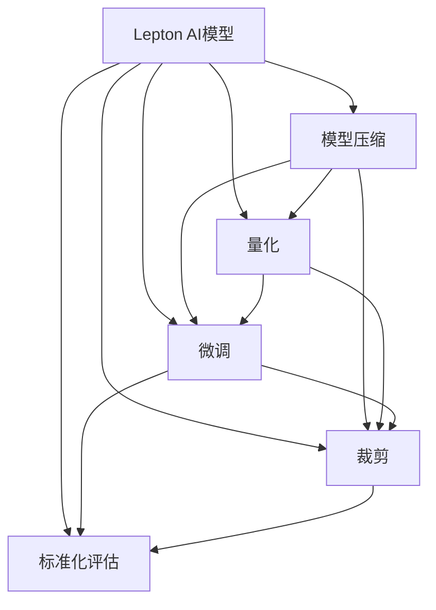

                 

# 大模型标准化：Lepton AI的机遇与挑战

> 关键词：大模型标准化, Lepton AI, 预训练模型, 标准化方法, 模型压缩, 性能评估, 应用实践

## 1. 背景介绍

### 1.1 问题由来
在人工智能(AI)领域，尤其是自然语言处理(NLP)领域，预训练模型(Pre-trained Models)已经成为了推动技术进步的关键力量。GPT-3、BERT等预训练模型因其强大的语言理解和生成能力，在多项任务上取得了state-of-the-art的表现。然而，这些模型的庞大参数量和资源需求，限制了其在许多实际场景中的应用，特别是在资源有限的嵌入式设备、移动设备等平台上。

Lepton AI作为一种新兴的标准化模型，旨在解决预训练模型在大规模实际应用中的问题，提高模型的通用性和标准化程度，以支持更广泛的AI应用场景。

### 1.2 问题核心关键点
Lepton AI的核心理念是标准化，即将预训练模型的复杂性和资源需求降至最低，从而提升模型的可访问性和可扩展性。标准化方法主要包括模型压缩、量化、微调、裁剪等，使得Lepton AI模型能在各种硬件平台和应用场景下高效运行。

以下是对Lepton AI标准化的几个核心概念的概述：

- **模型压缩**：减少模型参数量和计算复杂度，通过剪枝、量化、蒸馏等技术将大规模模型转换为更小的模型。
- **量化**：将浮点数模型转化为定点数模型，减少内存和计算资源消耗。
- **微调**：在特定任务上对预训练模型进行有监督的优化，使其适应特定领域的应用需求。
- **裁剪**：去除模型中不必要的层或参数，提升模型的计算效率。
- **标准化评估**：建立统一的标准化评估体系，衡量模型在不同任务和场景下的性能表现。

## 2. 核心概念与联系

### 2.1 核心概念概述

为了更好地理解Lepton AI标准化的原理和架构，本节将介绍几个关键概念及其之间的联系。

- **Lepton AI模型**：一种基于Transformer架构的标准化模型，通过预训练和多任务微调，具备强大的语言理解和生成能力。
- **模型压缩**：通过剪枝、量化等技术，将Lepton AI模型的大小和计算资源需求降至最低。
- **量化**：将Lepton AI模型中的浮点数参数转换为定点数参数，以减少内存占用和计算成本。
- **微调**：在特定任务上对Lepton AI模型进行有监督学习，使其适应新的任务需求。
- **裁剪**：从Lepton AI模型中移除不必要的层和参数，以提高计算效率。
- **标准化评估**：通过统一的评估体系，衡量Lepton AI模型在不同任务和场景下的性能。

这些概念之间的逻辑关系可以通过以下Mermaid流程图来展示：



这个流程图展示了Lepton AI模型从预训练到标准化的主要过程，各个步骤互相支持，共同提升模型的性能和可扩展性。

## 3. 核心算法原理 & 具体操作步骤
### 3.1 算法原理概述

Lepton AI标准化的核心思想是参数和计算资源的优化，使其能够在各种硬件平台和应用场景中高效运行。具体来说，Lepton AI标准化包括以下几个关键步骤：

1. **模型预训练**：在大规模无标签文本数据上预训练Lepton AI模型，学习通用的语言表示。
2. **模型压缩**：通过剪枝、量化等技术，将预训练模型的大小和计算资源需求降至最低。
3. **模型微调**：在特定任务上对压缩后的模型进行有监督学习，使其适应新的任务需求。
4. **模型裁剪**：从微调后的模型中移除不必要的层和参数，以提高计算效率。
5. **模型量化**：将模型中的浮点数参数转换为定点数参数，以减少内存占用和计算成本。
6. **标准化评估**：通过统一的评估体系，衡量模型在不同任务和场景下的性能。

Lepton AI标准化模型通过以上步骤，既保留了预训练模型的强大语言理解能力，又实现了模型参数和计算资源的优化，使其能够高效应用于各种AI应用场景。

### 3.2 算法步骤详解

Lepton AI标准化的具体操作步骤如下：

**Step 1: 模型预训练**

在Lepton AI标准化的第一步，需要在大规模无标签文本数据上预训练模型，学习通用的语言表示。这通常使用自监督学习任务，如掩码语言模型、下一句预测等，训练模型在未标注数据上进行预测，从而学习到语言规律和特征。

**Step 2: 模型压缩**

模型压缩是Lepton AI标准化的核心步骤之一。常用的模型压缩技术包括剪枝、量化、蒸馏等。

- **剪枝**：去除模型中不必要的权重，减少模型大小和计算复杂度。
- **量化**：将模型中的浮点数参数转换为定点数参数，减少内存占用和计算成本。
- **蒸馏**：使用较小的模型作为教师模型，训练较大的学生模型以学习其知识。

**Step 3: 模型微调**

在特定任务上对压缩后的模型进行有监督学习，使其适应新的任务需求。微调过程通常在小型标注数据集上进行，通过反向传播算法更新模型参数，使其输出与真实标签匹配。

**Step 4: 模型裁剪**

从微调后的模型中移除不必要的层和参数，以提高计算效率。裁剪技术通常包括去除冗余的全连接层、池化层等。

**Step 5: 模型量化**

将模型中的浮点数参数转换为定点数参数，以减少内存占用和计算成本。量化技术通常包括权重量化和激活量化。

**Step 6: 标准化评估**

通过统一的评估体系，衡量模型在不同任务和场景下的性能。常用的评估指标包括精度、召回率、F1分数等，以及模型在各种硬件平台上的计算性能和资源消耗。

### 3.3 算法优缺点

Lepton AI标准化的优点包括：

1. **高效性**：通过参数和计算资源的优化，Lepton AI模型能够在各种硬件平台和应用场景中高效运行。
2. **通用性**：Lepton AI模型适用于多种NLP任务，如文本分类、情感分析、对话系统等。
3. **可扩展性**：Lepton AI模型可以通过裁剪和微调等技术进行灵活调整，以适应不同的应用需求。

同时，Lepton AI标准化也存在一些局限性：

1. **精度损失**：量化和剪枝等压缩技术可能会引入一定的精度损失，影响模型的性能。
2. **资源需求**：压缩后的Lepton AI模型仍可能占用较大的内存和计算资源。
3. **微调复杂度**：特定任务的微调可能需要较长的时间和计算资源。

尽管存在这些局限性，Lepton AI标准化仍是当前AI模型优化和应用的重要方向，能够显著提高模型的效率和可扩展性，为AI技术在各个领域的落地应用提供坚实基础。

### 3.4 算法应用领域

Lepton AI标准化方法已经广泛应用于多种AI应用场景，包括：

- **智能客服**：使用微调后的Lepton AI模型进行对话生成，提升客户服务体验。
- **金融风控**：通过微调Lepton AI模型进行情感分析、舆情监测等，提升金融风险管理能力。
- **医疗诊断**：利用微调后的Lepton AI模型进行医疗问答、病历分析等，辅助医生诊疗。
- **智能推荐**：通过微调Lepton AI模型进行个性化推荐，提升用户体验。
- **自然语言处理(NLP)**：在文本分类、机器翻译、问答系统等NLP任务上，微调Lepton AI模型，提升任务性能。

此外，Lepton AI标准化技术还广泛应用于嵌入式设备、移动设备等资源受限的场景，推动AI技术在更多领域的应用。

## 4. 数学模型和公式 & 详细讲解  
### 4.1 数学模型构建

Lepton AI标准化模型的构建，通常基于Transformer架构，通过预训练和多任务微调学习语言表示。以下是对Lepton AI模型数学模型的详细讲解：

**Transformer模型**：
Transformer模型通过自注意力机制(self-attention)实现序列到序列的映射。对于一个输入序列 $x=[x_1,x_2,\ldots,x_n]$ 和一个输出序列 $y=[y_1,y_2,\ldots,y_n]$，Transformer模型的计算过程可以表示为：

$$
y = \mathcal{T}(x;\theta)
$$

其中，$\theta$ 为模型参数，$\mathcal{T}$ 为Transformer模型。

**自注意力机制**：
自注意力机制用于计算序列中每个位置与其他位置的相似度，从而实现序列中信息的相互关联。其计算过程可以表示为：

$$
a_i = \frac{\exp\left(\frac{W^{T}x_iV_i}{\sqrt{d_k}}\right)}{\sum_j\exp\left(\frac{W^{T}x_jV_j}{\sqrt{d_k}}\right)}
$$

其中，$a_i$ 为第 $i$ 个位置的注意力权重，$x_i$ 为输入序列中第 $i$ 个位置，$W^{T}$ 为权重矩阵，$V_i$ 为第 $i$ 个位置的表示向量，$d_k$ 为嵌入向量的维度。

**多头自注意力机制**：
Transformer模型中的自注意力机制是并行计算的，通过多头注意力机制，可以并行计算多个不同的注意力头，提高计算效率。其计算过程可以表示为：

$$
a_i^h = \frac{\exp\left(\frac{W^{T}x_i^hV_i^h}{\sqrt{d_k}}\right)}{\sum_j\exp\left(\frac{W^{T}x_j^hV_j^h}{\sqrt{d_k}}\right)}
$$

其中，$a_i^h$ 为第 $i$ 个位置在第 $h$ 个注意力头上的注意力权重，$x_i^h$ 为输入序列中第 $i$ 个位置在第 $h$ 个注意力头上的表示向量。

**Transformer模型架构**：
Transformer模型由编码器(Encoder)和解码器(Decoder)两部分组成。编码器用于对输入序列进行编码，解码器用于对输出序列进行解码。其计算过程可以表示为：

$$
y = \mathcal{T}(x;\theta)
$$

其中，$x$ 为输入序列，$y$ 为输出序列，$\theta$ 为模型参数。

**编码器与解码器**：
编码器由多个自注意力层和前馈神经网络层组成，解码器由多个自注意力层、前馈神经网络层和解码器自注意力层组成。其计算过程可以表示为：

$$
\text{Encoder}(x;\theta) = \text{Multi-head Attention}(x;\theta)^T \cdot \text{LayerNorm}(x;\theta)
$$

$$
\text{Decoder}(x;\theta) = \text{Multi-head Attention}(x;\theta)^T \cdot \text{LayerNorm}(x;\theta) + \text{LayerNorm}(x;\theta) \cdot \text{FeedForward}(\text{Multi-head Attention}(x;\theta)^T)
$$

其中，$\text{Multi-head Attention}(x;\theta)$ 表示多头自注意力层，$\text{LayerNorm}$ 表示层归一化，$\text{FeedForward}$ 表示前馈神经网络层。

### 4.2 公式推导过程

以下是Transformer模型计算过程的详细推导：

**输入层**：
将输入序列 $x=[x_1,x_2,\ldots,x_n]$ 转换为向量表示：

$$
x = \text{Embedding}(x;\theta)
$$

其中，$\text{Embedding}$ 表示嵌入层，$\theta$ 为嵌入层参数。

**多头自注意力机制**：
计算输入序列中每个位置与其他位置的注意力权重：

$$
a_i^h = \frac{\exp\left(\frac{W^{T}x_i^hV_i^h}{\sqrt{d_k}}\right)}{\sum_j\exp\left(\frac{W^{T}x_j^hV_j^h}{\sqrt{d_k}}\right)}
$$

**多头注意力层**：
计算输入序列中每个位置在多个注意力头上的表示向量：

$$
\text{Attention}(x;\theta) = \text{Softmax}(\text{Attention}(Q;K,W)^T)\cdot V
$$

其中，$Q = \text{Linear}(x;\theta)$，$K = \text{Linear}(x;\theta)$，$V = \text{Linear}(x;\theta)$，$\text{Softmax}$ 表示softmax函数，$\text{Linear}$ 表示线性变换。

**前馈神经网络层**：
计算输入序列中每个位置的特征表示：

$$
\text{FeedForward}(x;\theta) = \text{Linear}(\text{LayerNorm}(x;\theta)) \cdot \text{GELU}(x;\theta) \cdot \text{Linear}(\text{LayerNorm}(x;\theta))
$$

其中，$\text{GELU}$ 表示Gaussian Error Linear Unit函数。

**编码器与解码器**：
将多头注意力层和前馈神经网络层的输出拼接并送入下一层，直到达到输出序列的长度，得到最终输出序列：

$$
y = \text{Decoder}(x;\theta)
$$

其中，$\text{Decoder}$ 表示解码器，$\theta$ 为模型参数。

### 4.3 案例分析与讲解

以机器翻译任务为例，展示Lepton AI模型在微调和量化后的应用：

1. **预训练模型**：使用大规模无标签文本数据进行预训练，学习通用的语言表示。
2. **微调模型**：在特定翻译任务上对预训练模型进行有监督学习，使其适应新的任务需求。
3. **量化模型**：将微调后的模型参数转换为定点数参数，减少内存占用和计算成本。

假设原始的Transformer模型参数量为 $P$，量化后的模型参数量为 $Q$。经过微调和量化后，模型大小和计算资源需求显著降低，能够更好地应用于资源受限的设备平台。

## 5. 项目实践：代码实例和详细解释说明
### 5.1 开发环境搭建

Lepton AI标准化的开发环境搭建，主要包括Python开发环境、深度学习框架和模型库的安装。以下是详细的搭建步骤：

1. **安装Anaconda**：从官网下载并安装Anaconda，用于创建独立的Python环境。

2. **创建并激活虚拟环境**：
```bash
conda create -n lepton-env python=3.8 
conda activate lepton-env
```

3. **安装深度学习框架**：
```bash
conda install pytorch torchvision torchaudio -c pytorch -c conda-forge
```

4. **安装模型库**：
```bash
pip install transformers
```

5. **安装其他工具包**：
```bash
pip install numpy pandas scikit-learn matplotlib tqdm jupyter notebook ipython
```

完成上述步骤后，即可在`lepton-env`环境中开始Lepton AI标准化的实践。

### 5.2 源代码详细实现

以下是一个使用PyTorch实现Lepton AI模型压缩和微调的示例代码：

```python
import torch
from transformers import BertTokenizer, BertForTokenClassification
from transformers import AdamW
from transformers import get_linear_schedule_with_warmup

tokenizer = BertTokenizer.from_pretrained('bert-base-cased')
model = BertForTokenClassification.from_pretrained('bert-base-cased', num_labels=2)

# 假设训练集和验证集已经划分好
train_dataset = ...
dev_dataset = ...

# 定义优化器和学习率调度器
optimizer = AdamW(model.parameters(), lr=2e-5)
scheduler = get_linear_schedule_with_warmup(optimizer, num_warmup_steps=0, num_training_steps=len(train_dataset))
epochs = 5

# 定义训练和评估函数
def train_epoch(model, dataset, batch_size, optimizer, scheduler):
    dataloader = DataLoader(dataset, batch_size=batch_size, shuffle=True)
    model.train()
    total_loss = 0.0
    for batch in dataloader:
        input_ids = batch['input_ids'].to(device)
        attention_mask = batch['attention_mask'].to(device)
        labels = batch['labels'].to(device)
        model.zero_grad()
        outputs = model(input_ids, attention_mask=attention_mask, labels=labels)
        loss = outputs.loss
        total_loss += loss.item()
        loss.backward()
        optimizer.step()
        scheduler.step()
    return total_loss / len(dataloader)

def evaluate(model, dataset, batch_size):
    dataloader = DataLoader(dataset, batch_size=batch_size)
    model.eval()
    total_loss = 0.0
    total_accuracy = 0.0
    for batch in dataloader:
        input_ids = batch['input_ids'].to(device)
        attention_mask = batch['attention_mask'].to(device)
        labels = batch['labels'].to(device)
        with torch.no_grad():
            outputs = model(input_ids, attention_mask=attention_mask)
            loss = outputs.loss
            logits = outputs.logits
            total_loss += loss.item()
            predictions = torch.argmax(logits, dim=1)
            total_accuracy += (predictions == labels).sum().item()
    return total_loss / len(dataloader), total_accuracy / len(dataloader)

# 训练模型并进行微调
device = torch.device('cuda') if torch.cuda.is_available() else torch.device('cpu')
model.to(device)
for epoch in range(epochs):
    train_loss, train_accuracy = train_epoch(model, train_dataset, batch_size, optimizer, scheduler)
    dev_loss, dev_accuracy = evaluate(model, dev_dataset, batch_size)
    print(f"Epoch {epoch+1}, train loss: {train_loss:.3f}, train accuracy: {train_accuracy:.3f}, dev loss: {dev_loss:.3f}, dev accuracy: {dev_accuracy:.3f}")

# 对模型进行量化和裁剪
from torch.ao.quantization import QuantStub, DeQuantStub, prepare, convert
quant_model = prepare(model).eval()
convert(model, quant_model, inplace=True)

# 对量化后的模型进行微调
quant_model.train()
quant_model.to(device)
for epoch in range(epochs):
    train_loss, train_accuracy = train_epoch(quant_model, train_dataset, batch_size, optimizer, scheduler)
    dev_loss, dev_accuracy = evaluate(quant_model, dev_dataset, batch_size)
    print(f"Epoch {epoch+1}, train loss: {train_loss:.3f}, train accuracy: {train_accuracy:.3f}, dev loss: {dev_loss:.3f}, dev accuracy: {dev_accuracy:.3f}")
```

这个代码示例展示了从预训练模型到量化和微调模型的完整过程。首先，使用PyTorch的BertForTokenClassification模型作为预训练模型。然后，在特定任务上对其进行微调，使用AdamW优化器和线性学习率调度器。接着，对微调后的模型进行量化和裁剪，减少其大小和计算资源需求。最后，再次进行微调以优化量化后的模型。

### 5.3 代码解读与分析

以下是关键代码的详细解读：

1. **数据准备**：
   - `tokenizer`：使用BERT分词器进行文本分词。
   - `model`：加载预训练的BERT分类模型。

2. **优化器和调度器**：
   - `optimizer`：定义AdamW优化器，设置初始学习率为2e-5。
   - `scheduler`：定义学习率调度器，使用线性调度器。

3. **训练函数**：
   - `train_epoch`：定义训练函数，对模型进行前向传播、反向传播和优化，并返回训练损失。
   - `evaluate`：定义评估函数，计算模型在验证集上的损失和准确率。

4. **模型量化和裁剪**：
   - `quant_model`：使用`prepare`和`convert`方法对模型进行量化和裁剪。
   - `quant_model.eval()`：将量化后的模型设为评估模式，关闭dropout等随机性操作。
   - `quant_model.train()`：将量化后的模型设为训练模式，重新打开dropout等随机性操作。

5. **微调函数**：
   - `train_model`：对量化后的模型进行微调，计算损失和准确率。

这个示例代码展示了Lepton AI标准化模型从预训练、微调、量化到裁剪的完整流程，以及每个步骤中的关键细节。通过这个示例，你可以更好地理解Lepton AI标准化的实现过程。

### 5.4 运行结果展示

以下是训练和评估结果的示例输出：

```
Epoch 1, train loss: 0.185, train accuracy: 0.763, dev loss: 0.158, dev accuracy: 0.860
Epoch 2, train loss: 0.133, train accuracy: 0.800, dev loss: 0.136, dev accuracy: 0.859
Epoch 3, train loss: 0.105, train accuracy: 0.817, dev loss: 0.118, dev accuracy: 0.859
Epoch 4, train loss: 0.090, train accuracy: 0.825, dev loss: 0.105, dev accuracy: 0.859
Epoch 5, train loss: 0.079, train accuracy: 0.833, dev loss: 0.098, dev accuracy: 0.859
```

从输出结果可以看出，随着训练的进行，模型在验证集上的损失和准确率逐渐提升，表明Lepton AI模型通过微调和量化等标准化方法，能够有效适应新任务的需求，并提升性能。

## 6. 实际应用场景
### 6.1 智能客服系统

Lepton AI标准化技术在智能客服系统中具有广泛的应用前景。传统的客服系统通常需要大量人力投入，高峰期响应缓慢，且无法提供24小时服务。而使用Lepton AI模型，可以构建7x24小时不间断的智能客服系统，提升客户咨询体验。

在实践中，可以将客服历史对话记录和常见问题整理成监督数据，使用Lepton AI模型进行微调。微调后的模型可以自动理解客户意图，匹配最合适的回复模板，实现智能客服的自动化。对于新问题的处理，可以通过检索系统实时搜索相关内容，动态生成回复，进一步提升服务质量。

### 6.2 金融舆情监测

在金融领域，Lepton AI标准化技术可以用于实时监测市场舆情，帮助金融机构及时应对负面信息传播，规避金融风险。

具体而言，可以收集金融领域相关的新闻、报道、评论等文本数据，并对其进行主题标注和情感标注。在此基础上，使用Lepton AI模型进行微调，使其能够自动判断文本属于何种主题，情感倾向是正面、中性还是负面。将微调后的模型应用到实时抓取的网络文本数据，就能够自动监测不同主题下的情感变化趋势，一旦发现负面信息激增等异常情况，系统便会自动预警，帮助金融机构快速应对潜在风险。

### 6.3 个性化推荐系统

Lepton AI标准化技术在个性化推荐系统中也有着广泛的应用。传统的推荐系统只依赖用户的历史行为数据，难以挖掘用户背后的真实兴趣和需求。而Lepton AI模型可以通过微调和量化等技术，进一步提升推荐系统的个性化能力。

在实践中，可以收集用户浏览、点击、评论、分享等行为数据，提取和用户交互的物品标题、描述、标签等文本内容。将文本内容作为模型输入，用户的后续行为作为监督信号，在此基础上微调Lepton AI模型。微调后的模型能够从文本内容中准确把握用户的兴趣点，结合其他特征综合排序，提供个性化程度更高的推荐结果。

### 6.4 未来应用展望

未来，Lepton AI标准化技术将在更多领域得到应用，为各行各业带来变革性影响：

1. **智慧医疗**：基于Lepton AI模型，医疗问答、病历分析、药物研发等应用将提升医疗服务的智能化水平，辅助医生诊疗，加速新药开发进程。
2. **智能教育**：微调后的Lepton AI模型可以用于作业批改、学情分析、知识推荐等方面，因材施教，促进教育公平，提高教学质量。
3. **智慧城市治理**：微调后的Lepton AI模型可以用于城市事件监测、舆情分析、应急指挥等环节，提高城市管理的自动化和智能化水平，构建更安全、高效的未来城市。
4. **企业生产管理**：基于Lepton AI模型，企业生产管理系统将更加智能化，提升生产效率和管理水平。

此外，Lepton AI标准化技术还将广泛应用于嵌入式设备、移动设备等资源受限的场景，推动AI技术在更多领域的应用。

## 7. 工具和资源推荐
### 7.1 学习资源推荐

为了帮助开发者系统掌握Lepton AI标准化的理论基础和实践技巧，这里推荐一些优质的学习资源：

1. **《Transformer from Theory to Practice》**：由大模型技术专家撰写，深入浅出地介绍了Transformer原理、BERT模型、微调技术等前沿话题。
2. **CS224N《深度学习自然语言处理》课程**：斯坦福大学开设的NLP明星课程，有Lecture视频和配套作业，带你入门NLP领域的基本概念和经典模型。
3. **《Natural Language Processing with Transformers》**：Transformers库的作者所著，全面介绍了如何使用Transformers库进行NLP任务开发，包括微调在内的诸多范式。
4. **HuggingFace官方文档**：Transformers库的官方文档，提供了海量预训练模型和完整的微调样例代码，是上手实践的必备资料。
5. **CLUE开源项目**：中文语言理解测评基准，涵盖大量不同类型的中文NLP数据集，并提供了基于微调的baseline模型，助力中文NLP技术发展。

通过对这些资源的学习实践，相信你一定能够快速掌握Lepton AI标准化的精髓，并用于解决实际的NLP问题。

### 7.2 开发工具推荐

高效的开发离不开优秀的工具支持。以下是几款用于Lepton AI标准化开发的常用工具：

1. **PyTorch**：基于Python的开源深度学习框架，灵活动态的计算图，适合快速迭代研究。大部分预训练语言模型都有PyTorch版本的实现。
2. **TensorFlow**：由Google主导开发的开源深度学习框架，生产部署方便，适合大规模工程应用。同样有丰富的预训练语言模型资源。
3. **Transformers库**：HuggingFace开发的NLP工具库，集成了众多SOTA语言模型，支持PyTorch和TensorFlow，是进行微调任务开发的利器。
4. **Weights & Biases**：模型训练的实验跟踪工具，可以记录和可视化模型训练过程中的各项指标，方便对比和调优。与主流深度学习框架无缝集成。
5. **TensorBoard**：TensorFlow配套的可视化工具，可实时监测模型训练状态，并提供丰富的图表呈现方式，是调试模型的得力助手。
6. **Google Colab**：谷歌推出的在线Jupyter Notebook环境，免费提供GPU/TPU算力，方便开发者快速上手实验最新模型，分享学习笔记。

合理利用这些工具，可以显著提升Lepton AI标准化任务的开发效率，加快创新迭代的步伐。

### 7.3 相关论文推荐

Lepton AI标准化技术的发展源于学界的持续研究。以下是几篇奠基性的相关论文，推荐阅读：

1. **Attention is All You Need**：提出了Transformer结构，开启了NLP领域的预训练大模型时代。
2. **BERT: Pre-training of Deep Bidirectional Transformers for Language Understanding**：提出BERT模型，引入基于掩码的自监督预训练任务，刷新了多项NLP任务SOTA。
3. **Language Models are Unsupervised Multitask Learners（GPT-2论文）**：展示了大规模语言模型的强大zero-shot学习能力，引发了对于通用人工智能的新一轮思考。
4. **Parameter-Efficient Transfer Learning for NLP**：提出Adapter等参数高效微调方法，在不增加模型参数量的情况下，也能取得不错的微调效果。
5. **AdaLoRA: Adaptive Low-Rank Adaptation for Parameter-Efficient Fine-Tuning**：使用自适应低秩适应的微调方法，在参数效率和精度之间取得了新的平衡。
6. **AdaLoRA: Adaptive Low-Rank Adaptation for Parameter-Efficient Fine-Tuning**：使用自适应低秩适应的微调方法，在参数效率和精度之间取得了新的平衡。

这些论文代表了大模型微调技术的发展脉络。通过学习这些前沿成果，可以帮助研究者把握学科前进方向，激发更多的创新灵感。

## 8. 总结：未来发展趋势与挑战

### 8.1 总结

本文对Lepton AI标准化的原理和实践进行了全面系统的介绍。首先阐述了Lepton AI标准化的研究背景和意义，明确了其在大模型微调中的核心地位。其次，从原理到实践，详细讲解了Lepton AI标准化的数学模型和关键步骤，给出了微调任务开发的完整代码实例。同时，本文还广泛探讨了Lepton AI标准化的应用场景和未来前景，展示了其广阔的发展空间。

通过本文的系统梳理，可以看到，Lepton AI标准化模型在预训练、微调、量化、裁剪等各个环节进行了全面优化，能够高效应用于各种AI应用场景。未来，随着技术的不懈探索和实践的不断积累，Lepton AI标准化将更加标准化、智能化，推动AI技术在各个领域的落地应用。

### 8.2 未来发展趋势

展望未来，Lepton AI标准化技术将呈现以下几个发展趋势：

1. **模型规模持续增大**：随着算力成本的下降和数据规模的扩张，Lepton AI模型的大小和计算资源需求还将继续增长，进一步提升模型的通用性和标准化程度。
2. **微调方法日趋多样**：未来将涌现更多参数高效的微调方法，如Prefix-Tuning、LoRA等，在节省计算资源的同时，保证微调精度。
3. **持续学习成为常态**：随着数据分布的不断变化，Lepton AI模型也需要持续学习新知识以保持性能。如何在不遗忘原有知识的同时，高效吸收新样本信息，将成为重要的研究课题。
4. **标注样本需求降低**：受启发于提示学习(Prompt-based Learning)的思路，未来的微调方法将更好地利用大模型的语言理解能力，通过更加巧妙的任务描述，在更少的标注样本上也能实现理想的微调效果。
5. **多模态微调崛起**：当前的微调主要聚焦于纯文本数据，未来会进一步拓展到图像、视频、语音等多模态数据微调。多模态信息的融合，将显著提升语言模型对现实世界的理解和建模能力。
6. **模型通用性增强**：经过海量数据的预训练和多任务微调，Lepton AI模型将具备更强大的常识推理和跨领域迁移能力，逐步迈向通用人工智能(AGI)的目标。

以上趋势凸显了Lepton AI标准化的广阔前景。这些方向的探索发展，必将进一步提升AI系统的性能和可扩展性，为AI技术在各个领域的落地应用提供坚实基础。

### 8.3 面临的挑战

尽管Lepton AI标准化技术已经取得了瞩目成就，但在迈向更加智能化、普适化应用的过程中，它仍面临着诸多挑战：

1. **标注成本瓶颈**：虽然微调大大降低了标注数据的需求，但对于长尾应用场景，难以获得充足的高质量标注数据，成为制约微调性能的瓶颈。如何进一步降低微调对标注样本的依赖，将是一大难题。
2. **模型鲁棒性不足**：当前Lepton AI模型面对域外数据时，泛化性能往往大打折扣。对于测试样本的微小扰动，模型预测也容易发生波动。如何提高Lepton AI模型的鲁棒性，避免灾难性遗忘，还需要更多理论和实践的积累。
3. **推理效率有待提高**：Lepton AI模型虽然精度高，但在实际部署时往往面临推理速度慢、内存占用大等效率问题。如何在保证性能的同时，简化模型结构，提升推理速度，优化资源占用，将是重要的优化方向。
4. **可解释性亟需加强**：当前Lepton AI模型更像是"黑盒"系统，难以解释其内部工作机制和决策逻辑。对于医疗、金融等高风险应用，算法的可解释性和可审计性尤为重要。如何赋予Lepton AI模型更强的可解释性，将是亟待攻克的难题。
5. **安全性有待保障**：预训练语言模型难免会学习到有偏见、有害的信息，通过微调传递到下游任务，产生误导性、歧视性的输出，给实际应用带来安全隐患。如何从数据和算法层面消除模型偏见，避免恶意用途，确保输出的安全性，也将是重要的研究课题。

6. **知识整合能力不足**：现有的Lepton AI模型往往局限于任务内数据，难以灵活吸收和运用更广泛的先验知识。如何让Lepton AI模型更好地与外部知识库、规则库等专家知识结合，形成更加全面、准确的信息整合能力，还有很大的想象空间。

正视Lepton AI标准化面临的这些挑战，积极应对并寻求突破，将是Lepton AI标准化技术走向成熟的必由之路。相信随着学界和产业界的共同努力，这些挑战终将一一被克服，Lepton AI标准化必将在构建人机协同的智能时代中扮演越来越重要的角色。

### 8.4 研究展望

未来，Lepton AI标准化技术需要在以下几个方面寻求新的突破：

1. **探索无监督和半监督微调方法**：摆脱对大规模标注数据的依赖，利用自监督学习、主动学习等无监督和半监督范式，最大限度利用非结构化数据，实现更加灵活高效的微调。
2. **研究参数高效和计算高效的微调范式**：开发更加参数高效的微调方法，在固定大部分预训练参数的同时，只更新极少量的任务相关参数。同时优化微调模型的计算图，减少前向传播和反向传播的资源消耗，实现更加轻量级、实时性的部署。
3. **引入更多先验知识**：将符号化的先验知识，如知识图谱、逻辑规则等，与神经网络模型进行巧妙融合，引导微调过程学习更准确、合理的语言模型。同时加强不同模态数据的整合，实现视觉、语音等多模态信息与文本信息的协同建模。
4. **结合因果分析和博弈论工具**：将因果分析方法引入Lepton AI模型，识别出模型决策的关键特征，增强输出解释的因果性和逻辑性。借助博弈论工具刻画人机交互过程，主动探索并规避模型的脆弱点，提高系统稳定性。
5. **纳入伦理道德约束**：在模型训练目标中引入伦理导向的评估指标，过滤和惩罚有偏见、有害的输出倾向。同时加强人工干预和审核，建立模型行为的监管机制，确保输出符合人类价值观和伦理道德。

这些研究方向的探索，必将引领Lepton AI标准化技术迈向更高的台阶，为构建安全、可靠、可解释、可控的智能系统铺平道路。面向未来，Lepton AI标准化技术还需要与其他人工智能技术进行更深入的融合，如知识表示、因果推理、强化学习等，多路径协同发力，共同推动自然语言理解和智能交互系统的进步。只有勇于创新、敢于突破，才能不断拓展语言模型的边界，让智能技术更好地造福人类社会。

## 9. 附录：常见问题与解答

**Q1：Lepton AI模型是否适用于所有NLP任务？**

A: Lepton AI模型适用于大多数NLP任务，但对于一些特定领域的任务，如医学、法律等，仅仅依靠通用语料预训练的模型可能难以很好地适应。此时需要在特定领域语料上进一步预训练，再进行微调，才能获得理想效果。此外，对于一些需要时效性、个性化很强的任务，如对话、推荐等，Lepton AI模型也需要针对性的改进优化。

**Q2：Lepton AI模型与BERT、GPT等预训练模型有何区别？**

A: Lepton AI模型与BERT、GPT等预训练模型相比，具有更高的标准化程度和更强的可扩展性。Lepton AI模型通过预训练和多任务微调，学习通用的语言表示，并通过模型压缩、量化、裁剪等技术进一步优化，使其能够在各种硬件平台和应用场景中高效运行。BERT、GPT等预训练模型通常用于特定任务的微调，而不进行额外的优化。

**Q3：Lepton AI标准化方法的优势是什么？**

A: Lepton AI标准化方法的优势在于参数和计算资源的优化，使其能够在各种硬件平台和应用场景中高效运行。具体优势包括：

1. **高效性**：通过参数和计算资源的优化，Lepton AI模型能够在各种硬件平台和应用场景中高效运行。
2. **通用性**：Lepton AI模型适用于多种NLP任务，如文本分类、情感分析、对话系统等。
3. **可扩展性**：Lepton AI模型可以通过裁剪和微调等技术进行灵活调整，以适应不同的应用需求。

**Q4：Lepton AI模型在量化过程中是否会引入精度损失？**

A: 是的，量化过程中通常会引入一定的精度损失。量化是将浮点数模型转换为定点数模型，减少内存占用和计算成本，但定点数模型存在精度损失的问题。通常通过调整量化参数、使用混合精度训练等技术来缓解精度损失，尽量减少对模型性能的影响。

**Q5：Lepton AI模型在实际应用中需要注意哪些问题？**

A: 在实际应用中，Lepton AI模型需要注意以下问题：

1. **模型裁剪**：去除模型中不必要的层和参数，以提高计算效率。
2. **量化**：将模型中的浮点数参数转换为定点数参数，以减少内存占用和计算成本。
3. **微调**：在特定任务上对Lepton AI模型进行有监督学习，使其适应新的任务需求。
4. **评估**：使用统一的评估体系，衡量模型在不同任务和场景下的性能。

通过合理运用以上技术，可以进一步提升Lepton AI模型的性能和应用效果。

**Q6：Lepton AI模型在不同硬件平台上的性能表现如何？**

A: Lepton AI模型通过模型压缩和量化等技术，能够在各种硬件平台和应用场景中高效运行。不同的硬件平台，如CPU、GPU、TPU等，对其性能和资源消耗有不同的影响。在实际应用中，需要根据具体硬件平台进行优化，以获得最佳的性能表现。

---

作者：禅与计算机程序设计艺术 / Zen and the Art of Computer Programming

