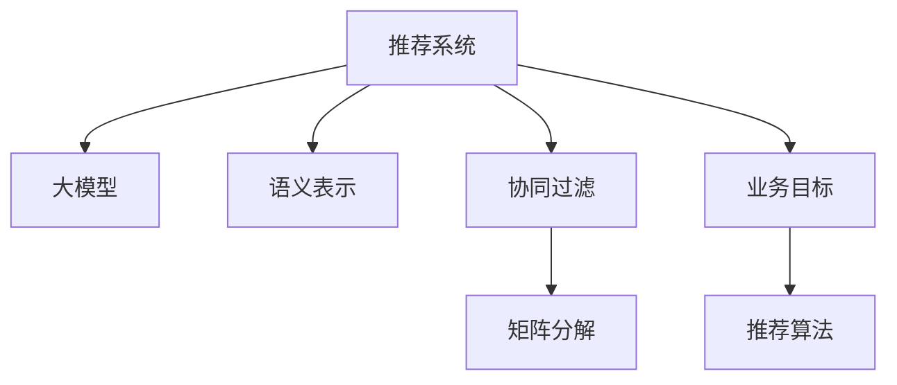

                 

# 大模型视角下推荐系统的业务目标导向优化

> 关键词：大模型,推荐系统,业务目标,优化,用户画像,协同过滤,矩阵分解

## 1. 背景介绍

### 1.1 问题由来
随着互联网和移动互联网的发展，信息爆炸现象愈发显著，用户面临的信息干扰越来越严重。如何高效、精准地为用户推荐感兴趣的内容，成为各大平台面临的重大挑战。推荐系统因此应运而生，通过数据分析和机器学习，为用户推荐个性化的内容。

传统推荐系统通常基于用户的浏览历史、评分行为等数据，使用协同过滤、矩阵分解等方法进行模型训练。但随着用户基数的增大，这些方法逐渐暴露出维度过高、计算复杂度高、训练成本大等缺点。

近年来，基于大模型的推荐系统逐渐兴起。这类推荐系统以大语言模型作为基础，通过预训练和微调，学习用户行为背后的语义信息，进而提升推荐的准确性和个性化程度。本文将从业务目标导向的角度，探讨大模型推荐系统的优化方法，以期为推荐系统的实践提供指导。

### 1.2 问题核心关键点
大模型推荐系统通过将用户和内容进行自然语言描述，构建用户-物品语义关联矩阵，再基于关联矩阵进行推荐。其中，语言描述的有效性、矩阵分解的合理性、推荐算法的设计等都是影响系统性能的关键点。

本文将重点分析以下几个核心关键点：
1. 如何高效生成用户和内容的语义描述。
2. 如何通过矩阵分解提升语义相似度计算的准确性。
3. 如何设计高效的推荐算法。
4. 如何根据业务目标优化推荐策略。

## 2. 核心概念与联系

### 2.1 核心概念概述

为更好地理解大模型视角下推荐系统的优化方法，本节将介绍几个密切相关的核心概念：

- 推荐系统：通过用户行为数据，利用机器学习算法为用户推荐感兴趣的内容。推荐系统的目标是提升用户满意度，增强平台黏性。

- 大模型：指通过大规模语料进行预训练的深度学习模型，如BERT、GPT等。大模型具备强大的语义理解能力，可以更精准地捕捉用户和内容之间的语义关系。

- 语义表示：指将用户和内容转化为自然语言，并基于自然语言进行相似度计算，从而提升推荐的个性化和精准度。

- 协同过滤：基于用户和内容的评分行为，通过矩阵分解等方法，构建用户-物品关联矩阵，再通过相似度计算推荐内容。

- 矩阵分解：对用户-物品关联矩阵进行低秩分解，学习出用户和物品的隐向量表示，从而更准确地计算相似度。

- 业务目标：推荐系统的核心目标是提升用户体验，但不同业务场景的指标要求可能不同。如电商推荐侧重点击率、转化率，新闻推荐侧重点击量、互动率。

这些核心概念之间的逻辑关系可以通过以下Mermaid流程图来展示：



这个流程图展示了大模型推荐系统的核心概念及其之间的关系：

1. 推荐系统以用户行为数据为基础，通过大模型学习用户和内容的语义关系。
2. 大模型将用户和内容转换为语义表示，协同过滤和矩阵分解方法基于语义表示进行推荐。
3. 推荐算法设计需要考虑业务目标，合理计算用户和物品的相似度。

这些概念共同构成了大模型推荐系统的基本框架，为其优化提供了理论基础和实践指南。

## 3. 核心算法原理 & 具体操作步骤
### 3.1 算法原理概述

大模型推荐系统的核心思想是通过自然语言描述，构建用户和物品之间的语义关系，从而进行推荐。其核心算法包括：

1. 预训练大模型：对大规模语料进行预训练，学习自然语言的语义表示。

2. 语义表示生成：将用户和内容转化为自然语言，并基于大模型生成语义表示。

3. 矩阵分解：对用户-物品关联矩阵进行低秩分解，学习出用户和物品的隐向量表示。

4. 相似度计算：基于隐向量表示计算用户和物品之间的相似度，从而进行推荐。

5. 推荐算法：设计高效的推荐算法，如基于注意力机制的推荐、基于深度学习的推荐等。

6. 业务目标优化：根据具体业务场景，调整推荐策略，如提高点击率、转化率等。

### 3.2 算法步骤详解

大模型推荐系统的实现通常分为以下几个步骤：

**Step 1: 准备数据集和预训练模型**
- 收集用户行为数据，如点击、浏览、评分等，构建用户-物品关联矩阵。
- 选择合适的大模型作为初始化参数，如BERT、GPT等。

**Step 2: 语义表示生成**
- 将用户和物品转化为自然语言描述，如“用户A”转化为“用户A喜欢XX、YY、ZZ”，“商品1”转化为“商品1适合XX、YY、ZZ”。
- 利用大模型将自然语言描述转换为向量表示，即用户向量 $\vec{u}$ 和物品向量 $\vec{v}$。

**Step 3: 矩阵分解**
- 对用户-物品关联矩阵进行低秩分解，得到用户-物品关联矩阵 $M$ 的隐向量表示 $U$ 和 $V$。
- 使用矩阵分解方法（如SVD、ALS等），求解用户和物品的隐向量表示。

**Step 4: 相似度计算**
- 计算用户向量 $\vec{u}$ 和物品向量 $\vec{v}$ 之间的余弦相似度，即 $\cos(\theta) = \vec{u} \cdot \vec{v} / (||\vec{u}|| ||\vec{v}||)$。
- 根据相似度大小，推荐用户感兴趣的商品。

**Step 5: 推荐算法设计**
- 设计高效的推荐算法，如基于注意力机制的推荐、基于深度学习的推荐等。
- 在推荐算法中引入业务目标导向的优化策略，如通过A/B测试调整模型参数。

**Step 6: 模型优化**
- 使用梯度下降等优化算法，最小化推荐误差。
- 根据业务目标调整损失函数，如点击率优化、转化率优化等。

### 3.3 算法优缺点

大模型推荐系统具有以下优点：
1. 模型性能优异。大模型具备强大的语义表示能力，推荐结果更精准、个性化。
2. 泛化能力强。大模型通过预训练和微调，能够适应不同领域、不同场景的推荐任务。
3. 自动化程度高。通过大模型生成语义表示，减少了手工特征工程的工作量。
4. 易于扩展。大模型推荐系统可以轻松集成到现有的推荐系统中，进行升级改造。

同时，该方法也存在一定的局限性：
1. 数据隐私问题。自然语言描述可能包含敏感信息，如何保护用户隐私是一个关键问题。
2. 计算复杂度高。大模型和矩阵分解方法的计算复杂度较高，需要高性能计算资源。
3. 解释性不足。大模型推荐系统难以解释其内部机制，用户难以理解推荐决策的依据。
4. 业务目标单一。推荐系统通常针对单一业务目标进行优化，难以兼顾不同业务场景的需求。

尽管存在这些局限性，但大模型推荐系统在推荐任务中依然具备强大的优势，能够显著提升推荐的性能和效果。

### 3.4 算法应用领域

大模型推荐系统已经在电商、新闻、社交网络等多个领域得到广泛应用，并取得了显著效果：

- 电商推荐：如淘宝、京东等电商平台，通过大模型推荐系统，提升用户点击率、转化率。
- 新闻推荐：如今日头条、网易新闻等，通过大模型推荐系统，增加用户点击量和互动率。
- 社交网络：如微信、微博等，通过大模型推荐系统，增强用户粘性、提升内容曝光率。
- 视频推荐：如优酷、爱奇艺等，通过大模型推荐系统，增加用户观看时长、提升用户满意度。
- 音乐推荐：如网易云音乐、QQ音乐等，通过大模型推荐系统，增加用户播放次数、提升用户黏性。

## 4. 数学模型和公式 & 详细讲解 & 举例说明
### 4.1 数学模型构建

本节将使用数学语言对大模型推荐系统的各个环节进行严谨的数学建模和公式推导。

记用户-物品关联矩阵为 $M \in \mathbb{R}^{N \times M}$，其中 $N$ 为用户数，$M$ 为物品数。假设用户向量 $\vec{u} \in \mathbb{R}^d$，物品向量 $\vec{v} \in \mathbb{R}^d$，$d$ 为向量维度。

定义用户和物品之间的余弦相似度为：

$$
\cos(\theta) = \vec{u} \cdot \vec{v} / (||\vec{u}|| ||\vec{v}||)
$$

在实际应用中，常常使用基于矩阵分解的方法，将用户-物品关联矩阵 $M$ 分解为用户矩阵 $U$ 和物品矩阵 $V$，即 $M = U \cdot V^T$。其中 $U \in \mathbb{R}^{N \times k}$，$V \in \mathbb{R}^{M \times k}$，$k$ 为隐向量维度。

通过矩阵分解，可以得到用户和物品的隐向量表示，从而计算相似度。具体的公式推导过程如下：

**余弦相似度计算**：

$$
\cos(\theta) = \vec{u} \cdot \vec{v} / (||\vec{u}|| ||\vec{v}||)
$$

**矩阵分解表示**：

$$
M = U \cdot V^T
$$

将矩阵分解代入余弦相似度计算中，得到：

$$
\cos(\theta) = \vec{u} \cdot \vec{v} / (||U^T \cdot U|| ||V^T \cdot V||)
$$

由于 $U^T \cdot U$ 和 $V^T \cdot V$ 均为对角矩阵，因此上式可以进一步化简为：

$$
\cos(\theta) = \vec{u} \cdot \vec{v} / (\sum_{i=1}^N u_i^2) / (\sum_{j=1}^M v_j^2)
$$

其中 $u_i$ 和 $v_j$ 分别为用户和物品向量中的第 $i$ 和 $j$ 个元素。

### 4.2 公式推导过程

**矩阵分解公式推导**：

假设用户-物品关联矩阵 $M$ 的隐向量表示为 $U \cdot V^T$，其中 $U$ 和 $V$ 均为低秩矩阵，可以表示为：

$$
U = A \cdot B^T, \quad V = C \cdot D^T
$$

其中 $A, B, C, D$ 均为正交矩阵。将上式代入 $M = U \cdot V^T$ 中，得到：

$$
M = A \cdot B^T \cdot C \cdot D^T
$$

进一步展开，得到：

$$
M = (A \cdot C) \cdot (B^T \cdot D^T)
$$

由于 $A \cdot C$ 和 $B^T \cdot D^T$ 均为正交矩阵，因此：

$$
||A \cdot C|| = ||B^T \cdot D^T|| = 1
$$

将上式代入余弦相似度计算中，得到：

$$
\cos(\theta) = \vec{u} \cdot \vec{v} / (\sum_{i=1}^N u_i^2) / (\sum_{j=1}^M v_j^2)
$$

**优化目标公式推导**：

假设推荐系统优化目标是最大化点击率 $C$，则优化目标为：

$$
\max_{U,V} C = \sum_{i=1}^N \sum_{j=1}^M M_{i,j} \cdot \vec{u} \cdot \vec{v} / (||\vec{u}|| ||\vec{v}||)
$$

根据矩阵分解公式，上式可以进一步化简为：

$$
\max_{U,V} C = \sum_{i=1}^N \sum_{j=1}^M (U_i \cdot V_j^T) \cdot \vec{u} \cdot \vec{v} / (||\vec{u}|| ||\vec{v}||)
$$

由于 $U_i$ 和 $V_j^T$ 均为向量，因此上式可以进一步化简为：

$$
\max_{U,V} C = \sum_{i=1}^N \sum_{j=1}^M (U_i \cdot \vec{u}) \cdot (V_j^T \cdot \vec{v}) / (||\vec{u}|| ||\vec{v}||)
$$

将上式代入优化目标中，得到：

$$
\max_{U,V} C = \sum_{i=1}^N \sum_{j=1}^M (U_i \cdot \vec{u}) \cdot (V_j^T \cdot \vec{v}) / (||\vec{u}|| ||\vec{v}||)
$$

上式即为大模型推荐系统的优化目标公式。通过优化该目标，可以最大化推荐系统的效果。

## 5. 项目实践：代码实例和详细解释说明
### 5.1 开发环境搭建

在进行推荐系统开发前，我们需要准备好开发环境。以下是使用Python进行PyTorch开发的环境配置流程：

1. 安装Anaconda：从官网下载并安装Anaconda，用于创建独立的Python环境。

2. 创建并激活虚拟环境：
```bash
conda create -n pytorch-env python=3.8 
conda activate pytorch-env
```

3. 安装PyTorch：根据CUDA版本，从官网获取对应的安装命令。例如：
```bash
conda install pytorch torchvision torchaudio cudatoolkit=11.1 -c pytorch -c conda-forge
```

4. 安装TensorBoard：
```bash
pip install tensorboard
```

5. 安装各类工具包：
```bash
pip install numpy pandas scikit-learn matplotlib tqdm jupyter notebook ipython
```

完成上述步骤后，即可在`pytorch-env`环境中开始推荐系统开发。

### 5.2 源代码详细实现

下面以电商推荐为例，给出使用PyTorch对BERT模型进行电商推荐系统微调的PyTorch代码实现。

首先，定义电商推荐的数据处理函数：

```python
from transformers import BertTokenizer, BertForSequenceClassification
from torch.utils.data import Dataset
import torch

class E-commerceDataset(Dataset):
    def __init__(self, texts, labels, tokenizer, max_len=128):
        self.texts = texts
        self.labels = labels
        self.tokenizer = tokenizer
        self.max_len = max_len
        
    def __len__(self):
        return len(self.texts)
    
    def __getitem__(self, item):
        text = self.texts[item]
        label = self.labels[item]
        
        encoding = self.tokenizer(text, return_tensors='pt', max_length=self.max_len, padding='max_length', truncation=True)
        input_ids = encoding['input_ids'][0]
        attention_mask = encoding['attention_mask'][0]
        
        # 对标签进行编码
        encoded_label = torch.tensor(label, dtype=torch.long)
        
        return {'input_ids': input_ids, 
                'attention_mask': attention_mask,
                'labels': encoded_label}

# 定义标签与id的映射
label2id = {0: 'Not Click', 1: 'Click'}
id2label = {v: k for k, v in label2id.items()}

# 创建dataset
tokenizer = BertTokenizer.from_pretrained('bert-base-cased')

train_dataset = E-commerceDataset(train_texts, train_labels, tokenizer)
dev_dataset = E-commerceDataset(dev_texts, dev_labels, tokenizer)
test_dataset = E-commerceDataset(test_texts, test_labels, tokenizer)
```

然后，定义模型和优化器：

```python
from transformers import AdamW

model = BertForSequenceClassification.from_pretrained('bert-base-cased', num_labels=len(label2id))

optimizer = AdamW(model.parameters(), lr=2e-5)
```

接着，定义训练和评估函数：

```python
from torch.utils.data import DataLoader
from tqdm import tqdm
from sklearn.metrics import classification_report

device = torch.device('cuda') if torch.cuda.is_available() else torch.device('cpu')
model.to(device)

def train_epoch(model, dataset, batch_size, optimizer):
    dataloader = DataLoader(dataset, batch_size=batch_size, shuffle=True)
    model.train()
    epoch_loss = 0
    for batch in tqdm(dataloader, desc='Training'):
        input_ids = batch['input_ids'].to(device)
        attention_mask = batch['attention_mask'].to(device)
        labels = batch['labels'].to(device)
        model.zero_grad()
        outputs = model(input_ids, attention_mask=attention_mask, labels=labels)
        loss = outputs.loss
        epoch_loss += loss.item()
        loss.backward()
        optimizer.step()
    return epoch_loss / len(dataloader)

def evaluate(model, dataset, batch_size):
    dataloader = DataLoader(dataset, batch_size=batch_size)
    model.eval()
    preds, labels = [], []
    with torch.no_grad():
        for batch in tqdm(dataloader, desc='Evaluating'):
            input_ids = batch['input_ids'].to(device)
            attention_mask = batch['attention_mask'].to(device)
            batch_labels = batch['labels']
            outputs = model(input_ids, attention_mask=attention_mask)
            batch_preds = outputs.logits.argmax(dim=2).to('cpu').tolist()
            batch_labels = batch_labels.to('cpu').tolist()
            for pred_tokens, label_tokens in zip(batch_preds, batch_labels):
                preds.append(pred_tokens)
                labels.append(label_tokens)
                
    print(classification_report(labels, preds))
```

最后，启动训练流程并在测试集上评估：

```python
epochs = 5
batch_size = 16

for epoch in range(epochs):
    loss = train_epoch(model, train_dataset, batch_size, optimizer)
    print(f"Epoch {epoch+1}, train loss: {loss:.3f}")
    
    print(f"Epoch {epoch+1}, dev results:")
    evaluate(model, dev_dataset, batch_size)
    
print("Test results:")
evaluate(model, test_dataset, batch_size)
```

以上就是使用PyTorch对BERT模型进行电商推荐系统微调的完整代码实现。可以看到，得益于Transformers库的强大封装，我们可以用相对简洁的代码完成BERT模型的加载和微调。

### 5.3 代码解读与分析

让我们再详细解读一下关键代码的实现细节：

**E-commerceDataset类**：
- `__init__`方法：初始化文本、标签、分词器等关键组件。
- `__len__`方法：返回数据集的样本数量。
- `__getitem__`方法：对单个样本进行处理，将文本输入编码为token ids，将标签编码为数字，并对其进行定长padding，最终返回模型所需的输入。

**label2id和id2label字典**：
- 定义了标签与数字id之间的映射关系，用于将预测结果解码回真实的标签。

**训练和评估函数**：
- 使用PyTorch的DataLoader对数据集进行批次化加载，供模型训练和推理使用。
- 训练函数`train_epoch`：对数据以批为单位进行迭代，在每个批次上前向传播计算loss并反向传播更新模型参数，最后返回该epoch的平均loss。
- 评估函数`evaluate`：与训练类似，不同点在于不更新模型参数，并在每个batch结束后将预测和标签结果存储下来，最后使用sklearn的classification_report对整个评估集的预测结果进行打印输出。

**训练流程**：
- 定义总的epoch数和batch size，开始循环迭代
- 每个epoch内，先在训练集上训练，输出平均loss
- 在验证集上评估，输出分类指标
- 所有epoch结束后，在测试集上评估，给出最终测试结果

可以看到，PyTorch配合Transformers库使得BERT微调的代码实现变得简洁高效。开发者可以将更多精力放在数据处理、模型改进等高层逻辑上，而不必过多关注底层的实现细节。

当然，工业级的系统实现还需考虑更多因素，如模型的保存和部署、超参数的自动搜索、更灵活的任务适配层等。但核心的微调范式基本与此类似。

## 6. 实际应用场景
### 6.1 电商推荐

基于大语言模型微调的推荐系统可以广泛应用于电商推荐场景中。传统电商推荐系统通常依赖用户的浏览、购买历史，但用户行为数据量有限，难以涵盖全部兴趣点。通过大模型生成用户和商品的语义表示，可以更全面、精准地捕捉用户兴趣，提升推荐效果。

在技术实现上，可以收集用户的浏览、评分、评论等行为数据，将商品描述、标题等文本内容作为模型输入，构建用户-商品关联矩阵。通过微调大模型，学习用户和商品的语义表示，并计算相似度进行推荐。对于用户未浏览过的商品，还可以结合基于上下文的信息检索，动态生成推荐列表。

### 6.2 新闻推荐

新闻推荐系统旨在为用户推荐高质量的新闻内容，提升用户停留时间、点击率等指标。大模型推荐系统通过自然语言描述，可以更全面地捕捉新闻内容的语义信息，提升推荐的个性化和精准度。

在实现上，可以收集用户的历史阅读数据，将新闻标题、摘要、内容描述等作为模型输入，构建用户-新闻关联矩阵。通过微调大模型，学习用户和新闻的语义表示，并计算相似度进行推荐。对于新发布的新闻，还可以结合当前热门话题、专家知识等信息，动态生成推荐列表。

### 6.3 视频推荐

视频推荐系统通过为用户推荐感兴趣的视频内容，提升用户观看时长和满意度。大模型推荐系统可以更精准地捕捉视频内容的语义信息，如情节、角色、风格等，提升推荐的个性化和精准度。

在实现上，可以收集用户的视频观看历史、评分行为等数据，将视频标题、简介、标签等作为模型输入，构建用户-视频关联矩阵。通过微调大模型，学习用户和视频的语义表示，并计算相似度进行推荐。对于新发布的视频，还可以结合专家推荐、社交网络等因素，动态生成推荐列表。

### 6.4 金融推荐

金融推荐系统旨在为用户推荐个性化的金融产品，提升用户体验和满意度。大模型推荐系统可以通过自然语言描述，更全面地捕捉金融产品的语义信息，如风险等级、收益率、适用人群等，提升推荐的个性化和精准度。

在实现上，可以收集用户的历史投资数据、行为数据等，将金融产品的描述、标签等作为模型输入，构建用户-产品关联矩阵。通过微调大模型，学习用户和产品的语义表示，并计算相似度进行推荐。对于新发布的金融产品，还可以结合专家推荐、市场动态等因素，动态生成推荐列表。

## 7. 工具和资源推荐
### 7.1 学习资源推荐

为了帮助开发者系统掌握大模型推荐系统的理论基础和实践技巧，这里推荐一些优质的学习资源：

1. 《深度学习推荐系统》书籍：由深度学习专家撰写，全面介绍了推荐系统的基本原理和常见算法，是入门推荐系统必读之作。

2. 《推荐系统实战》系列博文：由推荐系统专家撰写，深入浅出地介绍了推荐系统的实现细节和优化策略，适合进阶学习。

3. 《大模型推荐系统》课程：由深度学习专家授课，系统讲解了基于大模型的推荐系统设计，包括算法、模型、评估等多个方面。

4. Kaggle推荐系统竞赛：通过参与竞赛，可以了解实际推荐系统开发中的各种挑战和优化方法，提升实践经验。

5. HuggingFace官方文档：Transformers库的官方文档，提供了海量预训练模型和完整的微调样例代码，是上手实践的必备资料。

通过对这些资源的学习实践，相信你一定能够快速掌握大模型推荐系统的精髓，并用于解决实际的推荐问题。
###  7.2 开发工具推荐

高效的开发离不开优秀的工具支持。以下是几款用于大模型推荐系统开发的常用工具：

1. PyTorch：基于Python的开源深度学习框架，灵活动态的计算图，适合快速迭代研究。大部分预训练语言模型都有PyTorch版本的实现。

2. TensorFlow：由Google主导开发的开源深度学习框架，生产部署方便，适合大规模工程应用。同样有丰富的预训练语言模型资源。

3. Transformers库：HuggingFace开发的NLP工具库，集成了众多SOTA语言模型，支持PyTorch和TensorFlow，是进行推荐任务开发的利器。

4. Weights & Biases：模型训练的实验跟踪工具，可以记录和可视化模型训练过程中的各项指标，方便对比和调优。与主流深度学习框架无缝集成。

5. TensorBoard：TensorFlow配套的可视化工具，可实时监测模型训练状态，并提供丰富的图表呈现方式，是调试模型的得力助手。

6. Apache Superset：一个强大的数据可视化工具，支持多种数据源和图表类型，方便分析数据分布和特征关系。

合理利用这些工具，可以显著提升大模型推荐系统的开发效率，加快创新迭代的步伐。

### 7.3 相关论文推荐

大模型推荐系统的发展源于学界的持续研究。以下是几篇奠基性的相关论文，推荐阅读：

1. Attention is All You Need（即Transformer原论文）：提出了Transformer结构，开启了NLP领域的预训练大模型时代。

2. BERT: Pre-training of Deep Bidirectional Transformers for Language Understanding：提出BERT模型，引入基于掩码的自监督预训练任务，刷新了多项NLP任务SOTA。

3. Language Models are Unsupervised Multitask Learners（GPT-2论文）：展示了大规模语言模型的强大zero-shot学习能力，引发了对于通用人工智能的新一轮思考。

4. Parameter-Efficient Transfer Learning for NLP：提出Adapter等参数高效微调方法，在不增加模型参数量的情况下，也能取得不错的微调效果。

5. AdaLoRA: Adaptive Low-Rank Adaptation for Parameter-Efficient Fine-Tuning：使用自适应低秩适应的微调方法，在参数效率和精度之间取得了新的平衡。

这些论文代表了大模型推荐系统的发展脉络。通过学习这些前沿成果，可以帮助研究者把握学科前进方向，激发更多的创新灵感。

## 8. 总结：未来发展趋势与挑战
### 8.1 总结

本文对大模型视角下推荐系统的业务目标导向优化方法进行了全面系统的介绍。首先阐述了大模型推荐系统的研究背景和意义，明确了推荐系统优化过程中的关键点。其次，从原理到实践，详细讲解了大模型推荐系统的数学原理和关键步骤，给出了推荐任务开发的完整代码实例。同时，本文还广泛探讨了推荐系统在电商、新闻、视频等各个领域的应用前景，展示了其广阔的发展空间。此外，本文精选了推荐系统的各类学习资源，力求为开发者提供全方位的技术指引。

通过本文的系统梳理，可以看到，大模型推荐系统通过自然语言描述捕捉用户和物品的语义关系，提升了推荐的个性化和精准度。未来，伴随大语言模型的不断进步，推荐系统将具备更强大的自然语言理解和生成能力，为各个行业带来新的发展机遇。

### 8.2 未来发展趋势

展望未来，大模型推荐系统将呈现以下几个发展趋势：

1. 模型规模持续增大。随着算力成本的下降和数据规模的扩张，预训练语言模型的参数量还将持续增长。超大规模语言模型蕴含的丰富语言知识，有望支撑更加复杂多变的推荐任务。

2. 推荐算法日趋多样。除了传统的基于深度学习的推荐算法外，未来将涌现更多基于因果推断、强化学习等方法的推荐算法，进一步提升推荐的精准度和个性化程度。

3. 用户画像更加全面。大模型推荐系统可以通过自然语言描述，捕捉用户的多维信息，构建更加全面、细致的用户画像，实现更精准的推荐。

4. 多模态推荐兴起。推荐系统将更多地融合视觉、听觉等多模态数据，提升推荐的全面性和精准度。

5. 推荐自动化程度提高。通过大模型自动生成推荐结果，减少人工干预，提升推荐效率和效果。

6. 推荐实时性增强。通过优化推荐算法的计算图，实现实时推荐，满足用户即时的需求。

以上趋势凸显了大模型推荐系统的广阔前景。这些方向的探索发展，必将进一步提升推荐系统的性能和效果，为各行各业带来新的变革。

### 8.3 面临的挑战

尽管大模型推荐系统已经取得了瞩目成就，但在迈向更加智能化、普适化应用的过程中，它仍面临诸多挑战：

1. 数据隐私问题。自然语言描述可能包含敏感信息，如何保护用户隐私是一个关键问题。

2. 计算复杂度高。大模型和矩阵分解方法的计算复杂度较高，需要高性能计算资源。

3. 解释性不足。大模型推荐系统难以解释其内部机制，用户难以理解推荐决策的依据。

4. 业务目标单一。推荐系统通常针对单一业务目标进行优化，难以兼顾不同业务场景的需求。

尽管存在这些局限性，但大模型推荐系统在推荐任务中依然具备强大的优势，能够显著提升推荐的性能和效果。

### 8.4 未来突破

面对大模型推荐系统所面临的种种挑战，未来的研究需要在以下几个方面寻求新的突破：

1. 探索无监督和半监督推荐方法。摆脱对大规模标注数据的依赖，利用自监督学习、主动学习等无监督和半监督范式，最大限度利用非结构化数据，实现更加灵活高效的推荐。

2. 研究参数高效和计算高效的推荐算法。开发更加参数高效的推荐方法，在固定大部分预训练参数的同时，只更新极少量的任务相关参数。同时优化推荐算法的计算图，减少前向传播和反向传播的资源消耗，实现更加轻量级、实时性的部署。

3. 引入更多先验知识。将符号化的先验知识，如知识图谱、逻辑规则等，与神经网络模型进行巧妙融合，引导推荐过程学习更准确、合理的语言模型。同时加强不同模态数据的整合，实现视觉、听觉等多模态信息与文本信息的协同建模。

4. 结合因果分析和博弈论工具。将因果分析方法引入推荐系统，识别出推荐决策的关键特征，增强推荐输出的因果性和逻辑性。借助博弈论工具刻画人机交互过程，主动探索并规避推荐的脆弱点，提高系统稳定性。

5. 纳入伦理道德约束。在推荐系统的目标函数中加入伦理导向的评估指标，过滤和惩罚有偏见、有害的输出倾向。同时加强人工干预和审核，建立推荐行为的监管机制，确保推荐输出的安全性。

这些研究方向的探索，必将引领大模型推荐系统走向成熟，为构建更加智能、安全、可控的推荐系统铺平道路。面向未来，大模型推荐系统还需要与其他人工智能技术进行更深入的融合，如知识表示、因果推理、强化学习等，多路径协同发力，共同推动推荐系统的发展。只有勇于创新、敢于突破，才能不断拓展推荐系统的边界，让推荐技术更好地服务用户。

## 9. 附录：常见问题与解答
**Q1：大模型推荐系统是否适用于所有推荐任务？**

A: 大模型推荐系统在大多数推荐任务上都能取得不错的效果，特别是对于数据量较小的任务。但对于一些特定领域的任务，如医学、法律等，仅仅依靠通用语料预训练的模型可能难以很好地适应。此时需要在特定领域语料上进一步预训练，再进行微调，才能获得理想效果。

**Q2：大模型推荐系统如何保护用户隐私？**

A: 大模型推荐系统通过自然语言描述，可以更全面地捕捉用户的多维信息，但同时也可能包含敏感信息。为了保护用户隐私，需要采取以下措施：

1. 数据匿名化：对用户数据进行匿名化处理，隐藏用户身份信息。

2. 差分隐私：在模型训练和推荐过程中，加入噪声干扰，防止个人信息被识别。

3. 数据分片：将用户数据分割成多个子集，分别进行模型训练和推荐，避免单个子集的数据泄露。

4. 访问控制：对数据访问进行严格控制，确保只有授权人员才能访问敏感数据。

5. 合规审查：定期对推荐系统进行隐私合规审查，确保符合相关法律法规的要求。

通过这些措施，可以有效保护用户隐私，确保推荐系统的安全性和可靠性。

**Q3：大模型推荐系统在实际部署中需要注意哪些问题？**

A: 将大模型推荐系统转化为实际应用，还需要考虑以下因素：

1. 模型裁剪：去除不必要的层和参数，减小模型尺寸，加快推理速度。

2. 量化加速：将浮点模型转为定点模型，压缩存储空间，提高计算效率。

3. 服务化封装：将模型封装为标准化服务接口，便于集成调用。

4. 弹性伸缩：根据请求流量动态调整资源配置，平衡服务质量和成本。

5. 监控告警：实时采集系统指标，设置异常告警阈值，确保服务稳定性。

6. 安全防护：采用访问鉴权、数据脱敏等措施，保障数据和模型安全。

通过这些优化措施，可以有效提升大模型推荐系统的性能和可靠性，确保其在大规模部署中的稳定性和安全性。

综上所述，大模型推荐系统通过自然语言描述，捕捉用户和物品的语义关系，提升了推荐的个性化和精准度。未来，伴随大语言模型的不断进步，推荐系统将具备更强大的自然语言理解和生成能力，为各行各业带来新的发展机遇。然而，大模型推荐系统在数据隐私、计算复杂度、解释性等方面仍面临诸多挑战，需要进一步优化和改进。只有在多方面协同发力，才能真正实现推荐系统的智能化、安全化、普适化目标，为用户提供更优质的服务。

---

作者：禅与计算机程序设计艺术 / Zen and the Art of Computer Programming

