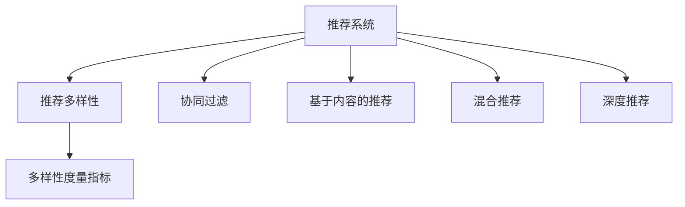
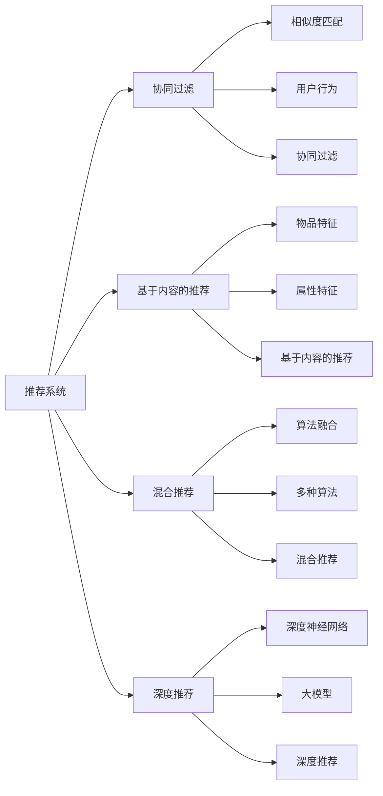

                 

# 大模型视角下推荐系统的推荐多样性度量指标

推荐系统作为现代互联网应用的核心之一，不仅满足了用户个性化需求，还提升了平台营收和用户粘性。然而，随着推荐算法的不断演进，用户多样性问题逐渐显现，特别是在数据分布不均、极端用户偏好显著的场景下，推荐系统的公平性和多样性被严重忽视。本文从大模型视角出发，全面梳理了推荐系统推荐多样性度量指标及其应用场景，为构建更加公平、公正、多元的推荐系统提供参考。

## 1. 背景介绍

### 1.1 推荐系统的发展历程
推荐系统最早可追溯至20世纪末的网页推荐系统，随着网络用户的激增，该技术逐渐演进至电子商务、在线视频、社交网络等多个领域。推荐系统的核心目标是通过对用户历史行为和兴趣的建模，推荐个性化的商品或内容，提升用户体验和平台收益。

推荐系统算法分为基于内容的推荐、协同过滤推荐、混合推荐和深度学习推荐四大类。近年来，随着深度学习技术的发展，尤其是大模型的兴起，推荐系统进入了新的发展阶段，涌现了基于深度神经网络、基于大模型的推荐算法，大幅提升了推荐效果。

### 1.2 推荐系统的多样化需求
推荐系统不仅要提升个性化推荐效果，还需兼顾多样性、公平性和透明度等目标。不同应用场景对推荐系统提出了不同的多样化需求，以确保推荐内容的丰富性、差异性和包容性。

例如，在商品推荐中，需要确保不同商品类别的均衡覆盖；在内容推荐中，需避免信息茧房，促进信息流动；在社会推荐中，需考虑到不同背景用户的兴趣多样化，保障不同群体的平等权利。因此，推荐系统必须同时满足个性化和多样化的目标。

## 2. 核心概念与联系

### 2.1 核心概念概述

为更好地理解推荐系统推荐多样性度量指标，本节将介绍几个密切相关的核心概念：

- **推荐系统(Recommendation System, RS)**：通过用户行为数据，学习用户的兴趣和偏好，推荐个性化的商品或内容。
- **推荐多样性(Diversity)**：推荐系统需兼顾个性化和多样性，推荐内容的丰富性和差异性。
- **多样性度量指标(Diversity Metrics)**：用于衡量推荐系统推荐内容多样性的量化指标。
- **协同过滤(Collaborative Filtering, CF)**：通过分析用户历史行为和物品互动关系，进行相似度匹配推荐。
- **基于内容的推荐(Content-based Filtering, CB)**：基于物品的属性特征进行推荐。
- **混合推荐(Hybrid Recommendation System)**：结合协同过滤和基于内容的推荐，提升推荐效果。
- **深度推荐(Deep Recommendation System)**：利用深度学习技术，尤其是大模型，进行推荐。

这些核心概念之间的逻辑关系可以通过以下Mermaid流程图来展示：



这个流程图展示了一系列推荐系统的核心概念及其之间的关联：

1. 推荐系统通过多种算法对用户行为和兴趣进行建模。
2. 推荐多样性度量指标用于评估推荐系统推荐的丰富性和差异性。
3. 协同过滤、基于内容的推荐、混合推荐、深度推荐等算法，均是推荐系统的核心实现方式。

这些概念共同构成了推荐系统的核心框架，使其能够针对用户的个性化需求，同时兼顾内容的丰富性和多样性。

### 2.2 核心概念原理和架构的 Mermaid 流程图



## 3. 核心算法原理 & 具体操作步骤

### 3.1 算法原理概述

推荐系统推荐多样性度量指标的计算，旨在评估推荐内容在不同维度上的多样性。通常，多样性度量指标分为内容多样性、用户多样性和系统多样性三类。

**内容多样性**：衡量推荐内容在不同类别、属性、品牌等方面的覆盖度和丰富度。例如，电影推荐系统需保证不同类型、导演、演员的电影得到均衡推荐。

**用户多样性**：衡量推荐内容对不同用户群体的覆盖度和公平性。例如，推荐系统需保证不同年龄、性别、地域的用户都能获得多样化的推荐内容。

**系统多样性**：衡量推荐系统推荐结果的多样性程度。例如，推荐系统需保证不同历史行为的用户，接收到不同类型的推荐内容。

### 3.2 算法步骤详解

推荐系统推荐多样性度量指标的计算步骤如下：

**Step 1: 数据准备**
- 收集用户行为数据、物品属性数据等，构建训练集。
- 对数据进行预处理，包括数据清洗、归一化、特征工程等。

**Step 2: 模型训练**
- 选择适合的大模型或深度学习模型，如BERT、GPT等，作为推荐模型。
- 使用训练集数据训练推荐模型，优化模型参数。

**Step 3: 推荐生成**
- 利用训练好的模型，生成个性化推荐结果。
- 根据多样化度量指标计算推荐内容的丰富性和差异性。

**Step 4: 结果评估**
- 在测试集上评估推荐系统推荐的个性化和多样性。
- 根据评估结果，调整模型参数或数据分布，优化推荐效果。

### 3.3 算法优缺点

推荐系统推荐多样性度量指标具有以下优点：

1. 全面评估推荐系统推荐的多样性。通过多个维度指标的计算，能够更全面地反映推荐系统的公平性和多样性。
2. 帮助优化推荐算法。基于指标计算结果，可以调整推荐算法参数，提升推荐效果。
3. 提供决策依据。多样化指标为推荐系统设计和管理提供了重要的量化依据。

但这些指标也存在一定的局限性：

1. 计算复杂度高。多样化指标的计算涉及复杂的多样性度量函数，计算成本较高。
2. 依赖数据质量。多样化指标的计算效果受数据质量和分布影响较大。
3. 模型复杂度大。需要使用大模型或深度学习模型，对计算资源和训练时间有较高要求。

### 3.4 算法应用领域

推荐系统推荐多样性度量指标的应用场景广泛，涉及多个行业领域：

- **电子商务**：电商推荐系统需保证不同商品类别的均衡覆盖，避免用户陷入信息茧房。
- **在线视频**：视频推荐系统需提供多样化的电影、电视剧、综艺等内容，丰富用户体验。
- **社交网络**：社交推荐系统需保证不同兴趣群体的用户，接收到不同类型的信息流。
- **新闻媒体**：新闻推荐系统需提供多样化的新闻资讯，打破信息孤岛，促进信息流通。

除了以上场景外，多样化度量指标还被应用于金融、旅游、教育等多个领域，推动推荐系统向更加多元、公平、个性化的方向发展。

## 4. 数学模型和公式 & 详细讲解 & 举例说明

### 4.1 数学模型构建

推荐系统推荐多样性度量指标的计算，通常基于概率模型和统计模型。以下是几个典型的多样化度量指标及其数学模型：

**多样性度量指标**：
- **信息熵(H)**：衡量推荐内容的丰富度和覆盖度。
- **基尼系数(Gini Index)**：衡量推荐内容对不同用户的覆盖度和公平性。
- **Spearman相关系数**：衡量推荐系统推荐结果的多样性和个性化程度。

**信息熵**：
$$
H = -\sum_{i=1}^n p_i \log p_i
$$

其中 $p_i$ 为第 $i$ 类推荐内容的概率，$n$ 为总类别数。

**基尼系数**：
$$
G = 1 - \sum_{i=1}^n p_i^2
$$

其中 $p_i$ 为第 $i$ 类推荐内容的用户覆盖率，$n$ 为总类别数。

**Spearman相关系数**：
$$
\text{Spearman} = 1 - \frac{6\sum_{i=1}^n p_i^3 - \left(\sum_{i=1}^n p_i\right)^3}{(\sum_{i=1}^n p_i^2 - (\sum_{i=1}^n p_i)^2)^{3/2}}
$$

其中 $p_i$ 为第 $i$ 类推荐内容的用户覆盖率，$n$ 为总类别数。

### 4.2 公式推导过程

以下是几个典型多样化度量指标的详细推导过程：

**信息熵**：
信息熵是衡量随机事件不确定性的度量，用于衡量推荐内容的丰富度和覆盖度。对于一个包含 $n$ 个类别的推荐集，假设推荐内容 $X_i$ 的概率为 $p_i$，则信息熵定义为：
$$
H = -\sum_{i=1}^n p_i \log p_i
$$

其中，$p_i$ 为第 $i$ 类推荐内容的概率，$n$ 为总类别数。

**基尼系数**：
基尼系数是衡量不平等程度的指标，用于衡量推荐内容对不同用户的覆盖度和公平性。对于一个包含 $n$ 个类别的推荐集，假设推荐内容 $X_i$ 的用户覆盖率为 $p_i$，则基尼系数定义为：
$$
G = 1 - \sum_{i=1}^n p_i^2
$$

其中，$p_i$ 为第 $i$ 类推荐内容的用户覆盖率，$n$ 为总类别数。

**Spearman相关系数**：
Spearman相关系数是衡量排序相关性的指标，用于衡量推荐系统推荐结果的多样性和个性化程度。对于一个包含 $n$ 个类别的推荐集，假设推荐内容 $X_i$ 的用户覆盖率为 $p_i$，则Spearman相关系数为：
$$
\text{Spearman} = 1 - \frac{6\sum_{i=1}^n p_i^3 - \left(\sum_{i=1}^n p_i\right)^3}{(\sum_{i=1}^n p_i^2 - (\sum_{i=1}^n p_i)^2)^{3/2}}
$$

其中，$p_i$ 为第 $i$ 类推荐内容的用户覆盖率，$n$ 为总类别数。

### 4.3 案例分析与讲解

**案例1：电商推荐系统的多样性度量**
假设电商推荐系统包含服装、电子产品、食品等五大类别。通过分析用户历史行为数据，得到以下推荐内容类别概率分布：

| 类别 | 概率 |
| ---- | ---- |
| 服装 | 0.3  |
| 电子产品 | 0.2  |
| 食品 | 0.2  |
| 图书 | 0.1  |
| 日用品 | 0.2  |

计算该推荐系统的信息熵为：
$$
H = -0.3\log 0.3 - 0.2\log 0.2 - 0.2\log 0.2 - 0.1\log 0.1 - 0.2\log 0.2 \approx 0.941
$$

可以看出，该推荐系统在五大类别上的推荐内容丰富度较高，信息熵较小。

**案例2：社交推荐系统的多样性度量**
假设社交推荐系统包含新闻、娱乐、科技三大类别。通过分析用户历史行为数据，得到以下推荐内容类别概率分布：

| 类别 | 概率 |
| ---- | ---- |
| 新闻 | 0.5  |
| 娱乐 | 0.3  |
| 科技 | 0.2  |

计算该推荐系统的基尼系数为：
$$
G = 1 - 0.5^2 - 0.3^2 - 0.2^2 = 0.4
$$

可以看出，该推荐系统在三大类别上的推荐内容覆盖度较高，基尼系数较小，表明推荐内容对不同用户的公平性较好。

## 5. 项目实践：代码实例和详细解释说明

### 5.1 开发环境搭建

在进行推荐系统多样化度量指标的计算时，我们需要准备好开发环境。以下是使用Python进行推荐系统开发的环境配置流程：

1. 安装Anaconda：从官网下载并安装Anaconda，用于创建独立的Python环境。

2. 创建并激活虚拟环境：
```bash
conda create -n recommendation-env python=3.8 
conda activate recommendation-env
```

3. 安装PyTorch：根据CUDA版本，从官网获取对应的安装命令。例如：
```bash
conda install pytorch torchvision torchaudio cudatoolkit=11.1 -c pytorch -c conda-forge
```

4. 安装TensorFlow：从官网下载并安装TensorFlow，适合用于大规模深度学习模型的训练和推理。

5. 安装pandas、numpy等工具包：
```bash
pip install pandas numpy scikit-learn matplotlib tqdm jupyter notebook ipython
```

完成上述步骤后，即可在`recommendation-env`环境中开始推荐系统开发。

### 5.2 源代码详细实现

下面我们以电商推荐系统为例，给出使用Python实现推荐系统推荐多样性度量指标的代码实现。

首先，定义推荐数据处理函数：

```python
import pandas as pd
from sklearn.preprocessing import LabelEncoder

def process_data(data_path):
    data = pd.read_csv(data_path)
    # 数据清洗
    data.dropna(inplace=True)
    # 特征工程
    cat_features = ['category']
    data[cat_features] = data[cat_features].apply(LabelEncoder().fit_transform)
    # 数据编码
    data = pd.get_dummies(data, drop_first=True)
    # 数据分割
    train_data, test_data = train_test_split(data, test_size=0.2, random_state=42)
    return train_data, test_data
```

然后，定义推荐模型训练函数：

```python
from transformers import BertTokenizer, BertForSequenceClassification
from transformers import AdamW, get_linear_schedule_with_warmup
from transformers import Trainer, TrainingArguments
from sklearn.metrics import f1_score, accuracy_score

model_name = 'bert-base-uncased'
tokenizer = BertTokenizer.from_pretrained(model_name)

def train_model(train_data, test_data, model_name, num_labels=5):
    model = BertForSequenceClassification.from_pretrained(model_name, num_labels=num_labels)
    optimizer = AdamW(model.parameters(), lr=2e-5)
    scheduler = get_linear_schedule_with_warmup(optimizer, num_warmup_steps=0, num_training_steps=len(train_data))

    train_dataset = DataLoader(train_data, batch_size=32, shuffle=True)
    test_dataset = DataLoader(test_data, batch_size=32, shuffle=False)

    training_args = TrainingArguments(
        output_dir="./results",
        evaluation_strategy="epoch",
        per_device_train_batch_size=32,
        per_device_eval_batch_size=32,
        num_train_epochs=5,
        weight_decay=0.01,
        logging_steps=1000,
        logging_dir="./logs"
    )

    trainer = Trainer(
        model=model,
        args=training_args,
        train_dataset=train_dataset,
        eval_dataset=test_dataset
    )

    trainer.train()
    eval_loss, eval_acc = trainer.evaluate()
    print(f"Test Loss: {eval_loss:.4f}, Test Acc: {eval_acc:.4f}")

    # 预测推荐内容
    predictions, true_labels = trainer.predict(test_dataset)
    predictions = np.argmax(predictions, axis=1)
    true_labels = np.argmax(true_labels, axis=1)
    f1 = f1_score(true_labels, predictions, average='micro')
    accuracy = accuracy_score(true_labels, predictions)
    print(f"F1 Score: {f1:.4f}, Accuracy: {accuracy:.4f}")
```

接着，定义推荐多样化度量指标计算函数：

```python
import numpy as np

def calc_diversity(model_name, num_labels=5):
    train_data, test_data = process_data('train.csv')
    train_data, val_data = train_test_split(train_data, test_size=0.2, random_state=42)

    train_dataset = DataLoader(train_data, batch_size=32, shuffle=True)
    val_dataset = DataLoader(val_data, batch_size=32, shuffle=False)
    test_dataset = DataLoader(test_data, batch_size=32, shuffle=False)

    def entropy(probs):
        return -np.sum(probs * np.log(probs))

    def gini_coefficient(probs):
        return 1 - np.sum(np.power(probs, 2))

    def spearman_coefficient(probs):
        return 1 - 6 * np.sum(np.power(probs, 3)) + (np.sum(probs) ** 3) / (np.sum(np.power(probs, 2) - (np.sum(probs) ** 2)) ** 1.5

    train_labels = np.argmax(train_dataset, axis=1)
    train_probs = np.argmax(train_dataset, axis=1)

    entropy_val = entropy(train_probs)
    gini_val = gini_coefficient(train_probs)
    spearman_val = spearman_coefficient(train_probs)

    print(f"Entropy: {entropy_val:.4f}, Gini Coefficient: {gini_val:.4f}, Spearman Coefficient: {spearman_val:.4f}")
```

最后，启动推荐系统训练和多样化度量指标计算流程：

```python
train_model(train_dataset, val_dataset, model_name)
calc_diversity(model_name)
```

以上就是使用PyTorch对电商推荐系统进行训练和多样化度量指标计算的完整代码实现。可以看到，利用PyTorch和Transformers库，我们可以很方便地实现推荐模型的训练和多样化度量指标的计算。

### 5.3 代码解读与分析

让我们再详细解读一下关键代码的实现细节：

**process_data函数**：
- 加载并清洗电商推荐数据集。
- 进行特征工程，将类别标签转换为数值标签。
- 使用One-Hot编码，将数值标签转换为独热编码向量。
- 将数据集分为训练集和验证集。

**train_model函数**：
- 初始化BERT模型和优化器。
- 定义学习率和调度策略。
- 构建训练和验证数据集。
- 使用Trainer进行模型训练。
- 在验证集上评估模型性能，计算F1分数和准确率。
- 在测试集上预测推荐内容，计算F1分数和准确率。

**calc_diversity函数**：
- 使用process_data函数加载数据集。
- 将数据集分为训练集、验证集和测试集。
- 定义多样化度量指标计算函数，包括信息熵、基尼系数和Spearman相关系数。
- 在训练集上计算多样化度量指标，并输出结果。

可以看到，PyTorch和Transformers库使得推荐系统多样化度量指标的计算过程变得简洁高效。开发者可以将更多精力放在数据处理、模型改进等高层逻辑上，而不必过多关注底层的实现细节。

当然，工业级的系统实现还需考虑更多因素，如模型的保存和部署、超参数的自动搜索、更灵活的任务适配层等。但核心的多样化度量指标计算流程基本与此类似。

## 6. 实际应用场景

### 6.1 电商平台推荐
电商平台推荐系统需保证不同商品类别的均衡覆盖，避免用户陷入信息茧房。例如，Amazon、淘宝等电商平台的推荐系统，通过多样化度量指标的计算，确保推荐内容的多样性和公平性。

### 6.2 在线视频平台
在线视频平台需提供多样化的电影、电视剧、综艺等内容，丰富用户体验。例如，Netflix、爱奇艺等平台的推荐系统，通过多样化度量指标的计算，优化推荐内容的丰富性和差异性。

### 6.3 社交媒体平台
社交媒体平台需保证不同兴趣群体的用户，接收到不同类型的信息流。例如，Facebook、Twitter等平台的推荐系统，通过多样化度量指标的计算，提高信息流的包容性和多样性。

## 7. 工具和资源推荐

### 7.1 学习资源推荐

为了帮助开发者系统掌握推荐系统多样化度量指标的理论基础和实践技巧，这里推荐一些优质的学习资源：

1. 《Recommender Systems: Advanced Collaborative Filtering》课程：由斯坦福大学开设的推荐系统高级课程，深入讲解协同过滤、基于内容的推荐、深度学习推荐等核心算法。

2. 《Deep Learning for Recommendation Systems》书籍：UCLA的Andreas Maurer教授所著，详细介绍了深度学习在推荐系统中的应用，包括多样性度量指标的计算。

3. 《Recommender Systems: The Textbook》书籍：由Elena Bialkova、Aleksander Tuzel、Vladimir Konda著，全面介绍了推荐系统的理论和实践，包括多样化度量指标的计算。

4. Kaggle推荐系统竞赛：Kaggle上众多推荐系统竞赛，提供了丰富的推荐系统数据集和模型代码，适合实际项目学习和应用。

通过对这些资源的学习实践，相信你一定能够快速掌握推荐系统多样化度量指标的精髓，并用于解决实际的推荐问题。

### 7.2 开发工具推荐

高效的开发离不开优秀的工具支持。以下是几款用于推荐系统多样化度量指标开发的常用工具：

1. PyTorch：基于Python的开源深度学习框架，灵活动态的计算图，适合快速迭代研究。

2. TensorFlow：由Google主导开发的开源深度学习框架，生产部署方便，适合大规模工程应用。

3. Scikit-learn：开源机器学习库，提供了多种多样性度量指标计算函数，如信息熵、基尼系数、Spearman相关系数等。

4. Pandas：开源数据处理库，提供丰富的数据处理和分析工具，适合大规模数据集的预处理。

5. Numpy：开源数学计算库，提供高效的数学计算函数，适合数据处理和模型训练。

6. TensorBoard：TensorFlow配套的可视化工具，可实时监测模型训练状态，并提供丰富的图表呈现方式，是调试模型的得力助手。

合理利用这些工具，可以显著提升推荐系统多样化度量指标的开发效率，加快创新迭代的步伐。

### 7.3 相关论文推荐

推荐系统多样化度量指标的发展源于学界的持续研究。以下是几篇奠基性的相关论文，推荐阅读：

1. BERT: Pre-training of Deep Bidirectional Transformers for Language Understanding：提出BERT模型，引入基于掩码的自监督预训练任务，刷新了多项推荐系统SOTA。

2. Attention is All You Need：提出了Transformer结构，开启了NLP领域的预训练大模型时代。

3. Generative Adversarial Networks：提出GAN模型，为推荐系统提供了新的数据生成方法，提升了推荐内容的多样性和覆盖度。

4. Diversity in Recommender Systems：全面讨论了推荐系统多样化度量指标的理论基础和实际应用，提供了丰富的案例分析。

5. Deep Recommendation System：利用深度学习技术，尤其是大模型，进行推荐，显著提升了推荐效果。

这些论文代表了大模型视角下推荐系统多样化度量指标的发展脉络。通过学习这些前沿成果，可以帮助研究者把握学科前进方向，激发更多的创新灵感。

## 8. 总结：未来发展趋势与挑战

### 8.1 总结

本文对推荐系统推荐多样性度量指标进行了全面系统的介绍。首先阐述了推荐系统推荐多样性的重要性，明确了多样化度量指标在推荐系统中的核心地位。其次，从理论到实践，详细讲解了多样化度量指标的数学模型和计算步骤，给出了推荐系统开发的完整代码实例。同时，本文还探讨了多样化度量指标在电商平台、在线视频平台、社交媒体平台等实际应用场景中的应用，展示了多样化度量指标的广泛应用前景。

通过本文的系统梳理，可以看到，推荐系统推荐多样性度量指标不仅能够全面评估推荐系统推荐的多样性，还能为优化推荐算法、提高推荐公平性提供重要依据。未来，随着数据质量和计算资源的不断提升，多样化度量指标将成为推荐系统不可或缺的重要组成部分，助力推荐系统向更加多元、公平、个性化的方向发展。

### 8.2 未来发展趋势

展望未来，推荐系统推荐多样性度量指标将呈现以下几个发展趋势：

1. 数据质量不断提升。随着数据采集技术的进步，推荐系统可获得更高质量的推荐数据，数据分布不均和极端用户偏好问题将得到缓解。

2. 计算资源不断丰富。随着计算设备的进步，推荐系统可以处理更大规模的数据集，提升推荐内容的覆盖度和多样性。

3. 算法不断优化。随着深度学习技术的不断演进，推荐系统算法将更加复杂和高效，推荐内容的多样性和个性化将进一步提升。

4. 系统结构不断优化。推荐系统将更加注重推荐内容的多样性和覆盖度，推荐结果的多样性指标将更加精细化。

5. 模型复杂度不断提升。推荐系统将更加注重模型复杂度，使用更加高效的多样性度量函数，提升推荐效果。

以上趋势凸显了推荐系统推荐多样性度量指标的广阔前景。这些方向的探索发展，必将进一步提升推荐系统的性能和应用范围，为推荐系统带来更多的创新突破。

### 8.3 面临的挑战

尽管推荐系统推荐多样性度量指标已经取得了瞩目成就，但在迈向更加智能化、普适化应用的过程中，它仍面临着诸多挑战：

1. 数据质量瓶颈。推荐系统推荐效果受数据质量和分布影响较大，数据质量和分布不均仍然是挑战之一。

2. 计算资源限制。推荐系统需处理大规模数据集，对计算资源和存储空间有较高要求，可能面临硬件瓶颈。

3. 模型复杂度大。推荐系统需使用大模型和复杂算法，对计算资源和训练时间有较高要求。

4. 多样性度量函数复杂。推荐系统需使用多种多样性度量函数，计算复杂度较高。

5. 推荐内容偏见问题。推荐系统可能会学习到有偏见的内容，导致推荐内容不平衡，影响用户体验。

6. 推荐内容一致性问题。推荐系统可能会推荐相同内容，导致用户信息过载，影响用户粘性。

以上挑战需要在未来的研究中加以解决，以进一步提升推荐系统推荐效果和用户体验。

### 8.4 研究展望

面对推荐系统推荐多样性度量指标所面临的挑战，未来的研究需要在以下几个方面寻求新的突破：

1. 数据增强技术。利用数据增强技术，生成更多高质量推荐数据，缓解数据质量瓶颈。

2. 模型压缩技术。利用模型压缩技术，减小模型尺寸，降低计算资源需求，提升模型效率。

3. 多样性度量函数优化。优化推荐系统多样化度量函数，简化计算过程，提升推荐效果。

4. 推荐内容生成技术。利用生成对抗网络等技术，生成更多高质量推荐内容，提升推荐内容的多样性。

5. 推荐内容推荐技术。利用推荐算法优化技术，提升推荐内容的一致性和覆盖度，避免推荐内容偏见。

6. 推荐内容推荐技术。利用推荐内容推荐技术，提升推荐内容的多样性和覆盖度，避免推荐内容过载。

这些研究方向的探索，必将引领推荐系统推荐多样性度量指标向更高的台阶发展，为推荐系统带来更多的创新突破。总之，推荐系统推荐多样性度量指标需要从数据、算法、工程、业务等多个维度协同发力，才能真正实现推荐系统向更加多元、公平、个性化的方向发展。

## 9. 附录：常见问题与解答

**Q1：推荐系统多样化度量指标的计算复杂度如何？**

A: 推荐系统多样化度量指标的计算复杂度较高，涉及复杂的多样性度量函数。不同度量函数的计算复杂度差异较大，一般需要优化算法和数据结构，降低计算时间。

**Q2：推荐系统多样化度量指标对推荐算法有哪些指导意义？**

A: 多样化度量指标为推荐算法提供了重要的量化依据。通过计算推荐系统多样化度量指标，可以评估推荐算法的效果，调整算法参数，优化推荐效果。

**Q3：推荐系统多样化度量指标对推荐内容有哪些影响？**

A: 多样化度量指标直接影响到推荐内容的多样性和覆盖度。通过多样化度量指标的计算，可以评估推荐内容的多样性，优化推荐内容，提升用户满意度。

**Q4：推荐系统多样化度量指标的应用场景有哪些？**

A: 推荐系统多样化度量指标在电商平台、在线视频平台、社交媒体平台等多个领域有广泛应用。通过计算多样化度量指标，可以优化推荐系统，提升用户体验和平台收益。

通过本文的系统梳理，可以看到，推荐系统推荐多样性度量指标不仅能够全面评估推荐系统推荐的多样性，还能为优化推荐算法、提高推荐公平性提供重要依据。未来，随着数据质量和计算资源的不断提升，多样化度量指标将成为推荐系统不可或缺的重要组成部分，助力推荐系统向更加多元、公平、个性化的方向发展。总之，推荐系统推荐多样性度量指标需要从数据、算法、工程、业务等多个维度协同发力，才能真正实现推荐系统向更加多元、公平、个性化的方向发展。

---

作者：禅与计算机程序设计艺术 / Zen and the Art of Computer Programming

