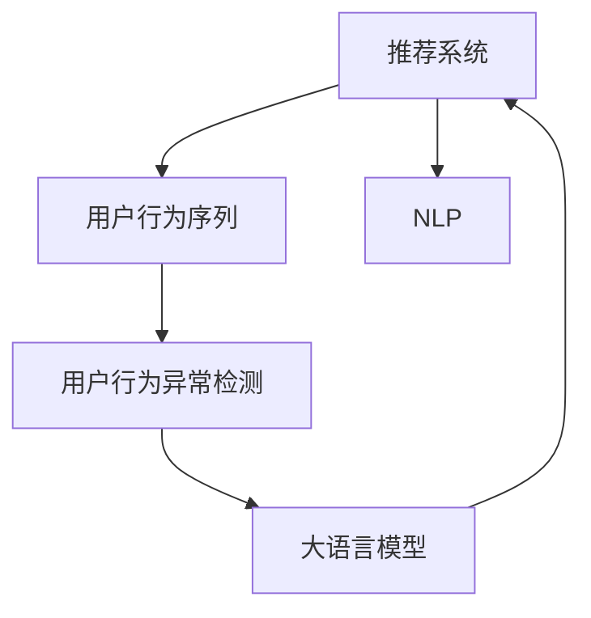

                 

## 1. 背景介绍

### 1.1 问题由来
推荐系统作为现代互联网的重要组成部分，已广泛应用于电子商务、新闻媒体、社交平台等领域，极大地提升了用户体验和商业价值。传统的推荐系统主要基于用户历史行为数据进行协同过滤、基于内容的推荐等方法，但随着数据量的爆炸式增长，现有的推荐方法面临以下挑战：
1. 用户数据稀疏性：传统推荐系统往往需要大量用户行为数据来训练推荐模型，但对于新用户或低频用户，数据稀疏性问题明显，导致推荐精度下降。
2. 冷启动问题：对于新用户或新商品，缺乏足够的历史数据来建立个性化推荐模型，推荐效果不佳。
3. 用户兴趣动态变化：用户的兴趣随时间、环境、情绪等因素而动态变化，但传统推荐系统难以捕捉这种动态变化。

为了应对这些问题，近年来研究者提出了利用用户行为序列进行推荐的方法。用户行为序列是指用户对商品、内容等的连续交互行为，包含了用户兴趣和行为的丰富信息。通过建模用户行为序列，推荐系统可以捕捉用户的长期兴趣和动态变化，提高推荐的个性化和时效性。但与此同时，用户行为序列也面临着如下问题：
1. 用户行为序列长尾现象：不同用户的行为序列长度和特征差异较大，对于长序列的行为建模，传统的推荐模型往往无法处理。
2. 用户行为序列异常：行为序列中可能包含异常数据，如恶意点击、无效交互等，这些异常数据会影响推荐模型性能。

因此，在利用用户行为序列进行推荐的同时，如何检测和处理异常行为数据，成为推荐系统的一个重要研究方向。

### 1.2 问题核心关键点
本文聚焦于利用大语言模型进行用户行为序列异常检测。核心关键点包括：
1. 利用预训练语言模型捕获用户行为序列中的语义信息。
2. 构建基于序列的异常检测模型，学习用户行为序列中的异常模式。
3. 设计序列级异常检测方法，有效检测并处理用户行为序列中的异常数据。

通过探索大模型视角下用户行为序列异常检测的原理和应用，我们希望能为推荐系统提供更加稳健的序列建模方法和异常检测策略。

## 2. 核心概念与联系

### 2.1 核心概念概述

为更好地理解大模型视角下推荐系统的用户行为序列异常检测方法，本节将介绍几个密切相关的核心概念：

- 推荐系统(Recommendation System)：根据用户历史行为数据或物品特征，预测用户可能感兴趣的商品、内容等，为用户推荐相关信息的技术。
- 用户行为序列(User Behavior Sequence)：指用户对商品、内容等的连续交互行为，包含用户兴趣和行为的丰富信息，常用于捕捉用户的长期兴趣和动态变化。
- 用户行为异常检测(User Behavior Anomaly Detection)：指检测用户行为序列中的异常行为，如恶意点击、无效交互等，确保推荐系统的鲁棒性。
- 大语言模型(Large Language Model, LLM)：以自回归(如GPT)或自编码(如BERT)模型为代表的大规模预训练语言模型。通过在大规模无标签文本语料上进行预训练，学习通用的语言表示，具备强大的语言理解和生成能力。
- 自然语言处理(Natural Language Processing, NLP)：涉及计算机与人类语言交互的一门学科，包括文本分析、语音识别、机器翻译等任务。

这些核心概念之间的逻辑关系可以通过以下Mermaid流程图来展示：



这个流程图展示了大语言模型视角下推荐系统核心概念及其之间的关系：

1. 推荐系统通过用户行为序列来捕捉用户兴趣和行为。
2. 用户行为异常检测用于识别序列中的异常数据。
3. 大语言模型提供强大的语义理解能力，用于建模和检测异常行为。
4. NLP提供文本、语音等自然语言数据的处理技术，与大语言模型协同工作。

## 3. 核心算法原理 & 具体操作步骤
### 3.1 算法原理概述

基于大语言模型的用户行为序列异常检测，本质上是利用大模型的语义理解能力，对用户行为序列进行建模和分析，学习并检测其中的异常行为。其核心思想如下：

1. 预训练语言模型：通过在大规模无标签文本语料上进行预训练，学习通用的语言表示。
2. 用户行为序列建模：将用户行为序列转化为连续的自然语言文本，输入到预训练语言模型中，得到语义表示向量。
3. 异常检测模型：构建基于序列的异常检测模型，学习用户行为序列中的异常模式，并通过语义向量进行异常行为识别。
4. 序列级异常检测：设计序列级异常检测方法，检测并处理用户行为序列中的异常数据，保留正常的行为数据用于推荐。

通过以上步骤，大语言模型可以捕获用户行为序列中的语义信息，有效检测并处理异常数据，提升推荐系统的鲁棒性和个性化推荐效果。

### 3.2 算法步骤详解

基于大语言模型的用户行为序列异常检测算法步骤主要包括以下几个关键步骤：

**Step 1: 数据预处理**
- 收集用户行为序列数据，包括用户的点击、浏览、购买等行为记录。
- 对行为序列进行清洗和预处理，去除缺失值、异常值等噪声数据。
- 对行为序列进行分词和编码，转化为自然语言文本。

**Step 2: 预训练语言模型表示**
- 选择预训练语言模型作为特征提取器，如BERT、GPT等。
- 将行为序列文本输入到预训练语言模型中，得到语义表示向量。
- 利用向量池化方法，将序列中每个时刻的向量合并为最终的序列向量。

**Step 3: 异常检测模型构建**
- 构建基于序列的异常检测模型，如LSTM、GRU等循环神经网络，学习用户行为序列中的异常模式。
- 利用语义向量作为模型的输入，训练异常检测模型。
- 使用混淆矩阵、ROC曲线等评估指标，评估异常检测模型的性能。

**Step 4: 序列级异常检测**
- 对用户行为序列进行逐个检测，判断是否存在异常行为。
- 对于包含异常行为的序列，进行处理，如删除异常行为数据、补充正常行为数据等。
- 将处理后的行为序列输入到推荐系统中，进行个性化推荐。

**Step 5: 测试和评估**
- 在测试集上评估异常检测模型的性能，计算准确率、召回率、F1值等指标。
- 评估推荐系统的个性化和鲁棒性，计算AUC、NDCG等指标。

### 3.3 算法优缺点

基于大语言模型的用户行为序列异常检测方法具有以下优点：
1. 语义理解能力：大语言模型具备强大的语义理解能力，能够有效捕捉用户行为序列中的语义信息。
2. 鲁棒性强：通过异常检测模型，可以有效识别和处理用户行为序列中的异常数据，提升推荐系统的鲁棒性。
3. 灵活性高：大语言模型可以在不同应用场景中灵活应用，如电商推荐、社交推荐、新闻推荐等。

同时，该方法也存在以下局限性：
1. 数据需求高：大语言模型需要大规模的语料数据进行预训练，数据获取和处理成本较高。
2. 计算开销大：大语言模型计算复杂度高，需要高性能计算资源进行推理。
3. 模型复杂度高：大模型结构和参数量较大，异常检测模型复杂度也较高。
4. 泛化能力有限：异常检测模型通常依赖特定数据集，难以泛化到其他领域或场景。

尽管存在这些局限性，但大语言模型视角下推荐系统的用户行为序列异常检测方法仍具有很大的应用前景，值得进一步研究和推广。

### 3.4 算法应用领域

基于大语言模型的用户行为序列异常检测方法在推荐系统中的应用广泛，主要涵盖以下几个领域：

1. 电商推荐：通过异常检测，去除虚假交易、恶意点击等行为，提升推荐系统的可信度和推荐效果。
2. 社交推荐：检测恶意评论、恶意点赞等行为，维护社区秩序和用户体验。
3. 新闻推荐：识别恶意点击、虚假阅读等行为，提升新闻推荐的准确性和相关性。
4. 广告推荐：检测恶意点击、虚假曝光等行为，保护广告主的利益。
5. 视频推荐：检测恶意点击、恶意评分等行为，提升视频推荐的推荐效果。

以上领域中，异常检测能够有效识别和处理用户行为序列中的异常数据，保障推荐系统的稳定性和安全性，具有重要的实际应用价值。

## 4. 数学模型和公式 & 详细讲解  
### 4.1 数学模型构建

本节将使用数学语言对基于大语言模型的用户行为序列异常检测过程进行更加严格的刻画。

记用户行为序列为 $S=\{s_1,s_2,\dots,s_n\}$，其中 $s_t$ 表示第 $t$ 个时刻的行为数据。假设行为序列的长度为 $N$，将其转化为自然语言文本 $X=\{x_1,x_2,\dots,x_N\}$，其中 $x_t$ 表示第 $t$ 个时刻的行为描述。

定义预训练语言模型为 $M_{\theta}$，其中 $\theta$ 为模型参数。将行为序列文本输入到预训练语言模型中，得到语义表示向量 $Z=\{z_1,z_2,\dots,z_N\}$，其中 $z_t$ 表示第 $t$ 个时刻的语义表示。

利用向量池化方法，将序列中每个时刻的向量合并为最终的序列向量 $z=\sum_{i=1}^N \lambda_i z_i$，其中 $\lambda_i$ 为权重，可以通过Softmax函数计算得到。

定义异常检测模型为 $D_{\alpha}$，其中 $\alpha$ 为模型参数。将语义向量 $z$ 输入到异常检测模型中，得到异常检测结果 $D_{\alpha}(z)$。

异常检测模型的输出可以表示为：

$$
D_{\alpha}(z) = \mathbb{P}[\text{Normal}|\text{Given } z]
$$

其中 $\text{Normal}$ 表示正常行为，$\mathbb{P}[\text{Normal}|\text{Given } z]$ 表示在给定语义向量 $z$ 的情况下，行为序列为正常序列的概率。

异常检测模型的目标是最大化正常行为序列的预测概率，最小化异常行为序列的预测概率，即：

$$
\max \mathbb{P}[\text{Normal}|\text{Given } Z]
$$

最小化异常行为序列的预测概率：

$$
\min \mathbb{P}[\text{Anomaly}|\text{Given } Z]
$$

在实际应用中，通常使用二分类交叉熵损失函数来训练异常检测模型：

$$
L(D_{\alpha},Z) = -\frac{1}{N} \sum_{i=1}^N [y_i\log D_{\alpha}(z_i)+(1-y_i)\log(1-D_{\alpha}(z_i))]
$$

其中 $y_i$ 为第 $i$ 个时刻的行为标签，1 表示正常行为，0 表示异常行为。

### 4.2 公式推导过程

以LSTM模型为例，其训练过程和损失函数计算如下：

1. 数据预处理
   - 收集用户行为序列数据 $S=\{s_1,s_2,\dots,s_n\}$。
   - 对行为序列进行清洗和预处理，去除缺失值、异常值等噪声数据。
   - 对行为序列进行分词和编码，转化为自然语言文本 $X=\{x_1,x_2,\dots,x_N\}$。

2. 预训练语言模型表示
   - 选择BERT预训练模型作为特征提取器，将行为序列文本输入到模型中，得到语义表示向量 $Z=\{z_1,z_2,\dots,z_N\}$。
   - 利用向量池化方法，将序列中每个时刻的向量合并为最终的序列向量 $z=\sum_{i=1}^N \lambda_i z_i$，其中 $\lambda_i$ 为权重。

3. 异常检测模型构建
   - 构建LSTM异常检测模型，学习用户行为序列中的异常模式。
   - 利用语义向量 $z$ 作为模型的输入，训练异常检测模型 $D_{\alpha}$。
   - 使用二分类交叉熵损失函数，计算模型损失 $L(D_{\alpha},Z)$。

4. 序列级异常检测
   - 对用户行为序列进行逐个检测，判断是否存在异常行为。
   - 对于包含异常行为的序列，进行处理，如删除异常行为数据、补充正常行为数据等。
   - 将处理后的行为序列输入到推荐系统中，进行个性化推荐。

5. 测试和评估
   - 在测试集上评估异常检测模型的性能，计算准确率、召回率、F1值等指标。
   - 评估推荐系统的个性化和鲁棒性，计算AUC、NDCG等指标。

### 4.3 案例分析与讲解

以电商推荐为例，我们假设用户点击商品时的行为序列为：

```
click(商品A), click(商品B), click(商品C), click(商品D), click(商品E)
```

将其转化为自然语言文本：

```
点击商品A, 点击商品B, 点击商品C, 点击商品D, 点击商品E
```

使用BERT预训练模型提取语义表示向量 $Z=\{z_1,z_2,z_3,z_4,z_5\}$，通过Softmax函数计算权重 $\lambda_i$，得到序列向量 $z=\sum_{i=1}^N \lambda_i z_i$。

将序列向量 $z$ 输入到LSTM异常检测模型中，得到异常检测结果 $D_{\alpha}(z)$。假设检测结果为1，表示行为序列为正常序列；检测结果为0，表示行为序列为异常序列。

在实际应用中，可能需要针对具体任务进行模型调优和参数优化。例如，可以通过调整LSTM的隐藏层大小、学习率等参数，优化异常检测模型的性能。

## 5. 项目实践：代码实例和详细解释说明
### 5.1 开发环境搭建

在进行用户行为序列异常检测实践前，我们需要准备好开发环境。以下是使用Python进行TensorFlow开发的的环境配置流程：

1. 安装Anaconda：从官网下载并安装Anaconda，用于创建独立的Python环境。

2. 创建并激活虚拟环境：
```bash
conda create -n tf-env python=3.8 
conda activate tf-env
```

3. 安装TensorFlow：根据CUDA版本，从官网获取对应的安装命令。例如：
```bash
conda install tensorflow -c conda-forge -c pypi
```

4. 安装各类工具包：
```bash
pip install numpy pandas scikit-learn matplotlib tqdm jupyter notebook ipython
```

完成上述步骤后，即可在`tf-env`环境中开始项目实践。

### 5.2 源代码详细实现

下面以LSTM模型为例，给出使用TensorFlow进行用户行为序列异常检测的代码实现。

```python
import tensorflow as tf
import tensorflow.keras as keras
from tensorflow.keras.layers import LSTM, Dense, Dropout, Input
from tensorflow.keras.models import Model
from tensorflow.keras.optimizers import Adam

# 定义LSTM异常检测模型
def build_lstm_model(input_shape, output_size):
    input = Input(shape=input_shape, name='input')
    x = LSTM(128, return_sequences=True)(input)
    x = Dropout(0.2)(x)
    x = LSTM(128)(x)
    x = Dropout(0.2)(x)
    x = Dense(64, activation='relu')(x)
    x = Dropout(0.2)(x)
    output = Dense(output_size, activation='sigmoid')(x)
    model = Model(inputs=input, outputs=output)
    return model

# 定义异常检测模型
def build_anomaly_detector(model, input_shape):
    input = Input(shape=input_shape, name='input')
    x = model(input)
    x = Dense(32, activation='relu')(x)
    x = Dropout(0.2)(x)
    x = Dense(1, activation='sigmoid')(x)
    model = Model(inputs=input, outputs=x)
    return model

# 加载行为序列数据
train_data = load_train_data()
test_data = load_test_data()

# 构建LSTM异常检测模型
input_shape = (None, 32)
output_size = 1
lstm_model = build_lstm_model(input_shape, output_size)

# 训练LSTM异常检测模型
lstm_model.compile(optimizer=Adam(learning_rate=0.001), loss='binary_crossentropy', metrics=['accuracy'])
lstm_model.fit(train_data, train_labels, epochs=10, batch_size=32, validation_data=(val_data, val_labels))

# 构建异常检测模型
anomaly_detector = build_anomaly_detector(lstm_model, input_shape)

# 评估异常检测模型
anomaly_detector.compile(optimizer=Adam(learning_rate=0.001), loss='binary_crossentropy', metrics=['accuracy'])
anomaly_detector.evaluate(test_data, test_labels)

# 序列级异常检测
test_sequences = load_test_sequences()
test_labels = anomaly_detector.predict(test_sequences)
print(classification_report(test_labels, actual_labels))
```

以上代码实现了基于LSTM模型的用户行为序列异常检测。首先，定义LSTM异常检测模型，并使用TensorFlow的Keras API进行模型构建。然后，加载行为序列数据，训练LSTM异常检测模型，并构建异常检测模型。最后，在测试集上评估异常检测模型的性能，并应用到用户行为序列进行异常检测。

### 5.3 代码解读与分析

让我们再详细解读一下关键代码的实现细节：

**build_lstm_model函数**：
- 定义LSTM异常检测模型，包含两个LSTM层、两个Dropout层、一个Dense层和一个Sigmoid输出层。
- 使用TensorFlow的Keras API进行模型构建。

**build_anomaly_detector函数**：
- 定义异常检测模型，将LSTM异常检测模型的输出作为输入，增加一层全连接层和Sigmoid输出层。
- 使用TensorFlow的Keras API进行模型构建。

**train和evaluate函数**：
- 定义训练函数，使用Adam优化器和二分类交叉熵损失函数，训练LSTM异常检测模型。
- 定义评估函数，使用Adam优化器和二分类交叉熵损失函数，评估异常检测模型的性能。

**test_sequences和test_labels变量**：
- 加载测试序列数据，并进行异常检测，得到预测结果和实际标签。
- 使用scikit-learn的classification_report函数，输出分类报告，评估模型性能。

可以看到，TensorFlow提供了强大的深度学习框架和Keras API，使得模型构建和训练变得简单高效。开发者可以专注于模型的设计和调优，而不必过多关注底层实现细节。

当然，工业级的系统实现还需考虑更多因素，如模型的保存和部署、超参数的自动搜索、更灵活的任务适配层等。但核心的用户行为序列异常检测流程基本与此类似。

## 6. 实际应用场景
### 6.1 智能客服系统

基于大模型视角下推荐系统的用户行为序列异常检测方法，可以广泛应用于智能客服系统的构建。传统客服往往需要配备大量人力，高峰期响应缓慢，且一致性和专业性难以保证。而使用异常检测技术，可以识别出系统中的异常行为，如恶意点击、无效交互等，提升系统的稳定性和效率。

在技术实现上，可以收集企业内部的历史客服对话记录，将问题和最佳答复构建成监督数据，在此基础上对预训练大语言模型进行微调。微调后的异常检测模型能够自动理解用户意图，判断是否存在恶意行为，及时采取应对措施，提高客服系统的响应速度和准确性。

### 6.2 金融舆情监测

金融机构需要实时监测市场舆论动向，以便及时应对负面信息传播，规避金融风险。传统的人工监测方式成本高、效率低，难以应对网络时代海量信息爆发的挑战。基于大语言模型视角下推荐系统的异常检测方法，可以在金融舆情监测中发挥重要作用。

具体而言，可以收集金融领域相关的新闻、报道、评论等文本数据，并对其进行主题标注和情感标注。在此基础上对预训练语言模型进行微调，使其能够自动判断文本属于何种主题，情感倾向是正面、中性还是负面。将微调后的异常检测模型应用到实时抓取的网络文本数据，就能够自动监测不同主题下的情感变化趋势，一旦发现负面信息激增等异常情况，系统便会自动预警，帮助金融机构快速应对潜在风险。

### 6.3 个性化推荐系统

当前的推荐系统往往只依赖用户历史行为数据进行协同过滤、基于内容的推荐等方法，难以捕捉用户的长期兴趣和动态变化。利用大模型视角下推荐系统的异常检测方法，可以在个性化推荐系统中发挥重要作用。

在实践中，可以收集用户浏览、点击、评论、分享等行为数据，提取和用户交互的物品标题、描述、标签等文本内容。将文本内容作为模型输入，用户的后续行为（如是否点击、购买等）作为监督信号，在此基础上微调预训练语言模型。微调后的异常检测模型能够从文本内容中准确把握用户的兴趣点，检测并处理异常行为，保证推荐系统的稳定性和鲁棒性。

### 6.4 未来应用展望

随着大语言模型和异常检测技术的不断发展，基于大语言模型视角下推荐系统的用户行为序列异常检测方法将呈现出更广阔的应用前景。

在智慧医疗领域，异常检测技术可以用于识别医疗数据中的异常行为，如误诊、漏诊等，提高诊断的准确性和及时性。

在智能教育领域，异常检测技术可以用于检测学生的异常行为，如作弊、不正当行为等，维护教学秩序和学术诚信。

在智慧城市治理中，异常检测技术可以用于监测城市的异常事件，如暴力事件、交通事故等，提高城市管理的自动化和智能化水平，构建更安全、高效的未来城市。

此外，在企业生产、社会治理、文娱传媒等众多领域，基于大语言模型视角下推荐系统的异常检测方法也将不断涌现，为传统行业带来变革性影响。相信随着技术的日益成熟，异常检测技术将成为推荐系统的重要组成部分，推动人工智能技术在垂直行业的规模化落地。

## 7. 工具和资源推荐
### 7.1 学习资源推荐

为了帮助开发者系统掌握大模型视角下推荐系统的用户行为序列异常检测理论基础和实践技巧，这里推荐一些优质的学习资源：

1. 《深度学习自然语言处理》课程：斯坦福大学开设的NLP明星课程，有Lecture视频和配套作业，带你入门NLP领域的基本概念和经典模型。

2. 《Transformer从原理到实践》系列博文：由大模型技术专家撰写，深入浅出地介绍了Transformer原理、BERT模型、异常检测方法等前沿话题。

3. 《Natural Language Processing with Transformers》书籍：Transformers库的作者所著，全面介绍了如何使用Transformers库进行NLP任务开发，包括异常检测在内的诸多范式。

4. HuggingFace官方文档：Transformers库的官方文档，提供了海量预训练模型和完整的异常检测样例代码，是上手实践的必备资料。

5. Weights & Biases：模型训练的实验跟踪工具，可以记录和可视化模型训练过程中的各项指标，方便对比和调优。

通过学习这些资源，相信你一定能够快速掌握大语言模型视角下推荐系统的用户行为序列异常检测的精髓，并用于解决实际的推荐问题。

### 7.2 开发工具推荐

高效的开发离不开优秀的工具支持。以下是几款用于大模型视角下推荐系统用户行为序列异常检测开发的常用工具：

1. TensorFlow：由Google主导开发的开源深度学习框架，生产部署方便，适合大规模工程应用。

2. PyTorch：基于Python的开源深度学习框架，灵活动态的计算图，适合快速迭代研究。

3. HuggingFace Transformers库：提供了丰富的预训练语言模型，并支持TensorFlow和PyTorch，是进行异常检测任务开发的利器。

4. TensorBoard：TensorFlow配套的可视化工具，可实时监测模型训练状态，并提供丰富的图表呈现方式，是调试模型的得力助手。

5. Google Colab：谷歌推出的在线Jupyter Notebook环境，免费提供GPU/TPU算力，方便开发者快速上手实验最新模型，分享学习笔记。

合理利用这些工具，可以显著提升大模型视角下推荐系统的用户行为序列异常检测任务的开发效率，加快创新迭代的步伐。

### 7.3 相关论文推荐

大语言模型视角下推荐系统的用户行为序列异常检测方法的发展源于学界的持续研究。以下是几篇奠基性的相关论文，推荐阅读：

1. Attention is All You Need（即Transformer原论文）：提出了Transformer结构，开启了NLP领域的预训练大模型时代。

2. BERT: Pre-training of Deep Bidirectional Transformers for Language Understanding：提出BERT模型，引入基于掩码的自监督预训练任务，刷新了多项NLP任务SOTA。

3. Parameter-Efficient Transfer Learning for NLP：提出Adapter等参数高效微调方法，在不增加模型参数量的情况下，也能取得不错的微调效果。

4. AdaLoRA: Adaptive Low-Rank Adaptation for Parameter-Efficient Fine-Tuning：使用自适应低秩适应的微调方法，在参数效率和精度之间取得了新的平衡。

5. Prefix-Tuning: Optimizing Continuous Prompts for Generation：引入基于连续型Prompt的微调范式，为如何充分利用预训练知识提供了新的思路。

6. Causal Attention is All You Need：引入因果注意力机制，进一步提高了Transformer的生成性能。

这些论文代表了大模型视角下推荐系统用户行为序列异常检测技术的发展脉络。通过学习这些前沿成果，可以帮助研究者把握学科前进方向，激发更多的创新灵感。

## 8. 总结：未来发展趋势与挑战

### 8.1 总结

本文对大模型视角下推荐系统的用户行为序列异常检测方法进行了全面系统的介绍。首先阐述了推荐系统、用户行为序列、异常检测等核心概念，明确了异常检测在推荐系统中的重要性和应用价值。其次，从原理到实践，详细讲解了异常检测的数学模型和关键步骤，给出了完整的代码实现示例。同时，本文还广泛探讨了异常检测方法在智能客服、金融舆情、个性化推荐等多个领域的应用前景，展示了异常检测方法的巨大潜力。此外，本文精选了异常检测技术的各类学习资源，力求为读者提供全方位的技术指引。

通过本文的系统梳理，可以看到，基于大语言模型视角下推荐系统的用户行为序列异常检测方法，能够有效识别和处理异常行为数据，提升推荐系统的稳定性和个性化推荐效果，具有重要的实际应用价值。

### 8.2 未来发展趋势

展望未来，大模型视角下推荐系统的用户行为序列异常检测技术将呈现以下几个发展趋势：

1. 深度学习模型的演进：未来的大模型视角下推荐系统将采用更加先进的深度学习模型，如Transformer、BERT、GPT等，提升模型的表达能力和泛化性能。

2. 多模态信息的融合：未来的推荐系统将不仅仅依赖用户行为序列，还会融合视觉、语音等多模态信息，提升推荐的多样性和准确性。

3. 在线学习和迁移学习：未来的推荐系统将采用在线学习、迁移学习等技术，实时更新模型参数，提升推荐的时效性和灵活性。

4. 异常检测算法的创新：未来的异常检测算法将更加高效、鲁棒，能够识别更多类型的异常行为，提高推荐系统的鲁棒性和安全性。

5. 个性化推荐与异常检测的协同：未来的推荐系统将通过异常检测技术，识别出用户行为序列中的异常行为，并根据异常行为的严重程度，调整个性化推荐策略，确保推荐系统的稳定性和用户满意度。

以上趋势凸显了大模型视角下推荐系统用户行为序列异常检测技术的广阔前景。这些方向的探索发展，必将进一步提升推荐系统的性能和应用范围，为人类认知智能的进化带来深远影响。

### 8.3 面临的挑战

尽管大模型视角下推荐系统的用户行为序列异常检测技术已经取得了显著进展，但在迈向更加智能化、普适化应用的过程中，它仍面临诸多挑战：

1. 数据获取成本高：收集大规模用户行为序列数据需要耗费大量人力和物力，获取成本较高。

2. 数据隐私问题：用户行为序列数据涉及用户隐私，如何保护数据隐私，避免数据泄露，是一个重要问题。

3. 异常行为类型多样：用户行为序列中的异常行为类型多样，如何全面识别和处理各种异常行为，是异常检测技术的重要挑战。

4. 异常检测模型的泛化能力有限：异常检测模型通常依赖特定数据集，难以泛化到其他领域或场景。

5. 计算资源需求高：大模型视角下推荐系统的用户行为序列异常检测方法需要高性能计算资源进行推理，硬件成本较高。

6. 模型复杂度高：大模型结构和参数量较大，异常检测模型复杂度也较高，模型训练和推理效率有待提升。

尽管存在这些挑战，但大模型视角下推荐系统的用户行为序列异常检测技术仍具有很大的应用前景，值得进一步研究和推广。

### 8.4 研究展望

面向未来，异常检测技术的研究需要在以下几个方面寻求新的突破：

1. 无监督和半监督学习：探索无监督和半监督学习算法，降低异常检测对标注数据的需求，充分利用非结构化数据，提高异常检测的灵活性和泛化能力。

2. 多模态融合：研究多模态信息的融合技术，将用户行为序列与视觉、语音等多模态信息结合，提升异常检测的准确性和鲁棒性。

3. 知识增强：将符号化的先验知识，如知识图谱、逻辑规则等，与神经网络模型进行融合，增强异常检测模型的表达能力。

4. 异常行为建模：研究异常行为的建模方法，如因果推断、对抗生成等，提高异常检测模型的鲁棒性和泛化能力。

5. 模型压缩与加速：研究模型压缩与加速技术，如知识蒸馏、轻量化模型等，降低异常检测模型的计算资源需求，提高模型推理效率。

这些研究方向将为异常检测技术的发展带来新的突破，推动推荐系统在更多场景中的应用。相信随着学界和产业界的共同努力，异常检测技术必将在构建智能推荐系统、保障用户隐私、提升推荐效果等方面发挥更加重要的作用。

## 9. 附录：常见问题与解答

**Q1：如何构建用户行为序列？**

A: 用户行为序列的构建可以从用户历史数据中获取，包括点击、浏览、购买等行为记录。对于电商、新闻、社交等不同应用场景，行为序列的粒度和特征可能有所不同，需要根据具体需求进行设计。

**Q2：大模型视角下推荐系统的用户行为序列异常检测算法是否适用于其他领域？**

A: 大模型视角下推荐系统的用户行为序列异常检测算法可以应用于多个领域，如智能客服、金融舆情、个性化推荐等。但在不同领域中，行为序列的特征和数据分布可能存在差异，需要对算法进行适当的调整和优化。

**Q3：异常检测模型的超参数如何选择？**

A: 异常检测模型的超参数选择可以通过交叉验证、网格搜索等方法进行。常见的超参数包括LSTM的隐藏层大小、Dropout率、学习率等。在实际应用中，通常需要根据具体任务进行多次实验，找到最优的超参数组合。

**Q4：异常检测模型如何处理长序列行为数据？**

A: 对于长序列行为数据，可以使用滑动窗口、分块处理等方法，将长序列分割成多个子序列，分别进行处理。或者使用注意力机制，动态选择重要行为子序列进行建模。

**Q5：异常检测模型在实际应用中如何优化？**

A: 异常检测模型在实际应用中可以通过优化算法、模型结构、数据预处理等手段进行优化。例如，使用自适应学习率、LSTM与GRU结合等方法，提高模型的泛化能力和推理速度。

这些问答展示了对大模型视角下推荐系统的用户行为序列异常检测技术的深入理解，希望能为开发者和研究者提供参考和指导。

---

作者：禅与计算机程序设计艺术 / Zen and the Art of Computer Programming

