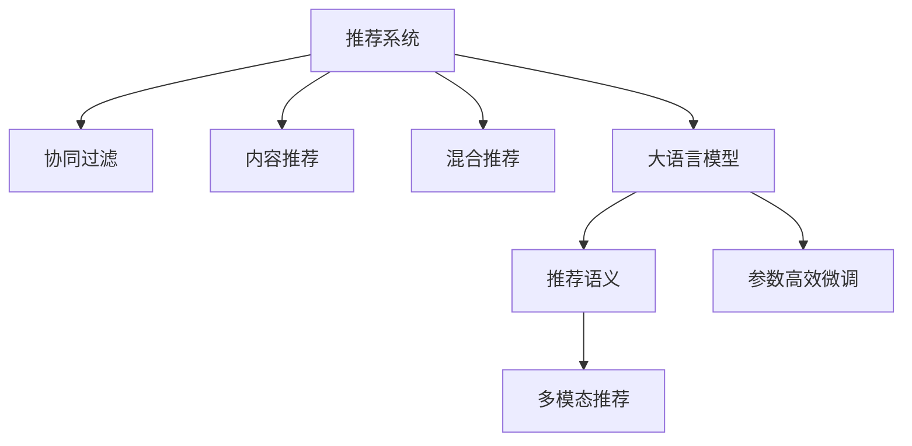

                 

# 大模型赋能下的推荐系统架构演进与重构思路

## 1. 背景介绍

### 1.1 问题由来

随着互联网和数字技术的迅猛发展，推荐系统已成为信息时代的重要基础设施。无论是电子商务、视频流媒体、社交媒体还是新闻阅读，推荐系统通过高效匹配用户需求和资源，极大提升了用户体验和运营效率。推荐系统覆盖领域广泛，应用场景多样，因此其技术架构和算法设计也因需求而异。

传统推荐系统基于协同过滤、内容推荐、混合推荐等方法，依赖于用户行为数据和商品/内容元数据。在数据稀疏和用户行为多样化的情况下，推荐效果往往难以达到理想状态。近年来，大语言模型和大规模预训练语言模型(BERT, GPT-3等)的兴起，为推荐系统带来了新的发展机遇，也带来了前所未有的挑战。

### 1.2 问题核心关键点

大语言模型通过海量的自监督学习任务，如掩码语言模型预训练，能够学习到丰富的语言知识和文本表示能力。在推荐系统领域，大模型可以用于增强用户行为理解，改进推荐语义，提升推荐效果和多样性。

大模型赋能下的推荐系统，主要面临以下问题：

1. **数据融合和特征提取**：如何将用户行为数据和语义特征更高效地结合，构建更具表现力的特征表示。
2. **推荐语义理解**：如何通过大模型的语义表示能力，生成更具个性化和多样性的推荐结果。
3. **模型压缩与推理效率**：如何通过参数裁剪和模型压缩，提升推荐模型的推理效率和实际部署性能。
4. **多模态融合**：如何在大模型基础上融合视觉、音频等多模态数据，实现更全面的推荐效果。
5. **泛化与鲁棒性**：如何通过大模型的大规模知识，提升推荐的泛化能力和鲁棒性。

## 2. 核心概念与联系

### 2.1 核心概念概述

为更好地理解大模型赋能下的推荐系统架构，本节将介绍几个密切相关的核心概念：

- 推荐系统(Recommendation System)：利用用户历史行为数据和物品属性信息，为用户推荐其感兴趣物品的系统。
- 协同过滤(Collaborative Filtering)：基于用户-物品交互矩阵，通过计算用户-物品的相似性，进行物品推荐。
- 内容推荐(Content-Based Filtering)：根据物品属性和用户偏好，选择与用户兴趣相似的物品推荐。
- 混合推荐(Hybrid Filtering)：结合协同过滤和内容推荐，综合不同方法优势，提升推荐效果。
- 大语言模型(LLM)：通过大规模预训练学习到通用语言表示能力，可以用于增强推荐系统的特征提取和语义理解。
- 推荐语义(Semantic Recommendation)：通过大语言模型的语义表示能力，实现更个性化的推荐。
- 多模态推荐(Multimodal Recommendation)：在大模型的基础上，融合视觉、音频等多模态数据，提升推荐系统表现。
- 参数高效微调(Parameter-Efficient Fine-Tuning, PEFT)：只更新少量模型参数，避免过拟合，同时减少推理计算量。

这些核心概念之间的逻辑关系可以通过以下Mermaid流程图来展示：



这个流程图展示了大语言模型与推荐系统核心概念之间的联系：

1. 推荐系统通过协同过滤、内容推荐等方法，为用户提供个性化推荐。
2. 大语言模型可以增强推荐系统的特征提取和语义理解能力。
3. 推荐语义和参数高效微调可以提升推荐系统的表现。
4. 多模态推荐在融合多模态数据后，可以提供更丰富的推荐维度。

## 3. 核心算法原理 & 具体操作步骤
### 3.1 算法原理概述

基于大语言模型的推荐系统，主要通过以下步骤实现：

1. **数据预处理**：收集用户行为数据、物品属性信息等，进行清洗、编码和归一化处理。
2. **特征提取**：将用户行为和物品属性转化为向量表示，构建用户特征向量和物品特征向量。
3. **语义增强**：利用大语言模型的语义表示能力，生成物品的语义特征向量。
4. **融合与拼接**：将用户特征、物品特征和语义特征进行拼接，形成综合特征向量。
5. **推荐模型训练**：在综合特征向量上训练推荐模型，生成个性化推荐结果。

### 3.2 算法步骤详解

以下是基于大语言模型的推荐系统核心步骤的详细描述：

#### 3.2.1 数据预处理

数据预处理包括数据收集、清洗和编码等步骤：

- **数据收集**：收集用户历史行为数据、物品属性信息等，通过API、日志等方式获取。
- **数据清洗**：去除数据中的噪声、异常值和冗余信息，保证数据的质量和完整性。
- **数据编码**：将文本数据转化为数值型特征向量，便于模型处理。
- **特征归一化**：对特征进行标准化处理，防止特征维度不一致导致的模型偏差。

#### 3.2.2 特征提取

特征提取是将用户行为和物品属性转化为数值型特征向量的过程：

- **用户行为编码**：将用户点击、购买等行为转化为数值型特征，如点击次数、购买金额等。
- **物品属性编码**：将物品的类别、属性等信息编码为数值型特征，如商品价格、品牌等级等。
- **特征组合**：将用户行为和物品属性特征进行组合，形成综合特征向量。

#### 3.2.3 语义增强

语义增强是通过大语言模型生成物品的语义特征向量，增强推荐系统的语义理解能力：

- **预训练模型选择**：选择合适的预训练语言模型，如BERT、GPT等。
- **特征编码**：将物品的描述、属性等信息作为输入，编码生成语义特征向量。
- **拼接与融合**：将用户特征、物品特征和语义特征进行拼接，生成综合特征向量。

#### 3.2.4 融合与拼接

融合与拼接是将用户特征、物品特征和语义特征进行拼接，形成综合特征向量的过程：

- **特征拼接**：将用户特征、物品特征和语义特征进行拼接，形成综合特征向量。
- **维度调整**：调整特征向量的维度，使其适合推荐模型的输入。
- **融合策略**：选择加权拼接、特征融合等策略，综合不同特征的表现。

#### 3.2.5 推荐模型训练

推荐模型训练是将综合特征向量作为输入，训练推荐模型，生成个性化推荐结果：

- **模型选择**：选择合适的推荐模型，如协同过滤、内容推荐等。
- **模型训练**：在综合特征向量上训练推荐模型，生成推荐结果。
- **评估与优化**：通过评估指标，如点击率、转化率等，评估推荐模型的效果，进行模型优化。

### 3.3 算法优缺点

基于大语言模型的推荐系统具有以下优点：

1. **增强语义理解能力**：通过大语言模型的语义表示能力，推荐系统能够理解物品的语义信息，生成更个性化的推荐结果。
2. **多模态融合**：在大模型的基础上，可以融合视觉、音频等多模态数据，提升推荐系统表现。
3. **参数高效微调**：通过参数高效微调技术，减少推理计算量，提升推荐模型部署效率。
4. **数据泛化能力**：大模型的通用语言知识，能够提升推荐系统的泛化能力，应对新物品和新用户的推荐需求。

同时，该方法也存在一定的局限性：

1. **数据依赖性**：大语言模型依赖于大规模的语料库进行预训练，对数据质量要求高。
2. **计算成本高**：大模型的训练和推理计算量较大，对硬件资源需求高。
3. **特征提取复杂**：需要将用户行为、物品属性等多源数据进行高效融合和特征提取，增加了复杂度。
4. **模型可解释性不足**：大模型的黑盒特性，导致推荐系统难以解释其内部工作机制和决策逻辑。
5. **参数更新困难**：大模型的参数量巨大，微调时容易发生过拟合，难以优化。

尽管存在这些局限性，但就目前而言，基于大语言模型的推荐系统在推荐效果和多样性方面，仍具有显著优势，适用于个性化需求较高的应用场景。

### 3.4 算法应用领域

基于大语言模型的推荐系统在多个领域得到了广泛应用，包括但不限于：

1. **电子商务**：推荐用户感兴趣的商品，提升用户体验和购物转化率。
2. **视频流媒体**：推荐用户喜欢的影片，提高用户留存率和满意度。
3. **社交媒体**：推荐用户感兴趣的内容，增加平台活跃度和用户粘性。
4. **新闻阅读**：推荐用户感兴趣的新闻和文章，提升平台浏览量和用户留存。
5. **金融投资**：推荐用户感兴趣的投资产品，增加用户投资收益和平台粘性。

此外，基于大语言模型的推荐系统还被创新性地应用于更多场景中，如健康医疗、旅游出行、教育培训等，为不同行业带来了新的发展机遇。随着预训练语言模型和推荐系统技术的不断发展，相信这些应用场景将进一步拓展，推动推荐系统技术在各行各业中深入应用。

## 4. 数学模型和公式 & 详细讲解 & 举例说明

### 4.1 数学模型构建

本节将使用数学语言对基于大语言模型的推荐系统进行更加严格的刻画。

记推荐系统为用户 $u$ 和物品 $i$ 的推荐过程，定义用户行为表示为 $x_u$，物品特征表示为 $x_i$，大语言模型生成的语义表示为 $x_{i,\text{sem}}$。假设推荐模型为 $f$，则推荐过程的数学模型为：

$$
y_{ui} = f(x_u, x_i, x_{i,\text{sem}})
$$

其中 $y_{ui}$ 表示用户 $u$ 对物品 $i$ 的推荐结果，可以是点击率、购买概率、评分等。

### 4.2 公式推导过程

以下我们以协同过滤推荐模型为例，推导协同过滤模型与大语言模型的融合过程。

假设协同过滤模型的用户-物品相似度为 $s_{ui}=\text{cosine}(x_u, x_i)$，则协同过滤模型的推荐结果为：

$$
y_{ui} = s_{ui} \times \alpha + b
$$

其中 $\alpha$ 为协同过滤模型的权重，$b$ 为偏置项。将大语言模型的语义表示 $x_{i,\text{sem}}$ 加入协同过滤模型中，其推荐结果为：

$$
y_{ui} = s_{ui} \times \alpha + b + \text{cosine}(x_i, x_{i,\text{sem}}) \times \gamma
$$

其中 $\gamma$ 为大语言模型的语义权重。通过这种方式，大语言模型的语义知识被融合到协同过滤模型中，提升了推荐结果的个性化和多样性。

### 4.3 案例分析与讲解

**案例：视频推荐系统**

一个视频推荐系统可以使用大语言模型进行语义增强，具体步骤如下：

1. **数据预处理**：收集用户历史观看记录、视频属性信息等，进行清洗、编码和归一化处理。
2. **特征提取**：将用户观看行为转化为点击次数、观看时长等特征，将视频属性信息编码为类别、时长、评分等特征。
3. **语义增强**：利用BERT等预训练语言模型，将视频描述作为输入，生成语义特征向量。
4. **融合与拼接**：将用户特征、视频特征和语义特征进行拼接，生成综合特征向量。
5. **推荐模型训练**：在综合特征向量上训练协同过滤模型，生成个性化推荐结果。

通过上述步骤，该视频推荐系统可以利用大语言模型的语义知识，提升推荐结果的个性化和多样性，满足用户的多样化需求。

## 5. 项目实践：代码实例和详细解释说明
### 5.1 开发环境搭建

在进行推荐系统开发前，我们需要准备好开发环境。以下是使用Python进行TensorFlow和PyTorch开发的环境配置流程：

1. 安装Anaconda：从官网下载并安装Anaconda，用于创建独立的Python环境。

2. 创建并激活虚拟环境：
```bash
conda create -n recsys-env python=3.8 
conda activate recsys-env
```

3. 安装TensorFlow和PyTorch：根据CUDA版本，从官网获取对应的安装命令。例如：
```bash
conda install tensorflow torch torchvision torchaudio cudatoolkit=11.1 -c pytorch -c conda-forge
```

4. 安装各类工具包：
```bash
pip install numpy pandas scikit-learn matplotlib tqdm jupyter notebook ipython
```

完成上述步骤后，即可在`recsys-env`环境中开始推荐系统开发。

### 5.2 源代码详细实现

这里以协同过滤推荐模型为例，给出使用TensorFlow对用户-物品相似度进行计算的PyTorch代码实现。

首先，定义协同过滤模型：

```python
import tensorflow as tf
from tensorflow.keras.layers import Embedding, Dot, Dense

user_embed = Embedding(input_dim=num_users, output_dim=embedding_dim, name='user_embed')
item_embed = Embedding(input_dim=num_items, output_dim=embedding_dim, name='item_embed')

user_item_sim = Dot(axes=1, normalize=True)(user_embed(outputs), item_embed(outputs))

dot_model = Dense(1, activation='sigmoid')(user_item_sim)
```

然后，定义协同过滤模型的优化器、损失函数和训练过程：

```python
from tensorflow.keras.losses import BinaryCrossentropy
from tensorflow.keras.optimizers import Adam

model.compile(loss=BinaryCrossentropy(), optimizer=Adam(lr=0.001))

def train_model(model, train_data, epochs=10):
    model.fit(train_data, epochs=epochs, batch_size=32, validation_split=0.2)

def evaluate_model(model, test_data):
    test_loss = model.evaluate(test_data, verbose=0)
    return test_loss
```

接着，启动训练流程并在测试集上评估：

```python
train_data = # 训练数据集
test_data = # 测试数据集

model = build_model(num_users, num_items, embedding_dim)
train_model(model, train_data)
test_loss = evaluate_model(model, test_data)
print('Test loss:', test_loss)
```

以上就是使用TensorFlow进行协同过滤推荐模型的完整代码实现。可以看到，TensorFlow提供的高阶API使得模型构建和训练变得十分简单。

### 5.3 代码解读与分析

让我们再详细解读一下关键代码的实现细节：

**协同过滤模型**：
- 定义用户和物品的嵌入层，用于将用户和物品表示为稠密向量。
- 使用`Dot`层计算用户和物品的相似度，`axes=1`表示在最后一个维度上进行点积。
- 使用`Dense`层将相似度映射到推荐结果，如点击率或购买概率。

**训练和评估函数**：
- 使用`compile`方法定义损失函数和优化器。
- 通过`fit`方法在训练数据上训练模型，`epochs`参数指定训练轮数。
- 使用`evaluate`方法在测试数据上评估模型性能。

**训练流程**：
- 加载训练数据和测试数据。
- 使用`build_model`函数构建协同过滤模型。
- 在训练数据上调用`train_model`函数进行训练。
- 在测试数据上调用`evaluate_model`函数评估模型效果。

可以看到，TensorFlow的高级API使得模型构建和训练变得简洁高效。开发者可以将更多精力放在特征提取和模型优化上，而不必过多关注底层实现细节。

当然，工业级的系统实现还需考虑更多因素，如模型的保存和部署、超参数的自动搜索、更灵活的任务适配层等。但核心的微调范式基本与此类似。

## 6. 实际应用场景
### 6.1 智能客服系统

智能客服系统可以使用大语言模型进行语义理解和自然语言处理，以提供更智能、更高效的客户服务。具体步骤如下：

1. **数据预处理**：收集历史客服对话记录，进行清洗、编码和归一化处理。
2. **特征提取**：将对话文本转化为向量表示，构建用户意图表示。
3. **语义增强**：利用BERT等预训练语言模型，生成对话语义特征。
4. **融合与拼接**：将用户意图表示和语义特征进行拼接，生成综合特征向量。
5. **推荐模型训练**：在综合特征向量上训练推荐模型，生成个性化回复。

通过上述步骤，智能客服系统可以利用大语言模型的语义知识，提升对话理解和回复的准确性和自然度，满足用户的个性化需求。

### 6.2 金融舆情监测

金融舆情监测系统可以使用大语言模型进行情感分析和文本分类，以实时监测市场舆论动向。具体步骤如下：

1. **数据预处理**：收集金融领域相关的新闻、评论、报告等文本数据，进行清洗、编码和归一化处理。
2. **特征提取**：将文本内容转化为向量表示，构建情感和主题特征。
3. **语义增强**：利用BERT等预训练语言模型，生成文本语义特征。
4. **融合与拼接**：将情感特征和语义特征进行拼接，生成综合特征向量。
5. **推荐模型训练**：在综合特征向量上训练分类模型，生成情感分类结果。

通过上述步骤，金融舆情监测系统可以利用大语言模型的语义知识，提升情感分析和文本分类的准确性，及时发现市场舆情变化，为金融机构提供决策支持。

### 6.3 个性化推荐系统

个性化推荐系统可以使用大语言模型进行推荐语义理解，以提供更具个性化和多样性的推荐结果。具体步骤如下：

1. **数据预处理**：收集用户历史行为数据、物品属性信息等，进行清洗、编码和归一化处理。
2. **特征提取**：将用户行为和物品属性转化为向量表示，构建用户特征和物品特征。
3. **语义增强**：利用BERT等预训练语言模型，生成物品的语义特征向量。
4. **融合与拼接**：将用户特征、物品特征和语义特征进行拼接，生成综合特征向量。
5. **推荐模型训练**：在综合特征向量上训练推荐模型，生成个性化推荐结果。

通过上述步骤，个性化推荐系统可以利用大语言模型的语义知识，提升推荐结果的个性化和多样性，满足用户的多样化需求。

### 6.4 未来应用展望

随着大语言模型和推荐系统技术的不断发展，基于大语言模型的推荐系统将在更多领域得到应用，为各行各业带来变革性影响。

在智慧医疗领域，基于大语言模型的推荐系统可以辅助医生诊疗，推荐医学知识、诊断工具和治疗方案，提升医疗服务水平。

在智能教育领域，推荐系统可以个性化推荐学习资源和练习题，帮助学生掌握知识，提升学习效果。

在智慧城市治理中，推荐系统可以推荐城市事件和公共服务信息，提高城市管理的自动化和智能化水平。

此外，在企业生产、社会治理、文娱传媒等众多领域，基于大语言模型的推荐系统也将不断涌现，为各行业的数字化转型升级提供新的技术路径。相信随着技术的日益成熟，推荐系统必将在更广阔的应用领域大放异彩，深刻影响人类的生产生活方式。

## 7. 工具和资源推荐
### 7.1 学习资源推荐

为了帮助开发者系统掌握大语言模型推荐系统的理论基础和实践技巧，这里推荐一些优质的学习资源：

1. 《Recommender Systems: Algorithms, Data and Implementation》书籍：介绍了推荐系统的经典算法和实现方法，深入浅出地讲解了推荐系统的工作原理和应用场景。
2. 《Introduction to Recommender Systems》课程：斯坦福大学开设的推荐系统课程，涵盖了推荐系统的基本概念和前沿技术，适合初学者和进阶者学习。
3. TensorFlow官方文档：TensorFlow的推荐系统开发文档，提供了丰富的样例代码和最佳实践。
4 《Deep Learning for Recommendation Systems》论文：深度学习在推荐系统中的应用综述，介绍了多种深度学习推荐算法和实践方法。

通过对这些资源的学习实践，相信你一定能够快速掌握大语言模型推荐系统的精髓，并用于解决实际的推荐问题。

### 7.2 开发工具推荐

高效的开发离不开优秀的工具支持。以下是几款用于大语言模型推荐系统开发的常用工具：

1. TensorFlow：由Google主导开发的深度学习框架，支持大规模推荐模型的开发和部署。
2. PyTorch：基于Python的开源深度学习框架，适合快速迭代研究和原型开发。
3. Scikit-learn：Python的机器学习库，提供了丰富的数据处理和特征提取工具。
4. H2O：分布式机器学习框架，支持高效推荐模型的分布式训练和推理。
5. Apache Spark：大数据处理引擎，支持大规模推荐模型的分布式计算和存储。

合理利用这些工具，可以显著提升大语言模型推荐系统的开发效率，加快创新迭代的步伐。

### 7.3 相关论文推荐

大语言模型和推荐系统的发展源于学界的持续研究。以下是几篇奠基性的相关论文，推荐阅读：

1. "SVM-based Recommendation Systems"：最早期的推荐系统研究，介绍了基于支持向量机的推荐算法。
2. "The BellKor Conference on Recommender Systems"：推荐系统领域的顶级会议，汇聚了众多研究论文和实践经验。
3. "Collaborative Filtering for Implicit Feedback Datasets"：协同过滤算法的经典论文，介绍了多种协同过滤推荐算法。
4. "Beyond Matrix Factorization: A Canonical Tensor Factorization Framework for Recommendations"：多模态推荐算法的开创性论文，提出了基于张量分解的多模态推荐方法。
5. "Parameter-Efficient Fine-Tuning for Recommender Systems"：参数高效微调的推荐算法，介绍了多种参数高效微调方法，适用于大规模推荐系统。

这些论文代表了大语言模型推荐系统的发展脉络。通过学习这些前沿成果，可以帮助研究者把握学科前进方向，激发更多的创新灵感。

## 8. 总结：未来发展趋势与挑战

### 8.1 研究成果总结

本文对基于大语言模型的推荐系统进行了全面系统的介绍。首先阐述了大语言模型和推荐系统的研究背景和意义，明确了推荐系统在大语言模型赋能下的新发展方向。其次，从原理到实践，详细讲解了推荐系统的数学模型和关键步骤，给出了推荐系统开发的完整代码实例。同时，本文还广泛探讨了推荐系统在智能客服、金融舆情、个性化推荐等多个领域的应用前景，展示了大语言模型推荐系统的巨大潜力。

通过本文的系统梳理，可以看到，基于大语言模型的推荐系统在大规模语料库的预训练基础上，能够显著提升推荐效果和多样性，适用于个性化需求较高的应用场景。未来，伴随大语言模型和推荐系统技术的不断发展，推荐系统必将在更多领域得到应用，为各行各业带来新的发展机遇。

### 8.2 未来发展趋势

展望未来，大语言模型推荐系统将呈现以下几个发展趋势：

1. **数据融合与特征提取**：随着数据量的增长，推荐系统将更加注重数据融合和特征提取，构建更具表现力的特征表示。
2. **推荐语义理解**：利用大语言模型的语义表示能力，推荐系统能够更好地理解用户需求和物品属性，生成更个性化和多样化的推荐结果。
3. **多模态融合**：在大模型的基础上，推荐系统将融合视觉、音频等多模态数据，实现更全面的推荐效果。
4. **参数高效微调**：开发更加参数高效的微调方法，在固定大部分预训练参数的同时，只更新极少量的任务相关参数。
5. **持续学习与更新**：推荐系统将具备持续学习的能力，及时更新模型参数，适应新数据和新用户的推荐需求。
6. **知识整合与推理**：将符号化的先验知识，如知识图谱、逻辑规则等，与神经网络模型进行融合，提升推荐系统的表现。

以上趋势凸显了大语言模型推荐系统的广阔前景。这些方向的探索发展，必将进一步提升推荐系统的性能和应用范围，为各行各业带来新的发展机遇。

### 8.3 面临的挑战

尽管大语言模型推荐系统已经取得了瞩目成就，但在迈向更加智能化、普适化应用的过程中，它仍面临着诸多挑战：

1. **数据依赖性**：大语言模型依赖于大规模的语料库进行预训练，对数据质量要求高。
2. **计算成本高**：大模型的训练和推理计算量较大，对硬件资源需求高。
3. **特征提取复杂**：需要将用户行为、物品属性等多源数据进行高效融合和特征提取，增加了复杂度。
4. **模型可解释性不足**：大模型的黑盒特性，导致推荐系统难以解释其内部工作机制和决策逻辑。
5. **参数更新困难**：大模型的参数量巨大，微调时容易发生过拟合，难以优化。

尽管存在这些挑战，但大语言模型推荐系统在推荐效果和多样性方面仍具有显著优势，适用于个性化需求较高的应用场景。

### 8.4 研究展望

面向未来，大语言模型推荐系统的研究需要在以下几个方面寻求新的突破：

1. **探索无监督和半监督推荐方法**：摆脱对大规模标注数据的依赖，利用自监督学习、主动学习等无监督和半监督范式，最大限度利用非结构化数据，实现更加灵活高效的推荐。
2. **研究参数高效和计算高效的推荐算法**：开发更加参数高效的推荐方法，在固定大部分预训练参数的同时，只更新极少量的任务相关参数。同时优化推荐模型的计算图，减少前向传播和反向传播的资源消耗，实现更加轻量级、实时性的部署。
3. **引入因果和对比学习范式**：通过引入因果推断和对比学习思想，增强推荐系统建立稳定因果关系的能力，学习更加普适、鲁棒的语言表征，从而提升模型泛化能力和抗干扰能力。
4. **融合先验知识**：将符号化的先验知识，如知识图谱、逻辑规则等，与神经网络模型进行融合，引导推荐过程学习更准确、合理的语言模型。同时加强不同模态数据的整合，实现视觉、音频等多模态信息与文本信息的协同建模。
5. **纳入伦理道德约束**：在模型训练目标中引入伦理导向的评估指标，过滤和惩罚有偏见、有害的输出倾向。同时加强人工干预和审核，建立模型行为的监管机制，确保输出符合人类价值观和伦理道德。

这些研究方向的探索，必将引领大语言模型推荐系统技术迈向更高的台阶，为构建安全、可靠、可解释、可控的智能系统铺平道路。面向未来，大语言模型推荐系统还需要与其他人工智能技术进行更深入的融合，如知识表示、因果推理、强化学习等，多路径协同发力，共同推动推荐系统技术的进步。只有勇于创新、敢于突破，才能不断拓展语言模型的边界，让智能技术更好地造福人类社会。

## 9. 附录：常见问题与解答

**Q1：大语言模型推荐系统是否适用于所有推荐场景？**

A: 大语言模型推荐系统在推荐效果和多样性方面具有显著优势，适用于个性化需求较高的应用场景。但对于一些对推荐速度要求高、计算资源有限的应用场景，如实时推荐系统，可能存在性能瓶颈。此时可以考虑引入模型裁剪、参数裁剪等技术，提升推荐模型的推理速度和效率。

**Q2：推荐系统如何利用大语言模型的语义能力？**

A: 推荐系统可以通过预训练语言模型生成物品的语义特征向量，增强推荐系统的语义理解能力。具体步骤如下：
1. 将物品的描述、属性等信息作为输入，编码生成语义特征向量。
2. 将用户特征、物品特征和语义特征进行拼接，形成综合特征向量。
3. 在综合特征向量上训练推荐模型，生成个性化推荐结果。

**Q3：推荐系统如何处理数据稀疏性？**

A: 推荐系统可以通过多模态数据融合、协同过滤、内容推荐等方法，处理数据稀疏性问题。具体步骤如下：
1. 收集用户历史行为数据、物品属性信息等，进行清洗、编码和归一化处理。
2. 使用协同过滤、内容推荐等方法，构建用户行为和物品属性的特征表示。
3. 利用大语言模型的语义表示能力，生成物品的语义特征向量。
4. 将用户特征、物品特征和语义特征进行拼接，形成综合特征向量。
5. 在综合特征向量上训练推荐模型，生成个性化推荐结果。

**Q4：推荐系统如何优化模型参数？**

A: 推荐系统可以通过参数高效微调、对抗训练、数据增强等方法，优化模型参数。具体步骤如下：
1. 选择合适的预训练语言模型，进行微调。
2. 使用参数高效微调技术，只更新少量模型参数。
3. 使用对抗训练、数据增强等方法，避免过拟合，提高模型泛化能力。
4. 在测试集上评估模型性能，优化超参数，提升推荐效果。

**Q5：推荐系统如何提高部署效率？**

A: 推荐系统可以通过模型裁剪、量化加速、服务化封装等方法，提高部署效率。具体步骤如下：
1. 使用模型裁剪技术，去除不必要的层和参数，减小模型尺寸。
2. 使用量化加速技术，将浮点模型转为定点模型，压缩存储空间。
3. 使用服务化封装技术，将模型封装为标准化服务接口，便于集成调用。
4. 根据请求流量动态调整资源配置，平衡服务质量和成本。

大语言模型推荐系统为推荐系统带来了新的发展机遇，但也带来了新的挑战。通过不断探索和优化，相信推荐系统必将在更多领域得到应用，为各行各业带来新的发展机遇。总之，微调需要开发者根据具体任务，不断迭代和优化模型、数据和算法，方能得到理想的效果。

---

作者：禅与计算机程序设计艺术 / Zen and the Art of Computer Programming

