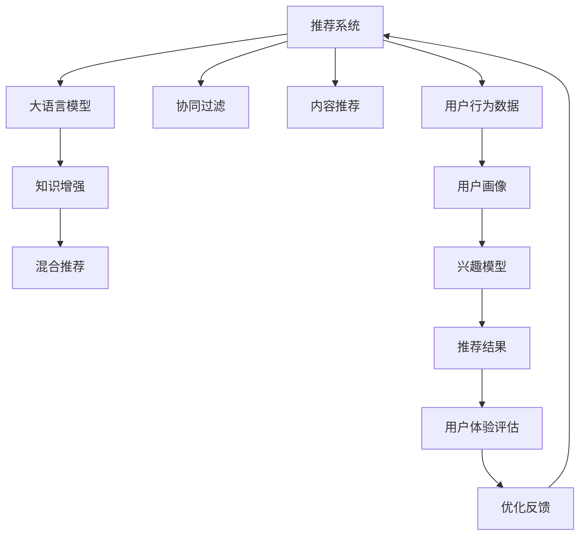

                 

# 大模型赋能下的推荐系统用户体验评估体系构建

在数字经济蓬勃发展的今天，推荐系统已经成为互联网企业提升用户价值、增强用户粘性的核心技术手段之一。然而，随着用户需求的多样化和个性化需求的增强，单一的推荐算法已经难以满足日益复杂多变的用户期望。大语言模型（Large Language Model, LLMs）的兴起，为推荐系统的发展带来了新的契机。

## 1. 背景介绍

### 1.1 问题由来

推荐系统（Recommender System）通过分析用户行为数据，为用户推荐符合其兴趣和需求的内容。早期的推荐系统主要基于协同过滤和内容推荐两种方式，前者通过用户行为数据相似度匹配推荐商品，后者直接基于商品属性进行推荐。但随着数据量的增加，推荐系统需要处理的用户和商品数急剧上升，导致计算成本和存储成本不断增加。同时，随着个性化需求越来越强，单一的推荐方式难以满足复杂多变的用户需求。

大语言模型的出现，为推荐系统提供了新的突破口。大语言模型通过预训练的方式，在大规模无标签数据上进行学习，获得了丰富的语义表示能力。这种能力可以借助推荐系统进行知识增强，实现更高效、更个性化的推荐。例如，可以通过引入大模型进行用户行为数据的语义理解，进一步提升推荐质量。

### 1.2 问题核心关键点

大语言模型赋能推荐系统的问题关键点包括：
1. 如何高效地将大模型知识注入推荐系统，提升推荐质量。
2. 如何设计合适的用户体验评估指标，衡量推荐系统改进效果。
3. 如何将大语言模型的预测结果与传统推荐算法进行融合，实现混合推荐。
4. 如何优化大语言模型与推荐系统的交互流程，提升用户体验。

这些问题涉及到大语言模型知识注入、用户体验评估、推荐算法融合以及交互流程优化等多个方面，需要在理论和实践中进行深入探索。

## 2. 核心概念与联系

### 2.1 核心概念概述

为了更好地理解大语言模型在推荐系统中的应用，本节将介绍几个密切相关的核心概念：

- **大语言模型（LLMs）**：指以自回归（如GPT）或自编码（如BERT）模型为代表的大规模预训练语言模型。通过在大规模无标签文本语料上进行预训练，学习通用的语言知识，具备强大的语言理解和生成能力。

- **推荐系统（Recommender System）**：指通过分析用户行为数据，为用户推荐符合其兴趣和需求的内容的系统。常见的推荐算法包括协同过滤、内容推荐、基于矩阵分解的推荐等。

- **知识增强（Knowledge-Augmentation）**：指将外部知识（如百科、规则、专家知识等）与推荐系统相结合，提升推荐系统的智能性和准确性。大语言模型可以视为一种知识增强手段，通过其强大的语义理解能力，提升推荐系统的知识水平。

- **混合推荐（Hybrid Recommendation）**：指将多种推荐算法相结合，充分发挥每种算法的长处，提升推荐效果。大语言模型可以与协同过滤、内容推荐等传统推荐算法结合，形成混合推荐系统。

- **用户体验（User Experience, UX）**：指用户在使用推荐系统时的感受和满意度。推荐系统不仅要提升推荐效果，还要关注用户体验，让用户在使用过程中感受到价值和乐趣。

这些核心概念之间存在紧密联系，共同构成了推荐系统用户体验评估体系的构建基础。

### 2.2 核心概念原理和架构的 Mermaid 流程图



这个流程图展示了推荐系统用户体验评估体系的核心架构：

1. 推荐系统从用户行为数据中提取特征，通过协同过滤、内容推荐等算法为用户推荐内容。
2. 大语言模型提供知识增强，通过语义理解提升推荐效果。
3. 混合推荐算法结合多种推荐方式，提升推荐准确性和多样性。
4. 用户体验评估系统评估推荐效果，形成反馈优化推荐系统。

## 3. 核心算法原理 & 具体操作步骤

### 3.1 算法原理概述

基于大语言模型的推荐系统，主要通过以下步骤实现知识增强：

1. **大语言模型预训练**：在大规模无标签数据上预训练大语言模型，学习通用语言知识。
2. **知识注入推荐系统**：将大语言模型的知识注入推荐系统，用于提升推荐效果。
3. **混合推荐**：将大语言模型的预测结果与传统推荐算法结果进行融合，提升推荐质量。
4. **用户体验评估**：通过用户反馈和行为数据，评估推荐系统效果，形成反馈循环，优化推荐系统。

### 3.2 算法步骤详解

1. **数据准备**：收集用户行为数据，包括浏览、点击、购买、评分等行为。同时，收集大语言模型预训练数据，如大规模文本语料、知识库等。

2. **用户画像构建**：通过行为数据分析，构建用户画像，包括兴趣偏好、行为模式等。

3. **兴趣模型训练**：基于用户画像，训练兴趣模型，用于预测用户对推荐内容的兴趣程度。

4. **知识注入推荐**：通过大语言模型对推荐内容进行语义分析，提取语义特征，用于提升推荐效果。

5. **混合推荐**：将大语言模型与传统推荐算法（如协同过滤、内容推荐）结果进行融合，提升推荐准确性和多样性。

6. **用户体验评估**：通过用户反馈和行为数据，评估推荐系统效果，形成反馈循环，优化推荐系统。

### 3.3 算法优缺点

大语言模型赋能推荐系统有以下优点：
1. 提升推荐效果：大语言模型具备强大的语义理解能力，能够对推荐内容进行更深入的语义分析，提升推荐准确性。
2. 知识增强：通过引入大语言模型，推荐系统能够吸收更多外部知识，提升智能性和准确性。
3. 增强用户粘性：大语言模型的自然语言生成能力，能够提升推荐系统的互动性和用户体验。

同时，该方法也存在以下局限性：
1. 对标注数据依赖：大语言模型的知识注入需要高质量的标注数据，增加了推荐系统的复杂度。
2. 计算成本高：大语言模型的预训练和知识注入需要较高的计算资源，增加了推荐系统的成本。
3. 模型复杂度高：大语言模型和推荐系统结合，使得模型结构更加复杂，增加了调参和优化的难度。
4. 用户隐私问题：大语言模型的知识注入需要收集和分析用户行为数据，可能带来用户隐私问题。

### 3.4 算法应用领域

基于大语言模型的推荐系统已经在多个领域得到应用，例如：

1. 电商推荐：在电商平台中，通过大语言模型提升商品推荐效果，提升用户购买转化率。
2. 视频推荐：在视频平台中，通过大语言模型提升视频推荐效果，提高用户观看时长。
3. 内容推荐：在新闻、音乐等平台中，通过大语言模型提升内容推荐效果，提升用户满意度。
4. 广告推荐：在广告平台中，通过大语言模型提升广告推荐效果，提高广告点击率。

## 4. 数学模型和公式 & 详细讲解

### 4.1 数学模型构建

设推荐系统为 $R$，用户为 $U$，商品为 $I$，用户对商品 $i$ 的兴趣度为 $r_{ui}$，用户对商品 $i$ 的评分 $y_{ui}$，用户对商品 $i$ 的预测评分 $\hat{y}_{ui}$。大语言模型提供知识增强功能，用于提升推荐效果。

大语言模型知识注入推荐系统的数学模型为：

$$
\hat{y}_{ui} = f_{\theta}(\mathbf{x}_i, \mathbf{u})
$$

其中 $\mathbf{x}_i$ 表示商品 $i$ 的特征向量，$\mathbf{u}$ 表示用户 $u$ 的特征向量，$f_{\theta}$ 为推荐模型参数化函数。

### 4.2 公式推导过程

假设推荐系统采用线性模型，则推荐模型参数化函数为：

$$
\hat{y}_{ui} = \mathbf{w} \cdot (\mathbf{x}_i \oplus \mathbf{u}) + b
$$

其中 $\mathbf{w}$ 为模型权重，$b$ 为偏置项，$\oplus$ 表示向量拼接。

大语言模型提供的知识增强函数为 $f_{\theta}$，其参数 $\theta$ 为大语言模型预训练权重。在推荐系统中，大语言模型输出的语义特征表示为 $\mathbf{h}$，与用户特征向量 $\mathbf{u}$ 拼接，输入到推荐模型中，得到最终的预测评分 $\hat{y}_{ui}$。

### 4.3 案例分析与讲解

以电商推荐为例，设用户 $u$ 对商品 $i$ 的评分数据为 $r_{ui}$，商品 $i$ 的特征向量为 $\mathbf{x}_i$，用户 $u$ 的特征向量为 $\mathbf{u}$。假设商品 $i$ 的描述为 $d_i$，大语言模型对 $d_i$ 进行语义分析，得到语义特征表示 $\mathbf{h}$，与 $\mathbf{u}$ 拼接，输入到推荐模型中，得到最终的预测评分 $\hat{y}_{ui}$。

设推荐系统采用线性模型，则推荐模型参数化函数为：

$$
\hat{y}_{ui} = \mathbf{w} \cdot (\mathbf{x}_i \oplus \mathbf{h} \oplus \mathbf{u}) + b
$$

其中 $\oplus$ 表示向量拼接。

通过大语言模型进行知识增强，推荐系统能够更好地理解商品描述，提升推荐效果。

## 5. 项目实践：代码实例和详细解释说明

### 5.1 开发环境搭建

在进行推荐系统开发前，我们需要准备好开发环境。以下是使用Python进行PyTorch开发的环境配置流程：

1. 安装Anaconda：从官网下载并安装Anaconda，用于创建独立的Python环境。

2. 创建并激活虚拟环境：
```bash
conda create -n pytorch-env python=3.8 
conda activate pytorch-env
```

3. 安装PyTorch：根据CUDA版本，从官网获取对应的安装命令。例如：
```bash
conda install pytorch torchvision torchaudio cudatoolkit=11.1 -c pytorch -c conda-forge
```

4. 安装Transformers库：
```bash
pip install transformers
```

5. 安装各类工具包：
```bash
pip install numpy pandas scikit-learn matplotlib tqdm jupyter notebook ipython
```

完成上述步骤后，即可在`pytorch-env`环境中开始推荐系统开发。

### 5.2 源代码详细实现

这里我们以电商推荐为例，给出使用Transformers库对大语言模型进行推荐系统开发和微调的PyTorch代码实现。

首先，定义推荐系统的数据处理函数：

```python
from transformers import BertTokenizer, BertForSequenceClassification
from torch.utils.data import Dataset, DataLoader
import torch
import numpy as np

class RecommendDataset(Dataset):
    def __init__(self, texts, labels):
        self.texts = texts
        self.labels = labels
        self.tokenizer = BertTokenizer.from_pretrained('bert-base-cased')
        self.max_len = 128
        
    def __len__(self):
        return len(self.texts)
    
    def __getitem__(self, item):
        text = self.texts[item]
        label = self.labels[item]
        
        encoding = self.tokenizer(text, return_tensors='pt', max_length=self.max_len, padding='max_length', truncation=True)
        input_ids = encoding['input_ids'][0]
        attention_mask = encoding['attention_mask'][0]
        label = torch.tensor(label, dtype=torch.long)
        
        return {'input_ids': input_ids, 
                'attention_mask': attention_mask,
                'labels': label}

# 加载数据
tokenizer = BertTokenizer.from_pretrained('bert-base-cased')
train_dataset = RecommendDataset(train_texts, train_labels)
dev_dataset = RecommendDataset(dev_texts, dev_labels)
test_dataset = RecommendDataset(test_texts, test_labels)
```

然后，定义模型和优化器：

```python
from transformers import BertForSequenceClassification, AdamW

model = BertForSequenceClassification.from_pretrained('bert-base-cased', num_labels=1)

optimizer = AdamW(model.parameters(), lr=2e-5)
```

接着，定义训练和评估函数：

```python
from sklearn.metrics import accuracy_score
from tqdm import tqdm
import numpy as np

device = torch.device('cuda') if torch.cuda.is_available() else torch.device('cpu')
model.to(device)

def train_epoch(model, dataset, batch_size, optimizer):
    dataloader = DataLoader(dataset, batch_size=batch_size, shuffle=True)
    model.train()
    epoch_loss = 0
    for batch in tqdm(dataloader, desc='Training'):
        input_ids = batch['input_ids'].to(device)
        attention_mask = batch['attention_mask'].to(device)
        labels = batch['labels'].to(device)
        model.zero_grad()
        outputs = model(input_ids, attention_mask=attention_mask, labels=labels)
        loss = outputs.loss
        epoch_loss += loss.item()
        loss.backward()
        optimizer.step()
    return epoch_loss / len(dataloader)

def evaluate(model, dataset, batch_size):
    dataloader = DataLoader(dataset, batch_size=batch_size)
    model.eval()
    preds, labels = [], []
    with torch.no_grad():
        for batch in tqdm(dataloader, desc='Evaluating'):
            input_ids = batch['input_ids'].to(device)
            attention_mask = batch['attention_mask'].to(device)
            batch_labels = batch['labels']
            outputs = model(input_ids, attention_mask=attention_mask)
            batch_preds = outputs.logits.argmax(dim=1).to('cpu').tolist()
            batch_labels = batch_labels.to('cpu').tolist()
            for pred, label in zip(batch_preds, batch_labels):
                preds.append(pred)
                labels.append(label)
                
    return accuracy_score(labels, preds)

# 训练
epochs = 5
batch_size = 16

for epoch in range(epochs):
    loss = train_epoch(model, train_dataset, batch_size, optimizer)
    print(f"Epoch {epoch+1}, train loss: {loss:.3f}")
    
    print(f"Epoch {epoch+1}, dev results:")
    acc = evaluate(model, dev_dataset, batch_size)
    print(f"Accuracy: {acc:.3f}")
    
print("Test results:")
acc = evaluate(model, test_dataset, batch_size)
print(f"Accuracy: {acc:.3f}")
```

以上就是使用PyTorch对BERT进行电商推荐任务开发和微调的完整代码实现。可以看到，得益于Transformers库的强大封装，我们可以用相对简洁的代码完成BERT模型的加载和微调。

### 5.3 代码解读与分析

让我们再详细解读一下关键代码的实现细节：

**RecommendDataset类**：
- `__init__`方法：初始化文本、标签、分词器等关键组件。
- `__len__`方法：返回数据集的样本数量。
- `__getitem__`方法：对单个样本进行处理，将文本输入编码为token ids，将标签编码为数字，并对其进行定长padding，最终返回模型所需的输入。

**tokenizer和bert_model变量**：
- 加载BertTokenizer和BertForSequenceClassification模型，设置标签数量。

**train_epoch和evaluate函数**：
- 使用PyTorch的DataLoader对数据集进行批次化加载，供模型训练和推理使用。
- 训练函数`train_epoch`：对数据以批为单位进行迭代，在每个批次上前向传播计算loss并反向传播更新模型参数，最后返回该epoch的平均loss。
- 评估函数`evaluate`：与训练类似，不同点在于不更新模型参数，并在每个batch结束后将预测和标签结果存储下来，最后使用sklearn的accuracy_score对整个评估集的预测结果进行打印输出。

**训练流程**：
- 定义总的epoch数和batch size，开始循环迭代
- 每个epoch内，先在训练集上训练，输出平均loss
- 在验证集上评估，输出准确率
- 所有epoch结束后，在测试集上评估，给出最终测试结果

可以看到，PyTorch配合Transformers库使得BERT微调的代码实现变得简洁高效。开发者可以将更多精力放在数据处理、模型改进等高层逻辑上，而不必过多关注底层的实现细节。

当然，工业级的系统实现还需考虑更多因素，如模型的保存和部署、超参数的自动搜索、更灵活的任务适配层等。但核心的微调范式基本与此类似。

## 6. 实际应用场景

### 6.1 智能客服系统

基于大语言模型赋能的推荐系统，可以广泛应用于智能客服系统的构建。传统客服往往需要配备大量人力，高峰期响应缓慢，且一致性和专业性难以保证。而使用推荐系统进行知识增强，可以显著提升客服系统的响应速度和准确性。

在技术实现上，可以收集企业内部的历史客服对话记录，将问题和最佳答复构建成监督数据，在此基础上对预训练推荐系统进行微调。微调后的推荐系统能够自动理解用户意图，匹配最合适的答复模板进行回复。对于客户提出的新问题，还可以接入检索系统实时搜索相关内容，动态组织生成回答。如此构建的智能客服系统，能大幅提升客户咨询体验和问题解决效率。

### 6.2 金融舆情监测

金融机构需要实时监测市场舆论动向，以便及时应对负面信息传播，规避金融风险。传统的人工监测方式成本高、效率低，难以应对网络时代海量信息爆发的挑战。基于大语言模型赋能的推荐系统，可以实时分析新闻、评论、社交媒体等大量信息，进行情感分析，自动识别负面舆情。

在技术实现上，可以收集金融领域相关的新闻、报道、评论等文本数据，训练推荐系统对金融舆情进行情感分类。微调后的推荐系统能够自动判断文本属于何种情感倾向，及时发现和预警负面舆情。

### 6.3 个性化推荐系统

当前的推荐系统往往只依赖用户的历史行为数据进行物品推荐，无法深入理解用户的真实兴趣偏好。基于大语言模型赋能的推荐系统，可以更好地挖掘用户行为背后的语义信息，从而提供更精准、多样的推荐内容。

在技术实现上，可以收集用户浏览、点击、评论、分享等行为数据，提取和用户交互的物品标题、描述、标签等文本内容。将文本内容作为模型输入，用户的后续行为（如是否点击、购买等）作为监督信号，在此基础上微调预训练语言模型。微调后的模型能够从文本内容中准确把握用户的兴趣点。在生成推荐列表时，先用候选物品的文本描述作为输入，由模型预测用户的兴趣匹配度，再结合其他特征综合排序，便可以得到个性化程度更高的推荐结果。

### 6.4 未来应用展望

随着大语言模型和推荐系统的不断发展，基于大语言模型赋能的推荐系统将在更多领域得到应用，为传统行业带来变革性影响。

在智慧医疗领域，基于大语言模型赋能的医疗推荐系统可以提升医疗服务的智能化水平，辅助医生诊疗，加速新药开发进程。

在智能教育领域，推荐系统可以应用于作业批改、学情分析、知识推荐等方面，因材施教，促进教育公平，提高教学质量。

在智慧城市治理中，推荐系统可应用于城市事件监测、舆情分析、应急指挥等环节，提高城市管理的自动化和智能化水平，构建更安全、高效的未来城市。

此外，在企业生产、社会治理、文娱传媒等众多领域，基于大语言模型赋能的推荐系统也将不断涌现，为NLP技术带来了全新的突破。相信随着预训练语言模型和推荐系统的持续演进，未来推荐系统必将在更广阔的应用领域大放异彩，深刻影响人类的生产生活方式。

## 7. 工具和资源推荐

### 7.1 学习资源推荐

为了帮助开发者系统掌握大语言模型赋能推荐系统的理论基础和实践技巧，这里推荐一些优质的学习资源：

1. 《Recommender Systems: Theory and Practice》书籍：由Meng et al.所写，全面介绍了推荐系统的发展历程、算法原理和实际应用。

2. 《Large-Scale Machine Learning: Algorithms, Systems, and the Importance of Scale》书籍：由Yarowsky et al.所写，介绍了大规模机器学习的算法和系统设计。

3. 《Deep Learning for Recommender Systems》在线课程：由Coursera开设，由Wisconsin大学提供，介绍了深度学习在推荐系统中的应用。

4. 《Natural Language Processing with Transformers》书籍：Transformers库的作者所著，全面介绍了如何使用Transformers库进行NLP任务开发，包括知识增强在内的诸多范式。

5. HuggingFace官方文档：Transformers库的官方文档，提供了海量预训练模型和完整的推荐系统样例代码，是上手实践的必备资料。

通过对这些资源的学习实践，相信你一定能够快速掌握大语言模型赋能推荐系统的精髓，并用于解决实际的推荐问题。

### 7.2 开发工具推荐

高效的开发离不开优秀的工具支持。以下是几款用于大语言模型赋能推荐系统开发的常用工具：

1. PyTorch：基于Python的开源深度学习框架，灵活动态的计算图，适合快速迭代研究。大部分预训练语言模型都有PyTorch版本的实现。

2. TensorFlow：由Google主导开发的开源深度学习框架，生产部署方便，适合大规模工程应用。同样有丰富的预训练语言模型资源。

3. Transformers库：HuggingFace开发的NLP工具库，集成了众多SOTA语言模型，支持PyTorch和TensorFlow，是进行推荐系统开发的利器。

4. Weights & Biases：模型训练的实验跟踪工具，可以记录和可视化模型训练过程中的各项指标，方便对比和调优。与主流深度学习框架无缝集成。

5. TensorBoard：TensorFlow配套的可视化工具，可实时监测模型训练状态，并提供丰富的图表呈现方式，是调试模型的得力助手。

6. Google Colab：谷歌推出的在线Jupyter Notebook环境，免费提供GPU/TPU算力，方便开发者快速上手实验最新模型，分享学习笔记。

合理利用这些工具，可以显著提升大语言模型赋能推荐系统的开发效率，加快创新迭代的步伐。

### 7.3 相关论文推荐

大语言模型赋能推荐系统的发展源于学界的持续研究。以下是几篇奠基性的相关论文，推荐阅读：

1. Deep Learning Recommendation System: A Survey and Outlook：由He et al.所写，介绍了深度学习在推荐系统中的应用。

2. Matrix Factorization Techniques for Recommender Systems：由Cinitzis et al.所写，介绍了矩阵分解在推荐系统中的应用。

3. Neural Collaborative Filtering：由He et al.所写，介绍了神经网络在推荐系统中的应用。

4. Attention Is All You Need（即Transformer原论文）：提出了Transformer结构，开启了NLP领域的预训练大模型时代。

5. Knowledge-Augmented Neural Collaborative Filtering：介绍了知识增强在推荐系统中的应用。

这些论文代表了大语言模型赋能推荐系统的发展脉络。通过学习这些前沿成果，可以帮助研究者把握学科前进方向，激发更多的创新灵感。

## 8. 总结：未来发展趋势与挑战

### 8.1 总结

本文对基于大语言模型的推荐系统进行了全面系统的介绍。首先阐述了推荐系统的发展背景和问题关键点，明确了大语言模型在推荐系统中的重要作用。其次，从原理到实践，详细讲解了大语言模型赋能推荐系统的数学模型和操作步骤，给出了推荐系统开发的完整代码实例。同时，本文还广泛探讨了推荐系统在大规模数据、用户体验评估、混合推荐等领域的实际应用，展示了大语言模型赋能推荐系统的广阔前景。此外，本文精选了推荐系统的各类学习资源，力求为读者提供全方位的技术指引。

通过本文的系统梳理，可以看到，基于大语言模型的推荐系统已经在多个领域得到应用，为传统行业带来了新的变革。未来，伴随大语言模型和推荐系统的不断进步，推荐系统必将在更广阔的应用领域大放异彩，深刻影响人类的生产生活方式。

### 8.2 未来发展趋势

展望未来，大语言模型赋能推荐系统的发展趋势如下：

1. 模型规模持续增大。随着算力成本的下降和数据规模的扩张，预训练语言模型的参数量还将持续增长。超大模型将提升推荐系统的知识水平，增强推荐效果。

2. 推荐算法更加多样化。推荐系统将结合更多先进算法，如深度学习、强化学习、图神经网络等，提升推荐系统的智能化和精准性。

3. 用户体验不断提升。推荐系统将更多地关注用户心理模型，提升推荐系统的个性化和可信性，改善用户体验。

4. 跨领域推荐系统增多。推荐系统将结合更多领域的知识，如医疗、金融、教育等，提升推荐系统的泛化性和适应性。

5. 混合推荐算法更加普遍。推荐系统将更多地采用混合推荐算法，结合多种推荐方式，提升推荐效果。

6. 推荐系统更加开放。推荐系统将更多地结合用户自主选择和社交网络，提升推荐系统的互动性和趣味性。

以上趋势凸显了大语言模型赋能推荐系统的广阔前景。这些方向的探索发展，必将进一步提升推荐系统的性能和应用范围，为人类认知智能的进化带来深远影响。

### 8.3 面临的挑战

尽管大语言模型赋能推荐系统已经取得了瞩目成就，但在迈向更加智能化、普适化应用的过程中，它仍面临着诸多挑战：

1. 标注成本瓶颈。推荐系统需要大量的用户行为数据进行训练，数据收集和标注成本较高。如何降低推荐系统对标注数据的依赖，将是一大难题。

2. 推荐效果波动。推荐系统在大规模数据下的泛化性能有待提升，对于新数据的适应能力较弱。如何提高推荐系统的鲁棒性和稳定性，还需要更多的研究。

3. 计算资源消耗。大语言模型和推荐系统结合，需要更高的计算资源支持。如何优化推荐系统的计算图和资源配置，减少计算消耗，需要进一步探索。

4. 用户隐私保护。推荐系统需要收集和分析用户行为数据，可能带来隐私问题。如何保护用户隐私，增强用户信任，还需更多的技术手段。

5. 推荐系统透明性。推荐系统的内部机制和决策过程较为复杂，用户难以理解和信任。如何增强推荐系统的透明性和可解释性，增强用户信任感，将是一大挑战。

6. 推荐系统安全性。推荐系统可能被恶意利用，带来安全风险。如何保护推荐系统的安全性，防止恶意攻击，还需进一步加强。

这些挑战限制了大语言模型赋能推荐系统的应用范围和效果。未来的研究需要在技术、伦理、法律等多个维度进行协同探索，才能更好地发挥大语言模型赋能推荐系统的潜力。

### 8.4 研究展望

面对大语言模型赋能推荐系统所面临的挑战，未来的研究需要在以下几个方面寻求新的突破：

1. 探索无监督和半监督推荐方法。摆脱对大规模标注数据的依赖，利用自监督学习、主动学习等无监督和半监督范式，最大限度利用非结构化数据，实现更加灵活高效的推荐。

2. 研究推荐系统的跨领域知识增强。结合多领域的知识图谱、规则库等专家知识，提升推荐系统的智能性和准确性。

3. 开发推荐系统的因果推断和解释工具。引入因果推断和解释工具，增强推荐系统的透明性和可解释性，提升用户信任感。

4. 开发推荐系统的多模态融合技术。结合视觉、语音、文本等多模态数据，提升推荐系统的综合感知能力和精准性。

5. 加强推荐系统的隐私保护和安全防护。开发隐私保护和安全性增强技术，保护用户隐私，防止恶意攻击。

6. 引入推荐系统的混合推荐和混合学习。结合多种推荐算法和数据源，提升推荐系统的鲁棒性和泛化性。

这些研究方向将引领大语言模型赋能推荐系统迈向更高的台阶，为构建安全、可靠、可解释、可控的智能推荐系统铺平道路。面向未来，大语言模型赋能推荐系统还需要与其他人工智能技术进行更深入的融合，如知识表示、因果推理、强化学习等，多路径协同发力，共同推动推荐系统的进步。只有勇于创新、敢于突破，才能不断拓展推荐系统的边界，让智能技术更好地造福人类社会。

## 9. 附录：常见问题与解答

**Q1：推荐系统如何处理推荐内容的多样性？**

A: 推荐系统通过多种算法结合，如协同过滤、内容推荐、知识增强等，提升推荐内容的丰富度和多样性。大语言模型通过语义理解，可以从更多角度提取推荐内容的特征，提升推荐效果。

**Q2：推荐系统如何处理推荐内容的实时性？**

A: 推荐系统通过实时抓取用户行为数据，动态调整推荐内容。大语言模型通过预训练获得的基础知识，可以迅速适应新数据的语义特征，提升推荐内容的及时性。

**Q3：推荐系统如何处理推荐内容的用户个性化？**

A: 推荐系统通过用户画像和兴趣模型，了解用户的个性化需求。大语言模型通过语义理解，更好地把握用户的兴趣点，提供更加个性化的推荐内容。

**Q4：推荐系统如何处理推荐内容的安全性？**

A: 推荐系统通过数据脱敏和访问鉴权等技术手段，保护用户隐私和数据安全。大语言模型通过数据筛选和模型风险评估等手段，防止恶意内容的生成和传播。

**Q5：推荐系统如何处理推荐内容的可解释性？**

A: 推荐系统通过推荐机制和推荐过程的透明性，增强推荐内容的可解释性。大语言模型通过语义解释和因果推断等技术手段，增强推荐内容的可解释性。

通过以上问题的回答，可以看到大语言模型赋能推荐系统已经在多个领域得到应用，展示了其强大的潜力和广泛的前景。相信随着技术的不断发展，大语言模型赋能推荐系统必将在更多领域得到应用，深刻影响人类的生产生活方式。

---

作者：禅与计算机程序设计艺术 / Zen and the Art of Computer Programming

