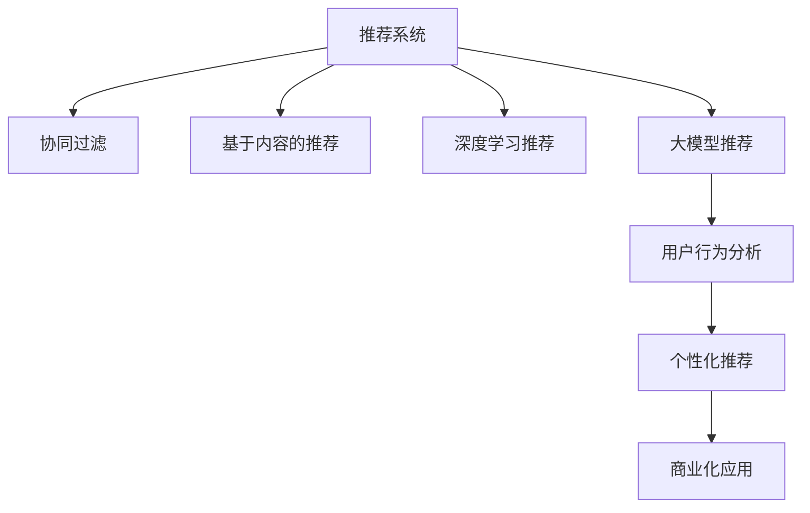

                 

# 大模型赋能推荐系统:从技术到商业的思考

> 关键词：大模型推荐系统,推荐系统,个性化推荐,用户行为分析,协同过滤,深度学习,商业化应用

## 1. 背景介绍

### 1.1 问题由来

在信息时代，海量的内容呈爆炸式增长。如何帮助用户在海量数据中快速找到符合自己兴趣和需求的信息，成为了互联网应用的重要任务。推荐系统作为智能互联网的核心技术，通过深入理解用户行为和兴趣，高效推荐相关内容，极大地提升了用户体验和应用价值。

传统的推荐系统主要依赖于统计学方法和简单的用户行为数据，通过协同过滤、基于内容的推荐等技术手段，实现了一定程度的用户个性化推荐。然而，这些方法往往依赖于用户行为数据，难以捕捉用户复杂的兴趣和偏好，推荐效果有限。

近年来，深度学习和大模型技术的发展，为推荐系统带来了革命性的变化。基于大模型的推荐系统，通过学习用户与内容的隐式交互模式，建模用户和内容的复杂语义关系，实现了显著的性能提升。深度学习推荐系统在电子商务、视频、音乐等众多领域实现了大规模应用，为用户带来了前所未有的体验。

## 2. 核心概念与联系

### 2.1 核心概念概述

为更好地理解大模型赋能推荐系统的技术和商业价值，本节将介绍几个关键概念：

- 推荐系统：通过分析用户历史行为数据和内容特征，为用户推荐感兴趣的信息。推荐系统广泛应用在电商、视频、新闻等众多互联网产品中，是实现个性化推荐的核心技术。

- 协同过滤(Collaborative Filtering)：通过分析用户行为数据，预测用户对未交互内容的偏好。协同过滤可以进一步分为基于用户的协同过滤(User-Based CF)和基于项目的协同过滤(Item-Based CF)。

- 基于内容的推荐(Content-Based)：通过内容特征，预测用户对内容的偏好。基于内容的推荐通常需要对内容进行特征提取，然后通过相似度度量进行推荐。

- 深度学习推荐系统(Deep Learning-Based Recommendation)：通过深度神经网络模型，学习用户和内容之间的复杂关系，实现更准确的推荐效果。深度学习推荐系统主要分为序列推荐模型(如RNN、LSTM、GRU等)和隐式交互模型(如NeuMF、Wide & Deep等)。

- 大模型推荐系统(Deep Learning-Based Recommendation)：使用大规模预训练语言模型，如BERT、GPT等，在用户行为数据上微调，获得个性化的推荐结果。大模型推荐系统利用语言模型强大的表示能力，能够捕捉用户复杂的兴趣偏好，提升推荐效果。

- 商业化应用：推荐系统作为互联网产品的重要组成部分，其商业价值在于提高用户粘性、增加业务收入、降低运营成本等。推荐系统需要兼顾技术效果和商业需求，实现用户价值和商业价值的最大化。

这些概念之间的逻辑关系可以通过以下Mermaid流程图来展示：



这个流程图展示了大模型推荐系统的核心概念及其之间的关系：

1. 推荐系统通过协同过滤和基于内容的推荐方法，积累用户行为数据，学习用户兴趣偏好。
2. 深度学习推荐系统利用神经网络建模用户与内容的复杂关系，提升推荐准确度。
3. 大模型推荐系统通过在用户行为数据上微调大规模预训练模型，获取更丰富的用户表示，实现个性化推荐。
4. 大模型推荐系统可以应用更广泛的用户行为分析方法，如自然语言处理、时间序列分析等，构建更全面的用户画像。
5. 推荐系统通过个性化推荐，提升用户价值和商业价值，成为互联网产品的核心竞争力。

## 3. 核心算法原理 & 具体操作步骤
### 3.1 算法原理概述

大模型赋能推荐系统的核心思想是：使用大规模预训练语言模型，通过微调学习用户行为数据，获得个性化的推荐结果。其核心原理可以分为以下几个步骤：

1. 数据准备：收集用户的历史行为数据，包括点击、浏览、评分等，作为训练集。同时，收集内容特征数据，如标签、类别、属性等，作为输入。

2. 预训练模型选择：选择合适的预训练语言模型，如BERT、GPT等，作为特征提取器。

3. 微调过程：在预训练模型的基础上，使用用户行为数据进行微调，获得针对特定用户和内容的推荐模型。

4. 推荐计算：根据输入的用户特征和内容特征，使用微调后的模型计算推荐结果。

5. 商业应用：将推荐结果应用于实际应用场景，提升用户体验和业务价值。

### 3.2 算法步骤详解

基于大模型的推荐系统一般包括以下几个关键步骤：

**Step 1: 数据准备**
- 收集用户的历史行为数据，包括点击、浏览、评分等，作为训练集。同时，收集内容特征数据，如标签、类别、属性等，作为输入。

**Step 2: 模型初始化**
- 选择合适的预训练语言模型，如BERT、GPT等，作为特征提取器。将用户行为数据和内容特征数据，作为输入，进行特征表示。

**Step 3: 微调模型**
- 定义推荐目标函数，如交叉熵损失等。在预训练模型的基础上，使用用户行为数据进行微调，获得针对特定用户和内容的推荐模型。
- 设置微调超参数，如学习率、批大小、迭代轮数等。

**Step 4: 推荐计算**
- 根据输入的用户特征和内容特征，使用微调后的模型计算推荐结果。

**Step 5: 商业应用**
- 将推荐结果应用于实际应用场景，如电商商品推荐、视频内容推荐等，提升用户体验和业务价值。

### 3.3 算法优缺点

基于大模型的推荐系统具有以下优点：
1. 高精度：大模型通过学习用户和内容的隐式关系，能够捕捉复杂的语义关系，实现高精度的推荐。
2. 泛化能力：大模型具有较强的泛化能力，能够适应不同的应用场景和数据分布。
3. 高效性：大模型推荐系统能够快速计算推荐结果，满足实时推荐的需求。
4. 可解释性：大模型推荐系统可以通过调整参数和微调策略，实现更透明的推荐过程，便于理解和调试。

同时，该方法也存在一定的局限性：
1. 数据依赖：大模型推荐系统依赖于高质量的用户行为数据，数据获取成本较高。
2. 冷启动问题：对于新用户，缺乏历史行为数据，难以进行有效的推荐。
3. 计算资源消耗：大规模预训练模型和微调过程需要大量的计算资源和存储资源，硬件成本较高。
4. 模型复杂度：大模型推荐系统往往结构复杂，难以解释和优化。

尽管存在这些局限性，但就目前而言，基于大模型的推荐系统仍然是大数据推荐技术的重要方向。未来相关研究的重点在于如何进一步降低数据依赖，提高模型泛化能力和计算效率，同时兼顾模型可解释性和商业价值。

### 3.4 算法应用领域

基于大模型的推荐系统已经在电子商务、视频推荐、音乐推荐等众多领域得到了广泛的应用，提升了用户体验和业务价值。

- 电子商务：电商推荐系统通过分析用户购物行为，推荐用户感兴趣的商品，提升转化率和复购率。例如，亚马逊通过BERT微调模型，为用户推荐个性化商品，显著提升了用户购买体验。
- 视频推荐：视频推荐系统通过分析用户观看行为，推荐用户感兴趣的视频内容，提升用户粘性和观看时长。例如，Netflix利用大模型推荐系统，为用户推荐个性化视频，实现了较高的用户留存率。
- 音乐推荐：音乐推荐系统通过分析用户听歌行为，推荐用户感兴趣的歌曲，提升用户的听歌体验。例如，Spotify通过BERT微调模型，为用户推荐个性化音乐，大大提升了用户粘性。

除了这些经典领域外，大模型推荐系统还被创新性地应用到更多场景中，如基于用户评论的书籍推荐、旅游目的地推荐等，为推荐系统带来了新的突破。

## 4. 数学模型和公式 & 详细讲解  
### 4.1 数学模型构建

本节将使用数学语言对基于大模型的推荐系统进行更加严格的刻画。

记用户行为数据为 $D=\{(x_i,y_i)\}_{i=1}^N, x_i \in \mathcal{X}, y_i \in \mathcal{Y}$，其中 $\mathcal{X}$ 为输入空间，$\mathcal{Y}$ 为输出空间，$y_i$ 表示用户对内容 $x_i$ 的评分或点击行为。假设推荐模型为 $M_{\theta}$，其中 $\theta$ 为模型参数。

定义推荐目标函数为交叉熵损失函数，即：

$$
\mathcal{L}(\theta) = -\frac{1}{N}\sum_{i=1}^N \sum_{j=1}^C y_{ij}\log M_{\theta}(x_i,j)
$$

其中 $C$ 为内容类别数，$y_{ij}$ 表示内容 $x_i$ 是否属于类别 $j$。

在微调过程中，我们希望最大化推荐效果，即最小化目标函数 $\mathcal{L}(\theta)$。通过梯度下降等优化算法，更新模型参数 $\theta$，直至收敛。

### 4.2 公式推导过程

以下我们以序列推荐模型为例，推导推荐模型的计算公式。

假设用户行为数据为 $(x_1,y_1),(x_2,y_2),\ldots,(x_t,y_t)$，其中 $y_t$ 表示用户对内容 $x_t$ 的评分或点击行为。推荐模型为 $M_{\theta}$，定义为神经网络，其中 $\theta$ 为模型参数。

定义 $h_t = M_{\theta}(x_1,y_1,x_2,y_2,\ldots,x_t,y_t)$，表示在 $t$ 时刻用户对内容 $x_t$ 的表示。则推荐模型的输出为：

$$
\hat{y}_t = softmax(h_t)
$$

其中 $softmax$ 函数将 $h_t$ 转化为概率分布，表示用户对不同内容的评分或点击概率。

推荐模型的目标是最小化预测错误，即：

$$
\mathcal{L}(\theta) = -\frac{1}{N}\sum_{i=1}^N \sum_{j=1}^C y_{ij}\log M_{\theta}(x_i,j)
$$

根据链式法则，目标函数对参数 $\theta_k$ 的梯度为：

$$
\frac{\partial \mathcal{L}(\theta)}{\partial \theta_k} = -\frac{1}{N}\sum_{i=1}^N \sum_{j=1}^C y_{ij}\frac{\partial M_{\theta}(x_i,j)}{\partial \theta_k}
$$

其中 $\frac{\partial M_{\theta}(x_i,j)}{\partial \theta_k}$ 可通过反向传播算法高效计算。

在得到目标函数的梯度后，即可带入优化算法，更新模型参数。重复上述过程直至收敛，最终得到适应用户行为数据的最优模型参数 $\theta^*$。

## 5. 项目实践：代码实例和详细解释说明
### 5.1 开发环境搭建

在进行推荐系统开发前，我们需要准备好开发环境。以下是使用Python进行PyTorch开发的环境配置流程：

1. 安装Anaconda：从官网下载并安装Anaconda，用于创建独立的Python环境。

2. 创建并激活虚拟环境：
```bash
conda create -n pytorch-env python=3.8 
conda activate pytorch-env
```

3. 安装PyTorch：根据CUDA版本，从官网获取对应的安装命令。例如：
```bash
conda install pytorch torchvision torchaudio cudatoolkit=11.1 -c pytorch -c conda-forge
```

4. 安装HuggingFace Transformers库：
```bash
pip install transformers
```

5. 安装各类工具包：
```bash
pip install numpy pandas scikit-learn matplotlib tqdm jupyter notebook ipython
```

完成上述步骤后，即可在`pytorch-env`环境中开始推荐系统开发。

### 5.2 源代码详细实现

下面我们以基于大模型的商品推荐系统为例，给出使用Transformers库进行微调和推荐计算的PyTorch代码实现。

首先，定义推荐任务的数据处理函数：

```python
from transformers import BertTokenizer
from torch.utils.data import Dataset
import torch

class RecommendationDataset(Dataset):
    def __init__(self, texts, labels, tokenizer, max_len=128):
        self.texts = texts
        self.labels = labels
        self.tokenizer = tokenizer
        self.max_len = max_len
        
    def __len__(self):
        return len(self.texts)
    
    def __getitem__(self, item):
        text = self.texts[item]
        label = self.labels[item]
        
        encoding = self.tokenizer(text, return_tensors='pt', max_length=self.max_len, padding='max_length', truncation=True)
        input_ids = encoding['input_ids'][0]
        attention_mask = encoding['attention_mask'][0]
        
        # 将标签作为输出
        label = torch.tensor(label, dtype=torch.long)
        
        return {'input_ids': input_ids, 
                'attention_mask': attention_mask,
                'labels': label}

# 定义标签与id的映射
label2id = {0: 0, 1: 1, 2: 2, 3: 3, 4: 4, 5: 5}
id2label = {v: k for k, v in label2id.items()}

# 创建dataset
tokenizer = BertTokenizer.from_pretrained('bert-base-cased')

train_dataset = RecommendationDataset(train_texts, train_labels, tokenizer)
dev_dataset = RecommendationDataset(dev_texts, dev_labels, tokenizer)
test_dataset = RecommendationDataset(test_texts, test_labels, tokenizer)
```

然后，定义模型和优化器：

```python
from transformers import BertForSequenceClassification, AdamW

model = BertForSequenceClassification.from_pretrained('bert-base-cased', num_labels=6)

optimizer = AdamW(model.parameters(), lr=2e-5)
```

接着，定义训练和评估函数：

```python
from torch.utils.data import DataLoader
from tqdm import tqdm
from sklearn.metrics import classification_report

device = torch.device('cuda') if torch.cuda.is_available() else torch.device('cpu')
model.to(device)

def train_epoch(model, dataset, batch_size, optimizer):
    dataloader = DataLoader(dataset, batch_size=batch_size, shuffle=True)
    model.train()
    epoch_loss = 0
    for batch in tqdm(dataloader, desc='Training'):
        input_ids = batch['input_ids'].to(device)
        attention_mask = batch['attention_mask'].to(device)
        labels = batch['labels'].to(device)
        model.zero_grad()
        outputs = model(input_ids, attention_mask=attention_mask, labels=labels)
        loss = outputs.loss
        epoch_loss += loss.item()
        loss.backward()
        optimizer.step()
    return epoch_loss / len(dataloader)

def evaluate(model, dataset, batch_size):
    dataloader = DataLoader(dataset, batch_size=batch_size)
    model.eval()
    preds, labels = [], []
    with torch.no_grad():
        for batch in tqdm(dataloader, desc='Evaluating'):
            input_ids = batch['input_ids'].to(device)
            attention_mask = batch['attention_mask'].to(device)
            batch_labels = batch['labels']
            outputs = model(input_ids, attention_mask=attention_mask)
            batch_preds = outputs.logits.argmax(dim=2).to('cpu').tolist()
            batch_labels = batch_labels.to('cpu').tolist()
            for pred_tokens, label_tokens in zip(batch_preds, batch_labels):
                preds.append(pred_tokens[:len(label_tokens)])
                labels.append(label_tokens)
                
    print(classification_report(labels, preds))
```

最后，启动训练流程并在测试集上评估：

```python
epochs = 5
batch_size = 16

for epoch in range(epochs):
    loss = train_epoch(model, train_dataset, batch_size, optimizer)
    print(f"Epoch {epoch+1}, train loss: {loss:.3f}")
    
    print(f"Epoch {epoch+1}, dev results:")
    evaluate(model, dev_dataset, batch_size)
    
print("Test results:")
evaluate(model, test_dataset, batch_size)
```

以上就是使用PyTorch对BERT进行商品推荐任务微调的完整代码实现。可以看到，得益于Transformers库的强大封装，我们可以用相对简洁的代码完成BERT模型的加载和微调。

### 5.3 代码解读与分析

让我们再详细解读一下关键代码的实现细节：

**RecommendationDataset类**：
- `__init__`方法：初始化文本、标签、分词器等关键组件。
- `__len__`方法：返回数据集的样本数量。
- `__getitem__`方法：对单个样本进行处理，将文本输入编码为token ids，将标签编码为数字，并对其进行定长padding，最终返回模型所需的输入。

**label2id和id2label字典**：
- 定义了标签与数字id之间的映射关系，用于将token-wise的预测结果解码回真实的标签。

**训练和评估函数**：
- 使用PyTorch的DataLoader对数据集进行批次化加载，供模型训练和推理使用。
- 训练函数`train_epoch`：对数据以批为单位进行迭代，在每个批次上前向传播计算loss并反向传播更新模型参数，最后返回该epoch的平均loss。
- 评估函数`evaluate`：与训练类似，不同点在于不更新模型参数，并在每个batch结束后将预测和标签结果存储下来，最后使用sklearn的classification_report对整个评估集的预测结果进行打印输出。

**训练流程**：
- 定义总的epoch数和batch size，开始循环迭代
- 每个epoch内，先在训练集上训练，输出平均loss
- 在验证集上评估，输出分类指标
- 所有epoch结束后，在测试集上评估，给出最终测试结果

可以看到，PyTorch配合Transformers库使得BERT微调的代码实现变得简洁高效。开发者可以将更多精力放在数据处理、模型改进等高层逻辑上，而不必过多关注底层的实现细节。

当然，工业级的系统实现还需考虑更多因素，如模型的保存和部署、超参数的自动搜索、更灵活的任务适配层等。但核心的微调范式基本与此类似。

## 6. 实际应用场景
### 6.1 电商商品推荐

基于大模型的商品推荐系统，可以广泛应用于电子商务平台的商品推荐中。电商平台通过分析用户历史购买和浏览行为，推荐用户可能感兴趣的商品，提升用户购物体验和平台销量。

在技术实现上，可以收集用户历史购买、浏览、评分等行为数据，将商品信息和标签作为输入，在BERT等预训练语言模型上微调。微调后的模型能够从商品名称、描述、评论等文本数据中提取特征，预测用户对商品的兴趣，实现个性化推荐。

### 6.2 视频内容推荐

视频推荐系统通过分析用户观看行为，推荐用户可能感兴趣的视频内容，提升用户观看体验和平台粘性。例如，Netflix通过BERT微调模型，为用户推荐个性化视频，实现了较高的用户留存率。

在技术实现上，可以收集用户观看历史、评分等行为数据，将视频标题、描述、标签等文本信息作为输入，在BERT等预训练语言模型上微调。微调后的模型能够从视频元数据中提取特征，预测用户对视频的兴趣，实现个性化推荐。

### 6.3 音乐推荐

音乐推荐系统通过分析用户听歌行为，推荐用户可能感兴趣的音乐内容，提升用户听歌体验和平台粘性。例如，Spotify通过BERT微调模型，为用户推荐个性化音乐，大大提升了用户粘性。

在技术实现上，可以收集用户听歌历史、评分等行为数据，将歌曲标题、歌词、标签等文本信息作为输入，在BERT等预训练语言模型上微调。微调后的模型能够从歌曲元数据中提取特征，预测用户对歌曲的兴趣，实现个性化推荐。

### 6.4 未来应用展望

随着大模型推荐系统的发展，未来的应用场景将更加多样和广泛。

在智慧医疗领域，基于大模型的医疗推荐系统可以推荐个性化医疗方案，提升医疗服务效率和效果。

在智能教育领域，基于大模型的教育推荐系统可以推荐个性化学习内容和资源，提高教育效果和学习体验。

在智慧城市治理中，基于大模型的智能推荐系统可以推荐个性化公共服务，提升城市管理和居民生活体验。

此外，在企业生产、社会治理、文娱传媒等众多领域，基于大模型的推荐系统也将不断涌现，为经济社会发展注入新的动力。

## 7. 工具和资源推荐
### 7.1 学习资源推荐

为了帮助开发者系统掌握大模型赋能推荐系统的理论和实践，这里推荐一些优质的学习资源：

1. 《深度学习推荐系统》系列博文：由大模型技术专家撰写，深入浅出地介绍了深度学习推荐系统的发展脉络和前沿技术。

2. CS234《深度学习用于自然语言处理》课程：斯坦福大学开设的深度学习课程，有Lecture视频和配套作业，带你入门深度学习的基本概念和经典模型。

3. 《推荐系统:原理与实践》书籍：经典推荐系统教材，系统讲解了推荐系统的工作原理和实践方法，涵盖协同过滤、基于内容的推荐等技术。

4. 《推荐系统:原理与技术》书籍：系统讲解了推荐系统的算法设计和应用场景，适合对推荐系统感兴趣的研究者。

5. Kaggle推荐系统竞赛：通过参加Kaggle推荐系统竞赛，可以快速学习和实践深度学习推荐系统技术。

通过对这些资源的学习实践，相信你一定能够快速掌握大模型赋能推荐系统的精髓，并用于解决实际的推荐问题。

### 7.2 开发工具推荐

高效的开发离不开优秀的工具支持。以下是几款用于大模型推荐系统开发的常用工具：

1. PyTorch：基于Python的开源深度学习框架，灵活动态的计算图，适合快速迭代研究。大部分预训练语言模型都有PyTorch版本的实现。

2. TensorFlow：由Google主导开发的开源深度学习框架，生产部署方便，适合大规模工程应用。同样有丰富的预训练语言模型资源。

3. Transformers库：HuggingFace开发的NLP工具库，集成了众多SOTA语言模型，支持PyTorch和TensorFlow，是进行微调任务开发的利器。

4. Weights & Biases：模型训练的实验跟踪工具，可以记录和可视化模型训练过程中的各项指标，方便对比和调优。与主流深度学习框架无缝集成。

5. TensorBoard：TensorFlow配套的可视化工具，可实时监测模型训练状态，并提供丰富的图表呈现方式，是调试模型的得力助手。

6. Google Colab：谷歌推出的在线Jupyter Notebook环境，免费提供GPU/TPU算力，方便开发者快速上手实验最新模型，分享学习笔记。

合理利用这些工具，可以显著提升大模型推荐系统的开发效率，加快创新迭代的步伐。

### 7.3 相关论文推荐

大模型推荐系统的发展源于学界的持续研究。以下是几篇奠基性的相关论文，推荐阅读：

1. Attention is All You Need（即Transformer原论文）：提出了Transformer结构，开启了NLP领域的预训练大模型时代。

2. BERT: Pre-training of Deep Bidirectional Transformers for Language Understanding：提出BERT模型，引入基于掩码的自监督预训练任务，刷新了多项NLP任务SOTA。

3. Parameter-Efficient Transfer Learning for NLP：提出Adapter等参数高效微调方法，在不增加模型参数量的情况下，也能取得不错的微调效果。

4. Large-Scale Content-Based Collaborative Filtering using a Deep Boltzmann Machine：提出使用深度玻尔兹曼机进行协同过滤推荐的方法。

5. Wise & Deep: Semantic Modeling with Cross-Field Factorization for Recommendation：提出Wide & Deep模型，将低维展开和深度网络相结合，实现了较好的推荐效果。

6. On the Surprising Effectiveness of Surrogate Task Training on Visual Object Recognition：提出使用代理任务训练方法，提高了深度学习模型的泛化能力。

这些论文代表了大模型推荐系统的发展脉络。通过学习这些前沿成果，可以帮助研究者把握学科前进方向，激发更多的创新灵感。

## 8. 总结：未来发展趋势与挑战

### 8.1 总结

本文对基于大模型的推荐系统进行了全面系统的介绍。首先阐述了大模型推荐系统的研究背景和意义，明确了推荐系统在大数据和智能互联网中的核心价值。其次，从原理到实践，详细讲解了大模型推荐系统的数学模型和关键步骤，给出了微调任务开发的完整代码实例。同时，本文还广泛探讨了大模型推荐系统在电商、视频、音乐等众多领域的应用前景，展示了推荐系统技术的广泛应用。

通过本文的系统梳理，可以看到，基于大模型的推荐系统正在成为推荐技术的重要方向，极大地拓展了推荐系统应用的边界，提升了推荐系统的性能和效果。大模型推荐系统通过强大的语言表示能力，捕捉了用户复杂的兴趣偏好，为用户推荐更加个性化的内容，实现了商业价值和用户价值的双赢。

### 8.2 未来发展趋势

展望未来，大模型推荐系统的发展趋势将更加多样和丰富：

1. 模型规模不断增大。随着算力成本的下降和数据规模的扩张，预训练语言模型的参数量还将持续增长。超大规模语言模型蕴含的丰富语言知识，有望支撑更加复杂多变的推荐场景。

2. 推荐算法多样化。未来的推荐系统将融合更多算法，如因果推理、图神经网络等，实现更加精准的推荐效果。

3. 实时推荐系统成为常态。未来的推荐系统将实现实时推荐，能够快速响应用户的即时需求，提升用户体验。

4. 跨领域推荐兴起。未来的推荐系统将跨越不同的应用领域，如电商、视频、音乐等，构建统一的推荐框架。

5. 多模态推荐系统出现。未来的推荐系统将融合多种模态信息，如文本、图像、语音等，实现更加全面的推荐。

6. 推荐系统的商业价值更加凸显。未来的推荐系统将更加注重商业价值，通过个性化推荐，提升用户体验，增加收入，降低成本。

这些趋势凸显了大模型推荐系统的广阔前景。这些方向的探索发展，必将进一步提升推荐系统的性能和效果，为智能互联网带来更多价值。

### 8.3 面临的挑战

尽管大模型推荐系统已经取得了瞩目成就，但在迈向更加智能化、普适化应用的过程中，它仍面临着诸多挑战：

1. 数据依赖。大模型推荐系统依赖于高质量的用户行为数据，数据获取成本较高。如何降低数据依赖，获取更多高质量数据，仍是一个重要问题。

2. 冷启动问题。对于新用户，缺乏历史行为数据，难以进行有效的推荐。如何利用外部信息，解决冷启动问题，仍需深入研究。

3. 计算资源消耗。大规模预训练模型和微调过程需要大量的计算资源和存储资源，硬件成本较高。如何降低计算资源消耗，提高系统可扩展性，仍需优化。

4. 模型复杂度。大模型推荐系统往往结构复杂，难以解释和优化。如何简化模型结构，提高可解释性，仍需进一步研究。

5. 商业价值平衡。大模型推荐系统需要兼顾技术效果和商业需求，如何平衡用户价值和商业价值，仍需深入研究。

6. 算法公平性。推荐系统可能存在算法偏见，导致不公平推荐。如何消除算法偏见，实现公平推荐，仍需深入研究。

这些挑战表明，大模型推荐系统仍然需要不断优化和完善，才能更好地服务于商业和用户。相信随着学界和产业界的共同努力，这些挑战终将逐一克服，大模型推荐系统必将在智能互联网中发挥更大的价值。

### 8.4 研究展望

面向未来，大模型推荐系统需要更多创新和突破：

1. 探索无监督和半监督推荐方法。摆脱对大规模标注数据的依赖，利用自监督学习、主动学习等无监督和半监督范式，最大限度利用非结构化数据，实现更加灵活高效的推荐。

2. 研究参数高效和计算高效的推荐范式。开发更加参数高效的推荐方法，在固定大部分预训练参数的情况下，只更新极少量的任务相关参数。同时优化推荐模型的计算图，减少前向传播和反向传播的资源消耗，实现更加轻量级、实时性的部署。

3. 融合因果和对比学习范式。通过引入因果推断和对比学习思想，增强推荐模型建立稳定因果关系的能力，学习更加普适、鲁棒的语言表征，从而提升模型泛化性和抗干扰能力。

4. 引入更多先验知识。将符号化的先验知识，如知识图谱、逻辑规则等，与神经网络模型进行巧妙融合，引导推荐过程学习更准确、合理的语言模型。同时加强不同模态数据的整合，实现视觉、语音等多模态信息与文本信息的协同建模。

5. 结合因果分析和博弈论工具。将因果分析方法引入推荐模型，识别出推荐决策的关键特征，增强推荐过程的因果性和逻辑性。借助博弈论工具刻画人机交互过程，主动探索并规避推荐模型的脆弱点，提高系统稳定性。

6. 纳入伦理道德约束。在推荐目标中引入伦理导向的评估指标，过滤和惩罚有偏见、有害的推荐结果，确保推荐过程的公平性和安全性。同时加强人工干预和审核，建立推荐系统的监管机制，确保推荐结果符合人类价值观和伦理道德。

这些研究方向的探索，必将引领大模型推荐系统迈向更高的台阶，为智能互联网带来更多价值。只有勇于创新、敢于突破，才能不断拓展推荐系统的边界，让智能技术更好地服务于社会。

## 9. 附录：常见问题与解答

**Q1：大模型推荐系统是否适用于所有推荐场景？**

A: 大模型推荐系统在大多数推荐场景上都能取得不错的效果，特别是对于数据量较大的推荐任务。但对于一些特定领域的应用，如医疗、金融等，仅仅依靠通用语料预训练的模型可能难以很好地适应。此时需要在特定领域语料上进一步预训练，再进行微调，才能获得理想效果。此外，对于一些需要时效性、个性化很强的任务，如对话、推荐等，大模型推荐系统也需要针对性的改进优化。

**Q2：大模型推荐系统如何平衡用户价值和商业价值？**

A: 大模型推荐系统需要兼顾技术效果和商业需求，平衡用户价值和商业价值。在实际应用中，可以通过以下方法实现：
1. 设计合理的推荐指标，如点击率、转化率、平均收益等，衡量推荐效果。
2. 优化推荐算法，如引入负样本、时间序列预测等方法，提升推荐效果。
3. 进行A/B测试，对比不同推荐策略的效果，选择最优方案。
4. 建立推荐系统的反馈机制，及时获取用户反馈，优化推荐策略。
5. 引入外部数据，如用户评论、社交网络等，提升推荐效果。

**Q3：大模型推荐系统如何避免推荐系统的冷启动问题？**

A: 冷启动问题是推荐系统面临的重要挑战之一。以下是几种常用的方法：
1. 引入外部数据：利用用户人口统计信息、地理位置等外部数据，辅助推荐。
2. 利用先验知识：使用用户兴趣标签、推荐模型等先验知识，引导推荐过程。
3. 引入协同过滤：通过分析用户对相似物品的评分，推荐相关物品。
4. 利用机器学习算法：使用分类、聚类等机器学习算法，分析用户兴趣偏好。
5. 引入在线学习：通过实时学习用户行为，不断更新推荐模型。

这些方法可以结合使用，进一步提升推荐系统的效果。

**Q4：大模型推荐系统如何优化计算资源消耗？**

A: 计算资源消耗是大模型推荐系统面临的主要问题之一。以下是几种常用的优化方法：
1. 使用轻量级模型：采用参数高效微调方法，如Adapter、Prefix等，减少模型参数量。
2. 优化计算图：通过改进模型结构，减少计算量和内存占用。
3. 使用分布式训练：利用GPU集群等分布式计算资源，加速训练过程。
4. 引入预训练和微调分离：将预训练和微调过程分离，减少计算资源消耗。
5. 使用压缩算法：采用模型压缩算法，如剪枝、量化等，减少模型大小。

这些优化方法可以结合使用，进一步提升推荐系统的性能。

**Q5：大模型推荐系统如何提高可解释性？**

A: 大模型推荐系统的可解释性是一个重要问题。以下是几种常用的方法：
1. 引入可解释性模型：使用可解释性模型，如决策树、规则等，辅助推荐过程。
2. 引入特征重要性分析：通过特征重要性分析，理解推荐模型的关键特征。
3. 引入自然语言处理：通过自然语言处理技术，理解推荐模型的内部机制。
4. 引入规则引擎：通过规则引擎，实现推荐过程的规则化。
5. 引入可视化工具：通过可视化工具，展示推荐模型的决策过程。

这些方法可以结合使用，进一步提升推荐系统的可解释性。

**Q6：大模型推荐系统如何提高推荐系统的公平性？**

A: 推荐系统可能存在算法偏见，导致不公平推荐。以下是几种常用的方法：
1. 引入公平性评估指标：设计公平性评估指标，检测推荐系统是否存在偏见。
2. 引入公平性算法：使用公平性算法，消除推荐系统的偏见。
3. 引入多标签推荐：通过多标签推荐，实现更加公平的推荐。
4. 引入多样性约束：通过多样性约束，提升推荐系统的公平性。
5. 引入用户反馈：通过用户反馈，优化推荐策略。

这些方法可以结合使用，进一步提升推荐系统的公平性。

通过以上问题和解答，可以看出，大模型推荐系统需要兼顾技术效果和商业需求，不断优化算法和模型，才能实现更好的推荐效果。

