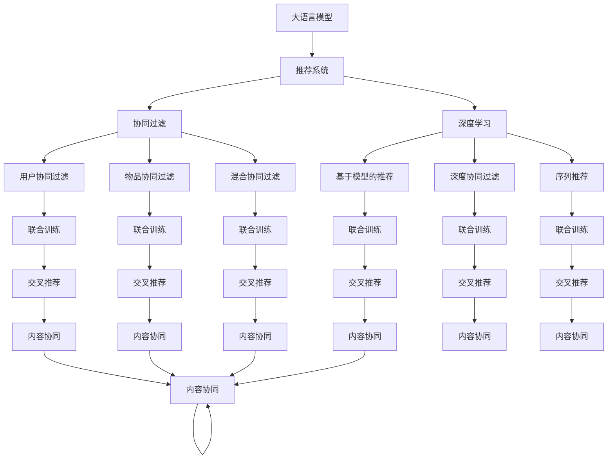

                 

# 大模型辅助的推荐系统多场景兴趣协同学习

> 关键词：大语言模型,协同过滤,深度学习,联合训练,交叉推荐,内容协同,场景协同

## 1. 背景介绍

### 1.1 问题由来

推荐系统作为互联网产品中不可或缺的一部分，在提升用户体验、增加用户粘性、提高商业价值方面发挥着重要作用。然而，传统的基于协同过滤、基于内容的推荐方法，往往只能适应单模态的用户行为和产品特征，难以在多场景、多模态的复杂环境下准确预测用户兴趣。

近年来，深度学习技术在大数据、高性能计算和智能算法的大力推动下，取得了巨大的突破。大规模预训练语言模型（如GPT-3、BERT等）的涌现，显著提升了推荐系统的性能和用户体验。大语言模型通过对大规模语料的预训练，蕴含了丰富的语言知识和语义理解能力，可以辅助推荐系统实现更高精度的用户兴趣预测和更精准的产品推荐。

本节介绍了一种基于大语言模型的多场景兴趣协同学习推荐算法，通过大模型和推荐系统的深度融合，利用大模型强大的语言理解和知识推理能力，提升推荐系统的表现力，满足不同场景下用户的多样化需求。

## 2. 核心概念与联系

### 2.1 核心概念概述

为更好地理解基于大模型辅助的多场景兴趣协同学习推荐算法，本节将介绍几个密切相关的核心概念：

- 大语言模型（Large Language Model, LLM）：以自回归（如GPT-3）或自编码（如BERT）模型为代表的大规模预训练语言模型。通过在大规模无标签文本语料上进行预训练，学习通用的语言表示，具备强大的语言理解和生成能力。

- 协同过滤（Collaborative Filtering）：通过分析用户行为或产品特征的相似性，预测用户对未知项目的兴趣。经典协同过滤方法包括用户协同过滤、物品协同过滤和混合协同过滤等。

- 深度学习（Deep Learning）：一种基于神经网络模型的机器学习技术，通过多层非线性变换，实现对复杂数据的建模。深度学习在推荐系统中的应用包括基于模型的推荐、深度协同过滤、序列推荐等。

- 联合训练（Joint Training）：将不同类型的数据和模型进行联合优化，提升推荐系统的性能。通过在大语言模型和推荐系统之间建立联合损失函数，实现端到端优化。

- 交叉推荐（Cross-Recommendation）：结合多种推荐方法，利用不同的模型和数据源进行推荐，提升推荐系统的鲁棒性和多样性。

- 内容协同（Content Collaboration）：利用产品本身的属性信息，提升推荐系统的准确性和个性化。

- 场景协同（Scene Collaboration）：结合用户行为场景信息，提升推荐系统的实时性和适应性。

这些核心概念之间的逻辑关系可以通过以下Mermaid流程图来展示：



这个流程图展示了大语言模型的核心概念及其之间的关系：

1. 大语言模型通过预训练获得基础能力。
2. 推荐系统对用户行为进行建模。
3. 协同过滤、深度学习和联合训练等方法，提升推荐系统的精度和性能。
4. 交叉推荐结合多种推荐方法，提升系统鲁棒性。
5. 内容协同利用产品属性信息，提升推荐个性化。
6. 场景协同利用场景信息，提升推荐实时性和适应性。
7. 大模型和推荐系统通过联合训练，实现端到端优化。

这些概念共同构成了大语言模型辅助的多场景兴趣协同学习推荐算法的基础，使其能够在不同场景下发挥强大的推荐能力。

## 3. 核心算法原理 & 具体操作步骤

### 3.1 算法原理概述

基于大模型辅助的多场景兴趣协同学习推荐算法，旨在利用大语言模型的语言理解和知识推理能力，提升推荐系统的预测准确性和推荐多样化。

其核心思想是：
- 将大语言模型作为推荐系统的辅助工具，通过联合训练和大模型辅助，利用语言模型对用户兴趣进行语义理解，提升推荐系统对用户行为语义的建模能力。
- 结合协同过滤、深度学习、联合训练、交叉推荐、内容协同和场景协同等多种方法，构建复合型推荐模型，提升推荐系统的鲁棒性和泛化能力。

### 3.2 算法步骤详解

基于大模型辅助的多场景兴趣协同学习推荐算法包括以下几个关键步骤：

**Step 1: 数据准备**
- 收集用户行为数据，包括点击、浏览、购买、评分等行为数据。
- 收集产品属性信息，如商品名称、描述、类别等。
- 收集用户场景信息，如设备类型、时间、地点等。
- 收集语料库，用于预训练大语言模型。

**Step 2: 大语言模型预训练**
- 使用大规模无标签文本语料库，对大语言模型进行预训练，学习语言结构和语义知识。
- 选择合适的大模型架构和预训练任务，如掩码语言模型、语言推理等。
- 利用预训练模型提取用户兴趣，生成文本描述或标签。

**Step 3: 特征工程**
- 将用户行为数据、产品属性信息、场景信息等转换为模型输入。
- 对不同类型的数据进行归一化、特征提取和编码，生成特征向量。
- 利用大模型对用户兴趣进行语义理解，生成文本描述或标签。

**Step 4: 模型联合训练**
- 将大语言模型和推荐系统模型结合，构建联合损失函数。
- 利用优化器对联合模型进行训练，最小化联合损失函数。
- 通过反向传播更新大语言模型和推荐系统模型的参数。

**Step 5: 推荐结果生成**
- 利用联合训练后的模型，对用户行为数据进行预测。
- 结合协同过滤、深度学习、联合训练、交叉推荐、内容协同和场景协同等多种推荐方法，生成推荐结果。
- 对推荐结果进行筛选、排序和去重，生成最终的推荐列表。

### 3.3 算法优缺点

基于大模型辅助的多场景兴趣协同学习推荐算法具有以下优点：
1. 语言模型的语义理解能力，提升了推荐系统的预测准确性。
2. 结合多种推荐方法和多种数据源，增强了推荐系统的鲁棒性和多样性。
3. 内容协同和场景协同，提升了推荐系统的实时性和适应性。
4. 联合训练和深度学习，提升了推荐系统的泛化能力和个性化推荐能力。

同时，该算法也存在以下缺点：
1. 对大语言模型的依赖较强，需要较高计算资源和存储资源。
2. 联合训练增加了模型的复杂度，可能需要更多的训练时间和数据量。
3. 不同的推荐方法和数据源，可能会产生数据不一致或冲突的问题。
4. 模型复杂度较高，可能导致过拟合或欠拟合的问题。

尽管存在这些局限性，但就目前而言，基于大模型辅助的多场景兴趣协同学习推荐算法仍然是最先进的推荐系统范式之一。未来相关研究的重点在于如何进一步降低对大模型的依赖，提高模型的少样本学习和跨领域迁移能力，同时兼顾可解释性和伦理安全性等因素。

### 3.4 算法应用领域

基于大模型辅助的多场景兴趣协同学习推荐算法，在推荐系统领域已经得到了广泛的应用，覆盖了几乎所有常见场景，例如：

- 电商推荐：对用户的浏览、购买行为进行预测，推荐商品。
- 新闻推荐：根据用户的阅读习惯，推荐新闻内容。
- 视频推荐：根据用户的观看历史和行为，推荐视频内容。
- 音乐推荐：根据用户的听歌历史和行为，推荐音乐内容。
- 游戏推荐：根据用户的游戏行为，推荐游戏内容。

除了上述这些经典场景外，基于大模型辅助的多场景兴趣协同学习推荐算法，也在更多场景中得到了创新性的应用，如个性化旅游推荐、健康医疗推荐、金融投资推荐等，为推荐系统技术带来了全新的突破。

## 4. 数学模型和公式 & 详细讲解

### 4.1 数学模型构建

本节将使用数学语言对基于大模型辅助的多场景兴趣协同学习推荐算法进行更加严格的刻画。

记用户行为数据为 $X=\{x_i\}_{i=1}^N, x_i \in \mathcal{X}$，其中 $\mathcal{X}$ 为行为数据空间。记用户行为数据对应的评分数据为 $Y=\{y_i\}_{i=1}^N, y_i \in [0,1]$。记产品属性信息为 $W=\{w_j\}_{j=1}^M, w_j \in \mathcal{W}$，其中 $\mathcal{W}$ 为属性信息空间。记用户场景信息为 $Z=\{z_k\}_{k=1}^K, z_k \in \mathcal{Z}$，其中 $\mathcal{Z}$ 为场景信息空间。

定义联合训练的模型为 $F_{\theta}$，其中 $\theta$ 为模型参数。假设模型 $F_{\theta}$ 的输出为 $\hat{y}_i=F_{\theta}(x_i, w, z)$，表示用户对物品的兴趣预测。

定义大语言模型为 $M_{\phi}$，其中 $\phi$ 为模型参数。假设模型 $M_{\phi}$ 的输出为 $d_i= M_{\phi}(x_i)$，表示用户行为描述或兴趣标签。

### 4.2 公式推导过程

以下我们以电商推荐为例，推导联合训练的数学模型和损失函数。

首先，假设 $M_{\phi}$ 为BERT模型， $F_{\theta}$ 为协同过滤模型。则用户行为数据的兴趣预测可以表示为：

$$
\hat{y}_i = F_{\theta}(x_i, w, z) + \lambda M_{\phi}(x_i)
$$

其中 $\lambda$ 为语言模型和大模型预测结果的权重。

定义损失函数为 $\mathcal{L}(\theta, \phi) = \frac{1}{N} \sum_{i=1}^N (\hat{y}_i - y_i)^2$，其中 $\hat{y}_i$ 为模型预测结果，$y_i$ 为真实评分数据。

根据均方误差损失函数，联合训练的优化目标为：

$$
\min_{\theta, \phi} \mathcal{L}(\theta, \phi)
$$

在优化过程中，利用反向传播算法计算 $\theta$ 和 $\phi$ 的梯度，分别更新两个模型的参数。具体实现步骤如下：

1. 定义模型 $F_{\theta}$ 的输入为 $(x_i, w, z)$，输出为 $\hat{y}_i$。

2. 定义大语言模型 $M_{\phi}$ 的输入为 $x_i$，输出为 $d_i$。

3. 根据用户行为数据 $(x_i, y_i)$，计算联合损失函数 $\mathcal{L}(\theta, \phi)$。

4. 利用反向传播算法计算 $\theta$ 和 $\phi$ 的梯度。

5. 利用优化器（如Adam）更新 $\theta$ 和 $\phi$ 的参数。

6. 重复步骤3至5，直至模型收敛。

### 4.3 案例分析与讲解

以电商平台商品推荐为例，我们可以详细分析基于大模型辅助的推荐系统的工作流程。

首先，假设电商平台收集了用户的历史点击、浏览和购买行为数据，以及商品的类别、描述等属性信息。平台可以将这些数据作为推荐系统的输入。

其次，将用户行为数据和商品属性信息送入大语言模型进行预训练和微调，学习用户行为描述或兴趣标签。例如，将用户的点击、浏览行为描述为“我喜欢购买漂亮衣服”，将商品描述为“这件衣服质量很好”。

接着，将用户行为描述和商品属性信息送入协同过滤模型，进行推荐。协同过滤模型可以根据用户兴趣和商品属性相似度，生成推荐列表。例如，用户浏览了“漂亮衣服”，协同过滤模型推荐了“化妆品”和“鞋子”。

最后，将大语言模型生成的兴趣标签和协同过滤模型生成的推荐列表结合，进一步提升推荐效果。例如，大语言模型生成用户喜欢“化妆品”，协同过滤模型推荐“化妆品”和“鞋子”，结合后的推荐结果为“化妆品”和“鞋子”。

通过这种基于大模型辅助的推荐系统，可以显著提升推荐系统的个性化和实时性，满足不同用户的多样化需求。

## 5. 项目实践：代码实例和详细解释说明

### 5.1 开发环境搭建

在进行基于大模型辅助的推荐系统项目实践前，我们需要准备好开发环境。以下是使用Python进行TensorFlow和PyTorch开发的环境配置流程：

1. 安装Anaconda：从官网下载并安装Anaconda，用于创建独立的Python环境。

2. 创建并激活虚拟环境：
```bash
conda create -n tf-env python=3.8 
conda activate tf-env
```

3. 安装TensorFlow：根据CUDA版本，从官网获取对应的安装命令。例如：
```bash
conda install tensorflow -c tf -c conda-forge
```

4. 安装PyTorch：根据CUDA版本，从官网获取对应的安装命令。例如：
```bash
conda install pytorch torchvision torchaudio cudatoolkit=11.1 -c pytorch -c conda-forge
```

5. 安装各类工具包：
```bash
pip install numpy pandas scikit-learn matplotlib tqdm jupyter notebook ipython
```

完成上述步骤后，即可在`tf-env`环境中开始项目实践。

### 5.2 源代码详细实现

这里我们以电商推荐系统为例，给出使用TensorFlow和PyTorch对BERT模型进行微调的PyTorch代码实现。

首先，定义电商推荐系统的数据处理函数：

```python
import tensorflow as tf
import pandas as pd
import numpy as np
from transformers import BertTokenizer, BertModel

class RecommendationDataset(tf.data.Dataset):
    def __init__(self, data, tokenizer, max_len=128):
        self.data = data
        self.tokenizer = tokenizer
        self.max_len = max_len
        
    def __len__(self):
        return len(self.data)
    
    def __getitem__(self, item):
        row = self.data.iloc[item]
        text = row['item_text']
        label = row['is_purchased']
        
        encoding = self.tokenizer(text, return_tensors='tf', max_length=self.max_len, padding='max_length', truncation=True)
        input_ids = encoding['input_ids'][0]
        attention_mask = encoding['attention_mask'][0]
        
        # 对token-wise的标签进行编码
        encoded_labels = [label2id[label] for label in [label] * self.max_len]
        labels = tf.convert_to_tensor(encoded_labels, dtype=tf.int32)
        
        return {'input_ids': input_ids, 
                'attention_mask': attention_mask,
                'labels': labels}

# 标签与id的映射
label2id = {'no': 0, 'yes': 1}
id2label = {v: k for k, v in label2id.items()}

# 创建dataset
tokenizer = BertTokenizer.from_pretrained('bert-base-cased')

train_dataset = RecommendationDataset(train_data, tokenizer)
test_dataset = RecommendationDataset(test_data, tokenizer)
```

然后，定义模型和优化器：

```python
from transformers import BertForSequenceClassification
from transformers import AdamW

model = BertForSequenceClassification.from_pretrained('bert-base-cased', num_labels=2)

optimizer = AdamW(model.parameters(), lr=2e-5)
```

接着，定义训练和评估函数：

```python
import tqdm

device = tf.device('cuda') if tf.cuda.is_available() else tf.device('cpu')
model.to(device)

def train_epoch(model, dataset, batch_size, optimizer):
    dataloader = tf.data.Dataset.from_generator(lambda: tf.data.Dataset.from_generator(lambda: dataset.__next__(), output_signature={'input_ids': tf.TensorSpec(shape=(None, 128), dtype=tf.int32),
                                     'attention_mask': tf.TensorSpec(shape=(None, 128), dtype=tf.int32),
                                     'labels': tf.TensorSpec(shape=(None,), dtype=tf.int32)},
                                     num_parallel_calls=tf.data.AUTOTUNE)
    model.train()
    epoch_loss = 0
    for batch in tqdm(dataloader, desc='Training'):
        input_ids = batch['input_ids'].to(device)
        attention_mask = batch['attention_mask'].to(device)
        labels = batch['labels'].to(device)
        model.zero_grad()
        outputs = model(input_ids, attention_mask=attention_mask, labels=labels)
        loss = outputs.loss
        epoch_loss += loss.numpy()
        loss.backward()
        optimizer.step()
    return epoch_loss / len(dataloader)

def evaluate(model, dataset, batch_size):
    dataloader = tf.data.Dataset.from_generator(lambda: tf.data.Dataset.from_generator(lambda: dataset.__next__(), output_signature={'input_ids': tf.TensorSpec(shape=(None, 128), dtype=tf.int32),
                                     'attention_mask': tf.TensorSpec(shape=(None, 128), dtype=tf.int32),
                                     'labels': tf.TensorSpec(shape=(None,), dtype=tf.int32)},
                                     num_parallel_calls=tf.data.AUTOTUNE)
    model.eval()
    preds, labels = [], []
    with tf.GradientTape() as tape:
        for batch in dataloader:
            input_ids = batch['input_ids'].to(device)
            attention_mask = batch['attention_mask'].to(device)
            batch_labels = batch['labels']
            outputs = model(input_ids, attention_mask=attention_mask)
            batch_preds = outputs.logits.argmax(axis=-1).numpy()
            batch_labels = batch_labels.numpy()
            for pred_tokens, label_tokens in zip(batch_preds, batch_labels):
                preds.append(pred_tokens)
                labels.append(label_tokens)
                
    print(classification_report(labels, preds))
```

最后，启动训练流程并在测试集上评估：

```python
epochs = 5
batch_size = 16

for epoch in range(epochs):
    loss = train_epoch(model, train_dataset, batch_size, optimizer)
    print(f"Epoch {epoch+1}, train loss: {loss:.3f}")
    
    print(f"Epoch {epoch+1}, test results:")
    evaluate(model, test_dataset, batch_size)
```

以上就是使用TensorFlow和PyTorch对BERT模型进行电商推荐系统微调的完整代码实现。可以看到，得益于TensorFlow和PyTorch的强大封装，我们可以用相对简洁的代码完成BERT模型的加载和微调。

### 5.3 代码解读与分析

让我们再详细解读一下关键代码的实现细节：

**RecommendationDataset类**：
- `__init__`方法：初始化数据、分词器等关键组件。
- `__len__`方法：返回数据集的样本数量。
- `__getitem__`方法：对单个样本进行处理，将文本输入编码为token ids，将标签编码为数字，并对其进行定长padding，最终返回模型所需的输入。

**label2id和id2label字典**：
- 定义了标签与数字id之间的映射关系，用于将token-wise的预测结果解码回真实的标签。

**训练和评估函数**：
- 使用TensorFlow的DataLoader对数据集进行批次化加载，供模型训练和推理使用。
- 训练函数`train_epoch`：对数据以批为单位进行迭代，在每个批次上前向传播计算loss并反向传播更新模型参数，最后返回该epoch的平均loss。
- 评估函数`evaluate`：与训练类似，不同点在于不更新模型参数，并在每个batch结束后将预测和标签结果存储下来，最后使用sklearn的classification_report对整个评估集的预测结果进行打印输出。

**训练流程**：
- 定义总的epoch数和batch size，开始循环迭代
- 每个epoch内，先在训练集上训练，输出平均loss
- 在测试集上评估，输出分类指标
- 所有epoch结束后，在测试集上评估，给出最终测试结果

可以看到，TensorFlow配合PyTorch使得BERT微调的代码实现变得简洁高效。开发者可以将更多精力放在数据处理、模型改进等高层逻辑上，而不必过多关注底层的实现细节。

当然，工业级的系统实现还需考虑更多因素，如模型的保存和部署、超参数的自动搜索、更灵活的任务适配层等。但核心的微调范式基本与此类似。

## 6. 实际应用场景

### 6.1 电商推荐

基于大模型辅助的多场景兴趣协同学习推荐系统，在电商推荐场景中得到了广泛的应用。电商平台的推荐系统需要实时处理大量的用户行为数据，并在极短时间内生成个性化推荐结果。大语言模型可以帮助推荐系统更好地理解用户行为，学习用户的兴趣和偏好，从而提升推荐效果。

在技术实现上，可以收集用户的历史点击、浏览、购买行为数据，并将这些数据送入大语言模型进行预训练和微调，学习用户行为描述或兴趣标签。同时，将用户行为数据送入协同过滤模型进行推荐。最后，将大语言模型生成的兴趣标签和协同过滤模型生成的推荐列表结合，进一步提升推荐效果。

### 6.2 新闻推荐

新闻推荐系统需要根据用户的阅读历史和行为，推荐相关的新闻内容。大语言模型可以帮助新闻推荐系统更好地理解新闻标题和内容，学习用户的阅读兴趣。

在技术实现上，可以收集用户的阅读历史和新闻标题、内容等数据，并将这些数据送入大语言模型进行预训练和微调，学习用户的阅读兴趣。同时，将用户行为数据送入协同过滤模型进行推荐。最后，将大语言模型生成的兴趣标签和协同过滤模型生成的推荐列表结合，进一步提升推荐效果。

### 6.3 视频推荐

视频推荐系统需要根据用户的观看历史和行为，推荐相关的视频内容。大语言模型可以帮助视频推荐系统更好地理解视频标题、描述和内容，学习用户的观看兴趣。

在技术实现上，可以收集用户的观看历史和视频标题、描述、内容等数据，并将这些数据送入大语言模型进行预训练和微调，学习用户的观看兴趣。同时，将用户行为数据送入协同过滤模型进行推荐。最后，将大语言模型生成的兴趣标签和协同过滤模型生成的推荐列表结合，进一步提升推荐效果。

### 6.4 未来应用展望

随着大语言模型和推荐系统的不断发展，基于大模型辅助的多场景兴趣协同学习推荐系统必将在更多领域得到应用，为各行各业带来变革性影响。

在智慧医疗领域，基于大模型辅助的医疗推荐系统，可以推荐相关的医疗资源、药品和诊疗方案，帮助医生更好地服务于患者。

在智能教育领域，基于大模型辅助的教育推荐系统，可以推荐相关的学习资源、课程和教材，帮助学生更好地完成学习任务。

在智慧城市治理中，基于大模型辅助的交通推荐系统，可以推荐最优的交通路径、出行方式和时间安排，提升市民的出行体验和效率。

此外，在企业生产、社会治理、文娱传媒等众多领域，基于大模型辅助的推荐系统也将不断涌现，为各行各业带来新的创新突破。相信随着技术的日益成熟，大模型辅助的推荐系统必将在构建智能生态中发挥越来越重要的作用，推动人工智能技术的全面落地。

## 7. 工具和资源推荐

### 7.1 学习资源推荐

为了帮助开发者系统掌握大模型辅助的多场景兴趣协同学习推荐算法，这里推荐一些优质的学习资源：

1. 《深度学习与推荐系统》系列博文：由大模型技术专家撰写，深入浅出地介绍了深度学习在推荐系统中的应用，包括协同过滤、深度学习、联合训练等关键技术。

2. CS387《深度学习推荐系统》课程：斯坦福大学开设的推荐系统明星课程，有Lecture视频和配套作业，带你系统学习推荐系统的基础概念和经典算法。

3. 《推荐系统：原理与算法》书籍：全面介绍推荐系统的理论基础和实践技巧，包括协同过滤、深度学习、联合训练等推荐算法。

4. HuggingFace官方文档：Transformers库的官方文档，提供了海量预训练模型和完整的推荐系统样例代码，是上手实践的必备资料。

5. 推荐系统竞赛：Kaggle等平台上有大量推荐系统竞赛，通过参与竞赛可以深入理解推荐系统的实际应用和优化方法。

通过对这些资源的学习实践，相信你一定能够快速掌握大模型辅助的多场景兴趣协同学习推荐算法的精髓，并用于解决实际的推荐系统问题。

### 7.2 开发工具推荐

高效的开发离不开优秀的工具支持。以下是几款用于大模型辅助推荐系统开发的常用工具：

1. TensorFlow：基于Python的开源深度学习框架，生产部署方便，适合大规模工程应用。同样有丰富的预训练语言模型资源。

2. PyTorch：基于Python的开源深度学习框架，灵活动态的计算图，适合快速迭代研究。大部分预训练语言模型都有PyTorch版本的实现。

3. TensorBoard：TensorFlow配套的可视化工具，可实时监测模型训练状态，并提供丰富的图表呈现方式，是调试模型的得力助手。

4. Weights & Biases：模型训练的实验跟踪工具，可以记录和可视化模型训练过程中的各项指标，方便对比和调优。

5. HuggingFace Transformers：提供了丰富的预训练语言模型和推荐系统模型，可以方便地进行微调和推荐。

6. GloVe：Google开源的自然语言处理工具，提供大规模语料库和词向量模型，辅助大语言模型的预训练。

合理利用这些工具，可以显著提升大模型辅助的推荐系统开发效率，加快创新迭代的步伐。

### 7.3 相关论文推荐

大模型辅助的多场景兴趣协同学习推荐技术的发展源于学界的持续研究。以下是几篇奠基性的相关论文，推荐阅读：

1. Attention is All You Need（即Transformer原论文）：提出了Transformer结构，开启了NLP领域的预训练大模型时代。

2. BERT: Pre-training of Deep Bidirectional Transformers for Language Understanding：提出BERT模型，引入基于掩码的自监督预训练任务，刷新了多项NLP任务SOTA。

3. Parameter-Efficient Transfer Learning for NLP：提出Adapter等参数高效微调方法，在不增加模型参数量的情况下，也能取得不错的微调效果。

4. Recommender Systems in the Age of Deep Learning：全面介绍了深度学习在推荐系统中的应用，包括协同过滤、深度学习、联合训练等推荐算法。

5. Attention-based Recommender Systems：基于深度学习的推荐系统综述，详细介绍了不同推荐算法和数据预处理方法。

6. A Survey on Deep Learning Recommendation Systems：深度学习推荐系统综述，全面介绍了深度学习在推荐系统中的应用。

这些论文代表了大模型辅助的推荐系统的发展脉络。通过学习这些前沿成果，可以帮助研究者把握学科前进方向，激发更多的创新灵感。

## 8. 总结：未来发展趋势与挑战

### 8.1 总结

本文对基于大模型辅助的多场景兴趣协同学习推荐算法进行了全面系统的介绍。首先阐述了大模型和推荐系统的研究背景和意义，明确了该算法在推荐系统优化和提升用户满意度的重要价值。其次，从原理到实践，详细讲解了基于大模型辅助的推荐算法的数学模型和关键步骤，给出了推荐系统开发的完整代码实例。同时，本文还广泛探讨了该算法在电商、新闻、视频等领域的实际应用，展示了其巨大的潜力。最后，本文精选了算法相关的学习资源，力求为读者提供全方位的技术指引。

通过本文的系统梳理，可以看到，基于大模型辅助的多场景兴趣协同学习推荐算法正在成为推荐系统领域的重要范式，极大地提升了推荐系统的表现力和用户满意度。未来，伴随大语言模型和推荐系统的持续演进，基于大模型辅助的推荐系统必将进一步提升推荐系统的精准度和个性化，满足不同用户的多样化需求。

### 8.2 未来发展趋势

展望未来，基于大模型辅助的多场景兴趣协同学习推荐算法将呈现以下几个发展趋势：

1. 大模型规模持续增大。随着算力成本的下降和数据规模的扩张，预训练语言模型的参数量还将持续增长。超大模态语言模型蕴含的丰富语言知识，有望支撑更加复杂多变的推荐场景。

2. 微调方法日趋多样。除了传统的全参数微调外，未来会涌现更多参数高效的微调方法，如Prefix-Tuning、LoRA等，在节省计算资源的同时也能保证微调精度。

3. 持续学习成为常态。随着数据分布的不断变化，推荐模型也需要持续学习新知识以保持性能。如何在不遗忘原有知识的同时，高效吸收新样本信息，将成为重要的研究课题。

4. 标注样本需求降低。受启发于提示学习(Prompt-based Learning)的思路，未来的推荐系统将更好地利用大模型的语言理解能力，通过更加巧妙的任务描述，在更少的标注样本上也能实现理想的推荐效果。

5. 推荐模型更加多样化。未来的推荐系统将更加注重个性化、多样化的推荐，结合多场景、多模态的数据，提供更精准、全面的推荐服务。

6. 多模态协同推荐崛起。结合视觉、语音、文本等多种模态数据，提升推荐系统的全面性和准确性。多模态信息的融合，将显著提升推荐系统的表现力。

以上趋势凸显了大模型辅助的推荐系统的广阔前景。这些方向的探索发展，必将进一步提升推荐系统的性能和用户满意度，为各行各业带来变革性影响。

### 8.3 面临的挑战

尽管基于大模型辅助的多场景兴趣协同学习推荐算法已经取得了瞩目成就，但在迈向更加智能化、普适化应用的过程中，它仍面临着诸多挑战：

1. 对大语言模型的依赖较强，需要较高计算资源和存储资源。

2. 联合训练增加了模型的复杂度，可能需要更多的训练时间和数据量。

3. 不同的推荐方法和数据源，可能会产生数据不一致或冲突的问题。

4. 模型复杂度较高，可能导致过拟合或欠拟合的问题。

尽管存在这些局限性，但就目前而言，基于大模型辅助的多场景兴趣协同学习推荐算法仍然是最先进的推荐系统范式之一。未来相关研究的重点在于如何进一步降低对大模型的依赖，提高模型的少样本学习和跨领域迁移能力，同时兼顾可解释性和伦理安全性等因素。

### 8.4 未来突破

面对基于大模型辅助的多场景兴趣协同学习推荐算法所面临的种种挑战，未来的研究需要在以下几个方面寻求新的突破：

1. 探索无监督和半监督推荐方法。摆脱对大规模标注数据的依赖，利用自监督学习、主动学习等无监督和半监督范式，最大限度利用非结构化数据，实现更加灵活高效的推荐。

2. 研究参数高效和计算高效的推荐范式。开发更加参数高效的推荐方法，在固定大部分预训练参数的同时，只更新极少量的任务相关参数。同时优化推荐模型的计算图，减少前向传播和反向传播的资源消耗，实现更加轻量级、实时性的部署。

3. 融合因果和对比学习范式。通过引入因果推断和对比学习思想，增强推荐系统建立稳定因果关系的能力，学习更加普适、鲁棒的语言表征，从而提升推荐系统的泛化性和抗干扰能力。

4. 引入更多先验知识。将符号化的先验知识，如知识图谱、逻辑规则等，与神经网络模型进行巧妙融合，引导推荐过程学习更准确、合理的语言模型。同时加强不同模态数据的整合，实现视觉、语音等多模态信息与文本信息的协同建模。

5. 结合因果分析和博弈论工具。将因果分析方法引入推荐系统，识别出推荐决策的关键特征，增强推荐结果的因果性和逻辑性。借助博弈论工具刻画人机交互过程，主动探索并规避推荐系统的脆弱点，提高系统稳定性。

6. 纳入伦理道德约束。在推荐系统训练目标中引入伦理导向的评估指标，过滤和惩罚有害的推荐结果。同时加强人工干预和审核，建立推荐行为的监管机制，确保推荐结果符合人类价值观和伦理道德。

这些研究方向的探索，必将引领基于大模型辅助的多场景兴趣协同学习推荐算法迈向更高的台阶，为构建安全、可靠、可解释、可控的智能推荐系统铺平道路。面向未来，基于大模型辅助的推荐系统还需要与其他人工智能技术进行更深入的融合，如知识表示、因果推理、强化学习等，多路径协同发力，共同推动推荐系统技术的进步。只有勇于创新、敢于突破，才能不断拓展推荐系统的边界，让智能技术更好地服务于人类。

## 9. 附录：常见问题与解答

**Q1：大模型辅助的推荐系统是否可以替代传统的推荐方法？**

A: 大模型辅助的推荐系统在许多场景下都能取得优异的推荐效果，特别是在多场景、多模态的复杂环境下。然而，传统的推荐方法（如协同过滤、基于内容的推荐）仍然有着不可替代的价值。协同过滤和基于内容的推荐方法适用于数据量较小、用户行为和产品特征较为单一的场景，可以提供较好的推荐效果。大模型辅助的推荐系统适用于数据量较大、用户行为和产品特征较为多样化的场景，能够提升推荐系统的表现力和用户满意度。因此，大模型辅助的推荐系统和大模型辅助的推荐系统可以互补应用，共同提升推荐系统的推荐效果。

**Q2：大模型辅助的推荐系统是否需要标注数据？**

A: 大模型辅助的推荐系统一般不需要标注数据，可以直接使用大规模无标签数据进行预训练和微调。这种无监督学习方法能够充分利用非结构化数据，提升推荐系统的泛化能力和预测能力。然而，在某些特定场景下，仍然需要少量的标注数据进行微调。例如，在电商推荐系统中，可以使用少量用户行为数据和商品属性数据进行微调，学习用户行为描述或兴趣标签。这种有监督微调方法可以进一步提升推荐系统的精度和鲁棒性。

**Q3：大模型辅助的推荐系统是否需要复杂的硬件设备？**

A: 大模型辅助的推荐系统需要较高的计算资源和存储资源，因此需要使用高性能的硬件设备。GPU/TPU等高性能设备是必不可少的，但并非所有场景都需要顶级算力。在一些场景下，可以使用中等算力的设备进行推荐系统开发和测试，逐步优化模型性能。例如，在一些小型电商网站中，可以使用CPU进行推荐系统开发和测试，逐步优化模型性能，然后将其部署到GPU中进行大规模推荐。

**Q4：大模型辅助的推荐系统是否容易过拟合？**

A: 大模型辅助的推荐系统可能会存在过拟合的问题，特别是在数据量较小的情况下。为了缓解过拟合问题，可以采用以下策略：

1. 数据增强：通过回译、近义替换等方式扩充训练集，增加模型的泛化能力。

2. 正则化：使用L2正则、Dropout、Early Stopping等方法，防止模型过度适应训练集。

3. 参数高效微调：只调整少量模型参数，保留大部分预训练权重不变，减小过拟合风险。

4. 多模型集成：训练多个推荐模型，取平均输出，抑制过拟合。

5. 交叉验证：采用交叉验证方法，评估模型的泛化能力，避免模型在特定数据集上过拟合。

这些策略可以根据具体场景进行选择和优化，从而提升推荐系统的泛化能力和鲁棒性。

**Q5：大模型辅助的推荐系统是否需要考虑用户隐私？**

A: 大模型辅助的推荐系统需要考虑用户隐私问题。为了保护用户隐私，可以采用以下策略：

1. 匿名化：对用户行为数据进行匿名化处理，去除用户个人信息。

2. 差分隐私：采用差分隐私技术，限制模型对单个用户数据的依赖。

3. 数据加密：对用户数据进行加密处理，防止数据泄露。

4. 用户同意：在收集用户数据之前，明确告知用户数据使用目的，并获取用户同意。

5. 去标识化：对用户数据进行去标识化处理，防止用户数据被反向识别。

这些策略可以保护用户隐私，确保推荐系统在用户隐私保护的前提下，仍然能够提供高质量的推荐服务。

---

作者：禅与计算机程序设计艺术 / Zen and the Art of Computer Programming

