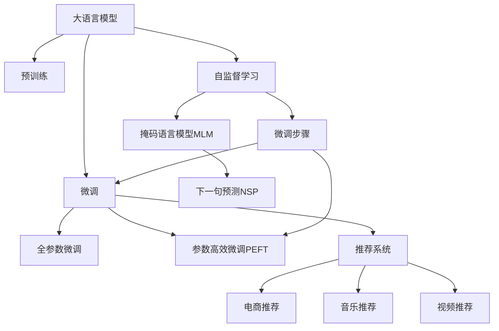

                 

# 大模型驱动的推荐系统多场景适配

## 1. 背景介绍

随着互联网和数字技术的飞速发展，推荐系统已经成为各大电商、媒体和社交平台的核心竞争力之一。通过精准预测用户兴趣，推荐系统不仅显著提升了用户体验，还带来了巨大的商业价值。然而，由于推荐场景的复杂性和多样性，构建一个覆盖广泛、性能卓越的推荐系统，面临诸多挑战。

大语言模型的兴起，为推荐系统带来了新的突破方向。以BERT、GPT等预训练大模型为基础，结合微调技术，推荐系统可以在不同的业务场景中灵活应用，实现多场景适配，显著提升推荐效果。大模型驱动的推荐系统不仅具备强大的表示学习能力和泛化能力，还能适应多样的推荐场景，应对复杂的用户需求。

## 2. 核心概念与联系

### 2.1 核心概念概述

为了更好地理解大模型驱动的推荐系统多场景适配方法，本节将介绍几个密切相关的核心概念：

- **大语言模型（Large Language Model, LLM）**：以BERT、GPT等自回归模型为代表的预训练语言模型。通过在海量无标签文本数据上预训练，学习到丰富的语言知识和语义表示，具备强大的文本生成和理解能力。

- **推荐系统（Recommendation System）**：利用用户行为数据，预测用户可能感兴趣的商品、内容或服务，并进行推荐。常见的推荐方式包括协同过滤、内容推荐、混合推荐等。

- **微调（Fine-Tuning）**：指在预训练模型的基础上，通过有监督学习优化模型在特定任务上的性能。通常只需要调整顶层分类器或解码器，并以较小的学习率更新全部或部分模型参数。

- **自监督学习（Self-Supervised Learning）**：利用无标签数据进行训练，学习到数据的结构和规律。常见的自监督任务包括掩码语言模型（Masked Language Modeling, MLM）、下一句预测（Next Sentence Prediction, NSP）等。

- **多场景适配（Multi-Scenario Adaptation）**：根据不同业务场景，对大语言模型进行微调，使其能够适应多种推荐任务和应用场景，如电商推荐、音乐推荐、视频推荐等。

这些核心概念之间的逻辑关系可以通过以下Mermaid流程图来展示：



这个流程图展示了大语言模型在推荐系统中的应用流程：

1. 大语言模型通过预训练获得基础能力。
2. 微调优化模型在特定推荐任务上的性能，可以采用全参数微调或参数高效微调（PEFT）。
3. 通过自监督学习，大模型可以学习到语言的表示规律。
4. 常见的自监督任务包括掩码语言模型和下一句预测。
5. 微调过程可以适配不同的推荐场景，如电商推荐、音乐推荐、视频推荐等。

这些概念共同构成了大语言模型驱动推荐系统的学习框架，使其能够在各种场景下发挥强大的推荐能力。

## 3. 核心算法原理 & 具体操作步骤

### 3.1 算法原理概述

大语言模型驱动的推荐系统，本质上是一种基于预训练模型和多场景适配的推荐算法。其核心思想是：

1. 通过大规模无标签文本数据预训练，学习到语言的通用表示。
2. 在推荐任务上，将预训练模型视作“特征提取器”，通过有监督学习微调，适应推荐场景的特定需求。
3. 利用多场景适配，将微调后的模型应用于不同的推荐任务和应用场景，提升推荐效果。

具体来说，推荐系统通过以下步骤实现：

1. 数据预处理：收集用户的浏览历史、购买记录、评分反馈等数据，作为训练集。
2. 大语言模型微调：在推荐任务数据集上，对预训练模型进行微调，使其能够预测用户对不同商品的兴趣评分。
3. 推荐排序：利用微调后的模型预测用户对各商品的兴趣评分，结合其他特征，进行排序推荐。

### 3.2 算法步骤详解

以电商推荐系统为例，以下是基于大语言模型微调的推荐系统的主要操作步骤：

#### Step 1: 数据预处理
- 收集用户历史浏览记录、购买记录、评分反馈等数据，构建推荐数据集。
- 对用户数据进行清洗和特征工程，提取有用的用户特征和商品特征。

#### Step 2: 大语言模型微调
- 选择适合的预训练模型，如BERT、GPT等。
- 在推荐数据集上，使用有监督学习微调模型，使其能够预测用户对商品的兴趣评分。
- 设置合适的超参数，如学习率、批量大小、迭代轮数等。

#### Step 3: 推荐排序
- 对微调后的模型进行评估和优化，确保其在不同推荐场景中的性能表现。
- 将模型预测的用户兴趣评分与其他特征（如商品类别、价格、品牌等）结合，进行排序推荐。
- 部署微调后的模型到推荐系统中，实时计算用户兴趣，并返回推荐列表。

#### Step 4: 反馈迭代
- 收集用户对推荐结果的反馈，如点击、购买、评分等。
- 利用用户反馈进行模型的在线更新和微调，进一步优化推荐效果。
- 持续监控推荐系统的性能指标，如点击率、转化率、用户满意度等。

### 3.3 算法优缺点

大语言模型驱动的推荐系统具有以下优点：

1. 强大的表示学习能力：大语言模型通过预训练学习到丰富的语言表示，能够捕捉到复杂的用户需求和商品特征。
2. 跨领域适应能力：大语言模型在多个推荐场景中表现出良好的泛化能力，能够适应不同的业务需求。
3. 高效的多场景适配：通过微调，大语言模型能够快速适配新的推荐任务，提升推荐效果。
4. 较好的用户个性化：微调后的模型能够学习到用户的个性化偏好，提供更精准的推荐。

然而，该方法也存在一定的局限性：

1. 对标注数据的需求：微调过程需要大量的标注数据，标注成本较高。
2. 模型规模较大：大语言模型的参数量较大，对计算资源和存储要求较高。
3. 数据隐私问题：微调过程中需要收集和处理用户数据，隐私保护问题需特别注意。
4. 对抗样本风险：微调后的模型可能对对抗样本敏感，导致推荐结果出错。
5. 解释性不足：大模型黑盒特性，难以解释推荐结果背后的逻辑和原因。

尽管存在这些局限性，但大语言模型驱动的推荐系统凭借其强大的表示能力和多场景适配能力，已经成为推荐系统研究的热点和实践方向。未来相关研究将进一步优化数据处理、模型微调和推荐排序等关键环节，提升推荐系统的性能和用户体验。

### 3.4 算法应用领域

基于大语言模型微调的推荐系统已经在多个领域得到了广泛应用，如电商推荐、音乐推荐、视频推荐、社交推荐等。以下是几个典型应用场景：

- **电商推荐**：在电商平台上，通过微调大语言模型，实时预测用户对商品感兴趣的程度，进行个性化推荐。
- **音乐推荐**：在音乐平台上，利用微调后的模型，为用户推荐符合其音乐品味的歌曲。
- **视频推荐**：在视频平台上，通过微调大语言模型，为用户推荐感兴趣的影片和视频内容。
- **社交推荐**：在社交平台上，利用微调模型，为用户推荐其感兴趣的朋友和内容。

除了这些传统应用场景，大语言模型驱动的推荐系统还在智慧城市、医疗健康、金融服务等新兴领域得到了创新性应用，为这些行业的智能化升级提供了新的技术手段。

## 4. 数学模型和公式 & 详细讲解 & 举例说明

### 4.1 数学模型构建

假设推荐系统中的商品总数为 $N$，用户总数为 $M$。用户的浏览历史和评分数据构成推荐数据集 $D$。每个用户 $i$ 的历史数据 $x_i$ 可以表示为一个向量，包含其浏览过的商品 $S_i$ 和评分 $R_i$。每个商品 $j$ 的特征 $f_j$ 也可以表示为一个向量，包含其类别、价格、品牌等信息。

设微调后的模型为 $M_{\theta}$，其输入为用户的浏览历史 $x_i$，输出为用户对商品 $j$ 的兴趣评分 $y_{i,j}$。模型 $M_{\theta}$ 可以表示为一个神经网络，其中 $\theta$ 为模型参数。

推荐系统的目标是最小化用户与推荐系统之间的预测误差，即：

$$
\mathcal{L}(\theta) = \frac{1}{N} \sum_{i=1}^M \sum_{j=1}^N (y_{i,j} - M_{\theta}(x_i, f_j))^2
$$

其中 $y_{i,j}$ 为实际评分，$M_{\theta}(x_i, f_j)$ 为模型预测的评分。

### 4.2 公式推导过程

为了方便推导，我们引入假设函数 $h_{\theta}(x_i, f_j)$，表示模型 $M_{\theta}$ 在输入 $x_i$ 和 $f_j$ 上的输出：

$$
h_{\theta}(x_i, f_j) = M_{\theta}(x_i, f_j)
$$

推荐系统的损失函数可以表示为：

$$
\mathcal{L}(\theta) = \frac{1}{N} \sum_{i=1}^M \sum_{j=1}^N (y_{i,j} - h_{\theta}(x_i, f_j))^2
$$

通过对损失函数求导，可以得到模型参数 $\theta$ 的更新公式：

$$
\theta \leftarrow \theta - \eta \nabla_{\theta}\mathcal{L}(\theta)
$$

其中 $\eta$ 为学习率，$\nabla_{\theta}\mathcal{L}(\theta)$ 为损失函数对参数 $\theta$ 的梯度，可以通过反向传播算法计算。

### 4.3 案例分析与讲解

为了更好地理解大语言模型微调推荐系统的数学模型，我们可以以电商推荐为例，进行详细讲解。

假设用户 $i$ 的历史浏览记录为 $x_i$，商品 $j$ 的特征向量为 $f_j$，推荐系统预测用户对商品 $j$ 的评分 $y_{i,j}$。

首先，我们收集用户的历史数据 $D$，将其划分为训练集和测试集。在训练集上，我们通过微调大语言模型 $M_{\theta}$，使其能够预测用户对商品 $j$ 的评分 $y_{i,j}$。

具体步骤如下：

1. 数据预处理：收集用户的历史浏览记录 $x_i$ 和商品特征向量 $f_j$，构建推荐数据集 $D$。
2. 大语言模型微调：在推荐数据集 $D$ 上，使用有监督学习微调模型 $M_{\theta}$，使其能够预测用户对商品 $j$ 的评分 $y_{i,j}$。
3. 模型评估：在测试集上评估微调后的模型，计算预测评分与实际评分的误差。
4. 推荐排序：将模型预测评分与其他特征结合，进行排序推荐。

通过以上步骤，微调后的模型能够实时预测用户对商品的评分，从而进行个性化推荐。

## 5. 项目实践：代码实例和详细解释说明

### 5.1 开发环境搭建

在进行推荐系统微调实践前，我们需要准备好开发环境。以下是使用Python进行PyTorch开发的环境配置流程：

1. 安装Anaconda：从官网下载并安装Anaconda，用于创建独立的Python环境。

2. 创建并激活虚拟环境：
```bash
conda create -n pytorch-env python=3.8 
conda activate pytorch-env
```

3. 安装PyTorch：根据CUDA版本，从官网获取对应的安装命令。例如：
```bash
conda install pytorch torchvision torchaudio cudatoolkit=11.1 -c pytorch -c conda-forge
```

4. 安装Transformers库：
```bash
pip install transformers
```

5. 安装各类工具包：
```bash
pip install numpy pandas scikit-learn matplotlib tqdm jupyter notebook ipython
```

完成上述步骤后，即可在`pytorch-env`环境中开始推荐系统微调实践。

### 5.2 源代码详细实现

这里我们以电商推荐系统为例，给出使用Transformers库对BERT模型进行推荐微调的PyTorch代码实现。

首先，定义推荐数据集和标签：

```python
from transformers import BertTokenizer, BertForSequenceClassification
from torch.utils.data import Dataset
import torch

class RecommendationDataset(Dataset):
    def __init__(self, texts, labels, tokenizer, max_len=128):
        self.texts = texts
        self.labels = labels
        self.tokenizer = tokenizer
        self.max_len = max_len
        
    def __len__(self):
        return len(self.texts)
    
    def __getitem__(self, item):
        text = self.texts[item]
        label = self.labels[item]
        
        encoding = self.tokenizer(text, return_tensors='pt', max_length=self.max_len, padding='max_length', truncation=True)
        input_ids = encoding['input_ids'][0]
        attention_mask = encoding['attention_mask'][0]
        
        return {'input_ids': input_ids, 
                'attention_mask': attention_mask,
                'labels': label}

# 创建dataset
tokenizer = BertTokenizer.from_pretrained('bert-base-cased')

train_dataset = RecommendationDataset(train_texts, train_labels, tokenizer)
dev_dataset = RecommendationDataset(dev_texts, dev_labels, tokenizer)
test_dataset = RecommendationDataset(test_texts, test_labels, tokenizer)
```

然后，定义模型和优化器：

```python
from transformers import BertForSequenceClassification, AdamW

model = BertForSequenceClassification.from_pretrained('bert-base-cased', num_labels=2)

optimizer = AdamW(model.parameters(), lr=2e-5)
```

接着，定义训练和评估函数：

```python
from torch.utils.data import DataLoader
from tqdm import tqdm
from sklearn.metrics import accuracy_score

device = torch.device('cuda') if torch.cuda.is_available() else torch.device('cpu')
model.to(device)

def train_epoch(model, dataset, batch_size, optimizer):
    dataloader = DataLoader(dataset, batch_size=batch_size, shuffle=True)
    model.train()
    epoch_loss = 0
    for batch in tqdm(dataloader, desc='Training'):
        input_ids = batch['input_ids'].to(device)
        attention_mask = batch['attention_mask'].to(device)
        labels = batch['labels'].to(device)
        model.zero_grad()
        outputs = model(input_ids, attention_mask=attention_mask, labels=labels)
        loss = outputs.loss
        epoch_loss += loss.item()
        loss.backward()
        optimizer.step()
    return epoch_loss / len(dataloader)

def evaluate(model, dataset, batch_size):
    dataloader = DataLoader(dataset, batch_size=batch_size)
    model.eval()
    preds, labels = [], []
    with torch.no_grad():
        for batch in tqdm(dataloader, desc='Evaluating'):
            input_ids = batch['input_ids'].to(device)
            attention_mask = batch['attention_mask'].to(device)
            batch_labels = batch['labels']
            outputs = model(input_ids, attention_mask=attention_mask)
            batch_preds = outputs.logits.argmax(dim=2).to('cpu').tolist()
            batch_labels = batch_labels.to('cpu').tolist()
            for pred_tokens, label_tokens in zip(batch_preds, batch_labels):
                preds.append(pred_tokens)
                labels.append(label_tokens)
                
    print('Accuracy:', accuracy_score(labels, preds))
```

最后，启动训练流程并在测试集上评估：

```python
epochs = 5
batch_size = 16

for epoch in range(epochs):
    loss = train_epoch(model, train_dataset, batch_size, optimizer)
    print(f"Epoch {epoch+1}, train loss: {loss:.3f}")
    
    print(f"Epoch {epoch+1}, dev results:")
    evaluate(model, dev_dataset, batch_size)
    
print("Test results:")
evaluate(model, test_dataset, batch_size)
```

以上就是使用PyTorch对BERT进行电商推荐系统微调的完整代码实现。可以看到，得益于Transformers库的强大封装，我们可以用相对简洁的代码完成BERT模型的加载和微调。

### 5.3 代码解读与分析

让我们再详细解读一下关键代码的实现细节：

**RecommendationDataset类**：
- `__init__`方法：初始化训练集、验证集、测试集的文本、标签、分词器等关键组件。
- `__len__`方法：返回数据集的样本数量。
- `__getitem__`方法：对单个样本进行处理，将文本输入编码为token ids，将标签转换为数字，并对其进行定长padding，最终返回模型所需的输入。

**模型和优化器定义**：
- 选择BERT模型作为初始化参数，设置合适的超参数，如学习率、优化器等。

**训练和评估函数**：
- 使用PyTorch的DataLoader对数据集进行批次化加载，供模型训练和推理使用。
- 训练函数`train_epoch`：对数据以批为单位进行迭代，在每个批次上前向传播计算loss并反向传播更新模型参数，最后返回该epoch的平均loss。
- 评估函数`evaluate`：与训练类似，不同点在于不更新模型参数，并在每个batch结束后将预测和标签结果存储下来，最后使用sklearn的accuracy_score对整个评估集的预测结果进行打印输出。

**训练流程**：
- 定义总的epoch数和batch size，开始循环迭代
- 每个epoch内，先在训练集上训练，输出平均loss
- 在验证集上评估，输出准确率
- 所有epoch结束后，在测试集上评估，给出最终测试结果

可以看到，PyTorch配合Transformers库使得BERT微调的代码实现变得简洁高效。开发者可以将更多精力放在数据处理、模型改进等高层逻辑上，而不必过多关注底层的实现细节。

当然，工业级的系统实现还需考虑更多因素，如模型的保存和部署、超参数的自动搜索、更灵活的任务适配层等。但核心的微调范式基本与此类似。

## 6. 实际应用场景

### 6.1 电商推荐

大语言模型驱动的电商推荐系统，可以通过微调模型预测用户对商品的评分，生成个性化推荐列表，提升用户购买体验。

在技术实现上，可以收集用户的历史浏览记录、购买记录、评分反馈等数据，构建推荐数据集。在推荐数据集上对预训练模型进行微调，使其能够预测用户对商品的评分。利用微调后的模型，实时计算用户兴趣，并返回推荐列表。

大语言模型驱动的电商推荐系统不仅能提升推荐效果，还能优化库存管理、减少用户流失，带来显著的商业价值。

### 6.2 音乐推荐

在音乐平台上，大语言模型驱动的推荐系统可以预测用户对音乐的评分和偏好，为用户推荐符合其音乐品味的歌曲。

具体而言，可以收集用户的历史听歌记录、评分反馈等数据，构建音乐推荐数据集。在音乐推荐数据集上对预训练模型进行微调，使其能够预测用户对音乐的评分和偏好。利用微调后的模型，实时计算用户兴趣，并返回推荐列表。

大语言模型驱动的音乐推荐系统能够提高音乐平台的个性化推荐效果，增强用户粘性，提升平台的用户体验和商业价值。

### 6.3 视频推荐

在视频平台上，大语言模型驱动的推荐系统可以预测用户对视频的评分和偏好，为用户推荐感兴趣的影片和视频内容。

具体而言，可以收集用户的历史观看记录、评分反馈等数据，构建视频推荐数据集。在视频推荐数据集上对预训练模型进行微调，使其能够预测用户对视频的评分和偏好。利用微调后的模型，实时计算用户兴趣，并返回推荐列表。

大语言模型驱动的视频推荐系统能够提高视频平台的个性化推荐效果，提升用户观看体验，增加平台的用户粘性和商业价值。

### 6.4 社交推荐

在社交平台上，大语言模型驱动的推荐系统可以预测用户对好友和内容的评分，为用户推荐其感兴趣的朋友和内容。

具体而言，可以收集用户的历史互动记录、评分反馈等数据，构建社交推荐数据集。在社交推荐数据集上对预训练模型进行微调，使其能够预测用户对好友和内容的评分。利用微调后的模型，实时计算用户兴趣，并返回推荐列表。

大语言模型驱动的社交推荐系统能够提高社交平台的用户粘性和互动性，提升用户的内容消费体验，增加平台的用户粘性和商业价值。

### 6.5 未来应用展望

随着大语言模型和微调方法的不断发展，基于大语言模型的推荐系统将在更多领域得到应用，为各行各业带来变革性影响。

在智慧医疗领域，基于大语言模型的推荐系统可以推荐最合适的治疗方案和药物，帮助医生进行精准诊疗，提高医疗服务水平。

在智能教育领域，基于大语言模型的推荐系统可以推荐最合适的学习资源和课程，提高教育公平性，促进个性化教育发展。

在智慧城市治理中，基于大语言模型的推荐系统可以推荐最合适的政策和措施，提高城市管理的智能化水平，构建更安全、高效的未来城市。

此外，在企业生产、社会治理、文娱传媒等众多领域，基于大语言模型的推荐系统也将不断涌现，为经济社会发展注入新的动力。相信随着技术的日益成熟，大语言模型推荐系统必将在更广阔的应用领域大放异彩，深刻影响人类的生产生活方式。

## 7. 工具和资源推荐

### 7.1 学习资源推荐

为了帮助开发者系统掌握大语言模型推荐系统的理论基础和实践技巧，这里推荐一些优质的学习资源：

1. 《Recommender Systems: Algorithms, Trends, and Applications》书籍：由Kenton McMaster编写，系统介绍了推荐系统的理论基础和算法实现。
2. 《Deep Learning for Recommendation Systems》课程：由Stanford大学开设，详细讲解了深度学习在推荐系统中的应用。
3. 《Reinforcement Learning for Recommender Systems》课程：由Kaggle学院开设，介绍了强化学习在推荐系统中的应用。
4. 《Introduction to Recommender Systems》课程：由Coursera平台开设，介绍了推荐系统的基本概念和算法实现。
5. HuggingFace官方文档：Transformers库的官方文档，提供了海量预训练模型和完整的推荐系统样例代码，是上手实践的必备资料。

通过对这些资源的学习实践，相信你一定能够快速掌握大语言模型推荐系统的精髓，并用于解决实际的推荐问题。

### 7.2 开发工具推荐

高效的开发离不开优秀的工具支持。以下是几款用于大语言模型推荐系统开发的常用工具：

1. PyTorch：基于Python的开源深度学习框架，灵活动态的计算图，适合快速迭代研究。大部分预训练语言模型都有PyTorch版本的实现。
2. TensorFlow：由Google主导开发的开源深度学习框架，生产部署方便，适合大规模工程应用。同样有丰富的预训练语言模型资源。
3. Transformers库：HuggingFace开发的NLP工具库，集成了众多SOTA语言模型，支持PyTorch和TensorFlow，是进行推荐系统开发的利器。
4. Weights & Biases：模型训练的实验跟踪工具，可以记录和可视化模型训练过程中的各项指标，方便对比和调优。与主流深度学习框架无缝集成。
5. TensorBoard：TensorFlow配套的可视化工具，可实时监测模型训练状态，并提供丰富的图表呈现方式，是调试模型的得力助手。
6. Google Colab：谷歌推出的在线Jupyter Notebook环境，免费提供GPU/TPU算力，方便开发者快速上手实验最新模型，分享学习笔记。

合理利用这些工具，可以显著提升大语言模型推荐系统的开发效率，加快创新迭代的步伐。

### 7.3 相关论文推荐

大语言模型推荐系统的研究源于学界的持续研究。以下是几篇奠基性的相关论文，推荐阅读：

1. Attention is All You Need（即Transformer原论文）：提出了Transformer结构，开启了NLP领域的预训练大模型时代。
2. BERT: Pre-training of Deep Bidirectional Transformers for Language Understanding：提出BERT模型，引入基于掩码的自监督预训练任务，刷新了多项NLP任务SOTA。
3. Deep Residual Learning for Image Recognition：提出残差连接结构，显著提升了深度学习模型的训练效率和精度。
4. Multi-Task Learning Using a Single Network with Task-Specific Aggregation：提出多任务学习，通过网络聚合技术，实现了多个任务的同时优化。
5. A Framework for Large-scale Parallel GPU Training of Deep Neural Networks：提出GPU并行训练框架，显著提升了深度学习模型的训练速度和效率。

这些论文代表了大语言模型推荐系统的发展脉络。通过学习这些前沿成果，可以帮助研究者把握学科前进方向，激发更多的创新灵感。

## 8. 总结：未来发展趋势与挑战

### 8.1 总结

本文对基于大语言模型微调的推荐系统进行了全面系统的介绍。首先阐述了大语言模型和微调技术的研究背景和意义，明确了微调在拓展预训练模型应用、提升推荐系统性能方面的独特价值。其次，从原理到实践，详细讲解了推荐系统的数学模型和关键步骤，给出了推荐系统微调的完整代码实例。同时，本文还广泛探讨了推荐系统在电商、音乐、视频、社交等不同业务场景中的应用，展示了微调范式的强大生命力。此外，本文精选了推荐系统的各类学习资源，力求为读者提供全方位的技术指引。

通过本文的系统梳理，可以看到，基于大语言模型的推荐系统已经在多个领域得到了广泛应用，为推荐系统研究带来了新的方向和突破。得益于大规模语料的预训练和微调技术的不断演进，推荐系统在个性化推荐、跨领域适应、实时计算等方面表现出了显著优势。未来，伴随技术的进一步发展，基于大语言模型的推荐系统必将在推荐领域占据重要地位，推动推荐技术的产业化进程。

### 8.2 未来发展趋势

展望未来，大语言模型驱动的推荐系统将呈现以下几个发展趋势：

1. 多模态融合推荐：结合文本、图像、音频等多模态信息，进行更加全面、精准的推荐。
2. 动态兴趣建模：利用用户实时行为数据，动态更新用户兴趣模型，提升推荐系统的时间响应性。
3. 跨领域迁移推荐：通过迁移学习技术，实现不同领域推荐模型的知识共享，提升推荐效果。
4. 对抗样本推荐：利用对抗训练等技术，增强推荐模型的鲁棒性，防止对抗样本攻击。
5. 稀疏推荐：针对冷启动用户和少见商品，利用向量相似度、协同过滤等技术，进行推荐。
6. 推荐系统解释性：通过模型可视化、可解释性模型等技术，提高推荐系统的可解释性，增强用户信任。
7. 实时推荐：通过微调推荐模型，实时计算用户兴趣，提升推荐系统的实时响应性。

以上趋势凸显了大语言模型驱动的推荐系统在推荐领域的应用前景。这些方向的探索发展，必将进一步提升推荐系统的性能和用户体验，为推荐技术的进一步创新奠定坚实基础。

### 8.3 面临的挑战

尽管大语言模型驱动的推荐系统已经取得了显著成果，但在迈向更加智能化、普适化应用的过程中，它仍面临着诸多挑战：

1. 数据隐私保护：在推荐过程中，需要收集和处理大量用户数据，隐私保护问题需特别注意。
2. 模型鲁棒性：推荐模型可能对对抗样本敏感，导致推荐结果出错。如何提高模型鲁棒性，避免灾难性遗忘，还需要更多理论和实践的积累。
3. 计算资源消耗：大语言模型的参数量较大，对计算资源和存储要求较高。如何在保持性能的同时，优化资源消耗，是未来技术发展的重点。
4. 多场景适配：虽然大语言模型在多个推荐场景中表现出良好的泛化能力，但如何进一步提高适配效率和精度，还需更多研究。
5. 解释性不足：推荐模型黑盒特性，难以解释推荐结果背后的逻辑和原因。如何赋予推荐模型更强的可解释性，将是亟待攻克的难题。
6. 对抗样本风险：推荐模型可能对对抗样本敏感，导致推荐结果出错。如何提高模型鲁棒性，避免对抗样本攻击，需进一步研究。

尽管存在这些挑战，但随着技术的不断进步和应用的不断深入，大语言模型驱动的推荐系统必将在推荐领域发挥更大作用，推动推荐技术的进一步发展。

### 8.4 研究展望

面对大语言模型驱动的推荐系统所面临的诸多挑战，未来的研究需要在以下几个方面寻求新的突破：

1. 多模态融合推荐：结合文本、图像、音频等多模态信息，进行更加全面、精准的推荐。
2. 动态兴趣建模：利用用户实时行为数据，动态更新用户兴趣模型，提升推荐系统的时间响应性。
3. 跨领域迁移推荐：通过迁移学习技术，实现不同领域推荐模型的知识共享，提升推荐效果。
4. 对抗样本推荐：利用对抗训练等技术，增强推荐模型的鲁棒性，防止对抗样本攻击。
5. 稀疏推荐：针对冷启动用户和少见商品，利用向量相似度、协同过滤等技术，进行推荐。
6. 推荐系统解释性：通过模型可视化、可解释性模型等技术，提高推荐系统的可解释性，增强用户信任。
7. 实时推荐：通过微调推荐模型，实时计算用户兴趣，提升推荐系统的实时响应性。

这些研究方向将引领大语言模型驱动的推荐系统迈向更高的台阶，为推荐技术的进一步创新奠定坚实基础。相信随着技术的不断进步和应用的不断深入，基于大语言模型的推荐系统必将在推荐领域发挥更大作用，推动推荐技术的进一步发展。

## 9. 附录：常见问题与解答

**Q1：大语言模型微调推荐系统是否适用于所有业务场景？**

A: 大语言模型微调推荐系统在大多数业务场景中都能取得不错的效果，特别是在数据量较小的推荐场景中表现尤为突出。但对于一些特定领域的推荐场景，如医疗、金融等，仅仅依靠通用语料预训练的模型可能难以很好地适应。此时需要在特定领域语料上进一步预训练，再进行微调，才能获得理想效果。

**Q2：微调过程中如何选择合适的学习率？**

A: 微调的学习率一般要比预训练时小1-2个数量级，如果使用过大的学习率，容易破坏预训练权重，导致过拟合。一般建议从1e-5开始调参，逐步减小学习率，直至收敛。也可以使用warmup策略，在开始阶段使用较小的学习率，再逐渐过渡到预设值。需要注意的是，不同的优化器(如AdamW、Adafactor等)以及不同的学习率调度策略，可能需要设置不同的学习率阈值。

**Q3：推荐系统在推荐过程中如何平衡个性化和多样性？**

A: 个性化和多样性是推荐系统中的一对重要指标。为了平衡二者，可以采用以下策略：

1. 个性化推荐：利用微调后的模型，预测用户对商品的评分，生成个性化推荐列表。
2. 多样性推荐：在个性化推荐的基础上，加入多样性约束，如商品类别、价格区间等，避免推荐过于单一。
3. 上下文感知：根据用户当前的上下文信息，动态调整推荐策略，实现个性化和多样性的平衡。

通过以上策略，推荐系统可以在满足用户个性化需求的同时，保持推荐内容的多样性，提升用户体验。

**Q4：推荐系统如何应对用户反馈？**

A: 推荐系统应实时收集用户对推荐结果的反馈，如点击、购买、评分等。根据用户反馈，利用用户行为数据进行在线更新和微调，进一步优化推荐效果。常见的反馈处理策略包括：

1. 用户行为记录：记录用户对推荐结果的反馈，包括点击、购买、评分等。
2. 在线更新：利用用户行为数据进行在线微调，更新模型参数。
3. 反馈调整：根据用户反馈，调整推荐策略，提升推荐效果。
4. 持续优化：定期重新训练推荐模型，保持模型的时效性和适应性。

通过以上策略，推荐系统可以根据用户反馈实时调整推荐策略，提升推荐效果，增强用户满意度。

**Q5：推荐系统如何应对数据稀疏性问题？**

A: 推荐系统在面对冷启动用户和少见商品时，可能会遇到数据稀疏性问题。为了应对这一问题，可以采用以下策略：

1. 协同过滤：利用用户历史行为数据，计算商品之间的相似度，推荐相似商品。
2. 内容推荐：利用商品特征信息，进行基于内容的推荐。
3. 混合推荐：结合协同过滤和内容推荐，实现更全面的推荐。
4. 推荐策略调整：根据数据稀疏性情况，动态调整推荐策略，提高推荐效果。

通过以上策略，推荐系统可以有效应对数据稀疏性问题，提升推荐效果，增强用户满意度。

**Q6：推荐系统如何提高模型的解释性？**

A: 推荐系统的高黑盒特性，难以解释推荐结果背后的逻辑和原因。为了提高推荐系统的解释性，可以采用以下策略：

1. 模型可视化：通过可视化工具，展示推荐模型内部结构，帮助用户理解推荐过程。
2. 可解释性模型：利用可解释性模型，解释推荐结果背后的原因，增强用户信任。
3. 用户反馈分析：分析用户对推荐结果的反馈，解释推荐原因，增强用户理解。
4. 推荐策略调整：根据用户反馈，调整推荐策略，提高推荐效果和解释性。

通过以上策略，推荐系统可以增强用户对推荐结果的理解和信任，提升用户体验。

---

作者：禅与计算机程序设计艺术 / Zen and the Art of Computer Programming

