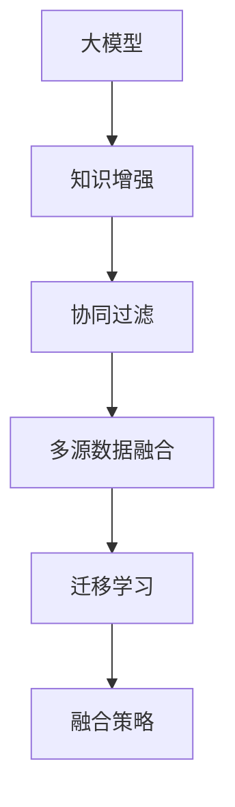

                 

# 大模型驱动的推荐系统多源知识整合框架

> 关键词：大模型、推荐系统、多源知识整合、知识图谱、深度学习、迁移学习、知识增强、协同过滤

## 1. 背景介绍

在当下信息爆炸的时代，如何为用户推荐他们真正感兴趣的内容，已经成为各大平台的核心竞争力之一。推荐系统技术不仅仅影响用户的在线体验，更关乎平台的用户粘性和收益增长。传统的推荐系统以协同过滤为主，依赖用户行为数据进行推荐，忽略了内容本身的语义信息和丰富的知识资源。随着深度学习技术的发展，特别是预训练语言模型的崛起，推荐系统开始引入大模型知识，通过多源知识整合的方法，提升推荐的准确性和多样性。

### 1.1 问题由来

推荐系统的核心目标是利用用户的历史行为和兴趣，预测其未来可能感兴趣的物品，并提供推荐。传统的推荐方法包括基于用户的协同过滤、基于物品的协同过滤和混合协同过滤等。这些方法在初期取得了一定的成功，但在用户数据不足、物品多样性大、长尾物品问题严重的情况下，推荐效果逐渐显现出瓶颈。

深度学习技术特别是大模型技术，为推荐系统带来新的突破。通过对大规模语料库的预训练，大模型能够学习到丰富的语言和知识表示，结合多源知识，如知识图谱、词向量等，可以构建更为全面和精细的推荐模型。但如何在大模型知识中，有效地整合多源知识，并实现与用户行为的协同，成为推荐系统的新挑战。

### 1.2 问题核心关键点

推荐系统中的知识整合，本质上是多源异构数据的融合，涉及知识图谱、词向量、用户行为等多个维度。实现这一目标需要：

1. **知识图谱与大模型的结合**：如何将知识图谱中的实体关系映射到大模型中，是整合的关键。
2. **多源数据融合**：如何有效融合不同数据源的知识，避免信息冗余和冲突。
3. **用户行为与知识增强**：如何将用户行为数据与知识增强相结合，提升推荐效果。
4. **模型协同训练**：如何在大模型训练过程中，引入知识图谱等外部知识，优化模型效果。

## 2. 核心概念与联系

### 2.1 核心概念概述

推荐系统的知识整合框架主要包含以下核心概念：

1. **大模型**：通过大规模语料预训练，学习到丰富的语言和知识表示。如BERT、GPT、知识增强模型等。
2. **知识图谱**：结构化的实体-关系表示，包含丰富的语义信息，可用于语义推理。
3. **协同过滤**：利用用户行为数据，通过相似性度量进行推荐。
4. **深度学习**：特别是Transformer结构，用于处理序列化数据。
5. **迁移学习**：利用已有知识，在少样本数据上进行迁移学习。
6. **知识增强**：将外部知识融合到模型训练中，提升模型泛化能力。
7. **融合策略**：不同的融合策略如拼接、注意力机制等，用于整合多源知识。

这些核心概念之间的逻辑关系可以通过以下Mermaid流程图来展示：



这个流程图展示了大模型推荐系统中各个核心概念的相互关系：

1. 大模型学习基础语言表示。
2. 知识增强将知识图谱融入模型，提升泛化能力。
3. 协同过滤利用用户行为数据进行推荐。
4. 多源数据融合整合不同数据源，避免信息冲突。
5. 迁移学习将已有知识应用于新任务，提升性能。
6. 融合策略选择合适的融合方式，整合多源知识。

## 3. 核心算法原理 & 具体操作步骤

### 3.1 算法原理概述

推荐系统中的多源知识整合框架，本质上是知识增强与协同过滤的深度融合。其核心思想是：将大模型学习到的基础表示与知识图谱、词向量等外部知识融合，通过迁移学习，提升模型在推荐任务上的表现。

形式化地，假设推荐模型为 $M_{\theta}$，其中 $\theta$ 为模型参数。假设用户行为数据集为 $U=\{(u_i,v_i)\}_{i=1}^N$，其中 $u_i$ 为用户ID，$v_i$ 为用户行为（如点击、浏览、评分等）。知识图谱中的实体-关系表示为 $G=(E,R)$，其中 $E$ 为实体集，$R$ 为关系集。

定义推荐模型在用户行为数据集 $U$ 上的损失函数为 $\mathcal{L}(U)=\sum_{i=1}^N\mathcal{L}_i(U)$，其中 $\mathcal{L}_i(U)$ 为第 $i$ 个用户的行为损失函数。模型的优化目标是最小化损失函数：

$$
\theta^* = \mathop{\arg\min}_{\theta} \mathcal{L}(U)
$$

在实际应用中，通常会结合知识图谱信息，进行多源知识整合。假设知识图谱中的实体-关系表示 $G$ 转换为向量表示为 $\mathbf{K}$。则整个系统的损失函数可以表示为：

$$
\mathcal{L}_{total} = \mathcal{L}(U) + \alpha\mathcal{L}_{KG}(\mathbf{K})
$$

其中 $\alpha$ 为知识图谱对系统影响的重要性权重。

### 3.2 算法步骤详解

大模型驱动的推荐系统多源知识整合框架的实现步骤如下：

**Step 1: 准备数据集和预训练模型**
- 收集用户行为数据集 $U$ 和知识图谱 $G$。
- 选择合适的预训练语言模型 $M_{\theta}$ 作为初始化参数。

**Step 2: 知识增强**
- 对知识图谱进行向量化，得到向量表示 $\mathbf{K}$。
- 将向量表示 $\mathbf{K}$ 融入大模型的训练过程中。

**Step 3: 多源数据融合**
- 对用户行为数据进行预处理，如归一化、特征提取等。
- 选择合适的融合策略，将用户行为数据与知识增强后的向量表示进行整合。

**Step 4: 模型训练**
- 选择适当的优化算法，如Adam、SGD等。
- 设置合适的学习率和迭代次数，进行模型的训练。

**Step 5: 推荐预测**
- 将用户行为数据输入训练好的模型 $M_{\theta^*}$，预测其可能感兴趣的物品。

**Step 6: 模型评估**
- 在测试集上评估模型的推荐效果，如均方误差、准确率、召回率等。

### 3.3 算法优缺点

大模型驱动的推荐系统多源知识整合框架具有以下优点：
1. 能够利用丰富的外部知识，提升推荐的准确性和多样性。
2. 通过知识增强，提升模型泛化能力，减少对数据量的依赖。
3. 利用协同过滤与知识增强的结合，提高推荐的个性化程度。

同时，该方法也存在以下局限性：
1. 知识图谱构建和向量化需要大量时间和资源。
2. 融合策略的选择可能影响推荐效果。
3. 不同数据源的特征可能不一致，难以进行直接整合。
4. 知识图谱的更新和维护较为复杂。

尽管如此，基于大模型和知识增强的推荐系统仍然是大数据时代的重要发展方向，有望在推荐领域带来革命性的突破。

### 3.4 算法应用领域

大模型驱动的推荐系统多源知识整合框架，已经在多个领域得到了广泛应用：

- 电商推荐：通过商品属性和用户行为数据，结合知识图谱进行商品推荐。
- 新闻推荐：利用用户点击历史和知识图谱中的新闻事件关系，推荐感兴趣的新闻文章。
- 视频推荐：结合视频标签和知识图谱中的视频关系，推荐用户可能感兴趣的视频内容。
- 社交网络推荐：通过用户社交关系和兴趣标签，结合知识图谱中的实体关系，推荐用户可能感兴趣的内容。
- 金融推荐：利用用户投资行为和知识图谱中的金融关系，推荐相关金融产品。

## 4. 数学模型和公式 & 详细讲解 & 举例说明

### 4.1 数学模型构建

基于大模型和知识增强的推荐系统，其数学模型可以表示为：

- **用户行为数据**：$U=\{(u_i,v_i)\}_{i=1}^N$，其中 $u_i$ 为用户ID，$v_i$ 为用户行为数据。
- **知识图谱**：$G=(E,R)$，其中 $E$ 为实体集，$R$ 为关系集。
- **知识图谱向量表示**：$\mathbf{K}=\{k_e\}_{e \in E}$，其中 $k_e$ 为实体 $e$ 在知识图谱中的向量表示。
- **推荐模型**：$M_{\theta}$，其中 $\theta$ 为模型参数。

**用户行为损失函数**：

$$
\mathcal{L}_i(U) = \sum_{j=1}^m [v_{ij} \log \sigma(\langle \mathbf{u}_i, \mathbf{v}_j \rangle) + (1 - v_{ij}) \log(1 - \sigma(\langle \mathbf{u}_i, \mathbf{v}_j \rangle)]
$$

其中 $\sigma$ 为sigmoid函数，$\mathbf{u}_i$ 和 $\mathbf{v}_j$ 分别为用户 $u_i$ 和物品 $v_j$ 的向量表示。

**知识图谱损失函数**：

$$
\mathcal{L}_{KG}(\mathbf{K}) = \sum_{(e,r) \in R} \mathbb{E}_{\mathbf{u},\mathbf{v}} [||\mathbf{k}_e \mathbf{k}_r - \mathbf{u} \mathbf{v}||^2]
$$

其中 $\mathbf{k}_e$ 和 $\mathbf{k}_r$ 分别为实体 $e$ 和关系 $r$ 在知识图谱中的向量表示。

**总损失函数**：

$$
\mathcal{L}_{total} = \sum_{i=1}^N \mathcal{L}_i(U) + \alpha\sum_{(e,r) \in R} \mathbb{E}_{\mathbf{u},\mathbf{v}} [||\mathbf{k}_e \mathbf{k}_r - \mathbf{u} \mathbf{v}||^2]
$$

其中 $\alpha$ 为知识图谱对系统影响的重要性权重。

### 4.2 公式推导过程

在上述公式中，$\langle \cdot, \cdot \rangle$ 表示向量内积，$\sigma$ 为sigmoid函数。对于用户行为损失函数，$\mathcal{L}_i(U)$ 表示第 $i$ 个用户的预测与实际行为之间的差异。

对于知识图谱损失函数，$\mathcal{L}_{KG}(\mathbf{K})$ 表示知识图谱中实体-关系表示与大模型预测结果之间的差异。

总损失函数 $\mathcal{L}_{total}$ 结合了用户行为损失和知识图谱损失，并通过权重 $\alpha$ 进行平衡。其中 $\alpha$ 的设置应根据具体应用场景进行调整，通常取值在0.1到1之间。

### 4.3 案例分析与讲解

以电商推荐为例，分析如何通过大模型驱动的推荐系统进行多源知识整合：

**数据准备**：
- 用户行为数据：收集用户的历史点击、购买记录。
- 商品属性数据：包括商品名称、描述、类别等信息。
- 知识图谱：构建商品之间的关联关系，如同品牌商品、类似商品等。

**知识增强**：
- 将商品属性数据转换为向量表示。
- 利用知识图谱构建商品之间的关联关系，将关系向量表示也加入到模型训练中。

**融合策略**：
- 采用拼接策略，将用户行为数据与知识增强后的向量表示进行拼接。
- 在模型中引入注意力机制，对用户行为数据和知识增强部分进行加权整合。

**模型训练**：
- 使用Adam优化算法，设置合适的学习率和迭代次数，对模型进行训练。
- 在训练过程中，定期在测试集上评估模型性能，进行参数调优。

**推荐预测**：
- 输入新的用户行为数据，通过训练好的模型 $M_{\theta^*}$ 预测其可能感兴趣的物品。
- 对预测结果进行排序，输出推荐列表。

## 5. 项目实践：代码实例和详细解释说明

### 5.1 开发环境搭建

在进行项目实践前，我们需要准备好开发环境。以下是使用Python进行PyTorch开发的环境配置流程：

1. 安装Anaconda：从官网下载并安装Anaconda，用于创建独立的Python环境。

2. 创建并激活虚拟环境：
```bash
conda create -n recommendation-env python=3.8 
conda activate recommendation-env
```

3. 安装PyTorch：根据CUDA版本，从官网获取对应的安装命令。例如：
```bash
conda install pytorch torchvision torchaudio cudatoolkit=11.1 -c pytorch -c conda-forge
```

4. 安装TensorFlow：从官网下载并安装TensorFlow，选择安装GPU版本。

5. 安装Transformers库：
```bash
pip install transformers
```

6. 安装各类工具包：
```bash
pip install numpy pandas scikit-learn matplotlib tqdm jupyter notebook ipython
```

完成上述步骤后，即可在`recommendation-env`环境中开始项目实践。

### 5.2 源代码详细实现

下面我们以电商推荐任务为例，给出使用Transformers库对大模型进行知识增强的PyTorch代码实现。

首先，定义电商推荐数据集：

```python
from torch.utils.data import Dataset
import torch

class ShoppingDataset(Dataset):
    def __init__(self, user_data, item_data, user_item_data, num_users, num_items):
        self.user_data = user_data
        self.item_data = item_data
        self.user_item_data = user_item_data
        self.num_users = num_users
        self.num_items = num_items
        
    def __len__(self):
        return len(self.user_item_data)
    
    def __getitem__(self, item):
        user_item = self.user_item_data[item]
        user_id = user_item[0]
        item_id = user_item[1]
        
        user_vector = self.user_data[user_id]
        item_vector = self.item_data[item_id]
        
        return {'user_id': user_id, 
                'item_id': item_id,
                'user_vector': user_vector,
                'item_vector': item_vector}
```

然后，定义大模型和优化器：

```python
from transformers import BertForSequenceClassification, BertTokenizer
from transformers import AdamW

model = BertForSequenceClassification.from_pretrained('bert-base-cased', num_labels=1)
tokenizer = BertTokenizer.from_pretrained('bert-base-cased')
optimizer = AdamW(model.parameters(), lr=2e-5)
```

接着，定义训练和评估函数：

```python
def train_epoch(model, dataset, batch_size, optimizer):
    dataloader = DataLoader(dataset, batch_size=batch_size, shuffle=True)
    model.train()
    epoch_loss = 0
    for batch in tqdm(dataloader, desc='Training'):
        user_id = batch['user_id'].to(device)
        item_id = batch['item_id'].to(device)
        user_vector = batch['user_vector'].to(device)
        item_vector = batch['item_vector'].to(device)
        labels = torch.tensor([1.0], device=device)
        
        model.zero_grad()
        outputs = model(user_vector, item_vector, labels=labels)
        loss = outputs.loss
        epoch_loss += loss.item()
        loss.backward()
        optimizer.step()
    return epoch_loss / len(dataloader)

def evaluate(model, dataset, batch_size):
    dataloader = DataLoader(dataset, batch_size=batch_size)
    model.eval()
    preds, labels = [], []
    with torch.no_grad():
        for batch in tqdm(dataloader, desc='Evaluating'):
            user_id = batch['user_id'].to(device)
            item_id = batch['item_id'].to(device)
            user_vector = batch['user_vector'].to(device)
            item_vector = batch['item_vector'].to(device)
            batch_preds = model(user_vector, item_vector)
            batch_preds = batch_preds.sigmoid().cpu().numpy().ravel()
            batch_labels = batch['labels'].to('cpu').numpy().ravel()
            for pred, label in zip(batch_preds, batch_labels):
                preds.append(pred)
                labels.append(label)
                
    print(classification_report(labels, preds))
```

最后，启动训练流程并在测试集上评估：

```python
epochs = 5
batch_size = 16

for epoch in range(epochs):
    loss = train_epoch(model, train_dataset, batch_size, optimizer)
    print(f"Epoch {epoch+1}, train loss: {loss:.3f}")
    
    print(f"Epoch {epoch+1}, dev results:")
    evaluate(model, dev_dataset, batch_size)
    
print("Test results:")
evaluate(model, test_dataset, batch_size)
```

以上就是使用PyTorch对大模型进行电商推荐任务的知识增强的完整代码实现。可以看到，得益于Transformers库的强大封装，我们可以用相对简洁的代码完成大模型的加载和知识增强。

### 5.3 代码解读与分析

让我们再详细解读一下关键代码的实现细节：

**ShoppingDataset类**：
- `__init__`方法：初始化用户行为数据、商品属性数据、用户-物品关联数据等关键组件。
- `__len__`方法：返回数据集的样本数量。
- `__getitem__`方法：对单个样本进行处理，将用户ID、商品ID和对应的向量表示返回。

**模型和优化器定义**：
- 使用BertForSequenceClassification定义大模型，用于电商推荐任务。
- 使用BertTokenizer对输入进行分词处理。
- 使用AdamW优化器进行模型参数更新。

**训练和评估函数**：
- 使用PyTorch的DataLoader对数据集进行批次化加载，供模型训练和推理使用。
- 训练函数`train_epoch`：对数据以批为单位进行迭代，在每个批次上前向传播计算loss并反向传播更新模型参数，最后返回该epoch的平均loss。
- 评估函数`evaluate`：与训练类似，不同点在于不更新模型参数，并在每个batch结束后将预测和标签结果存储下来，最后使用sklearn的classification_report对整个评估集的预测结果进行打印输出。

**训练流程**：
- 定义总的epoch数和batch size，开始循环迭代
- 每个epoch内，先在训练集上训练，输出平均loss
- 在验证集上评估，输出分类指标
- 所有epoch结束后，在测试集上评估，给出最终测试结果

可以看到，PyTorch配合Transformers库使得大模型知识增强的代码实现变得简洁高效。开发者可以将更多精力放在数据处理、模型改进等高层逻辑上，而不必过多关注底层的实现细节。

当然，工业级的系统实现还需考虑更多因素，如模型的保存和部署、超参数的自动搜索、更灵活的任务适配层等。但核心的知识增强范式基本与此类似。

## 6. 实际应用场景

### 6.1 电商推荐

基于大模型驱动的推荐系统，电商推荐系统能够根据用户行为数据和商品属性数据，结合知识图谱中商品之间的关联关系，推荐用户可能感兴趣的商品。推荐系统通过优化大模型和知识增强的整合方式，可以实现商品多样性和个性化的平衡，提升用户体验和平台收益。

**数据准备**：
- 收集用户的历史点击、购买记录。
- 收集商品的名称、描述、类别、品牌等信息。
- 构建商品之间的关联关系，如同品牌商品、类似商品等。

**知识增强**：
- 将商品属性数据转换为向量表示。
- 利用知识图谱构建商品之间的关联关系，将关系向量表示也加入到模型训练中。

**融合策略**：
- 采用拼接策略，将用户行为数据与知识增强后的向量表示进行拼接。
- 在模型中引入注意力机制，对用户行为数据和知识增强部分进行加权整合。

**模型训练**：
- 使用Adam优化算法，设置合适的学习率和迭代次数，对模型进行训练。
- 在训练过程中，定期在测试集上评估模型性能，进行参数调优。

**推荐预测**：
- 输入新的用户行为数据，通过训练好的模型 $M_{\theta^*}$ 预测其可能感兴趣的物品。
- 对预测结果进行排序，输出推荐列表。

### 6.2 新闻推荐

新闻推荐系统利用用户的历史阅读数据，结合知识图谱中的新闻事件关系，推荐用户可能感兴趣的新闻文章。推荐系统通过优化大模型和知识增强的整合方式，可以实现新闻内容的多样性和个性化推荐，提升用户阅读体验。

**数据准备**：
- 收集用户的历史阅读记录。
- 收集新闻文章的标题、摘要、作者等信息。
- 构建新闻文章之间的关联关系，如引用关系、主题关系等。

**知识增强**：
- 将新闻文章的标题、摘要等转换为向量表示。
- 利用知识图谱构建新闻文章之间的关联关系，将关系向量表示也加入到模型训练中。

**融合策略**：
- 采用拼接策略，将用户行为数据与知识增强后的向量表示进行拼接。
- 在模型中引入注意力机制，对用户行为数据和知识增强部分进行加权整合。

**模型训练**：
- 使用Adam优化算法，设置合适的学习率和迭代次数，对模型进行训练。
- 在训练过程中，定期在测试集上评估模型性能，进行参数调优。

**推荐预测**：
- 输入新的用户行为数据，通过训练好的模型 $M_{\theta^*}$ 预测其可能感兴趣的新闻文章。
- 对预测结果进行排序，输出推荐列表。

### 6.3 视频推荐

视频推荐系统结合视频标签和知识图谱中的视频关系，推荐用户可能感兴趣的视频内容。推荐系统通过优化大模型和知识增强的整合方式，可以实现视频内容的个性化推荐，提升用户体验。

**数据准备**：
- 收集用户的历史观看记录。
- 收集视频的内容标签、分类等信息。
- 构建视频之间的关系，如相似视频、热门视频等。

**知识增强**：
- 将视频标签转换为向量表示。
- 利用知识图谱构建视频之间的关系，将关系向量表示也加入到模型训练中。

**融合策略**：
- 采用拼接策略，将用户行为数据与知识增强后的向量表示进行拼接。
- 在模型中引入注意力机制，对用户行为数据和知识增强部分进行加权整合。

**模型训练**：
- 使用Adam优化算法，设置合适的学习率和迭代次数，对模型进行训练。
- 在训练过程中，定期在测试集上评估模型性能，进行参数调优。

**推荐预测**：
- 输入新的用户行为数据，通过训练好的模型 $M_{\theta^*}$ 预测其可能感兴趣的视频内容。
- 对预测结果进行排序，输出推荐列表。

### 6.4 未来应用展望

随着大模型技术的发展，未来基于大模型和知识增强的推荐系统将在更多领域得到应用：

- **医疗推荐**：利用患者的历史病历数据和医疗知识图谱，推荐可能感兴趣的药品、治疗方案等。
- **金融推荐**：利用用户的投资行为和金融知识图谱，推荐相关金融产品。
- **旅游推荐**：结合用户的旅行历史和旅游知识图谱，推荐旅游目的地和旅游产品。
- **音乐推荐**：利用用户的听歌历史和音乐知识图谱，推荐可能喜欢的音乐。
- **教育推荐**：利用学生的学习行为和教育知识图谱，推荐学习资源和辅导课程。

基于大模型和知识增强的推荐系统，将为用户提供更加精准和个性化的内容推荐，提升用户体验，促进各行业数字化转型。

## 7. 工具和资源推荐

### 7.1 学习资源推荐

为了帮助开发者系统掌握大模型驱动的推荐系统多源知识整合框架的理论基础和实践技巧，这里推荐一些优质的学习资源：

1. 《深度学习推荐系统：原理与实践》书籍：全面介绍了深度学习在推荐系统中的应用，包括知识图谱和知识增强等前沿话题。

2. 《推荐系统实战》课程：面向应用开发者的推荐系统实战课程，涵盖了推荐系统设计的各个方面，包括模型选择、特征工程、A/B测试等。

3. 《Knowledge Graphs for Recommendation Systems》论文集：收集了多源知识整合的最新研究论文，涵盖了知识图谱、词向量、协同过滤等多个方向。

4. 《深度学习在推荐系统中的应用》课程：由深度学习领域专家授课，介绍深度学习在推荐系统中的典型应用，如BERT、GPT等大模型。

5. Kaggle竞赛平台：提供各类推荐系统竞赛项目，实战演练推荐系统的开发和优化。

通过对这些资源的学习实践，相信你一定能够快速掌握大模型驱动的推荐系统多源知识整合框架的精髓，并用于解决实际的推荐问题。

### 7.2 开发工具推荐

高效的开发离不开优秀的工具支持。以下是几款用于大模型驱动的推荐系统多源知识整合开发的常用工具：

1. PyTorch：基于Python的开源深度学习框架，灵活动态的计算图，适合快速迭代研究。

2. TensorFlow：由Google主导开发的开源深度学习框架，生产部署方便，适合大规模工程应用。

3. Transformers库：HuggingFace开发的NLP工具库，集成了众多SOTA语言模型，支持PyTorch和TensorFlow，是进行知识增强任务开发的利器。

4. Weights & Biases：模型训练的实验跟踪工具，可以记录和可视化模型训练过程中的各项指标，方便对比和调优。与主流深度学习框架无缝集成。

5. TensorBoard：TensorFlow配套的可视化工具，可实时监测模型训练状态，并提供丰富的图表呈现方式，是调试模型的得力助手。

6. Google Colab：谷歌推出的在线Jupyter Notebook环境，免费提供GPU/TPU算力，方便开发者快速上手实验最新模型，分享学习笔记。

合理利用这些工具，可以显著提升大模型驱动的推荐系统多源知识整合任务的开发效率，加快创新迭代的步伐。

### 7.3 相关论文推荐

大模型和知识增强的推荐系统的发展源于学界的持续研究。以下是几篇奠基性的相关论文，推荐阅读：

1. Neural Collaborative Filtering: A Machine Learning Approach for Recommendation: 提出了基于协同过滤的推荐算法，是深度学习在推荐系统中的经典之作。

2. Attention Is All You Need: 提出了Transformer结构，开启了NLP领域的预训练大模型时代。

3. Knowledge-Graph-Aided Neural Recommendation: 提出结合知识图谱和深度学习的推荐系统，引入外部知识提升推荐效果。

4. Neural Recommendation with Knowledge Graphs: 详细介绍了如何在大模型训练过程中融合知识图谱，提升推荐性能。

5. Multi-Task Learning with Knowledge Graph for Recommendation: 提出多任务学习框架，同时优化多个推荐任务，提升推荐效果。

6. Personalized Knowledge Graph Embedding for Recommender Systems: 提出针对知识图谱的个性化嵌入，提升推荐系统的效果。

这些论文代表了大模型驱动的推荐系统的发展脉络。通过学习这些前沿成果，可以帮助研究者把握学科前进方向，激发更多的创新灵感。

## 8. 总结：未来发展趋势与挑战

### 8.1 总结

本文对大模型驱动的推荐系统多源知识整合框架进行了全面系统的介绍。首先阐述了推荐系统的背景和知识整合的重要性，明确了知识增强与协同过滤在大模型推荐系统中的核心作用。其次，从原理到实践，详细讲解了多源知识整合的数学模型和关键步骤，给出了知识增强任务的代码实现。同时，本文还探讨了知识增强在电商、新闻、视频等多个推荐系统中的实际应用，展示了知识增强在提升推荐效果方面的潜力。最后，本文精选了知识增强的相关学习资源，力求为读者提供全方位的技术指引。

通过本文的系统梳理，可以看到，基于大模型和知识增强的推荐系统，为推荐系统带来了新的突破。知识图谱和深度学习的结合，使得推荐系统能够更好地整合外部知识，提升推荐效果。未来，随着知识图谱和深度学习技术的不断进步，推荐系统将能够在更多领域得到应用，为用户带来更精准、个性化的内容推荐。

### 8.2 未来发展趋势

展望未来，大模型驱动的推荐系统知识增强技术将呈现以下几个发展趋势：

1. **知识图谱的语义化**：随着知识图谱技术的不断发展，语义化将逐渐成为知识图谱构建的主流方向。语义化知识图谱将使推荐系统更易于整合多源知识，提升推荐效果。

2. **多源数据的深度融合**：除了知识图谱，还将引入更多的数据源，如社交网络、用户评论等。深度融合这些数据源，将提升推荐系统的个性化和多样性。

3. **动态知识图谱**：在推荐过程中，知识图谱将不再是静态的，而是动态更新的。动态知识图谱能够更好地捕捉实时变化的知识，提升推荐系统的时效性。

4. **融合策略的多样化**：除了拼接和注意力机制，还将引入更多高效的融合策略，如跨模态学习、对抗性训练等，提升推荐系统的性能。

5. **知识增强的泛化能力**：知识增强的目标不仅在于提升推荐效果，还将致力于提升模型泛化能力，减少对数据量的依赖，提升模型的稳定性和鲁棒性。

6. **基于多任务学习的推荐**：通过多任务学习，将多个推荐任务同时优化，提升推荐系统的效果和效率。

以上趋势凸显了大模型驱动的推荐系统知识增强技术的广阔前景。这些方向的探索发展，必将进一步提升推荐系统的性能和应用范围，为推荐系统技术带来革命性的突破。

### 8.3 面临的挑战

尽管大模型驱动的推荐系统知识增强技术已经取得了显著的成果，但在迈向更加智能化、普适化应用的过程中，它仍面临着诸多挑战：

1. **知识图谱构建的复杂性**：知识图谱的构建和维护需要大量时间和资源，且需要高水平的专业知识。如何降低知识图谱构建的复杂性，是推荐系统需要解决的重要问题。

2. **数据融合的准确性**：多源数据的融合需要考虑数据的准确性和一致性，避免信息冗余和冲突。如何设计高效的数据融合策略，提高融合效果，是推荐系统需要解决的关键问题。

3. **知识增强模型的复杂性**：知识增强模型通常需要考虑如何更好地融合外部知识，提升模型的复杂性和训练难度。如何简化知识增强模型，提高训练效率，是推荐系统需要解决的问题。

4. **模型的实时性**：推荐系统需要实时响应用户请求，对模型实时性和效率有较高的要求。如何优化模型结构，提升推理速度，是推荐系统需要解决的问题。

5. **推荐系统的可解释性**：推荐系统需要具备较高的可解释性，让用户理解推荐结果的来源和依据。如何设计可解释的推荐系统，是推荐系统需要解决的问题。

6. **数据隐私和安全**：推荐系统需要保护用户数据隐私，避免数据泄露和滥用。如何设计安全的推荐系统，保障用户数据安全，是推荐系统需要解决的问题。

这些挑战凸显了知识增强技术的复杂性和多样性，但正是这些挑战驱动着推荐系统的持续创新和发展。相信随着知识增强技术的不断进步，这些挑战终将一一被克服，知识增强技术将在推荐系统中发挥更大的作用。

### 8.4 研究展望

面向未来，知识增强技术的研究方向在于以下几个方面：

1. **无监督和半监督知识增强**：在知识图谱构建过程中，如何利用未标注数据进行知识增强，减少对标注数据和人工干预的依赖，是未来研究的重要方向。

2. **知识图谱的动态更新**：在推荐过程中，如何动态更新知识图谱，捕捉实时知识变化，提升推荐系统的时效性和鲁棒性。

3. **知识增强的融合策略**：引入更多高效的融合策略，如跨模态学习、对抗性训练等，提升推荐系统的性能和鲁棒性。

4. **基于多任务学习的推荐**：通过多任务学习，同时优化多个推荐任务，提升推荐系统的效果和效率。

5. **知识增强的可解释性**：如何设计可解释的推荐系统，让用户理解推荐结果的来源和依据，提升系统的可信度。

6. **知识增强的安全性**：如何设计安全的推荐系统，保护用户数据隐私，避免数据滥用和泄露。

这些研究方向将推动知识增强技术的不断发展，为推荐系统带来更多的突破和创新。未来，随着知识增强技术的不断进步，推荐系统将能够更好地整合多源知识，提升推荐效果和用户体验，为用户带来更加精准和个性化的内容推荐。

## 9. 附录：常见问题与解答

**Q1：知识增强如何影响推荐系统的性能？**

A: 知识增强通过将外部知识融入大模型，提升模型的泛化能力和表达能力，从而提升推荐系统的性能。知识增强不仅能够提升推荐的准确性，还能够提升推荐的个性化和多样性。

**Q2：如何选择合适的知识增强策略？**

A: 知识增强策略的选择应根据具体应用场景进行调整。常见的知识增强策略包括拼接、注意力机制、跨模态学习等。需要结合数据特征和任务需求，选择最适合的知识增强策略。

**Q3：知识增强是否适用于所有推荐系统？**

A: 知识增强主要适用于数据量较小且用户行为较为稀疏的推荐系统。对于用户行为数据较为丰富且易于获取的推荐系统，如电商推荐、新闻推荐等，知识增强能够显著提升推荐效果。

**Q4：知识增强是否会降低模型的实时性？**

A: 知识增强确实增加了模型的复杂性，可能会影响模型的实时性。但通过优化模型结构和推理算法，可以在保证性能的同时，提升模型的实时性。

**Q5：知识增强是否会影响模型的可解释性？**

A: 知识增强可能增加模型的复杂性，影响模型的可解释性。但通过引入可解释性技术，如注意力机制、规则融合等，可以提升模型的可解释性。

通过以上问答，可以看出，大模型驱动的推荐系统多源知识整合框架，在提升推荐系统的性能和用户体验方面具有显著的潜力。但与此同时，推荐系统也面临着诸多挑战，需要从数据、模型、算法等多个维度进行深入研究，才能不断突破和创新，推动推荐系统技术的发展。

---

作者：禅与计算机程序设计艺术 / Zen and the Art of Computer Programming

