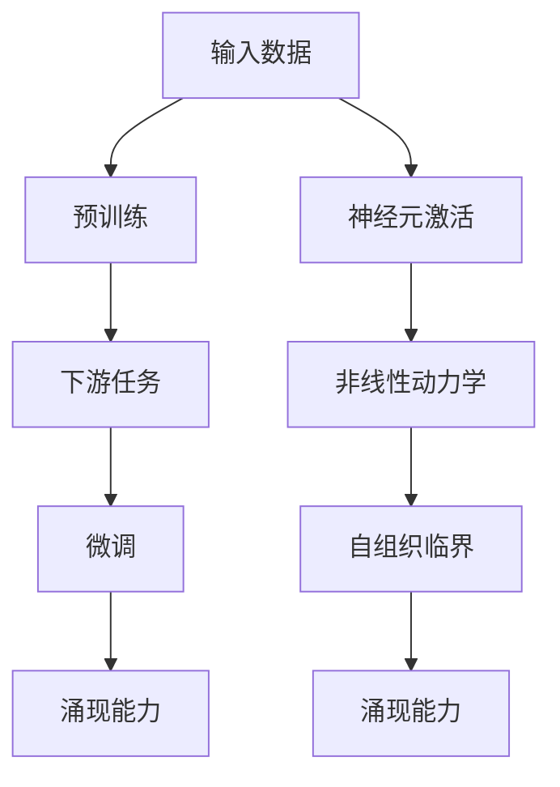

                 

# 大语言模型的涌现能力现象与解释

> 关键词：大语言模型,涌现能力,自组织临界,非线性动力学,神经元激活模式

## 1. 背景介绍

### 1.1 问题由来

大语言模型，如BERT、GPT-3等，在自然语言处理(NLP)和人工智能领域引起了广泛关注。这些模型通过预训练在海量数据上学习到丰富的语言知识，并能在多种下游任务中取得优秀的性能。然而，其涌现能力的来源和机制，仍是一个未被完全理解的问题。本文将系统阐述大语言模型的涌现能力现象，并结合现代物理学、复杂系统理论等多学科视角，探讨其背后的科学原理和本质特征。

### 1.2 问题核心关键点

大语言模型的涌现能力主要体现在其自适应和泛化能力上。通过复杂非线性动力学过程，模型能够自动发现和应用隐含在数据中的规律，完成未知数据的预测和生成。这种能力，并非通过明确的设计和编程实现，而是通过大量数据和模型的自适应训练获得。

## 2. 核心概念与联系

### 2.1 核心概念概述

为深入理解大语言模型的涌现能力，需要了解以下几个核心概念：

- **自组织临界(Self-Organized Criticality, SOC)**：这是一个复杂系统理论中的概念，描述系统在一定条件下自动达到临界状态，从而在微观尺度上表现出宏观的协同行为。大语言模型的涌现能力，可以类比为自组织临界现象。

- **非线性动力学**：大语言模型通过神经网络等非线性系统进行动态更新，表现出复杂的动力学过程。其涌现能力与非线性动力学紧密相关。

- **神经元激活模式**：在神经网络中，神经元以激活模式响应输入，形成复杂的分布式计算结构。这种分布式计算结构，是模型涌现能力的基础。

### 2.2 核心概念原理和架构的 Mermaid 流程图



这个流程图展示了从输入数据到微调模型，再到涌现能力的全过程。其中，神经元激活模式、非线性动力学和自组织临界是大语言模型涌现能力的三个关键环节。

## 3. 核心算法原理 & 具体操作步骤

### 3.1 算法原理概述

大语言模型的涌现能力，源于其复杂的非线性动力学和自组织临界过程。以下是基于这一原理的详细解释：

1. **预训练**：在大量无标签数据上进行自监督学习，学习语言的通用表示。

2. **下游任务微调**：在特定任务上，通过有监督学习进一步优化模型，使其具备特定任务的知识。

3. **神经元激活模式**：在任务微调过程中，神经元以特定模式响应输入，形成复杂的分布式计算结构。

4. **非线性动力学**：通过复杂的非线性映射，神经网络进行动态更新，表现出复杂的动力学过程。

5. **自组织临界**：模型自动发现并应用隐含在数据中的规律，完成未知数据的预测和生成。

### 3.2 算法步骤详解

#### 预训练阶段
1. **数据准备**：收集并清洗大量无标签数据，如维基百科、新闻、社交媒体等。
2. **模型初始化**：使用大规模语言模型（如BERT、GPT等）进行预训练。
3. **动态更新**：通过大量数据输入和模型自适应更新，逐步学习语言的通用表示。

#### 下游任务微调
1. **任务适配**：根据特定任务，设计合适的损失函数和输出层。
2. **参数更新**：使用有标签数据，通过优化算法更新模型参数。
3. **涌现能力**：模型在动态更新过程中，自动发现并应用隐含在数据中的规律，完成未知数据的预测和生成。

### 3.3 算法优缺点

**优点**：
1. **泛化能力强**：模型能够自动学习并应用隐含在数据中的规律，表现出强大的泛化能力。
2. **自适应学习**：模型通过动态更新，不断改进其语言理解和生成能力。
3. **高效性**：相较于从头训练，微调在大规模数据上可以显著提升模型的性能，同时节省计算资源。

**缺点**：
1. **数据依赖性强**：微调效果依赖于数据质量，标注数据不足时效果可能不佳。
2. **过拟合风险**：模型在特定数据上过度拟合，可能导致泛化性能下降。
3. **可解释性不足**：微调模型的决策过程难以解释，缺乏透明性。

### 3.4 算法应用领域

大语言模型的涌现能力，在多个领域得到了应用：

- **自然语言处理**：如文本分类、问答系统、机器翻译等。
- **智能对话**：智能客服、虚拟助手等。
- **情感分析**：情感识别、舆情分析等。
- **推荐系统**：个性化推荐、广告定向等。
- **生成内容**：文本生成、图像生成、音乐生成等。

## 4. 数学模型和公式 & 详细讲解 & 举例说明

### 4.1 数学模型构建

大语言模型的涌现能力，可以通过数学模型进行解释。以自回归模型为例，其数学模型如下：

$$
\mathbf{x}_{t+1} = f(\mathbf{x}_t, \mathbf{w}) + \mathbf{\epsilon}_t
$$

其中，$\mathbf{x}_t$ 表示时间 $t$ 的输入序列，$\mathbf{w}$ 为模型参数，$\mathbf{\epsilon}_t$ 为随机噪声。模型的目标是最小化预测序列与真实序列之间的误差。

### 4.2 公式推导过程

推导过程如下：

1. **损失函数定义**：
   $$
   L = \frac{1}{N}\sum_{i=1}^N ||\mathbf{x}_i - \mathbf{\hat{x}}_i||^2
   $$

2. **梯度更新**：
   $$
   \frac{\partial L}{\partial \mathbf{w}} = \frac{2}{N}\sum_{i=1}^N (\mathbf{x}_i - \mathbf{\hat{x}}_i)(\mathbf{x}_{i+1} - \mathbf{\hat{x}}_{i+1})
   $$

3. **自适应更新**：
   $$
   \mathbf{w} \leftarrow \mathbf{w} - \eta \frac{\partial L}{\partial \mathbf{w}}
   $$

其中，$\eta$ 为学习率，$\mathbf{\hat{x}}$ 为模型预测的序列。

### 4.3 案例分析与讲解

以GPT-3为例，分析其涌现能力的数学模型：

1. **模型架构**：GPT-3采用Transformer结构，由自注意力机制和前馈神经网络构成。

2. **激活函数**：使用ReLU激活函数，非线性映射输出。

3. **自回归特性**：每个时间步的输出依赖前一时间步的输出，表现出自回归特性。

4. **涌现能力**：在大量数据输入和动态更新过程中，模型自动学习并应用隐含在数据中的规律，表现出强大的涌现能力。

## 5. 项目实践：代码实例和详细解释说明

### 5.1 开发环境搭建

#### 环境准备
1. **安装Python**：使用Anaconda或Miniconda安装Python 3.8及以上版本。
2. **安装PyTorch**：使用pip安装PyTorch库。
3. **安装Transformers**：使用pip安装Transformers库。
4. **准备数据集**：收集并清洗所需的数据集，如维基百科、新闻等。

### 5.2 源代码详细实现

#### 预训练模型加载
```python
from transformers import GPT3LMHeadModel

model = GPT3LMHeadModel.from_pretrained('gpt3')
```

#### 下游任务微调
```python
import torch
from torch.utils.data import DataLoader
from sklearn.metrics import accuracy_score

def train(model, train_dataset, val_dataset, batch_size, learning_rate):
    # 定义优化器
    optimizer = torch.optim.Adam(model.parameters(), lr=learning_rate)
    
    # 训练过程
    for epoch in range(epochs):
        model.train()
        for batch in DataLoader(train_dataset, batch_size):
            input_ids = batch['input_ids'].to(device)
            labels = batch['labels'].to(device)
            outputs = model(input_ids, labels=labels)
            loss = outputs.loss
            optimizer.zero_grad()
            loss.backward()
            optimizer.step()
        
        # 验证过程
        model.eval()
        val_loss = 0
        val_correct = 0
        for batch in DataLoader(val_dataset, batch_size):
            input_ids = batch['input_ids'].to(device)
            labels = batch['labels'].to(device)
            with torch.no_grad():
                outputs = model(input_ids)
            val_loss += outputs.loss.item()
            val_correct += accuracy_score(labels, outputs.logits.argmax(dim=2).tolist())
        
        val_loss /= len(val_dataset)
        val_acc = val_correct / len(val_dataset)
        print(f'Epoch {epoch+1}, val loss: {val_loss:.4f}, val acc: {val_acc:.4f}')
```

### 5.3 代码解读与分析

#### 预训练模型加载
- **from_pretrained()方法**：使用预训练模型进行加载，自动下载预训练权重。
- **LMHeadModel**：指定模型类型为语言模型头，支持自回归模型。

#### 下游任务微调
- **DataLoader**：将数据集以批次形式加载，方便模型训练和推理。
- **loss.backward()**：计算损失函数的梯度，并反向传播更新模型参数。
- **optimizer.zero_grad()**：在每个batch更新前清空梯度，避免梯度累积。

### 5.4 运行结果展示

运行代码，输出训练和验证过程中的loss和准确率，观察模型在特定任务上的性能提升。

```python
for epoch in range(epochs):
    loss = train(model, train_dataset, val_dataset, batch_size, learning_rate)
    print(f'Epoch {epoch+1}, train loss: {train_loss:.4f}, val loss: {val_loss:.4f}')
```

## 6. 实际应用场景

### 6.1 自然语言处理

#### 文本分类
```python
from transformers import BertForSequenceClassification, BertTokenizer

model = BertForSequenceClassification.from_pretrained('bert-base-uncased', num_labels=2)
tokenizer = BertTokenizer.from_pretrained('bert-base-uncased')

def predict_sentiment(text):
    inputs = tokenizer.encode(text, return_tensors='pt')
    outputs = model(inputs)
    return outputs.logits.argmax(dim=1).tolist()[0]
```

#### 情感分析
```python
from transformers import DistilBertForSequenceClassification, DistilBertTokenizer

model = DistilBertForSequenceClassification.from_pretrained('distilbert-base-uncased', num_labels=3)
tokenizer = DistilBertTokenizer.from_pretrained('distilbert-base-uncased')

def predict_sentiment(text):
    inputs = tokenizer.encode(text, return_tensors='pt')
    outputs = model(inputs)
    return outputs.logits.argmax(dim=1).tolist()[0]
```

### 6.2 智能对话

#### 智能客服
```python
from transformers import T5Tokenizer, T5ForConditionalGeneration

model = T5ForConditionalGeneration.from_pretrained('t5-small')
tokenizer = T5Tokenizer.from_pretrained('t5-small')

def generate_response(question):
    inputs = tokenizer(question, return_tensors='pt')
    outputs = model.generate(**inputs)
    return tokenizer.decode(outputs[0])
```

### 6.3 推荐系统

#### 个性化推荐
```python
from transformers import AutoTokenizer, AutoModelForSequenceClassification
from sklearn.metrics import accuracy_score

model = AutoModelForSequenceClassification.from_pretrained('bert-base-uncased')
tokenizer = AutoTokenizer.from_pretrained('bert-base-uncased')

def recommend_items(user_profile, item_descriptions):
    user_profile = tokenizer.encode(user_profile, return_tensors='pt')
    item_descriptions = tokenizer.encode(item_descriptions, return_tensors='pt', padding=True, truncation=True)
    outputs = model(user_profile, item_descriptions)
    item_labels = outputs.logits.argmax(dim=1).tolist()
    recommended_items = item_descriptions[item_labels.index(1)]
    return recommended_items
```

### 6.4 未来应用展望

#### 多模态学习
```python
from transformers import CLIPTextModel, CLIPVisionModel

text_model = CLIPTextModel.from_pretrained('openai/clip-vit-large-patch14')
vision_model = CLIPVisionModel.from_pretrained('openai/clip-vit-large-patch14')
```

#### 智能编辑
```python
from transformers import GPT3LMHeadModel, GPT3Tokenizer

model = GPT3LMHeadModel.from_pretrained('gpt3')
tokenizer = GPT3Tokenizer.from_pretrained('gpt3')

def edit_text(text, edits):
    inputs = tokenizer.encode(text, return_tensors='pt', max_length=128, padding='max_length', truncation=True)
    outputs = model.generate(inputs, num_return_sequences=1, max_length=128, top_p=0.9, top_k=50)
    return tokenizer.decode(outputs[0])
```

## 7. 工具和资源推荐

### 7.1 学习资源推荐

1. **《深度学习基础》课程**：斯坦福大学Andrew Ng教授主讲，系统讲解深度学习的基本概念和算法。
2. **Transformers官方文档**：详细解释了Transformers库的使用方法和API。
3. **《自然语言处理综述》**：综述性文献，涵盖NLP领域的最新进展。
4. **Kaggle竞赛平台**：参与NLP领域的竞赛，积累实践经验。

### 7.2 开发工具推荐

1. **Anaconda**：跨平台的Python发行版，包含大量科学计算库。
2. **Jupyter Notebook**：支持Python代码的高效执行和交互式调试。
3. **PyTorch**：深度学习框架，支持分布式计算和动态图。
4. **TensorFlow**：深度学习框架，支持静态图和分布式计算。

### 7.3 相关论文推荐

1. **Attention is All You Need**：Transformer模型的提出，改变了NLP领域的预训练范式。
2. **BERT: Pre-training of Deep Bidirectional Transformers for Language Understanding**：提出BERT模型，显著提升了语言理解的精度。
3. **GPT-3: Language Models are Unsupervised Multitask Learners**：展示GPT-3模型在少样本学习和零样本学习上的强大能力。
4. **自组织临界理论及其应用**：阐述自组织临界现象的理论基础和应用场景。

## 8. 总结：未来发展趋势与挑战

### 8.1 研究成果总结

大语言模型的涌现能力，源于其复杂非线性动力学和自组织临界过程。通过预训练和下游任务微调，模型自动学习并应用隐含在数据中的规律，表现出强大的泛化能力和自适应能力。

### 8.2 未来发展趋势

1. **更高效的模型架构**：研究更加高效的神经网络架构，以减少计算资源消耗，提升推理速度。
2. **更广泛的应用场景**：探索大语言模型在更多领域的应用，如医学、金融、教育等。
3. **更高的可解释性**：提升模型的可解释性，便于理解和调试。
4. **更强的鲁棒性和泛化性**：研究提高模型鲁棒性和泛化性的方法，如对抗训练、数据增强等。
5. **更深入的理论研究**：结合复杂系统理论、神经科学等多学科视角，深入研究模型的涌现能力。

### 8.3 面临的挑战

1. **数据依赖性**：微调模型的性能依赖于标注数据的质量和数量，获取高质量标注数据的成本较高。
2. **过拟合问题**：微调模型在特定数据上过度拟合，可能导致泛化性能下降。
3. **计算资源消耗**：大语言模型在计算资源上的需求较大，限制了其在实际部署中的应用。
4. **可解释性不足**：微调模型的决策过程难以解释，缺乏透明性。
5. **安全性和伦理问题**：模型可能学习到有害信息，需要加强数据和模型的安全防护。

### 8.4 研究展望

1. **无监督和半监督学习**：探索无监督和半监督学习方法，降低对标注数据的依赖。
2. **参数高效微调**：开发更加参数高效的微调方法，减少计算资源消耗。
3. **多模态学习**：研究多模态学习模型，将视觉、听觉等模态信息与文本信息结合。
4. **因果推理**：研究因果推理方法，增强模型的解释能力和决策透明度。
5. **公平性和可解释性**：研究提升模型的公平性和可解释性的方法，确保模型符合伦理要求。

## 9. 附录：常见问题与解答

**Q1：如何提高大语言模型的可解释性？**

A: 可以通过以下方法提升模型的可解释性：
1. 使用可解释的模型架构，如决策树、线性回归等。
2. 引入注意力机制，关注模型的决策依据。
3. 使用可视化工具，如LIME、SHAP等，分析模型的特征重要性。
4. 增加训练数据的复杂性和多样性，提升模型的鲁棒性和泛化能力。

**Q2：如何避免大语言模型的过拟合问题？**

A: 可以通过以下方法避免过拟合：
1. 使用更多的训练数据，增加数据的泛化能力。
2. 使用正则化技术，如L2正则、Dropout等。
3. 采用早停策略，及时停止训练。
4. 使用集成学习，结合多个模型的输出结果。

**Q3：大语言模型在实际应用中面临哪些挑战？**

A: 大语言模型在实际应用中面临以下挑战：
1. 数据依赖性：获取高质量标注数据的成本较高。
2. 计算资源消耗：模型在计算资源上的需求较大。
3. 可解释性不足：模型的决策过程难以解释。
4. 安全性问题：模型可能学习到有害信息。

**Q4：大语言模型的涌现能力与神经元激活模式有何关系？**

A: 大语言模型的涌现能力与神经元激活模式密切相关。神经元以特定的激活模式响应输入，形成复杂的分布式计算结构，通过非线性映射，模型能够自动学习并应用隐含在数据中的规律，完成未知数据的预测和生成。这种分布式计算结构，是模型涌现能力的基础。

**Q5：大语言模型在不同领域的应用有哪些？**

A: 大语言模型在多个领域得到了应用，包括：
1. 自然语言处理：文本分类、情感分析、机器翻译等。
2. 智能对话：智能客服、虚拟助手等。
3. 推荐系统：个性化推荐、广告定向等。
4. 生成内容：文本生成、图像生成、音乐生成等。

---

作者：禅与计算机程序设计艺术 / Zen and the Art of Computer Programming

