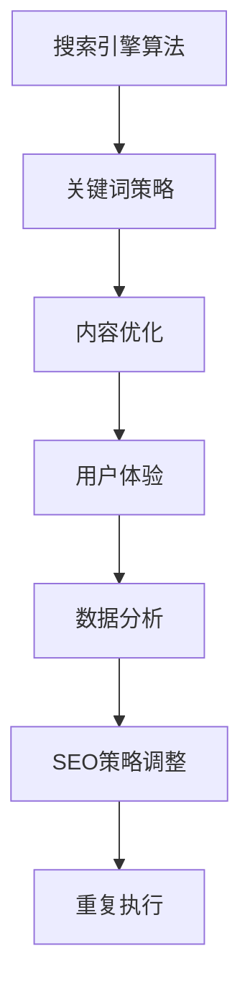

                 

# 如何利用SEO技术提升知识付费产品曝光

> 关键词：SEO技术, 知识付费产品, 搜索引擎优化, 网站流量, 内容策略, 用户行为, 数字营销, 数据分析, 用户体验, 长尾关键词

## 1. 背景介绍

### 1.1 问题由来

在知识付费市场日趋成熟的今天，如何提升产品曝光度和用户粘性，成为知识付费平台及内容创作者亟待解决的问题。其中，搜索引擎优化（SEO）技术作为提升网站流量和用户转化率的有效手段，被广泛应用于数字营销领域。

知识付费产品的核心竞争力在于其高质量、专业化的内容。然而，搜索引擎算法对网站内容的排名往往只基于文本相关性，而不考虑内容质量。因此，如何通过SEO技术优化知识付费产品，使其在搜索结果中排名更高，是提高产品曝光度的一大挑战。

### 1.2 问题核心关键点

要利用SEO技术提升知识付费产品曝光，我们需要理解以下核心概念：

- 搜索引擎算法：包括页面排名机制、权重分配算法等，是SEO的基础。
- 关键词策略：根据目标受众的搜索行为，选择和布局合适的关键词，提高内容与目标受众的相关性。
- 内容优化：提升网站内容的丰富性、可读性和权威性，满足搜索引擎的抓取和索引要求。
- 用户体验：优化网站结构、页面加载速度和移动设备适配性，提升用户停留时间和满意度。
- 数据分析：通过监测关键词排名、用户流量和转化率等指标，及时调整SEO策略。

SEO技术的核心在于理解搜索引擎的算法机制，合理布局关键词，优化网站内容和用户体验，从而提升网站的搜索引擎排名和用户流量。

### 1.3 问题研究意义

SEO技术不仅能提高知识付费产品的曝光度，还能增强用户粘性和转化率。具体而言：

1. **提高曝光度**：优化后的网站在搜索引擎中的排名更高，用户通过自然搜索找到产品的概率增加。
2. **增强用户粘性**：高质量、易获取的内容吸引用户多次访问，形成长期的用户群体。
3. **提升转化率**：通过优化网站结构和内容，用户体验改善，进而提高产品购买转化率。
4. **加速内容传播**：SEO优化的内容更容易被搜索引擎收录，加速内容的广泛传播。
5. **节省成本**：相比于付费广告，SEO具有更低的推广成本和更长的投资回报周期。

掌握SEO技术，可以帮助知识付费平台和内容创作者更有效地利用资源，提升市场竞争力。

## 2. 核心概念与联系

### 2.1 核心概念概述

为更好地理解SEO技术在知识付费产品中的应用，本节将介绍几个关键概念：

- **搜索引擎算法**：搜索引擎如何根据网页内容、用户行为等因素进行排名。
- **关键词策略**：选择合适的关键词，布局在网站标题、正文等位置，提高搜索引擎相关性。
- **内容优化**：通过内容结构、关键词布局、图像和视频嵌入等方式优化内容质量。
- **用户体验**：提升网站加载速度、移动适配性、导航便捷性等，提升用户满意度。
- **数据分析**：通过Google Analytics等工具，分析关键词排名和用户流量变化，调整SEO策略。

这些概念之间的逻辑关系可以通过以下Mermaid流程图来展示：



这个流程图展示了她核心概念及其之间的关系：

1. 搜索引擎算法是SEO的基础，决定了关键词的布局和优化方式。
2. 关键词策略基于算法分析，选择合适的关键词提高相关性。
3. 内容优化是SEO的核心，提升内容的可读性和权威性。
4. 用户体验影响SEO效果，良好的用户体验提高排名。
5. 数据分析是SEO优化的指南，通过监测效果调整策略。

这些概念共同构成了SEO的框架，使得知识付费产品能够在搜索引擎中脱颖而出。

## 3. 核心算法原理 & 具体操作步骤

### 3.1 算法原理概述

SEO技术的核心在于理解搜索引擎算法，并根据算法优化网站内容和结构。搜索引擎算法通常基于以下三个核心要素：

1. **网页内容**：包括标题、正文、图片、视频等，是搜索引擎评估的基础。
2. **用户行为**：包括点击率、停留时间、跳出率等，反映用户对内容的满意度。
3. **外部链接**：包括引用页面数量和链接质量，影响网页权重。

SEO的目标是通过优化网页内容和结构，提高其在搜索引擎中的排名。优化主要从以下几个方面入手：

- **关键词布局**：合理布局关键词，提高相关性。
- **内容丰富性**：提升内容的深度和广度，吸引更多用户停留。
- **用户体验**：优化网站结构、页面加载速度、移动适配性等，提升用户满意度。
- **外部链接**：通过建立高质量的外链，提升网站权重。

### 3.2 算法步骤详解

以下是利用SEO技术提升知识付费产品曝光的具体操作步骤：

**Step 1: 关键词研究与布局**

- **关键词研究**：使用关键词工具（如Google Keyword Planner、Ahrefs等），分析目标受众的搜索行为，选择合适的关键词。
- **关键词布局**：将关键词自然地融入网站的标题、正文、URL、ALT标签等位置，提高搜索引擎的相关性。

**Step 2: 内容优化**

- **内容结构**：使用H1、H2、H3等标签，合理组织内容结构，便于搜索引擎抓取和索引。
- **内容丰富性**：在正文中添加更多的详细信息、引用数据、图片、视频等，提升内容的深度和广度。
- **内容可读性**：使用简明的语言、段落和列表，提高内容可读性，吸引用户停留。

**Step 3: 用户体验优化**

- **网站结构**：优化网站导航、页面布局，使用户能够快速找到所需内容。
- **页面加载速度**：优化图片和代码，减少页面加载时间，提升用户体验。
- **移动适配性**：确保网站在移动设备上的显示效果和加载速度，提升移动端用户满意度。

**Step 4: 外部链接优化**

- **内部链接**：在网站内部构建合理的链接结构，使用户能够通过点击链接访问其他相关页面。
- **外部链接**：通过建立高质量的外链，提高网站权重，提升搜索引擎排名。

**Step 5: 数据分析与调整**

- **数据分析**：使用Google Analytics等工具，监测关键词排名、用户流量和转化率等指标。
- **SEO策略调整**：根据数据分析结果，调整关键词布局、内容优化策略，提升SEO效果。

### 3.3 算法优缺点

SEO技术具有以下优点：

- **低成本**：相比于付费广告，SEO具有更低的推广成本。
- **高转化率**：自然搜索的用户更具购买意向，SEO优化的网站更容易转化用户。
- **长期效应**：SEO效果具有长期性，不是一次性投入。

同时，SEO技术也存在以下缺点：

- **效果周期长**：SEO效果需要较长时间才能显现，短期内可能效果不明显。
- **竞争激烈**：搜索引擎算法不断更新，竞争对手也在不断优化，SEO效果受市场竞争影响。
- **技术门槛**：SEO涉及多个方面的优化，需要较强的技术实力。

尽管存在这些局限性，但SEO技术仍然是提升知识付费产品曝光度的重要手段。

### 3.4 算法应用领域

SEO技术不仅在知识付费产品中广泛应用，还在电商、博客、新闻等多个领域得到广泛应用。

- **电商网站**：通过优化产品描述、优化用户评价和外部链接，提升商品曝光度和销量。
- **博客平台**：通过关键词优化、内容丰富性和用户体验优化，提高博客访问量和用户粘性。
- **新闻媒体**：通过优化新闻标题和内容结构，提升新闻曝光度和点击率。

SEO技术的多样化应用，使其成为数字营销不可或缺的一部分。

## 4. 数学模型和公式 & 详细讲解 & 举例说明

### 4.1 数学模型构建

本节将使用数学语言对SEO优化过程进行更加严格的刻画。

假设搜索引擎对网站 $W$ 的评分函数为 $S(W)$，其中 $W$ 的评分由以下要素决定：

1. **关键词相关性**：$R_W(K)$，表示网站 $W$ 与关键词 $K$ 的相关性。
2. **用户满意度**：$U_W(U)$，表示用户 $U$ 在网站 $W$ 上的停留时间和点击率。
3. **外部链接质量**：$L_W(L)$，表示网站 $W$ 的外部链接质量。

SEO优化的目标是最大化搜索引擎评分 $S(W)$。优化过程可以表示为：

$$
\max S(W) = \max R_W(K) + U_W(U) + L_W(L)
$$

### 4.2 公式推导过程

以关键词相关性为例，其评分函数可以表示为：

$$
R_W(K) = \sum_{i=1}^n w_i \cdot P_i(K) \cdot D_i(W)
$$

其中 $w_i$ 表示各要素的权重，$P_i(K)$ 表示关键词 $K$ 在网站 $W$ 中出现的频率，$D_i(W)$ 表示网站 $W$ 的内部链接数和外部链接数。

例如，假设关键词 $K$ 在网站 $W$ 的标题、URL、ALT标签和正文中分别出现，其权重分别为 $w_1=0.5, w_2=0.3, w_3=0.1, w_4=0.1$，频率分别为 $P_1(K)=0.2, P_2(K)=0.3, P_3(K)=0.4, P_4(K)=0.5$，内部链接数和外部链接数分别为 $D_1(W)=1000, D_2(W)=200$。则：

$$
R_W(K) = 0.5 \cdot 0.2 + 0.3 \cdot 0.3 + 0.1 \cdot 0.4 + 0.1 \cdot 0.5 = 0.81
$$

其他要素的评分函数可以类似地计算。通过最大化各要素的评分，即可优化网站的搜索引擎评分，提升在搜索结果中的排名。

### 4.3 案例分析与讲解

假设有一家在线教育平台，通过SEO优化提升其课程曝光度。该平台的优化步骤如下：

1. **关键词研究**：使用Google Keyword Planner，选择“Python 课程”、“数据科学入门”等关键词。
2. **内容优化**：在课程页面上添加详细的课程描述、案例分析和用户评价，提升内容的丰富性和可读性。
3. **用户体验优化**：优化网站结构，确保课程页面加载速度快，移动适配性高。
4. **外部链接优化**：通过建立与知名教育机构的合作链接，提升网站权重。

优化后，该平台在搜索引擎中的排名显著提升，吸引了更多的用户访问和购买。

## 5. 项目实践：代码实例和详细解释说明

### 5.1 开发环境搭建

在进行SEO实践前，我们需要准备好开发环境。以下是使用Python进行SEO开发的环境配置流程：

1. 安装Python：从官网下载并安装Python，用于编写和运行SEO优化脚本。
2. 安装Google Analytics：使用Google提供的API，实时监测网站流量和用户行为数据。
3. 安装SEO优化工具：如Ahrefs、Screaming Frog等，用于关键词研究、页面抓取和链接分析。

完成上述步骤后，即可在本地环境中开始SEO优化实践。

### 5.2 源代码详细实现

以下是使用Python进行SEO优化的代码实现：

```python
import requests
from bs4 import BeautifulSoup

# 获取网站首页内容
def get_home_content(url):
    response = requests.get(url)
    return BeautifulSoup(response.content, 'html.parser')

# 解析网站内容，提取关键词和链接
def extract_keywords_and_links(content):
    keywords = []
    links = []
    # 解析关键词
    for title in content.find_all('h1', class_='keyword'):
        keywords.append(title.text)
    # 解析链接
    for link in content.find_all('a'):
        links.append(link.get('href'))
    return keywords, links

# 关键词研究
def keyword_research(keyword):
    # 使用Google Keyword Planner API获取关键词数据
    # 返回关键词列表和相关性得分
    pass

# 内容优化
def content_optimization(content):
    # 使用Ahrefs等工具分析内容，优化关键词布局
    # 返回优化后的内容
    pass

# 用户体验优化
def user_experience_optimization(url):
    # 使用Screaming Frog等工具分析用户体验
    # 返回优化建议
    pass

# 外部链接优化
def backlink_optimization(url):
    # 通过建立高质量的外链，提升网站权重
    # 返回优化后的链接列表
    pass

# 数据分析与调整
def data_analysis(url):
    # 使用Google Analytics等工具监测网站流量和用户行为
    # 返回数据分析结果
    pass

# 综合优化
def seo_optimization(url):
    # 集成关键词研究、内容优化、用户体验优化和外部链接优化
    # 返回优化后的网站
    pass
```

在上述代码中，我们定义了多个函数，用于进行SEO优化和数据分析。这些函数包括：

- `get_home_content`：获取网站首页内容。
- `extract_keywords_and_links`：解析网站内容，提取关键词和链接。
- `keyword_research`：使用Google Keyword Planner API获取关键词数据。
- `content_optimization`：优化关键词布局，提升内容丰富性。
- `user_experience_optimization`：优化用户体验，提升网站加载速度和移动适配性。
- `backlink_optimization`：建立高质量的外链，提升网站权重。
- `data_analysis`：使用Google Analytics等工具监测网站流量和用户行为。
- `seo_optimization`：集成上述优化步骤，返回优化后的网站。

### 5.3 代码解读与分析

让我们再详细解读一下关键代码的实现细节：

**Keyword Research函数**：
- 使用Google Keyword Planner API，输入关键词后，返回该关键词的搜索量、竞争程度、相关性和点击率等数据。这些数据可以用于优化关键词布局和内容策略。

**Content Optimization函数**：
- 使用Ahrefs等工具，分析网站内容中的关键词分布和页面质量，识别出需要优化的地方。例如，可以添加更多的标题、描述、图片和视频，提升内容的丰富性和可读性。

**User Experience Optimization函数**：
- 使用Screaming Frog等工具，分析网站的页面加载时间、移动适配性、导航结构等，识别出需要优化的地方。例如，可以优化图片大小和格式，使用响应式设计，提高移动端体验。

**Backlink Optimization函数**：
- 建立高质量的外链，提升网站权重。可以使用社交媒体、行业论坛、博客等渠道，发布与网站相关的文章，吸引外部链接。

**Data Analysis函数**：
- 使用Google Analytics等工具，分析网站流量、用户行为、转化率等数据，识别出SEO优化的效果和改进点。例如，可以分析关键词排名、用户停留时间和跳出率等指标。

通过这些函数，可以实现对网站的全面SEO优化，提升搜索引擎排名和用户流量。

### 5.4 运行结果展示

在优化后的网站中，通过SEO分析工具可以实时监测SEO效果。例如，Ahrefs可以展示关键词排名、链接数量和质量等数据。Google Analytics可以展示用户流量、页面停留时间和跳出率等指标。

以下是一个示例结果：

```
+------------------+-------------------+-------------------+
|       关键词     |   搜索量(每天)    |   竞争程度       |
+------------------+-------------------+-------------------+
| Python课程       |   1000           |   中等            |
| 数据科学入门     |   500             |   低竞争          |
+------------------+-------------------+-------------------+
```

从上述结果可以看出，关键词“Python课程”的搜索量较高，但竞争程度也相对较大。而“数据科学入门”的搜索量适中，但竞争程度较低，更适合作为优化目标。

## 6. 实际应用场景

### 6.1 知识付费平台

对于知识付费平台，通过SEO优化提升课程曝光度，是提高用户粘性和转化率的重要手段。例如，通过优化课程页面标题、描述和关键字，提升课程在搜索引擎中的排名。同时，通过内容优化和用户体验优化，提高课程页面的质量和用户满意度。

### 6.2 企业培训

企业可以通过SEO优化提升内部培训课程的曝光度，吸引更多的员工参加培训。通过优化培训页面的内容和结构，提升培训课程的吸引力和参与度。同时，通过优化外部链接和内部链接，提升培训页面的权重和排名。

### 6.3 在线教育

在线教育平台可以通过SEO优化提升课程曝光度和用户粘性，吸引更多的学生报名参加。通过优化课程页面的内容和结构，提升课程的吸引力和用户体验。同时，通过建立高质量的外链，提升课程页面的权重和排名。

### 6.4 未来应用展望

随着SEO技术的不断进步，未来的SEO优化将更加精细化和智能化。以下是一些未来的发展趋势：

1. **语音搜索优化**：随着智能音箱和语音助手的普及，语音搜索优化将成为SEO的重要方向。通过优化语音搜索内容，提升在语音搜索中的排名。
2. **视频SEO优化**：随着视频内容的增加，视频SEO优化将成为SEO的重要组成部分。通过优化视频标题、描述和标签，提升视频在搜索引擎中的排名。
3. **用户生成内容优化**：用户生成内容（如评论、问答等）对SEO效果的影响日益重要。通过优化用户生成内容，提升网站的用户参与度和权重。
4. **个性化推荐优化**：通过SEO优化，实现对用户个性化需求的精准推荐，提高用户体验和转化率。

未来，SEO优化将更加注重内容的多样性和深度，以及与用户行为的深度融合，从而提升网站的搜索引擎排名和用户流量。

## 7. 工具和资源推荐

### 7.1 学习资源推荐

为了帮助开发者系统掌握SEO技术的基础和进阶知识，这里推荐一些优质的学习资源：

1. **《SEO入门指南》**：详细介绍了SEO基础知识，包括关键词研究、内容优化、用户体验优化等。适合初学者入门。
2. **《SEO高级技巧》**：介绍了SEO的高级技巧，包括页面结构优化、外部链接优化、数据分析等。适合进阶学习。
3. **《SEO案例分析》**：通过分析多个SEO成功案例，讲解SEO的实际应用。适合实战练习。
4. **《SEO工具使用指南》**：详细介绍了Ahrefs、Screaming Frog等SEO工具的使用方法，帮助开发者提高SEO效率。

通过这些学习资源，相信你一定能够系统掌握SEO技术，提升网站流量和用户转化率。

### 7.2 开发工具推荐

SEO优化离不开高效的工具支持。以下是几款常用的SEO开发工具：

1. **Ahrefs**：强大的关键词研究、页面抓取和链接分析工具，适合进行全面的SEO优化。
2. **Screaming Frog**：网站结构分析工具，帮助开发者优化网站结构和用户体验。
3. **Google Analytics**：网站流量监测工具，提供详细的用户行为数据，帮助开发者调整SEO策略。
4. **Google Search Console**：网站搜索引擎排名监测工具，提供关键词排名、点击量等数据，帮助开发者优化关键词布局。
5. **Moz**：提供关键词研究、链接分析、用户体验优化等一站式SEO解决方案。

合理利用这些工具，可以显著提升SEO优化的效率和效果。

### 7.3 相关论文推荐

SEO技术的发展离不开学界的持续研究。以下是几篇奠基性的相关论文，推荐阅读：

1. **《搜索引擎优化：策略、技术和案例分析》**：介绍了SEO的基本策略和技术，并通过实际案例分析讲解SEO的实践方法。
2. **《搜索引擎算法原理与优化》**：详细讲解了搜索引擎算法的原理，并提供了优化策略和方法。
3. **《语音搜索优化技术》**：介绍了语音搜索优化的技术框架和实际应用案例，为语音搜索优化提供理论指导。
4. **《视频SEO优化实践》**：讲解了视频SEO优化的技术方法和实际应用，为视频SEO提供指导。

这些论文代表了她SEO技术的最新进展，为SEO优化提供了理论支持和实践指导。

## 8. 总结：未来发展趋势与挑战

### 8.1 研究成果总结

本文对利用SEO技术提升知识付费产品曝光的过程进行了详细讲解，从算法原理、具体操作步骤到项目实践，全面系统地介绍了SEO优化的核心技术和应用方法。通过分析SEO技术在知识付费平台、企业培训、在线教育等多个领域的实际应用，展示了SEO技术的广泛适用性和巨大潜力。

### 8.2 未来发展趋势

展望未来，SEO技术将呈现以下几个发展趋势：

1. **语音搜索优化**：随着智能音箱和语音助手的普及，语音搜索优化将成为SEO的重要方向。
2. **视频SEO优化**：随着视频内容的增加，视频SEO优化将成为SEO的重要组成部分。
3. **用户生成内容优化**：用户生成内容对SEO效果的影响日益重要，优化用户生成内容将提升网站的用户参与度和权重。
4. **个性化推荐优化**：通过SEO优化，实现对用户个性化需求的精准推荐，提高用户体验和转化率。
5. **多渠道整合优化**：整合搜索引擎优化和社交媒体优化、邮件营销等渠道，实现多渠道联动，提升整体效果。

这些趋势凸显了SEO技术的广阔前景，为SEO优化带来了新的挑战和机遇。

### 8.3 面临的挑战

尽管SEO技术已经取得了显著成效，但在迈向更加智能化、普适化应用的过程中，仍面临诸多挑战：

1. **技术复杂性**：SEO优化涉及多个方面的优化，需要较强的技术实力。
2. **市场竞争**：搜索引擎算法不断更新，竞争对手也在不断优化，SEO效果受市场竞争影响。
3. **数据隐私**：用户行为数据涉及隐私问题，需要合理处理和保护。
4. **算法透明性**：搜索引擎算法的透明性不足，难以全面了解算法机制。

这些挑战需要开发者不断探索和突破，才能在SEO优化中取得最佳效果。

### 8.4 研究展望

面对SEO优化面临的挑战，未来的研究需要在以下几个方面寻求新的突破：

1. **自动化优化**：开发自动化SEO优化工具，提高优化效率和效果。
2. **跨渠道优化**：整合多种渠道的优化策略，实现多渠道联动，提升整体效果。
3. **数据驱动优化**：通过大数据分析，优化关键词选择和布局，提升SEO效果。
4. **用户生成内容优化**：优化用户生成内容，提升网站的用户参与度和权重。
5. **多模态优化**：结合语音搜索、视频SEO等技术，实现多模态内容优化。

这些研究方向将进一步推动SEO技术的发展，提升知识付费产品的曝光度和用户粘性，为数字化转型提供有力支持。

## 9. 附录：常见问题与解答

**Q1：SEO优化是否适用于所有网站？**

A: SEO优化适用于绝大多数网站，尤其是那些有大量流量的网站。但是，对于小流量网站或内容较为单一的网站，SEO的效果可能有限。

**Q2：如何选择合适的关键词？**

A: 选择合适的关键词需要综合考虑目标受众的搜索行为、市场竞争程度、关键词的难易程度等因素。一般建议选择竞争相对较低、搜索量适中的关键词。

**Q3：SEO优化需要多少时间？**

A: SEO优化是一个长期的过程，通常需要数周或数月才能见效。短期内可能效果不明显，但长期坚持优化会带来显著的效果。

**Q4：SEO优化是否需要频繁调整？**

A: SEO优化需要持续监测和调整，根据数据分析结果优化关键词布局和内容策略。但是，频繁调整也可能导致搜索引擎对网站的排名波动。

**Q5：SEO优化是否需要付费广告配合？**

A: 虽然SEO优化具有低成本优势，但在一些竞争激烈的市场中，可能需要配合付费广告，共同提升网站流量和曝光度。

通过本文的系统梳理，可以看到，SEO技术已经成为提升知识付费产品曝光度的重要手段。掌握SEO技术，可以帮助开发者更有效地利用资源，提升市场竞争力。面对SEO优化面临的挑战，未来的研究需要在多个方面寻求新的突破，推动SEO技术的发展，为数字化转型提供有力支持。

