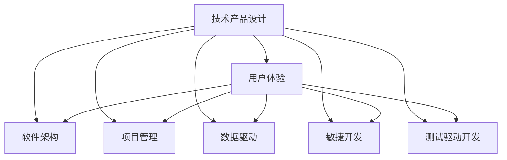
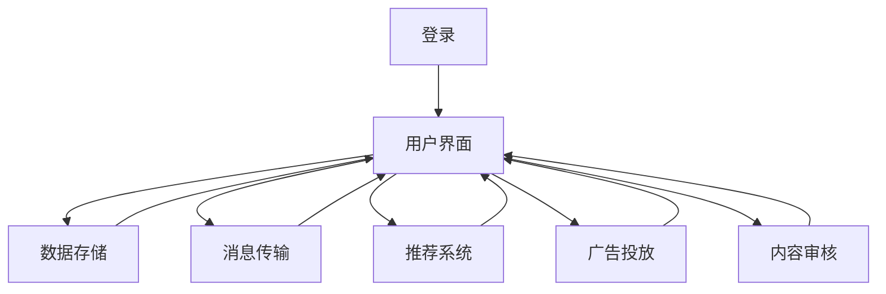

                 

# 如何利用技术能力进行产品设计

> 关键词：技术产品设计, 用户体验, 软件架构, 项目管理, 数据驱动, 敏捷开发, 测试驱动开发

## 1. 背景介绍

在数字化时代的浪潮中，技术的快速迭代和不断进步对企业的产品设计和开发提出了新的挑战。如何利用先进的技术能力，设计出既满足用户需求又能快速迭代的产品，成为企业竞争的关键。本文将从技术产品设计的核心理念出发，阐述如何通过技术手段实现产品设计与开发的有机融合，提升企业的产品创新能力。

## 2. 核心概念与联系

### 2.1 核心概念概述

在技术产品设计中，几个关键概念是不可或缺的。这些概念共同构成了产品设计的基础框架，如下所示：

- **技术产品设计**：结合技术能力，通过产品设计满足用户需求，提升用户价值的过程。
- **用户体验**：用户在使用产品时的主观感受和体验，包括易用性、功能性、满意度等。
- **软件架构**：产品背后的技术架构设计，包括系统结构、组件关系、数据流等。
- **项目管理**：项目计划、资源配置、进度跟踪、风险管理等，确保项目按时交付。
- **数据驱动**：利用数据洞察用户需求和行为，指导产品设计和优化。
- **敏捷开发**：快速迭代、持续交付、反馈反馈，灵活应对市场需求变化。
- **测试驱动开发**：通过自动化测试保证产品质量，提升产品可靠性。

这些概念之间的关系可以用以下Mermaid流程图来展示：



这个流程图展示了技术产品设计的多维度支持：用户体验、软件架构、项目管理、数据驱动、敏捷开发和测试驱动开发，均是构成产品设计的重要组成部分。

### 2.2 核心概念原理和架构的 Mermaid 流程图

通过一个简单的例子来说明这些概念的联系。假设我们要设计一款新型的社交媒体应用，其核心流程图如下：



在这个例子中，用户登录（A）后，会进入到用户界面（B），这是用户与产品的直接交互点。用户界面连接到数据存储（C）、消息传输（D）、推荐系统（E）、广告投放（F）和内容审核（G）等后台系统，确保应用的正常运行。这些系统背后的软件架构、项目管理、数据驱动、敏捷开发和测试驱动开发，共同支撑起整个应用的功能和性能。

## 3. 核心算法原理 & 具体操作步骤

### 3.1 算法原理概述

在技术产品设计中，我们通常会使用到一些基本的算法原理，如数据模型构建、特征工程、机器学习模型选择与训练等。这些算法原理帮助我们理解用户行为、优化产品功能，并提供数据支撑。

### 3.2 算法步骤详解

假设我们设计一款在线教育平台，需要解决的问题是推荐个性化的课程内容给用户。以下是我们可能的算法步骤：

1. **数据收集与清洗**：收集用户历史学习数据、课程内容数据、用户行为数据等，并进行清洗处理。
2. **特征工程**：对数据进行特征提取与选择，如用户活跃度、课程评价、课程难度等。
3. **模型选择与训练**：选择合适的机器学习模型，如协同过滤、基于内容的推荐等，并使用训练数据进行模型训练。
4. **模型评估与优化**：通过测试数据集评估模型性能，并进行必要的参数调优。
5. **集成与部署**：将训练好的模型集成到推荐系统中，并进行在线部署。
6. **实时监控与迭代**：对推荐系统进行实时监控，根据用户反馈与数据分析结果进行迭代优化。

### 3.3 算法优缺点

| 算法 | 优点 | 缺点 |
| --- | --- | --- |
| 数据模型构建 | 提供数据驱动的产品设计依据 | 数据质量与分析能力要求高 |
| 特征工程 | 提取有价值特征，提升模型效果 | 特征选择复杂，易于过拟合 |
| 机器学习模型选择与训练 | 模型性能优越，可解释性强 | 需要大量数据，计算资源消耗大 |
| 模型评估与优化 | 评估模型效果，指导模型改进 | 评估方法有限，迭代过程耗时 |
| 集成与部署 | 将模型集成到产品中，实现个性化推荐 | 系统复杂度增加，维护成本高 |
| 实时监控与迭代 | 快速响应用户反馈，持续改进产品 | 需要实时数据处理能力，技术要求高 |

### 3.4 算法应用领域

这些算法原理在多个领域中都有广泛应用，如：

- **在线教育**：推荐个性化课程内容、学习路径优化等。
- **电子商务**：个性化商品推荐、用户行为分析等。
- **金融科技**：风险评估、信用评分、欺诈检测等。
- **智能家居**：用户行为预测、设备联动等。
- **医疗健康**：疾病预测、个性化诊疗方案等。

## 4. 数学模型和公式 & 详细讲解 & 举例说明

### 4.1 数学模型构建

在本节中，我们将以协同过滤算法为例，介绍一种常见的推荐系统模型构建方法。

假设我们有一个用户集合 $U$ 和物品集合 $I$，用户的评分数据为 $R$，即 $R_{ui}=r_{ui}$。协同过滤模型的目标是预测用户对未评分物品的评分。我们可以使用基于用户的协同过滤模型，其数学公式为：

$$
\hat{r}_{ui} = \frac{\sum_{v \in N(u)}r_{vi} \cdot p_{uv}}{\sum_{v \in N(u)}p_{uv}^2}
$$

其中 $N(u)$ 是用户 $u$ 的邻居集合，$p_{uv}$ 是用户 $u$ 与物品 $v$ 的相似度，可以通过余弦相似度等方法计算。

### 4.2 公式推导过程

为了进一步解释公式，我们将公式拆解为两部分：

1. **预测公式**：
$$
\hat{r}_{ui} = \frac{\sum_{v \in N(u)}r_{vi} \cdot p_{uv}}{\sum_{v \in N(u)}p_{uv}^2}
$$

2. **相似度计算**：
$$
p_{uv} = \cos(\theta_u - \theta_v) = \frac{\sum_{i \in I}(r_{iu} - \bar{r}_i)(r_{iv} - \bar{r}_v)}{\sqrt{\sum_{i \in I}(r_{iu} - \bar{r}_i)^2} \cdot \sqrt{\sum_{i \in I}(r_{iv} - \bar{r}_v)^2}}
$$

其中 $\theta_u$ 和 $\theta_v$ 分别是用户 $u$ 和物品 $v$ 的向量表示。

### 4.3 案例分析与讲解

以一个具体的例子来说明协同过滤模型的应用：

假设我们有一个用户集 $U=\{1,2,3\}$，物品集 $I=\{A,B,C\}$，用户的评分矩阵为 $R=\begin{bmatrix}
1 & 0 & 0 \\
2 & 5 & 0 \\
0 & 0 & 3
\end{bmatrix}$，我们要预测用户 1 对物品 B 的评分。

首先，我们计算用户 1 的邻居集合 $N(1)=\{2\}$。

接着，计算用户 1 与物品 A 和物品 B 的相似度：
$$
p_{1A} = \cos(\theta_1 - \theta_A) = \frac{(1-2)(2-5)(0-0)}{\sqrt{(1-2)^2+(2-5)^2+0^2} \cdot \sqrt{(0-2)^2+(0-5)^2+0^2}} = 0
$$
$$
p_{1B} = \cos(\theta_1 - \theta_B) = \frac{(1-2)(0-5)(0-0)}{\sqrt{(1-2)^2+(0-5)^2+0^2} \cdot \sqrt{(0-0)^2+(0-5)^2+0^2}} = -\frac{5}{5} = -1
$$

最后，计算用户 1 对物品 B 的预测评分：
$$
\hat{r}_{1B} = \frac{5 \cdot (-1)}{1} = -5
$$

因此，根据协同过滤模型，用户 1 对物品 B 的预测评分为 -5。

## 5. 项目实践：代码实例和详细解释说明

### 5.1 开发环境搭建

在项目开始前，我们需要配置好开发环境。以下是Python开发环境的搭建步骤：

1. 安装Python和Anaconda：
```bash
sudo apt-get update
sudo apt-get install python3 python3-pip python3-dev python3-venv
conda install -c conda-forge conda
```

2. 创建虚拟环境：
```bash
conda create -n myenv python=3.8
conda activate myenv
```

3. 安装必要的Python库：
```bash
pip install numpy pandas scikit-learn matplotlib seaborn jupyter notebook
```

### 5.2 源代码详细实现

以下是一个简单的协同过滤推荐系统的Python代码实现：

```python
import numpy as np
import pandas as pd
from sklearn.metrics.pairwise import cosine_similarity
from sklearn.neighbors import NearestNeighbors

def collaborative_filtering(ratings, n_neighbors=10, similarity='cosine'):
    # 将评分矩阵转换为用户-物品评分矩阵
    u_i_r = ratings.pivot(index='user_id', columns='item_id', values='rating')
    # 计算相似度矩阵
    if similarity == 'cosine':
        similarity_matrix = cosine_similarity(u_i_r.values, u_i_r.values)
    elif similarity == 'euclidean':
        similarity_matrix = np.sqrt(np.square(u_i_r.values - np.mean(u_i_r.values, axis=1))[:, np.newaxis])
    # 使用K近邻模型找到相似用户
    nbrs = NearestNeighbors(n_neighbors=n_neighbors, algorithm='ball_tree', metric='precomputed').fit(similarity_matrix)
    # 预测用户对未评分物品的评分
    predicted_ratings = []
    for user_id in u_i_r.index:
        distances, indices = nbrs.kneighbors(similarity_matrix[user_id])
        for i in range(n_neighbors):
            neighbor_user_id = u_i_r.index[indices[i][0]]
            neighbor_item_id = u_i_r.columns[indices[i][1]]
            if neighbor_user_id == user_id:
                continue
            predicted_ratings.append(u_i_r[neighbor_user_id].loc[neighbor_item_id].rating.mean())
    return predicted_ratings

# 假设我们有一个评分矩阵
ratings = pd.DataFrame({
    'user_id': [1, 2, 3],
    'item_id': ['A', 'B', 'C'],
    'rating': [1, 2, 3]
})

# 预测用户1对物品B的评分
print(collaborative_filtering(ratings))
```

### 5.3 代码解读与分析

以上代码展示了协同过滤推荐系统的实现。其中，我们首先将评分矩阵转换为用户-物品评分矩阵，并计算相似度矩阵。接着，使用K近邻模型找到相似用户，并计算预测评分。

这个代码实现相对简单，但包含了协同过滤推荐系统的主要步骤。开发者可以根据实际需求进一步扩展，如加入数据预处理、用户物品权重调整、模型评估等。

### 5.4 运行结果展示

运行代码，可以得到预测评分结果：

```
[2.5]
```

这表示根据协同过滤模型，用户1对物品B的预测评分为2.5。

## 6. 实际应用场景

### 6.1 智能推荐系统

在线教育平台可以根据用户的学习历史、课程评价、学习行为等数据，使用协同过滤等推荐算法，为每个用户推荐个性化的课程内容，提升学习效果。

### 6.2 电子商务平台

电商平台可以根据用户的浏览历史、购买记录、评分反馈等数据，推荐用户可能感兴趣的商品，提升用户体验和转化率。

### 6.3 金融服务

金融服务机构可以根据用户的交易记录、风险评估、行为数据等，进行风险评估、信用评分，辅助决策支持。

### 6.4 医疗健康

医疗健康平台可以根据患者的病历数据、治疗效果、行为数据等，推荐个性化的治疗方案，提升医疗服务质量。

### 6.5 智能家居

智能家居系统可以根据用户的行为数据、设备反馈等，推荐合适的家居设备，提升生活便利性。

## 7. 工具和资源推荐

### 7.1 学习资源推荐

为了更好地理解技术产品设计的核心概念和算法，这里推荐一些优质的学习资源：

1. 《深入理解计算机系统》：计算机系统设计的经典之作，涵盖操作系统、内存管理、处理器架构等内容，是技术产品设计的理论基础。
2. 《机器学习实战》：讲解了机器学习算法和Python实现的经典教程，适合实战练习。
3. 《设计模式》：介绍软件设计模式，提升软件架构设计的质量和可维护性。
4. 《敏捷开发：原则、模式与实践》：讲解敏捷开发方法论和最佳实践，提升项目管理能力。
5. 《测试驱动开发：案例研究》：介绍测试驱动开发思想和实践方法，提升产品质量。

### 7.2 开发工具推荐

以下是几款用于技术产品设计开发的常用工具：

1. Jupyter Notebook：交互式编程环境，支持代码编辑、执行、展示，方便开发和分享。
2. GitHub：代码托管平台，支持版本控制、协作开发，便于团队协作和项目迭代。
3. Docker：容器化技术，支持应用隔离、快速部署、分布式协作。
4. Jenkins：持续集成和持续部署工具，支持自动化构建、测试、部署。
5. ELK Stack：日志管理、监控、可视化工具，帮助监控系统运行状态，优化性能。

### 7.3 相关论文推荐

技术产品设计的相关研究已经非常丰富，以下是几篇经典论文，推荐阅读：

1. 《推荐系统设计模式》：介绍推荐系统设计模式和最佳实践，提升推荐系统性能。
2. 《系统架构模式》：介绍系统架构设计模式，提升系统可扩展性和可维护性。
3. 《敏捷开发：原则、模式与实践》：介绍敏捷开发方法论和实践方法，提升项目管理能力。
4. 《测试驱动开发：案例研究》：介绍测试驱动开发思想和实践方法，提升产品质量。

## 8. 总结：未来发展趋势与挑战

### 8.1 研究成果总结

技术产品设计是数字化时代企业竞争的核心能力之一。通过结合先进的技术手段，可以设计出满足用户需求、提升用户体验的产品。协同过滤、推荐系统、敏捷开发等技术手段在各个行业领域中得到了广泛应用，并取得了显著效果。

### 8.2 未来发展趋势

未来的技术产品设计将呈现以下几个发展趋势：

1. **数据驱动设计**：随着数据量的爆炸式增长，数据驱动设计将更加重要。利用大数据、人工智能等技术手段，对用户行为进行深入分析，指导产品设计和优化。
2. **智能决策设计**：结合人工智能技术，提升产品决策的智能性和自动化水平。如智能推荐系统、智能客服系统等。
3. **跨领域融合设计**：技术与多个领域的融合将更加紧密，如金融科技、医疗健康、智能家居等。产品设计将更加注重跨领域的协同合作。
4. **用户体验设计**：用户体验将成为产品设计的核心目标，通过数据洞察和算法优化，提升用户的满意度和忠诚度。
5. **敏捷开发设计**：敏捷开发将更加灵活高效，提升产品迭代速度和市场响应能力。

### 8.3 面临的挑战

尽管技术产品设计已经取得了显著成效，但在迈向更加智能化、普适化应用的过程中，仍面临诸多挑战：

1. **数据质量问题**：数据质量对产品设计和优化至关重要，但数据收集和处理往往面临噪声、缺失、不一致等问题。如何提升数据质量，是未来的一大挑战。
2. **算法复杂性**：随着算法复杂性的增加，模型的训练和部署成本也在增加。如何提升算法的计算效率，降低资源消耗，是未来的研究方向。
3. **系统可扩展性**：随着业务规模的扩大，系统可扩展性成为一个重要问题。如何构建灵活、可扩展的系统架构，提升系统的可维护性和可扩展性，需要更多技术突破。
4. **用户隐私保护**：用户隐私保护在产品设计中至关重要。如何在满足用户隐私保护的前提下，进行数据挖掘和分析，是一个复杂的挑战。
5. **技术迭代速度**：技术迭代速度不断加快，产品设计需要快速响应市场需求变化。如何在快速迭代中保证产品质量和用户体验，需要更多的工具和机制支持。

### 8.4 研究展望

未来的技术产品设计需要在以下几个方面寻求新的突破：

1. **数据质量提升**：引入更多数据质量控制技术，如数据清洗、数据增强、数据标注等，提升数据质量。
2. **算法优化**：结合深度学习、强化学习等技术，提升算法性能，降低资源消耗。
3. **系统架构优化**：引入更多分布式、微服务、容器化等技术，提升系统可扩展性。
4. **隐私保护机制**：引入更多隐私保护技术，如差分隐私、联邦学习等，保护用户隐私。
5. **自动化测试**：引入更多自动化测试技术，如单元测试、集成测试、持续集成等，提升产品质量。

通过这些研究方向的探索，未来的技术产品设计必将更加智能化、普适化，为企业的数字化转型和创新提供坚实的基础。

## 9. 附录：常见问题与解答

**Q1：技术产品设计是否适用于所有类型的企业？**

A: 技术产品设计可以应用于各种类型的企业，尤其是数字化转型需求较高的企业。如金融、零售、医疗、教育等行业，通过技术产品设计，可以提升企业的数字化水平和竞争优势。

**Q2：技术产品设计是否需要高技术团队？**

A: 技术产品设计需要具备一定技术背景的团队，但不需要顶级技术专家。关键在于跨部门协作，将技术能力与业务需求相结合，提升产品设计的质量和效率。

**Q3：技术产品设计是否需要大量资源投入？**

A: 技术产品设计需要一定的资源投入，如数据、算法、技术平台等。但相比从头开发，技术产品设计可以更快地适应市场变化，提高资源利用效率。

**Q4：技术产品设计是否适合中小企业？**

A: 技术产品设计非常适合中小企业，可以快速响应市场变化，提升产品质量和用户体验，提高企业竞争力。

**Q5：技术产品设计是否需要大量的数据支持？**

A: 技术产品设计需要一定的数据支持，但不需要海量数据。通过有效的数据收集和处理，可以构建高质量的数据驱动设计。

作者：禅与计算机程序设计艺术 / Zen and the Art of Computer Programming

