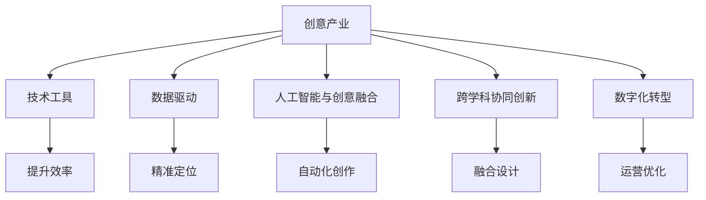

                 

# 如何利用技术能力进行创意产业革新

> 关键词：创意产业,技术创新,人工智能,机器学习,创意工具,数字化转型

## 1. 背景介绍

### 1.1 问题由来
近年来，随着科技的迅猛发展，特别是人工智能(AI)、机器学习(ML)技术的成熟，全球创意产业正在经历前所未有的变革。传统创意产业的产业链条、生产方式、产品形态都在发生深刻变化。数字化、智能化、个性化成为引领创意产业转型升级的新趋势。如何利用技术能力推动创意产业革新，提升产业的创新能力和市场竞争力，成为业界和学术界关注的焦点。

### 1.2 问题核心关键点
创意产业革新离不开技术创新，具体关键点如下：
- 技术工具的开发与使用：通过构建定制化的技术工具，提升创意工作者的工作效率，促进创意内容的多样化和创新性。
- 数据驱动的创意创新：利用大数据、云计算等技术，分析用户需求，驱动创意内容的精准定位和多样化表达。
- 人工智能与创意的融合：将AI技术应用于创意过程，实现自动化、智能化创作，提高创意生产的效率和质量。
- 创意与设计的协同创新：通过跨学科、跨领域的协同创新，实现创意设计与技术应用的深度融合，打造更加创新、多样化的创意产品。
- 创意产业的数字化转型：利用数字化手段，优化创意产业的运营模式，提升产业整体的运营效率和市场竞争力。

### 1.3 问题研究意义
研究创意产业技术革新方法，对于推动产业数字化转型，提升创意内容质量和市场竞争力，具有重要意义：

1. 加速产业创新：通过应用新技术，拓展创意表达形式和传播渠道，加速创意内容创新。
2. 提升生产效率：利用技术工具提高创意工作的效率，减少重复劳动，降低生产成本。
3. 丰富创意内容：借助数据驱动的个性化推荐，提升创意内容的覆盖范围和多样性。
4. 增强市场竞争力：通过技术赋能，提升创意产品的质量与差异化，增强产业的市场竞争力。
5. 实现精准营销：通过数据分析，精准定位目标用户，提升创意产品的市场转化率。

## 2. 核心概念与联系

### 2.1 核心概念概述

为更好地理解技术能力在创意产业革新中的作用，本节将介绍几个密切相关的核心概念：

- 创意产业(Creative Industries)：指通过创意工作创造价值的产业，包括设计、广告、出版、影视、游戏等。
- 技术工具(Technological Tools)：指专门用于辅助创意工作的软件、硬件工具。
- 数据驱动(Data-Driven)：指通过数据采集和分析，驱动创意内容的生产与创新。
- 人工智能与创意融合(AI and Creativity)：指将AI技术应用于创意过程，实现自动化、智能化创作。
- 跨学科协同创新(Interdisciplinary Collaborative Innovation)：指通过不同学科领域的交叉合作，实现创意与设计的深度融合。
- 数字化转型(Digital Transformation)：指利用数字化手段，优化创意产业的运营模式，提升产业整体的运营效率和市场竞争力。

这些核心概念之间的逻辑关系可以通过以下Mermaid流程图来展示：



这个流程图展示了大语言模型的核心概念及其之间的关系：

1. 创意产业通过技术工具、数据驱动、AI融合、跨学科协同、数字化转型，实现创新与升级。
2. 技术工具提升了创意工作的效率。
3. 数据驱动带来了精准的内容定位。
4. AI技术推动了自动化创作。
5. 跨学科协同实现了创新设计的融合。
6. 数字化转型优化了产业运营模式。

这些概念共同构成了创意产业的技术革新框架，为其未来发展提供了清晰的指导方向。

## 3. 核心算法原理 & 具体操作步骤
### 3.1 算法原理概述

技术能力在创意产业革新中的关键作用，体现在如何通过算法和技术手段，提升创意过程的效率、创新性和市场竞争力。基于此，本节将详细介绍几种核心的算法和技术方法：

- 机器学习与创意工具：通过机器学习算法，训练创意工具，提升工具的智能化水平。
- 数据驱动的创意分析：利用大数据技术，分析用户需求，驱动创意内容的多样化和精准化。
- AI与创意融合：通过AI技术，实现自动化、智能化创作，提高创意生产的效率和质量。
- 跨学科协同创新算法：利用算法工具，促进不同学科领域的协同创新，实现创意设计与技术应用的深度融合。

### 3.2 算法步骤详解

基于技术能力对创意产业进行革新的步骤包括：

**Step 1: 数据采集与预处理**
- 收集创意产业相关的数据，如用户行为数据、创意内容数据、市场趋势数据等。
- 对数据进行清洗、标注、归一化等预处理操作，保证数据的质量和可用性。

**Step 2: 技术工具开发**
- 根据创意工作者的需求，设计、开发相应的技术工具，如设计软件、创作平台、数据分析工具等。
- 利用机器学习算法，对工具进行优化和改进，提高工具的智能化水平。

**Step 3: 数据驱动的创意分析**
- 利用大数据技术，对收集的数据进行分析，挖掘用户需求和市场趋势。
- 结合创意产业的特点，驱动创意内容的多样化和精准化。

**Step 4: AI与创意融合**
- 将AI技术应用于创意过程，如自动生成、风格转换、情感分析等，提高创意生产的效率和质量。
- 结合创意产业的实际需求，选择适合的AI算法和工具，进行创意生成和优化。

**Step 5: 跨学科协同创新**
- 通过算法工具，促进不同学科领域的协同创新，如设计、工程、计算机等。
- 实现创意设计与技术应用的深度融合，推动创意产业的多元化发展。

**Step 6: 数字化转型**
- 利用数字化手段，优化创意产业的运营模式，如在线创作平台、云存储、智能客服等。
- 提升产业整体的运营效率和市场竞争力。

### 3.3 算法优缺点

利用技术能力进行创意产业革新的方法具有以下优点：
1. 提升创意效率：技术工具和算法可以显著提高创意工作的效率，减少重复劳动，降低生产成本。
2. 实现精准定位：通过数据驱动，可以实现创意内容的精准定位，提升市场转化率。
3. 创新多样化：AI技术可以实现创意内容的自动化生成和多样化表达，丰富创意内容。
4. 促进协同创新：跨学科算法促进了不同领域之间的合作，推动创意设计与技术应用的深度融合。
5. 优化运营模式：数字化转型优化了创意产业的运营模式，提升整体运营效率和市场竞争力。

同时，该方法也存在一定的局限性：
1. 技术依赖度高：依赖于技术工具和算法的稳定性和可靠性。
2. 数据质量要求高：需要高质量、高量级的数据，以保证算法模型的效果。
3. 技术门槛较高：技术工具和算法的使用需要较高的技术门槛，需要专业人员进行维护和更新。
4. 创新风险大：创意产业的创新具有高风险，技术革新可能带来未知的挑战和变化。
5. 市场适应性差：技术革新可能存在市场适应性问题，创意产品难以快速获得市场认可。

尽管存在这些局限性，但就目前而言，利用技术能力进行创意产业革新仍是推动产业发展的有力手段。未来相关研究的重点在于如何进一步降低技术依赖，提高算法的可解释性和可操作性，以及增强创意内容的差异化与个性化。

### 3.4 算法应用领域

基于技术能力对创意产业进行革新的方法，在多个领域中已经得到了广泛的应用：

- 设计领域：通过智能设计工具，提升设计效率和创意质量，如CAD软件、3D打印等。
- 广告领域：利用数据分析，精准定位广告目标，实现个性化推荐和广告投放优化，如广告算法、程序化广告等。
- 影视领域：通过AI技术，实现自动剪辑、特效生成、情感分析等，提升影视作品的质量和市场竞争力，如自动剪辑软件、虚拟演员等。
- 游戏领域：利用AI技术，实现游戏角色自动生成、剧情推荐、用户行为分析等，提升游戏体验和运营效果，如自动生成游戏地图、智能推荐系统等。
- 出版领域：通过数据分析和智能化编辑工具，提高内容创作和出版的效率和质量，如智能化编辑软件、自动化校对等。
- 创意内容平台：构建基于AI的推荐系统，实现创意内容的多样化和精准化推荐，如Netflix、Spotify等。

除了上述这些经典领域外，技术能力在创意产业的应用还在不断拓展，如智能客服、虚拟助手、创意营销等，为创意产业带来了新的突破。随着技术的不断演进，相信创意产业将迎来更加智能化、个性化的未来。

## 4. 数学模型和公式 & 详细讲解
### 4.1 数学模型构建

本节将使用数学语言对技术能力在创意产业革新中的应用进行更加严格的刻画。

设创意产业的数据集为 $D=\{(x_i, y_i)\}_{i=1}^N, x_i \in X, y_i \in Y$，其中 $x_i$ 为创意作品特征，$y_i$ 为创意作品类别。假设 $f$ 为创意工具或算法模型，其映射函数为 $f: X \rightarrow Y$。

创意产业革新的目标是寻找最优映射函数 $f$，使得 $f$ 能够最大程度地提升创意作品的类别预测准确率。即：

$$
\min_{f \in \mathcal{F}} \mathcal{L}(f, D) = \frac{1}{N}\sum_{i=1}^N \ell(f(x_i), y_i)
$$

其中 $\mathcal{F}$ 为创意工具或算法模型的集合，$\ell$ 为损失函数，衡量模型输出与真实标签之间的差异。

### 4.2 公式推导过程

以下我们以创意内容推荐系统为例，推导基于协同过滤的推荐算法公式。

假设推荐系统有 $M$ 个创意作品，每个作品 $m$ 由 $d$ 个特征 $x_{m,d}$ 描述。用户 $u$ 的兴趣表示为 $r_u$，其中 $r_{u,m}$ 为 $u$ 对作品 $m$ 的兴趣程度。

协同过滤推荐算法的基本思想是，通过用户对作品的兴趣评分，预测其他用户对未评分作品的兴趣。假设 $R$ 为用户对作品的评分矩阵，$R_{u,m}$ 为 $u$ 对 $m$ 的评分。

协同过滤推荐算法中常用的算法包括基于用户的协同过滤算法和基于物品的协同过滤算法。这里以基于用户的协同过滤算法为例，推导推荐公式。

基于用户的协同过滤算法使用余弦相似度衡量用户之间的相似度，将相似用户对作品的评分加权平均，得到用户对未评分作品的预测评分。推荐公式为：

$$
r_{u,m} = \sum_{k=1}^N (R_{u,k} \cdot \alpha_k \cdot \langle R_k, r_m \rangle)
$$

其中 $\alpha_k$ 为调整系数，$\langle R_k, r_m \rangle$ 为余弦相似度，$r_m$ 为作品 $m$ 的评分向量。

在得到推荐公式后，即可使用梯度下降等优化算法，更新用户和作品的兴趣评分，最小化预测评分与真实评分之间的差异。重复上述过程直至收敛，最终得到理想的推荐结果。

## 5. 项目实践：代码实例和详细解释说明
### 5.1 开发环境搭建

在进行创意产业技术革新实践前，我们需要准备好开发环境。以下是使用Python进行PyTorch开发的环境配置流程：

1. 安装Anaconda：从官网下载并安装Anaconda，用于创建独立的Python环境。

2. 创建并激活虚拟环境：
```bash
conda create -n pytorch-env python=3.8 
conda activate pytorch-env
```

3. 安装PyTorch：根据CUDA版本，从官网获取对应的安装命令。例如：
```bash
conda install pytorch torchvision torchaudio cudatoolkit=11.1 -c pytorch -c conda-forge
```

4. 安装PyTorch预训练模型：
```bash
pip install transformers
```

5. 安装各类工具包：
```bash
pip install numpy pandas scikit-learn matplotlib tqdm jupyter notebook ipython
```

完成上述步骤后，即可在`pytorch-env`环境中开始技术革新实践。

### 5.2 源代码详细实现

下面我们以创意内容推荐系统为例，给出使用PyTorch进行协同过滤推荐算法的PyTorch代码实现。

首先，定义协同过滤推荐算法的关键参数：

```python
import torch
from torch.nn import Embedding, Linear, Softmax

# 超参数设置
K = 20  # 用户-物品相似度矩阵的大小
N = 5   # 用户数量
M = 10  # 物品数量
D = 10  # 每个物品的特征维度
```

然后，定义用户兴趣向量 $r_u$ 和物品评分向量 $R_m$：

```python
# 用户兴趣向量
r = torch.randn(N, D)

# 物品评分向量
R = torch.randn(M, N)
R[R < 0] = -1  # 设置未评分的评分值为-1
```

接着，定义基于协同过滤的推荐算法：

```python
# 定义协同过滤推荐模型
class CollaborativeFiltering(nn.Module):
    def __init__(self, K, D):
        super(CollaborativeFiltering, self).__init__()
        self.W = nn.Embedding(K, D)  # 用户-物品相似度矩阵的嵌入层
        self.v = nn.Embedding(K, 1)  # 物品评分向量的嵌入层
        self.W.to(device)
        self.v.to(device)

    def forward(self, user_id, item_id):
        similarity = self.W(user_id) @ self.v(item_id)
        return similarity

# 初始化协同过滤推荐模型
model = CollaborativeFiltering(K, D).to(device)
```

然后，定义推荐系统的训练函数：

```python
# 定义训练函数
def train():
    for epoch in range(100):
        for u in range(N):
            for m in range(M):
                # 计算预测评分
                pred = model(u, m)
                # 计算损失函数
                loss = (pred - R[m, u]).pow(2).sum()
                # 反向传播更新模型参数
                optimizer.zero_grad()
                loss.backward()
                optimizer.step()
        # 记录损失函数的变化
        print(f"Epoch {epoch+1}, loss: {loss.item()}")
```

最后，启动训练流程：

```python
# 训练协同过滤推荐模型
train()
```

以上就是使用PyTorch进行协同过滤推荐算法的代码实现。可以看到，借助PyTorch和Transformer库，协同过滤推荐算法的代码实现变得简洁高效。

### 5.3 代码解读与分析

让我们再详细解读一下关键代码的实现细节：

**协同过滤推荐算法的实现**：
- 首先定义协同过滤推荐算法所需的参数，如用户-物品相似度矩阵的大小 $K$，用户数量 $N$，物品数量 $M$，每个物品的特征维度 $D$。
- 然后定义用户兴趣向量 $r$ 和物品评分向量 $R$。
- 接下来定义协同过滤推荐模型，使用Embedding层对用户和物品进行嵌入，计算用户-物品相似度，并返回推荐结果。

**训练函数的实现**：
- 定义训练函数，使用PyTorch的优化器对模型参数进行更新。
- 在每个epoch中，遍历所有用户和物品，计算预测评分与实际评分之间的差异，反向传播更新模型参数。
- 记录损失函数的变化，以便观察训练效果。

**训练流程的启动**：
- 调用训练函数，开始训练协同过滤推荐模型。

可以看到，通过以上步骤，我们完成了基于协同过滤算法的创意内容推荐系统的构建。合理利用这些工具和算法，可以显著提升创意内容的推荐效果，增强用户体验。

## 6. 实际应用场景
### 6.1 智能广告系统

智能广告系统利用技术能力，通过数据分析和算法优化，实现广告投放的精准化和个性化。传统广告系统往往依赖人工手动调整，效率低下、效果欠佳。而智能广告系统则通过算法模型，自动分析用户行为和偏好，实现广告内容与用户需求的匹配，从而提升广告的点击率和转化率。

在技术实现上，可以收集用户的浏览、点击、购买等行为数据，结合广告内容的特征，训练广告推荐模型。微调模型可以通过在线A/B测试不断优化广告投放策略，实现广告效果的最大化。智能广告系统能够快速响应市场变化，提高广告投放的精准度和效果。

### 6.2 个性化音乐推荐

个性化音乐推荐利用技术能力，实现音乐内容的精准推荐和用户画像的构建。传统音乐推荐系统依赖用户历史听歌记录，难以捕捉用户的个性化偏好。而个性化音乐推荐则通过分析用户的听歌行为、情感状态等数据，结合音乐内容的多维度特征，训练推荐模型。

在技术实现上，可以收集用户的听歌数据、评论、社交网络等信息，使用协同过滤、基于内容的推荐等算法，训练个性化音乐推荐系统。推荐系统能够根据用户的听歌习惯和情感状态，推荐个性化的音乐内容，提升用户的听歌体验。

### 6.3 虚拟现实创意设计

虚拟现实创意设计利用技术能力，实现虚拟世界的创意创作和交互体验。传统创意设计往往依赖手工制作，效率低、成本高。而虚拟现实创意设计则通过算法工具，实现虚拟世界的自动生成和智能创作。

在技术实现上，可以构建虚拟现实设计平台，结合3D建模、自动生成、情感分析等技术，训练虚拟现实设计工具。设计工具能够根据用户的需求和偏好，自动生成虚拟场景和角色，提升设计效率和创意质量。

### 6.4 未来应用展望

随着技术能力的不断提升，创意产业将迎来更加智能化、个性化、多元化的发展方向。未来的技术革新将涵盖以下几个方向：

1. 自动化与智能化：利用AI技术，实现创意内容的自动化生成和智能化创作，提升创意生产的效率和质量。
2. 数据驱动与个性化：通过大数据分析，实现创意内容的精准定位和个性化推荐，提升用户的体验和满意度。
3. 跨领域协同创新：通过算法工具，促进不同领域之间的合作，实现创意设计与技术应用的深度融合。
4. 增强现实与虚拟现实：结合增强现实和虚拟现实技术，实现创意作品的多样化和互动性，提升用户的沉浸感和参与感。
5. 智慧城市与产业融合：通过智慧城市和大数据技术，优化创意产业的运营模式，提升城市治理和产业竞争力。

这些技术趋势将推动创意产业向更加智能化、个性化的方向发展，为创意工作者和用户提供更加丰富、多样、高效的产品和服务。相信在未来的创新实践中，技术能力将继续发挥重要的推动作用，引领创意产业的革新与发展。

## 7. 工具和资源推荐
### 7.1 学习资源推荐

为了帮助开发者系统掌握技术能力在创意产业中的运用，这里推荐一些优质的学习资源：

1. 《深度学习基础》系列课程：由深度学习领域的知名专家授课，系统介绍深度学习的基本概念和应用。
2. 《机器学习实战》书籍：详细讲解机器学习算法的原理和实现，结合实战案例，帮助读者深入理解。
3. 《Python数据科学手册》：全面介绍Python在数据科学领域的应用，包括数据处理、机器学习等。
4. Coursera和edX在线课程：提供多种深度学习和人工智能领域的课程，适合不同层次的读者学习。
5. GitHub开源项目：访问和研究开源项目，学习最新的技术实现和应用。

通过对这些资源的学习实践，相信你一定能够快速掌握技术能力在创意产业中的运用，并用于解决实际的创意问题。

### 7.2 开发工具推荐

高效的开发离不开优秀的工具支持。以下是几款用于创意产业技术革新开发的常用工具：

1. PyTorch：基于Python的开源深度学习框架，灵活动态的计算图，适合快速迭代研究。
2. TensorFlow：由Google主导开发的开源深度学习框架，生产部署方便，适合大规模工程应用。
3. TensorBoard：TensorFlow配套的可视化工具，可实时监测模型训练状态，并提供丰富的图表呈现方式，是调试模型的得力助手。
4. Weights & Biases：模型训练的实验跟踪工具，可以记录和可视化模型训练过程中的各项指标，方便对比和调优。
5. Jupyter Notebook：支持Python和其他语言的在线编程环境，便于快速迭代和共享学习笔记。

合理利用这些工具，可以显著提升技术革新的开发效率，加快创新迭代的步伐。

### 7.3 相关论文推荐

技术能力在创意产业中的应用源于学界的持续研究。以下是几篇奠基性的相关论文，推荐阅读：

1. "Collaborative Filtering for Recommendation Systems"：经典协同过滤推荐算法论文，介绍了协同过滤推荐算法的原理和实现。
2. "Deep Learning for Personalized Recommendation Systems"：综述深度学习在推荐系统中的应用，结合实际案例，讨论其优势和挑战。
3. "A Survey on Machine Learning Applications in Design and Manufacturing"：综述机器学习在设计和制造中的应用，讨论其应用前景和挑战。
4. "Artificial Intelligence for Creative Industries: Current Trends and Future Directions"：综述人工智能在创意产业中的应用，讨论其技术趋势和应用方向。
5. "Design Computing: Computer-Aided Design in the Age of Artificial Intelligence"：探讨计算机辅助设计中人工智能的应用，讨论其技术实现和创新方向。

这些论文代表了大语言模型微调技术的发展脉络。通过学习这些前沿成果，可以帮助研究者把握学科前进方向，激发更多的创新灵感。

## 8. 总结：未来发展趋势与挑战
### 8.1 总结

本文对利用技术能力进行创意产业革新的方法进行了全面系统的介绍。首先阐述了技术能力在创意产业革新中的重要性，明确了技术工具、数据驱动、AI融合、跨学科协同、数字化转型等关键因素。其次，从原理到实践，详细讲解了协同过滤推荐算法的数学原理和关键步骤，给出了创意内容推荐系统的代码实现。同时，本文还广泛探讨了技术能力在智能广告、个性化音乐推荐、虚拟现实创意设计等多个行业领域的应用前景，展示了技术能力在创意产业的广泛应用。

通过本文的系统梳理，可以看到，技术能力在创意产业革新中的巨大潜力，能够显著提升创意工作的效率和质量，增强创意内容的精准化和个性化。未来，随着技术的不断演进，创意产业将迎来更加智能化、个性化的未来。

### 8.2 未来发展趋势

展望未来，技术能力在创意产业革新中仍将呈现以下几个发展趋势：

1. 自动化与智能化：技术工具将变得更加智能化，能够自动生成和优化创意内容，提高创意生产的效率和质量。
2. 数据驱动与个性化：大数据和云计算技术将进一步提升创意内容的精准化和个性化，实现创意作品的个性化推荐和动态调整。
3. 跨领域协同创新：跨学科算法工具将促进不同领域之间的合作，实现创意设计与技术应用的深度融合，推动创意产业的多元化发展。
4. 增强现实与虚拟现实：增强现实和虚拟现实技术将带来新的创意形式和体验，提升创意作品的互动性和沉浸感。
5. 智慧城市与产业融合：智慧城市和大数据技术将优化创意产业的运营模式，提升城市治理和产业竞争力。
6. 可持续设计与创新：技术能力将推动可持续设计的创新，实现创意作品的环境友好和社会责任。

以上趋势凸显了技术能力在创意产业革新中的广阔前景。这些方向的探索发展，必将进一步提升创意产业的创新能力和市场竞争力，为创意工作者和用户提供更加丰富、多样、高效的产品和服务。

### 8.3 面临的挑战

尽管技术能力在创意产业革新中具有巨大潜力，但在迈向更加智能化、个性化、多元化的过程中，仍面临诸多挑战：

1. 数据质量与隐私：创意产业的数据往往具有高度的复杂性和隐私性，需要高质量、高安全性的数据采集与处理。
2. 算法模型复杂性：技术工具和算法模型往往具有高度的复杂性和计算量，需要高性能计算资源支持。
3. 创意与技术的平衡：如何平衡创意与技术的应用，避免过度依赖技术工具，失去创意的独特性和创新性。
4. 用户体验与技术实现：如何提升用户体验，将技术能力应用于创意作品，而不是仅仅优化技术实现本身。
5. 市场适应性：技术革新可能存在市场适应性问题，创意作品难以快速获得市场认可，需要多渠道推广和用户反馈。

这些挑战凸显了技术能力在创意产业革新中的复杂性和难度，需要研究者从多方面进行深入探索和实践。

### 8.4 研究展望

面对技术能力在创意产业革新中面临的挑战，未来的研究需要在以下几个方面寻求新的突破：

1. 数据质量与隐私保护：研究如何通过高效的数据采集与处理技术，保障数据质量与隐私，提升数据驱动创意的精准度。
2. 高效算法模型：研究高效算法模型，降低技术工具的计算量和复杂性，实现低成本、高效能的创意创作。
3. 创意与技术的融合：研究创意与技术的融合路径，避免过度依赖技术工具，保持创意的独特性和创新性。
4. 用户参与与体验优化：研究如何提升用户体验，将技术能力应用于创意作品，提升创意作品的多样性和互动性。
5. 市场适应性与推广：研究如何实现技术革新在市场中的快速适应与推广，实现创意作品的市场认可与转化。

这些研究方向的探索，必将引领技术能力在创意产业革新中的持续发展，为创意产业的创新与升级提供新的方向。

## 9. 附录：常见问题与解答

**Q1：技术工具在创意产业中的应用是否存在技术依赖？**

A: 技术工具在创意产业中的应用确实存在技术依赖性，需要专业的技术人才进行维护和更新。但技术工具的引入可以显著提升创意工作的效率和质量，帮助创意工作者从繁琐的手工劳动中解脱出来，专注于创意创作本身。合理使用技术工具，能够最大化其应用效果，避免依赖性带来的问题。

**Q2：创意产业如何平衡技术工具和创意表达？**

A: 创意产业应该平衡技术工具和创意表达，避免过度依赖技术工具，失去创意的独特性和创新性。具体而言，技术工具可以作为创意创作的辅助工具，提升创作效率和质量，而不是替代创意创作本身。合理使用技术工具，结合创意工作者的主观创造力和审美经验，能够实现技术与创意的协同发展，提升创意作品的多样性和创新性。

**Q3：创意产业如何实现数据驱动的精准推荐？**

A: 实现数据驱动的精准推荐，需要收集高质量、高量级的数据，并进行清洗、标注、归一化等预处理操作。然后使用协同过滤、基于内容的推荐等算法，训练推荐模型。在实际应用中，需要不断优化推荐算法，结合用户反馈，动态调整推荐策略，实现创意作品的精准定位和个性化推荐。

**Q4：创意产业如何优化用户体验？**

A: 优化用户体验需要从多个方面入手，包括提升创意作品的质量、增加创意作品的互动性和沉浸感、提供个性化的推荐和服务等。具体而言，可以通过数据分析和用户反馈，不断优化推荐算法，提升创意作品的精准度和个性化。同时，可以通过增强现实、虚拟现实等技术，增加创意作品的互动性和沉浸感，提升用户的体验和满意度。

**Q5：创意产业如何实现技术革新与市场适应？**

A: 实现技术革新与市场适应，需要从多方面进行深入探索和实践。具体而言，可以通过市场调研和用户反馈，了解市场的需求和变化趋势，不断优化创意作品和技术工具。同时，可以通过多渠道推广和用户反馈，快速适应市场变化，实现创意作品的快速认可与转化。

这些问题的解答，帮助读者理解技术能力在创意产业革新中的实际应用，提供了具体的实施策略和优化方向。通过以上讨论，可以看到，技术能力在创意产业的革新与发展中，将发挥重要的推动作用，引领创意产业向更加智能化、个性化、多元化的方向发展。相信在未来的创新实践中，技术能力将继续发挥重要的推动作用，引领创意产业的革新与发展。

---

作者：禅与计算机程序设计艺术 / Zen and the Art of Computer Programming

