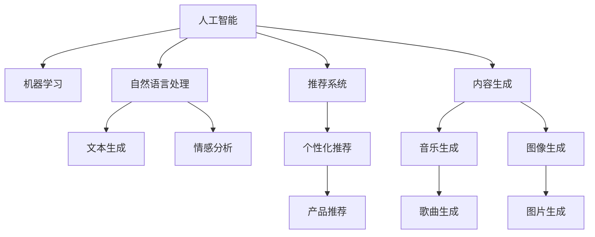

                 

# 如何利用技术能力进行创意产业革新

## 1. 背景介绍

### 1.1 问题由来
近年来，创意产业已经成为全球经济的重要组成部分，涵盖影视、广告、音乐、游戏、时尚等众多领域。创意产业的核心在于内容创新和用户体验的极致化，而传统的创意过程往往受限于人力、时间、资源的限制，难以快速响应市场变化。随着技术的快速发展，特别是人工智能(AI)和机器学习(ML)技术的应用，为创意产业带来了新的契机。

AI与创意产业的结合，不仅能够大幅度提升创意效率，还能带来颠覆性的新创意。例如，AI辅助的编剧工具、自动生成艺术作品、个性化推荐系统等，已经在大数据时代中崭露头角。技术能力的提升，为创意产业的革新提供了新的手段和方法，但如何高效融合技术能力，实现创意产业的智能化转型，仍是一个亟待解决的问题。

### 1.2 问题核心关键点
技术能力在创意产业的革新中，主要体现在以下几个方面：
- **内容生成**：通过AI技术自动生成内容，如文案、音乐、艺术作品等，节省大量人工创作时间。
- **个性化推荐**：利用机器学习算法，对用户行为和偏好进行深入分析，提供量身定做的内容推荐，提升用户体验。
- **数据分析与洞察**：通过数据挖掘和分析，发现用户兴趣和市场趋势，指导创意内容的制作。
- **自动化设计**：利用AI进行创意设计，如平面设计、3D建模等，提高设计的速度和精度。
- **智能生产与运营**：通过AI自动化工具和系统，优化生产流程和资源配置，提升效率和降低成本。
- **用户交互与反馈**：通过自然语言处理(NLP)和推荐系统，实时获取用户反馈，优化创意内容。

以上核心点涵盖了技术能力在创意产业革新中应用的多个方面，展现了技术的巨大潜力和变革力量。

## 2. 核心概念与联系

### 2.1 核心概念概述

为更好地理解技术能力在创意产业革新中的作用，本节将介绍几个关键概念：

- **人工智能(AI)**：指通过模拟人类智能行为，实现机器对数据的分析、理解、推理和学习。包括但不限于机器学习、深度学习、自然语言处理、计算机视觉等子领域。
- **机器学习(ML)**：指通过数据驱动的学习方法，让机器能够自我提升、优化，以实现特定的任务目标。
- **自然语言处理(NLP)**：指通过计算机理解和处理人类语言的技术，包括文本生成、情感分析、意图识别、语义理解等。
- **推荐系统**：指利用用户行为数据和物品属性数据，推荐给用户最合适的产品或内容的技术。
- **内容生成**：指通过自动化工具生成文本、音乐、图片等内容的技术，如GPT、Gan等。
- **创意产业**：涵盖影视、广告、音乐、游戏、时尚等创意内容制作与传播的产业。

这些概念之间的联系可以通过以下Mermaid流程图来展示：



这个流程图展示了人工智能各子领域与创意产业的连接路径：

1. 人工智能作为顶层概念，通过机器学习和自然语言处理等子领域技术，为创意产业提供技术支持。
2. 自然语言处理中的文本生成、情感分析等技术，为内容创作和情感表达提供了新的可能。
3. 推荐系统中的个性化推荐，提升了用户对内容的消费体验和粘性。
4. 内容生成技术如GPT、GAN等，大大提高了内容创作的效率和创新性。
5. 创意产业的各个环节，包括影视、广告、音乐、游戏等，都可以受益于这些技术能力的提升。

## 3. 核心算法原理 & 具体操作步骤
### 3.1 算法原理概述

技术能力在创意产业革新中的具体应用，依赖于一系列算法和技术。其核心在于利用机器学习模型，通过数据的分析和学习，自动化生成内容、优化推荐、提升创意效率等。

技术能力的革新过程，通常包括以下几个步骤：

1. **数据准备与预处理**：收集与创意产业相关的数据，如用户行为数据、产品属性数据、内容数据等，并进行清洗、归一化等预处理。
2. **模型训练与优化**：利用机器学习算法（如深度学习、强化学习等）对数据进行建模，通过迭代训练和优化，得到适合特定任务的模型。
3. **内容生成与推荐**：根据训练好的模型，进行内容生成、个性化推荐等操作，提升创意效率和用户体验。
4. **系统集成与部署**：将模型集成到实际应用系统中，进行部署和优化，实现技术与创意产业的深度融合。

### 3.2 算法步骤详解

以下以音乐推荐系统为例，详细讲解技术能力在创意产业中的应用步骤：

**Step 1: 数据收集与处理**

- 收集音乐平台用户的行为数据，如播放次数、喜好歌曲、收听时长等。
- 收集歌曲属性数据，如歌手、流派、发布时间等。
- 清洗数据，去除噪音、缺失值，确保数据质量。

**Step 2: 模型训练与优化**

- 使用K-means、LDA等算法对用户进行聚类，发现用户兴趣群体。
- 使用协同过滤算法或神经网络模型对用户行为和歌曲属性进行建模，得到推荐模型。
- 对模型进行交叉验证和参数调优，确保模型的泛化能力。

**Step 3: 内容生成与推荐**

- 根据用户群体和推荐模型，生成个性化音乐推荐列表。
- 利用自然语言处理技术，自动生成音乐推荐摘要，增强用户体验。

**Step 4: 系统集成与部署**

- 将推荐系统集成到音乐平台中，实现用户端和服务器端的无缝连接。
- 部署自动化监控系统，实时监控推荐系统的性能和用户反馈。

### 3.3 算法优缺点

技术能力在创意产业中的应用，具有以下优点：
1. 提升效率。通过自动化生成内容、推荐优化等，大幅提高创意效率。
2. 降低成本。减少人工成本，降低创意产业的生产和运营成本。
3. 提升用户体验。通过个性化推荐和内容优化，提升用户满意度。
4. 促进创新。技术能力为创意产业提供了新的工具和平台，激发更多创新可能。

同时，技术能力在创意产业中也有以下局限性：
1. 依赖数据质量。推荐系统的性能很大程度上取决于数据质量，数据收集和清洗过程复杂。
2. 存在偏差。机器学习模型可能会学习到数据中的偏差，产生误导性推荐。
3. 用户隐私问题。数据收集和分析过程中可能涉及用户隐私，需要严格遵守法律法规。
4. 创新局限。技术能力的提升可能限制创意的个性化和独特性，需要平衡技术与创意的关系。

尽管存在这些局限性，但就目前而言，技术能力在创意产业的应用已经展现出巨大的潜力和价值。未来相关研究的重点在于如何进一步降低技术应用对数据和隐私的依赖，提高模型的公平性和透明度，同时兼顾创意的多样性和独特性。

### 3.4 算法应用领域

技术能力在创意产业中的应用，已经涵盖了多个领域，包括但不限于：

- **音乐推荐**：利用机器学习算法对用户行为和歌曲属性进行建模，推荐个性化的音乐列表。
- **影视推荐**：通过分析用户观影行为和电影属性，生成个性化的电影推荐列表。
- **广告投放**：利用机器学习模型对用户行为进行预测，实现精准的广告投放。
- **游戏推荐**：通过分析用户游戏行为和游戏属性，推荐适合的游戏内容。
- **时尚推荐**：通过分析用户购买行为和时尚趋势，推荐个性化的服饰搭配。
- **创意设计**：利用AI进行平面设计、3D建模等，提高设计的速度和精度。
- **内容创作**：通过自动生成文本、图片、音乐等内容，加速创意产出。

除了上述这些经典应用外，技术能力还将在更多领域得到应用，为创意产业带来全新的突破。

## 4. 数学模型和公式 & 详细讲解 & 举例说明
### 4.1 数学模型构建

以下以音乐推荐系统为例，详细讲解技术能力在创意产业中的应用。

**音乐推荐系统模型**：

- 输入：用户行为数据和歌曲属性数据
- 输出：个性化音乐推荐列表

假设用户行为数据为 $X$，歌曲属性数据为 $Y$，音乐推荐列表为 $Z$。则模型的数学模型可以表示为：

$$
Z = f(X, Y, \theta)
$$

其中，$f$ 表示推荐函数，$\theta$ 为模型的参数。

推荐函数 $f$ 可以进一步细分为：

$$
f = h \circ g \circ f'
$$

- $f'$ 表示基础推荐模型，如协同过滤、深度神经网络等。
- $g$ 表示后处理函数，如排序、去重等。
- $h$ 表示个性化推荐算法，如基于K-means的聚类推荐。

### 4.2 公式推导过程

以下以协同过滤算法为例，推导推荐模型的公式。

协同过滤算法的基本思想是通过用户与物品的相似度，推荐用户感兴趣但未互动过的物品。其公式为：

$$
I_j \sim I_i \Leftrightarrow X_j \sim X_i
$$

其中，$I_j$ 和 $I_i$ 表示用户 $j$ 和用户 $i$ 对物品的评分。$X_j$ 和 $X_i$ 表示用户 $j$ 和用户 $i$ 的评分向量。

利用余弦相似度计算用户之间的相似度，得到推荐结果。具体公式为：

$$
\text{similarity}(X_j, X_i) = \frac{\langle X_j, X_i \rangle}{\|X_j\| \|X_i\|}
$$

将相似度排序，得到推荐列表。

### 4.3 案例分析与讲解

假设某音乐平台有 $N$ 个用户，每个用户对 $M$ 首歌曲进行了评分。使用协同过滤算法对用户 $i$ 进行推荐时，首先需要计算用户 $i$ 与所有其他用户的相似度，得到 $N-1$ 个相似度值。然后对这些相似度值进行排序，选取最相似的 $k$ 个用户 $j_1, j_2, ..., j_k$。最后根据这些用户对歌曲的评分，推荐给用户 $i$ 未听过的 $K$ 首歌曲。

例如，用户在音乐平台上的行为数据和评分数据如下：

| 用户 | 歌曲 | 评分 |
| --- | --- | --- |
| 1 | 1 | 4 |
| 1 | 2 | 3 |
| 1 | 3 | 5 |
| 2 | 1 | 5 |
| 2 | 2 | 4 |
| 2 | 3 | 2 |
| ... | ... | ... |

根据协同过滤算法，对用户 $i=1$ 进行推荐时，可以计算出其与用户 $j_1=2$ 和 $j_2=3$ 的相似度最高。然后，根据这些用户对歌曲的评分，推荐给用户 $i$ 未听过的歌曲 4、5、6。

## 5. 项目实践：代码实例和详细解释说明
### 5.1 开发环境搭建

在进行创意产业应用的技术实践前，我们需要准备好开发环境。以下是使用Python进行TensorFlow开发的环境配置流程：

1. 安装Anaconda：从官网下载并安装Anaconda，用于创建独立的Python环境。

2. 创建并激活虚拟环境：
```bash
conda create -n tf-env python=3.8 
conda activate tf-env
```

3. 安装TensorFlow：从官网获取对应的安装命令。例如：
```bash
conda install tensorflow tensorflow-gpu -c conda-forge
```

4. 安装PyTorch：
```bash
pip install torch torchvision torchaudio
```

5. 安装各类工具包：
```bash
pip install numpy pandas scikit-learn matplotlib tqdm jupyter notebook ipython
```

完成上述步骤后，即可在`tf-env`环境中开始创意产业应用的实践。

### 5.2 源代码详细实现

以下以音乐推荐系统为例，给出使用TensorFlow进行推荐模型开发的PyTorch代码实现。

首先，定义数据处理函数：

```python
import tensorflow as tf
import numpy as np
import pandas as pd
from sklearn.model_selection import train_test_split
from sklearn.preprocessing import StandardScaler

def load_data(path):
    df = pd.read_csv(path)
    X = df[['user', 'item', 'rating']]
    Y = df['item']
    return X, Y

def preprocess_data(X, Y):
    X_train, X_test, Y_train, Y_test = train_test_split(X, Y, test_size=0.2, random_state=42)
    scaler = StandardScaler()
    X_train = scaler.fit_transform(X_train)
    X_test = scaler.transform(X_test)
    return X_train, X_test, Y_train, Y_test
```

然后，定义推荐模型：

```python
class Recommender(tf.keras.Model):
    def __init__(self, n_users, n_items, embedding_dim):
        super(Recommender, self).__init__()
        self.user_embeddings = tf.keras.layers.Embedding(n_users, embedding_dim)
        self.item_embeddings = tf.keras.layers.Embedding(n_items, embedding_dim)
        self.dot_product = tf.keras.layers.Dot(axes=(2, 2), normalize=True, use_bias=True)
        self.dense = tf.keras.layers.Dense(1)

    def call(self, user_idx, item_idx):
        user_embeddings = self.user_embeddings(user_idx)
        item_embeddings = self.item_embeddings(item_idx)
        similarity = self.dot_product([user_embeddings, item_embeddings])
        prediction = self.dense(similarity)
        return prediction
```

接着，定义训练和评估函数：

```python
def train_model(model, X_train, Y_train, X_test, Y_test, batch_size=128, epochs=10, learning_rate=0.01):
    optimizer = tf.keras.optimizers.Adam(learning_rate=learning_rate)
    model.compile(loss='mse', optimizer=optimizer)
    model.fit(X_train, Y_train, batch_size=batch_size, epochs=epochs, validation_data=(X_test, Y_test))
    mse = model.evaluate(X_test, Y_test, verbose=0)
    print(f'Test MSE: {mse:.4f}')

def evaluate_model(model, X_test, Y_test, top_k=10):
    Y_pred = model.predict(X_test)
    top_indices = np.argsort(Y_pred)[:, ::-1]
    top_k_indices = top_indices[:, :top_k]
    top_k_items = Y_test[np.unique(top_k_indices)]
    return top_k_items
```

最后，启动训练流程并在测试集上评估：

```python
X, Y = load_data('data.csv')
X_train, X_test, Y_train, Y_test = preprocess_data(X, Y)
model = Recommender(n_users=X.shape[0], n_items=X.shape[1], embedding_dim=64)
train_model(model, X_train, Y_train, X_test, Y_test)
top_k_items = evaluate_model(model, X_test, Y_test)
print(f'Top {top_k} recommended items: {top_k_items}')
```

以上就是使用TensorFlow进行音乐推荐系统开发的完整代码实现。可以看到，TensorFlow提供了丰富的工具和接口，可以方便地实现机器学习模型的构建和训练。

### 5.3 代码解读与分析

让我们再详细解读一下关键代码的实现细节：

**load_data函数**：
- 读取数据集文件，并将其转换为Numpy数组。
- 提取用户、物品和评分数据，并将其分为训练集和测试集。
- 对数据进行标准化处理，以便于模型的训练。

**Recommender模型**：
- 使用Embedding层对用户和物品进行嵌入，得到高维向量表示。
- 使用Dot层计算用户和物品的余弦相似度，得到预测评分。
- 使用Dense层对预测评分进行线性变换，得到最终的推荐结果。

**train_model函数**：
- 定义优化器和损失函数，并编译模型。
- 使用fit方法对模型进行训练，并记录测试集上的均方误差。
- 调用evaluate方法评估模型性能，并返回推荐结果。

**evaluate_model函数**：
- 使用predict方法对测试集进行预测，并返回预测结果的前top_k个物品。

代码中的这些步骤展示了如何利用TensorFlow构建推荐模型，并对数据进行处理和模型评估。技术实践的重点是选择合适的模型和算法，并合理地处理数据，以获得良好的推荐结果。

## 6. 实际应用场景
### 6.1 智能创作工具

智能创作工具利用技术能力，为创意产业中的文案、音乐、广告等领域提供了高效的内容创作支持。例如，AI辅助的文案生成、音乐创作、广告设计等工具，已经在多个领域得到了应用。

- **文案生成**：利用自然语言处理技术，自动生成文章、报告、新闻等内容。例如，OpenAI的GPT模型已经可以生成高质量的商业文案和新闻报道。
- **音乐创作**：利用生成对抗网络(GAN)和变分自编码器(VAE)等技术，自动生成新的音乐作品。Google的Magenta项目已经实现了自动作曲、自动编曲等功能。
- **广告设计**：利用计算机视觉和自然语言处理技术，自动生成广告素材和文案。Pinterest的Neural Net Editor已经可以实现自动设计广告图片和文案。

这些智能创作工具极大地提升了创意产业的生产效率，缩短了创意的产出周期，提高了创意的质量和多样性。

### 6.2 个性化推荐系统

个性化推荐系统利用技术能力，为创意产业中的音乐、影视、游戏、广告等领域提供了精准的用户推荐服务。例如，Netflix、Spotify、Amazon等平台，已经广泛应用了个性化推荐系统。

- **音乐推荐**：根据用户的历史听歌记录和喜好，推荐个性化的音乐列表。Spotify的推荐算法已经能够实现高精度的用户画像和歌曲推荐。
- **影视推荐**：根据用户的历史观影记录和评分，推荐个性化的电影和电视剧。Netflix的推荐系统已经能够实现高效的影视内容推荐。
- **游戏推荐**：根据用户的游戏行为和偏好，推荐适合的游戏内容。Steam的推荐算法已经能够实现高效的游戏内容推荐。
- **广告推荐**：根据用户的浏览记录和兴趣，推荐个性化的广告内容。Google AdWords已经实现了精准的广告投放。

这些个性化推荐系统极大地提升了用户的体验和满意度，增强了创意内容的消费粘性，为创意产业带来了巨大的商业价值。

### 6.3 创意设计工具

创意设计工具利用技术能力，为创意产业中的平面设计、3D建模、视频制作等领域提供了高效的设计支持。例如，AI辅助的设计工具已经在平面设计、3D建模等领域得到了应用。

- **平面设计**：利用深度学习技术，自动生成平面设计元素。Adobe的Creative Cloud已经实现了智能设计辅助功能。
- **3D建模**：利用生成对抗网络(GAN)和变分自编码器(VAE)等技术，自动生成3D建模数据。Autodesk的Design Unified Experience已经实现了智能设计辅助功能。
- **视频制作**：利用深度学习技术，自动生成视频素材和编辑方案。Adobe Premiere Pro已经实现了智能视频编辑辅助功能。

这些创意设计工具极大地提升了设计效率，缩短了设计周期，提高了设计质量。

### 6.4 未来应用展望

随着技术能力的不断提升，创意产业的未来应用前景将更加广阔。以下是一些可能的未来应用场景：

- **虚拟现实**：利用技术能力，为创意产业中的影视、游戏、广告等领域提供虚拟现实体验。例如，VR电影、虚拟试穿等应用已经逐渐进入市场。
- **增强现实**：利用技术能力，为创意产业中的广告、设计、旅游等领域提供增强现实体验。例如，AR广告、AR设计、AR旅游等应用已经逐渐进入市场。
- **智能合约**：利用区块链和智能合约技术，为创意产业中的版权保护、内容分发等领域提供智能合约支持。例如，智能版权交易、智能内容分发等应用已经逐渐进入市场。
- **元宇宙**：利用技术能力，为创意产业中的虚拟现实、增强现实、社交等领域提供元宇宙体验。例如，虚拟社交、虚拟演唱会、虚拟展览等应用已经逐渐进入市场。

这些未来应用场景展示了技术能力在创意产业中的巨大潜力，预示着创意产业将迎来更加智能、个性化、互动化的发展趋势。

## 7. 工具和资源推荐
### 7.1 学习资源推荐

为了帮助开发者系统掌握技术能力在创意产业中的应用，这里推荐一些优质的学习资源：

1. **Coursera《深度学习专项课程》**：斯坦福大学的深度学习课程，涵盖深度学习的基础知识和实践应用，适合初学者和进阶开发者。
2. **Udacity《人工智能课程》**：由Google和Coursera合作的AI课程，涵盖机器学习、深度学习、自然语言处理等前沿技术。
3. **Kaggle**：全球最大的数据科学竞赛平台，提供丰富的数据集和比赛机会，可以实践技术能力在创意产业中的应用。
4. **Google Colab**：谷歌提供的免费在线Jupyter Notebook环境，支持GPU加速，方便开发者进行深度学习实验。
5. **DeepLearning.AI**：DeepLearning.AI提供的深度学习课程，涵盖深度学习、计算机视觉、自然语言处理等前沿技术。

通过对这些资源的学习实践，相信你一定能够快速掌握技术能力在创意产业中的应用，并用于解决实际的创意产业问题。

### 7.2 开发工具推荐

高效的开发离不开优秀的工具支持。以下是几款用于技术能力在创意产业中的应用的常用工具：

1. **TensorFlow**：由Google主导开发的开源深度学习框架，生产部署方便，适合大规模工程应用。
2. **PyTorch**：由Facebook主导开发的深度学习框架，灵活动态，适合研究性开发。
3. **Keras**：高层次的深度学习API，基于TensorFlow和Theano等后端，易于上手使用。
4. **Jupyter Notebook**：用于数据科学和机器学习的交互式笔记本，方便开发者进行实验和分享。
5. **GitHub**：全球最大的代码托管平台，方便开发者进行版本控制和协作开发。

合理利用这些工具，可以显著提升技术能力在创意产业中的开发效率，加快创新迭代的步伐。

### 7.3 相关论文推荐

技术能力在创意产业中的应用，已经得到了学界的广泛研究。以下是几篇奠基性的相关论文，推荐阅读：

1. **Attention is All You Need**：提出Transformer结构，开启了NLP领域的预训练大模型时代。
2. **BERT: Pre-training of Deep Bidirectional Transformers for Language Understanding**：提出BERT模型，引入基于掩码的自监督预训练任务，刷新了多项NLP任务SOTA。
3. **Neural Net Editor**：实现智能广告设计辅助功能，展示了AI在创意设计中的应用。
4. **Adaptive Low-Rank Adaptation for Parameter-Efficient Fine-Tuning**：提出AdaLoRA方法，实现了参数高效的微调，适合创意产业中的快速迭代。
5. **Collaborative Filtering for Implicit Feedback Datasets**：提出协同过滤算法，为推荐系统提供了基础支持。

这些论文代表了大语言模型微调技术的发展脉络。通过学习这些前沿成果，可以帮助研究者把握学科前进方向，激发更多的创新灵感。

## 8. 总结：未来发展趋势与挑战
### 8.1 总结

本文对技术能力在创意产业中的应用进行了全面系统的介绍。首先阐述了技术能力在创意产业的革新中，能够提升效率、降低成本、提升用户体验、促进创新等方面的重要性。其次，从原理到实践，详细讲解了推荐系统、智能创作工具、创意设计工具等技术能力在创意产业中的应用步骤和具体实现。同时，本文还探讨了技术能力在创意产业中的未来应用前景，并列举了虚拟现实、增强现实、智能合约、元宇宙等可能的未来应用场景。

通过本文的系统梳理，可以看到，技术能力在创意产业中的融合，为创意产业的智能化转型提供了新的手段和方法，为创意产业带来了巨大的商业价值和社会效益。技术能力的提升，为创意产业的革新提供了新的路径，预示着创意产业将迎来更加智能、个性化、互动化的发展趋势。

### 8.2 未来发展趋势

展望未来，技术能力在创意产业中的应用将呈现以下几个发展趋势：

1. **智能化的进一步提升**：技术能力的不断提升，将进一步增强创意产业的智能化水平。例如，智能创作工具、个性化推荐系统、智能设计工具等将进一步优化和完善。
2. **个性化程度的提升**：利用深度学习和大数据技术，将进一步提升创意内容的个性化程度。例如，智能创作工具将能够生成更加符合用户偏好的内容，个性化推荐系统将能够提供更加精准的推荐服务。
3. **跨领域的融合**：技术能力在创意产业中的应用将进一步跨领域融合，例如，结合虚拟现实、增强现实、元宇宙等技术，为创意产业带来更加沉浸式、互动化的体验。
4. **创新模式的涌现**：技术能力在创意产业中的应用将催生新的创新模式。例如，利用智能合约技术，将进一步优化版权保护和内容分发等环节。
5. **用户参与度的提升**：技术能力在创意产业中的应用将进一步提升用户的参与度和互动性。例如，利用增强现实技术，用户可以实时互动，生成个性化内容。

这些趋势展示了技术能力在创意产业中的巨大潜力和广阔前景，预示着创意产业将迎来更加智能、个性化、互动化的发展趋势。

### 8.3 面临的挑战

尽管技术能力在创意产业中的应用已经取得了显著成效，但在迈向更加智能化、个性化、互动化的过程中，仍面临诸多挑战：

1. **数据质量与隐私问题**：推荐系统等应用依赖大量用户数据，数据质量问题和高隐私风险是主要挑战。需要严格的数据治理和隐私保护措施。
2. **技术的不稳定性**：技术能力在创意产业中的应用，仍面临技术不稳定的问题。需要不断优化模型和算法，确保技术的稳定性和可靠性。
3. **创新的局限性**：技术能力在创意产业中的应用，可能会限制创意的个性化和独特性。需要平衡技术与创意的关系，确保创意的多样性和独特性。
4. **人才短缺**：技术能力在创意产业中的应用，需要高水平的技术人才和跨领域的复合人才。当前技术人才和创意人才的双重短缺，是技术应用的主要瓶颈。
5. **伦理与法律问题**：技术能力在创意产业中的应用，涉及伦理与法律问题，如版权保护、隐私保护等。需要建立完善的技术伦理和法律框架。

这些挑战需要业界和学界的共同努力，不断优化技术应用方案，确保技术在创意产业中的健康发展。

### 8.4 研究展望

面向未来，技术能力在创意产业中的应用，需要在以下几个方面寻求新的突破：

1. **跨领域的融合**：技术能力在创意产业中的应用，需要进一步跨领域融合，例如，结合虚拟现实、增强现实、元宇宙等技术，为创意产业带来更加沉浸式、互动化的体验。
2. **创意与技术的平衡**：在技术能力的应用中，需要平衡技术与创意的关系，确保创意的多样性和独特性。例如，智能创作工具需要在提升效率的同时，保持创意的多样性和独特性。
3. **隐私保护与安全**：在技术能力的应用中，需要加强隐私保护和数据安全措施，例如，推荐系统等应用需要严格的数据治理和隐私保护措施。
4. **创新模式的涌现**：技术能力在创意产业中的应用，将催生新的创新模式。例如，利用智能合约技术，将进一步优化版权保护和内容分发等环节。
5. **人机协同**：在技术能力的应用中，需要注重人机协同，例如，智能创作工具需要在提升效率的同时，确保创意的人文关怀和伦理导向。

这些研究方向展示了技术能力在创意产业中的未来发展方向，需要各界共同努力，不断探索新的突破。

## 9. 附录：常见问题与解答

**Q1：技术能力在创意产业中的应用是否会取代人类创意？**

A: 技术能力在创意产业中的应用，并非旨在取代人类创意，而是提升创意效率和质量。技术能力可以辅助人类创意，增强创意过程的效率和创新性，但最终创意的决策权仍在于人类。技术能力的提升，可以使得人类创意工作者专注于创意的核心环节，激发更多的创新灵感。

**Q2：技术能力在创意产业中的应用是否会限制创意的多样性和独特性？**

A: 技术能力在创意产业中的应用，可能会限制创意的多样性和独特性，但同时也为创意产业带来了更多的创新可能。例如，智能创作工具可以生成大量的创意素材，但最终的创意决策权仍在于人类。技术能力的应用，需要平衡技术与创意的关系，确保创意的多样性和独特性。

**Q3：技术能力在创意产业中的应用是否会带来伦理与法律问题？**

A: 技术能力在创意产业中的应用，涉及伦理与法律问题，如版权保护、隐私保护等。需要建立完善的技术伦理和法律框架，确保技术应用的安全性和合规性。例如，推荐系统等应用需要严格的数据治理和隐私保护措施，确保数据安全和隐私保护。

**Q4：技术能力在创意产业中的应用是否会带来商业风险？**

A: 技术能力在创意产业中的应用，虽然带来了巨大的商业价值，但也可能带来商业风险，如数据泄露、侵权等问题。需要建立完善的技术伦理和法律框架，确保技术应用的安全性和合规性。例如，推荐系统等应用需要严格的数据治理和隐私保护措施，确保数据安全和隐私保护。

通过这些常见问题的解答，可以看到技术能力在创意产业中的应用，虽然面临诸多挑战，但通过合理的应用和管理，可以最大化其潜力和价值，为创意产业带来新的发展机遇。

---

作者：禅与计算机程序设计艺术 / Zen and the Art of Computer Programming

