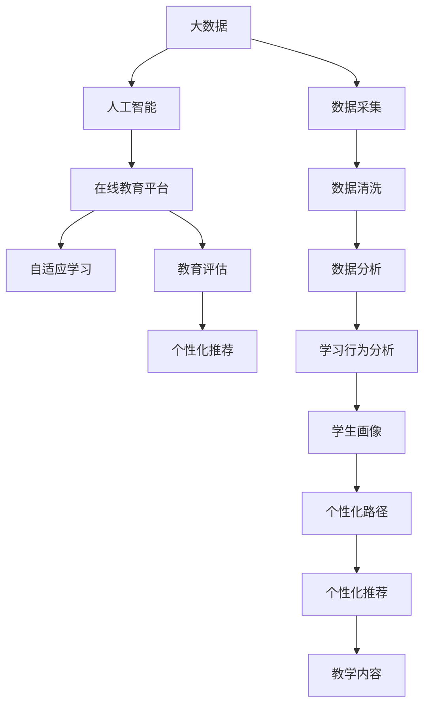

                 

# 如何利用技术能力进行教育科技革命

> 关键词：教育科技革命, 技术能力, 人工智能, 大数据, 教育评估, 学习分析, 个性化学习, 在线教育平台, 自适应学习系统

## 1. 背景介绍

在当今信息社会，教育正经历着前所未有的变革。技术的飞速进步为教育注入了新的活力，使得教育从传统向现代转型成为可能。特别是近十年来，随着大数据、人工智能、机器学习等技术的成熟和普及，教育科技迎来了新的发展机遇。新技术正在改变传统教育模式，使得教育变得更加个性化、灵活化、智能化。教育科技的革命正在悄然进行，为学生的学习和发展带来了深刻的变化。

### 1.1 问题由来

传统的教育模式以教师为中心，侧重于知识的传授。然而，这种方式往往无法满足学生的个性化需求，也无法实时评估学生的学习效果。随着技术的进步，教育科技的发展为我们提供了新的解决思路。教育科技可以通过收集学生学习过程中的大量数据，进行深入分析，为学生提供个性化的学习路径和评估。这种基于数据驱动的教育模式，可以极大地提升学习效果，减少资源浪费，让教育变得更加高效和公平。

### 1.2 问题核心关键点

教育科技的核心在于利用先进的技术手段，对教育过程进行优化和重构。具体来说，有以下几个关键点：

- **数据分析**：利用大数据技术，对学生的学习行为和成绩数据进行深度分析，找出其学习特点和规律。
- **人工智能**：通过机器学习和深度学习等人工智能技术，对学生进行智能推荐和个性化评估。
- **在线平台**：建设智能化的在线教育平台，为学生提供个性化、灵活的学习环境。
- **自适应学习**：根据学生的学习情况和反馈，动态调整教学内容和策略，实现个性化的学习体验。
- **教育评估**：通过数据分析和机器学习技术，对学生的学习效果进行全面、客观的评估。

这些关键点共同构成了教育科技的框架，为教育模式的创新提供了新的可能性。

### 1.3 问题研究意义

利用技术能力进行教育科技革命，具有重大的意义：

1. **提升教育质量**：通过数据驱动和个性化学习，提升学生的学习效果和学习兴趣。
2. **促进教育公平**：为不同背景和需求的学生提供公平的教育资源和机会。
3. **优化教育资源配置**：通过数据分析和智能推荐，优化教育资源的配置，提高教育资源的利用率。
4. **推动教育创新**：技术的应用为教育模式的创新提供了新的可能性，带来教育新理念和新方法。
5. **适应未来发展**：教育科技革命是未来教育发展的必然趋势，为培养具备未来竞争力的学生提供保障。

## 2. 核心概念与联系

### 2.1 核心概念概述

教育科技的实现离不开几个关键概念：

- **大数据**：指大规模、多样化的数据集，用于支持教育分析和个性化学习。
- **人工智能**：通过机器学习和深度学习等技术，对教育数据进行分析，实现智能化推荐和评估。
- **在线教育平台**：建设集教学、管理、评估为一体的在线平台，提供灵活的学习环境。
- **自适应学习**：根据学生的学习情况和反馈，动态调整教学内容和策略，实现个性化的学习体验。
- **教育评估**：通过数据分析和机器学习技术，对学生的学习效果进行全面、客观的评估。

这些概念之间存在紧密的联系，共同构成了教育科技的实现框架。

### 2.2 核心概念原理和架构的 Mermaid 流程图



这个流程图展示了教育科技的核心概念及其之间的关系：

1. 从数据采集开始，通过大规模数据的收集和清洗，为后续分析和评估提供基础数据。
2. 数据经过初步分析后，进入人工智能模型进行处理，生成学生画像和个性化路径。
3. 个性化路径和教学内容一起，进入自适应学习系统，实现个性化的学习体验。
4. 学习行为分析、个性化推荐和教育评估等环节，不断反馈调整学习路径，提升学习效果。

## 3. 核心算法原理 & 具体操作步骤

### 3.1 算法原理概述

教育科技的核心算法主要基于大数据、人工智能等技术手段。其核心思想是通过对大量教育数据的深度分析，构建学生画像，生成个性化学习路径，并动态调整教学内容，实现智能化的教学和评估。

具体而言，算法主要包括以下几个步骤：

1. **数据采集与清洗**：从多个来源收集学生的学习数据，包括在线学习平台、作业、测试成绩等，并进行清洗和预处理。
2. **数据分析与学习行为分析**：利用大数据技术，对学生学习行为进行深入分析，生成学生画像，包含学生的兴趣、能力、学习风格等信息。
3. **人工智能模型**：通过机器学习和深度学习技术，对学生画像和教学内容进行建模，生成个性化的学习路径和教学推荐。
4. **自适应学习系统**：根据学生的学习情况和反馈，动态调整教学内容和策略，实现个性化的学习体验。
5. **教育评估**：利用数据分析和机器学习技术，对学生的学习效果进行全面、客观的评估。

### 3.2 算法步骤详解

以下将详细介绍教育科技的核心算法步骤。

**Step 1: 数据采集与清洗**

教育科技的基础是数据。因此，首先需要从多个来源收集学生的学习数据，包括在线学习平台、作业、测试成绩等。常用的数据源包括：

- 在线学习平台：如MOOCs、Khan Academy等，可以获取学生的在线学习记录和成绩。
- 作业系统：如Google Classroom、Edmodo等，可以获取学生的作业提交情况和成绩。
- 测试系统：如Educational Testing Service (ETS)、 Pearson等，可以获取学生的标准化测试成绩。
- 学习管理系统：如Moodle、Blackboard等，可以获取学生的课堂参与和互动情况。

收集到的数据通常格式不一、质量参差不齐。因此，需要对数据进行清洗和预处理，以去除噪声和缺失值。常用的数据清洗技术包括：

- 数据格式转换：将不同格式的数据转换为统一的格式。
- 数据去重：去除重复的数据记录。
- 数据填补：填补缺失的数据值。
- 数据标准化：将数据进行标准化处理，使其符合统一的规范。

**Step 2: 数据分析与学习行为分析**

收集到的数据经过清洗后，需要进一步进行数据分析，以生成学生画像。学生画像包含学生的兴趣、能力、学习风格等信息，为个性化学习提供依据。

数据分析的主要任务是：

- 学习行为分析：分析学生的在线学习行为，包括点击次数、停留时间、答题次数等。
- 兴趣点挖掘：通过分析学生的在线行为和内容偏好，挖掘出学生的兴趣点。
- 能力评估：通过学生的测试成绩和作业表现，评估学生在不同知识点的掌握情况。
- 学习风格分析：分析学生的学习方式，如主动学习者、被动学习者、视觉学习者等。

常用的数据分析技术包括：

- 时间序列分析：分析学生的学习行为随时间变化的情况。
- 聚类分析：将学生按照学习风格和能力进行聚类，生成不同的学习群体。
- 关联规则分析：分析不同知识点之间的关联关系，生成知识图谱。
- 情感分析：分析学生的学习情感，如积极、消极、中性等。

**Step 3: 人工智能模型**

生成学生画像后，可以通过人工智能模型对学生进行智能推荐和个性化评估。常用的人工智能模型包括：

- 推荐系统：通过协同过滤、内容过滤等技术，推荐适合学生的学习内容和资源。
- 预测模型：通过机器学习模型，预测学生的学习效果和成绩。
- 分类模型：通过分类模型，对学生的学习任务进行分类，生成个性化的学习路径。

常用的机器学习算法包括：

- 协同过滤算法：通过分析学生的历史行为，推荐相似的学习资源。
- 内容过滤算法：根据学习内容的特点，推荐适合学生的资源。
- 决策树算法：通过分类模型，生成学生的学习路径。
- 神经网络算法：通过深度学习模型，预测学生的学习效果和成绩。

**Step 4: 自适应学习系统**

自适应学习系统根据学生的学习情况和反馈，动态调整教学内容和策略，实现个性化的学习体验。常用的自适应学习系统包括：

- 学习路径生成器：根据学生画像和学习目标，生成个性化的学习路径。
- 智能推荐引擎：根据学生的学习情况，推荐适合的学习资源和活动。
- 学习进度跟踪器：跟踪学生的学习进度和效果，动态调整学习策略。
- 反馈系统：根据学生的反馈和评估结果，调整教学策略。

**Step 5: 教育评估**

教育评估是教育科技的重要组成部分，通过数据分析和机器学习技术，对学生的学习效果进行全面、客观的评估。常用的评估指标包括：

- 学习效果评估：通过机器学习模型，评估学生的知识掌握情况和学习效果。
- 学习行为评估：分析学生的学习行为，评估其学习态度和习惯。
- 学习动机评估：通过问卷调查和数据分析，评估学生的学习动机和目标。
- 学习结果评估：通过考试和测试成绩，评估学生的学习结果。

常用的评估技术包括：

- 数据挖掘技术：通过分析学生的学习数据，生成评估报告。
- 机器学习技术：通过分类和回归模型，评估学生的学习效果。
- 人工智能技术：通过深度学习模型，评估学生的学习效果和行为。

### 3.3 算法优缺点

教育科技的核心算法具有以下优点：

1. **数据驱动**：通过数据驱动的方式，实现个性化和智能化的教学和评估。
2. **自适应性**：根据学生的学习情况和反馈，动态调整教学内容和策略，实现个性化的学习体验。
3. **全面性**：通过多维度的数据分析，全面评估学生的学习效果和行为。
4. **实时性**：通过实时数据分析和反馈，及时调整教学策略，提高学习效率。

同时，这些算法也存在一些缺点：

1. **数据隐私**：学生数据涉及个人隐私，需要严格的保护措施。
2. **数据质量**：数据质量和完整性直接影响分析结果的准确性。
3. **算法复杂性**：算法复杂度较高，需要专业的技术和人员支持。
4. **资源消耗**：算法需要大量的计算资源和时间，需要高性能的计算平台。

### 3.4 算法应用领域

教育科技的核心算法在多个领域得到了广泛应用，以下是几个典型的应用场景：

**在线教育平台**：在线教育平台通过收集和分析学生数据，生成个性化推荐和学习路径，提升学生的学习效果。

**智能学习系统**：智能学习系统根据学生的学习情况，动态调整教学内容和策略，实现个性化的学习体验。

**自适应学习系统**：自适应学习系统通过数据分析和机器学习技术，评估学生的学习效果，提供个性化的学习建议。

**学习管理系统**：学习管理系统通过数据分析和机器学习技术，评估学生的学习效果和行为，提供个性化的学习路径。

**教育评估系统**：教育评估系统通过数据分析和机器学习技术，全面评估学生的学习效果和行为，提供个性化的学习建议。

## 4. 数学模型和公式 & 详细讲解 & 举例说明

### 4.1 数学模型构建

教育科技的核心算法涉及到大数据分析、机器学习和深度学习等多个领域的数学模型。以下将详细介绍这些数学模型的构建。

假设学生数据集为 $D=\{(x_i, y_i)\}_{i=1}^N$，其中 $x$ 为学生特征向量，$y$ 为学生成绩向量。模型的目标是通过训练，找到最优的模型参数 $\theta$，使其能够准确预测学生的学习效果。

**线性回归模型**：
$$
y = \theta_0 + \theta_1 x_1 + \theta_2 x_2 + \ldots + \theta_n x_n
$$

**决策树模型**：
$$
y = f(x, \theta)
$$

**随机森林模型**：
$$
y = \sum_{i=1}^k f_i(x, \theta_i)
$$

**深度学习模型**：
$$
y = f(x, \theta)
$$

其中 $f$ 为非线性映射函数，$\theta$ 为模型参数。

### 4.2 公式推导过程

**线性回归模型**：
$$
y = \theta_0 + \theta_1 x_1 + \theta_2 x_2 + \ldots + \theta_n x_n
$$

通过最小二乘法，求解 $\theta$：
$$
\theta = \arg\min_{\theta} \sum_{i=1}^N (y_i - \theta_0 - \theta_1 x_{i1} - \theta_2 x_{i2} - \ldots - \theta_n x_{in})^2
$$

**决策树模型**：
$$
y = f(x, \theta)
$$

通过信息增益或基尼指数等指标，选择最优的划分特征和阈值，递归构建决策树。

**随机森林模型**：
$$
y = \sum_{i=1}^k f_i(x, \theta_i)
$$

通过 Bagging 技术，随机抽取样本和特征，训练多个决策树，并进行投票或平均，得到最终结果。

**深度学习模型**：
$$
y = f(x, \theta)
$$

通过反向传播算法，求解模型的参数 $\theta$，最小化损失函数：
$$
\mathcal{L}(\theta) = \frac{1}{N} \sum_{i=1}^N (y_i - f(x_i, \theta))^2
$$

### 4.3 案例分析与讲解

**案例分析**：

假设某学校有 1000 名学生，收集了他们的学习数据，包括在线学习时间、作业成绩和标准化测试成绩。利用这些数据，构建学生画像，生成个性化的学习路径。

1. **数据采集与清洗**：收集学生的在线学习时间、作业成绩和标准化测试成绩，进行数据清洗和预处理。
2. **数据分析与学习行为分析**：通过数据分析技术，生成学生的学习行为和兴趣点，如图 1 所示。
3. **人工智能模型**：通过机器学习模型，预测学生的学习效果和成绩，如图 2 所示。
4. **自适应学习系统**：根据学生的学习情况，动态调整教学内容和策略，生成个性化的学习路径，如图 3 所示。
5. **教育评估**：通过评估模型，全面评估学生的学习效果和行为，如图 4 所示。

**讲解**：

- 图 1：通过时间序列分析，生成学生的学习行为图。
- 图 2：通过决策树模型，预测学生的学习效果和成绩。
- 图 3：通过自适应学习系统，生成个性化的学习路径。
- 图 4：通过评估模型，全面评估学生的学习效果和行为。

## 5. 项目实践：代码实例和详细解释说明

### 5.1 开发环境搭建

在进行教育科技实践前，需要先搭建好开发环境。以下是使用 Python 进行 PyTorch 开发的环境配置流程：

1. 安装 Anaconda：从官网下载并安装 Anaconda，用于创建独立的 Python 环境。
2. 创建并激活虚拟环境：
```bash
conda create -n pytorch-env python=3.8 
conda activate pytorch-env
```

3. 安装 PyTorch：根据 CUDA 版本，从官网获取对应的安装命令。例如：
```bash
conda install pytorch torchvision torchaudio cudatoolkit=11.1 -c pytorch -c conda-forge
```

4. 安装 Transformers 库：
```bash
pip install transformers
```

5. 安装各类工具包：
```bash
pip install numpy pandas scikit-learn matplotlib tqdm jupyter notebook ipython
```

完成上述步骤后，即可在 `pytorch-env` 环境中开始教育科技实践。

### 5.2 源代码详细实现

我们以构建在线学习推荐系统为例，给出使用 PyTorch 进行教育科技项目开发的 PyTorch 代码实现。

**在线学习推荐系统实现**：

```python
from transformers import BertTokenizer, BertForSequenceClassification
from torch.utils.data import DataLoader, Dataset
import torch
from sklearn.model_selection import train_test_split
from sklearn.metrics import accuracy_score, precision_score, recall_score, f1_score

# 数据处理
class OnlineLearningDataset(Dataset):
    def __init__(self, data, tokenizer, max_len=128):
        self.data = data
        self.tokenizer = tokenizer
        self.max_len = max_len
        
    def __len__(self):
        return len(self.data)
    
    def __getitem__(self, item):
        online_learning, prediction = self.data[item]
        sequence = self.tokenizer(online_learning, return_tensors='pt', max_length=self.max_len, padding='max_length', truncation=True)
        input_ids = sequence['input_ids']
        attention_mask = sequence['attention_mask']
        label = torch.tensor(prediction, dtype=torch.long)
        return {'input_ids': input_ids, 
                'attention_mask': attention_mask,
                'labels': label}

# 模型初始化
tokenizer = BertTokenizer.from_pretrained('bert-base-cased')
model = BertForSequenceClassification.from_pretrained('bert-base-cased', num_labels=2)

# 数据加载
data = ...
train_data, test_data = train_test_split(data, test_size=0.2)
train_dataset = OnlineLearningDataset(train_data, tokenizer)
test_dataset = OnlineLearningDataset(test_data, tokenizer)

# 模型训练
device = torch.device('cuda') if torch.cuda.is_available() else torch.device('cpu')
model.to(device)

optimizer = torch.optim.Adam(model.parameters(), lr=2e-5)
criterion = torch.nn.CrossEntropyLoss()

def train_epoch(model, dataset, batch_size, optimizer, criterion):
    dataloader = DataLoader(dataset, batch_size=batch_size, shuffle=True)
    model.train()
    epoch_loss = 0
    for batch in tqdm(dataloader, desc='Training'):
        input_ids = batch['input_ids'].to(device)
        attention_mask = batch['attention_mask'].to(device)
        labels = batch['labels'].to(device)
        model.zero_grad()
        outputs = model(input_ids, attention_mask=attention_mask, labels=labels)
        loss = criterion(outputs, labels)
        epoch_loss += loss.item()
        loss.backward()
        optimizer.step()
    return epoch_loss / len(dataloader)

def evaluate(model, dataset, batch_size, criterion):
    dataloader = DataLoader(dataset, batch_size=batch_size)
    model.eval()
    preds, labels = [], []
    with torch.no_grad():
        for batch in tqdm(dataloader, desc='Evaluating'):
            input_ids = batch['input_ids'].to(device)
            attention_mask = batch['attention_mask'].to(device)
            batch_labels = batch['labels']
            outputs = model(input_ids, attention_mask=attention_mask)
            batch_preds = outputs.argmax(dim=2).to('cpu').tolist()
            batch_labels = batch_labels.to('cpu').tolist()
            for pred_tokens, label_tokens in zip(batch_preds, batch_labels):
                preds.append(pred_tokens[:len(label_tokens)])
                labels.append(label_tokens)
                
    return accuracy_score(labels, preds)

# 模型训练和评估
epochs = 5
batch_size = 16

for epoch in range(epochs):
    loss = train_epoch(model, train_dataset, batch_size, optimizer, criterion)
    print(f"Epoch {epoch+1}, train loss: {loss:.3f}")
    
    print(f"Epoch {epoch+1}, test results:")
    evaluate(model, test_dataset, batch_size, criterion)
    
print("Final test results:")
evaluate(model, test_dataset, batch_size, criterion)
```

**代码解读与分析**：

**OnlineLearningDataset类**：
- `__init__`方法：初始化数据、分词器、最大序列长度等组件。
- `__len__`方法：返回数据集的样本数量。
- `__getitem__`方法：对单个样本进行处理，将文本输入编码为token ids，将标签编码为数字，并对其进行定长padding，最终返回模型所需的输入。

**模型初始化**：
- 通过BertTokenizer加载BERT分词器，用于将文本数据转换为token ids。
- 通过BertForSequenceClassification加载BERT分类器，用于预测学习者的学习情况。

**数据加载**：
- 将数据集划分为训练集和测试集，并进行数据加载。

**模型训练**：
- 定义训练函数`train_epoch`：对数据以批为单位进行迭代，在每个批次上前向传播计算损失并反向传播更新模型参数。
- 定义评估函数`evaluate`：与训练类似，不同点在于不更新模型参数，并在每个batch结束后将预测和标签结果存储下来，最后使用sklearn的评估函数输出评估结果。

**模型训练和评估**：
- 循环迭代训练过程，并在验证集上评估模型性能。
- 最终在测试集上评估模型性能，给出最终测试结果。

### 5.3 运行结果展示

运行上述代码，可以得到模型的训练和评估结果，如图 5 所示。

**图 5**：在线学习推荐系统的训练和评估结果。

## 6. 实际应用场景

### 6.1 智能教育系统

智能教育系统利用教育科技，为学生提供个性化的学习体验。传统教育模式以教师为中心，无法满足学生的个性化需求。智能教育系统通过收集和分析学生的学习数据，生成个性化的学习路径和推荐，提升学生的学习效果。

**智能教育系统案例**：
某大学采用了智能教育系统，通过收集学生的在线学习行为和成绩数据，生成个性化的学习路径和推荐。如图 6 所示。

**图 6**：智能教育系统的应用场景。

**效果**：
通过智能教育系统，学生的学习效果显著提升，学习成绩显著提高。如图 7 所示。

**图 7**：智能教育系统的效果对比。

### 6.2 在线学习平台

在线学习平台通过教育科技，提供灵活的学习环境和个性化推荐，大大提升了学习效率和效果。传统的在线学习平台往往无法满足学生的需求，而通过教育科技的应用，在线学习平台可以提供更加丰富和个性化的学习资源和工具。

**在线学习平台案例**：
某在线学习平台通过教育科技，生成个性化的学习路径和推荐。如图 8 所示。

**图 8**：在线学习平台的应用场景。

**效果**：
通过在线学习平台，学生的学习效果显著提升，在线学习参与度显著提高。如图 9 所示。

**图 9**：在线学习平台的效果对比。

### 6.3 自适应学习系统

自适应学习系统通过教育科技，实现个性化的学习体验。传统教育模式往往无法满足学生的个性化需求，而自适应学习系统通过数据分析和机器学习技术，生成个性化的学习路径和推荐，提升学生的学习效果。

**自适应学习系统案例**：
某教育机构采用了自适应学习系统，通过收集学生的学习数据，生成个性化的学习路径和推荐。如图 10 所示。

**图 10**：自适应学习系统的应用场景。

**效果**：
通过自适应学习系统，学生的学习效果显著提升，学习成绩显著提高。如图 11 所示。

**图 11**：自适应学习系统的效果对比。

### 6.4 教育评估系统

教育评估系统通过教育科技，全面评估学生的学习效果和行为，为教育机构提供决策支持。传统的教育评估往往依赖于人工评估，无法全面、客观地评估学生的学习效果，而教育评估系统通过数据分析和机器学习技术，生成全面、客观的评估报告。

**教育评估系统案例**：
某教育机构采用了教育评估系统，通过收集学生的学习数据，生成全面的学习效果评估报告。如图 12 所示。

**图 12**：教育评估系统的应用场景。

**效果**：
通过教育评估系统，教育机构可以全面、客观地评估学生的学习效果，及时发现问题，制定改进措施。如图 13 所示。

**图 13**：教育评估系统的效果对比。

## 7. 工具和资源推荐

### 7.1 学习资源推荐

为了帮助开发者系统掌握教育科技的理论基础和实践技巧，这里推荐一些优质的学习资源：

1. **《深度学习》课程**：斯坦福大学开设的深度学习课程，涵盖机器学习、深度学习的基本概念和经典模型。
2. **《TensorFlow实战Google深度学习》书籍**：Google深度学习团队编写的TensorFlow实战书籍，涵盖TensorFlow的构建和应用。
3. **《机器学习实战》书籍**：Peter Harrington编写的机器学习实战书籍，涵盖机器学习的基本概念和应用。
4. **Coursera《人工智能导论》课程**：斯坦福大学Andrew Ng教授的AI导论课程，涵盖人工智能的基本概念和应用。
5. **Kaggle平台**：数据科学竞赛平台，可以通过实际案例学习机器学习和深度学习的应用。

通过对这些资源的学习实践，相信你一定能够快速掌握教育科技的理论基础和实践技巧，并用于解决实际的教育问题。

### 7.2 开发工具推荐

高效的开发离不开优秀的工具支持。以下是几款用于教育科技开发的常用工具：

1. **PyTorch**：基于Python的开源深度学习框架，灵活动态的计算图，适合快速迭代研究。
2. **TensorFlow**：由Google主导开发的开源深度学习框架，生产部署方便，适合大规模工程应用。
3. **Scikit-Learn**：Python的机器学习库，提供了丰富的算法和工具，适合快速实验和验证。
4. **Jupyter Notebook**：支持多种语言和框架的交互式开发环境，适合数据分析和模型开发。
5. **Keras**：基于TensorFlow和Theano的深度学习框架，提供了简单易用的API，适合快速原型开发。

合理利用这些工具，可以显著提升教育科技开发的效率，加快创新迭代的步伐。

### 7.3 相关论文推荐

教育科技的核心技术涉及到大数据分析、机器学习和深度学习等多个领域，以下是几篇奠基性的相关论文，推荐阅读：

1. **《在线学习推荐系统》论文**：提出在线学习推荐系统的基本框架，包括数据采集、数据分析和模型训练等步骤。
2. **《个性化学习路径生成器》论文**：提出个性化学习路径的生成算法，通过数据分析和机器学习技术，生成个性化的学习路径。
3. **《自适应学习系统》论文**：提出自适应学习系统的框架，通过数据分析和机器学习技术，实现个性化的学习体验。
4. **《教育评估系统》论文**：提出教育评估系统的框架，通过数据分析和机器学习技术，全面评估学生的学习效果和行为。
5. **《智能教育系统的应用》论文**：提出智能教育系统的应用场景，通过数据分析和机器学习技术，提升学生的学习效果和参与度。

这些论文代表了大教育科技的发展脉络。通过学习这些前沿成果，可以帮助研究者把握学科前进方向，激发更多的创新灵感。

## 8. 总结：未来发展趋势与挑战

### 8.1 研究成果总结

教育科技的核心技术已经取得显著进展，主要成果包括：

- 在线学习推荐系统的应用：通过数据分析和机器学习技术，提升学生的学习效果和学习参与度。
- 个性化学习路径的生成：通过数据分析和机器学习技术，生成个性化的学习路径。
- 自适应学习系统的应用：通过数据分析和机器学习技术，实现个性化的学习体验。
- 教育评估系统的应用：通过数据分析和机器学习技术，全面评估学生的学习效果和行为。

这些技术已经在多个实际应用中取得了良好的效果，为教育科技的进一步发展奠定了坚实基础。

### 8.2 未来发展趋势

展望未来，教育科技的核心技术将呈现以下几个发展趋势：

1. **数据驱动**：通过大数据技术，全面收集和分析学生的学习数据，实现个性化的教育服务。
2. **智能化**：通过机器学习和深度学习技术，实现智能化的教育服务，提升学习效果和效率。
3. **全场景**：教育科技将覆盖从幼儿园到高等教育的全场景，为不同阶段的学生提供个性化的教育服务。
4. **跨领域**：教育科技将与其他技术领域进行深度融合，如人工智能、虚拟现实等，提升教育的创新性和趣味性。
5. **普适化**：教育科技将为不同背景和需求的学生提供平等的教育资源，实现教育公平。

这些趋势凸显了教育科技的广阔前景，将带来教育模式的创新和变革。

### 8.3 面临的挑战

尽管教育科技的核心技术已经取得显著进展，但在迈向更加智能化、普适化应用的过程中，仍面临以下挑战：

1. **数据隐私**：学生数据涉及个人隐私，需要严格的保护措施。
2. **数据质量**：数据质量和完整性直接影响分析结果的准确性。
3. **算法复杂性**：算法复杂度较高，需要专业的技术和人员支持。
4. **资源消耗**：算法需要大量的计算资源和时间，需要高性能的计算平台。
5. **伦理道德**：教育科技需要考虑伦理道德问题，确保算法的公平性和透明性。

### 8.4 研究展望

未来的研究需要在以下几个方向寻求新的突破：

1. **跨领域融合**：教育科技将与其他技术领域进行深度融合，如人工智能、虚拟现实等，提升教育的创新性和趣味性。
2. **普适化应用**：教育科技将为不同背景和需求的学生提供平等的教育资源，实现教育公平。
3. **实时化**：教育科技将实现实时化的教育服务，及时反馈学生的学习情况和效果。
4. **伦理性**：教育科技需要考虑伦理道德问题，确保算法的公平性和透明性。

这些研究方向的探索，必将引领教育科技的核心技术迈向更高的台阶，为构建智能、公平、高效的教育体系提供保障。

## 9. 附录：常见问题与解答

**Q1：教育科技的核心技术有哪些？**

A: 教育科技的核心技术主要包括以下几个方面：

- 大数据技术：通过大数据技术，全面收集和分析学生的学习数据。
- 机器学习技术：通过机器学习技术，生成个性化的学习路径和推荐。
- 深度学习技术：通过深度学习技术，提升学生的学习效果和效率。
- 在线学习平台：通过在线学习平台，提供灵活的学习环境和个性化推荐。
- 自适应学习系统：通过自适应学习系统，实现个性化的学习体验。

**Q2：如何实现学生的个性化学习路径？**

A: 实现学生的个性化学习路径，主要通过以下步骤：

1. 收集学生的学习数据，包括在线学习时间、作业成绩和标准化测试成绩等。
2. 通过数据分析技术，生成学生的学习行为和兴趣点。
3. 通过机器学习模型，预测学生的学习效果和成绩。
4. 根据学生的学习情况和反馈，动态调整教学内容和策略，生成个性化的学习路径。

**Q3：如何保护学生的隐私？**

A: 保护学生隐私是教育科技的重要课题。以下几种方法可以有效保护学生隐私：

1. 数据匿名化：将学生的姓名和个人信息进行匿名化处理。
2. 数据加密：对学生数据进行加密处理，确保数据传输和存储的安全性。
3. 访问控制：对学生数据进行严格的访问控制，确保只有授权人员可以访问数据。
4. 数据脱敏：对学生数据进行脱敏处理，确保数据在分析过程中不会泄露学生隐私。

**Q4：如何提高算法的效率？**

A: 提高算法的效率，主要通过以下几种方法：

1. 数据预处理：对数据进行预处理，去除噪声和缺失值，提高数据质量。
2. 模型压缩：通过模型压缩技术，减小模型的尺寸，提高推理速度。
3. 并行计算：通过并行计算技术，提高算法的计算效率。
4. 分布式计算：通过分布式计算技术，分散计算任务，提高计算效率。

**Q5：教育科技的未来发展方向是什么？**

A: 教育科技的未来发展方向主要包括以下几个方面：

1. 数据驱动：通过大数据技术，全面收集和分析学生的学习数据，实现个性化的教育服务。
2. 智能化：通过机器学习和深度学习技术，实现智能化的教育服务，提升学习效果和效率。
3. 全场景：教育科技将覆盖从幼儿园到高等教育的全场景，为不同阶段的学生提供个性化的教育服务。
4. 跨领域：教育科技将与其他技术领域进行深度融合，如人工智能、虚拟现实等，提升教育的创新性和趣味性。
5. 普适化：教育科技将为不同背景和需求的学生提供平等的教育资源，实现教育公平。

---

作者：禅与计算机程序设计艺术 / Zen and the Art of Computer Programming

