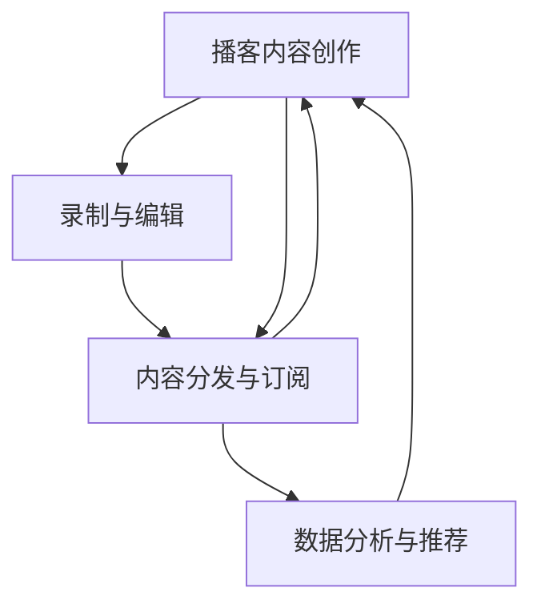

                 

# 如何利用播客进行知识付费

## 1. 背景介绍

在数字时代，信息获取的渠道和形式日益多样化。播客作为一种新兴的音频内容形式，凭借其简便的创作与分发方式、广泛的听众覆盖面，逐渐成为知识传播的重要工具。知识付费作为信息经济发展的重要组成部分，正在迅速成长。本文将探讨如何利用播客这一平台，实现知识的付费传播，并在此基础上，构建更加智能、高效的知识服务系统。

### 1.1 问题由来

随着互联网技术的进步和智能设备的普及，知识付费市场迅速崛起，在线教育、专家讲座、行业报告等各类付费知识产品纷纷涌现。与传统的图书、视频、博客等形式相比，播客作为一种互动性更强、时间利用效率更高、且更加个性化的内容形式，逐渐受到用户青睐。播客的内容通常为音频形式，涵盖知识讲授、行业分析、技术应用等多个领域。其传播方式简单便捷，用户可以在通勤、运动、休闲等多种场景中，随时随地收听学习，从而最大化知识利用的灵活性和便捷性。

然而，播客内容的创作和分发存在一定的门槛，一般需要专业的声音录制和编辑设备，以及内容创作和设计能力。这使得播客创作者和运营者往往具有较高的专业水平。但同时，他们对于自己的作品也有较高的价值预期，希望能通过付费模式获得回报。在这样的背景下，如何实现播客内容的有效付费传播，同时保障用户的知识和付费体验，成为了一个重要问题。

## 2. 核心概念与联系

### 2.1 核心概念概述

为更好地理解播客知识付费的实现原理和应用，本节将介绍几个密切相关的核心概念：

- 播客(Podcast)：一种基于音频格式的知识传播方式，通过互联网平台分发，以期获得听众的关注和付费。播客内容通常涵盖专业领域知识，具有较强的教育性和参考价值。
- 知识付费(Knowledge Pay-Per-Use)：指用户为获得特定知识内容而支付相应费用的模式。与传统的订阅付费不同，知识付费更加注重内容的单次使用价值。
- 内容创作与分发：播客的知识传播涉及内容创作、录制、编辑、发布等多个环节，需要在创作者、平台和听众之间形成良好的互动机制。
- 订阅与定制：播客知识付费通常通过订阅机制实现，用户可以定期或不定期地获取优质内容。同时，根据用户兴趣和需求，提供内容定制服务，进一步提升用户体验。
- 数据分析与推荐：利用用户行为数据，对播客内容进行深度分析，为内容创作者和平台提供运营建议。同时，通过个性化推荐算法，为用户推荐其可能感兴趣的内容。

这些核心概念之间的逻辑关系可以通过以下Mermaid流程图来展示：



这个流程图展示了好播客知识付费的流程：

1. 播客内容创作：内容创作者根据目标受众的需求，设计并制作播客内容。
2. 录制与编辑：利用专业的音频录制和编辑设备，对内容进行高质量的处理。
3. 内容分发与订阅：通过播客平台将内容分发出去，用户可以选择订阅或付费获取内容。
4. 数据分析与推荐：平台收集用户行为数据，进行深度分析，提升内容推荐效果。

## 3. 核心算法原理 & 具体操作步骤

### 3.1 算法原理概述

播客知识付费的核心算法在于内容的分发与推荐，这一过程涉及以下核心技术：

- 订阅机制：用户通过付费成为播客内容的订阅者，可以获取特定的内容。
- 推荐算法：平台基于用户的兴趣和行为数据，提供个性化推荐，增强用户体验。
- 内容分析：对播客内容进行深度分析，评估其质量和价值，指导内容创作和分发策略。
- 支付系统：支持多种支付方式，提供便捷安全的支付服务，保障用户和创作者的利益。

### 3.2 算法步骤详解

以下将详细介绍播客知识付费中的核心算法步骤：

**Step 1: 确定订阅机制**

播客订阅机制设计需要考虑以下因素：
- 订阅模式：单次购买、定期订阅或包月/包年订阅等。
- 支付系统：选择支付平台（如Apple Pay、Stripe等），并接入支付接口。
- 用户管理：用户注册、登录、支付记录等功能的实现。
- 订阅通知：订阅成功后，自动发送确认通知，同时更新订阅记录。

**Step 2: 推荐算法设计**

播客推荐算法需要考虑以下要素：
- 用户画像：基于用户历史收听行为、评分、反馈等数据，构建用户画像，了解其兴趣和偏好。
- 内容标签：对播客内容进行分类和标注，方便检索和推荐。
- 推荐模型：选择适合的推荐算法，如协同过滤、基于内容的推荐、深度学习等。
- 实时推荐：根据用户实时收听行为和反馈，动态调整推荐结果。

**Step 3: 内容分析与优化**

内容分析包括：
- 用户反馈分析：通过用户评分、评论、分享等反馈数据，评估内容受欢迎程度。
- 内容质量评估：基于内容的长度、结构、复杂度等指标，综合评估内容价值。
- 热词分析：利用自然语言处理技术，提取内容中的高频词汇，了解热门话题和趋势。
- 推荐优化：根据内容分析结果，优化推荐模型，提升推荐精度。

**Step 4: 支付与反馈系统**

支付与反馈系统包括：
- 支付渠道集成：与多个支付平台对接，提供支付接口。
- 支付安全：采用SSL加密、防欺诈检测等技术，确保支付安全。
- 用户反馈：收集用户评价、建议等反馈，持续改进服务质量。
- 财务报表：自动生成财务报表，分析收入和支出情况。

### 3.3 算法优缺点

播客知识付费的算法主要具有以下优点：
- 高灵活性：支持多种订阅模式，满足不同用户需求。
- 个性化推荐：利用大数据技术，为用户量身定制推荐内容。
- 高互动性：用户可以通过评论、评分等方式，与内容创作者互动，提升内容质量和用户体验。
- 多种支付渠道：支持多种支付方式，方便用户选择。

同时，也存在一些缺点：
- 内容质量参差不齐：播客内容质量受限于创作者的专业水平和经验。
- 用户参与度低：部分用户可能对个性化推荐并不感兴趣，导致平台流量流失。
- 数据分析隐私问题：用户行为数据涉及隐私保护，需要严格遵守数据安全法规。
- 技术门槛高：需要具备大数据分析、推荐算法等技术能力，对平台和创作者都有较高要求。

### 3.4 算法应用领域

播客知识付费技术已广泛应用于多个领域，具体包括：

- 教育培训：通过播客内容，传播专业知识，提供线上学习服务。
- 医疗健康：利用专业医疗知识，提供健康科普、疾病预防等信息。
- 财经商业：分享投资策略、商业案例、行业动态等内容。
- 技术开发：讲解编程技巧、软件开发、技术前沿等内容。
- 娱乐文化：提供音乐、电影、文学等各类文化娱乐内容。
- 生活服务：分享生活技巧、美食制作、旅游攻略等日常实用信息。

除了上述这些领域，播客知识付费还可以进一步拓展到更多领域，如科学研究、法律咨询、心理学等，为知识传播提供新路径。

## 4. 数学模型和公式 & 详细讲解  
### 4.1 数学模型构建

播客知识付费涉及的数学模型包括订阅机制、推荐算法、内容分析等多个方面。以下将分别介绍这些模型的构建方式。

**订阅模型**

订阅模型可以描述为：
$$
\text{订阅量} = \text{总订阅用户数} \times \text{订阅价格} \times \text{订阅时长}
$$

其中，总订阅用户数为用户总数中实际订阅用户数；订阅价格为单次购买或月度/年度订阅费用；订阅时长表示用户订阅的时间长度。

**推荐模型**

推荐模型通常使用协同过滤算法，设用户$i$对播客内容$j$的评分如下：
$$
\text{评分} = u_i \times p_j + \beta \times \langle \text{用户画像} \times \text{内容标签} \rangle + \epsilon
$$

其中，$u_i$为用户$i$对内容$j$的评分，$p_j$为内容$j$的评分向量，$\langle \text{用户画像} \times \text{内容标签} \rangle$为根据用户画像和内容标签的相似度计算的评分，$\epsilon$为随机误差项。

**内容质量评估模型**

内容质量评估模型可以通过以下公式计算：
$$
\text{内容质量评分} = \sum_{i=1}^n (w_i \times \text{用户评分}) / n
$$

其中，$n$为用户数，$w_i$为第$i$个用户对内容的权重，通常根据用户活跃度和评分等指标计算得出。

**推荐优化模型**

推荐优化模型通过调整模型参数，提升推荐精度，具体可以通过以下公式进行计算：
$$
\text{推荐精度} = \max \left( \text{预测评分} - \text{实际评分} \right) / \text{平均评分}
$$

## 5. 项目实践：代码实例和详细解释说明
### 5.1 开发环境搭建

在进行播客知识付费系统的开发前，需要准备好开发环境。以下是使用Python进行Django开发的环境配置流程：

1. 安装Anaconda：从官网下载并安装Anaconda，用于创建独立的Python环境。

2. 创建并激活虚拟环境：
```bash
conda create -n podcast-env python=3.8 
conda activate podcast-env
```

3. 安装Django：
```bash
pip install django
```

4. 安装相关第三方库：
```bash
pip install Pillow redis boto3 requests gunicorn
```

5. 配置数据库：
```python
DATABASES = {
    'default': {
        'ENGINE': 'django.db.backends.sqlite3',
        'NAME': os.path.join(BASE_DIR, 'db.sqlite3'),
    }
}
```

完成上述步骤后，即可在`podcast-env`环境中开始播客知识付费系统的开发。

### 5.2 源代码详细实现

下面以一个简单的播客知识付费系统为例，给出使用Django开发的播客内容管理模块的代码实现。

**播客内容管理模块**

首先，定义播客内容的模型：

```python
from django.db import models

class Podcast(models.Model):
    title = models.CharField(max_length=100)
    description = models.TextField()
    author = models.CharField(max_length=100)
    price = models.DecimalField(max_digits=10, decimal_places=2)
    is_published = models.BooleanField(default=False)

    def __str__(self):
        return self.title
```

然后，定义播客内容的订阅模型：

```python
class PodcastSubscription(models.Model):
    podcast = models.ForeignKey(Podcast, on_delete=models.CASCADE)
    user = models.ForeignKey(User, on_delete=models.CASCADE)
    subscription_start = models.DateTimeField(auto_now_add=True)
    subscription_end = models.DateTimeField(null=True)
    subscription_type = models.CharField(max_length=50)
```

接着，定义订阅相关的视图函数：

```python
from django.shortcuts import render, redirect, HttpResponse

def podcast_details(request, podcast_id):
    podcast = Podcast.objects.get(id=podcast_id)
    return render(request, 'podcast_details.html', {'podcast': podcast})

def podcast_signup(request, podcast_id):
    podcast = Podcast.objects.get(id=podcast_id)
    if request.method == 'POST':
        user = request.user
        subscription = PodcastSubscription.objects.create(
            podcast=podcast,
            user=user,
            subscription_type='monthly',
            subscription_start=request.POST.get('signup_date', None),
            subscription_end=request.POST.get('signup_end', None))
        return redirect(podcast_details, podcast_id=podcast.id)
    else:
        return HttpResponse("Please sign up for the podcast!")
```

最后，定义播客内容的管理界面：

```python
from django.contrib import admin

admin.site.register(Podcast)
admin.site.register(PodcastSubscription)
```

完成上述代码后，即可在Django管理后台进行播客内容的添加、编辑和订阅等操作。

### 5.3 代码解读与分析

以下是关键代码的详细解读：

**Podcast模型**

Podcast模型代表播客内容的基本信息，包括标题、描述、作者、价格等属性。使用`CharField`和`DecimalField`分别处理字符串和浮点型数据。`is_published`属性用于标记播客内容是否已发布。

**PodcastSubscription模型**

PodcastSubscription模型代表播客内容的订阅记录，包含订阅用户、订阅开始时间、订阅结束时间和订阅类型等字段。`ForeignKey`用于建立播客内容和订阅记录的关联关系。

**视图函数**

`podcast_details`视图函数用于展示特定播客内容的详细信息。通过`Podcast`模型获取播客信息，并传递给模板进行渲染。

`podcast_signup`视图函数用于处理用户的订阅请求。通过`Podcast`和`User`模型获取播客信息和用户信息，创建订阅记录并重定向到播客详情页面。

**管理界面**

通过`admin.site.register`函数，将`Podcast`和`PodcastSubscription`模型注册到Django管理后台，以便进行直观的管理操作。

可以看到，通过Django框架，播客知识付费系统的代码实现相对简洁高效。开发者可以将更多精力放在播客内容的创作和推广上，而不必过多关注底层的数据库操作。

## 6. 实际应用场景

### 6.1 教育培训

播客在教育培训领域有着广泛的应用前景。传统的课堂教学方式往往受到时间和空间的限制，难以满足个性化学习的需求。而播客作为灵活、便捷的学习工具，可以帮助学生随时随地获取优质教育资源。

在实际操作中，可以邀请名校教授、名师录制各类专业课程，通过订阅机制收取费用。学生可以根据自己的需求，选择适合自己的课程进行学习。播客平台还可以提供个性化推荐服务，根据学生的学习进度和兴趣，推荐相关内容，提升学习效果。

### 6.2 医疗健康

播客在医疗健康领域也有着显著的应用价值。医疗知识的传播通常需要较高的专业门槛，通过播客可以降低这种门槛，将专业知识以通俗易懂的方式传播给公众。

例如，可以邀请医生、营养师等专业人士，录制关于疾病预防、健康饮食、心理健康等方面的播客内容，帮助大众提高健康素养。同时，播客平台也可以根据用户健康数据，提供个性化的健康建议和反馈，进一步提升用户体验。

### 6.3 财经商业

播客在财经商业领域同样大有可为。金融市场瞬息万变，投资者需要及时获取最新的市场资讯和分析报告。播客平台可以邀请分析师、经济学家等专家，定期发布市场分析和预测，帮助投资者做出明智决策。

此外，播客还可以提供金融基础知识、投资策略等内容，帮助投资者建立科学的投资观念，降低投资风险。

### 6.4 技术开发

播客在技术开发领域也具有广阔的应用前景。随着技术发展的日新月异，开发者需要不断学习新技术和新工具，以保持竞争力。播客平台可以邀请业内专家，录制关于最新技术、编程技巧、工具使用等内容，帮助开发者提升技能。

通过订阅机制，开发者可以及时获取最新的技术动态，避免落伍。同时，播客平台还可以提供编程练习、代码分享等功能，促进开发者之间的交流和协作。

## 7. 工具和资源推荐
### 7.1 学习资源推荐

为了帮助开发者系统掌握播客知识付费的理论基础和实践技巧，这里推荐一些优质的学习资源：

1. Python语言与Django框架的官方文档：《Python编程：从入门到实践》、《Django Web开发实战》等书籍，系统介绍了Python语言和Django框架的基本概念和常用技术。
2. 《Web应用开发实战》：介绍Web应用开发的基本流程和技能，涵盖数据库、前端技术、后端框架等多个方面。
3. Django官方文档：包含Django框架的详细说明和示例代码，是Django开发的重要参考资料。
4. PyTorch官方文档：包含PyTorch深度学习框架的详细说明和示例代码，适合进行数据处理和模型训练。
5. 在线教育平台：如Coursera、edX、Udemy等，提供大量高质量的在线课程，涵盖编程、数据分析、机器学习等多个领域。

通过对这些资源的学习实践，相信你一定能够快速掌握播客知识付费的精髓，并用于解决实际的播客运营问题。
###  7.2 开发工具推荐

高效的开发离不开优秀的工具支持。以下是几款用于播客知识付费开发的常用工具：

1. Python语言与Django框架：基于Python的Web开发框架，灵活动态的计算图，适合快速迭代研究。大部分播客内容管理系统都有Django版本的实现。
2. Django官方文档：包含Django框架的详细说明和示例代码，是Django开发的重要参考资料。
3. 数据可视化工具：如Matplotlib、Seaborn等，用于生成图表和数据分析。
4. 数据库管理工具：如phpMyAdmin、Navicat等，用于管理数据库和数据操作。
5. 测试工具：如pytest、unittest等，用于自动化测试和调试。

合理利用这些工具，可以显著提升播客知识付费系统的开发效率，加快创新迭代的步伐。

### 7.3 相关论文推荐

播客知识付费技术的发展源于学界的持续研究。以下是几篇奠基性的相关论文，推荐阅读：

1. "Podcast Discovery Through Social Media"（播客发现通过社交媒体）：探讨了社交媒体在播客发现中的应用，提出了基于用户行为数据的播客推荐算法。
2. "Personalized Podcast Recommendation System"（个性化播客推荐系统）：通过协同过滤和基于内容的推荐算法，提升了播客推荐系统的精度和用户体验。
3. "Online Education Platforms and Mobile Learning: Trends, Challenges, and Opportunities"（在线教育平台和移动学习：趋势、挑战和机遇）：分析了在线教育和移动学习的发展趋势，提出了播客在教育领域的应用前景。
4. "Technology and Pedagogy in Online Learning"（在线学习中的技术和教学法）：讨论了在线学习中的技术应用和教学方法，强调了播客在教育中的重要性。

这些论文代表了大语言模型微调技术的发展脉络。通过学习这些前沿成果，可以帮助研究者把握学科前进方向，激发更多的创新灵感。

## 8. 总结：未来发展趋势与挑战

### 8.1 总结

本文对基于播客的知识付费实现原理和应用进行了全面系统的介绍。首先阐述了播客知识付费的背景和意义，明确了播客知识付费在知识传播和教育培训中的独特价值。其次，从原理到实践，详细讲解了订阅机制、推荐算法、内容分析等多个核心算法，并给出了完整的代码实例。同时，本文还广泛探讨了播客知识付费在教育、医疗、财经、技术等多个行业领域的应用前景，展示了播客知识付费的广泛潜力。最后，本文精选了播客知识付费的相关学习资源和开发工具，力求为开发者提供全方位的技术指引。

通过本文的系统梳理，可以看到，基于播客的知识付费方法正在成为知识传播的重要手段，极大地拓展了知识利用的灵活性和便捷性。未来，伴随播客平台和技术的不断演进，播客知识付费必将在更多的领域落地应用，为知识传播提供新的方式。

### 8.2 未来发展趋势

展望未来，播客知识付费技术将呈现以下几个发展趋势：

1. 内容多样性增加：播客内容将更加多样化，涵盖更多垂直领域的知识。如医疗健康、金融投资、科技创新等，以满足不同用户的知识需求。
2. 技术融合加速：播客知识付费将与其他技术进行深度融合，如大数据、人工智能、区块链等，提升内容分发和推荐效果。
3. 交互式体验提升：利用智能技术，如聊天机器人、语音识别等，提升播客内容的互动性和沉浸感，增强用户体验。
4. 平台生态完善：播客知识付费平台将形成完整的生态系统，涵盖内容创作、平台运营、用户管理等多个环节。
5. 个性化推荐强化：通过多维度的数据分析和推荐算法，实现更加精准、个性化的内容推荐，提升用户满意度。
6. 内容质量保障：引入内容审核机制，确保播客内容的高质量和合规性，避免有害信息的传播。

这些趋势凸显了播客知识付费技术的广阔前景。这些方向的探索发展，必将进一步提升播客知识传播的质量和效率，为知识传播和教育培训带来新动力。

### 8.3 面临的挑战

尽管播客知识付费技术已经取得了瞩目成就，但在迈向更加智能化、普适化应用的过程中，它仍面临诸多挑战：

1. 内容质量控制：播客内容质量受限于创作者的专业水平和经验，部分内容可能存在质量参差不齐的问题。如何筛选优质内容，提升整体质量，将是重要的挑战。
2. 用户参与度提升：部分用户可能对个性化推荐并不感兴趣，导致平台流量流失。如何提升用户参与度，增强用户粘性，需要更多创新思路。
3. 数据隐私保护：播客平台涉及大量用户行为数据，如何保障数据隐私和安全，是平台运营的重要问题。
4. 技术门槛高：播客知识付费涉及多种技术，如大数据分析、推荐算法、支付系统等，对平台和创作者都有较高要求。

### 8.4 研究展望

面对播客知识付费面临的种种挑战，未来的研究需要在以下几个方面寻求新的突破：

1. 内容筛选和审核机制：引入内容审核机制，建立内容质量评价标准，筛选优质内容，确保播客内容的高质量和合规性。
2. 个性化推荐算法优化：利用深度学习、增强学习等技术，提升个性化推荐精度，增强用户体验。
3. 数据分析隐私保护：引入数据加密、匿名化等技术，保障用户隐私，提升数据安全性。
4. 智能技术应用：利用聊天机器人、语音识别等智能技术，提升播客内容的互动性和沉浸感，增强用户粘性。
5. 社区化生态建设：建立播客内容创作者和用户之间的互动机制，形成良性互动的社区生态。

这些研究方向的探索，必将引领播客知识付费技术迈向更高的台阶，为知识传播和教育培训带来新的突破。面向未来，播客知识付费技术还需要与其他人工智能技术进行更深入的融合，如知识表示、因果推理、强化学习等，多路径协同发力，共同推动播客知识付费的发展。只有勇于创新、敢于突破，才能不断拓展播客知识付费的边界，让知识传播更加普适、便捷、高效。

## 9. 附录：常见问题与解答

**Q1：播客知识付费是否适用于所有播客内容？**

A: 播客知识付费适用于大多数播客内容，尤其是那些具有较高知识价值的内容。但部分娱乐性、互动性较强的播客内容可能不太适合，如相声、脱口秀等，这些内容更多依赖于创作者的个人魅力和互动环节，付费机制可能不太适合。

**Q2：播客知识付费如何实现个性化推荐？**

A: 播客知识付费的个性化推荐主要通过以下方式实现：
1. 用户画像：基于用户历史收听行为、评分、反馈等数据，构建用户画像，了解其兴趣和偏好。
2. 内容标签：对播客内容进行分类和标注，方便检索和推荐。
3. 协同过滤：利用用户之间的相似度，推荐他们可能感兴趣的内容。
4. 基于内容的推荐：分析播客内容的特征，如时长、主题、风格等，推荐相关内容。
5. 实时推荐：根据用户实时收听行为和反馈，动态调整推荐结果。

这些策略往往需要根据具体任务和数据特点进行灵活组合。只有在数据、模型、算法等多个环节进行全面优化，才能最大限度地提升个性化推荐效果。

**Q3：播客知识付费是否需要大量的开发投入？**

A: 播客知识付费平台需要投入大量的技术开发和运维资源，包括平台搭建、内容审核、推荐算法、支付系统等多个环节。但相比于传统的书籍、课程等知识付费形式，播客的开发成本相对较低，主要集中在播客内容的创作和维护上。随着技术的不断进步，播客知识付费的开发成本将进一步降低，成为知识付费的重要形式之一。

**Q4：播客知识付费是否适合于长尾应用场景？**

A: 播客知识付费在长尾应用场景中也有一定的优势。由于播客内容制作成本相对较低，创作者可以更为灵活地发布内容，满足了更多垂直领域的需求。但同时也需要注意，长尾应用的播客内容可能用户量较少，平台需要更加精准地筛选内容，提升内容质量，确保平台流量和收益。

**Q5：播客知识付费如何保障内容质量？**

A: 播客知识付费平台可以通过以下方式保障内容质量：
1. 内容审核：引入专业的内容审核机制，筛选优质内容。
2. 用户评分：利用用户评分和反馈，评估内容受欢迎程度。
3. 质量标准：制定内容质量标准，确保播客内容的高标准。
4. 内容筛选：通过标签、分类等方式，筛选优质内容。

通过这些手段，可以有效保障播客内容的质量，提升用户满意度，增强平台的公信力。

---

作者：禅与计算机程序设计艺术 / Zen and the Art of Computer Programming

