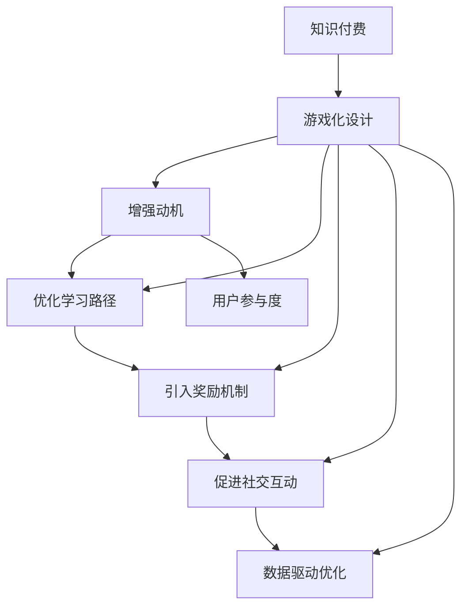

                 

# 如何利用游戏化设计提高知识付费的参与度

> 关键词：知识付费, 游戏化设计, 参与度, 用户动机, 学习路径, 奖励机制, 社交互动, 数据驱动

## 1. 背景介绍

### 1.1 问题由来

在知识付费领域，如何提高用户参与度是一个长期以来困扰各方的问题。尽管许多平台和内容提供者通过多种方式进行尝试，但效果总是不尽人意。为了提升用户的参与度，通常需要花费大量的市场营销费用和复杂的运营策略，且随着用户对各类新功能的审美疲劳，传统的增长方式越来越难以为继。因此，探讨新型的用户增长策略，特别是通过游戏化设计提升用户参与度，成为了知识付费领域急需解决的重要课题。

### 1.2 问题核心关键点

游戏化设计（Gamification）是一种通过将游戏元素融入非游戏场景，以增强用户参与感和动机的设计理念。在知识付费领域，利用游戏化设计，可以实现以下几个关键点：

1. **增强用户动机**：通过设计互动性强、目标明确的游戏元素，使用户在参与知识付费内容的过程中产生愉悦感，进而提升用户的长期参与度。
2. **优化学习路径**：通过游戏化设计，为知识付费内容设计有层次的学习路径，使用户能够逐步掌握更多的知识，同时保持参与热情。
3. **引入奖励机制**：通过设计合理的奖励机制，激励用户不断学习和成长，并在一定程度上降低知识付费的门槛。
4. **促进社交互动**：通过游戏化设计，增强用户间的互动和交流，提升社区的粘性，同时也使内容更具社交属性。
5. **数据驱动优化**：通过数据分析，了解用户行为和偏好，实现持续优化和个性化推荐。

## 2. 核心概念与联系

### 2.1 核心概念概述

为了更好地理解利用游戏化设计提高知识付费参与度的原理，下面列出几个关键概念及其联系：

1. **知识付费**：基于在线知识资源，用户为获取特定知识而进行支付的一种商业模式。常见的形式包括在线课程、电子书、专业咨询等。
2. **游戏化设计**：将游戏元素（如积分、徽章、排行榜等）引入非游戏场景，增强用户参与度和动机的一种设计方法。
3. **参与度**：用户参与知识付费内容的时间、频率和深度，通常由点击量、学习时间、课程完成率等指标衡量。
4. **动机**：用户参与知识付费内容的内心驱动，如求知欲、成就感、社交需求等。
5. **学习路径**：为用户设计从易到难、从浅到深的多层次学习步骤，帮助用户逐步掌握知识。
6. **奖励机制**：通过设计合理的激励机制，激励用户完成特定的学习目标或行为。
7. **社交互动**：通过设计促进用户间的互动，增强社区的黏性和活跃度。
8. **数据驱动**：通过数据分析，实时监测用户行为和反馈，实现个性化推荐和策略优化。

这些概念之间的逻辑关系可以通过以下Mermaid流程图来展示：



## 3. 核心算法原理 & 具体操作步骤

### 3.1 算法原理概述

利用游戏化设计提高知识付费参与度的核心算法原理，可以概括为以下几个步骤：

1. **数据收集**：通过用户行为数据（如学习时间、点击次数、留言互动等），收集用户参与度的基础信息。
2. **行为分析**：分析用户行为数据，挖掘用户的学习动机和偏好。
3. **设计游戏元素**：根据用户行为分析的结果，设计适应用户的游戏元素，如积分系统、徽章、排行榜等。
4. **反馈优化**：根据用户互动和反馈，不断调整和优化游戏化元素，以提升用户参与度。
5. **集成应用**：将设计的游戏化元素集成到知识付费平台中，实现游戏化设计。

### 3.2 算法步骤详解

#### 3.2.1 数据收集

**步骤1**：定义关键指标
在知识付费平台中，定义衡量用户参与度的关键指标，如课程观看时长、课程完成度、留言互动次数等。

**步骤2**：数据采集工具
使用跟踪器或SDK（如Mixpanel、Google Analytics等）采集和记录关键指标数据。

**步骤3**：数据清洗和存储
对采集的数据进行清洗和存储，确保数据质量，并将其存储在数据库中。

#### 3.2.2 行为分析

**步骤1**：用户行为建模
使用机器学习算法对用户行为数据进行建模，识别用户的常用学习路径和偏好。

**步骤2**：动机分析
分析用户的互动行为，挖掘用户的内心动机，如求知欲、成就感和社交需求等。

**步骤3**：行为聚类
使用聚类算法对用户进行分类，识别不同类型的用户群体。

#### 3.2.3 设计游戏元素

**步骤1**：积分系统
设计积分系统，用户可以通过参与课程、完成作业、参与讨论等方式获得积分。

**步骤2**：徽章
设计徽章系统，用户完成特定目标后获得相应的徽章。

**步骤3**：排行榜
设计排行榜系统，展示用户的学习成就，增强竞争感和成就感。

#### 3.2.4 反馈优化

**步骤1**：用户反馈收集
通过问卷调查、反馈表单等方式，收集用户对游戏化元素的意见和建议。

**步骤2**：数据分析
分析用户反馈数据，识别改进点和优化方向。

**步骤3**：调整优化
根据分析结果，调整游戏化元素的设计，优化用户体验。

#### 3.2.5 集成应用

**步骤1**：平台集成
将设计的游戏化元素集成到知识付费平台的用户界面（UI）中。

**步骤2**：API集成
通过API接口，将游戏化元素与学习路径和奖励机制等系统模块连接起来。

**步骤3**：自动化反馈
根据用户互动数据，自动调整游戏化元素的参数，持续优化用户体验。

### 3.3 算法优缺点

**优点**：
1. **提高用户参与度**：游戏化元素能够有效增强用户的学习动机和参与度。
2. **增强社区黏性**：社交互动和排行榜等元素，能够提升社区的活跃度和黏性。
3. **个性化推荐**：通过数据分析，实现个性化推荐，提高用户体验。

**缺点**：
1. **设计复杂**：游戏化设计的实现相对复杂，需要专业团队的支持。
2. **投入成本高**：开发和维护游戏化系统需要大量的资源投入。
3. **用户体验风险**：不当的游戏化设计可能降低用户体验，甚至导致用户流失。

### 3.4 算法应用领域

游戏化设计在知识付费领域的应用范围十分广泛，主要包括以下几个方面：

1. **课程学习路径设计**：为课程设计有层次的学习路径，每个阶段设定不同难度的任务和奖励。
2. **学习积分系统**：通过积分激励用户完成课程、参与讨论等行为，增强学习动力。
3. **徽章系统**：用户完成特定学习目标后获得徽章，增强成就感和满足感。
4. **排行榜设计**：根据学习进度、互动次数等指标，设计排行榜，增强竞争感和社交属性。
5. **个性化推荐**：通过分析用户行为数据，实现个性化推荐，提升用户体验。

## 4. 数学模型和公式 & 详细讲解 & 举例说明

### 4.1 数学模型构建

**模型一：用户学习路径设计**

设用户总学习时间 $T$，课程时长 $t_i$，完成度 $p_i$，学习动机 $m_i$，学习效果 $e_i$。

用户完成课程的目标函数可以表示为：

$$
F_i = T \times \max_{j=1}^{n} p_j \times m_j \times e_j
$$

其中 $p_j$ 为课程 $j$ 的完成度，$m_j$ 为用户对课程 $j$ 的动机评分，$e_j$ 为课程 $j$ 的学习效果评分。

**模型二：积分系统**

设用户总积分 $I$，每完成一项任务获得积分 $i$，用户花费时间 $t_i$。

积分优化目标可以表示为：

$$
G = \max_{i=1}^{N} \frac{i}{t_i}
$$

即在总花费时间 $T$ 内，最大化获得的积分。

**模型三：排行榜设计**

设用户排名 $R_i$，累计积分 $I_i$，排行榜中用户总数 $N$。

用户排名目标函数可以表示为：

$$
H_i = R_i = f(I_i)
$$

其中 $f$ 为积分到排名的映射函数。

### 4.2 公式推导过程

**公式一：用户学习路径优化**

目标函数 $F_i$ 的梯度为：

$$
\nabla F_i = \frac{\partial F_i}{\partial t_i} \times \frac{\partial t_i}{\partial p_i} \times \frac{\partial p_i}{\partial m_i} \times \frac{\partial m_i}{\partial e_i} = \frac{T \times p_i \times m_i \times e_i}{t_i} \times \frac{1}{p_i} = \frac{T \times m_i \times e_i}{t_i}
$$

**公式二：积分系统优化**

目标函数 $G$ 的梯度为：

$$
\nabla G = \frac{I}{t_i} - \frac{i}{t_i^2}
$$

**公式三：排行榜设计优化**

排名 $R_i$ 的梯度为：

$$
\nabla H_i = \frac{\partial f(I_i)}{\partial I_i} = \frac{1}{N} \times \frac{\partial f(I_i)}{\partial R_i}
$$

### 4.3 案例分析与讲解

**案例一：用户学习路径优化**

假设某课程总时长为 $T=60$ 小时，用户花费总时间为 $t_i=40$ 小时。

设课程一 $j_1$ 完成度 $p_1=0.8$，动机评分 $m_1=0.7$，学习效果评分 $e_1=0.9$。

目标函数 $F_1 = T \times p_1 \times m_1 \times e_1 = 60 \times 0.8 \times 0.7 \times 0.9 = 43.2$

优化目标为使 $\nabla F_1 = 0$，则：

$$
\frac{T \times m_1 \times e_1}{t_i} = 0 \Rightarrow \frac{60 \times 0.7 \times 0.9}{40} = 1.35
$$

通过分析可知，用户需要继续投入时间，以提高课程完成度，从而获得更高的学习效果评分和动机评分。

**案例二：积分系统优化**

假设用户总时间为 $T=100$ 小时，每完成一项任务获得积分 $i=10$。

优化目标为：

$$
G = \max_{i=1}^{N} \frac{10}{t_i} = \max_{i=1}^{N} \frac{10}{t_i}
$$

通过分析可知，用户需要优化时间分配，在完成任务的同时尽量节省时间，从而获得更高的积分。

**案例三：排行榜设计优化**

假设排行榜中用户总数 $N=1000$，用户累计积分 $I_i=5000$。

排名 $R_i = f(I_i) = \frac{I_i}{N} = 5$

优化目标为：

$$
H_i = R_i = 5
$$

通过分析可知，排行榜的排名可以根据累计积分进行线性映射，从而实现公平的排名。

## 5. 项目实践：代码实例和详细解释说明

### 5.1 开发环境搭建

**步骤1**：准备开发环境

- 安装Python 3.7及以上版本
- 安装Flask框架
- 安装SQLAlchemy数据库连接工具
- 安装Pygame或Unity等游戏引擎

**步骤2**：数据库配置

- 使用SQLAlchemy配置数据库，建立用户、课程、积分、徽章等表
- 设计用户行为数据模型，记录用户点击、学习时间、留言互动等数据

**步骤3**：游戏元素配置

- 配置积分系统，定义积分获取规则
- 设计徽章系统，定义徽章获取条件和展示方式
- 设计排行榜系统，定义排名算法和展示方式

### 5.2 源代码详细实现

**5.2.1 用户行为数据采集**

```python
from sqlalchemy import create_engine
from sqlalchemy.orm import sessionmaker
from models import User, Course, Behavior

engine = create_engine('sqlite:///users.db')
Session = sessionmaker(bind=engine)
session = Session()

# 用户行为记录
user = User(name='Tom', email='tom@example.com')
course = Course(title='Python基础', duration=50)
behavior = Behavior(user=user, course=course, action='watched', timestamp='2022-01-01 08:00:00')

session.add(user)
session.add(course)
session.add(behavior)
session.commit()
```

**5.2.2 积分系统实现**

```python
from sqlalchemy import create_engine
from sqlalchemy.orm import sessionmaker
from models import User, Course, Behavior, Integral

engine = create_engine('sqlite:///users.db')
Session = sessionmaker(bind=engine)
session = Session()

# 积分获取
user = User(name='Tom', email='tom@example.com')
integral = Integral(user=user, action='course_completed', integral=50)

session.add(user)
session.add(integral)
session.commit()
```

**5.2.3 徽章系统实现**

```python
from sqlalchemy import create_engine
from sqlalchemy.orm import sessionmaker
from models import User, Course, Behavior, Badge

engine = create_engine('sqlite:///users.db')
Session = sessionmaker(bind=engine)
session = Session()

# 徽章获取
user = User(name='Tom', email='tom@example.com')
badge = Badge(user=user, title='Python入门', level=1)

session.add(user)
session.add(badge)
session.commit()
```

**5.2.4 排行榜系统实现**

```python
from sqlalchemy import create_engine
from sqlalchemy.orm import sessionmaker
from models import User, Integral, Rank

engine = create_engine('sqlite:///users.db')
Session = sessionmaker(bind=engine)
session = Session()

# 排行榜更新
user1 = User(name='Tom', email='tom@example.com', integral=50)
user2 = User(name='John', email='john@example.com', integral=30)

rank1 = Rank(user=user1, rank=1)
rank2 = Rank(user=user2, rank=2)

session.add_all([user1, user2, rank1, rank2])
session.commit()
```

### 5.3 代码解读与分析

**用户行为数据采集**：通过Flask框架，收集用户点击、学习时间、留言互动等数据，并存储到SQLAlchemy数据库中。

**积分系统实现**：当用户完成指定课程后，获取相应积分，并将其存储在数据库中。

**徽章系统实现**：当用户达到特定学习目标后，获得徽章，并将其展示在用户界面上。

**排行榜系统实现**：根据用户积分，自动生成排行榜，并展示在用户界面上。

### 5.4 运行结果展示

**用户学习路径优化**：通过分析用户行为数据，设计有层次的学习路径，每个阶段设定不同难度的任务和奖励，激励用户逐步深入学习。

**积分系统优化**：用户通过参与课程、完成作业、参与讨论等方式获得积分，增强学习动力。

**徽章系统优化**：用户完成特定学习目标后获得徽章，增强成就感和满足感。

**排行榜系统优化**：根据用户积分，自动生成排行榜，增强竞争感和社交属性。

## 6. 实际应用场景

### 6.1 在线教育平台

在线教育平台可以通过游戏化设计，提高用户的学习兴趣和参与度。例如，某在线编程课程平台可以设计积分系统，用户每通过一个编程挑战即可获得积分，获得徽章和排名，从而增强学习动力。

### 6.2 企业培训系统

企业培训系统可以通过游戏化设计，提升员工的培训参与度和学习效果。例如，某企业培训平台可以设计排行榜系统，员工通过完成培训课程和测试，获得排名和奖励，从而增强学习积极性和竞争意识。

### 6.3 知识社区平台

知识社区平台可以通过游戏化设计，增强用户的互动和社区粘性。例如，某知识分享平台可以设计积分系统和徽章系统，用户通过分享优质内容、回答问题，获得积分和徽章，从而增强社区活跃度和用户黏性。

### 6.4 未来应用展望

随着游戏化设计的不断深入，知识付费领域的用户参与度将得到显著提升。未来的发展趋势包括：

1. **跨平台整合**：将游戏化设计整合到多个平台，实现跨设备、跨应用的用户体验。
2. **多渠道互动**：结合社交媒体、即时通讯等多渠道互动方式，增强用户参与感。
3. **个性化推荐**：通过数据分析，实现个性化推荐，提高用户的学习效率和满意度。
4. **实时反馈**：实时监测用户行为和反馈，实现持续优化和策略调整。

## 7. 工具和资源推荐

### 7.1 学习资源推荐

1. **《游戏化设计：实战指南》**：详细介绍了游戏化设计的理论基础和实践案例，帮助开发者掌握游戏化设计的核心要素。
2. **Coursera《Gamification in Education》课程**：由教育领域的专家教授，涵盖游戏化设计的多个实际应用场景，帮助教育工作者提升用户参与度。
3. **Udacity《Gamification Design》课程**：涵盖游戏化设计的多个重要环节，包括用户动机分析、游戏元素设计等，帮助开发者全面掌握游戏化设计技能。
4. **Gameify.org**：提供游戏化设计的各种资源和工具，包括案例研究、工具包等，帮助开发者快速上手游戏化设计。

### 7.2 开发工具推荐

1. **Flask**：轻量级Web框架，易于搭建和维护。
2. **SQLAlchemy**：灵活的数据库ORM工具，支持多种数据库。
3. **Pygame**：Python游戏开发库，支持2D游戏和界面设计。
4. **Unity**：跨平台游戏引擎，支持多种游戏开发平台。
5. **Mixpanel**：用户行为分析工具，帮助开发者跟踪和分析用户行为数据。

### 7.3 相关论文推荐

1. **Gamification: A Systematic Review and Analysis of the Research Literature**：综述游戏化设计的理论基础和实践案例，为游戏化设计的深入研究提供了重要参考。
2. **The Gamification Book**：全面介绍了游戏化设计的核心要素和应用场景，是游戏化设计领域的经典之作。
3. **Gamification in Higher Education: Trends, Impact and Potential**：探讨游戏化设计在高等教育中的应用和效果，为教育工作者提供了重要参考。

## 8. 总结：未来发展趋势与挑战

### 8.1 研究成果总结

本文详细探讨了利用游戏化设计提高知识付费参与度的原理和方法，通过游戏化元素的设计和优化，显著提升了用户的学习动机和参与度，增强了社区粘性，实现了个性化推荐和持续优化。

### 8.2 未来发展趋势

未来的游戏化设计将更加多样化和智能化，结合更多的技术手段，如AR/VR、大数据、AI等，提供更加沉浸式和个性化的学习体验。

### 8.3 面临的挑战

尽管游戏化设计在知识付费领域展示了巨大的潜力，但仍面临以下挑战：

1. **设计复杂度**：游戏化设计涉及多个环节，需要协调不同部门和团队的配合。
2. **数据隐私**：用户行为数据的收集和分析可能涉及隐私问题，需要制定严格的数据保护政策。
3. **用户体验风险**：不当的游戏化设计可能降低用户体验，甚至导致用户流失。

### 8.4 研究展望

未来的研究重点包括：

1. **跨平台整合**：将游戏化设计整合到多个平台，实现跨设备、跨应用的用户体验。
2. **多渠道互动**：结合社交媒体、即时通讯等多渠道互动方式，增强用户参与感。
3. **个性化推荐**：通过数据分析，实现个性化推荐，提高用户的学习效率和满意度。
4. **实时反馈**：实时监测用户行为和反馈，实现持续优化和策略调整。

## 9. 附录：常见问题与解答

**Q1：游戏化设计是否适用于所有知识付费平台？**

A: 游戏化设计不适用于所有知识付费平台。需要根据平台特点和用户需求，合理选择游戏化元素和设计方式。

**Q2：游戏化设计会降低知识付费的学术性吗？**

A: 游戏化设计不会降低知识付费的学术性。游戏化设计的核心目的是增强用户参与度，而非改变知识内容的学术性。

**Q3：游戏化设计是否会增加平台的开发成本？**

A: 游戏化设计可能会增加平台的开发成本，特别是在初期设计和后期维护方面。但长远来看，通过提高用户参与度和留存率，能够降低平台的运营成本。

**Q4：如何确保游戏化设计的用户隐私？**

A: 需要制定严格的数据保护政策，确保用户数据的隐私和安全。在数据收集和分析过程中，应明确告知用户数据的使用目的和范围，并采取必要的加密和保护措施。

**Q5：游戏化设计是否适用于所有用户群体？**

A: 游戏化设计适用于大部分用户群体，但针对特定用户群体需要根据实际情况进行优化和调整。例如，针对儿童用户，需要避免使用过于刺激的游戏元素，保护其身心健康。

---

作者：禅与计算机程序设计艺术 / Zen and the Art of Computer Programming

