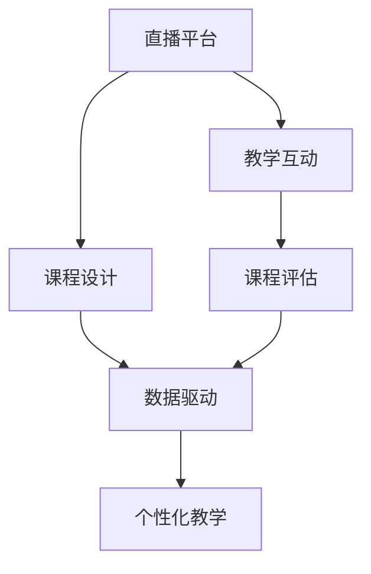

                 

## 1. 背景介绍

在数字化浪潮下，教育领域也逐步向线上转型，线上课程成为重要的教育形态。然而，在众多在线课程中，如何脱颖而出，吸引和留住学员，提升课程口碑，是每位教育工作者面临的挑战。直播平台因其互动性强、内容实时性高、学习体验丰富等特点，成为推动在线教育行业发展的关键力量。本文将探讨如何利用直播平台，通过多样化、个性化的教学方式，增加课程口碑，实现良好的教学效果。

## 2. 核心概念与联系

### 2.1 核心概念概述

为更好地理解如何利用直播平台提升课程口碑，本节将介绍几个核心概念：

- **直播平台**：以实时视频传输为核心的网络平台，提供音视频互动、数据共享等功能，是教育直播的重要载体。
- **课程设计**：根据学员需求和学习目标，设计有层次、有深度的课程内容，使学员在直播互动中获得知识提升。
- **教学互动**：利用直播平台进行实时互动，包括提问、讨论、投票等，增加课程的参与度和沉浸感。
- **课程评估**：通过学员反馈、互动数据等，对课程效果进行评估和优化，持续改进课程质量。
- **数据驱动**：利用大数据技术，对学员行为数据进行分析，指导课程设计和优化，实现个性化教学。

这些概念之间的逻辑关系可以通过以下Mermaid流程图来展示：



这个流程图展示了这个系统的核心概念及其之间的关系：直播平台作为交互媒介，提供课程设计、教学互动、课程评估和数据驱动等环节，最终实现个性化教学。

## 3. 核心算法原理 & 具体操作步骤

### 3.1 算法原理概述

直播平台通过以下步骤提升课程口碑：

1. **前期准备**：选择合适的直播平台，设计课程大纲，确定互动形式。
2. **直播互动**：通过直播平台进行实时互动，增加学员参与度和沉浸感。
3. **数据采集与分析**：收集学员互动数据，分析学员行为和反馈，优化课程设计。
4. **反馈调整**：根据学员反馈和互动数据，调整课程内容和互动方式，提升教学效果。
5. **内容迭代**：根据课程评估和数据分析，迭代更新课程内容，实现个性化教学。

### 3.2 算法步骤详解

以下详细介绍利用直播平台提升课程口碑的具体操作步骤：

**Step 1: 前期准备**

1. **选择直播平台**：根据课程需求选择合适的直播平台，如腾讯课堂、网易云课堂等。
2. **设计课程大纲**：根据课程内容和学习目标，设计有层次、有深度的课程大纲。
3. **确定互动形式**：确定互动方式，如提问、讨论、投票等，以提升学员参与度。

**Step 2: 直播互动**

1. **实时互动**：在直播中通过提问、讨论、投票等方式，增加学员参与度，提升互动感。
2. **课程讲解**：利用直播平台的音视频功能，进行高质量的课程讲解，使学员能更好地理解内容。
3. **即时反馈**：通过直播平台的反馈功能，实时了解学员的反馈和疑问，及时解答。

**Step 3: 数据采集与分析**

1. **采集互动数据**：利用直播平台的互动功能，采集学员的提问、投票等数据。
2. **分析学员行为**：通过大数据技术，对采集到的数据进行分析，了解学员的学习行为和反馈。
3. **评估课程效果**：根据学员反馈和互动数据，评估课程的效果，找出改进点。

**Step 4: 反馈调整**

1. **调整课程内容**：根据课程评估和数据分析，调整课程内容，满足学员需求。
2. **优化互动方式**：优化互动方式，提升学员参与度和学习体验。
3. **持续改进**：持续改进课程设计和互动方式，实现教学效果的最大化。

**Step 5: 内容迭代**

1. **迭代更新课程内容**：根据课程评估和数据分析，不断迭代更新课程内容，实现个性化教学。
2. **引入新技术**：引入新技术和工具，提升课程的互动性和学习效果。

### 3.3 算法优缺点

利用直播平台提升课程口碑有以下优点：

1. **提高互动性**：直播平台的实时互动功能，可以大幅提升学员的参与度和沉浸感。
2. **即时反馈**：通过直播平台，教师可以实时了解学员的反馈和疑问，及时解答，提升教学效果。
3. **数据驱动**：利用大数据技术，分析学员行为和反馈，指导课程设计和优化，实现个性化教学。

然而，直播平台也有以下缺点：

1. **技术门槛较高**：需要一定的技术支持，如直播平台选择、技术调试等，对教师的技术要求较高。
2. **设备要求**：直播需要稳定的网络连接和良好的设备，对教师的设备配置要求较高。
3. **内容准备量大**：直播课程的设计和准备相对复杂，需要投入大量时间和精力。

### 3.4 算法应用领域

直播平台在教育领域的应用已相当广泛，具体到课程口碑提升，主要应用于以下领域：

1. **在线课程**：通过直播平台，提供实时互动的在线课程，提升学员的学习体验和参与度。
2. **企业培训**：利用直播平台，进行企业内部培训，提高培训效果和员工参与度。
3. **职业教育**：通过直播平台，进行职业技能的培训，提升学员的就业竞争力。
4. **在线考试**：利用直播平台，进行在线考试，实时互动和评分，提升考试的公平性和效率。
5. **语言学习**：利用直播平台，进行外语学习的互动课程，提高语言学习的沉浸感和效果。

## 4. 数学模型和公式 & 详细讲解

### 4.1 数学模型构建

为了更好地衡量直播平台的教学效果，可以构建一个基于学员互动数据和反馈的教学效果评估模型。设学员总数为 $N$，直播课程的互动次数为 $I$，学员的评分次数为 $R$，互动评分数为 $S$，则教学效果的数学模型可以表示为：

$$
E = \frac{I + S}{N}
$$

其中 $E$ 表示教学效果，$I$ 和 $S$ 分别表示学员互动次数和互动评分数，$N$ 表示学员总数。

### 4.2 公式推导过程

通过上述数学模型，可以计算出直播平台的教学效果 $E$，具体推导如下：

$$
E = \frac{I + S}{N}
$$

其中：

- $I$：学员互动次数，反映学员的参与度和积极性。
- $S$：学员互动评分数，反映学员对课程的满意度。
- $N$：学员总数，反映课程覆盖的范围和参与度。

### 4.3 案例分析与讲解

以某在线教育平台的直播课程为例，分析其教学效果。假设该课程有1000名学员参与，互动次数为2000次，学员对课程的平均评分4.5分，则该课程的教学效果 $E$ 为：

$$
E = \frac{2000 + 1000 \times 4.5}{1000} = 6.5
$$

这表明该课程的教学效果很好，学员参与度高，互动评分也较高。

## 5. 项目实践：代码实例和详细解释说明

### 5.1 开发环境搭建

在进行直播平台教学效果评估的代码实现前，需要准备好开发环境。以下是使用Python进行代码实现的开发环境配置流程：

1. 安装Python：从官网下载并安装Python，建议选择3.8版本以上。
2. 安装相关库：安装pandas、numpy、matplotlib等常用库，用于数据处理和可视化。
3. 安装直播平台API：根据选择的直播平台，下载并安装对应的API库，如腾讯课堂API、网易云课堂API等。

### 5.2 源代码详细实现

以下是一个简单的Python代码实例，用于计算直播平台的教学效果：

```python
import pandas as pd
from matplotlib import pyplot as plt

# 读取学员互动数据和评分数据
interaction_data = pd.read_csv('interaction_data.csv')
rating_data = pd.read_csv('rating_data.csv')

# 计算互动次数和互动评分数
I = interaction_data['interaction'].sum()
S = rating_data['rating'].sum()

# 计算学员总数
N = interaction_data['number'].sum()

# 计算教学效果
E = (I + S) / N

# 输出教学效果
print(f"教学效果 E: {E:.2f}")

# 可视化学员互动次数和互动评分数的分布
interaction_data.hist(by='interaction', bins=10, figsize=(10, 6), color='blue')
plt.title('学员互动次数分布')
plt.xlabel('互动次数')
plt.ylabel('频率')
plt.show()

rating_data.hist(by='rating', bins=10, figsize=(10, 6), color='red')
plt.title('学员互动评分数分布')
plt.xlabel('互动评分数')
plt.ylabel('频率')
plt.show()
```

### 5.3 代码解读与分析

让我们再详细解读一下关键代码的实现细节：

- **数据读取**：使用pandas库读取学员互动数据和评分数据，方便后续计算和分析。
- **计算互动次数和评分数**：使用DataFrame的sum函数计算所有学员的互动次数和评分数。
- **计算学员总数**：使用DataFrame的sum函数计算所有学员的数量。
- **计算教学效果**：将互动次数和评分数相加，再除以学员总数，计算教学效果。
- **可视化分析**：使用matplotlib库对学员互动次数和评分数的分布进行可视化分析。

以上代码实例展示了如何使用Python计算和分析直播平台的教学效果，并提供可视化结果。

## 6. 实际应用场景

### 6.1 企业内部培训

直播平台在企业内部培训中，可以提供实时互动和反馈功能，大幅提升培训效果。企业可以利用直播平台，进行定期的在线培训，邀请专家进行讲解，通过提问、讨论、投票等互动方式，提高员工的学习兴趣和参与度。

### 6.2 职业资格认证考试

在线教育平台可以利用直播平台，进行职业资格认证考试。通过直播平台进行实时互动和评分，确保考试的公平性和效率，提升学员的学习体验。

### 6.3 在线公开课

直播平台可以用于在线公开课，邀请知名学者进行讲解，通过互动和反馈，提升学员的学习效果。直播平台还可以进行实时录制和回放，方便学员复习和巩固知识。

### 6.4 未来应用展望

随着技术的发展，直播平台将会有更多的应用场景：

1. **虚拟课堂**：利用AR/VR技术，创建虚拟课堂，提供沉浸式的学习体验。
2. **互动答题**：通过实时互动和答题，提高学员的学习效果，增加课程的趣味性。
3. **个性化推荐**：利用大数据技术，对学员的学习行为进行分析，提供个性化的学习推荐。
4. **实时分析**：通过实时分析学员的学习数据，及时调整课程内容和互动方式，提升教学效果。

直播平台在教育领域的应用前景广阔，未来的发展将更加多样化和智能化。

## 7. 工具和资源推荐

### 7.1 学习资源推荐

为了帮助开发者掌握直播平台在教学中的使用，这里推荐一些优质的学习资源：

1. **《教育直播技术入门》系列博文**：由教育技术专家撰写，介绍教育直播的基本原理和常用技术。
2. **《在线教育平台设计》课程**：清华大学的在线教育平台设计课程，涵盖直播平台的设计与开发。
3. **《教育技术创新与实践》书籍**：总结教育技术领域的最新研究成果，提供案例分析和实践指导。
4. **MOOC平台**：如Coursera、edX等在线学习平台，提供大量关于教育技术开发的课程和资料。
5. **教育技术社区**：如教育技术论坛、博客等，汇聚教育技术领域的专家和从业者，分享经验和技术。

通过这些资源的学习实践，相信你一定能够掌握直播平台在教学中的应用，实现更好的教学效果。

### 7.2 开发工具推荐

高效的开发离不开优秀的工具支持。以下是几款用于直播平台教学效果评估开发的常用工具：

1. **Python**：作为数据处理和分析的主流语言，Python提供了丰富的数据处理和可视化库，如pandas、numpy、matplotlib等。
2. **Pandas**：数据处理和分析库，提供高效的数据处理和统计分析功能。
3. **Matplotlib**：数据可视化库，支持多种图表绘制，方便数据可视化分析。
4. **Streamlit**：Python的Web应用框架，用于开发交互式的Web应用。
5. **TensorBoard**：TensorFlow的可视化工具，支持模型训练和分析的可视化。

合理利用这些工具，可以显著提升直播平台教学效果评估的开发效率，加快创新迭代的步伐。

### 7.3 相关论文推荐

直播平台在教育领域的研究已取得多项重要成果，以下是几篇奠基性的相关论文，推荐阅读：

1. **《教育直播平台的研究与设计》**：总结了教育直播平台的研究进展和技术方向。
2. **《在线教育平台的数据驱动优化》**：利用大数据技术，优化在线教育平台的用户体验和教学效果。
3. **《基于社交媒体的教育互动分析》**：研究社交媒体在教育中的应用，提升学员的参与度和互动效果。
4. **《企业内部培训的直播平台实现》**：介绍了企业内部培训中直播平台的应用实践和经验总结。
5. **《教育技术在职业资格认证考试中的应用》**：总结了教育技术在职业资格认证考试中的应用案例和效果评估。

这些论文代表了教育直播领域的研究进展，通过学习这些前沿成果，可以帮助研究者把握学科前进方向，激发更多的创新灵感。

## 8. 总结：未来发展趋势与挑战

### 8.1 总结

本文对利用直播平台提升课程口碑的方法进行了全面系统的介绍。首先阐述了直播平台在教育中的应用背景和意义，明确了直播平台的实时互动、即时反馈等优势。其次，从原理到实践，详细讲解了直播平台提升课程口碑的数学模型构建和代码实现，给出了直播平台教学效果评估的完整代码实例。同时，本文还探讨了直播平台在企业培训、职业资格认证考试等场景中的应用，展示了直播平台在教育领域的多样化应用前景。

通过本文的系统梳理，可以看到，直播平台在教育领域的潜力巨大，通过互动性、实时性、个性化等特点，能够显著提升课程口碑和教学效果。直播平台的成功应用，需要教育工作者和开发者共同努力，不断优化课程设计和互动方式，实现更好的教学效果。

### 8.2 未来发展趋势

展望未来，直播平台在教育领域将呈现以下几个发展趋势：

1. **智能互动**：利用人工智能技术，自动生成问题、引导学员互动，提升互动效果。
2. **实时分析**：通过大数据技术，实时分析学员的学习行为和反馈，提供个性化的学习推荐。
3. **多平台融合**：将直播平台与其他教育平台进行融合，提供更加多样化的教育服务。
4. **虚拟课堂**：利用AR/VR技术，创建虚拟课堂，提供沉浸式的学习体验。
5. **语音识别**：利用语音识别技术，提升直播课程的互动性和个性化。

以上趋势凸显了直播平台在教育领域的广阔前景，这些方向的探索发展，必将进一步提升在线教育的效果和质量，为学生提供更好的学习体验。

### 8.3 面临的挑战

尽管直播平台在教育领域的应用已经取得了一定成果，但在迈向更加智能化、普适化应用的过程中，它仍面临着诸多挑战：

1. **技术门槛较高**：直播平台的技术实现相对复杂，需要一定的技术支持和专业技能。
2. **网络带宽要求**：直播需要稳定的网络带宽，对网络环境的要求较高。
3. **设备要求**：直播课程的设备和环境要求较高，需要稳定的设备和良好的网络连接。
4. **内容准备量大**：直播课程的设计和准备相对复杂，需要投入大量时间和精力。
5. **数据安全**：直播平台涉及大量的学员互动数据，需要严格的数据安全和隐私保护措施。

### 8.4 未来突破

面对直播平台在教育领域面临的挑战，未来的研究需要在以下几个方面寻求新的突破：

1. **引入AI技术**：利用人工智能技术，提升互动效果和个性化教学。
2. **优化技术架构**：优化直播平台的技术架构，提高平台的稳定性和扩展性。
3. **引入新技术**：引入AR/VR、语音识别等新技术，提升直播课程的互动性和沉浸感。
4. **建立数据安全机制**：建立严格的数据安全和隐私保护机制，确保学员数据的隐私和安全。
5. **多平台融合**：将直播平台与其他教育平台进行融合，提供更加多样化的教育服务。

这些研究方向的探索，必将引领直播平台在教育领域迈向更高的台阶，为教育工作者和学生提供更好的学习体验和教学效果。总之，直播平台在教育领域的成功应用，需要教育工作者和开发者共同努力，不断优化课程设计和互动方式，实现更好的教学效果。

## 9. 附录：常见问题与解答

**Q1：如何选择合适的直播平台？**

A: 选择直播平台需要考虑以下几个因素：
1. **平台功能**：根据课程需求选择合适的平台功能，如互动问答、实时评分等。
2. **技术支持**：选择技术支持较好的平台，确保课程的稳定运行。
3. **用户体验**：选择用户体验良好的平台，提升学员的学习体验。

**Q2：直播课程应该如何设计？**

A: 直播课程的设计需要考虑以下几个方面：
1. **课程目标**：明确课程的学习目标和知识体系。
2. **互动形式**：设计合适的互动形式，提升学员的参与度和学习效果。
3. **教学内容**：准备丰富的教学内容，确保学员能获得知识和技能。
4. **评估机制**：建立科学的评估机制，及时了解学员的学习效果。

**Q3：如何提高学员的互动效果？**

A: 提高学员的互动效果可以从以下几个方面入手：
1. **提问引导**：教师可以通过提问引导学员参与互动。
2. **讨论小组**：将学员分成小组，进行讨论和交流。
3. **实时反馈**：通过实时反馈机制，及时了解学员的疑问和困惑。
4. **互动奖励**：通过互动奖励机制，鼓励学员积极参与互动。

这些策略需要根据具体课程和学员特点灵活应用，才能取得理想的效果。

**Q4：如何保障直播课程的数据安全？**

A: 保障直播课程的数据安全需要从以下几个方面入手：
1. **数据加密**：对学员的互动数据进行加密存储和传输。
2. **访问控制**：建立严格的访问控制机制，确保数据的安全性。
3. **权限管理**：对不同角色和权限的人员进行权限管理，防止数据泄露。
4. **审计日志**：建立审计日志机制，记录数据访问和操作，方便追踪和审计。

通过以上措施，可以有效保障直播课程的数据安全，确保学员的隐私和数据安全。

**Q5：直播平台应该如何维护？**

A: 直播平台的维护需要从以下几个方面入手：
1. **定期检查**：定期检查平台运行状态，及时发现和解决问题。
2. **技术更新**：及时更新平台的技术版本，提升平台的稳定性和安全性。
3. **用户反馈**：及时收集用户的反馈和建议，进行优化和改进。
4. **备份恢复**：建立数据备份机制，确保平台的数据安全和可靠性。

这些措施需要综合应用，才能保障直播平台的正常运行和数据安全。

---

作者：禅与计算机程序设计艺术 / Zen and the Art of Computer Programming

