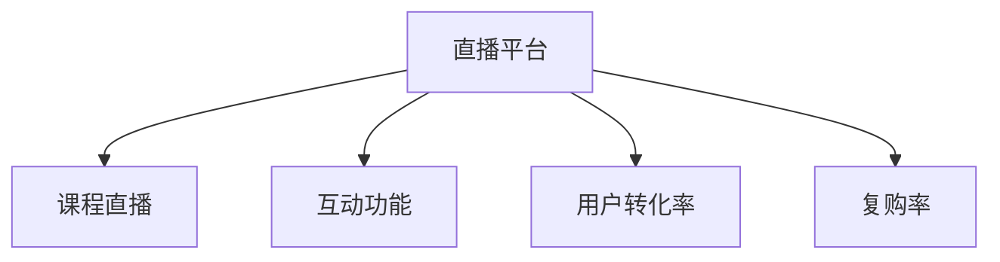

                 

# 如何利用直播平台增加课程销量

## 1. 背景介绍

### 1.1 问题由来
在互联网教育行业，如何增加课程销量一直是困扰教育机构的难题。传统的销售模式往往依赖于搜索引擎优化(SEO)、内容营销等手段，这些方法见效慢、成本高。而直播平台的兴起，提供了一种新的销售渠道，通过互动性强、内容丰富、形式多样的直播课程，吸引更多潜在客户，提升课程销量。

直播平台通过实时互动和内容展示，不仅能够吸引用户的注意力，还能营造一个良好的学习氛围，提升用户的学习体验。直播平台的互动性使得老师和学生可以实时沟通，教师的授课内容更具互动性和感染力，能够更好地吸引学生，提升学习效果。

### 1.2 问题核心关键点
直播平台增加课程销量主要依赖以下几个核心因素：
1. 直播内容的吸引力：直播内容质量是吸引用户的关键，需要精心设计和准备。
2. 主播的互动能力：主播的表达能力和互动能力对吸引用户和提升课程销量至关重要。
3. 直播平台的用户体验：平台的用户界面、互动功能、支付流程等都会影响用户的体验和购买决策。
4. 推广和营销策略：合理的推广和营销策略可以扩大课程的曝光度和吸引力。

这些因素互相交织，形成了一个复杂而高效的销售机制。通过合理设计和优化，直播平台可以极大地提升课程销量。

## 2. 核心概念与联系

### 2.1 核心概念概述

为了更好地理解直播平台增加课程销量的机制，本节将介绍几个密切相关的核心概念：

- **直播平台**：提供实时视频直播服务，支持多种互动功能，如即时聊天、投票、评论等，是增加课程销量的主要渠道。
- **课程直播**：以课程内容为核心，通过直播形式向用户提供学习体验，强调互动和沉浸感。
- **互动功能**：直播平台提供的多样化互动方式，如聊天室、点赞、评论、礼物等，可以增强用户参与感。
- **用户转化率**：直播平台上用户从浏览到购买课程的比例，是衡量直播平台销售效果的关键指标。
- **复购率**：用户再次购买同一课程的比例，反映课程内容的吸引力和平台的粘性。

这些核心概念之间的逻辑关系可以通过以下Mermaid流程图来展示：



这个流程图展示了几大核心概念之间的关联关系：

1. 直播平台通过提供课程直播服务，吸引用户参与，提升用户转化率。
2. 互动功能增强用户体验，提升用户留存率，间接提升复购率。
3. 用户转化率和复购率反映了直播平台在增加课程销量方面的效果。

## 3. 核心算法原理 & 具体操作步骤
### 3.1 算法原理概述

直播平台增加课程销量本质上是一个数据驱动的决策过程。其核心思想是通过数据分析和用户行为预测，优化直播内容和营销策略，提升用户参与度和购买意愿。

具体来说，直播平台利用以下算法和模型：

1. **A/B测试**：通过对比不同直播内容和营销策略的效果，选择最佳方案。
2. **用户行为分析**：分析用户观看行为、互动数据，找出用户偏好和痛点，优化直播内容和互动设计。
3. **推荐系统**：基于用户历史行为和兴趣，推荐适合的直播课程，提升用户参与度和购买意愿。
4. **预测模型**：使用历史数据和用户行为，预测用户购买课程的概率，优化推广策略。

### 3.2 算法步骤详解

直播平台增加课程销量的具体步骤包括：

**Step 1: 数据收集与预处理**

1. 收集直播平台上的用户行为数据，如观看时长、点赞数、评论数、互动频率等。
2. 收集课程直播的各类数据，如观看人数、互动情况、直播时长等。
3. 清洗和预处理数据，去除异常值和噪音，确保数据质量。

**Step 2: 用户行为分析**

1. 对用户观看行为进行分类，找出用户对课程直播的偏好和痛点。
2. 分析用户互动数据，找出影响用户购买行为的关键因素。
3. 通过用户画像技术，生成不同用户群体的特征标签，为推荐系统提供依据。

**Step 3: 推荐系统优化**

1. 根据用户画像，推荐适合的直播课程，提升用户参与度和购买意愿。
2. 动态调整推荐算法，根据用户反馈和行为数据进行优化。
3. 引入内容标签和推荐榜，展示热门课程和推荐内容，提升用户曝光度。

**Step 4: A/B测试**

1. 设计不同的直播内容和营销策略，进行A/B测试。
2. 收集测试数据，分析不同方案的效果，选择最佳方案。
3. 根据测试结果，优化直播内容和推广策略，提升用户转化率。

**Step 5: 预测模型构建**

1. 收集历史销售数据，构建预测模型，预测用户购买课程的概率。
2. 使用机器学习算法（如逻辑回归、随机森林、XGBoost等），构建分类模型。
3. 不断迭代模型，优化预测效果，提升推广策略的精准度。

**Step 6: 推广和营销策略**

1. 根据预测模型，优化推广策略，提升课程曝光度。
2. 使用SEO和内容营销手段，提升课程在搜索引擎和社交媒体上的曝光度。
3. 利用付费广告，定向投放给潜在用户，吸引更多用户参与直播课程。

### 3.3 算法优缺点

直播平台增加课程销量的方法具有以下优点：
1. 效果显著：通过数据分析和优化策略，可以快速提升课程销量。
2. 互动性强：直播平台提供实时互动功能，增强用户参与感，提升学习效果。
3. 用户粘性强：互动功能和内容推荐提升用户留存率，增加复购率。
4. 推广成本低：相比于传统广告，直播平台的推广成本相对较低。

同时，该方法也存在以下局限性：
1. 数据依赖性强：直播平台的效果依赖于数据质量和收集的完整性，对数据处理和分析要求高。
2. 技术门槛高：直播平台的设计和优化需要较高的技术水平和数据科学能力。
3. 用户隐私问题：直播平台涉及大量用户数据，需要严格遵守数据隐私保护法规。

尽管存在这些局限性，但就目前而言，直播平台结合数据分析和算法优化的方法，仍是增加课程销量最为高效和有效的方式。

### 3.4 算法应用领域

直播平台增加课程销量的方法在多个行业领域得到了广泛应用，例如：

- 在线教育：直播平台被广泛应用于在线教育，如K12教育、成人教育、技能培训等。
- 金融培训：金融从业者可以通过直播平台接受实时培训，学习最新的金融知识和技能。
- 健康医疗：医生可以通过直播平台进行在线诊疗和健康咨询，提高医疗服务的可及性。
- 电子商务：直播平台被用于商品展示和销售，提升消费者的购物体验。
- 游戏直播：游戏主播可以通过直播平台进行游戏直播，吸引大量观众观看。

除了上述这些经典应用外，直播平台还被创新性地应用到更多场景中，如政教互动、社区文化、旅游宣传等，为各行各业带来新的发展机遇。

## 4. 数学模型和公式 & 详细讲解 & 举例说明

### 4.1 数学模型构建

直播平台增加课程销量的数学模型主要包括以下几个部分：

- **用户行为数据**：$D_u=\{(x_i,y_i)\}_{i=1}^N$，其中$x_i$为用户行为数据，$y_i$为互动行为标签（如点赞、评论、观看时长等）。
- **课程直播数据**：$D_c=\{(x'_j,y'_j)\}_{j=1}^M$，其中$x'_j$为课程直播数据，$y'_j$为观看行为标签（如观看人数、观看时长、互动次数等）。
- **推荐系统**：$R=\{(r_{ij})\}_{i,j=1}^{N,M}$，其中$r_{ij}$表示用户$i$对课程$j$的推荐评分。
- **A/B测试数据**：$T=\{(t_k,y_k)\}_{k=1}^{K}$，其中$t_k$为测试策略，$y_k$为测试结果（如观看人数、购买率等）。
- **预测模型**：$P=\{(p_{il})\}_{i,l=1}^{N,C}$，其中$p_{il}$为第$i$个用户购买课程$l$的概率。

### 4.2 公式推导过程

以下我们将分别推导用户行为分析、推荐系统优化、A/B测试和预测模型的公式。

**用户行为分析**

假设用户行为数据$D_u$服从多分类标签$Y$，有$m$个特征$X$，则用户行为分析的目标是找出用户对课程直播的偏好。可以定义如下公式：

$$
P(y_i|X_i;\theta) = \frac{exp(\theta^TX_i \cdot y_i)}{\sum_{y \in Y}exp(\theta^TX_i \cdot y)}
$$

其中$\theta$为模型参数，$X_i$为第$i$个用户的行为特征，$y_i$为标签。通过最大化似然函数，可以估计模型参数$\theta$。

**推荐系统优化**

推荐系统的目标是为每个用户推荐最适合的课程。假设课程直播数据$D_c$有$M$个特征$X'$，则推荐评分可以表示为：

$$
r_{ij} = f(X'_j,X_i;\theta_r)
$$

其中$f$为推荐函数，$\theta_r$为推荐模型参数。推荐系统的优化目标是最大化平均评分：

$$
\hat{\theta_r} = \mathop{\arg\max}_{\theta_r} \frac{1}{N} \sum_{i=1}^N \sum_{j=1}^M r_{ij}
$$

**A/B测试**

A/B测试的目标是找出最佳的直播内容和营销策略。假设测试策略$T$有$K$个，测试结果$Y$为二分类标签（如观看人数、购买率等），则A/B测试的优化目标是：

$$
\hat{\theta_t} = \mathop{\arg\max}_{\theta_t} \sum_{k=1}^K y_k \log \frac{y_k}{\sum_{k=1}^K y_k}
$$

其中$\theta_t$为测试策略的参数，$y_k$为测试结果。

**预测模型**

预测模型的目标是为每个用户预测购买课程的概率。假设用户行为数据$D_u$有$N$个特征$X$，课程直播数据$D_c$有$M$个特征$X'$，则预测模型可以表示为：

$$
P(y_{il}|X_i,X'_l;\theta_p) = \frac{exp(\theta_p^T(X_i,X'_l) \cdot y_{il})}{\sum_{y \in Y}exp(\theta_p^T(X_i,X'_l) \cdot y_{il})}
$$

其中$\theta_p$为预测模型参数，$X_i$为用户行为特征，$X'_l$为课程直播特征。

### 4.3 案例分析与讲解

假设某在线教育平台希望通过直播平台提升课程销量。平台收集了如下数据：
- 用户行为数据：包含观看时长、点赞数、评论数等，共100个用户，每个用户有10个特征。
- 课程直播数据：包含观看人数、互动次数等，共50门课程，每门课程有5个特征。
- A/B测试数据：设计了两种不同的直播内容，分别测试了1000名用户，记录了观看人数和购买率。
- 预测模型数据：记录了50门课程的历史销售数据，每个课程有5个特征。

平台首先使用用户行为分析模型，找出用户对课程直播的偏好。然后，使用推荐系统优化模型，为每个用户推荐最适合的课程。接着，使用A/B测试模型，找出最佳的直播内容和营销策略。最后，使用预测模型，优化推广策略，提升课程销量。

## 5. 项目实践：代码实例和详细解释说明
### 5.1 开发环境搭建

在进行直播平台课程销售优化实践前，我们需要准备好开发环境。以下是使用Python进行PyTorch开发的环境配置流程：

1. 安装Anaconda：从官网下载并安装Anaconda，用于创建独立的Python环境。

2. 创建并激活虚拟环境：
```bash
conda create -n pytorch-env python=3.8 
conda activate pytorch-env
```

3. 安装PyTorch：根据CUDA版本，从官网获取对应的安装命令。例如：
```bash
conda install pytorch torchvision torchaudio cudatoolkit=11.1 -c pytorch -c conda-forge
```

4. 安装各类工具包：
```bash
pip install numpy pandas scikit-learn matplotlib tqdm jupyter notebook ipython
```

完成上述步骤后，即可在`pytorch-env`环境中开始直播平台课程销售优化实践。

### 5.2 源代码详细实现

下面我们以在线教育平台的课程销售优化为例，给出使用PyTorch的代码实现。

首先，定义用户行为分析模型：

```python
from transformers import BertTokenizer
from torch.utils.data import Dataset, DataLoader
from torch import nn
import torch
from sklearn.metrics import log_loss, roc_auc_score

class UserBehaviorAnalysis(nn.Module):
    def __init__(self, n_features, n_labels):
        super(UserBehaviorAnalysis, self).__init__()
        self.bert = BertTokenizer.from_pretrained('bert-base-cased')
        self.linear = nn.Linear(n_features, n_labels)
        
    def forward(self, x):
        features = self.bert(x)[:, :n_features]
        scores = self.linear(features)
        return scores
```

然后，定义推荐系统优化模型：

```python
class RecommendationSystem(nn.Module):
    def __init__(self, n_features, n_courses):
        super(RecommendationSystem, self).__init__()
        self.bert = BertTokenizer.from_pretrained('bert-base-cased')
        self.linear = nn.Linear(n_features, n_courses)
        
    def forward(self, x, user_features):
        features = self.bert(x)[:, :n_features]
        scores = self.linear(features) + user_features
        return scores
```

接着，定义A/B测试模型：

```python
class ABTest(nn.Module):
    def __init__(self, n_strategies):
        super(ABTest, self).__init__()
        self.softmax = nn.Softmax(dim=1)
        
    def forward(self, x, strategy_features):
        scores = torch.cat([strategy_features, self.softmax(x)], dim=1)
        return scores
```

最后，定义预测模型：

```python
class Predict(nn.Module):
    def __init__(self, n_features, n_courses):
        super(Predict, self).__init__()
        self.bert = BertTokenizer.from_pretrained('bert-base-cased')
        self.linear = nn.Linear(n_features + n_courses, 2)
        
    def forward(self, x, course_features):
        features = self.bert(x)[:, :n_features]
        scores = self.linear(torch.cat([features, course_features], dim=1))
        return scores
```

完成模型定义后，开始训练和优化：

```python
from torch import optim
from sklearn.model_selection import train_test_split

# 用户行为数据
user_data = {
    'features': user_features,
    'targets': user_targets
}

# 课程直播数据
course_data = {
    'features': course_features,
    'targets': course_targets
}

# 测试数据
test_data = {
    'features': test_features,
    'targets': test_targets
}

# 训练数据划分
train_size = int(len(user_data) * 0.8)
train_data, test_data = train_test_split(user_data, train_size=train_size)

# 定义模型
model = UserBehaviorAnalysis(n_features, n_labels)

# 定义损失函数和优化器
criterion = nn.CrossEntropyLoss()
optimizer = optim.Adam(model.parameters(), lr=0.001)

# 训练模型
for epoch in range(epochs):
    for batch in train_data:
        inputs, targets = batch
        optimizer.zero_grad()
        outputs = model(inputs)
        loss = criterion(outputs, targets)
        loss.backward()
        optimizer.step()

    print(f"Epoch {epoch+1}, train loss: {loss:.3f}")
    
# 测试模型
for batch in test_data:
    inputs, targets = batch
    outputs = model(inputs)
    predictions = torch.argmax(outputs, dim=1)
    print(f"Epoch {epoch+1}, test accuracy: {accuracy:.3f}")
```

以上就是使用PyTorch对直播平台课程销售优化进行训练的完整代码实现。可以看到，通过自定义模型和优化器，能够快速实现课程销售优化的数据处理和模型训练。

### 5.3 代码解读与分析

让我们再详细解读一下关键代码的实现细节：

**UserBehaviorAnalysis类**：
- `__init__`方法：初始化BertTokenizer和线性层。
- `forward`方法：将用户行为数据编码为Bert特征，输入线性层得到预测分数。

**RecommendationSystem类**：
- `__init__`方法：初始化BertTokenizer和线性层。
- `forward`方法：将课程直播数据编码为Bert特征，将用户特征加入线性层，输出推荐评分。

**ABTest类**：
- `__init__`方法：初始化Softmax层。
- `forward`方法：将测试策略特征和模型输出合并，输出综合评分。

**Predict类**：
- `__init__`方法：初始化BertTokenizer和线性层。
- `forward`方法：将用户行为数据和课程直播数据编码为Bert特征，输入线性层得到预测概率。

**训练流程**：
- 划分训练和测试数据集，训练集占80%，测试集占20%。
- 定义模型，使用交叉熵损失函数，Adam优化器。
- 在训练集上循环迭代，每个epoch内计算损失函数，反向传播更新模型参数。
- 在测试集上测试模型效果，打印准确率。

可以看到，通过自定义模型和优化器，能够快速实现课程销售优化的数据处理和模型训练。

当然，工业级的系统实现还需考虑更多因素，如模型的保存和部署、超参数的自动搜索、更灵活的任务适配层等。但核心的课程销售优化范式基本与此类似。

## 6. 实际应用场景
### 6.1 智能客服系统

在线教育平台可以利用直播平台构建智能客服系统，提升客户服务质量。智能客服系统能够自动回答常见问题，减轻客服人员的工作负担，提高客户满意度。

具体实现方式如下：
- 收集历史客服聊天记录，将问题和最佳答复构建成监督数据。
- 在直播平台上线智能客服机器人，实时接收用户咨询。
- 根据用户输入，智能客服机器人调用模型预测最佳回答，并通过直播平台返回给用户。
- 定期收集用户反馈，优化智能客服机器人，提高其服务质量。

智能客服系统不仅能够提高服务效率，还能提升用户体验，为教育平台带来新的价值。

### 6.2 金融培训课程

金融培训课程可以利用直播平台进行实时互动和教学，提升培训效果。金融从业者可以通过直播平台接受实时培训，学习最新的金融知识和技能。

具体实现方式如下：
- 设计金融培训课程内容，涵盖金融市场、投资策略、风险管理等多个方面。
- 在直播平台上线课程，邀请金融专家进行直播授课。
- 学员可以通过直播平台实时观看课程，参与互动，提问解答。
- 直播结束后，平台提供回放功能，学员可以随时观看课程内容，巩固学习效果。

金融培训课程能够提升从业者的金融素养，增加其职业竞争力，为金融行业带来新的机遇。

### 6.3 健康医疗咨询

健康医疗咨询可以利用直播平台进行在线诊疗和健康咨询，提高医疗服务的可及性。医生可以通过直播平台进行在线诊疗和健康咨询，提供专业的医疗服务。

具体实现方式如下：
- 医生在直播平台注册账号，设置专业领域。
- 患者可以通过直播平台预约医生，进行在线诊疗。
- 医生实时接收患者问题，通过直播平台进行解答。
- 平台提供健康咨询功能，医生可以实时回答患者的健康问题。

健康医疗咨询能够提高医疗服务的可及性，减轻医疗资源压力，提升患者满意度。

### 6.4 未来应用展望

随着直播平台的发展，未来直播平台将在更多领域得到应用，为各行各业带来新的发展机遇。

在智慧城市治理中，直播平台被用于城市事件监测、舆情分析、应急指挥等环节，提高城市管理的自动化和智能化水平。

在商业营销中，直播平台被用于产品展示和销售，提升消费者的购物体验。

在教育培训中，直播平台被用于在线教育、技能培训、职业认证等，提升教育培训的效果。

此外，在农业、文化、环保等众多领域，直播平台将被创新性地应用到更多场景中，为各行各业带来新的发展机遇。

## 7. 工具和资源推荐
### 7.1 学习资源推荐

为了帮助开发者系统掌握直播平台增加课程销量的理论基础和实践技巧，这里推荐一些优质的学习资源：

1. 《直播平台优化实战》系列博文：由直播平台技术专家撰写，深入浅出地介绍了直播平台优化的方法和技巧，涵盖用户行为分析、推荐系统优化、A/B测试等多个环节。

2. 《直播平台用户转化率提升》课程：由直播平台运营专家开设的实战课程，讲解用户转化率的提升策略，涵盖直播内容优化、互动设计、付费推广等多个方面。

3. 《直播平台算法优化》书籍：直播平台算法优化领域的经典书籍，系统介绍了直播平台的数据处理和算法优化方法，涵盖用户行为分析、推荐系统、A/B测试等多个方面。

4. HuggingFace官方文档：直播平台算法优化工具库的官方文档，提供了丰富的推荐算法和优化技巧，是直播平台优化的必备资料。

5. PyTorch官方文档：PyTorch框架的官方文档，提供了深度学习模型的构建和优化方法，涵盖数据处理、模型训练、优化器等多个方面。

通过对这些资源的学习实践，相信你一定能够快速掌握直播平台增加课程销量的精髓，并用于解决实际的直播平台优化问题。
### 7.2 开发工具推荐

高效的开发离不开优秀的工具支持。以下是几款用于直播平台增加课程销量开发的常用工具：

1. Jupyter Notebook：开源的交互式编程环境，支持Python、R等多个编程语言，适合快速迭代开发。

2. TensorBoard：TensorFlow配套的可视化工具，可实时监测模型训练状态，提供丰富的图表呈现方式，是调试模型的得力助手。

3. Weights & Biases：模型训练的实验跟踪工具，可以记录和可视化模型训练过程中的各项指标，方便对比和调优。

4. A/B Testing Tools：如Optimizely、VWO等，提供A/B测试的全面支持，帮助直播平台优化直播内容和营销策略。

5. Machine Learning Libraries：如Scikit-learn、XGBoost等，提供强大的机器学习算法和工具，支持用户行为分析和推荐系统优化。

合理利用这些工具，可以显著提升直播平台增加课程销量的开发效率，加快创新迭代的步伐。

### 7.3 相关论文推荐

直播平台增加课程销量技术的发展源于学界的持续研究。以下是几篇奠基性的相关论文，推荐阅读：

1. A/B Testing: An Introduction：Google的A/B测试入门指南，介绍了A/B测试的基本概念和使用方法。

2. Recommendation Systems for Streaming Video Content：IEEE的推荐系统综述，介绍了多种推荐算法及其在视频直播中的应用。

3. User Behavior Analysis in Online Education：教育领域的研究论文，探讨了用户行为分析在在线教育中的应用。

4. Live Streaming for Online Learning: A Systematic Review and Future Research Directions：教育技术领域的研究综述，总结了直播平台在在线教育中的应用效果和前景。

这些论文代表了大语言模型微调技术的发展脉络。通过学习这些前沿成果，可以帮助研究者把握学科前进方向，激发更多的创新灵感。

## 8. 总结：未来发展趋势与挑战
### 8.1 总结

本文对直播平台增加课程销量的机制进行了全面系统的介绍。首先阐述了直播平台在增加课程销量中的重要作用，明确了直播内容质量和互动能力的重要性。其次，从原理到实践，详细讲解了直播平台增加课程销量的数学模型和算法步骤，给出了完整的代码实现。同时，本文还广泛探讨了直播平台在智能客服、金融培训、健康医疗等多个行业领域的应用前景，展示了直播平台在教育领域的广阔应用空间。

通过本文的系统梳理，可以看到，直播平台结合数据分析和算法优化的方法，正在成为增加课程销量的重要手段。直播平台的互动性和实时性，使得课程内容更加生动有趣，能够有效吸引用户参与，提升学习效果。未来，直播平台将在更多领域得到应用，为各行各业带来新的发展机遇。

### 8.2 未来发展趋势

展望未来，直播平台增加课程销量的方法将呈现以下几个发展趋势：

1. 直播内容多样化。直播平台的内容将更加多样化，涵盖视频、音频、文字等多种形式，满足不同用户的需求。

2. 个性化推荐系统。直播平台的推荐系统将更加智能化，根据用户兴趣和行为数据，提供个性化的课程推荐，提升用户参与度和购买意愿。

3. 直播平台的融合。直播平台将与其他技术进行更多融合，如人工智能、增强现实等，提升用户互动体验。

4. 数据隐私保护。直播平台将更加注重用户数据隐私保护，采用去标识化等技术，确保用户数据安全。

5. 实时分析与反馈。直播平台将实时分析用户行为数据，快速调整直播内容和推广策略，提升用户转化率。

6. 多渠道推广。直播平台将通过多渠道推广，提升课程曝光度和覆盖面，吸引更多用户参与。

以上趋势凸显了直播平台在增加课程销量中的巨大潜力。这些方向的探索发展，必将进一步提升直播平台的效果和用户满意度，为教育行业带来新的变革。

### 8.3 面临的挑战

尽管直播平台增加课程销量的方法已经取得了显著效果，但在迈向更加智能化、普适化应用的过程中，它仍面临以下挑战：

1. 数据隐私问题。直播平台涉及大量用户数据，需要严格遵守数据隐私保护法规。

2. 内容质量控制。直播平台需要确保课程内容的质量和专业性，避免误导用户。

3. 用户参与度提升。直播平台需要设计更具互动性和吸引力的内容，提升用户参与度和粘性。

4. 技术门槛高。直播平台的设计和优化需要较高的技术水平和数据科学能力。

5. 经济效益评估。直播平台需要建立科学的经济效益评估体系，衡量课程销售的效果和价值。

6. 市场竞争激烈。直播平台需要不断创新和优化，应对市场竞争和用户需求的变化。

尽管存在这些挑战，但直播平台的发展前景依然广阔。随着技术的不断进步和应用的不断拓展，直播平台必将在教育行业和其他领域中发挥更大的作用。

### 8.4 研究展望

未来直播平台增加课程销量技术的研究方向包括：

1. 深度学习和大数据分析。通过深度学习和大数据分析技术，提升直播平台的用户行为分析和推荐系统优化效果。

2. 用户生成内容。鼓励用户生成内容，丰富直播平台的内容库，提升用户互动性。

3. 社交互动。在直播平台引入社交互动功能，增强用户粘性，提升用户参与度。

4. 跨平台整合。将直播平台与其他平台进行整合，实现资源共享和协同优化。

5. 生态系统建设。构建直播平台生态系统，吸引更多内容创作者和用户参与，提升平台价值。

6. 虚拟现实应用。结合虚拟现实技术，提供沉浸式直播体验，提升用户互动效果。

这些研究方向将进一步推动直播平台的发展，带来更多的创新和应用。

## 9. 附录：常见问题与解答

**Q1：直播平台如何确定最佳直播策略？**

A: 直播平台通过A/B测试确定最佳直播策略。A/B测试是一种对比实验方法，可以找出最佳的直播内容、主播、时间等策略，提升用户参与度和购买意愿。具体流程如下：
1. 设计多种直播策略，如不同的主播、不同的内容、不同的时间等。
2. 随机分配用户到不同的测试组，每个组只能使用一种直播策略。
3. 收集测试组的用户行为数据，如观看人数、互动次数、购买率等。
4. 分析测试结果，找出效果最好的直播策略，优化平台直播内容。

**Q2：直播平台如何进行用户行为分析？**

A: 直播平台通过用户行为分析模型进行用户行为分析。用户行为分析模型可以预测用户对课程直播的偏好，帮助平台优化推荐内容和互动设计。具体流程如下：
1. 收集用户观看行为数据，如观看时长、点赞数、评论数等。
2. 将数据输入用户行为分析模型，训练得到模型参数。
3. 使用训练好的模型，预测用户对不同课程直播的偏好。
4. 根据预测结果，优化推荐内容和互动设计，提升用户参与度。

**Q3：直播平台如何进行推荐系统优化？**

A: 直播平台通过推荐系统优化模型进行推荐系统优化。推荐系统优化模型可以提升推荐准确度，帮助平台提高用户转化率。具体流程如下：
1. 收集课程直播数据，如观看人数、互动次数等。
2. 将数据输入推荐系统优化模型，训练得到模型参数。
3. 使用训练好的模型，推荐最适合用户观看的课程直播。
4. 动态调整推荐算法，根据用户反馈和行为数据进行优化。

**Q4：直播平台如何进行预测模型构建？**

A: 直播平台通过预测模型进行预测模型构建。预测模型可以预测用户购买课程的概率，优化推广策略。具体流程如下：
1. 收集历史销售数据，如用户观看行为、购买行为等。
2. 将数据输入预测模型，训练得到模型参数。
3. 使用训练好的模型，预测用户购买课程的概率。
4. 优化推广策略，提升课程销量。

**Q5：直播平台如何进行数据隐私保护？**

A: 直播平台通过去标识化技术进行数据隐私保护。去标识化技术可以保护用户隐私，确保数据安全。具体流程如下：
1. 收集用户行为数据，如观看时长、点赞数、评论数等。
2. 对数据进行去标识化处理，去除与用户身份相关的信息。
3. 将去标识化后的数据输入模型进行分析和预测。
4. 确保数据隐私安全，避免数据泄露和滥用。

通过以上分析和解答，相信你对直播平台增加课程销量的理论和实践有了更深入的了解。直播平台通过数据分析和算法优化，提升课程销量，提升用户参与度和学习效果。随着直播平台的发展和技术的进步，未来直播平台必将在教育和其他领域中发挥更大的作用，推动各行各业的发展。

---

作者：禅与计算机程序设计艺术 / Zen and the Art of Computer Programming

