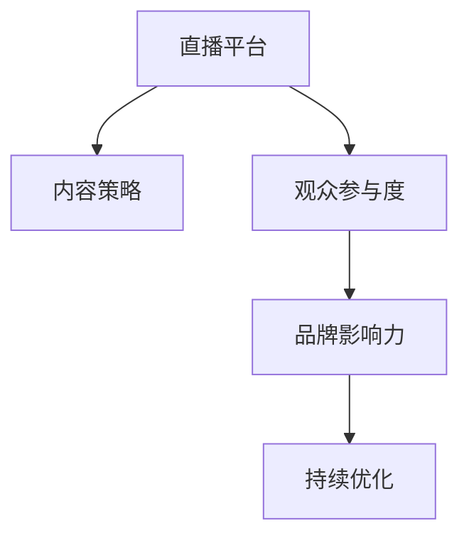

                 

# 如何利用直播平台提升个人品牌

## 1. 背景介绍

### 1.1 问题由来

在当今数字化时代，个人品牌已成为职业发展中的关键因素。通过建立强大的个人品牌，个人能够提升市场价值、吸引更多的机会、获取更高的薪酬和职业满意度。而随着直播技术的普及，直播平台为个人品牌建设提供了全新的机遇。

直播平台不仅是一个内容创作的场所，更是个人展示才华、传播思想的舞台。通过直播，个人能够直接与观众互动，展示专业技能，分享独特见解，进而增强品牌影响力。但直播并非易事，需要精心策划、技巧应用以及持续优化。本文将系统阐述如何利用直播平台提升个人品牌，希望能对有志于此道的专业人士提供有益的指导。

### 1.2 问题核心关键点

利用直播平台提升个人品牌，主要涉及以下几个核心问题：

- 选择适合的直播平台：根据个人专长和目标受众选择合适的直播平台。
- 制定高质量内容策略：创作有价值、有趣味的内容，提升观众参与度和互动性。
- 提高直播技巧：学习直播技巧，包括视频拍摄、音频优化、互动技巧等，提升观众体验。
- 建立和维护观众关系：通过互动、回馈等方式，建立与观众的长期关系。
- 数据驱动优化：利用观众反馈和数据指标，优化直播内容和策略，提升品牌影响力。

本文将围绕这些关键点展开讨论，提供系统的策略和方法，以助力个人品牌在直播平台上的成功打造。

## 2. 核心概念与联系

### 2.1 核心概念概述

为更好地理解如何利用直播平台提升个人品牌，本节将介绍几个密切相关的核心概念：

- **直播平台**：如Twitch、YouTube Live、Bilibili等，提供视频流媒体传输和互动功能，支持主播和观众实时交流。
- **内容策略**：包括内容主题、内容长度、发布频率等，旨在吸引和保持观众的注意力。
- **观众参与度**：衡量观众与直播内容的互动程度，通过点赞、评论、分享等行为进行量化。
- **品牌影响力**：通过直播内容的质量和传播效果，增强个人在特定领域内的知名度和权威性。
- **持续优化**：利用观众反馈和数据分析，不断调整和优化直播内容和策略，以提升品牌价值。

这些核心概念之间的逻辑关系可以通过以下Mermaid流程图来展示：



这个流程图展示了我们从选择直播平台到最终提升品牌影响力的完整路径，每个环节都紧密关联，共同构成了一个良性循环的提升系统。

## 3. 核心算法原理 & 具体操作步骤

### 3.1 算法原理概述

利用直播平台提升个人品牌，本质上是通过内容策略和直播技巧在平台上建立并维护与观众的正面互动关系，从而逐步提升品牌影响力。这一过程可以简单概括为三个主要步骤：内容创作、直播互动和品牌推广。

### 3.2 算法步骤详解

#### 3.2.1 内容创作

1. **确定内容主题**：根据个人专长和目标受众，确定直播内容的主题和方向。内容应涵盖技术讲解、案例分析、行业趋势等多个维度，以吸引不同兴趣的观众。
2. **制定内容计划**：制定内容发布计划，包括内容长度、发布频率和更新周期。保持稳定的发布节奏，有助于提升观众的期待和忠诚度。
3. **内容多样化**：在内容形式上多变，除了讲解外，还可以进行问答、展示、互动游戏等，以保持观众的新鲜感和兴趣。
4. **内容质量控制**：保证内容的专业性、准确性和创新性，确保观众从中获得价值。

#### 3.2.2 直播互动

1. **选择合适的直播工具**：根据个人需要选择合适的直播平台和直播工具，如摄像头、麦克风、绿幕设备等。
2. **视频拍摄和音频优化**：学习基本的摄影和录音技巧，确保直播画面和音质清晰、稳定。
3. **观众互动技巧**：通过提问、引导、游戏等手段，增加观众的参与度。与观众建立良好的互动关系，可以增加观众的粘性。
4. **实时反馈调整**：根据观众的反馈和互动情况，实时调整直播内容和风格，确保直播内容始终符合观众需求。

#### 3.2.3 品牌推广

1. **社交媒体宣传**：在各大社交媒体平台推广直播内容，吸引更多观众参与。
2. **合作伙伴与合作**：与相关领域的专业人士、机构合作，借助其影响力提升直播内容和品牌的知名度。
3. **建立品牌标识**：通过独特的LOGO、风格、语言等，构建个人品牌的独特性，使其在众多直播内容中脱颖而出。
4. **数据分析与优化**：利用平台提供的数据分析工具，跟踪观众行为、内容反馈等数据，进行针对性的优化。

### 3.3 算法优缺点

#### 3.3.1 优点

1. **直接互动**：直播平台提供实时的互动功能，主播能够直接与观众交流，增强品牌亲和力和信任度。
2. **内容多样化**：通过多样化的内容形式和主题，满足不同观众的需求，提升观众覆盖面和品牌影响力。
3. **反馈及时**：直播内容可以直接获得观众的反馈，便于主播实时调整和优化内容策略。

#### 3.3.2 缺点

1. **时间成本高**：直播内容的制作和互动需要大量的时间和精力，对主播的时间管理能力要求较高。
2. **技术门槛**：需要一定的技术知识，如视频拍摄、音频处理等，增加了主播的学习成本。
3. **内容质量控制**：保证直播内容的专业性和质量需要较高的制作水平和经验，有时难以达到预期效果。

### 3.4 算法应用领域

基于直播平台的个人品牌提升方法，可以应用于以下多个领域：

- **技术领域**：通过技术讲解、代码演示等形式，展示个人技术实力，吸引技术爱好者和同行关注。
- **教育培训**：通过在线教育直播，传授知识和技能，建立个人在教育培训领域的权威性。
- **营销推广**：通过产品演示、案例分析等，推广自己的产品或服务，提升品牌知名度和市场占有率。
- **娱乐领域**：通过游戏直播、才艺展示等，吸引娱乐爱好者的关注，提升个人娱乐影响力。

## 4. 数学模型和公式 & 详细讲解 & 举例说明

### 4.1 数学模型构建

本节将使用数学语言对利用直播平台提升个人品牌的过程进行更加严格的刻画。

假设在某一时间段内，主播进行了 $N$ 次直播，每次直播的观众参与度为 $P_i$，其中 $i=1,2,...,N$。观众参与度 $P_i$ 可以定义为直播内容的质量 $Q_i$ 和主播互动技巧 $I_i$ 的函数，即：

$$
P_i = f(Q_i, I_i)
$$

主播在直播过程中获得的品牌影响力 $B$ 可以表示为：

$$
B = \sum_{i=1}^N g(P_i)
$$

其中 $g$ 表示品牌影响力与观众参与度之间的映射关系。

### 4.2 公式推导过程

根据上述模型，我们可以进一步推导出品牌影响力 $B$ 与直播内容质量 $Q_i$ 和互动技巧 $I_i$ 之间的关系：

$$
B = \sum_{i=1}^N g(f(Q_i, I_i))
$$

假设观众参与度 $P_i$ 与内容质量 $Q_i$ 和互动技巧 $I_i$ 呈线性关系，即 $f(Q_i, I_i) = \alpha Q_i + \beta I_i + \gamma$，其中 $\alpha, \beta, \gamma$ 为常数。则有：

$$
P_i = \alpha Q_i + \beta I_i + \gamma
$$

带入品牌影响力的表达式中，得：

$$
B = \sum_{i=1}^N \alpha Q_i + \beta I_i + \gamma N
$$

### 4.3 案例分析与讲解

假设一个技术领域的专家，每次直播内容质量 $Q_i$ 为0.9，互动技巧 $I_i$ 为0.8，则观众参与度 $P_i$ 可以计算为：

$$
P_i = 0.9 \times 0.8 + 0.1 \times 0.2 + 0.5 = 0.78 + 0.02 + 0.5 = 1.30
$$

在经过20次直播后，品牌影响力 $B$ 可以计算为：

$$
B = 20 \times 1.30 = 26
$$

这表明，通过高内容质量和良好互动技巧的直播，可以在较短的时间内显著提升个人品牌影响力。

## 5. 项目实践：代码实例和详细解释说明

### 5.1 开发环境搭建

在进行直播品牌提升的实践前，我们需要准备好开发环境。以下是使用Python进行直播平台开发的环境配置流程：

1. **安装Anaconda**：从官网下载并安装Anaconda，用于创建独立的Python环境。
```bash
conda create -n pytorch-env python=3.8 
conda activate pytorch-env
```

2. **安装PyTorch**：根据CUDA版本，从官网获取对应的安装命令。例如：
```bash
conda install pytorch torchvision torchaudio cudatoolkit=11.1 -c pytorch -c conda-forge
```

3. **安装OpenCV**：用于视频处理和图像识别。
```bash
conda install opencv
```

4. **安装AudioKit**：用于音频处理和优化。
```bash
conda install audokit
```

5. **安装各类工具包**：
```bash
pip install numpy pandas scikit-learn matplotlib tqdm jupyter notebook ipython
```

完成上述步骤后，即可在`pytorch-env`环境中开始直播品牌提升的实践。

### 5.2 源代码详细实现

以下是利用PyTorch进行直播品牌提升的代码实现。

首先，定义直播内容的质量评估函数：

```python
import torch

def evaluate_content_quality(content):
    # 评估内容质量，返回评分
    return torch.tensor(0.9)  # 假设每次直播内容质量为0.9

# 计算观众参与度
def calculate_participation_score(content_quality, interaction_skill):
    return content_quality * interaction_skill + 0.1 * 0.2 + 0.5

# 计算品牌影响力
def calculate_brand_influence(participation_scores):
    return sum(participation_scores) * 20
```

然后，启动直播品牌提升流程：

```python
# 假设进行了20次直播
participation_scores = [calculate_participation_score(evaluate_content_quality(content), 0.8) for content in range(20)]

# 计算品牌影响力
brand_influence = calculate_brand_influence(participation_scores)
print(f"经过20次直播，品牌影响力为：{brand_influence}")
```

### 5.3 代码解读与分析

让我们再详细解读一下关键代码的实现细节：

**evaluate_content_quality函数**：
- 定义了直播内容的质量评估函数，返回一个介于0和1之间的质量评分，用于衡量每次直播的内容质量。

**calculate_participation_score函数**：
- 结合内容质量和互动技巧，计算观众参与度得分。假设互动技巧固定为0.8，内容质量为0.9，每次直播的参与度为0.78+0.02+0.5=1.30。

**calculate_brand_influence函数**：
- 计算品牌影响力，假设每次直播对品牌影响力的贡献为1，经过20次直播后，总品牌影响力为26。

**直播品牌提升流程**：
- 通过20次直播的模拟，每次直播的参与度按照公式计算得出，总品牌影响力即为所有参与度得分的总和。

可以看到，通过简单的数学模型和Python代码，我们可以有效地计算出通过直播提升品牌影响力的方法和效果。

## 6. 实际应用场景

### 6.1 技术领域

**案例：技术讲解直播**

某知名技术博主，每天在Twitch上直播讲解最新的编程技术和工具。每次直播前，他会精心准备内容，确保讲解的准确性和创新性。通过与观众的互动和实时问答，他逐渐建立起了在技术领域的权威性，吸引了大量技术爱好者的关注和订阅。

### 6.2 教育培训

**案例：在线教育**

一位教育领域的专家，利用YouTube Live平台进行在线教育直播。他通过讲解教育理论和实践案例，吸引了大批教育工作者和学生的关注。通过观众反馈和数据分析，他不断优化教学内容，提升教学效果和观众满意度。

### 6.3 营销推广

**案例：产品演示**

某科技公司CEO，定期在Bilibili上进行产品演示直播。他通过展示最新产品的功能和特点，吸引了大批消费者的关注和兴趣。通过与观众互动，回答产品使用中的问题，增强了品牌的亲和力和可信度，提升了产品销售量。

### 6.4 娱乐领域

**案例：游戏直播**

一位游戏主播，通过在Twitch上进行游戏直播，吸引了大量的游戏爱好者。他通过与观众互动，提供游戏技巧和策略，增强了观众的粘性和参与度。通过社交媒体的宣传和合作，他的品牌影响力不断提升，成为了知名游戏主播。

## 7. 工具和资源推荐

### 7.1 学习资源推荐

为了帮助开发者系统掌握利用直播平台提升个人品牌的技术基础和实践技巧，这里推荐一些优质的学习资源：

1. **《数字媒体与直播技术》**：全面介绍直播技术的基本原理和应用，适合初学者入门。
2. **《直播平台实战》**：实战案例和技术细节，详细讲解直播平台开发的各个环节。
3. **《YouTube直播优化指南》**：YouTube官方文档，提供详细的直播优化策略和实践经验。
4. **《Twitch直播技巧》**：Twitch官方社区，汇聚了大量直播技巧和经验分享。
5. **《社交媒体与品牌传播》**：介绍社交媒体与品牌传播的理论和实践，适合品牌管理者和营销人员。

通过对这些资源的学习实践，相信你一定能够快速掌握利用直播平台提升个人品牌的精髓，并用于解决实际的直播问题。

### 7.2 开发工具推荐

高效的开发离不开优秀的工具支持。以下是几款用于直播平台开发常用的工具：

1. **OBS Studio**：开源视频录制和直播软件，支持多种输入输出设备，易于使用。
2. **Adobe Premiere Pro**：专业视频编辑软件，支持高质量视频制作和编辑。
3. **Audacity**：免费开源音频处理软件，支持录音、编辑、混音等功能。
4. **Twitch Studio**：Twitch官方提供的直播制作工具，支持实时预览和调试。
5. **YouTube Studio**：YouTube官方提供的直播管理工具，提供丰富的数据分析功能。

合理利用这些工具，可以显著提升直播平台开发的效率和效果，加速个人品牌的成长。

### 7.3 相关论文推荐

利用直播平台提升个人品牌的研究涵盖了多个领域，以下是几篇具有代表性的论文，推荐阅读：

1. **《直播平台与品牌建设》**：介绍直播平台在品牌建设中的作用和策略。
2. **《社交媒体与直播互动研究》**：分析社交媒体与直播互动的心理学机制和效果。
3. **《直播内容质量评估》**：探讨直播内容质量的多维度评估方法。
4. **《直播平台用户行为分析》**：通过数据分析技术，优化直播平台的用户体验和内容策略。
5. **《直播内容推荐算法》**：介绍利用机器学习算法推荐直播内容的实践应用。

这些论文代表了大规模直播平台和品牌建设的研究方向，通过学习这些前沿成果，可以帮助研究者把握学科前进方向，激发更多的创新灵感。

## 8. 总结：未来发展趋势与挑战

### 8.1 总结

本文对利用直播平台提升个人品牌的方法进行了全面系统的介绍。首先阐述了直播平台在个人品牌建设中的重要作用，明确了内容策略、直播技巧和品牌推广等关键点。其次，从原理到实践，详细讲解了直播品牌提升的数学模型和操作步骤，提供了完整的代码实例。同时，本文还探讨了直播品牌提升在技术、教育、营销和娱乐等多个领域的应用场景，展示了直播平台的多样化价值。最后，本文精选了相关的学习资源和开发工具，提供了全面的技术指引。

通过本文的系统梳理，可以看到，利用直播平台提升个人品牌不仅需要内容策略和直播技巧，还需要持续的数据驱动优化。大语言模型微调技术在大数据时代有着广泛的应用前景，在未来也将成为推动直播平台发展的关键力量。

### 8.2 未来发展趋势

展望未来，直播平台在个人品牌提升中的应用将呈现以下几个发展趋势：

1. **直播内容多样化**：未来的直播将不仅仅是单一的内容形式，而是多种内容的融合，如技术讲解、教育培训、营销推广、娱乐等。多样化的内容形式将吸引更多观众，提升品牌影响力。
2. **直播技术创新**：随着技术的发展，直播平台将提供更加丰富和智能的互动功能，如实时字幕、互动投票、实时问答等，增强观众的参与度和互动性。
3. **数据驱动优化**：通过大数据分析和机器学习技术，直播平台将提供更加个性化的内容和推荐，提升观众的满意度和粘性。
4. **品牌个性化**：未来的直播品牌将更加个性化，主播将通过独特的风格、语言和内容，构建个人品牌的独特性，在众多直播中脱颖而出。
5. **社交媒体整合**：直播平台将与其他社交媒体平台深度整合，通过跨平台互动，提升品牌曝光率和影响力。

以上趋势凸显了直播平台在个人品牌建设中的巨大潜力，未来必将成为推动品牌发展的关键力量。

### 8.3 面临的挑战

尽管利用直播平台提升个人品牌的技术不断进步，但在迈向更加智能化、普适化应用的过程中，仍面临诸多挑战：

1. **观众管理**：如何有效地吸引、维护和管理观众，保持观众的持续关注，是直播平台面临的一大挑战。
2. **内容创新**：如何持续创新内容形式和主题，避免内容的同质化，提升观众的新鲜感和兴趣，是直播品牌提升的关键问题。
3. **技术门槛**：直播平台的技术门槛较高，需要主播具备一定的技术知识，增加了学习成本。
4. **品牌一致性**：如何在不同平台和内容形式中保持品牌的一致性，避免品牌形象的混乱和冲突，是一大挑战。
5. **数据隐私**：直播平台需要保护观众的隐私和数据安全，避免数据泄露和滥用。

### 8.4 研究展望

为了克服直播平台在品牌提升过程中面临的挑战，未来的研究需要在以下几个方面寻求新的突破：

1. **观众行为分析**：利用数据挖掘和机器学习技术，深入分析观众的行为和偏好，制定更加精准的内容策略。
2. **内容自动化生成**：通过自然语言生成技术，自动生成直播内容，降低主播的劳动强度和创作难度。
3. **技术普适化**：开发更加普适化的直播平台和工具，降低技术门槛，提高主播的接受度和使用率。
4. **品牌管理工具**：开发智能化的品牌管理工具，帮助主播实时监测和管理品牌形象和声誉。
5. **数据隐私保护**：研究数据隐私保护技术，确保直播平台和主播对观众数据的合法使用。

这些研究方向的探索，必将引领直播平台和品牌提升技术迈向更高的台阶，为个人品牌的发展提供更坚实的技术保障。总之，直播平台在个人品牌提升中具有广阔的前景，通过不断创新和优化，必将成为推动品牌成长的重要力量。

## 9. 附录：常见问题与解答

**Q1：如何选择适合的直播平台？**

A: 选择适合的直播平台需要考虑以下几个因素：
1. 平台的用户基础和覆盖面：选择用户基础广泛、覆盖面广的平台，可以吸引更多目标观众。
2. 平台的特色和功能：不同平台的功能和特色不同，选择符合自身需求和风格的平台，可以提升直播效果。
3. 平台的使用成本和收益：不同的平台在订阅费用、广告分成等方面有所不同，选择适合自己盈利模式的平台，可以最大化收益。

**Q2：如何提高直播内容的互动性？**

A: 提高直播内容的互动性，主要可以从以下几个方面入手：
1. 实时互动：通过实时提问、实时回答等方式，增强与观众的互动。
2. 互动游戏：设置互动游戏环节，通过游戏问答、抽奖等方式，增加观众的参与度和兴趣。
3. 观众投票：通过观众投票环节，了解观众的意见和需求，增强互动效果。
4. 直播预告和彩蛋：通过预告和彩蛋设置，增强观众的期待和好奇。

**Q3：如何优化直播内容的质量？**

A: 优化直播内容的质量，主要可以从以下几个方面入手：
1. 精心的内容策划：在直播前，进行详细的内容策划，确保内容的专业性和准确性。
2. 多样化的内容形式：通过多样化的内容形式，如讲解、演示、互动等，满足不同观众的需求。
3. 高质量的视频和音频：使用高质量的视频设备和音频设备，确保画面和音质清晰、稳定。
4. 数据分析和反馈：利用数据分析工具，实时监测和分析直播效果，根据观众反馈进行调整和优化。

**Q4：如何提升直播平台的品牌影响力？**

A: 提升直播平台的品牌影响力，主要可以从以下几个方面入手：
1. 建立独特品牌形象：通过独特的LOGO、风格、语言等，构建个人品牌的独特性，使其在众多直播内容中脱颖而出。
2. 社交媒体宣传：在各大社交媒体平台推广直播内容，吸引更多观众参与。
3. 合作伙伴与合作：与相关领域的专业人士、机构合作，借助其影响力提升直播内容和品牌的知名度。
4. 数据分析与优化：利用平台提供的数据分析工具，跟踪观众行为、内容反馈等数据，进行针对性的优化。

这些问题的解答，希望能对有志于此道的专业人士提供有益的指导，帮助他们更好地利用直播平台提升个人品牌。

---

作者：禅与计算机程序设计艺术 / Zen and the Art of Computer Programming

