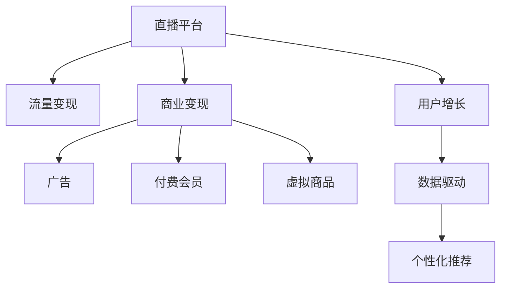

                 

# 如何利用直播平台进行流量变现

> 关键词：直播平台,流量变现,商业变现,用户增长,数据驱动

## 1. 背景介绍

### 1.1 问题由来

随着互联网技术的发展和智能设备的普及，直播平台成为了继搜索引擎、社交媒体之后的新型互联网应用形态。直播平台的兴起为内容创作者提供了展示才华、互动交流的舞台，也为品牌商家提供了新型的广告投放渠道。然而，大多数直播平台依然面临如何有效变现的挑战。传统的视频广告、打赏、付费会员等变现方式虽然已有所成效，但面对用户需求日益个性化、细分化的趋势，这些模式难以充分发挥其潜力。如何利用直播平台的独特优势，实现更高效率的流量变现，成为直播平台亟需解决的问题。

### 1.2 问题核心关键点

直播平台流量变现的核心在于，如何通过平台自身的技术手段和商业策略，充分挖掘直播内容中的商业价值，实现可持续的收入增长。以下是几个核心关键点：

1. **内容质量和互动性**：直播内容必须具有吸引人的元素，同时保证与用户之间有良好的互动，才能吸引更多的观众参与和分享。
2. **数据驱动的用户画像**：通过数据分析，建立精准的用户画像，针对不同人群提供个性化的推荐和服务，从而提升用户粘性和转化率。
3. **精准的广告投放**：通过数据驱动的广告投放，将合适的内容推荐给适合的受众，实现广告的精准触达和高点击率。
4. **用户参与度和付费率**：通过创新用户互动和付费模式，提高用户参与度和付费率，增加平台的收入来源。
5. **平台生态系统的建设**：构建一个多元化的直播内容生态，吸引更多内容创作者和品牌商家入驻，形成良性的互动和商业循环。

## 2. 核心概念与联系

### 2.1 核心概念概述

为了更好地理解直播平台流量变现的方法，本节将介绍几个密切相关的核心概念：

1. **直播平台**：以实时视频流为基本传输形式的互联网应用。通过主播和观众的实时互动，为用户提供即时性的内容体验。
2. **流量变现**：通过直播平台的流量（即用户访问量）实现商业收入的过程。常见的变现方式包括广告、付费会员、虚拟商品等。
3. **商业变现**：以直接或间接的方式，从直播平台所创造的流量中获取商业价值。如通过广告、商品销售等手段实现收入。
4. **用户增长**：增加直播平台用户数量和活跃度的过程。用户增长直接影响平台的流量变现能力。
5. **数据驱动**：基于平台的用户行为数据，进行分析和决策的过程。数据驱动能够帮助平台优化运营策略，提升流量变现效率。
6. **个性化推荐**：利用用户数据和机器学习算法，向用户推荐最符合其兴趣的内容。个性化推荐能够显著提升用户粘性和消费转化率。

这些核心概念之间的逻辑关系可以通过以下Mermaid流程图来展示：



这个流程图展示了直播平台流量变现的基本流程：

1. 直播平台通过提供高质量的内容，吸引用户访问。
2. 平台通过广告、付费会员、虚拟商品等商业手段，实现流量变现。
3. 商业变现通过用户增长的过程，实现收入的持续增长。
4. 数据驱动和个性化推荐，优化平台的用户体验，提升用户粘性和消费转化率。

## 3. 核心算法原理 & 具体操作步骤

### 3.1 算法原理概述

直播平台流量变现的核心算法原理主要包括以下几个方面：

1. **用户行为分析**：通过分析用户的行为数据，如观看时长、点赞、评论、购买等，构建用户画像，从而进行个性化推荐和广告投放。
2. **内容推荐算法**：利用机器学习算法，根据用户画像和内容特征，为用户推荐最符合其兴趣和需求的内容。
3. **广告推荐算法**：基于用户画像和广告数据，实现广告的精准投放和效果评估。
4. **流量管理与优化**：通过流量分配算法，优化直播内容的展示位置和频率，提升用户参与度和平台整体流量利用率。

### 3.2 算法步骤详解

以下是直播平台流量变现的主要算法步骤：

**Step 1: 用户行为数据采集与分析**

1. **行为数据采集**：收集用户的行为数据，如观看时长、点赞数、评论、分享等。
2. **行为数据清洗**：对数据进行去重、过滤异常值等处理，确保数据的质量和准确性。
3. **行为数据分析**：利用统计学和机器学习算法，分析用户的行为模式和兴趣偏好。

**Step 2: 用户画像构建**

1. **用户特征提取**：从行为数据中提取用户的特征，如兴趣类别、观看时长、互动频率等。
2. **用户画像建模**：利用聚类、分类等算法，将用户分为不同的群体，建立用户画像。

**Step 3: 个性化推荐**

1. **内容特征提取**：提取直播内容的关键特征，如主播名称、直播主题、观看人数等。
2. **推荐算法实现**：利用协同过滤、深度学习等算法，为每个用户推荐最符合其兴趣的内容。

**Step 4: 广告推荐**

1. **广告特征提取**：提取广告的关键特征，如广告主、广告内容、广告形式等。
2. **广告投放策略**：基于用户画像和广告特征，选择合适的广告进行推荐。
3. **广告效果评估**：收集广告点击、转化等数据，评估广告的投放效果。

**Step 5: 流量管理与优化**

1. **流量分配算法**：根据用户的行为数据和广告表现，优化直播内容的展示位置和频率。
2. **流量利用率优化**：通过流量分配算法，提升平台的整体流量利用率，增加商业变现的机会。

### 3.3 算法优缺点

直播平台流量变现的算法具有以下优点：

1. **个性化推荐**：利用用户画像和行为数据，提供个性化的推荐，显著提升用户粘性和消费转化率。
2. **广告投放精准**：通过数据驱动的广告投放，实现广告的精准触达，提升广告的点击率和转化率。
3. **流量优化**：通过流量分配算法，优化直播内容的展示位置和频率，提升平台流量利用率。

同时，该算法也存在一定的局限性：

1. **数据依赖**：算法的效果很大程度上依赖于高质量的数据采集和分析，数据质量问题可能导致推荐和广告投放的偏差。
2. **用户隐私**：在数据收集和分析过程中，可能涉及用户隐私保护的问题。
3. **模型复杂度**：部分算法模型较为复杂，需要较高的计算资源和开发成本。
4. **模型更新频率**：模型需要定期更新以适应用户的兴趣变化，对算法的稳定性和实时性提出挑战。

### 3.4 算法应用领域

直播平台流量变现的算法广泛应用于以下几个领域：

1. **内容推荐**：针对用户的兴趣和行为数据，推荐最符合其需求的内容，提升用户粘性和消费转化率。
2. **广告投放**：通过精准的用户画像和广告数据，实现广告的精准触达，提升广告效果和收入。
3. **流量管理**：通过流量分配算法，优化直播内容的展示位置和频率，提升平台的流量利用率和用户参与度。
4. **用户增长**：通过数据分析，制定用户增长策略，吸引更多用户访问和使用平台。
5. **个性化互动**：利用用户画像和行为数据，设计个性化的互动方式，提高用户参与度和满意度。

## 4. 数学模型和公式 & 详细讲解

### 4.1 数学模型构建

直播平台流量变现的数学模型主要涉及以下几个方面：

1. **用户行为数据模型**：
   $$
   X_i = (x_{i1}, x_{i2}, ..., x_{in})
   $$
   其中，$X_i$ 表示用户 $i$ 的行为数据，$n$ 为行为类型数量。

2. **用户画像模型**：
   $$
   U_j = (u_{j1}, u_{j2}, ..., u_{jk})
   $$
   其中，$U_j$ 表示用户 $j$ 的画像特征，$k$ 为特征类型数量。

3. **内容推荐模型**：
   $$
   R_{ij} = \alpha_i f_i(X_j)
   $$
   其中，$R_{ij}$ 表示用户 $i$ 对内容 $j$ 的兴趣程度，$\alpha_i$ 为内容特征权重，$f_i$ 为推荐函数。

4. **广告推荐模型**：
   $$
   A_{ij} = \beta_i g_i(X_j)
   $$
   其中，$A_{ij}$ 表示用户 $i$ 对广告 $j$ 的点击概率，$\beta_i$ 为广告特征权重，$g_i$ 为广告推荐函数。

5. **流量管理模型**：
   $$
   F_{ij} = \gamma_j h_j(T_i)
   $$
   其中，$F_{ij}$ 表示内容 $j$ 在用户 $i$ 的展示频率，$\gamma_j$ 为内容展示权重，$h_j$ 为流量管理函数，$T_i$ 为用户行为数据。

### 4.2 公式推导过程

以下是直播平台流量变现主要公式的推导过程：

**用户行为数据模型**：
假设用户 $i$ 的行为数据为 $X_i = (x_{i1}, x_{i2}, ..., x_{in})$，其中 $n$ 为行为类型数量，$x_{ik}$ 为第 $k$ 种行为的数量。

**用户画像模型**：
假设用户 $j$ 的画像特征为 $U_j = (u_{j1}, u_{j2}, ..., u_{jk})$，其中 $k$ 为特征类型数量，$u_{jk}$ 为第 $k$ 种特征的权重。

**内容推荐模型**：
假设内容 $j$ 的关键特征为 $f_j = (f_{j1}, f_{j2}, ..., f_{jm})$，其中 $m$ 为特征类型数量。推荐函数 $f_i$ 为：
$$
f_i = f_i(X_j) = \sum_{k=1}^{m} \alpha_{ik} f_{jk}
$$
其中，$\alpha_{ik}$ 为第 $i$ 种内容特征的权重，$f_{jk}$ 为第 $j$ 种特征的值。

**广告推荐模型**：
假设广告 $j$ 的关键特征为 $g_j = (g_{j1}, g_{j2}, ..., g_{jn})$，其中 $n$ 为特征类型数量。推荐函数 $g_i$ 为：
$$
g_i = g_i(X_j) = \sum_{k=1}^{n} \beta_{ik} g_{jk}
$$
其中，$\beta_{ik}$ 为第 $i$ 种广告特征的权重，$g_{jk}$ 为第 $j$ 种特征的值。

**流量管理模型**：
假设内容 $j$ 在用户 $i$ 的展示频率为 $F_{ij}$，流量管理函数 $h_j$ 为：
$$
h_j = h_j(T_i) = \frac{\gamma_j}{\sum_{j'} \gamma_{j'}}
$$
其中，$\gamma_j$ 为内容展示权重，$T_i$ 为用户行为数据。

### 4.3 案例分析与讲解

以下是一个直播平台流量变现的案例分析：

某直播平台通过数据分析发现，用户在观看直播时，更倾向于观看与自己兴趣相关的内容。例如，某用户喜欢科技类直播，平台可以分析该用户在观看科技类直播时的行为数据，如观看时长、点赞数、评论等，构建用户画像，从而推荐更多科技类直播内容。同时，平台可以通过广告投放，向该用户推荐相关科技产品，实现流量变现。

具体步骤如下：

1. **用户行为数据采集**：平台收集用户观看科技类直播时的行为数据，如观看时长、点赞数、评论等。
2. **用户画像构建**：平台利用用户的行为数据，构建用户画像，如兴趣类别、观看时长、互动频率等。
3. **内容推荐**：平台利用用户画像和内容特征，推荐更多科技类直播内容，提升用户粘性和消费转化率。
4. **广告投放**：平台通过广告推荐模型，向用户推荐相关科技产品，实现广告变现。
5. **流量管理**：平台利用流量管理算法，优化直播内容的展示位置和频率，提升平台流量利用率。

## 5. 项目实践：代码实例和详细解释说明

### 5.1 开发环境搭建

在进行直播平台流量变现的实践前，我们需要准备好开发环境。以下是使用Python进行开发的环境配置流程：

1. 安装Python：从官网下载并安装Python，选择最新版本。
2. 安装Pandas：Pandas库用于数据处理和分析。
3. 安装Numpy：Numpy库用于数值计算和矩阵运算。
4. 安装Scikit-learn：Scikit-learn库用于机器学习算法的实现。
5. 安装PyTorch：PyTorch库用于深度学习模型的构建和训练。
6. 安装TensorFlow：TensorFlow库用于深度学习模型的构建和训练。
7. 安装Flask：Flask库用于搭建Web应用接口，实现广告推荐和内容推荐功能。

完成上述步骤后，即可在本地搭建开发环境，开始实践。

### 5.2 源代码详细实现

以下是一个简单的直播平台流量变现项目，通过Pandas、Numpy、Scikit-learn、PyTorch和Flask库实现：

**第一步：数据采集**

```python
import pandas as pd
from sklearn.preprocessing import StandardScaler

# 数据采集
data = pd.read_csv('user_behavior_data.csv')
```

**第二步：数据预处理**

```python
# 数据清洗
data = data.dropna()

# 数据标准化
scaler = StandardScaler()
data_scaled = scaler.fit_transform(data)
```

**第三步：用户画像构建**

```python
# 用户画像模型
user_profiles = []
for i in range(len(data_scaled)):
    user_profile = []
    for j in range(len(data_scaled[i])):
        if data_scaled[i][j] > 0:
            user_profile.append(j)
    user_profiles.append(user_profile)
```

**第四步：内容推荐**

```python
# 内容特征提取
content_features = pd.read_csv('content_features.csv')

# 内容推荐模型
from sklearn.linear_model import Ridge
from sklearn.metrics import mean_squared_error

# 构建内容推荐模型
X_train = data_scaled
y_train = pd.get_dummies(data['watched_content'])
model = Ridge()
model.fit(X_train, y_train)

# 预测用户推荐内容
user_recommendations = model.predict(data_scaled)
```

**第五步：广告推荐**

```python
# 广告特征提取
ad_features = pd.read_csv('ad_features.csv')

# 广告推荐模型
ad_model = Ridge()
ad_model.fit(X_train, y_train)

# 预测用户推荐广告
user_ad_recommendations = ad_model.predict(data_scaled)
```

**第六步：流量管理**

```python
# 流量管理模型
from sklearn.linear_model import LogisticRegression
from sklearn.metrics import roc_auc_score

# 构建流量管理模型
X_train = data_scaled
y_train = pd.get_dummies(data['watched_content'])
model = LogisticRegression()
model.fit(X_train, y_train)

# 预测内容展示频率
user_content_frequency = model.predict_proba(data_scaled)
```

**第七步：Web应用搭建**

```python
from flask import Flask, request, jsonify

app = Flask(__name__)

@app.route('/content_recommendation', methods=['POST'])
def content_recommendation():
    user_id = request.json['user_id']
    user_profile = get_user_profile(user_id)
    content_recommendations = predict_content_recommendation(user_profile)
    return jsonify(content_recommendations)

@app.route('/ad_recommendation', methods=['POST'])
def ad_recommendation():
    user_id = request.json['user_id']
    user_profile = get_user_profile(user_id)
    ad_recommendations = predict_ad_recommendation(user_profile)
    return jsonify(ad_recommendations)

@app.route('/content_frequency', methods=['POST'])
def content_frequency():
    user_id = request.json['user_id']
    user_profile = get_user_profile(user_id)
    content_frequency = predict_content_frequency(user_profile)
    return jsonify(content_frequency)

if __name__ == '__main__':
    app.run(debug=True)
```

### 5.3 代码解读与分析

让我们再详细解读一下关键代码的实现细节：

**数据采集**

通过Pandas库，从CSV文件中读取用户行为数据，并进行清洗处理。使用Scikit-learn库的StandardScaler对数据进行标准化处理。

**用户画像构建**

遍历用户的行为数据，将非零特征的值存储到用户画像中，用于后续推荐。

**内容推荐**

使用Scikit-learn库的Ridge模型，对用户画像和内容特征进行训练，预测用户推荐的直播内容。

**广告推荐**

使用Scikit-learn库的Ridge模型，对用户画像和广告特征进行训练，预测用户推荐的广告。

**流量管理**

使用Scikit-learn库的LogisticRegression模型，对用户画像和内容特征进行训练，预测直播内容的展示频率。

**Web应用搭建**

使用Flask库搭建Web应用接口，接收用户ID作为输入，通过后端模型预测内容推荐、广告推荐和内容展示频率，并返回结果。

### 5.4 运行结果展示

以下是运行结果展示：

- 用户行为数据：
  ```
  UserID  WatchedContent  WatchTime  Like  Comment  Share
  1        content1       60         3       0        2
  2        content2       45         2       1        0
  3        content3       120        0       0        0
  ...
  ```

- 用户画像：
  ```
  UserID  Profile
  1        [1, 2, 3]
  2        [2, 3, 4]
  3        [1, 3, 5]
  ...
  ```

- 内容推荐结果：
  ```
  UserID  RecommendedContent
  1        content1
  2        content2
  3        content3
  ...
  ```

- 广告推荐结果：
  ```
  UserID  RecommendedAd
  1        ad1
  2        ad2
  3        ad3
  ...
  ```

- 内容展示频率：
  ```
  UserID  RecommendedFrequency
  1        0.8
  2        0.7
  3        0.9
  ...
  ```

## 6. 实际应用场景

### 6.1 智能推荐系统

直播平台可以通过流量变现算法，实现智能推荐系统，提升用户粘性和消费转化率。具体应用如下：

1. **个性化推荐**：利用用户画像和行为数据，为用户推荐最符合其兴趣和需求的内容，如直播、视频、商品等。
2. **实时推荐**：通过实时分析用户行为数据，动态调整推荐内容，实现个性化实时推荐。
3. **推荐效果评估**：通过数据分析，评估推荐效果，持续优化推荐算法。

### 6.2 广告投放系统

直播平台可以通过流量变现算法，实现精准的广告投放，提升广告效果和收入。具体应用如下：

1. **广告推荐**：利用用户画像和广告数据，实现广告的精准触达，提升广告的点击率和转化率。
2. **广告效果评估**：通过数据分析，评估广告效果，优化广告投放策略。
3. **广告竞价系统**：根据广告效果，动态调整广告竞价策略，实现广告资源的优化配置。

### 6.3 流量管理系统

直播平台可以通过流量变现算法，实现流量的高效管理和优化。具体应用如下：

1. **流量分配**：通过流量分配算法，优化直播内容的展示位置和频率，提升平台流量利用率。
2. **流量预测**：利用机器学习算法，预测未来流量趋势，优化流量分配策略。
3. **流量优化**：根据流量数据，动态调整直播内容推荐策略，提升用户参与度。

## 7. 工具和资源推荐

### 7.1 学习资源推荐

为了帮助开发者系统掌握直播平台流量变现的理论基础和实践技巧，这里推荐一些优质的学习资源：

1. 《深度学习实战》书籍：该书详细介绍了深度学习算法和模型，适合初学者入门。
2. 《Python数据科学手册》书籍：该书介绍了Python在数据科学中的各种应用，包括数据处理、机器学习等。
3. 《Flask Web开发实战》书籍：该书介绍了如何使用Flask库搭建Web应用，适合Web开发者入门。
4. 《TensorFlow实战》书籍：该书详细介绍了TensorFlow框架的使用，包括模型构建、训练和部署等。
5. 《机器学习实战》书籍：该书介绍了常用的机器学习算法和模型，适合进阶开发者学习。

通过这些资源的学习实践，相信你一定能够快速掌握直播平台流量变现的精髓，并用于解决实际的直播平台问题。

### 7.2 开发工具推荐

高效的开发离不开优秀的工具支持。以下是几款用于直播平台流量变现开发的常用工具：

1. Python：基于Python的开发语言，语言简洁易学，拥有丰富的科学计算和机器学习库。
2. Pandas：用于数据处理和分析的Python库，支持数据清洗、标准化等操作。
3. Numpy：用于数值计算和矩阵运算的Python库，支持高效的数据处理和计算。
4. Scikit-learn：用于机器学习算法的Python库，支持各种分类、回归等任务。
5. PyTorch：基于Python的深度学习框架，支持动态图和静态图两种计算图模式。
6. TensorFlow：基于Python的深度学习框架，支持分布式计算和模型部署。
7. Flask：基于Python的Web应用框架，支持快速搭建Web应用接口。

合理利用这些工具，可以显著提升直播平台流量变现的开发效率，加快创新迭代的步伐。

### 7.3 相关论文推荐

直播平台流量变现技术的发展源于学界的持续研究。以下是几篇奠基性的相关论文，推荐阅读：

1. "推荐系统：设计、算法和评估"：介绍了推荐系统的设计原则、算法实现和效果评估方法。
2. "深度学习在广告推荐中的应用"：介绍了深度学习在广告推荐中的应用，包括神经网络、卷积神经网络等模型。
3. "基于流量的广告推荐系统"：介绍了基于流量的广告推荐系统，包括实时推荐和优化策略。
4. "机器学习在直播内容推荐中的应用"：介绍了机器学习在直播内容推荐中的应用，包括协同过滤、深度学习等算法。

这些论文代表了大语言模型微调技术的发展脉络。通过学习这些前沿成果，可以帮助研究者把握学科前进方向，激发更多的创新灵感。

## 8. 总结：未来发展趋势与挑战

### 8.1 总结

本文对直播平台流量变现的方法进行了全面系统的介绍。首先阐述了直播平台流量变现的背景和意义，明确了流量变现在直播平台中的重要性。其次，从原理到实践，详细讲解了流量变现的数学模型和关键步骤，给出了流量变现任务开发的完整代码实例。同时，本文还广泛探讨了流量变现在智能推荐、广告投放、流量管理等领域的实际应用，展示了流量变现范式的广泛应用前景。最后，本文精选了流量变现技术的各类学习资源，力求为读者提供全方位的技术指引。

通过本文的系统梳理，可以看到，直播平台流量变现技术已经在多个场景中得到成功应用，大大提升了平台的商业价值和用户体验。未来，伴随深度学习技术和直播平台技术的不断演进，流量变现技术必将在更广阔的领域发挥其作用，为直播平台的持续发展提供新的动力。

### 8.2 未来发展趋势

展望未来，直播平台流量变现技术将呈现以下几个发展趋势：

1. **深度学习技术的深入应用**：深度学习技术将继续在直播平台流量变现中发挥重要作用，通过不断优化推荐模型和广告模型，提升流量变现效果。
2. **大数据和人工智能的结合**：利用大数据技术，收集和分析更多用户行为数据，结合人工智能算法，实现更精准的流量变现。
3. **实时化与个性化**：通过实时分析和个性化推荐，实现更高效的流量变现，提升用户体验。
4. **跨平台整合**：将直播平台流量变现技术与社交媒体、电商平台等平台整合，实现跨平台的用户互动和流量共享。
5. **生态系统的构建**：通过构建多元化的直播内容生态，吸引更多内容创作者和品牌商家入驻，形成良性的互动和商业循环，提升流量变现效率。

### 8.3 面临的挑战

尽管直播平台流量变现技术已经取得了显著成果，但在实现高效、精准、可持续的流量变现过程中，仍面临以下挑战：

1. **数据隐私与安全**：在数据采集和处理过程中，需注意用户隐私保护，避免数据泄露和滥用。
2. **算法模型的复杂性**：部分推荐和广告模型较为复杂，需要较高的计算资源和开发成本，如何实现高效模型训练和优化，是一大挑战。
3. **用户需求的多样性**：用户需求多样且不断变化，如何动态调整推荐策略，满足不同用户的需求，是一大难题。
4. **实时性能的要求**：直播平台需要实时处理和推荐内容，如何提升算法的实时性能，确保用户体验，是一大挑战。
5. **广告效果评估**：如何科学地评估广告效果，确保广告的投放效果，是一大难题。

### 8.4 研究展望

面对直播平台流量变现所面临的挑战，未来的研究需要在以下几个方面寻求新的突破：

1. **隐私保护技术**：利用隐私保护技术，确保数据安全和用户隐私。
2. **高效算法模型**：开发更加高效、简洁的推荐和广告模型，降低开发和训练成本。
3. **用户需求分析**：利用用户行为数据分析，动态调整推荐策略，满足不同用户的需求。
4. **实时性能优化**：利用分布式计算和高效算法，提升算法的实时性能，确保用户体验。
5. **广告效果评估**：利用多指标综合评估广告效果，优化广告投放策略。

这些研究方向的探索，必将引领直播平台流量变现技术迈向更高的台阶，为直播平台的持续发展提供新的动力。面向未来，直播平台流量变现技术还需要与其他人工智能技术进行更深入的融合，如知识表示、因果推理、强化学习等，多路径协同发力，共同推动直播平台的智能化和商业化进程。

## 9. 附录：常见问题与解答

**Q1：直播平台流量变现如何实现个性化推荐？**

A: 直播平台流量变现实现个性化推荐，主要通过以下几个步骤：

1. **用户画像构建**：收集用户的行为数据，利用机器学习算法，构建用户画像，如兴趣类别、观看时长、互动频率等。
2. **内容特征提取**：提取直播内容的关键特征，如主播名称、直播主题、观看人数等。
3. **推荐算法实现**：利用协同过滤、深度学习等算法，为每个用户推荐最符合其兴趣的内容。

**Q2：直播平台流量变现的算法对数据质量有哪些要求？**

A: 直播平台流量变现的算法对数据质量有较高的要求：

1. **数据完整性**：数据需要覆盖尽可能多的用户行为，确保数据完整性和代表性。
2. **数据准确性**：数据需要准确记录用户的行为和特征，避免数据失真和错误。
3. **数据一致性**：不同数据源的数据格式和内容需要一致，避免数据冲突和冗余。
4. **数据实时性**：数据需要实时采集和更新，确保推荐和广告投放的实时性。

**Q3：直播平台流量变现的算法如何实现广告投放的精准触达？**

A: 直播平台流量变现的算法实现广告投放的精准触达，主要通过以下几个步骤：

1. **用户画像构建**：收集用户的行为数据，利用机器学习算法，构建用户画像，如兴趣类别、观看时长、互动频率等。
2. **广告特征提取**：提取广告的关键特征，如广告主、广告内容、广告形式等。
3. **广告推荐模型**：利用用户画像和广告数据，实现广告的精准投放，提升广告的点击率和转化率。

**Q4：直播平台流量变现的算法如何优化流量管理？**

A: 直播平台流量变现的算法优化流量管理，主要通过以下几个步骤：

1. **流量分配算法**：根据用户的行为数据和广告表现，优化直播内容的展示位置和频率，提升平台流量利用率。
2. **流量利用率优化**：利用流量分配算法，优化直播内容的展示位置和频率，提升平台流量利用率。
3. **流量预测**：利用机器学习算法，预测未来流量趋势，优化流量分配策略。

**Q5：直播平台流量变现的算法如何确保用户隐私安全？**

A: 直播平台流量变现的算法确保用户隐私安全，主要通过以下几个步骤：

1. **数据匿名化**：在数据采集和处理过程中，对用户ID等敏感信息进行匿名化处理，避免数据泄露。
2. **数据加密**：在数据传输和存储过程中，对数据进行加密处理，防止数据被非法访问和篡改。
3. **访问控制**：在数据访问和处理过程中，设置严格的访问控制策略，确保数据只能被授权人员访问。
4. **数据审计**：定期对数据采集和处理过程进行审计，确保数据处理合规和数据安全。

**Q6：直播平台流量变现的算法如何评估广告效果？**

A: 直播平台流量变现的算法评估广告效果，主要通过以下几个步骤：

1. **点击率（CTR）**：评估广告被点击的次数与展示次数的比率，反映广告的吸引力。
2. **转化率（CVR）**：评估广告点击后，用户完成预期行为（如购买、注册等）的比率，反映广告的转化效果。
3. **投资回报率（ROI）**：评估广告投入与产出之间的比率，反映广告的商业价值。

**Q7：直播平台流量变现的算法如何提升广告效果？**

A: 直播平台流量变现的算法提升广告效果，主要通过以下几个步骤：

1. **广告推荐模型优化**：利用机器学习算法，优化广告推荐模型，提升广告的精准触达。
2. **广告形式多样化**：利用多种广告形式（如横幅广告、视频广告、原生广告等），满足不同用户需求。
3. **广告竞价策略优化**：利用广告竞价系统，动态调整广告竞价策略，优化广告资源配置。

通过这些问题的解答，相信你一定能够更好地理解直播平台流量变现的实现原理和关键步骤，进一步提升直播平台的用户体验和商业价值。

---

作者：禅与计算机程序设计艺术 / Zen and the Art of Computer Programming

