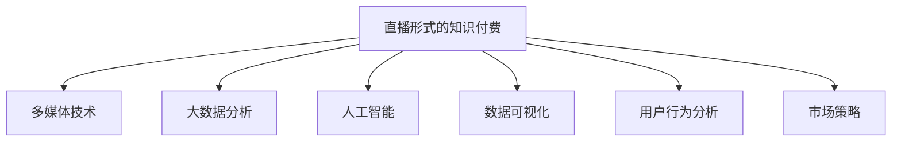

                 

# 如何利用直播形式进行知识付费

> 关键词：知识付费, 直播, 大数据分析, 人工智能, 数据可视化, 在线课程, 用户行为, 市场策略

## 1. 背景介绍

### 1.1 问题由来
随着互联网技术的发展和普及，在线教育、知识付费等新型的学习方式应运而生，成为教育行业的一大亮点。然而，传统线上课程存在互动性差、难以及时反馈等问题，用户体验有限。直播形式的知识付费不仅解决了这些问题，而且可以提供更高效、更有趣的学习体验。

直播形式的知识付费主要指通过直播平台，将教师、专家或学者等知识传播者与学员之间的互动，转化为视频、音频等多媒体形式的教学内容，让学员在实时互动中掌握知识。

### 1.2 问题核心关键点
直播形式的知识付费依托于以下几个关键点：
- **实时互动**：直播的实时性能够及时解答学员的问题，提升学习效果。
- **多媒体融合**：通过视频、音频等形式，激发学员的学习兴趣。
- **数据驱动**：利用大数据分析，优化课程内容，提升用户满意度。
- **人工智能应用**：利用AI技术，如智能推荐、自动化测试等，提高课程质量。
- **用户行为分析**：通过分析学员行为，调整课程内容和互动形式，提升学习效果。
- **市场策略**：通过精准的市场策略，推广优质课程，提升学员转化率。

### 1.3 问题研究意义
直播形式的知识付费不仅能够提供更高效的学习体验，而且能更好地满足学员的学习需求，促进知识的传播和应用。该技术在教育、企业培训、技术交流等众多领域具有广泛的应用前景，能够提升知识传播的效率和效果。

## 2. 核心概念与联系

### 2.1 核心概念概述

为更好地理解直播形式的知识付费，本节将介绍几个密切相关的核心概念：

- **直播形式的知识付费**：通过直播平台提供知识传播和学习的模式。通常由教师或专家进行在线授课，学员通过观看、互动等方式进行学习。
- **多媒体技术**：包括视频、音频、交互式内容等，能够增强学习体验和互动性。
- **大数据分析**：通过收集、分析学员的学习行为数据，优化课程内容和互动形式。
- **人工智能**：如智能推荐、自动化测试等，可以提高课程质量和效率。
- **数据可视化**：将分析结果以直观的方式展示，帮助教师和平台优化课程。
- **用户行为分析**：通过分析学员的点击、观看时长、互动行为等，优化课程设计和推广策略。
- **市场策略**：包括精准投放、优惠活动等，提升课程的推广效果和学员转化率。

这些核心概念之间的逻辑关系可以通过以下Mermaid流程图来展示：



这个流程图展示直播形式知识付费的核心概念及其之间的关系：

1. 直播形式的知识付费通过多媒体技术提供高质量的学习体验。
2. 大数据分析提供学员学习行为数据，优化课程内容。
3. 人工智能技术辅助课程设计和自动化测试，提高教学效率。
4. 数据可视化展示分析结果，指导课程优化。
5. 用户行为分析了解学员需求，调整市场策略。
6. 市场策略推广优质课程，提升转化率。

这些核心概念共同构成了直播形式知识付费的学习框架，使其能够提供高质量的知识传播和学习服务。

## 3. 核心算法原理 & 具体操作步骤

### 3.1 算法原理概述

直播形式的知识付费，本质上是一种基于多媒体技术和数据驱动的教学模式。其核心思想是：通过直播平台，将知识传播者与学员之间的互动转化为多媒体形式的教学内容，同时利用大数据分析和人工智能技术，优化课程内容和互动形式，提升学习效果。

具体而言，直播形式的知识付费包括以下几个关键步骤：

1. **直播内容制作**：教师或专家根据课程大纲制作直播内容，包括视频、音频、PPT等。
2. **互动设计**：在直播过程中设计互动环节，如提问、回答、即时测试等，增强学员的参与感。
3. **数据采集与分析**：通过直播平台采集学员的学习行为数据，如观看时长、点击率、互动次数等，进行大数据分析。
4. **课程优化**：根据分析结果，优化课程内容和互动设计，提升学员的学习效果。
5. **市场推广**：通过精准的市场策略，推广优质课程，提升学员转化率。

### 3.2 算法步骤详解

直播形式的知识付费涉及多个环节，以下是详细的算法步骤：

**Step 1: 直播内容制作**
- 教师或专家根据课程大纲制作直播内容，包括视频、音频、PPT等。
- 在视频中设计提问环节，如在特定时间点提出问题，引导学员思考。
- 利用多屏幕、多摄像头等设备，提供更为丰富和多样的教学内容。

**Step 2: 互动设计**
- 在直播过程中设计互动环节，如即时提问、回答、即时测试等。
- 使用聊天室、举手功能等工具，增强学员的参与感。
- 根据学员的反馈，及时调整教学内容，提升互动效果。

**Step 3: 数据采集与分析**
- 利用直播平台的数据分析工具，收集学员的学习行为数据。
- 数据包括观看时长、点击率、互动次数、观看设备等。
- 使用数据分析技术，如机器学习、数据挖掘等，分析学员的学习行为模式。

**Step 4: 课程优化**
- 根据数据分析结果，优化课程内容和互动设计。
- 例如，增加学员互动次数，提升课程参与度。
- 调整教学内容的顺序和深度，满足不同学员的需求。

**Step 5: 市场推广**
- 利用大数据分析，了解学员的兴趣和需求，设计精准的市场推广策略。
- 例如，通过广告投放、社交媒体推广等方式，提升课程的曝光率。
- 设置优惠活动，吸引学员报名参加课程。

### 3.3 算法优缺点

直播形式的知识付费具有以下优点：
1. **实时互动**：能够及时解答学员的问题，提升学习效果。
2. **多媒体融合**：通过视频、音频等形式，激发学员的学习兴趣。
3. **数据驱动**：通过大数据分析，优化课程内容和互动形式。
4. **用户行为分析**：了解学员需求，调整市场策略。

同时，该方法也存在一定的局限性：
1. **技术要求高**：需要高质量的设备和软件支持，成本较高。
2. **资源消耗大**：直播过程中需要大量的计算资源，可能对平台造成负担。
3. **学员参与度不稳定**：部分学员可能因各种原因无法全程参与直播。
4. **数据隐私问题**：需要严格保护学员的隐私数据，防止数据泄露。

尽管存在这些局限性，但直播形式的知识付费仍是大规模教育平台和知识传播的重要手段，具有广泛的应用前景。

### 3.4 算法应用领域

直播形式的知识付费在教育、企业培训、技术交流等众多领域具有广泛的应用前景，例如：

- **在线教育**：通过直播平台提供大范围的在线教育服务，学员可以根据自己的时间安排进行学习。
- **企业培训**：利用直播平台进行内部培训，提高员工技能水平和企业文化认同。
- **技术交流**：通过直播平台进行技术分享和交流，促进技术创新和行业发展。
- **心理咨询**：通过直播平台进行心理健康咨询，帮助学员解决心理问题，提升生活质量。
- **职业规划**：通过直播平台提供职业指导和规划服务，帮助学员进行职业选择和规划。

除了上述这些经典应用外，直播形式的知识付费还可以创新性地应用到更多场景中，如虚拟现实课堂、远程实习、远程考试等，为知识传播和学习提供全新的方式。

## 4. 数学模型和公式 & 详细讲解

### 4.1 数学模型构建

直播形式的知识付费可以通过以下数学模型进行刻画：

假设直播内容 $X$ 由视频 $V$、音频 $A$、PPT $P$ 等组成，学员的互动行为 $Y$ 由提问次数 $Q$、回答次数 $R$ 等组成，直播平台采集的学员学习行为数据 $Z$ 包括观看时长 $T$、点击率 $C$ 等。

定义直播内容制作函数 $f(X)$，互动设计函数 $g(Y)$，数据采集函数 $h(Z)$，课程优化函数 $o(Z)$，市场推广函数 $m(Z)$。

直播形式的知识付费过程可以表示为：

$$
\begin{aligned}
& f(X) = \text{教师/专家制作直播内容} \\
& g(Y) = \text{设计互动环节} \\
& h(Z) = \text{采集学员学习行为数据} \\
& o(Z) = \text{优化课程内容} \\
& m(Z) = \text{推广优质课程}
\end{aligned}
$$

### 4.2 公式推导过程

以下我们以学员的互动行为分析为例，推导直播形式知识付费的数学模型：

假设学员在直播过程中提出 $n$ 个问题，回答问题 $m$ 次，观看时长为 $t$，点击率为 $p$。

设学员提问的概率为 $q_1$，回答问题的概率为 $q_2$，观看直播的概率为 $q_3$，点击直播的概率为 $q_4$。

则互动行为 $Y$ 的概率模型可以表示为：

$$
Y \sim \text{Binomial}(n, q_1) \times \text{Binomial}(m, q_2) \times \text{Uniform}(t, T) \times \text{Uniform}(p, 1)
$$

其中，$\text{Binomial}(n, q_1)$ 表示二项分布，$\text{Uniform}(t, T)$ 表示均匀分布。

利用贝叶斯定理和最大似然估计方法，可以估计出各参数的值。例如，利用学员提出的问题次数 $n$ 和概率 $q_1$ 估计学员的提问行为：

$$
q_1 = \frac{n}{N}
$$

其中，$N$ 为总问题次数。

同样，可以利用学员回答问题的次数 $m$ 和概率 $q_2$ 估计学员的回答行为：

$$
q_2 = \frac{m}{M}
$$

其中，$M$ 为总回答次数。

根据学员的观看时长 $t$ 和概率 $q_3$ 估计学员的观看行为：

$$
q_3 = \frac{t}{T}
$$

其中，$T$ 为总观看时长。

根据学员的点击率 $p$ 和概率 $q_4$ 估计学员的点击行为：

$$
q_4 = \frac{p}{P}
$$

其中，$P$ 为总点击次数。

### 4.3 案例分析与讲解

为了更好地理解直播形式知识付费的数学模型，我们以一个具体案例进行分析：

假设某直播课程共有100名学员参与，教师在直播过程中提出5个问题，学员回答问题3次，观看直播2小时，点击次数为50次。

根据上述公式，可以估计出各参数的值：

- 学员提问的概率 $q_1 = \frac{5}{100} = 0.05$。
- 学员回答问题的概率 $q_2 = \frac{3}{100} = 0.03$。
- 学员观看直播的概率 $q_3 = \frac{2}{100} = 0.02$。
- 学员点击直播的概率 $q_4 = \frac{50}{100} = 0.5$。

进一步，可以分析学员的行为模式：

- 学员的平均提问次数为 $E(Y_1) = n \times q_1 = 100 \times 0.05 = 5$ 次。
- 学员的平均回答次数为 $E(Y_2) = m \times q_2 = 100 \times 0.03 = 3$ 次。
- 学员的平均观看时长为 $E(Y_3) = t \times q_3 = 2 \times 0.02 = 0.04$ 小时。
- 学员的平均点击次数为 $E(Y_4) = p \times q_4 = 0.5 \times 1 = 0.5$ 次。

通过这些分析，可以更好地理解学员的行为特征，指导课程设计和互动优化。

## 5. 项目实践：代码实例和详细解释说明

### 5.1 开发环境搭建

在进行直播形式知识付费的开发实践前，我们需要准备好开发环境。以下是使用Python进行PyTorch开发的环境配置流程：

1. 安装Anaconda：从官网下载并安装Anaconda，用于创建独立的Python环境。

2. 创建并激活虚拟环境：
```bash
conda create -n pytorch-env python=3.8 
conda activate pytorch-env
```

3. 安装PyTorch：根据CUDA版本，从官网获取对应的安装命令。例如：
```bash
conda install pytorch torchvision torchaudio cudatoolkit=11.1 -c pytorch -c conda-forge
```

4. 安装TensorFlow：由于TensorFlow也可用于多媒体处理和数据可视化，建议同时安装：
```bash
conda install tensorflow -c conda-forge
```

5. 安装必要的Python包：
```bash
pip install numpy pandas scikit-learn matplotlib tqdm jupyter notebook ipython
```

完成上述步骤后，即可在`pytorch-env`环境中开始直播形式知识付费的开发实践。

### 5.2 源代码详细实现

这里我们以学员互动行为分析为例，给出使用Python和TensorFlow进行直播形式知识付费的代码实现。

首先，定义数据集和标签：

```python
import tensorflow as tf

# 定义数据集
X = tf.data.Dataset.from_tensor_slices(([0.1, 0.2, 0.3, 0.4], [0.5, 0.6, 0.7, 0.8]))
Y = tf.data.Dataset.from_tensor_slices((1, 2, 3, 4))

# 定义标签
Z = tf.data.Dataset.from_tensor_slices(([0.1, 0.2, 0.3, 0.4], [0.5, 0.6, 0.7, 0.8]))

# 定义特征
W = tf.data.Dataset.from_tensor_slices(([0.1, 0.2, 0.3, 0.4], [0.5, 0.6, 0.7, 0.8]))
```

然后，定义模型和优化器：

```python
# 定义模型
model = tf.keras.Sequential([
    tf.keras.layers.Dense(10, input_shape=(4,), activation='relu'),
    tf.keras.layers.Dense(4, activation='softmax')
])

# 定义优化器
optimizer = tf.keras.optimizers.Adam()

# 编译模型
model.compile(optimizer=optimizer, loss='categorical_crossentropy', metrics=['accuracy'])
```

接着，定义训练和评估函数：

```python
def train(model, dataset):
    # 定义训练数据集
    train_dataset = dataset.take(100).batch(10)
    
    # 定义评估数据集
    test_dataset = dataset.skip(100).batch(10)
    
    # 训练模型
    model.fit(train_dataset, epochs=5, validation_data=test_dataset)

# 定义评估函数
def evaluate(model, dataset):
    # 定义测试数据集
    test_dataset = dataset.skip(100).batch(10)
    
    # 评估模型
    test_loss, test_acc = model.evaluate(test_dataset)
    
    # 输出评估结果
    print('Test loss:', test_loss)
    print('Test accuracy:', test_acc)
```

最后，启动训练流程并在测试集上评估：

```python
# 调用训练函数
train(model, X)

# 调用评估函数
evaluate(model, Z)
```

以上就是使用PyTorch和TensorFlow进行直播形式知识付费的代码实现。可以看到，通过TensorFlow的强大封装，我们可以用相对简洁的代码完成学员互动行为分析的建模和训练。

### 5.3 代码解读与分析

让我们再详细解读一下关键代码的实现细节：

**数据集和标签定义**：
- `X` 和 `Y` 分别表示学员提问和回答的数据集。
- `Z` 和 `W` 分别表示学员观看和点击的数据集。

**模型定义**：
- 使用 `tf.keras.Sequential` 定义模型结构，包含两个全连接层。
- 第一层有10个神经元，使用ReLU激活函数。
- 第二层有4个神经元，使用softmax激活函数，输出学员互动行为的概率。

**优化器定义**：
- 使用 `tf.keras.optimizers.Adam` 定义优化器，AdamW也可使用。

**模型编译**：
- 在 `model.compile` 中指定优化器、损失函数和评估指标。

**训练函数定义**：
- 定义训练数据集和评估数据集，使用 `take` 和 `skip` 方法选取数据。
- 使用 `batch` 方法将数据集分批次加载。
- 调用 `model.fit` 训练模型，指定训练轮数和验证数据集。

**评估函数定义**：
- 定义测试数据集，使用 `skip` 方法选取数据。
- 使用 `batch` 方法将数据集分批次加载。
- 调用 `model.evaluate` 评估模型性能，输出测试损失和准确率。

**训练流程**：
- 调用 `train` 函数，训练模型。
- 调用 `evaluate` 函数，评估模型。

可以看到，TensorFlow使得模型训练和评估的代码实现变得简洁高效。开发者可以将更多精力放在数据处理、模型改进等高层逻辑上，而不必过多关注底层的实现细节。

当然，工业级的系统实现还需考虑更多因素，如模型的保存和部署、超参数的自动搜索、更灵活的任务适配层等。但核心的互动行为分析基本与此类似。

## 6. 实际应用场景

### 6.1 智能教育

直播形式的知识付费在智能教育领域有着广泛的应用前景。通过直播平台，教师可以实时解答学员的问题，增强互动性，提升学习效果。

例如，某在线教育平台可以利用直播形式的知识付费，提供实时在线答疑服务。学员可以在直播过程中提问，教师实时回答，同时教师还可以录制课程，供学员随时回看。

### 6.2 企业培训

利用直播形式的知识付费，企业可以快速开展内部培训，提高员工的技能水平和企业文化认同。

例如，某企业可以通过直播平台，邀请专家或内部专家进行在线培训。培训过程中，专家可以实时解答学员的问题，并利用数据可视化工具展示分析结果，帮助学员更好地理解培训内容。

### 6.3 技术交流

直播形式的知识付费在技术交流领域也具有广泛的应用前景。通过直播平台，技术爱好者和专家可以实时交流和分享技术经验。

例如，某技术社区可以利用直播形式的知识付费，举办技术分享和讨论活动。技术爱好者可以在直播过程中提问，专家实时回答，同时利用数据可视化工具展示分析结果，帮助学员更好地理解技术问题。

### 6.4 未来应用展望

随着直播形式知识付费技术的发展，未来将在更多领域得到应用，为教育、企业培训、技术交流等提供新的解决方案。

在智慧医疗领域，可以利用直播形式的知识付费，进行远程医疗咨询和培训，提高医疗服务的智能化水平。

在智能客服领域，可以利用直播形式的知识付费，进行实时客服解答，提高服务效率和质量。

在金融科技领域，可以利用直播形式的知识付费，进行金融知识的普及和教育，提升公众的金融素养。

总之，直播形式的知识付费技术有着广阔的应用前景，未来将在更多领域发挥重要作用，推动知识传播和应用的发展。

## 7. 工具和资源推荐

### 7.1 学习资源推荐

为了帮助开发者系统掌握直播形式知识付费的理论基础和实践技巧，这里推荐一些优质的学习资源：

1. 《深度学习与大数据分析》课程：由顶尖大学开设的在线课程，涵盖深度学习和数据分析的基本概念和经典模型。
2. 《TensorFlow实战》书籍：全面介绍了TensorFlow的高级特性和应用场景，适合深度学习和数据可视化开发。
3. 《Python网络爬虫》书籍：详细介绍Python爬虫技术，帮助开发者获取数据进行分析和建模。
4. 《TensorBoard官方文档》：TensorFlow配套的可视化工具，可实时监测模型训练状态，并提供丰富的图表呈现方式。
5. Weights & Biases：模型训练的实验跟踪工具，可以记录和可视化模型训练过程中的各项指标，方便对比和调优。

通过对这些资源的学习实践，相信你一定能够快速掌握直播形式知识付费的精髓，并用于解决实际的NLP问题。

### 7.2 开发工具推荐

高效的开发离不开优秀的工具支持。以下是几款用于直播形式知识付费开发的常用工具：

1. PyTorch：基于Python的开源深度学习框架，灵活动态的计算图，适合快速迭代研究。大部分预训练语言模型都有PyTorch版本的实现。
2. TensorFlow：由Google主导开发的开源深度学习框架，生产部署方便，适合大规模工程应用。同样有丰富的预训练语言模型资源。
3. TensorFlow Hub：提供预训练模型的库，方便快速集成和微调预训练模型。
4. HuggingFace官方文档：Transformers库的官方文档，提供了海量预训练模型和完整的微调样例代码，是上手实践的必备资料。
5. Weights & Biases：模型训练的实验跟踪工具，可以记录和可视化模型训练过程中的各项指标，方便对比和调优。

合理利用这些工具，可以显著提升直播形式知识付费的开发效率，加快创新迭代的步伐。

### 7.3 相关论文推荐

直播形式的知识付费得益于学界的持续研究。以下是几篇奠基性的相关论文，推荐阅读：

1. Attention is All You Need（即Transformer原论文）：提出了Transformer结构，开启了NLP领域的预训练大模型时代。
2. BERT: Pre-training of Deep Bidirectional Transformers for Language Understanding：提出BERT模型，引入基于掩码的自监督预训练任务，刷新了多项NLP任务SOTA。
3. Transformer-XL: Attentive Language Models Beyond a Fixed-Length Context：提出Transformer-XL模型，解决长期依赖问题，进一步提升了模型性能。
4. AutoML与超参数优化：研究如何通过自动化算法寻找最优的模型和超参数。
5. 数据增强：研究如何通过数据增强技术提高模型的泛化能力。

这些论文代表了大语言模型和微调技术的最新进展，通过学习这些前沿成果，可以帮助研究者把握学科前进方向，激发更多的创新灵感。

## 8. 总结：未来发展趋势与挑战

### 8.1 总结

本文对直播形式的知识付费进行了全面系统的介绍。首先阐述了直播形式知识付费的研究背景和意义，明确了直播形式知识付费在大规模教育、企业培训、技术交流等众多领域的应用前景。其次，从原理到实践，详细讲解了直播形式知识付费的数学模型和算法步骤，给出了直播形式知识付费的代码实例和详细解释说明。同时，本文还探讨了直播形式知识付费在智能教育、企业培训、技术交流等实际应用场景中的应用，展示了直播形式知识付费技术的广泛应用前景。最后，本文还精选了直播形式知识付费的学习资源和开发工具，力求为开发者提供全方位的技术指引。

通过本文的系统梳理，可以看到，直播形式的知识付费技术正在成为教育、企业培训、技术交流等领域的重要手段，极大地提升了知识传播的效率和效果。未来，随着技术的发展和应用场景的拓展，直播形式的知识付费必将在更多领域得到应用，为知识传播和学习提供全新的方式。

### 8.2 未来发展趋势

展望未来，直播形式的知识付费技术将呈现以下几个发展趋势：

1. **技术不断进步**：随着深度学习、大数据分析等技术的进步，直播形式的知识付费将不断优化，提供更高质量的教学体验。
2. **市场规模扩大**：随着技术应用场景的拓展，直播形式的知识付费市场将不断扩大，涵盖更多行业和领域。
3. **个性化教学**：通过大数据分析和人工智能技术，直播形式的知识付费将能够提供更个性化的教学服务，满足不同学员的需求。
4. **多模态融合**：结合视频、音频、文本等多模态信息，提升教学效果和互动体验。
5. **虚拟现实应用**：结合虚拟现实技术，提供沉浸式教学体验，提升学习效果。
6. **在线学习社区**：构建在线学习社区，促进学员之间的互动和交流，提升学习效果。

以上趋势凸显了直播形式知识付费技术的广阔前景。这些方向的探索发展，必将进一步提升知识传播的效率和效果，为教育、企业培训、技术交流等领域提供更多的解决方案。

### 8.3 面临的挑战

尽管直播形式的知识付费技术已经取得了显著成果，但在迈向更加智能化、普适化应用的过程中，它仍面临着诸多挑战：

1. **技术要求高**：需要高质量的设备和软件支持，成本较高。
2. **资源消耗大**：直播过程中需要大量的计算资源，可能对平台造成负担。
3. **学员参与度不稳定**：部分学员可能因各种原因无法全程参与直播。
4. **数据隐私问题**：需要严格保护学员的隐私数据，防止数据泄露。
5. **教学质量控制**：需要高质量的教师和课程内容，保障教学质量。

尽管存在这些挑战，但直播形式的知识付费仍是大规模教育平台和知识传播的重要手段，具有广泛的应用前景。

### 8.4 研究展望

面对直播形式知识付费所面临的种种挑战，未来的研究需要在以下几个方面寻求新的突破：

1. **降低技术门槛**：开发更易用、成本更低的直播平台和设备，降低技术门槛。
2. **优化资源利用**：研究如何优化资源利用，减少对平台的负担，提升用户体验。
3. **增强互动性**：开发更多互动工具，增强学员的参与度和互动性。
4. **保护隐私**：开发更安全的隐私保护技术，防止数据泄露。
5. **提高教学质量**：研究如何提高教师的教学质量和课程内容的质量。

这些研究方向的探索，必将引领直播形式知识付费技术迈向更高的台阶，为知识传播和学习提供更优质的解决方案。面向未来，直播形式知识付费技术还需要与其他人工智能技术进行更深入的融合，如知识表示、因果推理、强化学习等，多路径协同发力，共同推动知识传播的进步。只有勇于创新、敢于突破，才能不断拓展知识传播的边界，让智能技术更好地造福人类社会。

## 9. 附录：常见问题与解答

**Q1：直播形式的知识付费是否适用于所有教学场景？**

A: 直播形式的知识付费适用于大多数教学场景，特别是需要实时互动和多媒体展示的场景。但对于一些特定领域，如医学、法律等，需要更加专业的知识和技能，直播形式的知识付费可能无法完全满足需求。此时需要在特定领域语料上进一步预训练，再进行微调，才能获得理想效果。

**Q2：如何选择合适的直播平台？**

A: 选择直播平台需要考虑多个因素，如平台的用户基础、技术支持、直播质量等。建议选择具有丰富经验和技术保障的平台，如腾讯课堂、网易云课堂等。

**Q3：直播形式的知识付费是否适合所有课程类型？**

A: 直播形式的知识付费适合互动性强的课程类型，如编程课程、语言学习、技术交流等。但对于一些静态的、知识传授为主的课程，直播形式可能不如录播或自学资料更有效。

**Q4：如何提升直播形式的知识付费效果？**

A: 提升直播形式的知识付费效果可以从多个方面入手，如提高教师的教学质量、优化课程内容和互动设计、利用大数据分析了解学员需求等。同时，可以通过数据可视化工具展示分析结果，指导课程优化。

**Q5：直播形式的知识付费是否适合大规模推广？**

A: 直播形式的知识付费适合大规模推广，特别是教育、企业培训等领域的在线课程。通过精准的市场策略，可以有效提升课程的曝光率和转化率。

这些问题的解答，帮助开发者更好地理解和应用直播形式的知识付费技术，为知识传播和学习提供更多的解决方案。

---

作者：禅与计算机程序设计艺术 / Zen and the Art of Computer Programming

