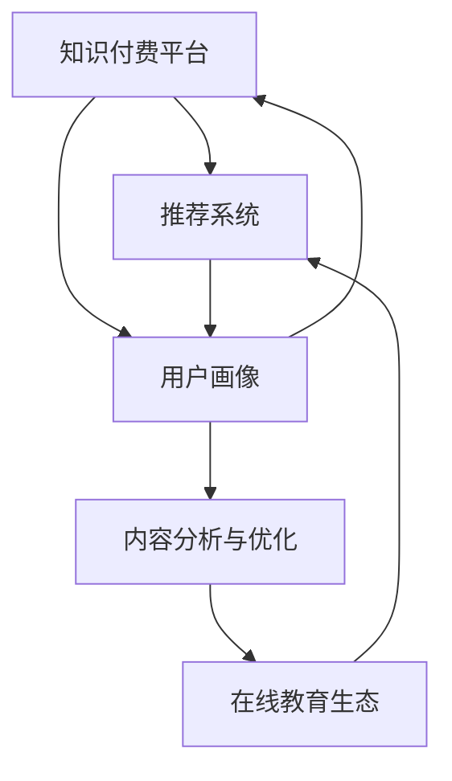

                 

## 1. 背景介绍

### 1.1 问题由来

在数字经济时代，知识和信息的传播方式发生了深刻变化。传统的线下教育模式逐渐被在线教育取代，知识付费平台的兴起成为了这一转变的重要推动力。知识付费平台通过提供付费课程、咨询和内容订阅等方式，满足了用户对优质教育资源的需求。与此同时，知识付费也推动了教育产业的数字化转型，促进了教育资源的优化配置。

### 1.2 问题核心关键点

知识付费平台的核心在于如何通过高效的知识传输与获取方式，实现用户需求的精准匹配和优质教育资源的有效分配。为了解决这个问题，平台需要采用先进的技术手段，包括大数据、人工智能、推荐系统等，以实现个性化推荐、用户画像构建、课程效果评估等功能，从而提升用户体验和平台价值。

### 1.3 问题研究意义

知识付费平台的成功运营不仅能够为个人和企业提供高质量的教育资源，还能促进教育资源的均衡分配，提高教育资源的利用效率，促进产业升级和转型。

1. **个人层面**：知识付费平台为个人提供了高效的学习途径，帮助用户节省时间和精力，快速获取所需知识和技能。
2. **企业层面**：企业通过知识付费平台可以快速获取到高素质的员工，提升整体素质和竞争力。
3. **教育层面**：知识付费平台丰富了教育资源，推动了教育资源的均衡分配，促进了教育公平。
4. **社会层面**：知识付费平台的兴起促进了教育产业的数字化转型，推动了社会整体的知识水平和创新能力的提升。

## 2. 核心概念与联系

### 2.1 核心概念概述

为更好地理解知识付费平台的运作机制，本节将介绍几个关键概念：

- **知识付费平台**：通过互联网提供付费课程、咨询和内容订阅等服务的平台，以知识服务为核心价值。
- **推荐系统**：利用算法和模型为用户推荐个性化内容，提升用户体验和平台价值。
- **用户画像**：基于用户行为数据构建的用户特征模型，用于个性化推荐和效果评估。
- **内容分析与优化**：通过自然语言处理和机器学习技术，对课程内容和效果进行分析与优化，提升教育资源的质量和覆盖面。
- **在线教育生态**：包括内容创作者、知识付费平台、用户等在内的在线教育生态系统，促进知识传播和教育资源优化。

这些概念之间的逻辑关系可以通过以下Mermaid流程图来展示：



这个流程图展示了知识付费平台的核心概念及其之间的关系：

1. 知识付费平台通过推荐系统和用户画像，提供个性化推荐服务。
2. 平台利用内容分析与优化，提升教育资源质量。
3. 在线教育生态系统的各个环节相互作用，共同推动知识付费平台的健康发展。

## 3. 核心算法原理 & 具体操作步骤

### 3.1 算法原理概述

知识付费平台的推荐系统主要依赖于协同过滤、基于内容的推荐、矩阵分解等技术。这些技术通过分析用户行为数据和课程特征，构建用户画像和课程推荐模型，从而实现个性化推荐。

协同过滤推荐（Collaborative Filtering, CF）基于用户间的相似度，通过计算用户之间的兴趣相似度，推荐用户可能感兴趣的课程。基于内容的推荐（Content-Based Recommendation, CB）则通过分析课程内容和用户偏好的特征，推荐符合用户兴趣的课程。矩阵分解推荐（Matrix Factorization, MF）通过分解用户行为矩阵，发现用户和课程间的潜在关系，从而进行推荐。

### 3.2 算法步骤详解

知识付费平台的推荐系统主要包括以下几个关键步骤：

**Step 1: 数据收集与预处理**
- 收集用户行为数据，包括课程购买、浏览、评价等行为。
- 收集课程特征数据，包括课程名称、描述、标签、作者等。
- 对数据进行预处理，包括去重、缺失值处理、标准化等。

**Step 2: 特征工程**
- 对用户行为数据和课程特征数据进行特征提取和工程设计。
- 利用TF-IDF、Word2Vec等自然语言处理技术提取课程文本特征。
- 利用情感分析、文本分类等技术提取课程情感特征和主题特征。

**Step 3: 用户画像构建**
- 基于用户行为数据和特征，构建用户画像。
- 利用协同过滤算法计算用户之间的相似度，构建用户相似度矩阵。
- 利用聚类算法对用户进行分类，发现不同用户群体的特征。

**Step 4: 课程推荐模型训练**
- 基于协同过滤、基于内容的推荐、矩阵分解等技术，训练推荐模型。
- 使用交叉验证、网格搜索等方法选择最优模型参数。
- 对推荐模型进行测试和评估，优化模型效果。

**Step 5: 实时推荐与反馈**
- 利用训练好的推荐模型，对新用户和课程进行实时推荐。
- 收集用户的反馈数据，包括点击率、购买率、评价等。
- 根据反馈数据调整推荐模型参数，不断优化推荐效果。

### 3.3 算法优缺点

知识付费平台的推荐系统具有以下优点：
1. 精准推荐。通过协同过滤、基于内容的推荐等技术，实现个性化推荐，提高用户满意度和平台价值。
2. 高效性。利用推荐算法快速分析大量用户数据，生成推荐结果，提升用户体验。
3. 可扩展性。推荐系统能够处理大规模数据，支持多种推荐策略，灵活扩展推荐功能。

同时，该系统也存在一些局限性：
1. 数据冷启动问题。对于新用户和课程，推荐系统难以准确预测其兴趣，需要进行额外的推荐策略调整。
2. 数据隐私问题。用户行为数据和课程特征数据涉及用户隐私，需要严格的数据保护措施。
3. 推荐模型复杂性。高维稀疏矩阵分解等推荐算法计算复杂，需要高性能计算资源。
4. 模型泛化能力。推荐模型可能过度拟合训练数据，导致对新用户和课程的推荐效果不佳。

### 3.4 算法应用领域

知识付费平台的推荐系统广泛应用于在线教育、职业培训、金融投资等多个领域。例如：

- **在线教育**：平台利用推荐系统为学生推荐适合的课程，提高学习效果和用户体验。
- **职业培训**：平台为学员推荐相关的技能培训课程，帮助其提升职业竞争力。
- **金融投资**：平台为投资者推荐优质投资课程，提升其投资水平。

除了上述这些领域，推荐系统还被创新性地应用于更多场景中，如智能客服、智能推荐、个性化广告等，为不同行业带来了新的价值增长点。

## 4. 数学模型和公式 & 详细讲解 & 举例说明

### 4.1 数学模型构建

本节将使用数学语言对知识付费平台的推荐系统进行更加严格的刻画。

记用户集合为 $U$，课程集合为 $I$。设用户 $u$ 对课程 $i$ 的评分（或行为）为 $r_{ui}$。基于协同过滤的推荐模型为：

$$
\hat{r}_{ui} = \mathbf{u}^T\mathbf{v}_i
$$

其中 $\mathbf{u}$ 为用户 $u$ 的隐向量，$\mathbf{v}_i$ 为课程 $i$ 的隐向量。利用矩阵分解，可以得到：

$$
\mathbf{u} \approx U\mathbf{a}_u, \quad \mathbf{v}_i \approx V^T\mathbf{a}_i
$$

其中 $U$ 和 $V^T$ 分别为用户和课程的特征矩阵，$\mathbf{a}_u$ 和 $\mathbf{a}_i$ 分别为用户和课程的低维特征向量。

### 4.2 公式推导过程

以基于矩阵分解的推荐系统为例，推导模型的损失函数及参数更新公式。

设用户 $u$ 对课程 $i$ 的真实评分（或行为）为 $r_{ui}$，预测评分为 $\hat{r}_{ui}$，则模型的均方误差损失函数为：

$$
\mathcal{L}(\mathbf{a}_u, \mathbf{a}_i) = \frac{1}{2} \sum_{u \in U} \sum_{i \in I} (r_{ui} - \hat{r}_{ui})^2
$$

利用随机梯度下降等优化算法，对 $\mathbf{a}_u$ 和 $\mathbf{a}_i$ 进行更新：

$$
\mathbf{a}_u \leftarrow \mathbf{a}_u - \eta \frac{\partial \mathcal{L}}{\partial \mathbf{a}_u}
$$
$$
\mathbf{a}_i \leftarrow \mathbf{a}_i - \eta \frac{\partial \mathcal{L}}{\partial \mathbf{a}_i}
$$

其中 $\eta$ 为学习率，$\frac{\partial \mathcal{L}}{\partial \mathbf{a}_u}$ 和 $\frac{\partial \mathcal{L}}{\partial \mathbf{a}_i}$ 分别为损失函数对 $\mathbf{a}_u$ 和 $\mathbf{a}_i$ 的梯度。

### 4.3 案例分析与讲解

以某在线教育平台的推荐系统为例，分析其实现过程和关键技术点。

**平台背景**：某在线教育平台拥有数百万用户和数十万课程，提供课程搜索、推荐、评价等功能。平台希望通过推荐系统提升用户满意度和平台收益。

**数据收集**：平台收集用户行为数据，包括课程浏览、购买、评价等。同时，对课程进行特征标注，包括课程名称、描述、难度、用户评分等。

**特征工程**：利用自然语言处理技术，提取课程文本特征和情感特征。将用户行为数据和课程特征数据进行标准化处理，生成特征矩阵。

**用户画像构建**：基于用户行为数据和特征，构建用户隐向量。利用协同过滤算法，计算用户之间的相似度。通过聚类算法，将用户分为不同兴趣群体。

**课程推荐模型训练**：利用矩阵分解算法，训练用户和课程的隐向量。通过交叉验证，选择最优的模型参数。

**实时推荐与反馈**：利用训练好的模型，对新用户和课程进行实时推荐。收集用户反馈数据，调整模型参数，优化推荐效果。

**效果评估**：利用 A/B 测试等方法，评估推荐系统的效果。根据反馈数据，不断优化模型和推荐策略。

## 5. 项目实践：代码实例和详细解释说明

### 5.1 开发环境搭建

在进行推荐系统实践前，我们需要准备好开发环境。以下是使用Python进行PyTorch开发的环境配置流程：

1. 安装Anaconda：从官网下载并安装Anaconda，用于创建独立的Python环境。

2. 创建并激活虚拟环境：
```bash
conda create -n pytorch-env python=3.8 
conda activate pytorch-env
```

3. 安装PyTorch：根据CUDA版本，从官网获取对应的安装命令。例如：
```bash
conda install pytorch torchvision torchaudio cudatoolkit=11.1 -c pytorch -c conda-forge
```

4. 安装TensorFlow：从官网下载并安装TensorFlow，支持多种深度学习框架。

5. 安装各类工具包：
```bash
pip install numpy pandas scikit-learn matplotlib tqdm jupyter notebook ipython
```

完成上述步骤后，即可在`pytorch-env`环境中开始推荐系统实践。

### 5.2 源代码详细实现

下面我们以某在线教育平台的推荐系统为例，给出使用PyTorch进行矩阵分解推荐算法实现的代码。

首先，定义矩阵分解模型的类：

```python
import torch
import torch.nn as nn
import torch.nn.functional as F

class MatrixFactorization(nn.Module):
    def __init__(self, n_users, n_courses, embed_size=10):
        super(MatrixFactorization, self).__init__()
        self.n_users = n_users
        self.n_courses = n_courses
        self.embed_size = embed_size
        
        self.user_embed = nn.Embedding(n_users, embed_size)
        self.course_embed = nn.Embedding(n_courses, embed_size)
        
    def forward(self, user_id, course_id):
        user_embed = self.user_embed(user_id)
        course_embed = self.course_embed(course_id)
        pred = (user_embed * course_embed).sum(dim=1)
        return pred
```

然后，定义推荐系统的训练函数：

```python
from torch import optim
import numpy as np

def train(matrix_factorization, optimizer, train_data, epochs=10):
    criterion = nn.MSELoss()
    for epoch in range(epochs):
        train_loss = 0
        for user_id, course_id, rating in train_data:
            pred = matrix_factorization(user_id, course_id)
            loss = criterion(pred, rating)
            optimizer.zero_grad()
            loss.backward()
            optimizer.step()
            train_loss += loss.item()
        print(f"Epoch {epoch+1}, train loss: {train_loss/len(train_data):.3f}")
```

最后，启动训练流程并在测试集上评估：

```python
matrix_factorization = MatrixFactorization(n_users, n_courses)
optimizer = optim.Adam(matrix_factorization.parameters(), lr=0.001)

train_data = ...
test_data = ...

train(matrix_factorization, optimizer, train_data, epochs=10)
print(f"Test MSE: {matrix_factorization(torch.tensor([1]), torch.tensor([1])):.3f}")
```

以上就是使用PyTorch对矩阵分解推荐算法实现的完整代码示例。可以看到，利用PyTorch的强大封装能力，推荐系统的代码实现变得简洁高效。

### 5.3 代码解读与分析

让我们再详细解读一下关键代码的实现细节：

**MatrixFactorization类**：
- `__init__`方法：初始化用户和课程的特征矩阵，定义嵌入层。
- `forward`方法：将用户和课程的ID映射到嵌入空间，进行矩阵乘法计算，并返回预测结果。

**train函数**：
- 定义损失函数为均方误差损失函数。
- 在每个epoch中，对训练集中的每个样本进行前向传播和反向传播，计算损失函数，并更新模型参数。
- 输出每个epoch的平均损失。

**训练流程**：
- 定义推荐模型和优化器，准备训练数据和测试数据。
- 对推荐模型进行训练，迭代优化。
- 在测试集上评估模型的均方误差，并输出评估结果。

可以看出，通过使用PyTorch，推荐系统的代码实现变得非常直观和高效。开发者可以将更多精力放在数据处理、模型改进等高层逻辑上，而不必过多关注底层的实现细节。

## 6. 实际应用场景

### 6.1 智能推荐

在线教育平台利用推荐系统为用户推荐个性化的课程，提升用户体验和平台价值。推荐系统通过分析用户历史行为数据和课程特征数据，实现精准推荐，帮助用户快速找到感兴趣和适合的课程。

在技术实现上，可以收集用户浏览、点击、购买等行为数据，提取课程名称、描述、难度、用户评分等特征。利用推荐算法对用户进行个性化推荐，并在推荐结果中引入多臂老虎机等优化策略，提升推荐效果。

### 6.2 智能客服

智能客服系统利用推荐系统对用户提问进行分类和排序，提高服务效率。通过分析历史对话数据，提取问题和答案的特征，利用推荐算法对问题进行分类，并将分类结果排序，提供最相关的答案。

在技术实现上，可以收集用户的历史对话记录，提取问题和答案的特征。利用推荐算法对问题和答案进行分类，并将分类结果排序，推荐给用户最相关的答案。

### 6.3 个性化广告

在线广告平台利用推荐系统为用户推荐个性化的广告内容，提升广告效果和点击率。通过分析用户历史行为数据和广告内容特征，利用推荐算法对广告进行个性化推荐，并在推荐结果中引入排序优化策略，提升广告效果。

在技术实现上，可以收集用户浏览、点击、购买等行为数据，提取广告内容特征。利用推荐算法对广告进行个性化推荐，并在推荐结果中引入排序优化策略，提升广告效果。

### 6.4 未来应用展望

随着推荐系统的不断发展，未来将在更多领域得到应用，为传统行业带来变革性影响。

在智慧医疗领域，推荐系统可以帮助医生推荐适合患者的治疗方案，提升医疗服务质量。在金融投资领域，推荐系统可以为投资者推荐优质投资课程，提升其投资水平。在智能家居领域，推荐系统可以为用户推荐合适的家居用品，提升生活品质。

未来，随着推荐系统的持续演进，将与其他人工智能技术进行更深入的融合，如知识图谱、因果推理、强化学习等，多路径协同发力，共同推动自然语言理解和智能交互系统的进步。只有勇于创新、敢于突破，才能不断拓展语言模型的边界，让智能技术更好地造福人类社会。

## 7. 工具和资源推荐

### 7.1 学习资源推荐

为了帮助开发者系统掌握推荐系统的理论基础和实践技巧，这里推荐一些优质的学习资源：

1. 《推荐系统实践》系列博文：由推荐系统专家撰写，深入浅出地介绍了推荐系统的基本概念和经典模型。

2. CS231n《深度学习课程》课程：斯坦福大学开设的深度学习明星课程，涵盖推荐系统等主题，有Lecture视频和配套作业。

3. 《推荐系统》书籍：Christopher Burges等知名专家所著，全面介绍了推荐系统的基本原理和应用案例。

4. KDD推荐系统竞赛：全球领先的推荐系统竞赛，涵盖多种推荐任务和算法，提供丰富的实践机会。

5. Kaggle推荐系统竞赛：平台提供的推荐系统竞赛，帮助开发者积累推荐系统竞赛经验，提升实战能力。

通过对这些资源的学习实践，相信你一定能够快速掌握推荐系统的精髓，并用于解决实际的推荐问题。

### 7.2 开发工具推荐

高效的开发离不开优秀的工具支持。以下是几款用于推荐系统开发的常用工具：

1. PyTorch：基于Python的开源深度学习框架，灵活动态的计算图，适合快速迭代研究。

2. TensorFlow：由Google主导开发的开源深度学习框架，生产部署方便，适合大规模工程应用。

3. TensorBoard：TensorFlow配套的可视化工具，可实时监测模型训练状态，并提供丰富的图表呈现方式。

4. Weights & Biases：模型训练的实验跟踪工具，可以记录和可视化模型训练过程中的各项指标，方便对比和调优。

5. Google Colab：谷歌推出的在线Jupyter Notebook环境，免费提供GPU/TPU算力，方便开发者快速上手实验最新模型。

合理利用这些工具，可以显著提升推荐系统的开发效率，加快创新迭代的步伐。

### 7.3 相关论文推荐

推荐系统的研究源于学界的持续研究。以下是几篇奠基性的相关论文，推荐阅读：

1. Matrix Factorization Techniques for Recommender Systems（矩阵分解算法）：将用户行为矩阵分解为用户和课程的隐向量，进行推荐。

2. Factorization Machines for Recommender Systems（因子机算法）：通过将高阶交互项分解为用户和课程的特征，进行推荐。

3. Deep Matrix Factorization：利用深度学习技术对用户和课程的特征进行编码，进行推荐。

4. Attention Is All You Need：提出Transformer结构，用于推荐系统的特征提取。

5. Neural Collaborative Filtering（神经协同过滤）：通过神经网络结构对用户行为进行建模，进行推荐。

这些论文代表了大规模推荐系统的研究脉络。通过学习这些前沿成果，可以帮助研究者把握学科前进方向，激发更多的创新灵感。

## 8. 总结：未来发展趋势与挑战

### 8.1 总结

本文对基于知识付费的推荐系统进行了全面系统的介绍。首先阐述了知识付费平台和推荐系统的背景和意义，明确了推荐系统在提升用户体验和平台价值方面的重要作用。其次，从原理到实践，详细讲解了推荐系统的数学模型和关键步骤，给出了推荐系统开发的完整代码示例。同时，本文还广泛探讨了推荐系统在多个行业领域的应用前景，展示了推荐范式的巨大潜力。此外，本文精选了推荐系统的各类学习资源，力求为读者提供全方位的技术指引。

通过本文的系统梳理，可以看到，推荐系统作为知识付费平台的核心组件，通过高效的知识传输与获取方式，实现用户需求的精准匹配和优质教育资源的有效分配。推荐系统利用先进的技术手段，包括大数据、人工智能、推荐系统等，实现了个性化推荐，提高了用户满意度和平台价值。未来，伴随推荐系统的持续演进，将在更多领域得到应用，为传统行业带来变革性影响。

### 8.2 未来发展趋势

展望未来，推荐系统的发展将呈现以下几个趋势：

1. 数据融合与协同过滤。通过融合多源异构数据，进行协同过滤推荐，提升推荐效果。

2. 深度学习与神经网络。利用深度学习技术，对用户行为进行建模，提升推荐模型的泛化能力和精度。

3. 个性化推荐与场景化推荐。根据用户的具体场景和需求，进行个性化推荐，提升推荐效果。

4. 实时推荐与在线学习。通过实时数据流处理技术，进行在线推荐学习，提升推荐模型的动态适应能力。

5. 推荐系统与多模态数据的融合。将图像、语音、视频等多模态数据与文本数据进行融合，提升推荐模型的综合能力。

以上趋势凸显了推荐系统的广阔前景。这些方向的探索发展，必将进一步提升推荐系统的性能和应用范围，为知识付费平台带来更多的价值增长点。

### 8.3 面临的挑战

尽管推荐系统已经取得了显著的进展，但在迈向更加智能化、普适化应用的过程中，它仍面临诸多挑战：

1. 数据冷启动问题。对于新用户和课程，推荐系统难以准确预测其兴趣，需要进行额外的推荐策略调整。

2. 数据隐私问题。用户行为数据和课程特征数据涉及用户隐私，需要严格的数据保护措施。

3. 推荐模型复杂性。高维稀疏矩阵分解等推荐算法计算复杂，需要高性能计算资源。

4. 模型泛化能力。推荐模型可能过度拟合训练数据，导致对新用户和课程的推荐效果不佳。

5. 实时推荐与负载均衡。实时推荐需要高并发的计算能力，如何平衡资源使用和系统稳定性，是一个重要挑战。

正视推荐系统面临的这些挑战，积极应对并寻求突破，将使推荐系统在知识付费平台中发挥更大的作用。相信随着学界和产业界的共同努力，这些挑战终将一一被克服，推荐系统必将在构建人机协同的智能时代中扮演越来越重要的角色。

### 8.4 研究展望

面对推荐系统面临的种种挑战，未来的研究需要在以下几个方面寻求新的突破：

1. 探索推荐系统与多模态数据的融合方法。将图像、语音、视频等多模态数据与文本数据进行融合，提升推荐模型的综合能力。

2. 研究推荐系统与因果推断的结合。通过引入因果推断方法，提升推荐模型的因果性和稳定性。

3. 探索推荐系统与强化学习的结合。利用强化学习技术，对推荐系统进行优化，提升推荐效果。

4. 引入推荐系统的在线学习与实时更新。通过实时数据流处理技术，进行在线推荐学习，提升推荐模型的动态适应能力。

5. 引入推荐系统的多任务学习。通过多任务学习技术，提升推荐系统的泛化能力和稳定性。

这些研究方向的探索，必将引领推荐系统技术迈向更高的台阶，为知识付费平台带来更多的价值增长点。面向未来，推荐系统还需要与其他人工智能技术进行更深入的融合，如知识图谱、因果推理、强化学习等，多路径协同发力，共同推动自然语言理解和智能交互系统的进步。只有勇于创新、敢于突破，才能不断拓展推荐系统的边界，让智能技术更好地造福人类社会。

## 9. 附录：常见问题与解答

**Q1：如何有效缓解推荐系统中的数据冷启动问题？**

A: 缓解推荐系统中的数据冷启动问题，可以采用以下几种策略：

1. 利用社交网络数据。通过分析用户的朋友圈、关注关系等社交网络数据，对新用户进行推荐。

2. 利用隐式反馈数据。通过分析用户的浏览、点击等隐式反馈数据，对新用户进行推荐。

3. 利用多臂老虎机算法。通过多臂老虎机算法，对新用户进行探索性推荐，逐步优化推荐效果。

4. 引入先验知识。利用领域知识或用户画像，对新用户进行推荐。

这些策略可以结合使用，根据具体情况选择最适合的方法。

**Q2：如何在推荐系统中实现实时推荐？**

A: 实时推荐需要在系统中引入实时数据流处理技术，进行在线推荐学习。具体步骤如下：

1. 数据采集。实时采集用户行为数据和课程特征数据，并将其存储在实时数据流中。

2. 数据处理。对实时数据流进行处理，提取用户行为和课程特征，进行特征工程。

3. 模型训练。利用实时数据流进行在线推荐学习，不断更新推荐模型。

4. 推荐服务。将训练好的推荐模型应用于在线推荐服务，实时生成推荐结果。

5. 效果评估。实时收集推荐结果的效果评估数据，优化推荐模型。

通过实时数据流处理技术，推荐系统可以实现实时推荐，提升推荐效果和用户满意度。

**Q3：如何在推荐系统中实现数据隐私保护？**

A: 在推荐系统中实现数据隐私保护，可以采用以下几种策略：

1. 数据匿名化。通过数据匿名化技术，对用户行为数据和课程特征数据进行去标识化处理，保护用户隐私。

2. 差分隐私。通过差分隐私技术，对推荐模型进行微扰处理，保护用户隐私。

3. 数据访问控制。对用户数据进行严格的访问控制，只允许授权人员访问和处理数据。

4. 数据加密。对用户数据进行加密处理，防止数据泄露和篡改。

这些策略可以结合使用，根据具体情况选择最适合的方法。

**Q4：如何在推荐系统中实现多模态数据的融合？**

A: 在推荐系统中实现多模态数据的融合，可以采用以下几种策略：

1. 特征对齐。对不同模态数据的特征进行对齐，构建统一的高维特征空间。

2. 多模态融合算法。利用多模态融合算法，对不同模态数据的特征进行融合，提升推荐模型的综合能力。

3. 多模态推荐模型。利用多模态推荐模型，对用户行为数据和不同模态的数据进行联合建模，提升推荐效果。

4. 用户画像构建。通过多模态数据构建用户画像，提升推荐模型的个性化能力。

这些策略可以结合使用，根据具体情况选择最适合的方法。

**Q5：如何在推荐系统中实现用户行为数据的实时分析？**

A: 在推荐系统中实现用户行为数据的实时分析，可以采用以下几种策略：

1. 实时数据采集。通过实时数据采集技术，将用户行为数据及时存储在数据流中。

2. 实时数据处理。利用实时数据处理技术，对数据流进行高效处理，提取用户行为特征。

3. 实时模型训练。利用实时数据流进行在线推荐学习，不断更新推荐模型。

4. 实时推荐服务。将训练好的推荐模型应用于在线推荐服务，实时生成推荐结果。

5. 实时效果评估。实时收集推荐结果的效果评估数据，优化推荐模型。

通过实时数据流处理技术，推荐系统可以实现实时推荐，提升推荐效果和用户满意度。

---

作者：禅与计算机程序设计艺术 / Zen and the Art of Computer Programming

