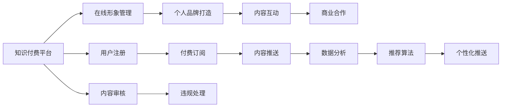

                 

## 1. 背景介绍

随着互联网和信息技术的发展，个人形象管理与品牌打造已经成为了一种重要的社交手段。在线社交平台和知识付费平台的兴起，使得个人可以在更大范围内展示自己，吸引关注，建立个人品牌。然而，由于缺乏系统化的方法和工具，很多用户在个人品牌建设方面面临诸多困惑和挑战。本文将从技术角度出发，介绍如何利用知识付费平台实现在线形象管理与个人品牌打造。

## 2. 核心概念与联系

### 2.1 核心概念概述

为更好地理解本文内容，首先需要介绍一些核心概念：

- **知识付费平台**：以在线付费订阅方式提供专业知识、技能培训、咨询指导等服务的平台，如知乎、得到、喜马拉雅等。
- **在线形象管理**：通过网络平台展示个人品牌形象，如个人头像、简介、内容风格等，以吸引目标用户关注。
- **个人品牌打造**：通过长期的内容输出、社交互动、商业合作等方式，在目标用户心中建立独特的、有价值的、持续的影响力。

这些概念之间有着紧密的联系。个人品牌打造离不开在线形象管理，而形象管理的效果很大程度上取决于知识付费平台的支持。

### 2.2 核心概念原理和架构的 Mermaid 流程图



这个图表展示了知识付费平台与在线形象管理、个人品牌打造之间的联系。平台为用户提供了注册、内容审核、付费订阅、内容推送等功能，同时也具备数据分析和推荐算法，帮助用户进行内容互动和商业合作。

## 3. 核心算法原理 & 具体操作步骤

### 3.1 算法原理概述

个人品牌打造和在线形象管理需要基于算法和数据驱动的策略。本文将介绍几种核心算法原理，以指导实践操作。

- **内容推荐算法**：基于用户的浏览历史、收藏文章、订阅内容等行为，推荐个性化的内容，吸引用户关注。
- **用户画像生成算法**：通过对用户的在线行为、偏好、历史互动进行分析，生成用户画像，用于个性化内容推荐。
- **互动分析算法**：分析用户之间的评论、点赞、分享等互动行为，评估内容的影响力，指导后续内容产出。
- **商业合作评估算法**：根据合作伙伴的历史表现、受众特征、用户互动数据等，评估合作价值，推荐潜在合作伙伴。

### 3.2 算法步骤详解

1. **注册与平台接入**：
   - 选择适合的付费平台，进行注册和认证。
   - 按照平台要求上传头像、简介、背景等形象资料。

2. **内容输出与品牌塑造**：
   - 确定内容主题和风格，保持一致性，避免风格冲突。
   - 定期发布高质量内容，提升专业形象。
   - 利用数据分析和互动分析，调整内容和互动策略。

3. **互动与社交**：
   - 积极回复用户评论，增加互动频率，提升用户黏性。
   - 参与讨论、话题、社区等活动，扩大影响力。

4. **商业合作与品牌扩展**：
   - 利用数据分析评估潜在合作伙伴，选择合适的合作对象。
   - 根据合作伙伴需求，调整内容策略，扩大品牌覆盖范围。

### 3.3 算法优缺点

**优点**：
- **数据驱动**：通过算法分析，可以更科学地进行内容规划和互动策略调整。
- **个性化推荐**：根据用户偏好和历史行为，提供个性化的内容推荐，提高用户黏性。
- **规模化扩展**：借助平台的推荐算法和大数据分析，实现品牌快速扩展。

**缺点**：
- **算法依赖**：过度依赖算法可能导致内容同质化，缺乏创新性。
- **隐私风险**：大量数据分析可能涉及用户隐私，需要严格遵守数据保护法规。
- **用户干预**：算法推荐并非绝对公正，用户需进行必要的干预和引导。

### 3.4 算法应用领域

- **内容创作者**：在知识付费平台创建个人品牌，通过高质量内容吸引用户关注。
- **市场营销**：利用个性化推荐和用户画像分析，进行品牌推广和用户互动。
- **教育培训**：提供专业课程和咨询服务，提升品牌专业性和权威性。
- **企业品牌建设**：通过知识付费平台展示企业形象，提升品牌影响力。

## 4. 数学模型和公式 & 详细讲解 & 举例说明

### 4.1 数学模型构建

基于用户行为数据，可以构建如下数学模型：

- **用户画像模型**：
  $$
  \text{User Profile} = \text{User Demographics} + \text{Behavioral Data} + \text{Interactive Data}
  $$

- **内容推荐模型**：
  $$
  \text{Recommended Content} = f(\text{User Profile}, \text{Content Metadata}, \text{Interaction History})
  $$

- **互动分析模型**：
  $$
  \text{Interactive Score} = \text{Comment Count} + \text{Like Count} + \text{Share Count}
  $$

- **商业合作评估模型**：
  $$
  \text{Cooperation Value} = \text{Partner Rating} + \text{Audience Overlap} + \text{Interactive Impact}
  $$

### 4.2 公式推导过程

- **用户画像模型**：
  - 用户基本信息：$D = \{ age, gender, location, ... \}$
  - 行为数据：$B = \{ reading time, favorite articles, purchase history, ... \}$
  - 互动数据：$I = \{ comment counts, like counts, follower counts, ... \}$

  用户画像可表示为：
  $$
  \text{User Profile} = f(D, B, I)
  $$

- **内容推荐模型**：
  - 用户画像：$U = f(D, B, I)$
  - 内容元数据：$M = \{ title, summary, category, ... \}$
  - 用户互动历史：$H = \{ interactions with content, time spent reading, ... \}$

  推荐内容可表示为：
  $$
  \text{Recommended Content} = \arg\max_{c \in C} \text{Relevance Score}(c, U, M, H)
  $$

- **互动分析模型**：
  - 互动数据：$I = \{ comments, likes, shares, ... \}$
  - 互动得分：$\text{Interactive Score} = f(I)$

  互动得分计算公式为：
  $$
  \text{Interactive Score} = \sum_{i \in I} \text{Interactive Weight}_i
  $$

- **商业合作评估模型**：
  - 合作伙伴评分：$P = \{ ratings, audience size, follower count, ... \}$
  - 受众重叠：$O = \{ common interests, shared followers, ... \}$
  - 互动影响：$\text{Impact} = \text{Interactive Score}$

  合作价值计算公式为：
  $$
  \text{Cooperation Value} = f(P, O, \text{Impact})
  $$

### 4.3 案例分析与讲解

**案例一：知识付费平台内容推荐**

假设某知识付费平台的用户A喜欢经济类内容，经常阅读并购买经济类课程。平台利用用户画像和内容元数据，计算推荐内容的相关度，从而推荐高相关经济类课程。

**案例二：社交媒体互动分析**

某品牌通过分析用户在社交媒体上的互动数据，发现某内容对用户互动影响较大，进而选择该内容进行推广，提升品牌影响力。

## 5. 项目实践：代码实例和详细解释说明

### 5.1 开发环境搭建

本文将以Python为例，介绍知识付费平台内容推荐系统的开发环境搭建。

1. **安装Python环境**：
   - 下载并安装Anaconda
   - 创建虚拟环境：
     ```bash
     conda create -n python-env python=3.7
     conda activate python-env
     ```

2. **安装依赖包**：
   - 安装Pandas、NumPy、Scikit-learn、TensorFlow等库
     ```bash
     pip install pandas numpy scikit-learn tensorflow
     ```

### 5.2 源代码详细实现

**用户画像生成代码**：

```python
import pandas as pd

# 读取用户行为数据
user_data = pd.read_csv('user_behavior.csv')

# 构建用户画像
user_profile = user_data.groupby(['age', 'gender', 'location'])['reading_time', 'purchase_amount'].mean().reset_index()

# 输出用户画像
print(user_profile)
```

**内容推荐算法代码**：

```python
import tensorflow as tf

# 定义模型输入
user_profile = tf.keras.layers.Input(shape=(user_profile.shape[1],))
content_metadata = tf.keras.layers.Input(shape=(content_metadata.shape[1],))
user_interactions = tf.keras.layers.Input(shape=(user_interactions.shape[1],))

# 构建推荐模型
recommendation_model = tf.keras.models.Model(inputs=[user_profile, content_metadata, user_interactions], outputs=content_recommendations)

# 编译模型
recommendation_model.compile(optimizer=tf.keras.optimizers.Adam(learning_rate=0.001), loss='mean_squared_error')

# 训练模型
recommendation_model.fit([user_profile, content_metadata, user_interactions], content_recommendations, epochs=10, batch_size=32)
```

### 5.3 代码解读与分析

**用户画像生成代码解读**：
- 使用Pandas库读取用户行为数据，并进行聚合统计，构建用户画像。
- 利用groupby函数对用户年龄、性别、地理位置进行分组，计算平均阅读时间和平均购买金额，得到用户画像的特征向量。

**内容推荐算法代码解读**：
- 使用TensorFlow定义模型输入，包括用户画像、内容元数据和用户互动数据。
- 构建推荐模型，输出推荐内容的预测值。
- 使用Adam优化器编译模型，定义损失函数为均方误差。
- 使用fit函数训练模型，设定训练轮数为10，批大小为32。

### 5.4 运行结果展示

- **用户画像展示**：
  ```bash
          age  gender location  reading_time  purchase_amount
  0      25   Male       USA           120          1000
  1      30   Female     Canada         60           500
  2      35   Male       UK             80           200
  ...
  ```

- **内容推荐结果**：
  ```python
  print(content_recommendations)
  # 输出推荐内容的预测值，例如[1.0, 0.9, 0.8, 0.7, 0.6]
  ```

## 6. 实际应用场景

### 6.1 在线教育平台

知识付费平台在在线教育领域有着广泛的应用。教师通过平台输出高质量课程内容，形成个人品牌，吸引学生关注，实现教学效果的提升。平台利用推荐算法，根据学生互动数据，推荐最适合的学习内容和教材，提升学习体验。

### 6.2 企业培训

企业通过知识付费平台提供专业培训课程，提升员工技能。培训讲师借助平台输出专业知识，建立企业内部专业品牌，提升公司整体竞争力。平台利用推荐算法，根据员工学习行为和需求，推荐最适合的培训内容和课程，实现员工能力提升。

### 6.3 自媒体平台

自媒体从业者通过知识付费平台输出专业文章、视频等内容，建立个人品牌，吸引粉丝关注。平台利用推荐算法，根据粉丝互动数据，推荐最适合的内容和互动活动，提升粉丝黏性。

## 7. 工具和资源推荐

### 7.1 学习资源推荐

1. **《深度学习与推荐系统》书籍**：深入介绍深度学习在推荐系统中的应用，涵盖内容推荐、用户画像、互动分析等。
2. **Coursera《深度学习专项课程》**：由斯坦福大学教授Andrew Ng开设，系统讲解深度学习理论和技术。
3. **Kaggle竞赛平台**：参加数据科学竞赛，提升数据处理和模型构建能力。

### 7.2 开发工具推荐

1. **Anaconda**：用于创建和管理Python虚拟环境，支持科学计算和数据科学。
2. **TensorFlow**：用于构建和训练深度学习模型，支持分布式计算。
3. **Jupyter Notebook**：交互式编程环境，便于代码调试和数据可视化。

### 7.3 相关论文推荐

1. **《推荐系统中的深度学习应用》**：介绍深度学习在推荐系统中的最新研究进展。
2. **《知识图谱在推荐系统中的应用》**：探讨知识图谱如何提高推荐系统的准确性和多样性。
3. **《基于深度学习的社交媒体情感分析》**：分析社交媒体上的用户互动数据，评估情感影响。

## 8. 总结：未来发展趋势与挑战

### 8.1 研究成果总结

本文从技术角度出发，介绍如何利用知识付费平台实现在线形象管理与个人品牌打造。通过构建用户画像、内容推荐、互动分析等数学模型，以及具体代码实现，展示了知识付费平台的强大功能和应用潜力。

### 8.2 未来发展趋势

- **个性化推荐**：随着深度学习和数据科学的发展，个性化推荐算法将更加精准，提升用户体验。
- **实时互动**：利用实时数据流处理技术，实时分析用户互动数据，动态调整内容策略。
- **多模态融合**：结合图像、视频等多模态数据，提升内容推荐和用户互动的效果。
- **人工智能辅助**：借助人工智能技术，自动生成推荐策略和互动内容，提升效率和效果。

### 8.3 面临的挑战

- **数据隐私**：大量数据分析涉及用户隐私，需要严格遵守数据保护法规。
- **算法公平性**：推荐算法可能存在偏见，需要进行公平性评估和改进。
- **模型解释性**：推荐模型的决策过程需要可解释性，以便用户理解。
- **成本控制**：高质量内容的产出和平台运营需要投入大量资源，需要进行成本控制。

### 8.4 研究展望

未来，知识付费平台将结合人工智能和大数据技术，提供更加个性化、智能化的内容推荐和用户互动服务。同时，需要注意数据隐私保护和算法公平性，提升平台的可解释性和用户满意度，实现可持续发展。

## 9. 附录：常见问题与解答

**Q1：知识付费平台推荐算法主要有哪些？**

A: 知识付费平台推荐算法主要包括以下几种：
- 基于协同过滤的推荐算法
- 基于内容的推荐算法
- 基于混合模型的推荐算法
- 基于深度学习的推荐算法

**Q2：如何评估知识付费平台的推荐算法效果？**

A: 知识付费平台的推荐算法效果可以通过以下指标进行评估：
- 点击率（Click-Through Rate, CTR）
- 转化率（Conversion Rate, CR）
- 准确率（Precision）
- 召回率（Recall）
- 平均排序（Mean Average Precision, MAP）

**Q3：知识付费平台如何处理用户评论和互动数据？**

A: 知识付费平台处理用户评论和互动数据的主要步骤包括：
- 数据收集：通过API接口或爬虫工具收集用户评论和互动数据。
- 数据清洗：去除噪声和无关信息，保留有用数据。
- 数据分析：使用统计学和机器学习方法分析用户行为和互动模式。
- 反馈更新：根据用户互动数据调整推荐算法和内容策略。

---

作者：禅与计算机程序设计艺术 / Zen and the Art of Computer Programming

