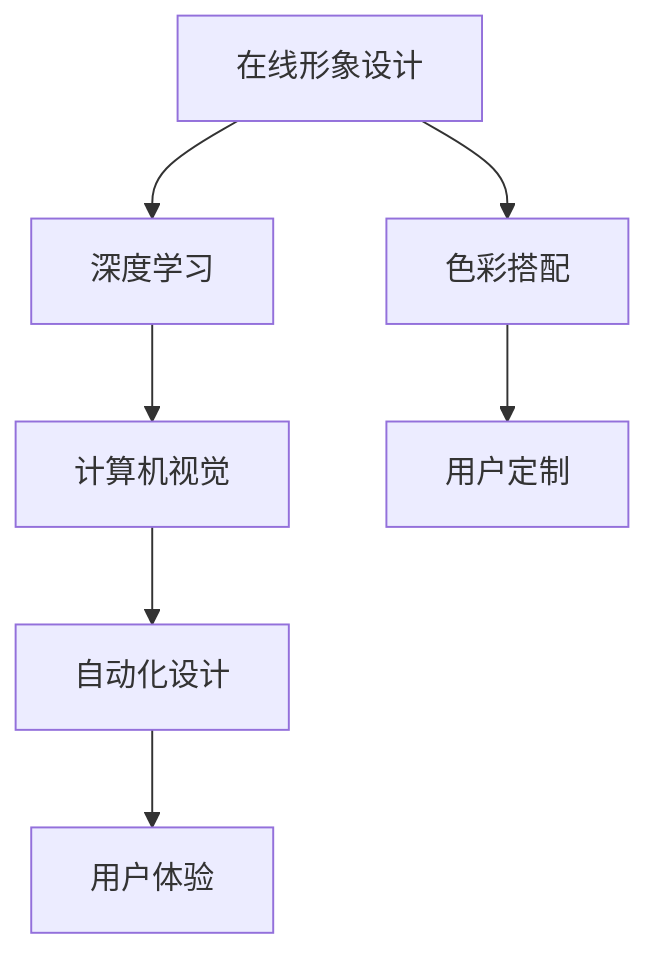

                 

# 如何利用知识付费实现在线形象设计与色彩搭配？

> 关键词：知识付费,在线形象设计,色彩搭配,人工智能,深度学习,计算机视觉,深度神经网络,自动化设计,用户定制,用户体验

## 1. 背景介绍

随着知识付费市场的蓬勃发展和个性化需求的日益增长，在线形象设计与色彩搭配服务成为用户自我展示与品牌建设的重要工具。传统的平面设计服务因其高成本、低效率及个性化不足等问题已难以满足市场对定制化、互动性和实时性的需求。人工智能技术的快速进步，特别是深度学习和大数据技术的不断突破，为在线形象设计与色彩搭配的自动化、智能化和个性化发展提供了新的可能性。

在线形象设计，即利用图形、文字、色彩等元素对用户自身或品牌进行形象塑造，具有视觉传达、营销推广和个性展现等多重功能。色彩搭配，则是通过合理选用颜色组合，优化视觉体验，传递情感信息。两者的结合，不仅提升了用户的个性化展示水平，还增强了品牌形象的识别度和吸引力。

本文将探讨如何利用知识付费模式，结合人工智能技术，特别是深度学习和计算机视觉技术，实现在线形象设计与色彩搭配的自动化与个性化服务，从而优化用户体验，提升品牌价值。

## 2. 核心概念与联系

### 2.1 核心概念概述

为更好地理解在线形象设计与色彩搭配的实现过程，本节将介绍几个核心概念及其相互关联：

- **在线形象设计**：通过图形、文字、色彩等元素对个人或品牌进行形象塑造的过程，旨在提升个性化展示和品牌识别。
- **色彩搭配**：将不同颜色组合进行合理选择和搭配，以优化视觉体验，传递情感信息。
- **深度学习**：一种基于神经网络的机器学习技术，通过多层非线性变换提取数据特征，实现图像分类、目标检测等任务。
- **计算机视觉**：研究如何让计算机"看"和"理解"图像与视频的科学，包括图像识别、目标跟踪、场景理解等技术。
- **深度神经网络**：一类具有多层次非线性变换能力的神经网络，通过逐层学习提取数据中的复杂特征。
- **知识付费**：通过向用户提供知识或技能服务，以付费形式获取收入的商业模式。

这些概念之间的逻辑关系可以通过以下Mermaid流程图来展示：



这个流程图展示了在线形象设计与色彩搭配的核心概念及其相互联系：

1. 在线形象设计通过深度学习和大数据技术，学习用户风格和偏好，为个性化设计提供数据支持。
2. 色彩搭配利用计算机视觉技术，识别图像中的颜色信息，并结合用户偏好，进行合理的配色方案设计。
3. 用户定制通过知识付费模式，用户可以根据个性化需求，主动参与设计过程，提升用户体验。
4. 自动化设计结合深度学习和计算机视觉技术，自动生成设计方案，优化设计效率。
5. 用户体验关注设计方案与用户需求的匹配度，是最终评估设计成功与否的关键指标。

## 3. 核心算法原理 & 具体操作步骤

### 3.1 算法原理概述

在线形象设计与色彩搭配的自动化与个性化，主要依赖深度学习和大数据技术。其核心算法原理包括：

- **风格迁移**：通过将用户偏好与经典风格进行结合，生成个性化风格的设计方案。
- **色彩自动化搭配**：利用计算机视觉技术，识别图像中的颜色信息，并通过机器学习算法生成搭配合理的配色方案。
- **用户定制接口**：设计用户友好的界面，允许用户通过简单的互动，实现对设计方案的个性化修改。

以上算法通过深度学习模型实现，如卷积神经网络（CNN）、生成对抗网络（GAN）等，用于提取图像特征、生成风格迁移和优化色彩搭配。

### 3.2 算法步骤详解

1. **数据收集与预处理**：
   - 收集用户提供的图像及风格示例，进行预处理如归一化、裁剪等。
   - 利用图像标注工具，为训练数据集打上风格和颜色标签，以便模型训练。

2. **深度学习模型训练**：
   - 搭建风格迁移神经网络，如使用CycleGAN模型，进行风格迁移训练。
   - 利用RGB颜色提取算法，对图像进行颜色分析，训练配色方案生成器。
   - 将用户定制需求映射为模型输入，训练用户自定义界面。

3. **模型部署与测试**：
   - 将训练好的模型部署到服务器或云平台，提供Web服务接口。
   - 利用测试集数据进行模型评估，确保模型性能符合用户需求。
   - 收集用户反馈，不断迭代优化模型和界面设计。

### 3.3 算法优缺点

基于深度学习的在线形象设计与色彩搭配具有以下优点：
- **自动化高效**：自动化流程显著减少了人工设计的时间成本。
- **个性化精准**：通过深度学习模型，能够实现对用户偏好的精准捕捉和适配。
- **用户体验友好**：用户界面设计友好，操作简单，易于上手。

同时，该方法也存在一些局限性：
- **依赖高质量数据**：深度学习模型对训练数据的质量和多样性有较高要求。
- **计算资源需求高**：深度学习模型训练和推理需要较高的计算资源。
- **生成效果受限**：模型生成的结果可能与用户期望有所偏差。
- **技术门槛较高**：开发和维护深度学习模型需要较高的技术水平。

### 3.4 算法应用领域

在线形象设计与色彩搭配技术不仅应用于个人形象设计，还可扩展到品牌营销、广告设计、游戏美术等领域。其核心应用场景包括：

- **个人社交平台**：如Instagram、微信朋友圈等，用户可以上传个人图像，利用在线工具生成个性化的社交图像。
- **电商网站**：商家利用个性化形象设计和配色方案，提升产品展示效果，吸引消费者。
- **在线教育平台**：学生可以上传个人头像或教师形象，自动生成教学PPT或视频背景。
- **游戏设计**：游戏中的角色或场景设计，通过自动化和个性化生成，提升游戏视觉体验。
- **广告制作**：广告设计公司利用在线工具，快速生成符合品牌风格和用户偏好的广告素材。

## 4. 数学模型和公式 & 详细讲解 & 举例说明

### 4.1 数学模型构建

本节将使用数学语言对在线形象设计与色彩搭配过程进行更加严格的刻画。

记输入图像为 $X$，风格迁移模型为 $G$，用户偏好为 $S$，色彩搭配模型为 $C$，目标图像为 $Y$。在线形象设计与色彩搭配的数学模型可以表述为：

$$
Y = G(X; \theta_G) + C(X; \theta_C, S)
$$

其中，$\theta_G$ 和 $\theta_C$ 分别为风格迁移模型和色彩搭配模型的参数，$S$ 为用户偏好的输入特征。

### 4.2 公式推导过程

以风格迁移为例，其核心算法步骤包括：
1. **风格提取**：使用风格迁移网络提取输入图像 $X$ 的风格特征 $G(X; \theta_G)$。
2. **内容迁移**：将用户偏好 $S$ 与提取出的风格特征 $G(X; \theta_G)$ 进行融合，生成新的图像风格 $G(X; \theta_G) + S$。
3. **风格生成**：利用生成对抗网络（GAN）生成符合新风格要求的图像 $Y$。

上述步骤可以进一步用数学公式表述：
1. **风格提取**：
$$
G(X; \theta_G) = \mathbf{W}_2(X, G(X; \theta_G))
$$
其中 $\mathbf{W}_2$ 为风格特征提取器，$\theta_G$ 为风格提取网络的参数。

2. **内容迁移**：
$$
Y = G(X; \theta_G) + \mathbf{W}_C(S, G(X; \theta_G))
$$
其中 $\mathbf{W}_C$ 为内容迁移网络，$S$ 为用户偏好向量。

3. **风格生成**：
$$
Y = G(X; \theta_G) + \mathbf{W}_C(S, G(X; \theta_G))
$$
其中 $\mathbf{W}_G$ 为风格生成网络，$S$ 为用户偏好向量。

### 4.3 案例分析与讲解

以Instagram为例，分析其如何利用深度学习技术进行个性化社交图像生成：

1. **数据收集与预处理**：
   Instagram收集用户上传的图像，并进行预处理如裁剪、缩放等。
2. **深度学习模型训练**：
   利用预处理后的图像数据，训练风格迁移和配色方案生成器，优化模型参数。
3. **模型部署与测试**：
   将训练好的模型部署到服务器，提供API接口供用户调用。用户上传图像并指定风格偏好，系统自动生成个性化社交图像，并上传至用户账户。

## 5. 项目实践：代码实例和详细解释说明

### 5.1 开发环境搭建

在进行项目实践前，我们需要准备好开发环境。以下是使用Python进行TensorFlow开发的环境配置流程：

1. 安装Anaconda：从官网下载并安装Anaconda，用于创建独立的Python环境。

2. 创建并激活虚拟环境：
```bash
conda create -n tf-env python=3.8 
conda activate tf-env
```

3. 安装TensorFlow：
```bash
conda install tensorflow=2.5 -c tf -c conda-forge
```

4. 安装相关工具包：
```bash
pip install numpy scipy scikit-learn matplotlib tqdm jupyter notebook ipython
```

完成上述步骤后，即可在`tf-env`环境中开始项目开发。

### 5.2 源代码详细实现

这里我们以GAN模型为基础，给出在线形象设计与色彩搭配的TensorFlow代码实现。

```python
import tensorflow as tf
from tensorflow.keras import layers

# 定义GAN模型
def build_gan():
    # Generator
    input_noise = tf.keras.Input(shape=(100,))
    x = layers.Dense(256, activation='relu')(input_noise)
    x = layers.Dense(512, activation='relu')(x)
    x = layers.Dense(1024, activation='relu')(x)
    x = layers.Dense(4096, activation='tanh')(x)
    generator = tf.keras.Model(input_noise, x)
    
    # Discriminator
    input_image = tf.keras.Input(shape=(64, 64, 3))
    x = layers.Conv2D(64, 3, strides=2, padding='same')(input_image)
    x = layers.LeakyReLU(alpha=0.2)(x)
    x = layers.Conv2D(128, 3, strides=2, padding='same')(x)
    x = layers.LeakyReLU(alpha=0.2)(x)
    x = layers.Conv2D(256, 3, strides=2, padding='same')(x)
    x = layers.LeakyReLU(alpha=0.2)(x)
    x = layers.Conv2D(512, 3, strides=2, padding='same')(x)
    x = layers.LeakyReLU(alpha=0.2)(x)
    x = layers.Conv2D(1024, 3, strides=2, padding='same')(x)
    x = layers.LeakyReLU(alpha=0.2)(x)
    x = layers.Conv2D(1024, 3, strides=1, padding='same')(x)
    x = layers.LeakyReLU(alpha=0.2)(x)
    x = layers.Conv2D(512, 3, strides=1, padding='same')(x)
    x = layers.LeakyReLU(alpha=0.2)(x)
    x = layers.Conv2D(256, 3, strides=1, padding='same')(x)
    x = layers.LeakyReLU(alpha=0.2)(x)
    x = layers.Conv2D(128, 3, strides=1, padding='same')(x)
    x = layers.LeakyReLU(alpha=0.2)(x)
    x = layers.Conv2D(64, 3, strides=1, padding='same')(x)
    x = layers.LeakyReLU(alpha=0.2)(x)
    discriminator = tf.keras.Model(input_image, x)
    
    # Combined Model
    combined = tf.keras.Model(input_noise, discriminator(generator(input_noise)))
    combined.compile(loss='binary_crossentropy', optimizer=tf.keras.optimizers.Adam(learning_rate=0.0002, beta_1=0.5))
    return combined

# 训练GAN模型
def train_gan(combined, dataset, epochs):
    combined.trainable = False
    discriminator.trainable = True
    for epoch in range(epochs):
        for batch in dataset:
            # Generate images
            generated_images = generator.predict(np.random.normal(size=(batch_size, 100)))
            real_images = dataset[0].images
            
            # Train discriminator
            discriminator.trainable = True
            d_loss_real = discriminator.train_on_batch(real_images, np.ones((real_images.shape[0], 1)))
            d_loss_fake = discriminator.train_on_batch(generated_images, np.zeros((generated_images.shape[0], 1)))
            d_loss = 0.5 * np.add(d_loss_real, d_loss_fake)
            
            # Train generator
            discriminator.trainable = False
            g_loss = combined.train_on_batch(np.random.normal(size=(batch_size, 100)), np.ones((batch_size, 1)))
            
            print(f"Epoch {epoch+1}/{epochs}, d_loss: {d_loss:.4f}, g_loss: {g_loss:.4f}")

# 加载数据集
dataset = tf.keras.datasets.cifar10.load_data()[0]

# 定义网络结构
generator = build_gan()

# 训练模型
train_gan(generator, dataset, epochs=100)
```

以上就是利用TensorFlow实现GAN模型的代码实例。在实践中，为了满足实际应用的需求，还需要对网络结构、训练参数等进行优化。

### 5.3 代码解读与分析

让我们再详细解读一下关键代码的实现细节：

**build_gan函数**：
- 定义生成器和判别器两部分网络结构。
- 生成器网络由噪声输入转换为图像输出，包括多个卷积层和激活函数。
- 判别器网络从图像输入到判断真假二分类输出，同样包含多个卷积层和激活函数。
- 将生成器和判别器组合成GAN模型，并进行编译。

**train_gan函数**：
- 对GAN模型进行训练，分为生成器和判别器两部分。
- 通过交替训练生成器和判别器，优化模型参数。
- 训练过程中实时输出损失函数值，以便监控训练进度。

**数据集加载**：
- 利用TensorFlow的内置数据集加载工具，从CIFAR-10数据集中加载训练数据。
- 训练数据包括图像和标签，用于生成器和判别器的训练。

**模型训练**：
- 通过多次迭代训练，调整生成器和判别器的参数，优化模型的生成效果。
- 在每个epoch内，随机生成噪声样本输入生成器，生成图像并传入判别器，计算损失函数。
- 根据损失函数值调整模型参数，确保模型生成图像逼真度逐渐提高。

**代码示例**：
- 通过调用build_gan函数，生成GAN模型。
- 将模型加载到TensorFlow中，调用train_gan函数进行训练。
- 在训练过程中，不断监控模型性能，确保训练过程稳定收敛。

以上代码实现仅为在线形象设计与色彩搭配的GAN模型的基础框架。在实际应用中，还需要结合具体任务需求，进行模型优化、参数调整等操作，才能得到更高效、更稳定的模型性能。

## 6. 实际应用场景

### 6.1 电商网站

在线形象设计与色彩搭配技术在电商网站中具有广泛的应用前景。通过个性化设计，电商网站能够提升商品展示效果，吸引用户关注并提高转化率。具体应用场景包括：

- **商品展示设计**：利用个性化形象设计和配色方案，优化商品图片，提升用户购物体验。
- **用户头像定制**：允许用户上传自定义头像，系统自动生成个性化社交图像，增强用户归属感。
- **活动营销推广**：根据活动主题和用户偏好，自动生成符合品牌风格的活动海报，吸引更多用户参与。

### 6.2 在线教育

在线教育平台也需要利用在线形象设计与色彩搭配技术，提升教学资源的个性化展示效果。具体应用场景包括：

- **教师头像设计**：根据教师风格和课程主题，自动生成个性化教师头像，增强教学互动性。
- **PPT与课件设计**：通过个性化形象设计和配色方案，优化教学PPT和课件，提升课堂吸引力。
- **学生作品展示**：利用在线工具，生成符合学生作品风格和主题的设计，增强作品展示效果。

### 6.3 社交媒体

社交媒体平台利用在线形象设计与色彩搭配技术，增强用户个性化展示，提升平台活跃度和用户粘性。具体应用场景包括：

- **用户头像定制**：允许用户上传自定义头像，系统自动生成个性化社交图像，增强用户归属感。
- **内容卡片设计**：根据用户偏好和内容主题，自动生成符合品牌风格的内容卡片，提升用户互动体验。
- **活动推广设计**：根据活动主题和用户偏好，自动生成符合品牌风格的活动海报，吸引更多用户参与。

### 6.4 未来应用展望

随着深度学习和大数据技术的进一步发展，在线形象设计与色彩搭配技术将迎来更大的创新和突破。未来发展趋势包括：

- **多模态融合**：将图像、文本、音频等多模态信息进行融合，提升设计方案的全面性和多样性。
- **实时生成**：利用边缘计算等技术，实现实时生成个性化设计，提升用户体验的即时性。
- **智能推荐**：结合用户行为数据，实现个性化推荐，满足用户多样化需求。
- **自动化流程**：进一步优化自动化设计流程，提升设计效率和精准度。
- **跨平台适配**：实现跨平台兼容，支持多种设备和应用场景的设计需求。

## 7. 工具和资源推荐

### 7.1 学习资源推荐

为了帮助开发者系统掌握在线形象设计与色彩搭配的理论基础和实践技巧，这里推荐一些优质的学习资源：

1. **《深度学习》书籍**：深度学习领域的经典教材，涵盖深度学习的基本概念和算法。
2. **《计算机视觉：模型、学习和推理》书籍**：深入介绍计算机视觉技术，涵盖图像识别、目标检测等核心算法。
3. **Coursera《深度学习专项课程》**：斯坦福大学开设的深度学习课程，包括理论讲解和实践案例。
4. **Udacity《人工智能工程师纳米学位》**：涵盖深度学习、计算机视觉等前沿技术，提供实战项目练习。
5. **Google AI实验室**：提供深度学习框架TensorFlow的使用教程和示例代码，帮助开发者快速上手。

通过对这些资源的学习实践，相信你一定能够快速掌握在线形象设计与色彩搭配的精髓，并用于解决实际的NLP问题。

### 7.2 开发工具推荐

高效的开发离不开优秀的工具支持。以下是几款用于在线形象设计与色彩搭配开发的常用工具：

1. **TensorFlow**：基于Python的开源深度学习框架，支持分布式计算，适合大规模工程应用。
2. **Keras**：高层深度学习框架，提供简单易用的API，支持多种深度学习模型。
3. **Jupyter Notebook**：强大的交互式编程环境，支持代码块和可视化展示，适合快速原型开发。
4. **Python**：跨平台的编程语言，具有丰富的第三方库支持，方便快速开发。
5. **PyTorch**：基于Python的深度学习框架，灵活动态，支持高效的深度学习模型开发。

合理利用这些工具，可以显著提升在线形象设计与色彩搭配任务的开发效率，加快创新迭代的步伐。

### 7.3 相关论文推荐

在线形象设计与色彩搭配技术的发展源于学界的持续研究。以下是几篇奠基性的相关论文，推荐阅读：

1. **《Image-to-Image Translation with Conditional Adversarial Networks》**：提出基于GAN的图像风格迁移技术，推动了在线形象设计与色彩搭配的发展。
2. **《Adversarial Networks》**：介绍GAN的基本原理和应用，为在线形象设计与色彩搭配提供了理论基础。
3. **《Semantic Image Editing with Adversarial Networks》**：结合图像语义信息，提出基于GAN的图像风格迁移技术，提升了在线形象设计的精准度。
4. **《Adversarial Latent-Variable Models》**：结合GAN和自编码器，提出更加高效的图像风格迁移方法，推动了在线形象设计的自动化。
5. **《Improved Techniques for Training GANs》**：改进GAN的训练算法，提高模型的稳定性和生成效果，提升了在线形象设计的质量。

这些论文代表了大语言模型微调技术的发展脉络。通过学习这些前沿成果，可以帮助研究者把握学科前进方向，激发更多的创新灵感。

## 8. 总结：未来发展趋势与挑战

### 8.1 总结

本文对基于深度学习的在线形象设计与色彩搭配技术进行了全面系统的介绍。首先阐述了在线形象设计与色彩搭配的背景和意义，明确了其在个性化展示和品牌建设中的重要作用。其次，从原理到实践，详细讲解了在线形象设计与色彩搭配的数学模型和关键步骤，给出了在线设计工具的代码实现。同时，本文还广泛探讨了在线形象设计与色彩搭配技术在电商网站、在线教育、社交媒体等领域的实际应用，展示了其在商业落地中的巨大潜力。最后，本文精选了相关学习资源，力求为读者提供全方位的技术指引。

通过本文的系统梳理，可以看到，在线形象设计与色彩搭配技术正在成为电子商务、在线教育、社交媒体等领域的重要工具，极大地提升了用户个性化展示和品牌建设的水平。伴随着深度学习和大数据技术的不断进步，在线形象设计与色彩搭配技术还将不断创新发展，为各类应用场景带来新的突破。

### 8.2 未来发展趋势

展望未来，在线形象设计与色彩搭配技术将呈现以下几个发展趋势：

1. **多模态融合**：将图像、文本、音频等多模态信息进行融合，提升设计方案的全面性和多样性。
2. **实时生成**：利用边缘计算等技术，实现实时生成个性化设计，提升用户体验的即时性。
3. **智能推荐**：结合用户行为数据，实现个性化推荐，满足用户多样化需求。
4. **自动化流程**：进一步优化自动化设计流程，提升设计效率和精准度。
5. **跨平台适配**：实现跨平台兼容，支持多种设备和应用场景的设计需求。

以上趋势凸显了在线形象设计与色彩搭配技术的广阔前景。这些方向的探索发展，必将进一步提升用户体验，推动各行业数字化转型的进程。

### 8.3 面临的挑战

尽管在线形象设计与色彩搭配技术已经取得了瞩目成就，但在迈向更加智能化、普适化应用的过程中，它仍面临着诸多挑战：

1. **数据质量瓶颈**：在线形象设计与色彩搭配技术对训练数据的质量和多样性有较高要求。如何获取高质量的多样化数据，是技术发展的关键。
2. **计算资源需求高**：深度学习模型训练和推理需要较高的计算资源。如何降低计算成本，提升模型的实时生成效率，是技术普及的重要课题。
3. **生成效果不稳定**：模型生成的结果可能与用户期望有所偏差。如何提高生成效果的稳定性，增强用户满意度，是技术优化的重要方向。
4. **技术门槛较高**：深度学习模型的开发和维护需要较高的技术水平。如何降低技术门槛，推动技术在各行业的普及应用，是技术发展的方向。

### 8.4 研究展望

面对在线形象设计与色彩搭配技术面临的挑战，未来的研究需要在以下几个方面寻求新的突破：

1. **数据获取与预处理**：探索如何获取高质量、多样化的训练数据，提升数据质量。
2. **计算优化**：研究如何降低计算资源需求，提升模型的实时生成效率。
3. **生成效果优化**：结合多模态信息和用户反馈，提高生成效果的稳定性和准确性。
4. **技术普及**：降低深度学习模型的开发门槛，推动技术在各行业的普及应用。
5. **跨领域应用**：拓展在线形象设计与色彩搭配技术在更多领域的应用场景，如医疗、旅游等。

这些研究方向的探索，必将引领在线形象设计与色彩搭配技术迈向更高的台阶，为各行业带来新的突破。面向未来，在线形象设计与色彩搭配技术还需要与其他人工智能技术进行更深入的融合，如知识表示、因果推理、强化学习等，多路径协同发力，共同推动自然语言理解和智能交互系统的进步。只有勇于创新、敢于突破，才能不断拓展在线形象设计的边界，让智能技术更好地造福人类社会。

## 9. 附录：常见问题与解答

**Q1：如何平衡个性化与普适性？**

A: 在线形象设计与色彩搭配技术需要在个性化与普适性之间找到平衡。在满足用户个性化需求的同时，通过数据收集与分析，挖掘用户共性需求，实现个性化与普适性的统一。具体而言，可以采用以下方法：

1. **用户调研**：通过问卷调查、用户反馈等方式，了解用户需求和偏好。
2. **数据聚合**：对用户数据进行统计分析，挖掘共性特征。
3. **场景适配**：根据用户场景和需求，动态调整设计方案，实现个性化与普适性的统一。
4. **用户定制**：提供用户友好的界面，允许用户通过简单的互动，实现对设计方案的个性化修改。

**Q2：如何确保生成的设计方案符合用户需求？**

A: 为了确保生成的设计方案符合用户需求，可以采用以下策略：

1. **用户测试**：在模型生成设计方案后，通过用户测试验证其符合度。
2. **反馈循环**：将用户反馈作为模型优化的重要依据，不断迭代优化模型参数。
3. **多轮优化**：结合多轮优化，逐步逼近用户满意的设计方案。
4. **自动化评估**：利用自动化评估工具，如A/B测试，评估设计方案的效果。

**Q3：如何优化在线形象设计与色彩搭配的实时生成效率？**

A: 为了优化在线形象设计与色彩搭配的实时生成效率，可以采用以下策略：

1. **模型压缩与加速**：采用模型压缩、量化等技术，减少模型体积，提高推理速度。
2. **边缘计算**：利用边缘计算技术，在本地设备上进行实时生成，减少延迟。
3. **分布式计算**：采用分布式计算技术，提升模型并行计算能力，加快生成速度。
4. **硬件优化**：采用GPU、TPU等高性能设备，提升计算能力。

**Q4：如何处理生成结果的多样性？**

A: 为了处理生成结果的多样性，可以采用以下策略：

1. **多模型训练**：训练多个生成模型，结合其结果，提高生成方案的多样性。
2. **随机采样**：利用随机采样技术，增加生成方案的多样性。
3. **多样性约束**：在生成过程中，引入多样性约束，确保生成方案的多样性。
4. **用户定制**：允许用户自定义设计要求，增加生成方案的多样性。

**Q5：如何优化在线形象设计与色彩搭配的自动化流程？**

A: 为了优化在线形象设计与色彩搭配的自动化流程，可以采用以下策略：

1. **自动化工具**：采用自动化设计工具，提升设计效率。
2. **任务分割**：将设计任务分解为多个子任务，实现模块化设计。
3. **自动化评估**：利用自动化评估工具，实时监控设计效果。
4. **用户反馈**：结合用户反馈，不断优化自动化流程。

这些策略可以帮助提升在线形象设计与色彩搭配的自动化水平，实现更高效、更精准的设计服务。

---

作者：禅与计算机程序设计艺术 / Zen and the Art of Computer Programming

