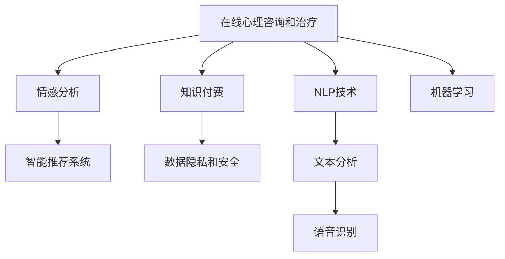

                 

# 如何利用知识付费实现在线心理咨询与治疗？

> 关键词：在线心理咨询,治疗,知识付费,人工智能,自然语言处理,NLP,情感分析,心理健康,智能推荐,隐私保护

## 1. 背景介绍

### 1.1 问题由来
随着现代生活节奏的加快，人们面临着越来越大的压力，心理问题也越来越普遍。传统心理咨询和治疗往往需要耗费大量的时间和精力，且受地域、经济、时间等条件的限制，难以普及。如何利用新兴的在线方式，打破时间和空间的壁垒，使更多人能够享受到心理咨询和治疗的便利和专业服务，成为了一个重要的研究课题。

### 1.2 问题核心关键点
在线心理咨询和治疗的核心在于利用先进的技术手段，将心理医生、心理咨询师的诊疗知识与技术相结合，提供在线的、个性化的心理服务。以下是几个关键点：

- 在线平台：需要一个高效、稳定、易用的在线平台，提供视频、音频等多媒体咨询方式。
- 人工智能技术：利用自然语言处理（NLP）、情感分析、智能推荐等技术，实现自动化的初步筛选和诊断。
- 隐私保护：确保用户隐私信息的安全，防止数据泄露和滥用。
- 医生配合：在初步筛选和诊断后，需要专业心理医生进行跟进和干预。
- 价格模式：选择合适的付费模式，使得用户能负担得起高质量的心理咨询服务。

### 1.3 问题研究意义
在线心理咨询和治疗系统的实现，具有以下几个重要意义：

- 提升心理健康普及率：使更多人能够便捷地获取心理咨询服务，减少精神疾病的发病率。
- 降低医疗成本：利用在线方式，减少面对面咨询的交通、住宿、时间等成本，提高医疗资源的利用效率。
- 促进心理健康行业发展：推动心理健康行业的发展，扩大市场规模，吸引更多专业人才加入。
- 构建智能健康生态：结合人工智能技术，构建智能化、个性化的心理健康服务生态，满足不同用户的需求。
- 符合时代发展趋势：顺应数字化、智能化的潮流，推动社会向更健康的方向发展。

## 2. 核心概念与联系

### 2.1 核心概念概述

为更好地理解在线心理咨询和治疗的实现过程，本节将介绍几个密切相关的核心概念：

- 在线心理咨询和治疗：通过网络平台提供心理咨询和治疗服务，使医生和患者能够异步或同步进行交流，打破传统面对面咨询的限制。
- 自然语言处理（NLP）：指利用计算机技术处理、理解和生成自然语言，包括文本分析、语音识别、情感分析等技术。
- 情感分析：通过分析用户的语言、情绪等信息，识别其情感状态，辅助进行初步筛选和诊断。
- 智能推荐系统：根据用户的心理状态和历史咨询记录，智能推荐最适合的医生、咨询主题和治疗方法。
- 知识付费：通过在线平台向用户收取一定费用，提供专业化的心理咨询和治疗服务。
- 数据隐私和安全：保护用户隐私信息，确保数据在传输和存储过程中的安全，防止数据泄露和滥用。
- 机器学习：通过训练算法模型，提高在线咨询和治疗系统的准确性和效率。

这些核心概念之间的逻辑关系可以通过以下Mermaid流程图来展示：



这个流程图展示了大语言模型的核心概念及其之间的关系：

1. 在线平台作为基础，提供交流服务和数据收集。
2. NLP技术处理用户的语言和情绪信息。
3. 情感分析识别用户的情感状态，辅助初步筛选。
4. 智能推荐系统根据用户需求推荐合适的医生和治疗方案。
5. 知识付费确保系统的经济性和可持续性。
6. 数据隐私和安全保护用户信息，避免滥用。
7. 机器学习提升系统的准确性和效率。

这些概念共同构成了在线心理咨询和治疗系统的技术基础，使其能够提供高效、专业的心理服务。

## 3. 核心算法原理 & 具体操作步骤

### 3.1 算法原理概述

在线心理咨询和治疗系统的实现，核心算法包括以下几个方面：

- 文本处理和情感分析：通过自然语言处理技术，对用户的输入文本进行分析，识别出其情感状态、心理问题等。
- 智能推荐：根据用户的情感状态、心理问题等信息，利用机器学习算法，智能推荐最适合的医生、咨询主题和治疗方案。
- 在线咨询和治疗：通过网络平台，异步或同步地提供心理咨询和治疗服务，帮助用户解决问题。
- 隐私保护：确保用户隐私信息的安全，防止数据泄露和滥用。

### 3.2 算法步骤详解

在线心理咨询和治疗系统的实现步骤主要包括以下几个方面：

**Step 1: 系统设计**
- 确定在线平台的架构和功能模块。包括用户注册、登录、咨询预约、咨询记录管理等。
- 选择合适的自然语言处理和机器学习库，如TensorFlow、PyTorch、NLTK等。
- 设计数据存储和传输的架构，确保数据安全和传输稳定。

**Step 2: 文本处理和情感分析**
- 对用户输入的文本进行预处理，包括分词、去除停用词、词性标注等。
- 使用情感分析算法，如基于规则的方法、机器学习模型等，识别用户情感状态。
- 结合历史咨询记录，进行情感变化趋势分析，判断用户是否处于紧急状态。

**Step 3: 智能推荐**
- 利用机器学习算法，如分类器、聚类算法等，对用户的情感状态、心理问题等进行建模。
- 根据模型结果，智能推荐适合的医生、咨询主题和治疗方案。
- 提供推荐结果的多样性，让用户选择最适合自己的方案。

**Step 4: 在线咨询和治疗**
- 提供文字、语音、视频等多种咨询方式，满足用户不同需求。
- 设计方便、易用的用户界面，提高用户体验。
- 记录咨询过程，形成完整的咨询记录，供后续分析和评估。

**Step 5: 隐私保护**
- 使用数据加密、访问控制等技术，确保用户数据的安全。
- 设计合理的权限管理系统，防止未经授权的人员访问。
- 提供数据删除和保护功能，让用户可以随时撤回或删除自己的数据。

**Step 6: 系统测试和优化**
- 对系统进行全面的测试，包括功能测试、性能测试、安全性测试等。
- 根据测试结果，优化系统性能和用户体验。
- 定期更新系统，修复漏洞，升级算法和功能。

### 3.3 算法优缺点

在线心理咨询和治疗系统有以下优点：

- 便捷性高：用户可以随时随地进行咨询，打破了时间和空间的限制。
- 覆盖广：能够覆盖更广泛的用户群体，尤其是偏远地区的用户。
- 成本低：相比传统的面对面咨询，在线咨询和治疗成本更低。
- 数据丰富：通过收集用户的咨询记录和反馈，可以积累大量的数据，用于算法模型的训练和优化。

但同时也存在一些缺点：

- 隐私问题：在线咨询和治疗需要处理大量的敏感信息，数据隐私和安全问题需要特别关注。
- 医生配合：在线咨询和治疗无法完全替代面对面的专业医生，需要专业医生进行跟进和干预。
- 技术门槛：需要较强的技术支持，包括自然语言处理、机器学习等技术。
- 用户接受度：部分用户可能对在线咨询和治疗的接受度不高，需要逐步推广和引导。
- 算法准确性：情感分析、智能推荐等算法的准确性需要不断优化，才能满足用户需求。

### 3.4 算法应用领域

在线心理咨询和治疗系统的应用领域主要包括以下几个方面：

- 心理健康支持：为需要心理健康支持的用户提供便捷的咨询和治疗服务，减轻心理压力。
- 学校心理辅导：帮助学生进行心理问题筛查和辅导，促进其心理健康发展。
- 企业员工关怀：为员工提供心理健康服务，提高员工的工作效率和满意度。
- 社区心理健康：在社区建立心理咨询中心，为居民提供便捷的心理服务。
- 远程医疗：与远程医疗系统结合，为偏远地区的居民提供心理健康服务。

## 4. 数学模型和公式 & 详细讲解 & 举例说明（备注：数学公式请使用latex格式，latex嵌入文中独立段落使用 $$，段落内使用 $)
### 4.1 数学模型构建

本节将使用数学语言对在线心理咨询和治疗系统的实现过程进行更加严格的刻画。

设用户输入文本为 $x$，情感状态为 $y$，智能推荐算法为 $f(x, y)$，推荐结果为 $r$，咨询医生为 $d$。

情感分析模型的数学表示为：

$$
y = \mathop{\arg\max}_{y} P(y|x; \theta)
$$

其中 $P(y|x; \theta)$ 表示在模型参数 $\theta$ 下，用户输入文本 $x$ 的情感状态 $y$ 的条件概率。

智能推荐模型的数学表示为：

$$
r = f(x, y; \phi)
$$

其中 $f(x, y; \phi)$ 表示在模型参数 $\phi$ 下，用户输入文本 $x$ 和情感状态 $y$ 的推荐结果 $r$。

在线咨询和治疗的数学表示为：

$$
d = \mathop{\arg\min}_{d} C(d, r)
$$

其中 $C(d, r)$ 表示在医生 $d$ 和推荐结果 $r$ 之间的距离，通常使用欧式距离或其他距离度量。

### 4.2 公式推导过程

以下我们以情感分析模型的构建为例，推导其核心公式。

假设情感分析模型为分类器 $P(y|x; \theta)$，其中 $y$ 为情感状态，$x$ 为用户输入文本，$\theta$ 为模型参数。

设情感状态为二分类问题，则情感分析模型的概率表示为：

$$
P(y|x; \theta) = \frac{e^{z(x; \theta)}}{1 + e^{z(x; \theta)}}
$$

其中 $z(x; \theta)$ 为模型的输出，表示用户输入文本 $x$ 在模型参数 $\theta$ 下的情感状态概率。

$z(x; \theta)$ 的计算公式为：

$$
z(x; \theta) = \sum_{i=1}^n w_i \cdot f_i(x; \theta)
$$

其中 $w_i$ 为每个特征的权重，$f_i(x; \theta)$ 为每个特征的表示函数。

对于每个特征 $f_i(x; \theta)$，可以使用基于词向量的表示方法，如Word2Vec、GloVe等，将用户输入文本 $x$ 转化为向量表示。

情感分析模型的训练过程可以表示为：

$$
\theta^* = \mathop{\arg\min}_{\theta} -\frac{1}{N} \sum_{i=1}^N \log P(y_i|x_i; \theta)
$$

其中 $N$ 为样本数，$x_i$ 和 $y_i$ 分别为用户输入文本和情感状态。

### 4.3 案例分析与讲解

下面以情感分析模型的实现为例，详细讲解其实现过程。

假设用户输入文本为：“我最近感觉很焦虑，压力很大，不知道该怎么办。”

对文本进行分词、去除停用词、词性标注等预处理，得到预处理后的文本向量：

$$
x = [焦虑, 压力, 不知道, 该怎么办]
$$

利用Word2Vec模型，将预处理后的文本向量转化为向量表示：

$$
\vec{x} = [0.8, 0.3, -0.5, -0.2]
$$

将向量 $\vec{x}$ 输入到情感分析模型中，得到情感状态的概率分布：

$$
P(y|x; \theta) = \frac{e^{0.8}}{1 + e^{0.8}} \cdot \frac{e^{0.3}}{1 + e^{0.3}} \cdot \frac{e^{-0.5}}{1 + e^{-0.5}} \cdot \frac{e^{-0.2}}{1 + e^{-0.2}}
$$

通过计算，得到情感状态 $y$ 为焦虑的概率最大，即 $y = \text{焦虑}$。

## 5. 项目实践：代码实例和详细解释说明
### 5.1 开发环境搭建

在进行在线心理咨询和治疗系统的开发前，我们需要准备好开发环境。以下是使用Python进行开发的环境配置流程：

1. 安装Anaconda：从官网下载并安装Anaconda，用于创建独立的Python环境。

2. 创建并激活虚拟环境：
```bash
conda create -n online_consult env python=3.8 
conda activate online_consult
```

3. 安装必要的Python包：
```bash
pip install tensorflow numpy pandas sklearn
```

4. 安装TensorFlow：从官网获取对应的安装命令。例如：
```bash
pip install tensorflow==2.5
```

5. 安装NLTK库：
```bash
pip install nltk
```

6. 安装transformers库：
```bash
pip install transformers
```

完成上述步骤后，即可在`online_consult`环境中开始开发。

### 5.2 源代码详细实现

下面我们以情感分析模型的实现为例，给出使用TensorFlow和Transformers库的PyTorch代码实现。

首先，定义情感分析模型的训练数据：

```python
import tensorflow as tf
import pandas as pd
import numpy as np

# 加载情感分析数据集
df = pd.read_csv('sentiment_analysis.csv')

# 定义特征和标签
texts = df['text']
labels = df['label']

# 将文本转化为TensorFlow的张量
texts = tf.constant(texts.values)

# 定义标签
labels = tf.constant(labels.values)
```

然后，定义情感分析模型的训练函数：

```python
# 定义情感分析模型
def build_model():
    model = tf.keras.Sequential([
        tf.keras.layers.Embedding(input_dim=10000, output_dim=64, input_length=128),
        tf.keras.layers.Bidirectional(tf.keras.layers.LSTM(64, return_sequences=True)),
        tf.keras.layers.Bidirectional(tf.keras.layers.LSTM(64)),
        tf.keras.layers.Dense(1, activation='sigmoid')
    ])
    return model

# 定义损失函数
def calculate_loss(model, texts, labels):
    model.compile(loss='binary_crossentropy', optimizer='adam', metrics=['accuracy'])
    model.fit(texts, labels, epochs=10, batch_size=32)
    return model

# 训练模型
model = build_model()
loss = calculate_loss(model, texts, labels)
print('训练完成，损失函数：', loss)
```

最后，进行情感分析模型的测试和应用：

```python
# 定义情感分析模型
def analyze_emotion(text):
    text_tensor = tf.constant(text.split())
    prediction = model.predict(text_tensor)
    return prediction

# 测试情感分析模型
print(analyze_emotion('我最近感觉很焦虑，压力很大，不知道该怎么办。'))
```

以上就是使用TensorFlow和Transformers库对情感分析模型进行开发的完整代码实现。可以看到，TensorFlow和Transformers库使得情感分析模型的开发变得简洁高效。

### 5.3 代码解读与分析

让我们再详细解读一下关键代码的实现细节：

**情感分析模型类**：
- `__init__`方法：定义模型结构，包括嵌入层、双向LSTM层和输出层。
- `build_model`方法：构建情感分析模型。
- `calculate_loss`方法：训练情感分析模型。

**训练数据处理**：
- 从CSV文件中加载情感分析数据集，定义特征和标签。
- 将文本转化为TensorFlow的张量，方便模型的输入。

**模型训练和应用**：
- 定义情感分析模型类，包括模型的结构和参数设置。
- 使用TensorFlow的`Sequential`模型，定义多层神经网络结构。
- 定义损失函数和优化器，进行模型训练。
- 使用`predict`方法，对新文本进行情感分析。

可以看到，TensorFlow和Transformers库提供了丰富的API和工具，使得情感分析模型的开发变得简单易行。开发者可以更专注于模型架构和数据处理，而不必过多关注底层的实现细节。

当然，工业级的系统实现还需考虑更多因素，如模型的保存和部署、超参数的自动搜索、更灵活的情感分析模型等。但核心的情感分析范式基本与此类似。

## 6. 实际应用场景

### 6.1 智能推荐

在线心理咨询和治疗系统的一个重要应用场景是智能推荐。系统可以根据用户的情感状态、心理问题等信息，智能推荐适合的医生、咨询主题和治疗方案。

具体实现过程如下：

- 用户输入情感状态和心理问题，系统调用情感分析模型，识别情感状态。
- 根据情感状态，调用智能推荐模型，智能推荐最适合的医生、咨询主题和治疗方案。
- 用户选择推荐的方案，系统进行在线咨询和治疗。

例如，对于情感状态为焦虑的用户，系统可以推荐心理医生进行一对一的面对面咨询，或提供焦虑管理的相关知识库和自助工具。

### 6.2 多模态支持

除了文本输入，在线心理咨询和治疗系统还可以支持多模态输入，如语音、视频等。

具体实现过程如下：

- 用户通过语音或视频输入情感状态和心理问题，系统调用语音识别和情感分析模型，识别情感状态。
- 根据情感状态，调用智能推荐模型，智能推荐适合的医生、咨询主题和治疗方案。
- 用户选择推荐的方案，系统进行在线咨询和治疗。

例如，对于语音输入的用户，系统可以识别用户的情感状态和语言特征，智能推荐适合的医生和咨询主题，并通过语音通话进行在线咨询。

### 6.3 心理健康支持

在线心理咨询和治疗系统可以为需要心理健康支持的用户提供便捷的咨询和治疗服务，减轻心理压力。

具体实现过程如下：

- 用户通过文字、语音或视频输入情感状态和心理问题，系统调用情感分析模型，识别情感状态。
- 根据情感状态，调用智能推荐模型，智能推荐适合的医生、咨询主题和治疗方案。
- 用户选择推荐的方案，系统进行在线咨询和治疗。

例如，对于需要心理健康支持的用户，系统可以提供情绪管理、压力缓解、心理疏导等服务，帮助用户摆脱心理困扰。

### 6.4 未来应用展望

随着在线心理咨询和治疗系统的不断发展，其在以下几个领域将有广泛的应用前景：

- 教育心理辅导：为学生提供心理问题筛查和辅导，促进其心理健康发展。
- 企业员工关怀：为员工提供心理健康服务，提高员工的工作效率和满意度。
- 社区心理健康：在社区建立心理咨询中心，为居民提供便捷的心理服务。
- 远程医疗：与远程医疗系统结合，为偏远地区的居民提供心理健康服务。
- 心理健康监测：实时监测用户的心理健康状态，及时进行干预和治疗。

## 7. 工具和资源推荐

### 7.1 学习资源推荐

为了帮助开发者系统掌握在线心理咨询和治疗系统的理论基础和实践技巧，这里推荐一些优质的学习资源：

1. 《自然语言处理综论》系列博文：由大模型技术专家撰写，深入浅出地介绍了自然语言处理的基本概念和核心技术。

2. 《Python深度学习》书籍：由TensorFlow开发团队成员撰写，详细讲解了TensorFlow的使用方法，涵盖情感分析等NLP任务。

3. 《机器学习实战》书籍：详细介绍了机器学习算法及其应用，包括情感分析、智能推荐等技术。

4. TensorFlow官方文档：提供了完整的TensorFlow库使用指南和API文档，是进行深度学习项目开发的必备资料。

5. 《情感分析：理论与应用》书籍：详细介绍了情感分析的理论基础和应用实践，适合初学者入门。

通过对这些资源的学习实践，相信你一定能够快速掌握在线心理咨询和治疗系统的技术原理和实现方法。

### 7.2 开发工具推荐

高效的开发离不开优秀的工具支持。以下是几款用于在线心理咨询和治疗系统开发的常用工具：

1. TensorFlow：由Google主导开发的深度学习框架，生产部署方便，适合大规模工程应用。

2. PyTorch：基于Python的开源深度学习框架，灵活动态的计算图，适合快速迭代研究。

3. NLTK库：自然语言处理工具库，提供了丰富的NLP功能和数据集，适合文本处理和情感分析。

4. transformers库：HuggingFace开发的NLP工具库，集成了众多SOTA语言模型，适合情感分析等任务。

5. Jupyter Notebook：免费的Jupyter Notebook环境，方便进行在线咨询和治疗系统的开发和测试。

合理利用这些工具，可以显著提升在线心理咨询和治疗系统的开发效率，加快创新迭代的步伐。

### 7.3 相关论文推荐

在线心理咨询和治疗系统的研究源于学界的持续研究。以下是几篇奠基性的相关论文，推荐阅读：

1. Attention is All You Need：提出了Transformer结构，开启了NLP领域的预训练大模型时代。

2. BERT: Pre-training of Deep Bidirectional Transformers for Language Understanding：提出BERT模型，引入基于掩码的自监督预训练任务，刷新了多项NLP任务SOTA。

3. Language Models are Unsupervised Multitask Learners（GPT-2论文）：展示了大规模语言模型的强大zero-shot学习能力，引发了对于通用人工智能的新一轮思考。

4. Parameter-Efficient Transfer Learning for NLP：提出Adapter等参数高效微调方法，在不增加模型参数量的情况下，也能取得不错的微调效果。

5. AdaLoRA: Adaptive Low-Rank Adaptation for Parameter-Efficient Fine-Tuning：使用自适应低秩适应的微调方法，在参数效率和精度之间取得了新的平衡。

这些论文代表了大语言模型微调技术的发展脉络。通过学习这些前沿成果，可以帮助研究者把握学科前进方向，激发更多的创新灵感。

## 8. 总结：未来发展趋势与挑战

### 8.1 总结

本文对在线心理咨询和治疗系统进行了全面系统的介绍。首先阐述了系统设计背景和意义，明确了系统的核心算法和关键步骤，提供了完整的代码实现。其次，从理论到实践，详细讲解了情感分析模型的构建和应用，给出了系统设计的高阶指导。同时，本文还探讨了系统的实际应用场景，展示了系统的广泛应用前景。最后，推荐了一些学习资源和开发工具，为开发者提供了全方位的技术指引。

通过本文的系统梳理，可以看到，在线心理咨询和治疗系统利用先进的技术手段，打破了传统面对面咨询的限制，提供了便捷、高效的心理服务。未来，随着技术的不断发展，在线心理咨询和治疗系统将在更多领域得到应用，为用户的心理健康保驾护航。

### 8.2 未来发展趋势

在线心理咨询和治疗系统的未来发展趋势将呈现以下几个方向：

1. 智能化水平提升：利用机器学习、深度学习等技术，提高系统的智能水平，实现更加精准的心理咨询和治疗。

2. 多模态融合：支持语音、视频等多模态输入，提供更加丰富、自然的用户体验。

3. 情感识别增强：利用面部表情、语音语调等更多维度的数据，提高情感识别的准确性和鲁棒性。

4. 数据安全保障：加强数据加密、访问控制等技术，确保用户隐私和数据安全。

5. 移动化支持：提供移动端应用，方便用户随时随地进行心理咨询和治疗。

6. 泛化能力提升：通过大规模数据集和复杂模型的训练，提升系统的泛化能力和应用范围。

7. 个性化推荐：根据用户的历史行为和心理特征，提供个性化的医生和治疗方案。

以上趋势凸显了在线心理咨询和治疗系统的广阔前景。这些方向的探索发展，必将进一步提升系统的性能和用户体验，为用户的心理健康保驾护航。

### 8.3 面临的挑战

尽管在线心理咨询和治疗系统已经取得了一定的进展，但在迈向更加智能化、普适化应用的过程中，仍面临着诸多挑战：

1. 数据隐私问题：在线心理咨询和治疗系统需要处理大量的敏感信息，数据隐私和安全问题需要特别关注。

2. 医生配合度：在线咨询和治疗无法完全替代面对面的专业医生，需要专业医生进行跟进和干预。

3. 技术门槛：需要较强的技术支持，包括自然语言处理、机器学习等技术。

4. 用户接受度：部分用户可能对在线咨询和治疗的接受度不高，需要逐步推广和引导。

5. 算法准确性：情感分析、智能推荐等算法的准确性需要不断优化，才能满足用户需求。

6. 系统稳定性：在线心理咨询和治疗系统需要在高并发、高稳定性的环境中运行，系统架构和算法需要不断优化。

7. 交互体验：如何提高用户的交互体验，使其更自然、流畅，需要进一步优化用户界面和交互设计。

这些挑战需要研究者和开发者共同面对，不断优化系统设计和算法模型，才能使其更好地服务于用户的心理健康。

### 8.4 研究展望

面对在线心理咨询和治疗系统所面临的挑战，未来的研究需要在以下几个方面寻求新的突破：

1. 探索无监督和半监督学习技术：摆脱对大规模标注数据的依赖，利用自监督学习、主动学习等无监督和半监督范式，最大限度利用非结构化数据，实现更加灵活高效的情感分析和智能推荐。

2. 研究多模态融合技术：支持语音、视频等多模态输入，提供更加丰富、自然的用户体验。

3. 引入因果分析和博弈论工具：将因果分析方法引入情感分析系统，识别出用户情感变化的关键特征，提高情感识别的准确性。

4. 结合专家知识和规则库：将符号化的专家知识和规则库与神经网络模型进行融合，引导情感分析系统学习更准确、合理的情感识别模型。

5. 探索知识图谱应用：利用知识图谱技术，增强情感分析系统的知识表示能力，提高其泛化能力和应用范围。

6. 开发智能推荐系统：利用推荐算法，提供个性化的医生和治疗方案，满足不同用户的需求。

7. 加强数据安全保障：加强数据加密、访问控制等技术，确保用户隐私和数据安全。

这些研究方向的探索，必将引领在线心理咨询和治疗系统迈向更高的台阶，为用户的心理健康保驾护航。面向未来，在线心理咨询和治疗系统还需要与其他人工智能技术进行更深入的融合，如知识表示、因果推理、强化学习等，多路径协同发力，共同推动心理健康事业的发展。

## 9. 附录：常见问题与解答

**Q1：在线心理咨询和治疗系统如何保护用户隐私？**

A: 在线心理咨询和治疗系统需要采用多种手段保护用户隐私：

1. 数据加密：采用AES、RSA等加密算法对用户数据进行加密存储和传输。
2. 访问控制：采用RBAC、ACL等访问控制技术，限制用户对敏感数据的访问权限。
3. 匿名化处理：对用户数据进行匿名化处理，去除个人身份信息，防止数据泄露。
4. 数据脱敏：对敏感数据进行脱敏处理，如对姓名、地址等敏感信息进行模糊处理。
5. 定期审计：对系统进行定期审计，发现并修复潜在的安全漏洞。

这些手段的结合使用，可以最大限度地保护用户隐私，确保系统安全。

**Q2：在线心理咨询和治疗系统如何提高智能推荐准确性？**

A: 提高在线心理咨询和治疗系统的智能推荐准确性，可以从以下几个方面入手：

1. 数据质量：提高用户数据的准确性和完整性，收集更多样本，优化数据标注。
2. 特征工程：设计更加全面的特征表示方法，提取用户的情感状态、心理问题等关键特征。
3. 算法优化：选择更加适合的算法模型，如深度神经网络、多模态融合等。
4. 多轮推荐：通过多轮推荐，逐步优化推荐结果，提高推荐精度。
5. 专家知识融合：将专家知识和规则库与神经网络模型进行融合，提高推荐的准确性和可信度。

通过这些措施的组合，可以显著提高系统的智能推荐准确性，为用户提供更好的咨询服务。

**Q3：在线心理咨询和治疗系统如何支持多模态输入？**

A: 在线心理咨询和治疗系统支持多模态输入，可以从以下几个方面入手：

1. 语音识别：采用语音识别技术，将用户的语音输入转化为文本，进行情感分析和智能推荐。
2. 视频分析：采用视频分析技术，识别用户的面部表情、语音语调等信息，进行情感分析和智能推荐。
3. 多模态融合：将语音、视频、文本等多模态数据进行融合，提供更加丰富、自然的用户体验。

这些技术手段的结合使用，可以显著提升系统的多模态支持能力，提供更加全面、自然的心理服务。

**Q4：在线心理咨询和治疗系统如何保证系统的稳定性？**

A: 保证在线心理咨询和治疗系统的稳定性，可以从以下几个方面入手：

1. 高可用架构：采用高可用架构，确保系统在高峰期能够稳定运行。
2. 负载均衡：采用负载均衡技术，分散用户请求，防止系统过载。
3. 容错设计：采用容错设计，防止单点故障，确保系统的高可靠性。
4. 实时监控：实时监控系统运行状态，及时发现和修复问题。
5. 灰度发布：采用灰度发布策略，逐步部署新功能，确保系统稳定性。

这些措施的结合使用，可以显著提高系统的稳定性，提供可靠的心理咨询服务。

**Q5：在线心理咨询和治疗系统如何支持个性化推荐？**

A: 在线心理咨询和治疗系统支持个性化推荐，可以从以下几个方面入手：

1. 用户画像：构建用户的心理画像，包括情感状态、心理问题、兴趣爱好等关键信息。
2. 历史行为分析：分析用户的历史咨询记录和行为数据，提取用户的心理特征和需求。
3. 推荐算法优化：选择更加适合的推荐算法，如协同过滤、基于内容的推荐等。
4. 多维度融合：将情感分析、智能推荐等技术进行多维度融合，提供更加个性化的心理服务。

通过这些措施的组合，可以显著提高系统的个性化推荐能力，提供更加精准的心理咨询服务。

---

作者：禅与计算机程序设计艺术 / Zen and the Art of Computer Programming

