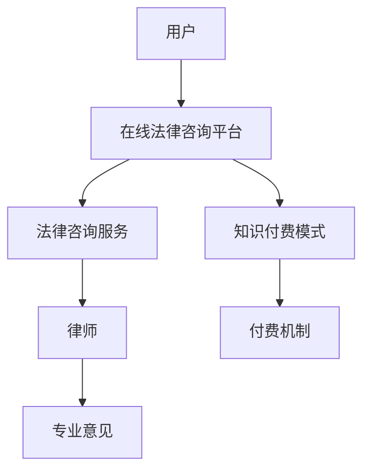

                 

# 如何利用知识付费实现在线法律咨询与服务？

## 1. 背景介绍

随着互联网的快速发展，人们的生活与工作方式发生了翻天覆地的变化。信息获取与传播变得更加便捷，但随之而来的是法律知识的普及与理解变得更加困难。随着社会法律意识的增强，越来越多的人开始需要法律咨询与服务的帮助，尤其是面对复杂法律问题时。传统法律咨询服务的昂贵和高门槛让许多普通民众望而却步，但互联网的发展为法律服务打开了一条新的道路——知识付费。

知识付费模式通过收取一定的费用，为用户提供高质量的定制化法律咨询与服务，打破了传统法律服务的壁垒，使得法律服务变得更加透明、高效、普惠。在线法律咨询服务平台成为连接法律专业人士与普通用户的新型媒介，将法律知识普及与实用化，同时为法律专业人士开辟了新的收入渠道。

本文旨在探讨如何利用知识付费模式实现在线法律咨询与服务，并从技术实现角度对平台搭建、服务提供、用户体验等关键环节进行深入解析。

## 2. 核心概念与联系

### 2.1 核心概念概述

#### 2.1.1 知识付费
知识付费指的是用户为获得专业知识和信息而支付费用的模式。在互联网时代，知识付费不仅降低了获取信息的成本，也提升了信息质量，对教育、文化、科技等行业产生了深远影响。

#### 2.1.2 在线法律咨询
在线法律咨询是指通过互联网平台，用户可以在线向法律专业人士提出法律问题，获取定制化的法律解答与建议。平台集成聊天、电话、视频等多种交流方式，提高服务效率和用户满意度。

#### 2.1.3 服务提供商
服务提供商是指提供在线法律咨询服务的机构或个人。他们通常具有法律资格证书与丰富的工作经验，能提供专业的法律意见与解决方案。

### 2.2 核心概念原理和架构的 Mermaid 流程图



## 3. 核心算法原理 & 具体操作步骤

### 3.1 算法原理概述

在线法律咨询服务的核心算法原理基于知识付费模式，用户为获取专业法律咨询而支付费用，服务提供商提供高质量的定制化服务。平台通过匹配算法，将用户问题与法律专业人士进行高效对接，并利用在线技术，实现实时交流与互动。

### 3.2 算法步骤详解

#### 3.2.1 用户注册与认证
用户需要在线注册并完成实名认证，以保证信息真实性。注册过程中需收集用户的身份信息、联系方式等，用于验证用户身份，防止欺诈行为。

#### 3.2.2 问题描述与分类
用户在平台提出法律问题，需详细描述问题背景、诉求、相关证据材料等，以便服务提供商能够准确理解问题并给出专业解答。平台需具备自动分类功能，将用户问题分类到相应的法律领域，如婚姻法、合同法、知识产权法等。

#### 3.2.3 匹配与选择
平台利用匹配算法，将用户问题与合适的法律专业人士进行匹配。匹配过程需考虑专业人士的经验、专业领域、用户评价等多方面因素。用户可以查看专业人士的背景信息，进行选择。

#### 3.2.4 在线交流与解答
用户与服务专业人士进行在线交流，交流方式包括文字聊天、电话咨询、视频会议等。服务提供商需提供专业的法律咨询意见，并给出解决方案。平台需保证交流过程的安全性与隐私性。

#### 3.2.5 评价与反馈
用户对服务质量进行评价与反馈，平台根据评价结果调整匹配算法，优化服务质量。服务提供商需对评价结果进行回应，提升服务水平。

### 3.3 算法优缺点

#### 3.3.1 优点
1. 高效便捷：在线法律咨询服务突破了传统法律咨询的地理限制，用户可随时获取法律咨询，方便快捷。
2. 个性化定制：平台可根据用户需求，推荐合适的法律专业人士，提供个性化的法律咨询服务。
3. 普惠性强：知识付费模式降低了法律服务的门槛，使得法律服务变得更加普及，普惠性强。

#### 3.3.2 缺点
1. 信任问题：用户对在线平台与专业人士的信任度存在不确定性，可能影响服务效果。
2. 法律质量：平台需保证服务质量，否则可能给用户带来不良法律后果。
3. 费用问题：知识付费模式使得法律服务的成本较高，可能存在用户负担过重的问题。

### 3.4 算法应用领域

在线法律咨询与知识付费模式在多个领域有广泛应用，包括但不限于：

- 婚姻家庭法律咨询
- 劳动法与雇佣法律咨询
- 企业法律咨询
- 知识产权法律咨询
- 民事诉讼法律咨询

## 4. 数学模型和公式 & 详细讲解 & 举例说明

### 4.1 数学模型构建

在线法律咨询服务的核心是匹配算法，用于将用户问题与合适的专业人士进行高效匹配。假设用户问题为 $Q$，法律专业人士为 $L$，用户选择的专业人士为 $C$，匹配算法的目标是最大化 $Q$ 与 $L$ 的相似度，即：

$$
\max_{C} \text{Sim(Q, L_C)}
$$

其中 $\text{Sim}$ 为相似度函数，$L_C$ 表示专业人士 $L$ 对应的某个咨询服务。

### 4.2 公式推导过程

在具体实现中，相似度函数 $\text{Sim}$ 可以采用余弦相似度、Jaccard相似度等多种方式。以下以余弦相似度为例，进行公式推导。

设用户问题 $Q$ 与专业人士 $L$ 的服务描述文本为 $q$ 和 $l$，长度分别为 $n_q$ 和 $n_l$，向量表示为 $\vec{q}$ 和 $\vec{l}$。余弦相似度公式为：

$$
\text{Sim}(Q, L) = \cos(\theta) = \frac{\vec{q} \cdot \vec{l}}{\|\vec{q}\| \cdot \|\vec{l}\|}
$$

其中 $\cdot$ 表示向量点乘，$\|\cdot\|$ 表示向量的范数。

将公式应用到匹配算法中，可以得到：

$$
\max_{C} \frac{\vec{q} \cdot \vec{l_C}}{\|\vec{q}\| \cdot \|\vec{l_C}\|}
$$

目标在于找到使上述公式最大化的 $C$。

### 4.3 案例分析与讲解

假设用户问题为：“我已经结婚三年，发现丈夫有外遇，应该如何处理？”，专业人士服务描述为：“专门处理婚姻家庭问题，擅长起草离婚协议书。”，问题文本为 $q$，服务描述文本为 $l$。

利用余弦相似度公式，可以计算出 $q$ 与 $L$ 中每个服务的相似度，选取相似度最大的服务作为推荐。

例如，假设 $q$ 与 $l$ 的向量表示如下：

$$
\vec{q} = (1, 1, 0, 0, 0, 0, 0, 1, 0, 1)
$$

$$
\vec{l_1} = (0, 1, 0, 1, 0, 0, 0, 0, 1, 0)
$$

$$
\vec{l_2} = (0, 0, 1, 0, 1, 0, 0, 0, 0, 0)
$$

其中 $1$ 表示文本中存在该关键词，$0$ 表示不存在。

计算得到：

$$
\text{Sim}(q, l_1) = \frac{1 \cdot 1 + 1 \cdot 0 + 0 \cdot 0 + 0 \cdot 0 + 0 \cdot 1 + 0 \cdot 0 + 0 \cdot 0 + 0 \cdot 0 + 0 \cdot 1 + 0 \cdot 0}{\sqrt{6} \cdot \sqrt{4}} = \frac{1}{2\sqrt{3}}
$$

$$
\text{Sim}(q, l_2) = \frac{1 \cdot 0 + 1 \cdot 0 + 0 \cdot 1 + 0 \cdot 0 + 0 \cdot 0 + 0 \cdot 0 + 0 \cdot 0 + 0 \cdot 0 + 0 \cdot 1 + 0 \cdot 0}{\sqrt{5} \cdot \sqrt{5}} = 0
$$

因此，推荐专业人士为 $L_1$。

## 5. 项目实践：代码实例和详细解释说明

### 5.1 开发环境搭建

#### 5.1.1 服务器环境
平台搭建在云服务器上，需具备高可用性、高扩展性、高安全性。推荐使用 AWS、阿里云、腾讯云等云服务提供商。

#### 5.1.2 数据库
选择关系型数据库（如 MySQL、PostgreSQL）或 NoSQL 数据库（如 MongoDB、Redis），用于存储用户数据、服务数据、匹配数据等。

#### 5.1.3 中间件
采用 Redis、RabbitMQ 等消息队列中间件，用于实现在线聊天、视频会议等功能。

#### 5.1.4 前端框架
选择 React、Vue 等前端框架，实现平台界面，提供良好的用户体验。

#### 5.1.5 后端框架
选择 Node.js、Django 等后端框架，实现服务接口与逻辑处理。

### 5.2 源代码详细实现

#### 5.2.1 用户注册与认证
用户注册与认证需使用第三方认证服务，如微信认证、手机号认证等。代码实现如下：

```python
from flask import Flask, request
from flask_login import LoginManager, login_user, logout_user, login_required
from user import User

app = Flask(__name__)
app.config['SECRET_KEY'] = 'secret_key'
login_manager = LoginManager()
login_manager.init_app(app)

@app.route('/register', methods=['POST'])
def register():
    data = request.json
    username = data['username']
    password = data['password']
    email = data['email']
    user = User(username=username, password=password, email=email)
    user.save()
    login_user(user)
    return 'User registered successfully.'

@app.route('/logout', methods=['POST'])
@login_required
def logout():
    logout_user()
    return 'User logged out.'

@login_manager.user_loader
def load_user(user_id):
    return User.objects.get(id=user_id)
```

#### 5.2.2 问题描述与分类
平台需提供问题描述界面，用户需详细描述问题背景、诉求、证据材料等。代码实现如下：

```python
from flask import Flask, request, render_template
from question import Question

app = Flask(__name__)

@app.route('/question/<int:id>', methods=['GET', 'POST'])
@login_required
def question(id):
    question = Question.objects.get(id=id)
    if request.method == 'POST':
        data = request.form
        content = data['content']
        question.content = content
        question.save()
    return render_template('question.html', question=question)
```

#### 5.2.3 匹配与选择
平台需提供匹配算法，将用户问题与合适的法律专业人士进行匹配。代码实现如下：

```python
from sklearn.metrics.pairwise import cosine_similarity

def match(question, professionals):
    scores = []
    for l in professionals:
        score = cosine_similarity(question.content, l.content)
        scores.append(score)
    return professionals[np.argmax(scores)]
```

#### 5.2.4 在线交流与解答
平台需提供在线交流界面，用户与服务专业人士进行交流。代码实现如下：

```python
from flask import Flask, request, render_template

app = Flask(__name__)

@app.route('/chat/<int:id>', methods=['GET', 'POST'])
@login_required
def chat(id):
    professional = Professional.objects.get(id=id)
    if request.method == 'POST':
        data = request.form
        message = data['message']
        professional.chat.append(message)
        professional.save()
    return render_template('chat.html', professional=professional)
```

### 5.3 代码解读与分析

#### 5.3.1 用户注册与认证
注册与认证代码实现简单，主要使用 Flask-Login 模块实现用户登录与注销。用户注册与认证需使用第三方服务，如微信认证、手机号认证等，以确保用户信息的真实性。

#### 5.3.2 问题描述与分类
问题描述与分类代码实现主要涉及 Question 模型，用户需详细描述问题内容，并进行分类。分类需使用自动分类算法，如 TF-IDF、词袋模型等，将问题自动分类到相应的法律领域。

#### 5.3.3 匹配与选择
匹配与选择代码实现主要涉及 cosine_similarity 函数，计算用户问题与专业人士服务描述的相似度，选择相似度最大的专业人士进行匹配。匹配算法需结合领域专家的经验和背景，提高匹配准确度。

#### 5.3.4 在线交流与解答
在线交流与解答代码实现主要涉及 chat 模型，用户与服务专业人士进行在线交流。交流界面需支持文字聊天、视频会议等多种交流方式，确保交流的实时性与互动性。

### 5.4 运行结果展示

#### 5.4.1 用户注册与认证
用户注册与认证界面需提供良好的用户体验，主要功能包括注册、登录、注销等。界面需简洁明了，确保用户信息的安全性。

#### 5.4.2 问题描述与分类
问题描述与分类界面需提供问题输入与自动分类功能，界面需支持文本输入、分类选择等功能。自动分类需使用机器学习算法，提高分类的准确度。

#### 5.4.3 匹配与选择
匹配与选择界面需提供专业人士推荐功能，界面需显示专业人士的姓名、专业领域、评价等关键信息。匹配算法需结合领域专家的经验和背景，提高匹配准确度。

#### 5.4.4 在线交流与解答
在线交流与解答界面需提供良好的用户体验，主要功能包括文字聊天、视频会议等。交流界面需支持多种交流方式，确保交流的实时性与互动性。

## 6. 实际应用场景

### 6.1 智能合同审核
在线法律咨询平台可以提供智能合同审核服务，用户需上传合同文本，平台通过智能合同审核系统对合同进行审核，并提供详细的审核报告与建议。

### 6.2 企业法律咨询
在线法律咨询平台可以提供企业法律咨询服务，用户需上传企业相关文件，平台通过法律专业人士进行审核，并提供详细的法律建议。

### 6.3 劳动法咨询
在线法律咨询平台可以提供劳动法咨询服务，用户需上传劳动合同、工作证明等文件，平台通过法律专业人士进行审核，并提供详细的法律建议。

### 6.4 知识产权保护
在线法律咨询平台可以提供知识产权保护服务，用户需上传相关文件，平台通过法律专业人士进行审核，并提供详细的知识产权保护建议。

### 6.5 家庭法律咨询
在线法律咨询平台可以提供家庭法律咨询服务，用户需上传相关文件，平台通过法律专业人士进行审核，并提供详细的法律建议。

### 6.6 公司法务咨询
在线法律咨询平台可以提供公司法务咨询服务，用户需上传公司相关文件，平台通过法律专业人士进行审核，并提供详细的法律建议。

## 7. 工具和资源推荐

### 7.1 学习资源推荐

#### 7.1.1 《Python Web开发实战》
推荐阅读 Python Web 开发实战书籍，涵盖 Flask、Django 等主流框架的详细使用教程，适合学习在线平台开发。

#### 7.1.2 《自然语言处理综论》
推荐阅读自然语言处理综论书籍，涵盖文本分类、情感分析、语义理解等自然语言处理技术的详细介绍，适合学习问题描述与分类。

#### 7.1.3 《机器学习实战》
推荐阅读机器学习实战书籍，涵盖机器学习算法与实践的详细介绍，适合学习匹配算法与分类算法。

#### 7.1.4 《Web前端开发实战》
推荐阅读 Web 前端开发实战书籍，涵盖 React、Vue 等主流框架的详细使用教程，适合学习平台界面开发。

#### 7.1.5 《云计算实战》
推荐阅读云计算实战书籍，涵盖 AWS、阿里云、腾讯云等主流云服务提供商的详细使用教程，适合学习云服务器搭建。

### 7.2 开发工具推荐

#### 7.2.1 Flask
Flask 是一个 Python Web 框架，简单易用，适合构建小型在线平台。

#### 7.2.2 React
React 是一个流行的前端框架，支持组件化开发，适合构建动态的用户界面。

#### 7.2.3 Python
Python 是一种流行的编程语言，适合构建后端服务与算法实现。

#### 7.2.4 TensorFlow
TensorFlow 是一个流行的机器学习框架，支持深度学习算法的实现，适合构建智能合同审核等应用。

#### 7.2.5 AWS
AWS 是一个流行的云服务提供商，支持高可用性、高扩展性、高安全性，适合构建在线法律咨询平台。

### 7.3 相关论文推荐

#### 7.3.1 《基于深度学习的智能合同审核系统》
论文提出了基于深度学习的智能合同审核系统，能够自动识别合同中的关键条款与问题，并进行审核与建议。

#### 7.3.2 《基于知识图谱的劳动法咨询服务》
论文提出了基于知识图谱的劳动法咨询服务，能够通过知识图谱自动生成劳动法律建议。

#### 7.3.3 《基于机器学习的企业法务咨询服务》
论文提出了基于机器学习的企业法务咨询服务，能够通过机器学习算法自动审核企业文件，并提供详细的法律建议。

#### 7.3.4 《基于自然语言处理的知识产权保护服务》
论文提出了基于自然语言处理的知识产权保护服务，能够通过自然语言处理算法自动审核相关文件，并提供详细的知识产权保护建议。

#### 7.3.5 《基于云服务的在线法律咨询平台》
论文提出了基于云服务的在线法律咨询平台，能够通过云服务实现高可用性、高扩展性、高安全性的平台搭建。

## 8. 总结：未来发展趋势与挑战

### 8.1 研究成果总结

在线法律咨询平台通过知识付费模式，实现了高效便捷、个性化定制的在线法律咨询服务。平台利用匹配算法，将用户问题与合适的法律专业人士进行匹配，通过在线交流与解答，提供专业、实时的法律咨询服务。平台需注重用户注册与认证、问题描述与分类、匹配与选择、在线交流与解答等关键环节的实现，确保平台的安全性、高效性与用户体验。

### 8.2 未来发展趋势

未来，在线法律咨询平台将朝着以下方向发展：

#### 8.2.1 智能化程度提升
通过引入 AI 技术，提高平台智能化程度，实现智能合同审核、智能法务咨询等功能。智能化的法律咨询服务将更加高效、便捷、普惠，服务范围将不断扩大。

#### 8.2.2 服务质量提升
通过引入更先进的技术与算法，提高服务质量，确保平台提供的法律建议准确、可靠、专业。服务质量提升将增强用户信任度，提升平台竞争力。

#### 8.2.3 多模态数据融合
通过融合多模态数据（如文本、图像、视频等），提高平台的综合信息处理能力，提供更加全面、准确的法律咨询服务。多模态数据融合将使平台更加智能、全面。

#### 8.2.4 用户个性化推荐
通过引入个性化推荐算法，推荐合适的专业人士与服务内容，提高用户满意度与平台粘性。个性化推荐将使平台更加智能、便捷。

#### 8.2.5 在线法律教育
通过在线法律教育平台，用户可以获取法律知识与技能，提高自身法律素养。在线法律教育将使平台更加普惠、全面。

### 8.3 面临的挑战

尽管在线法律咨询平台已经取得了一定的成功，但在发展过程中仍面临以下挑战：

#### 8.3.1 数据隐私与安全
平台需注重用户数据隐私保护，确保用户信息安全。平台需采用先进的数据加密与访问控制技术，防止数据泄露与滥用。

#### 8.3.2 法律责任界定
平台需明确法律责任，确保服务质量与合规性。平台需引入第三方审核与监管机制，确保法律建议的合法性与可靠性。

#### 8.3.3 平台运营成本
平台需注重运营成本控制，确保可持续发展。平台需引入多种收费模式，如按次收费、按月收费、按年收费等，提高用户粘性与平台收益。

#### 8.3.4 服务稳定性与可用性
平台需注重服务稳定性与可用性，确保平台服务的可靠性。平台需采用先进的高可用性架构，防止服务中断与故障。

#### 8.3.5 平台用户体验
平台需注重用户体验，确保用户界面友好、操作简单、功能丰富。平台需引入用户反馈机制，不断优化平台功能与界面设计。

### 8.4 研究展望

未来，在线法律咨询平台需要在数据隐私与安全、法律责任界定、平台运营成本、服务稳定性与可用性、平台用户体验等方面进行深入研究，进一步提升平台的服务质量与用户满意度。平台需引入先进的技术与算法，提高平台的智能化、普惠性、普适性，为用户提供更加高效、便捷、专业的法律咨询服务。

总之，在线法律咨询平台是知识付费模式的典型应用，通过平台技术实现在线法律服务，将法律知识普及与实用化，为法律专业人士提供新的收入渠道，为普通用户提供高效便捷的法律咨询服务。平台的发展离不开先进技术的应用与持续优化，需要不断探索创新，提供更加智能、全面、普惠的法律服务。

---

作者：禅与计算机程序设计艺术 / Zen and the Art of Computer Programming

