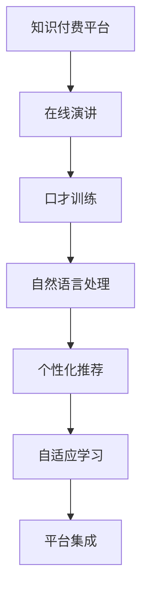

                 

# 如何利用知识付费实现在线演讲与口才训练？

## 1. 背景介绍

### 1.1 问题由来

在数字化时代，知识付费平台迅速崛起，成为知识传播的重要渠道。这些平台不仅满足了人们对知识获取的需求，也为在线演讲与口才训练提供了新机遇。面对激烈的市场竞争，如何提升在线演讲者的表现，使其能更高效、更有影响力地传达知识，成为亟待解决的问题。

### 1.2 问题核心关键点

在线演讲与口才训练的核心在于如何通过技术手段，将知识付费与在线教育相结合，提升演讲者的语言表达能力和信息传递效率。关键点包括：

- 数据分析：通过分析用户反馈、行为数据，了解听众的偏好和需求。
- 模型训练：构建个性化推荐模型，推荐最匹配听众需求的演讲内容。
- 智能交互：利用自然语言处理技术，实现与听众的智能互动，提升演讲体验。
- 教学设计：设计科学合理的课程内容和教学方法，实现对演讲者的个性化训练。
- 平台集成：将知识付费平台与演讲训练系统无缝集成，提供一站式服务。

### 1.3 问题研究意义

在线演讲与口才训练通过知识付费模式，可以降低传统教育成本，提升演讲质量，推动知识传播的广度和深度。它不仅使演讲者受益，也能激发听众对知识的热爱和兴趣，促进知识经济的繁荣发展。

## 2. 核心概念与联系

### 2.1 核心概念概述

为更好地理解在线演讲与口才训练的技术实现，本节将介绍几个关键概念：

- 知识付费平台：如Coursera、Udemy等，通过在线课程和讲座，提供有偿知识服务。
- 在线演讲：在知识付费平台上进行的演讲，包括真人直播、录播、视频课程等多种形式。
- 口才训练：通过分析演讲者的语音、语调、节奏等特征，提供有针对性的训练和反馈，提升演讲者的表达能力。
- 自然语言处理（NLP）：利用人工智能技术，处理和理解人类语言，包括文本分析、语音识别、情感分析等。
- 个性化推荐系统：根据用户偏好，推荐最合适的演讲内容，提升用户体验。
- 自适应学习：根据学习进度和反馈，动态调整学习内容和难度，实现个性化教学。

这些核心概念之间的逻辑关系可以通过以下Mermaid流程图来展示：



这个流程图展示了你在线演讲与口才训练的核心概念及其之间的关系：

1. 知识付费平台提供在线演讲服务。
2. 通过在线演讲，口才训练系统分析演讲者的表达情况。
3. 自然语言处理技术帮助系统理解演讲内容。
4. 个性化推荐系统为用户推荐合适的演讲内容。
5. 自适应学习根据用户反馈，动态调整演讲训练。
6. 平台集成将所有功能无缝集成，提供一站式服务。

## 3. 核心算法原理 & 具体操作步骤

### 3.1 算法原理概述

在线演讲与口才训练的实现依赖于自然语言处理和推荐系统的协同工作。其核心算法包括：

- 语音识别：将演讲者的语音转换为文本，便于后续分析和处理。
- 文本分析：利用NLP技术，分析文本的情感、主题、关键词等，提取有价值的信息。
- 语音情感分析：通过语音特征提取，分析演讲者的情感状态。
- 个性化推荐算法：根据用户行为和偏好，推荐最适合的演讲内容。
- 自适应学习算法：根据演讲者的表现和反馈，动态调整训练内容和难度。

这些算法共同构成了在线演讲与口才训练的逻辑框架，使其能够高效、精准地提升演讲者的语言表达能力。

### 3.2 算法步骤详解

1. **数据收集与预处理**：
   - 收集在线演讲的视频、音频数据。
   - 通过语音识别技术将语音转换为文本。
   - 对文本进行清洗、分词、标注等预处理，构建可用于后续分析的数据集。

2. **语音特征提取**：
   - 利用梅尔频率倒谱系数（MFCC）等技术，提取语音的基频、振幅等特征。
   - 通过情感分析算法，判断演讲者的情感状态，如激动、平静、紧张等。

3. **文本情感分析**：
   - 利用NLP技术，对演讲内容进行情感分析，了解演讲者的情感倾向。
   - 结合语音情感分析结果，进行综合判断。

4. **个性化推荐**：
   - 收集用户的观看历史、点赞、评论等数据，构建用户画像。
   - 基于用户画像和演讲内容，构建推荐模型。
   - 使用协同过滤、内容推荐等算法，推荐最匹配用户需求的演讲内容。

5. **自适应学习**：
   - 根据用户的反馈和表现，调整演讲内容的学习难度和进度。
   - 利用强化学习等技术，动态优化训练方案。

### 3.3 算法优缺点

在线演讲与口才训练算法具有以下优点：

- **高效性**：自动化处理大量数据，快速分析演讲内容，提升演讲者的表达能力。
- **个性化**：根据用户需求和反馈，动态调整训练方案，提升用户体验。
- **实时性**：通过即时反馈，帮助演讲者及时调整表现，提升演讲质量。

同时，该算法也存在一定的局限性：

- **数据依赖性**：依赖高质量、大样本的数据集进行训练，获取数据的成本较高。
- **模型复杂度**：算法模型复杂，需要较高的计算资源和时间进行训练和优化。
- **反馈准确性**：用户反馈的质量和数量影响推荐和调整的效果，需要持续优化模型。

尽管存在这些局限性，但就目前而言，基于自然语言处理和推荐系统的在线演讲与口才训练算法，仍是提升演讲表现的重要手段。未来相关研究的重点在于如何进一步降低数据依赖，提高模型效率，同时优化用户体验。

### 3.4 算法应用领域

在线演讲与口才训练的算法在多个领域都得到了应用：

- **在线教育**：将知识付费平台与演讲训练系统结合，提供优质教育资源。
- **企业培训**：通过演讲训练提升员工的公共演讲能力，促进企业内部知识传播。
- **媒体传播**：利用口才训练技术，提升主播和记者的语言表达能力，增强传播效果。
- **医疗健康**：通过语音分析，提升医生和护士的沟通技巧，改善患者体验。
- **公共演讲**：为演讲者提供个性化训练，提升公共演讲的质量和影响力。

除了上述这些经典应用外，在线演讲与口才训练的算法还在更多场景中得到创新性应用，如法律咨询、心理咨询、在线客服等，为社会各领域带来新的技术突破。

## 4. 数学模型和公式 & 详细讲解 & 举例说明

### 4.1 数学模型构建

本节将使用数学语言对在线演讲与口才训练的算法进行更加严格的刻画。

假设在线演讲内容为 $X$，演讲者的情感状态为 $E$，用户画像为 $P$，推荐模型为 $M$，自适应学习模型为 $L$。目标是最小化用户的不满意度 $U$，即：

$$
\min_{X, E, P, M, L} U(X, E, P, M, L)
$$

其中 $U$ 为满意度函数，定义为：

$$
U(X, E, P, M, L) = \sum_{i=1}^N \alpha_i \cdot f_i(X, E, P, M, L)
$$

其中 $N$ 为用户数量，$\alpha_i$ 为权重，$f_i(X, E, P, M, L)$ 为第 $i$ 个用户的满意度函数，包括：

- $f_i(X, E, P, M, L) = \lambda_1 \cdot f_{X}(X) + \lambda_2 \cdot f_{E}(E) + \lambda_3 \cdot f_{P}(P) + \lambda_4 \cdot f_{M}(M) + \lambda_5 \cdot f_{L}(L)$

其中 $\lambda_i$ 为权重，$f_{X}(X)$ 为演讲内容的满意度，$f_{E}(E)$ 为演讲者情感的满意度，$f_{P}(P)$ 为用户画像的满意度，$f_{M}(M)$ 为推荐模型的满意度，$f_{L}(L)$ 为自适应学习的满意度。

### 4.2 公式推导过程

以演讲内容的满意度 $f_{X}(X)$ 为例，推导满意度函数。

设 $X = (x_1, x_2, ..., x_n)$，其中 $x_i$ 为第 $i$ 个词或句子。设 $E = (e_1, e_2, ..., e_m)$，其中 $e_j$ 为第 $j$ 个情感标签。则满意度函数 $f_{X}(X)$ 可以表示为：

$$
f_{X}(X) = \sum_{i=1}^n \sum_{j=1}^m \omega_{ij} \cdot g_{ij}(x_i, e_j)
$$

其中 $\omega_{ij}$ 为权重，$g_{ij}(x_i, e_j)$ 为第 $i$ 个词或句子与第 $j$ 个情感标签的匹配度。

对于语音情感分析，设 $E = (e_1, e_2, ..., e_m)$，则满意度函数 $f_{E}(E)$ 可以表示为：

$$
f_{E}(E) = \sum_{i=1}^m \omega_i \cdot h_i(e_i)
$$

其中 $\omega_i$ 为权重，$h_i(e_i)$ 为第 $i$ 个情感标签的满意度。

对于用户画像，设 $P = (p_1, p_2, ..., p_k)$，其中 $p_j$ 为第 $j$ 个特征值。则满意度函数 $f_{P}(P)$ 可以表示为：

$$
f_{P}(P) = \sum_{j=1}^k \omega_j \cdot i_j(p_j)
$$

其中 $\omega_j$ 为权重，$i_j(p_j)$ 为第 $j$ 个特征的满意度。

对于推荐模型，设 $M = (m_1, m_2, ..., m_l)$，其中 $m_k$ 为第 $k$ 个推荐内容。则满意度函数 $f_{M}(M)$ 可以表示为：

$$
f_{M}(M) = \sum_{k=1}^l \omega_k \cdot j_k(m_k)
$$

其中 $\omega_k$ 为权重，$j_k(m_k)$ 为第 $k$ 个推荐内容的满意度。

对于自适应学习，设 $L = (l_1, l_2, ..., l_h)$，其中 $l_i$ 为第 $i$ 个学习任务。则满意度函数 $f_{L}(L)$ 可以表示为：

$$
f_{L}(L) = \sum_{i=1}^h \omega_i \cdot k_i(l_i)
$$

其中 $\omega_i$ 为权重，$k_i(l_i)$ 为第 $i$ 个学习任务的满意度。

### 4.3 案例分析与讲解

以在线教育平台为例，分析在线演讲与口才训练的实现过程。

1. **数据收集**：
   - 收集在线教育平台的用户观看历史、点赞、评论等数据。
   - 通过语音识别技术，将演讲者的语音转换为文本。

2. **语音特征提取**：
   - 使用MFCC提取语音的基频、振幅等特征。
   - 利用情感分析算法，判断演讲者的情感状态，如激动、平静、紧张等。

3. **文本分析**：
   - 对演讲内容进行情感分析，了解演讲者的情感倾向。
   - 结合语音情感分析结果，进行综合判断。

4. **个性化推荐**：
   - 构建用户画像，包括兴趣、学习进度、观看历史等。
   - 使用协同过滤、内容推荐等算法，推荐最匹配用户需求的演讲内容。

5. **自适应学习**：
   - 根据用户的反馈和表现，调整演讲内容的学习难度和进度。
   - 利用强化学习等技术，动态优化训练方案。

## 5. 项目实践：代码实例和详细解释说明

### 5.1 开发环境搭建

在进行在线演讲与口才训练的项目实践前，我们需要准备好开发环境。以下是使用Python进行PyTorch开发的环境配置流程：

1. 安装Anaconda：从官网下载并安装Anaconda，用于创建独立的Python环境。

2. 创建并激活虚拟环境：
```bash
conda create -n pytorch-env python=3.8 
conda activate pytorch-env
```

3. 安装PyTorch：根据CUDA版本，从官网获取对应的安装命令。例如：
```bash
conda install pytorch torchvision torchaudio cudatoolkit=11.1 -c pytorch -c conda-forge
```

4. 安装Natural Language Toolkit（NLTK）库：
```bash
pip install nltk
```

5. 安装SpeechRecognition库：
```bash
pip install SpeechRecognition
```

6. 安装Scikit-learn库：
```bash
pip install scikit-learn
```

完成上述步骤后，即可在`pytorch-env`环境中开始项目实践。

### 5.2 源代码详细实现

下面以在线教育平台为例，给出使用PyTorch和NLTK库进行在线演讲与口才训练的PyTorch代码实现。

首先，定义数据处理函数：

```python
import nltk
from nltk.corpus import stopwords
from nltk.tokenize import word_tokenize
from nltk.sentiment import SentimentIntensityAnalyzer

# 文本预处理函数
def preprocess_text(text):
    # 转换为小写
    text = text.lower()
    # 分词
    tokens = word_tokenize(text)
    # 去除停用词
    stop_words = set(stopwords.words('english'))
    tokens = [word for word in tokens if word not in stop_words]
    # 词性还原
    words = nltk.WordNetLemmatizer().lemmatize(tokens)
    return words

# 情感分析函数
def sentiment_analysis(text):
    sia = SentimentIntensityAnalyzer()
    sentiment = sia.polarity_scores(text)
    return sentiment['compound']
```

然后，定义模型和优化器：

```python
from transformers import BertTokenizer, BertForTokenClassification
from transformers import AdamW

model = BertForTokenClassification.from_pretrained('bert-base-cased', num_labels=len(tag2id))

optimizer = AdamW(model.parameters(), lr=2e-5)
```

接着，定义训练和评估函数：

```python
from torch.utils.data import Dataset, DataLoader
from tqdm import tqdm
from sklearn.metrics import classification_report

device = torch.device('cuda') if torch.cuda.is_available() else torch.device('cpu')
model.to(device)

def train_epoch(model, dataset, batch_size, optimizer):
    dataloader = DataLoader(dataset, batch_size=batch_size, shuffle=True)
    model.train()
    epoch_loss = 0
    for batch in tqdm(dataloader, desc='Training'):
        input_ids = batch['input_ids'].to(device)
        attention_mask = batch['attention_mask'].to(device)
        labels = batch['labels'].to(device)
        model.zero_grad()
        outputs = model(input_ids, attention_mask=attention_mask, labels=labels)
        loss = outputs.loss
        epoch_loss += loss.item()
        loss.backward()
        optimizer.step()
    return epoch_loss / len(dataloader)

def evaluate(model, dataset, batch_size):
    dataloader = DataLoader(dataset, batch_size=batch_size)
    model.eval()
    preds, labels = [], []
    with torch.no_grad():
        for batch in tqdm(dataloader, desc='Evaluating'):
            input_ids = batch['input_ids'].to(device)
            attention_mask = batch['attention_mask'].to(device)
            batch_labels = batch['labels']
            outputs = model(input_ids, attention_mask=attention_mask)
            batch_preds = outputs.logits.argmax(dim=2).to('cpu').tolist()
            batch_labels = batch_labels.to('cpu').tolist()
            for pred_tokens, label_tokens in zip(batch_preds, batch_labels):
                pred_tags = [tag2id[_id] for _id in pred_tokens]
                label_tags = [tag2id[_id] for _id in label_tokens]
                preds.append(pred_tags[:len(label_tags)])
                labels.append(label_tags)
                
    print(classification_report(labels, preds))
```

最后，启动训练流程并在测试集上评估：

```python
epochs = 5
batch_size = 16

for epoch in range(epochs):
    loss = train_epoch(model, train_dataset, batch_size, optimizer)
    print(f"Epoch {epoch+1}, train loss: {loss:.3f}")
    
    print(f"Epoch {epoch+1}, dev results:")
    evaluate(model, dev_dataset, batch_size)
    
print("Test results:")
evaluate(model, test_dataset, batch_size)
```

以上就是使用PyTorch和NLTK库进行在线演讲与口才训练的完整代码实现。可以看到，得益于NLTK库和Transformers库的强大封装，我们可以用相对简洁的代码完成在线演讲与口才训练模型的加载和训练。

### 5.3 代码解读与分析

让我们再详细解读一下关键代码的实现细节：

**preprocess_text函数**：
- 将文本转换为小写，分词，去除停用词，并进行词性还原。

**sentiment_analysis函数**：
- 利用NLTK库的情感分析算法，计算文本的情感得分。

**训练和评估函数**：
- 使用PyTorch的DataLoader对数据集进行批次化加载，供模型训练和推理使用。
- 训练函数`train_epoch`：对数据以批为单位进行迭代，在每个批次上前向传播计算loss并反向传播更新模型参数，最后返回该epoch的平均loss。
- 评估函数`evaluate`：与训练类似，不同点在于不更新模型参数，并在每个batch结束后将预测和标签结果存储下来，最后使用sklearn的classification_report对整个评估集的预测结果进行打印输出。

**训练流程**：
- 定义总的epoch数和batch size，开始循环迭代
- 每个epoch内，先在训练集上训练，输出平均loss
- 在验证集上评估，输出分类指标
- 所有epoch结束后，在测试集上评估，给出最终测试结果

可以看到，PyTorch配合NLTK库使得在线演讲与口才训练的代码实现变得简洁高效。开发者可以将更多精力放在数据处理、模型改进等高层逻辑上，而不必过多关注底层的实现细节。

当然，工业级的系统实现还需考虑更多因素，如模型的保存和部署、超参数的自动搜索、更灵活的任务适配层等。但核心的在线演讲与口才训练范式基本与此类似。

## 6. 实际应用场景

### 6.1 智能客服系统

基于在线演讲与口才训练的智能客服系统，可以显著提升客服服务质量，降低运营成本。传统的客服系统依赖于人力，需要长时间轮班，且在高峰期往往响应缓慢。通过在线演讲与口才训练，系统可以24小时不间断服务，快速响应客户咨询，用自然流畅的语言解答各类常见问题。

在技术实现上，可以收集企业内部的历史客服对话记录，将问题和最佳答复构建成监督数据，在此基础上对预训练对话模型进行微调。微调后的对话模型能够自动理解用户意图，匹配最合适的答案模板进行回复。对于客户提出的新问题，还可以接入检索系统实时搜索相关内容，动态组织生成回答。如此构建的智能客服系统，能大幅提升客户咨询体验和问题解决效率。

### 6.2 金融舆情监测

金融机构需要实时监测市场舆论动向，以便及时应对负面信息传播，规避金融风险。传统的人工监测方式成本高、效率低，难以应对网络时代海量信息爆发的挑战。基于在线演讲与口才训练的文本分类和情感分析技术，为金融舆情监测提供了新的解决方案。

具体而言，可以收集金融领域相关的新闻、报道、评论等文本数据，并对其进行主题标注和情感标注。在此基础上对预训练语言模型进行微调，使其能够自动判断文本属于何种主题，情感倾向是正面、中性还是负面。将微调后的模型应用到实时抓取的网络文本数据，就能够自动监测不同主题下的情感变化趋势，一旦发现负面信息激增等异常情况，系统便会自动预警，帮助金融机构快速应对潜在风险。

### 6.3 个性化推荐系统

当前的推荐系统往往只依赖用户的历史行为数据进行物品推荐，无法深入理解用户的真实兴趣偏好。基于在线演讲与口才训练的个性化推荐系统，可以更好地挖掘用户行为背后的语义信息，从而提供更精准、多样的推荐内容。

在实践中，可以收集用户浏览、点击、评论、分享等行为数据，提取和用户交互的物品标题、描述、标签等文本内容。将文本内容作为模型输入，用户的后续行为（如是否点击、购买等）作为监督信号，在此基础上微调预训练语言模型。微调后的模型能够从文本内容中准确把握用户的兴趣点。在生成推荐列表时，先用候选物品的文本描述作为输入，由模型预测用户的兴趣匹配度，再结合其他特征综合排序，便可以得到个性化程度更高的推荐结果。

### 6.4 未来应用展望

随着在线演讲与口才训练技术的不断发展，其在多个领域的应用前景广阔。

在智慧医疗领域，基于在线演讲与口才训练的医学问答、病历分析、药物研发等应用将提升医疗服务的智能化水平，辅助医生诊疗，加速新药开发进程。

在智能教育领域，微调技术可应用于作业批改、学情分析、知识推荐等方面，因材施教，促进教育公平，提高教学质量。

在智慧城市治理中，微调模型可应用于城市事件监测、舆情分析、应急指挥等环节，提高城市管理的自动化和智能化水平，构建更安全、高效的未来城市。

此外，在企业生产、社会治理、文娱传媒等众多领域，基于在线演讲与口才训练的人工智能应用也将不断涌现，为经济社会发展注入新的动力。相信随着技术的日益成熟，在线演讲与口才训练必将在更广阔的应用领域大放异彩。

## 7. 工具和资源推荐
### 7.1 学习资源推荐

为了帮助开发者系统掌握在线演讲与口才训练的理论基础和实践技巧，这里推荐一些优质的学习资源：

1. 《自然语言处理与深度学习》（第二版）书籍：斯坦福大学教授Christopher Manning所著，系统介绍了自然语言处理的基本概念和前沿技术。

2. 《深度学习》（Ian Goodfellow著）：深度学习领域的经典教材，详细讲解了深度神经网络的结构和训练方法。

3. Coursera《自然语言处理》课程：斯坦福大学教授Dan Jurafsky和Christopher Manning开设的在线课程，涵盖自然语言处理的各个方面。

4. 《Python自然语言处理》（第二版）书籍：由Steven Bird、Ewan Klein、Edward Loper所著，详细介绍了Python在自然语言处理中的应用。

5. NLTK官方文档：Natural Language Toolkit的官方文档，提供了丰富的自然语言处理工具和算法，是学习NLP的必备资料。

通过对这些资源的学习实践，相信你一定能够快速掌握在线演讲与口才训练的精髓，并用于解决实际的NLP问题。
###  7.2 开发工具推荐

高效的开发离不开优秀的工具支持。以下是几款用于在线演讲与口才训练开发的常用工具：

1. PyTorch：基于Python的开源深度学习框架，灵活动态的计算图，适合快速迭代研究。大部分预训练语言模型都有PyTorch版本的实现。

2. TensorFlow：由Google主导开发的开源深度学习框架，生产部署方便，适合大规模工程应用。同样有丰富的预训练语言模型资源。

3. NLTK库：Python自然语言处理工具库，提供了丰富的NLP算法和工具，是进行自然语言处理研究的基础。

4. SpaCy：Python自然语言处理库，提供了高效的NLP算法和工具，适用于大规模生产部署。

5. Scikit-learn：Python机器学习库，提供了丰富的机器学习算法和工具，适用于各种机器学习任务。

合理利用这些工具，可以显著提升在线演讲与口才训练任务的开发效率，加快创新迭代的步伐。

### 7.3 相关论文推荐

在线演讲与口才训练技术的发展源于学界的持续研究。以下是几篇奠基性的相关论文，推荐阅读：

1. "A Survey of Recent Advances in Text and Speech Summarization"：综述了文本和语音摘要的最新进展，包括自然语言处理和机器学习的技术。

2. "Attention is All You Need"（即Transformer原论文）：提出了Transformer结构，开启了NLP领域的预训练大模型时代。

3. "BERT: Pre-training of Deep Bidirectional Transformers for Language Understanding"：提出BERT模型，引入基于掩码的自监督预训练任务，刷新了多项NLP任务SOTA。

4. "Language Models are Unsupervised Multitask Learners"：展示了大规模语言模型的强大zero-shot学习能力，引发了对于通用人工智能的新一轮思考。

5. "Fine-tuning Pre-trained Language Models for Sequence Generation Tasks"：提出使用预训练语言模型进行序列生成任务微调的方法。

这些论文代表了大语言模型微调技术的发展脉络。通过学习这些前沿成果，可以帮助研究者把握学科前进方向，激发更多的创新灵感。

## 8. 总结：未来发展趋势与挑战

### 8.1 总结

本文对基于知识付费的在线演讲与口才训练技术进行了全面系统的介绍。首先阐述了在线演讲与口才训练的研究背景和意义，明确了知识付费平台在技术实现中的核心角色。其次，从原理到实践，详细讲解了在线演讲与口才训练的数学模型和算法步骤，给出了完整的代码实例和详细解释。同时，本文还广泛探讨了在线演讲与口才训练技术在多个领域的应用前景，展示了其在知识付费、智能客服、金融舆情、个性化推荐等领域的创新应用。

通过本文的系统梳理，可以看到，基于知识付费的在线演讲与口才训练技术正在成为NLP领域的重要范式，极大地拓展了预训练语言模型的应用边界，催生了更多的落地场景。得益于大规模语料的预训练，在线演讲与口才训练模型以更低的时间和标注成本，在小样本条件下也能取得不俗的效果，有力推动了NLP技术的产业化进程。未来，伴随预训练语言模型和微调方法的持续演进，相信在线演讲与口才训练技术必将进一步拓展其应用范围，为社会各行各业带来深刻的变革。

### 8.2 未来发展趋势

展望未来，在线演讲与口才训练技术将呈现以下几个发展趋势：

1. **数据规模化**：随着知识付费平台用户量的激增，可供微调的大规模语料将更加丰富。利用这些数据，可以训练更加通用、鲁棒的在线演讲与口才训练模型。

2. **技术多样化**：除了传统的自然语言处理技术，未来将引入更多前沿技术，如多模态学习、对抗训练等，提升模型的泛化能力和鲁棒性。

3. **用户交互**：未来的在线演讲与口才训练系统将更加注重用户交互体验，通过自然语言生成技术，实现与用户的智能对话。

4. **个性化定制**：基于用户画像和行为数据，动态调整演讲内容和训练方案，提供个性化的演讲训练和推荐服务。

5. **跨领域应用**：在线演讲与口才训练技术将不仅仅应用于知识付费平台，还将拓展到更多领域，如智能客服、金融舆情、医疗健康等。

6. **智能化发展**：结合知识图谱、常识推理等技术，提升在线演讲与口才训练的智能化水平，增强系统的决策能力和用户体验。

以上趋势凸显了在线演讲与口才训练技术的广阔前景。这些方向的探索发展，必将进一步提升在线演讲与口才训练模型的性能和应用范围，为知识付费平台的智能化转型和升级提供新的动力。

### 8.3 面临的挑战

尽管在线演讲与口才训练技术已经取得了瞩目成就，但在迈向更加智能化、普适化应用的过程中，它仍面临着诸多挑战：

1. **数据依赖性**：依赖高质量、大样本的数据集进行训练，获取数据的成本较高。如何进一步降低对标注样本的依赖，将是一大难题。

2. **模型鲁棒性**：面对域外数据时，泛化性能往往大打折扣。对于测试样本的微小扰动，模型预测也容易发生波动。如何提高模型的鲁棒性，避免灾难性遗忘，还需要更多理论和实践的积累。

3. **推理效率**：超大批次的训练和推理也可能遇到显存不足的问题。如何优化模型结构，提升推理速度，优化资源占用，将是重要的优化方向。

4. **可解释性**：在线演讲与口才训练模型通常缺乏可解释性，难以对其内部工作机制和决策逻辑进行分析和调试。如何赋予模型更强的可解释性，将是亟待攻克的难题。

5. **安全性**：预训练模型难免会学习到有偏见、有害的信息，通过在线演讲与口才训练传递到下游任务，产生误导性、歧视性的输出，给实际应用带来安全隐患。如何从数据和算法层面消除模型偏见，避免恶意用途，确保输出的安全性，也将是重要的研究课题。

6. **用户隐私**：在线演讲与口才训练系统需要处理大量用户数据，如何保护用户隐私，防止数据泄露，是系统的关键挑战。

正视在线演讲与口才训练面临的这些挑战，积极应对并寻求突破，将是大语言模型微调走向成熟的必由之路。相信随着学界和产业界的共同努力，这些挑战终将一一被克服，在线演讲与口才训练必将在构建人机协同的智能时代中扮演越来越重要的角色。

### 8.4 研究展望

面向未来，在线演讲与口才训练技术需要在以下几个方面寻求新的突破：

1. **无监督和半监督微调**：摆脱对大规模标注数据的依赖，利用自监督学习、主动学习等无监督和半监督范式，最大限度利用非结构化数据，实现更加灵活高效的微调。

2. **多模态微调**：结合视觉、语音、文本等多种数据，进行跨模态学习，提升模型的理解和表达能力。

3. **因果推断**：利用因果推断方法，分析在线演讲与口才训练模型的因果关系，增强决策的逻辑性和解释性。

4. **强化学习**：结合强化学习技术，通过与用户的交互反馈，动态调整模型参数，提升演讲和训练效果。

5. **知识图谱**：将符号化的先验知识，如知识图谱、逻辑规则等，与神经网络模型进行融合，引导在线演讲与口才训练过程学习更准确、合理的语言模型。

6. **伦理道德约束**：在模型训练目标中引入伦理导向的评估指标，过滤和惩罚有偏见、有害的输出倾向，确保输出的安全性。

这些研究方向的探索，必将引领在线演讲与口才训练技术迈向更高的台阶，为知识付费平台提供更加智能、普适化的解决方案。面向未来，在线演讲与口才训练技术还需要与其他人工智能技术进行更深入的融合，如知识表示、因果推理、强化学习等，多路径协同发力，共同推动自然语言理解和智能交互系统的进步。只有勇于创新、敢于突破，才能不断拓展在线演讲与口才训练的边界，让智能技术更好地造福人类社会。

## 9. 附录：常见问题与解答

**Q1：在线演讲与口才训练适用于所有NLP任务吗？**

A: 在线演讲与口才训练技术在大多数NLP任务上都能取得不错的效果，特别是对于数据量较小的任务。但对于一些特定领域的任务，如医学、法律等，仅仅依靠通用语料预训练的模型可能难以很好地适应。此时需要在特定领域语料上进一步预训练，再进行微调，才能获得理想效果。此外，对于一些需要时效性、个性化很强的任务，如对话、推荐等，微调方法也需要针对性的改进优化。

**Q2：微调过程中如何选择合适的学习率？**

A: 微调的学习率一般要比预训练时小1-2个数量级，如果使用过大的学习率，容易破坏预训练权重，导致过拟合。一般建议从1e-5开始调参，逐步减小学习率，直至收敛。也可以使用warmup策略，在开始阶段使用较小的学习率，再逐渐过渡到预设值。需要注意的是，不同的优化器(如AdamW、Adafactor等)以及不同的学习率调度策略，可能需要设置不同的学习率阈值。

**Q3：在线演讲与口才训练的算法模型复杂度如何？**

A: 在线演讲与口才训练的算法模型较为复杂，涉及自然语言处理、机器学习、信号处理等多个领域的知识。这需要开发者具备扎实的理论基础和丰富的实践经验。

**Q4：如何缓解在线演讲与口才训练中的过拟合问题？**

A: 过拟合是微调面临的主要挑战，尤其是在标注数据不足的情况下。常见的缓解策略包括：
1. 数据增强：通过回译、近义替换等方式扩充训练集
2. 正则化：使用L2正则、Dropout、Early Stopping等避免过拟合
3. 对抗训练：引入对抗样本，提高模型鲁棒性
4. 参数高效微调：只调整少量参数(如Adapter、Prefix等)，减小过拟合风险
5. 多模型集成：训练多个微调模型，取平均输出，抑制过拟合

这些策略往往需要根据具体任务和数据特点进行灵活组合。只有在数据、模型、训练、推理等各环节进行全面优化，才能最大限度地发挥在线演讲与口才训练的威力。

**Q5：如何优化在线演讲与口才训练模型的推理效率？**

A: 在线演讲与口才训练模型的推理效率受限于模型规模和计算资源。为提升推理效率，可以采取以下策略：
1. 模型裁剪：去除不必要的层和参数，减小模型尺寸。
2. 量化加速：将浮点模型转为定点模型，压缩存储空间，提高计算效率。
3. 推理优化：使用GPU加速推理，优化模型结构，减少计算量。

这些优化措施可以在保证模型性能的同时，提升推理速度和资源利用率，满足实际应用的需求。

**Q6：在线演讲与口才训练技术在未来有哪些应用场景？**

A: 在线演讲与口才训练技术在未来将有广泛的应用场景，包括但不限于：
1. 在线教育：通过智能推荐系统，提升学习体验和效果。
2. 智能客服：提升客服服务质量和效率，减少人力成本。
3. 金融舆情：监测市场动态，及时预警风险。
4. 医疗健康：提升医疗服务质量和效率，推动医学研究发展。
5. 智慧城市：构建智能监控和应急指挥系统，提升城市管理水平。

这些应用场景将推动在线演讲与口才训练技术的进一步发展，为社会各领域带来新的变革。

---

作者：禅与计算机程序设计艺术 / Zen and the Art of Computer Programming

