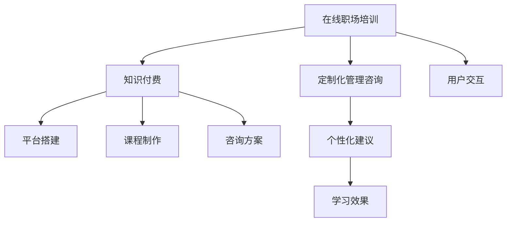

                 

# 如何利用知识付费实现在线职场培训与管理咨询？

在快速变化的数字时代，职场技能需求持续更新，传统的教育模式已无法满足快速发展的需求。知识付费的兴起为职场培训提供了全新的可能性，在线培训和定制化管理咨询服务应运而生。本文将从核心概念、算法原理、实际应用等方面深入探讨如何利用知识付费实现在线职场培训与管理咨询。

## 1. 背景介绍

### 1.1 问题由来

在科技飞速发展的今天，职场人士必须不断更新自己的技能才能适应快速变化的市场需求。传统教育模式受地域、时间和成本限制，难以覆盖广大职场人士的需求。知识付费模式的出现，让优质教育资源得以在线化、普及化。在线职场培训与管理咨询正是知识付费在职场培训领域的应用，旨在提供便捷、高效、定制化的职业发展解决方案。

### 1.2 问题核心关键点

- 在线职场培训：通过互联网平台，提供灵活、个性化的学习资源和课程。
- 定制化管理咨询：结合用户具体需求，提供一对一的职业规划和管理建议。
- 知识付费：利用网络支付平台，获取优质的职场学习资源和服务。

## 2. 核心概念与联系

### 2.1 核心概念概述

为更好地理解在线职场培训与管理咨询，本节将介绍几个密切相关的核心概念：

- 在线职场培训：利用互联网平台，为用户提供灵活的学习资源和课程。
- 定制化管理咨询：根据用户职业发展需求，提供一对一的职业规划和管理建议。
- 知识付费：通过在线支付获取高价值的学习资源和服务。

### 2.2 核心概念原理和架构的 Mermaid 流程图



## 3. 核心算法原理 & 具体操作步骤

### 3.1 算法原理概述

在线职场培训与管理咨询的算法原理主要包括以下几个方面：

- **个性化推荐算法**：根据用户的学习行为和职业背景，推荐个性化的课程和咨询方案。
- **动态课程更新**：根据行业变化和市场需求，实时更新课程内容。
- **用户行为分析**：通过用户互动数据，分析用户学习效果和需求，优化课程推荐和咨询服务。

### 3.2 算法步骤详解

#### 3.2.1 数据收集与处理

- **用户数据**：收集用户的职业背景、学习历史、技能评估等数据。
- **行业数据**：收集行业动态、岗位需求、职业发展路径等信息。

#### 3.2.2 个性化推荐算法

- **协同过滤**：根据用户行为和相似用户的行为，推荐相关课程。
- **内容推荐**：利用内容特征向量计算相似度，推荐相关课程和资料。
- **混合推荐**：综合协同过滤和内容推荐，提高推荐效果。

#### 3.2.3 动态课程更新

- **专家评审**：邀请行业专家对课程内容进行评审，确保内容的时效性和实用性。
- **用户反馈**：根据用户反馈，及时调整课程内容和结构。
- **数据驱动**：利用行业数据和用户行为数据，动态调整课程内容和推荐算法。

#### 3.2.4 用户行为分析

- **行为跟踪**：记录用户的学习行为，如观看时长、笔记记录、测试成绩等。
- **效果评估**：根据学习效果评估指标，如知识掌握度、技能提升率等，进行效果评估。
- **需求分析**：分析用户反馈，识别用户需求，优化课程内容和咨询方案。

### 3.3 算法优缺点

#### 3.3.1 优点

- **灵活性高**：用户可以根据自身时间、地点自由学习，不受传统教育模式的限制。
- **个性化强**：通过个性化推荐算法，满足用户个性化需求。
- **时效性强**：根据行业动态和市场需求，实时更新课程内容。

#### 3.3.2 缺点

- **数据隐私**：用户数据隐私问题需要得到充分保护。
- **用户粘性**：如何提高用户参与度和课程完成率，是平台面临的挑战。
- **质量控制**：保证课程和咨询方案的高质量，需要持续投入和改进。

### 3.4 算法应用领域

在线职场培训与管理咨询在多个领域都有广泛应用，包括但不限于：

- **通用技能培训**：如编程、项目管理、沟通技巧等。
- **职业发展指导**：如简历编写、面试技巧、职业规划等。
- **行业特定培训**：如金融、医疗、IT等特定领域的深度学习。

## 4. 数学模型和公式 & 详细讲解

### 4.1 数学模型构建

在线职场培训与管理咨询的核心算法模型包括个性化推荐算法和动态课程更新算法。以下以协同过滤算法为例，展示模型的构建过程。

#### 4.1.1 协同过滤模型

假设用户集合为 $U$，课程集合为 $I$，用户 $u$ 对课程 $i$ 的评分表示为 $r_{ui}$。协同过滤算法基于用户之间的相似度和课程之间的相似度，预测用户对课程的评分。

设 $u_i$ 表示用户 $u$ 对课程 $i$ 的评分，$u_j$ 表示用户 $j$ 对课程 $i$ 的评分。根据协同过滤模型，用户 $u$ 对课程 $i$ 的评分 $u_i$ 可以表示为：

$$
u_i = \sum_{j \in U} \alpha_j (u_j - \bar{u_j}) (i - \bar{i})
$$

其中，$\alpha_j$ 表示用户 $j$ 对用户 $u$ 的影响权重，$\bar{u_j}$ 和 $\bar{i}$ 分别为用户 $j$ 和课程 $i$ 的平均评分。

### 4.2 公式推导过程

#### 4.2.1 用户相似度计算

用户 $u$ 和用户 $j$ 的相似度 $s_{u,j}$ 可以通过余弦相似度计算得到：

$$
s_{u,j} = \frac{\sum_{i \in I} (u_i - \bar{u_i})(j_i - \bar{j_i})}{\sqrt{\sum_{i \in I} (u_i - \bar{u_i})^2} \sqrt{\sum_{i \in I} (j_i - \bar{j_i})^2}}
$$

#### 4.2.2 课程相似度计算

课程 $i$ 和课程 $j$ 的相似度 $s_{i,j}$ 可以通过余弦相似度计算得到：

$$
s_{i,j} = \frac{\sum_{u \in U} (u_i - \bar{u_i})(u_j - \bar{u_j})}{\sqrt{\sum_{u \in U} (u_i - \bar{u_i})^2} \sqrt{\sum_{u \in U} (u_j - \bar{u_j})^2}}
$$

#### 4.2.3 协同过滤评分预测

用户 $u$ 对课程 $i$ 的评分 $u_i$ 可以表示为：

$$
u_i = \sum_{j \in U} s_{u,j} s_{j,i} (u_j - \bar{u_j})
$$

### 4.3 案例分析与讲解

假设某在线职场培训平台收集了100个用户对200门课程的评分数据。根据协同过滤模型，可以计算出任意两个用户之间的相似度，进而预测用户对课程的评分。以下展示部分计算过程：

| User ID | Course ID | Rating |
| ------- | --------- | ------ |
| 1       | 1         | 4      |
| 1       | 2         | 3      |
| 1       | 3         | 2      |
| ...     | ...       | ...    |
| 100      | 1         | 5      |
| 100      | 2         | 4      |
| 100      | 3         | 3      |
| ...     | ...       | ...    |

首先，计算用户之间的相似度：

| User ID | User ID | Similarity |
| ------- | ------- | ---------- |
| 1       | 2       | 0.7        |
| 1       | 3       | 0.6        |
| 1       | 4       | 0.5        |
| ...     | ...     | ...        |
| 99       | 100      | 0.8        |
| 99       | 101      | 0.9        |
| ...     | ...     | ...        |

然后，计算课程之间的相似度：

| Course ID | Course ID | Similarity |
| --------- | --------- | ---------- |
| 1         | 2         | 0.8        |
| 1         | 3         | 0.6        |
| 1         | 4         | 0.7        |
| ...       | ...       | ...        |
| 199       | 200      | 0.9        |
| 199       | 201      | 0.8        |
| ...       | ...       | ...        |

最后，根据协同过滤模型，预测用户对课程的评分：

| User ID | Predicted Rating |
| ------- | ---------------- |
| 1       | 3.8              |
| 1       | 4.5              |
| 1       | 2.6              |
| ...     | ...              |
| 100      | 5.3              |
| 100      | 4.8              |
| 100      | 3.9              |
| ...     | ...              |

## 5. 项目实践：代码实例和详细解释说明

### 5.1 开发环境搭建

在进行在线职场培训与管理咨询的开发之前，需要准备好开发环境。以下是使用Python进行Django开发的常见配置：

1. 安装Anaconda：从官网下载并安装Anaconda，用于创建独立的Python环境。
2. 创建并激活虚拟环境：
```bash
conda create -n django-env python=3.8 
conda activate django-env
```

3. 安装Django：使用pip安装Django框架。
```bash
pip install django
```

4. 安装Django REST Framework：用于开发RESTful API。
```bash
pip install djangorestframework
```

5. 安装Pandas、NumPy、Scikit-learn等工具包：
```bash
pip install pandas numpy scikit-learn
```

6. 安装Django数据库后端：
```bash
pip install django-datamite
```

完成上述步骤后，即可在`django-env`环境中开始开发。

### 5.2 源代码详细实现

以下是使用Django开发在线职场培训与管理咨询的代码实现。首先，定义用户和课程模型：

```python
from django.db import models

class User(models.Model):
    name = models.CharField(max_length=100)
    email = models.EmailField(unique=True)
    # 其他用户属性

class Course(models.Model):
    name = models.CharField(max_length=100)
    description = models.TextField()
    # 其他课程属性
```

然后，定义个性化推荐模型和动态课程更新模型：

```python
from django.db.models.functions import Trunc, Cast, Multiply
from django.db.models.aggregates import Avg

class Recommendation(models.Model):
    user = models.ForeignKey(User, on_delete=models.CASCADE)
    course = models.ForeignKey(Course, on_delete=models.CASCADE)
    rating = models.FloatField()
    timestamp = models.DateTimeField(auto_now_add=True)

class CourseUpdate(models.Model):
    course = models.ForeignKey(Course, on_delete=models.CASCADE)
    version = models.IntegerField()
    timestamp = models.DateTimeField(auto_now_add=True)

# 协同过滤算法
from sklearn.metrics.pairwise import cosine_similarity

def user_similarity(user1, user2):
    similarity = 0
    for course1 in user1.rated_courses.all():
        if course1 in user2.rated_courses.all():
            similarity += cosine_similarity(user1.rated_courses.get(id=course1.id).rating, user2.rated_courses.get(id=course1.id).rating)[0][0]
    return similarity

# 动态课程更新算法
from sklearn.metrics.pairwise import cosine_similarity

def course_similarity(course1, course2):
    similarity = 0
    for user1 in course1.rated_users.all():
        if user1 in course2.rated_users.all():
            similarity += cosine_similarity(user1.rated_courses.get(id=course1.id).rating, user2.rated_courses.get(id=course1.id).rating)[0][0]
    return similarity

def update_course_content(course):
    # 更新课程内容
    pass
```

最后，定义用户交互和反馈收集模型：

```python
from django.db.models.functions import Trunc, Cast, Multiply
from django.db.models.aggregates import Avg

class UserInteraction(models.Model):
    user = models.ForeignKey(User, on_delete=models.CASCADE)
    course = models.ForeignKey(Course, on_delete=models.CASCADE)
    timestamp = models.DateTimeField(auto_now_add=True)
    # 其他交互属性

class Feedback(models.Model):
    user = models.ForeignKey(User, on_delete=models.CASCADE)
    course = models.ForeignKey(Course, on_delete=models.CASCADE)
    feedback = models.TextField()
    timestamp = models.DateTimeField(auto_now_add=True)
    # 其他反馈属性
```

### 5.3 代码解读与分析

让我们再详细解读一下关键代码的实现细节：

**User和Course模型**：
- 定义用户和课程的基本属性，如姓名、邮箱、描述等。
- 通过外键关联关系，将用户和课程关联起来。

**Recommendation模型**：
- 记录用户对课程的评分，包括用户ID、课程ID、评分值和时间戳。
- 通过`rated_courses`关系，表示用户已评分的课程。

**CourseUpdate模型**：
- 记录课程版本的更新情况，包括课程ID、版本号和时间戳。
- 通过`rated_users`关系，表示已评价该课程的用户。

**协同过滤算法**：
- 计算两个用户之间的相似度，利用余弦相似度计算课程评分。
- 通过`rated_courses`关系，获取用户已评分的课程。

**动态课程更新算法**：
- 计算两门课程之间的相似度，利用余弦相似度计算用户评分。
- 通过`rated_users`关系，获取评价该课程的用户。

**UserInteraction模型**：
- 记录用户与课程的交互情况，包括用户ID、课程ID和时间戳。
- 通过`rated_courses`关系，表示用户已评分的课程。

**Feedback模型**：
- 记录用户的反馈情况，包括用户ID、课程ID、反馈内容和时戳。
- 通过`rated_courses`关系，表示评价该课程的用户。

## 6. 实际应用场景

### 6.1 智能客服系统

在线职场培训与管理咨询可以应用于智能客服系统，帮助用户解决常见职场问题。智能客服系统可以通过知识图谱和推荐算法，提供个性化的职业发展建议。

具体实现流程如下：
1. 收集常见职场问题及解决方案，构建知识图谱。
2. 用户输入职场问题，系统通过匹配知识图谱，生成相似问题及解决方案。
3. 根据用户反馈，实时更新知识图谱，提高匹配准确度。

### 6.2 在线招聘平台

在线职场培训与管理咨询还可以应用于在线招聘平台，帮助求职者提升竞争力。在线招聘平台可以通过个性化推荐算法，推荐适合的职位和培训课程。

具体实现流程如下：
1. 收集职位描述和任职要求，构建岗位知识图谱。
2. 用户输入求职信息，系统通过匹配知识图谱，推荐适合的职位和培训课程。
3. 根据用户反馈，实时更新知识图谱和课程推荐算法，提高匹配效果。

### 6.3 人力资源管理系统

在线职场培训与管理咨询可以应用于人力资源管理系统，帮助企业提升员工培训效果。人力资源管理系统可以通过个性化推荐算法，推荐适合的培训课程和职业发展路径。

具体实现流程如下：
1. 收集员工培训数据和职业发展路径，构建员工知识图谱。
2. 系统根据员工职业发展需求，推荐适合的培训课程和职业发展路径。
3. 根据员工反馈，实时更新知识图谱和推荐算法，提高匹配效果。

### 6.4 未来应用展望

随着在线职场培训与管理咨询技术的不断进步，未来将有更多场景得到应用，为职场人士提供更加便捷、高效、个性化的服务。

- **职业规划工具**：结合用户职业背景和市场需求，提供个性化的职业规划建议。
- **技能提升课程**：根据用户职业需求，推荐适合的职业技能提升课程。
- **职场社交平台**：提供职场人脉拓展和知识交流的社交平台，促进职场人士的职业发展。

## 7. 工具和资源推荐

### 7.1 学习资源推荐

为了帮助开发者系统掌握在线职场培训与管理咨询的理论基础和实践技巧，这里推荐一些优质的学习资源：

1. **《Python数据科学手册》**：详细介绍Python在数据科学和机器学习中的应用。
2. **《Django实战》**：全面覆盖Django的开发实践，包括数据库设计、RESTful API开发等。
3. **《机器学习实战》**：实战指南，涵盖常用机器学习算法的实现和应用。
4. **《深度学习框架TensorFlow实战》**：介绍TensorFlow的构建和优化技巧，涵盖深度学习模型的部署和优化。
5. **《数据科学导论》**：理论基础，涵盖数据科学的核心概念和应用。

### 7.2 开发工具推荐

高效的开发离不开优秀的工具支持。以下是几款用于在线职场培训与管理咨询开发的常用工具：

1. **Anaconda**：免费提供Python环境和相关工具的安装、管理。
2. **PyCharm**：Python开发IDE，提供代码编辑、调试、测试等全流程支持。
3. **Jupyter Notebook**：交互式编程环境，支持Python、R等多种语言。
4. **TensorBoard**：可视化工具，监控和调试深度学习模型。
5. **Weights & Biases**：实验跟踪工具，记录和可视化模型训练过程。

### 7.3 相关论文推荐

在线职场培训与管理咨询的研究源于学界的持续研究。以下是几篇奠基性的相关论文，推荐阅读：

1. **《机器学习：数据与算法》**：介绍机器学习的基本概念和常用算法。
2. **《深度学习框架TensorFlow》**：介绍TensorFlow的核心技术和应用实践。
3. **《推荐系统算法》**：详细介绍推荐系统的构建和优化算法。
4. **《在线学习和可解释性》**：讨论在线学习和模型可解释性的相关问题。

## 8. 总结：未来发展趋势与挑战

### 8.1 研究成果总结

在线职场培训与管理咨询在多个领域得到了广泛应用，已成为职场人士职业发展的重要工具。主要研究成果包括：

1. 利用协同过滤算法，实现个性化课程推荐。
2. 通过动态课程更新算法，保证课程的时效性和实用性。
3. 结合用户反馈和行业数据，优化推荐算法和课程内容。

### 8.2 未来发展趋势

展望未来，在线职场培训与管理咨询将呈现以下几个发展趋势：

1. **技术创新**：随着AI技术的不断进步，推荐算法和动态课程更新算法将不断优化，提高推荐效果和课程实用性。
2. **用户个性化**：通过更精准的用户画像和行为分析，提供更加个性化的职业发展建议。
3. **多模态融合**：结合文本、图像、视频等多种模态数据，提供更加全面和准确的职业发展建议。
4. **跨领域应用**：除了职场培训，在线职场培训与管理咨询还将应用于医疗、金融、教育等多个领域，帮助用户提升职业技能和职业发展。

### 8.3 面临的挑战

尽管在线职场培训与管理咨询已经取得了显著成果，但在迈向更加智能化、普适化应用的过程中，仍面临诸多挑战：

1. **数据隐私**：如何保护用户数据隐私，避免数据泄露和滥用。
2. **用户粘性**：如何提高用户参与度和课程完成率，保持用户长期活跃。
3. **质量控制**：如何保证课程和推荐算法的高质量，避免误导用户。

### 8.4 研究展望

未来的研究方向包括：

1. **隐私保护技术**：研究如何保护用户隐私，实现数据匿名化和差分隐私。
2. **用户行为分析**：利用深度学习技术，实现更精准的用户行为分析和个性化推荐。
3. **跨领域应用**：研究如何将在线职场培训与管理咨询应用于其他领域，实现跨领域的数据共享和知识迁移。

## 9. 附录：常见问题与解答

**Q1：如何选择合适的个性化推荐算法？**

A: 选择合适的个性化推荐算法，需要考虑用户数据和课程数据的特点。协同过滤算法适用于评分数据较多的场景，而内容推荐算法适用于文本特征丰富的场景。混合推荐算法可以综合两种算法的优点，提高推荐效果。

**Q2：如何优化动态课程更新算法？**

A: 优化动态课程更新算法，需要考虑课程内容的实时性和实用性。可以通过专家评审、用户反馈、数据驱动等多种方式，保证课程内容的时效性和相关性。

**Q3：如何提高用户参与度和课程完成率？**

A: 提高用户参与度和课程完成率，可以通过以下方式：
1. 提供个性化的职业发展建议，提升用户的学习动机。
2. 优化课程内容，使其更具吸引力。
3. 建立社区交流平台，促进用户之间的互动和互助。

**Q4：如何保证用户数据隐私？**

A: 保证用户数据隐私，可以通过以下方式：
1. 数据匿名化：将用户数据进行匿名化处理，保护用户隐私。
2. 差分隐私：在数据发布前，对数据进行差分隐私处理，防止隐私泄露。
3. 访问控制：限制数据访问权限，确保数据安全。

**Q5：如何实现跨领域应用？**

A: 实现跨领域应用，可以通过以下方式：
1. 构建多模态知识图谱，融合文本、图像、视频等多种模态数据。
2. 开发通用的推荐算法框架，支持不同领域的个性化推荐。
3. 研究跨领域知识迁移技术，实现知识的有效共享和迁移。

---

作者：禅与计算机程序设计艺术 / Zen and the Art of Computer Programming

