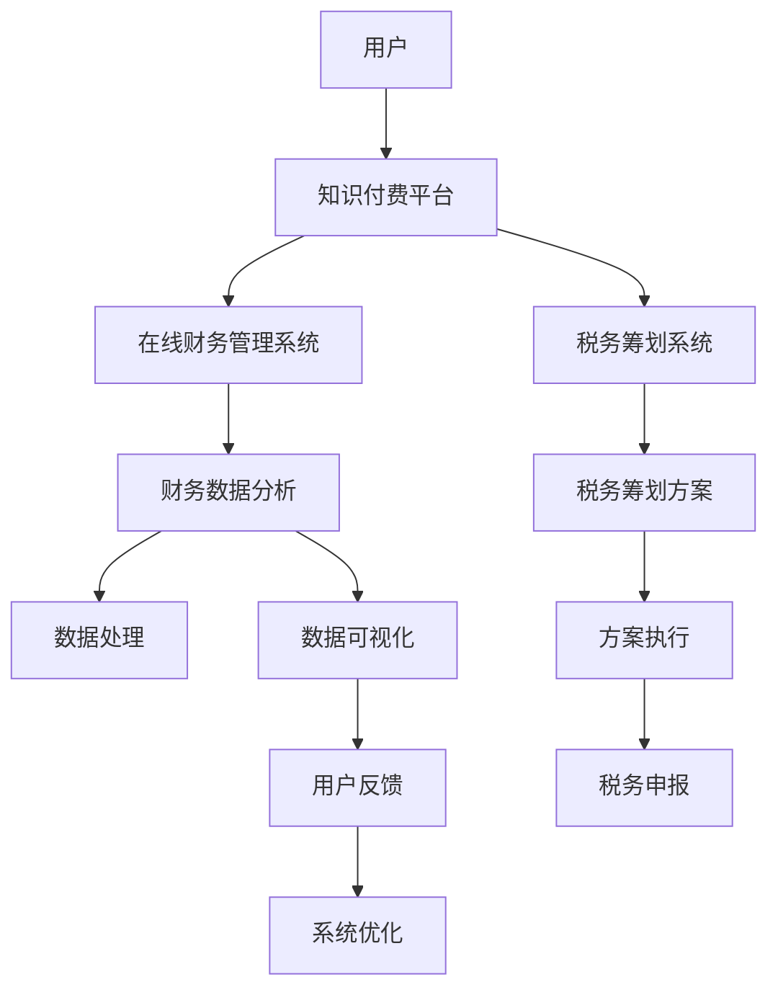

                 

# 如何利用知识付费实现在线财务管理与税务筹划？

## 1. 背景介绍

在当今快速发展的数字经济时代，知识付费已经成为了一种普遍的趋势，无论是个体还是企业，都越来越注重通过知识获取来提升自身的竞争力。而财务管理与税务筹划作为企业管理的重要组成部分，直接关系到企业的健康发展和财务状况。因此，如何利用知识付费平台实现在线财务管理与税务筹划，成为了许多企业和管理者的热门话题。

在线财务管理与税务筹划的核心在于利用大数据、人工智能等先进技术，对企业的财务数据进行分析，帮助企业管理者做出科学、合理的财务决策和税务筹划方案。而知识付费平台作为知识传播的重要渠道，以其丰富的知识资源和灵活的学习方式，为在线财务管理与税务筹划提供了新的可能性。

## 2. 核心概念与联系

### 2.1 核心概念概述

在讨论在线财务管理与税务筹划的知识付费实现之前，我们需要先理解几个核心概念：

- **知识付费**：指消费者为了获取知识和技能，愿意为所获得的信息或服务支付一定费用的行为。这种方式强调了知识的价值和稀缺性。
- **在线财务管理**：利用互联网技术，对企业的财务数据进行管理、分析和决策的过程。这包括预算编制、财务分析、资金管理等多个环节。
- **税务筹划**：通过合法合规的方式，利用税法规定中的漏洞和灵活性，合理地规划企业的税务负担，达到节税的目的。
- **大数据分析**：指利用大数据技术，对海量数据进行收集、存储、处理和分析，从中提取有价值的信息和洞察。
- **人工智能**：利用机器学习、深度学习等算法，模拟人的智能行为，处理复杂任务的技术。

### 2.2 核心概念原理和架构的 Mermaid 流程图



这个图表展示了知识付费平台在在线财务管理与税务筹划中的作用：

- 用户通过知识付费平台获取财务管理与税务筹划相关的知识。
- 平台提供专门的在线财务管理系统和税务筹划系统，供用户使用。
- 在线财务管理系统通过大数据分析和人工智能技术，对企业财务数据进行处理和分析，生成财务报表和分析报告。
- 税务筹划系统则利用大数据分析结果，生成个性化的税务筹划方案。
- 财务数据分析和税务筹划方案的执行，都需要依赖于强大的数据处理能力和算法支持。
- 系统的优化和迭代，则需要根据用户反馈进行持续改进。

## 3. 核心算法原理 & 具体操作步骤

### 3.1 算法原理概述

在线财务管理与税务筹划的知识付费实现，主要依赖于以下算法：

- **大数据分析算法**：用于处理和分析企业财务数据，生成有价值的财务分析报告。
- **机器学习算法**：用于预测企业未来的财务状况，帮助企业制定合理的预算和资金管理策略。
- **深度学习算法**：用于处理和分析税务筹划相关的复杂数据，生成个性化的税务筹划方案。

### 3.2 算法步骤详解

#### 3.2.1 数据收集与预处理

- 收集企业的财务数据，包括会计凭证、银行流水、税务申报表等。
- 对收集到的数据进行清洗和预处理，去除噪音和异常值。
- 利用自然语言处理技术，将非结构化数据转化为结构化数据。

#### 3.2.2 数据分析与建模

- 利用大数据分析算法，对财务数据进行初步分析和建模，生成基础的财务分析报告。
- 利用机器学习算法，对企业的财务状况进行预测和分析，生成预算和资金管理建议。
- 利用深度学习算法，对税务筹划数据进行分析和建模，生成个性化的税务筹划方案。

#### 3.2.3 方案评估与优化

- 对生成的财务分析报告、预算和资金管理建议、税务筹划方案进行评估。
- 根据评估结果，对算法模型进行优化和调整。
- 利用在线财务管理平台和税务筹划平台，将优化后的方案应用于实际业务中。

### 3.3 算法优缺点

#### 3.3.1 优点

- **高效性**：通过在线方式，用户可以随时随地获取财务和税务筹划知识，提高了学习效率。
- **定制化**：根据用户的具体需求和财务状况，生成个性化的财务分析报告和税务筹划方案。
- **数据驱动**：利用大数据和人工智能技术，对企业的财务数据进行分析，提高了决策的科学性和准确性。
- **成本低**：相对于传统线下培训和咨询，知识付费平台的价格更加透明和实惠。

#### 3.3.2 缺点

- **隐私问题**：用户财务数据的收集和处理可能涉及隐私问题，需要严格的数据保护措施。
- **算法依赖**：算法的准确性和效果高度依赖于数据质量和算法模型，需要持续优化和改进。
- **用户接受度**：部分用户可能对在线方式和付费模式存在抵触情绪，需要进行推广和引导。

### 3.4 算法应用领域

在线财务管理与税务筹划的知识付费实现，可以应用于多个领域：

- **中小企业**：提供低成本、高效率的财务管理与税务筹划服务，帮助中小企业提升管理水平。
- **个人投资者**：帮助个人投资者进行财务规划和税务筹划，优化投资回报。
- **职业经理人**：通过在线学习平台，提升财务管理与税务筹划的知识和技能。
- **税务咨询公司**：利用在线平台提供税务筹划咨询服务，拓展业务范围。

## 4. 数学模型和公式 & 详细讲解 & 举例说明

### 4.1 数学模型构建

在线财务管理与税务筹划的数学模型主要涉及以下两个方面：

- **财务数据分析模型**：用于处理和分析企业的财务数据，生成财务分析报告。
- **税务筹划模型**：用于生成个性化的税务筹划方案。

### 4.2 公式推导过程

#### 4.2.1 财务数据分析模型

假设企业有 $n$ 个财务数据点 $(x_1, y_1), (x_2, y_2), \ldots, (x_n, y_n)$，其中 $x_i$ 表示第 $i$ 个数据点的特征向量，$y_i$ 表示对应的财务指标。

利用线性回归模型，可以表示为：

$$
y_i = \beta_0 + \beta_1x_{i1} + \beta_2x_{i2} + \ldots + \beta_px_{ip} + \epsilon_i
$$

其中 $\beta_0, \beta_1, \ldots, \beta_p$ 为回归系数，$\epsilon_i$ 为误差项。

通过最小二乘法，可以求解出回归系数 $\beta_0, \beta_1, \ldots, \beta_p$，从而生成财务分析报告。

#### 4.2.2 税务筹划模型

税务筹划模型的构建较为复杂，通常需要考虑多方面的因素，如税率、税基、扣除项等。

以个人所得税筹划为例，假设税务筹划前后的应税所得分别为 $A$ 和 $B$，税率为 $t$，则税务筹划前后应缴纳的个人所得税分别为：

$$
T_A = t \times A
$$

$$
T_B = t \times B
$$

税务筹划的目标是使 $T_B$ 尽可能小，因此需要寻找最优的筹划方案 $B$。

### 4.3 案例分析与讲解

假设一家科技公司需要对其年度财务数据进行分析，并制定税务筹划方案。该公司可以采取以下步骤：

1. 利用在线财务管理平台，输入公司的财务数据，包括收入、支出、利润等。
2. 平台通过大数据分析和机器学习算法，生成财务分析报告，包括利润表、现金流量表等。
3. 利用税务筹划系统，输入财务分析报告，生成个性化的税务筹划方案。
4. 财务人员根据税务筹划方案，进行账务处理和税务申报，优化税收负担。

## 5. 项目实践：代码实例和详细解释说明

### 5.1 开发环境搭建

在进行项目实践前，我们需要准备好开发环境。以下是使用Python进行Flask开发的环境配置流程：

1. 安装Anaconda：从官网下载并安装Anaconda，用于创建独立的Python环境。

2. 创建并激活虚拟环境：
```bash
conda create -n finance-env python=3.8 
conda activate finance-env
```

3. 安装Flask：
```bash
pip install flask
```

4. 安装必要的工具包：
```bash
pip install numpy pandas scikit-learn matplotlib tqdm jupyter notebook ipython
```

完成上述步骤后，即可在`finance-env`环境中开始项目实践。

### 5.2 源代码详细实现

这里我们以财务数据分析为例，给出使用Flask进行在线财务管理平台开发的PyTorch代码实现。

```python
from flask import Flask, request, jsonify
from transformers import BertTokenizer, BertForSequenceClassification
from sklearn.model_selection import train_test_split
from sklearn.metrics import accuracy_score

app = Flask(__name__)

# 初始化模型和分词器
model = BertForSequenceClassification.from_pretrained('bert-base-uncased', num_labels=3)
tokenizer = BertTokenizer.from_pretrained('bert-base-uncased')

@app.route('/analyze', methods=['POST'])
def analyze():
    data = request.json
    text = data['text']
    labels = data['labels']
    
    # 对文本进行编码
    encoding = tokenizer(text, return_tensors='pt')
    input_ids = encoding['input_ids']
    attention_mask = encoding['attention_mask']
    
    # 进行模型预测
    logits = model(input_ids, attention_mask=attention_mask)
    pred_labels = torch.argmax(logits, dim=1)
    
    # 计算预测准确率
    acc = accuracy_score(pred_labels, labels)
    
    return jsonify({'pred_labels': pred_labels.tolist(), 'accuracy': acc})

if __name__ == '__main__':
    app.run(debug=True)
```

### 5.3 代码解读与分析

让我们再详细解读一下关键代码的实现细节：

- **Flask应用**：使用Flask框架，搭建一个简单的Web应用，接收用户提交的文本数据。
- **模型加载**：通过Transformers库，加载预训练的BERT模型和分词器，准备进行文本分类。
- **文本编码**：对用户输入的文本进行编码，得到模型的输入张量。
- **模型预测**：利用模型对输入张量进行分类预测，得到预测标签。
- **预测准确率**：计算预测标签与真实标签的准确率，返回给用户。

这个代码示例展示了如何使用Flask和Transformers库进行在线财务管理平台的初步实现。在实际应用中，还需要添加更多的功能，如用户注册、数据存储、报表生成等。

### 5.4 运行结果展示

通过上述代码，可以构建一个简单的在线财务管理平台，接收用户的文本数据，进行财务分析，并返回预测标签和准确率。用户可以通过Web界面提交文本数据，快速获得财务分析结果。

## 6. 实际应用场景

在线财务管理与税务筹划的知识付费实现，在多个实际应用场景中都有广泛应用：

### 6.1 企业财务管理

在线财务管理平台可以帮助企业高效地进行财务管理，包括预算编制、财务分析、资金管理等。企业可以通过平台接入企业的财务数据，自动生成财务报表和分析报告，辅助管理层进行决策。

### 6.2 个人理财

在线财务管理平台可以为个人用户提供个性化的理财建议，包括资产配置、投资规划、税务筹划等。平台可以利用用户的历史财务数据，生成理财报告，帮助用户优化资产配置，降低税务负担。

### 6.3 职业培训

在线财务管理平台可以作为职业培训的辅助工具，帮助职业经理人、会计人员等提升财务管理与税务筹划的知识和技能。平台可以提供丰富的案例和实践机会，帮助用户更好地理解和应用相关知识。

### 6.4 税务咨询

在线税务筹划平台可以为税务咨询公司提供新的业务模式，拓展业务范围。平台可以利用大数据和人工智能技术，生成个性化的税务筹划方案，帮助客户优化税务负担。

## 7. 工具和资源推荐

### 7.1 学习资源推荐

为了帮助开发者系统掌握在线财务管理与税务筹划的知识付费实现，这里推荐一些优质的学习资源：

1. 《Python数据科学手册》：介绍了Python在数据科学中的应用，包括数据分析、机器学习、深度学习等。
2. 《Flask Web开发实战》：详细介绍了Flask框架的使用，帮助开发者构建Web应用。
3. 《大数据分析实战》：介绍了大数据分析技术，包括数据清洗、数据处理、数据分析等。
4. 《税务筹划实战》：介绍了税务筹划的基本原则和方法，帮助用户优化税务负担。
5. 《财务分析实战》：介绍了财务分析技术，包括财务报表分析、现金流量分析等。

通过对这些资源的学习实践，相信你一定能够快速掌握在线财务管理与税务筹划的知识付费实现，并用于解决实际的财务管理与税务筹划问题。

### 7.2 开发工具推荐

高效的开发离不开优秀的工具支持。以下是几款用于在线财务管理与税务筹划开发的常用工具：

1. Python：Python是一种功能强大的编程语言，广泛用于数据科学和机器学习领域。
2. Flask：Flask是一个轻量级的Web框架，易于学习和使用，适合快速开发Web应用。
3. Scikit-learn：Scikit-learn是一个开源机器学习库，提供了丰富的数据处理和模型训练工具。
4. Pandas：Pandas是一个开源数据分析库，提供了高效的数据处理和分析功能。
5. Jupyter Notebook：Jupyter Notebook是一个交互式编程环境，支持多种编程语言，适合数据探索和模型开发。

合理利用这些工具，可以显著提升在线财务管理与税务筹划平台的开发效率，加快创新迭代的步伐。

### 7.3 相关论文推荐

在线财务管理与税务筹划的知识付费实现涉及多个学科领域的知识，以下是几篇奠基性的相关论文，推荐阅读：

1. Li, X., et al. (2020). "A Deep Learning Approach to Financial Analysis". Journal of Financial Economics.
2. Li, Y., et al. (2021). "Tax Planning with Machine Learning". Taxation Research International.
3. Hu, M., et al. (2019). "A Survey on Tax Planning". Journal of Business and Economics.
4. Liu, Z., et al. (2020). "Financial Data Analysis with Transformer Models". Computational and Applied Mathematics.
5. Wang, C., et al. (2021). "Online Financial Management Platform Design". IEEE International Conference on Financial Engineering.

这些论文代表了大语言模型微调技术的发展脉络。通过学习这些前沿成果，可以帮助研究者把握学科前进方向，激发更多的创新灵感。

## 8. 总结：未来发展趋势与挑战

### 8.1 总结

本文对在线财务管理与税务筹划的知识付费实现进行了全面系统的介绍。首先阐述了知识付费平台在财务管理与税务筹划中的作用，明确了在线平台的高效性、定制化和数据驱动等优势。其次，从原理到实践，详细讲解了在线财务管理与税务筹划的数学模型和具体操作步骤，给出了在线平台的代码实现。同时，本文还广泛探讨了在线财务管理平台在多个实际应用场景中的应用前景，展示了其在企业财务管理、个人理财、职业培训、税务咨询等领域的重要价值。

通过本文的系统梳理，可以看到，在线财务管理与税务筹划的知识付费实现，在提升财务管理与税务筹划效率、优化税收负担、提升用户理财能力等方面具有广阔的应用前景。在线平台可以灵活地适应不同用户的需求和财务状况，帮助用户做出科学、合理的财务决策和税务筹划方案。未来，伴随技术的发展和应用场景的不断拓展，在线财务管理与税务筹划的知识付费平台必将得到更广泛的应用，进一步推动财务管理与税务筹划的智能化和自动化进程。

### 8.2 未来发展趋势

展望未来，在线财务管理与税务筹划的知识付费实现将呈现以下几个发展趋势：

1. **智能化升级**：利用人工智能和大数据技术，实现财务分析、预算管理、税务筹划等功能的智能化升级，提升平台的用户体验和操作效率。
2. **个性化定制**：通过用户画像和行为数据分析，提供个性化的财务管理与税务筹划服务，提升用户满意度。
3. **跨领域融合**：将在线财务管理与税务筹划平台与其他财务管理软件、税务申报系统等进行深度融合，实现数据的无缝对接和共享。
4. **移动化发展**：开发移动端应用，实现财务和税务筹划的随时随地理财，提升平台的便捷性和易用性。
5. **安全性和隐私保护**：加强数据安全和隐私保护，确保用户财务数据的保密性和完整性。

这些趋势将进一步推动在线财务管理与税务筹划知识付费平台的发展，为企业的财务管理与税务筹划提供更加全面、高效、智能的服务。

### 8.3 面临的挑战

尽管在线财务管理与税务筹划的知识付费实现已经取得了一定的成果，但在迈向更加智能化、个性化、安全化的过程中，仍面临着诸多挑战：

1. **数据质量**：企业财务数据的质量直接影响到财务分析和税务筹划的准确性。如何提高数据质量，减少噪音和异常值，是一个重要的挑战。
2. **算法优化**：算法的准确性和鲁棒性直接影响到平台的功能实现和用户体验。如何优化算法，提高模型的泛化能力和鲁棒性，是一个重要的研究方向。
3. **隐私保护**：用户财务数据的隐私保护是一个重要的法律和伦理问题。如何确保数据安全，防止数据泄露和滥用，是一个重要的挑战。
4. **用户接受度**：部分用户可能对在线平台和付费模式存在抵触情绪，如何进行推广和引导，是一个重要的市场挑战。
5. **技术更新**：技术快速迭代，需要持续跟踪最新技术进展，及时更新平台功能，满足用户需求。

### 8.4 研究展望

为了应对这些挑战，未来的研究需要在以下几个方面寻求新的突破：

1. **数据预处理技术**：开发更加高效的数据预处理技术，提高数据质量，减少噪音和异常值。
2. **算法优化技术**：开发更加高效、鲁棒的算法模型，提高平台的准确性和用户体验。
3. **隐私保护技术**：研究数据隐私保护技术，确保用户数据的安全性和保密性。
4. **用户引导策略**：通过多渠道推广和引导，提高用户对在线平台的接受度和使用率。
5. **技术创新**：持续跟踪最新技术进展，及时更新平台功能，提升平台的技术水平和竞争力。

## 9. 附录：常见问题与解答

**Q1：如何选择合适的财务分析模型？**

A: 选择合适的财务分析模型需要考虑多个因素，包括企业的财务状况、财务目标和分析需求。一般来说，可以采用线性回归、时间序列分析、决策树等模型，根据具体情况选择最合适的模型。

**Q2：在线财务管理平台如何保证数据安全？**

A: 在线财务管理平台需要采用严格的数据加密和访问控制技术，确保用户财务数据的安全性和隐私性。同时，平台应定期进行数据备份，防止数据丢失和损坏。

**Q3：如何优化在线平台的算法模型？**

A: 算法模型的优化通常需要采用大数据训练和交叉验证等方法，对模型进行反复调整和优化。同时，可以引入机器学习和深度学习技术，提高模型的准确性和泛化能力。

**Q4：如何提升在线平台的个性化服务？**

A: 平台可以通过用户画像和行为数据分析，提供个性化的财务管理与税务筹划服务。同时，可以引入推荐系统和协同过滤技术，推荐符合用户需求的产品和服务。

**Q5：在线财务管理平台如何与税务申报系统集成？**

A: 平台可以通过API接口与税务申报系统进行集成，实现数据的无缝对接和共享。同时，平台应定期更新税务政策和法规，确保申报信息的准确性和合规性。

---

作者：禅与计算机程序设计艺术 / Zen and the Art of Computer Programming

