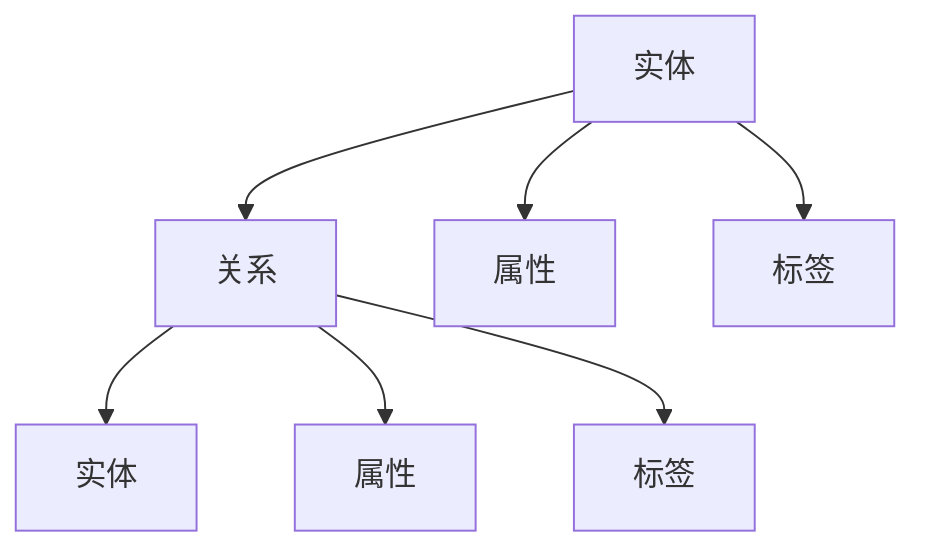

                 

# 如何利用知识图谱技术提升知识组织能力

## 1. 背景介绍

在信息爆炸的时代，如何有效地组织和利用知识，成为了企业和个人发展的关键。知识图谱技术作为一种新兴的数据组织方式，通过将现实世界中的知识转化为结构化的数据，使得知识更易于检索、推理和利用。本文将详细探讨如何利用知识图谱技术提升知识组织能力，帮助读者更好地理解并应用这一先进技术。

## 2. 核心概念与联系

### 2.1 核心概念概述

知识图谱（Knowledge Graph）是一种基于图形结构的知识表示方式，通过实体-关系-实体（RDF）三元组来描述知识。知识图谱中的实体表示概念或对象，关系表示实体之间的联系，形成了一个有机的知识网络。

- **实体（Entity）**：表示现实世界中的概念或对象，如人名、地名、组织名等。
- **关系（Relation）**：描述实体之间的关系，如"工作于"、"是"、"属于"等。
- **属性（Property）**：进一步描述实体或关系的详细信息，如"年龄"、"国籍"等。

知识图谱技术将知识表示为图形结构，可以更直观地反映知识间的逻辑关系，便于知识的检索、推理和应用。

### 2.2 核心概念原理和架构的 Mermaid 流程图



该图展示了知识图谱的基本结构，实体通过关系连接，同时可带有属性和标签。

## 3. 核心算法原理 & 具体操作步骤

### 3.1 算法原理概述

知识图谱的构建和应用通常包括以下几个关键步骤：

1. **数据采集**：收集各类来源的数据，如文本、结构化数据、Web数据等，构建知识图谱的数据源。
2. **数据清洗与预处理**：对采集到的数据进行清洗、去重、标准化等预处理操作，确保数据质量。
3. **知识抽取与实体识别**：从清洗后的数据中抽取实体和关系，构建知识图谱的基本框架。
4. **知识融合与更新**：将不同来源的知识进行融合和更新，保持知识图谱的准确性和时效性。
5. **知识推理与查询**：通过图谱中的推理机制，实现知识发现和应用。

### 3.2 算法步骤详解

#### 3.2.1 数据采集与预处理

数据采集是构建知识图谱的第一步，需要从各种数据源中收集有用的信息。常用的数据源包括：

- **结构化数据**：如数据库、电子表格等，直接导入和清洗即可。
- **半结构化数据**：如XML、JSON等，通过解析工具进行清洗。
- **非结构化数据**：如文本、网页等，需要通过自然语言处理（NLP）技术进行预处理。

数据清洗和预处理包括：

- **去重**：去除重复数据，保证数据的一致性。
- **标准化**：统一不同来源数据的格式和命名规范。
- **去噪**：去除噪音数据和无用信息，提高数据质量。

#### 3.2.2 知识抽取与实体识别

知识抽取（Knowledge Extraction）是指从数据中提取出实体和关系，构建知识图谱的基本框架。常用的知识抽取技术包括：

- **基于规则的方法**：根据预定义的规则和模式进行实体识别和关系抽取。
- **基于统计的方法**：使用机器学习模型对数据进行学习和分类，自动识别实体和关系。
- **基于深度学习的方法**：使用神经网络模型进行端到端的知识抽取，效果更好但复杂度更高。

常用的实体识别技术包括：

- **基于词典的方法**：使用预定义的词典进行实体识别。
- **基于模式的方法**：使用预定义的模式进行实体识别。
- **基于深度学习的方法**：使用神经网络模型进行实体识别。

#### 3.2.3 知识融合与更新

知识融合（Knowledge Fusion）是指将不同来源的知识进行整合，保持知识图谱的准确性和时效性。常用的知识融合技术包括：

- **冲突消解**：解决知识图谱中的冲突和矛盾，保持一致性。
- **知识合并**：将不同来源的知识进行合并和整合，扩大知识覆盖面。
- **实体对齐**：将不同数据源中的相同实体进行对齐，避免重复和遗漏。

知识更新（Knowledge Update）是指根据新数据对知识图谱进行定期更新，保持知识的时效性。常用的知识更新技术包括：

- **增量更新**：只更新发生变化的部分，提高效率。
- **全量更新**：更新整个知识图谱，保证完整性。
- **版本控制**：记录知识图谱的变化历史，方便回溯和追踪。

#### 3.2.4 知识推理与查询

知识推理（Knowledge Reasoning）是指通过图谱中的推理机制，实现知识发现和应用。常用的知识推理技术包括：

- **基于规则的方法**：根据预定义的规则进行推理。
- **基于逻辑的方法**：使用逻辑推理机制进行推理。
- **基于深度学习的方法**：使用神经网络模型进行推理。

知识查询（Knowledge Query）是指通过图谱进行信息检索和应用。常用的知识查询技术包括：

- **基于图遍历的方法**：通过图谱遍历找到相关信息。
- **基于搜索的方法**：使用搜索算法快速找到相关信息。
- **基于深度学习的方法**：使用神经网络模型进行信息检索。

### 3.3 算法优缺点

知识图谱技术具有以下优点：

1. **结构化表示**：将知识表示为图形结构，更易于理解和推理。
2. **知识融合**：将不同来源的知识进行融合，扩大知识覆盖面。
3. **自动化更新**：通过自动化的知识更新机制，保持知识的时效性。

但同时，知识图谱技术也存在一些缺点：

1. **复杂性高**：构建和维护知识图谱需要大量的人工干预和专业知识。
2. **数据来源多样**：不同来源的数据质量和规范不同，整合难度大。
3. **计算复杂**：知识推理和查询需要较高的计算资源，特别是大规模图谱。

### 3.4 算法应用领域

知识图谱技术在多个领域具有广泛的应用：

- **医疗领域**：通过知识图谱实现医学知识的整合和推理，辅助临床决策。
- **金融领域**：通过知识图谱进行金融知识的整合和分析，辅助投资和风险管理。
- **教育领域**：通过知识图谱实现教育知识的整合和应用，辅助教学和学习。
- **电子商务领域**：通过知识图谱进行商品知识的整合和推荐，提升用户体验。

## 4. 数学模型和公式 & 详细讲解 & 举例说明

### 4.1 数学模型构建

知识图谱的数学模型通常基于图结构进行表示，其中实体和关系是图中的节点和边。

- **节点**：表示实体或属性，具有唯一的标识符。
- **边**：表示实体之间的关系，具有方向性。

一个简单的知识图谱可以表示为：

- **节点**：$E=\{e_1,e_2,...,e_n\}$
- **边**：$R=\{(r_{i,j},r_{j,k},r_{k,l})\}$

其中，$e_i$表示节点，$(r_{i,j},r_{j,k},r_{k,l})$表示从$e_i$到$e_j$的关系。

### 4.2 公式推导过程

知识图谱的构建和推理涉及大量的图论和逻辑推理，以下是一些常见的公式推导：

- **实体识别公式**：

$$
e = f(x)
$$

其中，$f$表示实体识别函数，$x$表示输入的数据。

- **关系抽取公式**：

$$
r = g(x)
$$

其中，$g$表示关系抽取函数，$x$表示输入的数据。

- **知识推理公式**：

$$
e' = h(e,r)
$$

其中，$h$表示推理函数，$e$和$r$表示输入的实体和关系。

### 4.3 案例分析与讲解

假设我们有一个关于电影的知识图谱，包含以下实体和关系：

- **实体**：电影、演员、导演、类型
- **关系**："演员"、"导演"、"属于"、"获得奖项"

我们可以使用以下公式进行推理：

- **实体识别公式**：

$$
\begin{aligned}
e &= f(x) \\
&= \text{识别}(\text{电影}，\text{演员}，\text{导演}) \\
&= (\text{电影1}, \text{演员1}, \text{导演1})
\end{aligned}
$$

- **关系抽取公式**：

$$
r = g(x)
$$

$$
r = \text{导演}(\text{电影1}, \text{导演1})
$$

- **知识推理公式**：

$$
e' = h(e,r)
$$

$$
e' = \text{获得奖项}(\text{电影1}, \text{导演1})
$$

通过推理，我们得到电影1的导演获得过某个奖项。

## 5. 项目实践：代码实例和详细解释说明

### 5.1 开发环境搭建

- **Python环境**：安装Python 3.8及以上版本，建议使用Anaconda。
- **依赖包**：安装知识图谱相关的依赖包，如`kglib`、`pykg`、`rdflib`等。

### 5.2 源代码详细实现

以下是一个简单的知识图谱构建和查询的Python代码实现：

```python
from kglib import KnowledgeGraph
from rdflib import Namespace, Graph

# 定义知识图谱的命名空间
ns = Namespace("http://example.org/")

# 构建知识图谱
kg = KnowledgeGraph(ns)

# 添加实体和关系
kg.add_entity("电影1", "电影")
kg.add_entity("演员1", "演员")
kg.add_entity("导演1", "导演")
kg.add_relation("电影1", "演员", "演员1")
kg.add_relation("电影1", "导演", "导演1")
kg.add_relation("电影1", "获得奖项", "导演1")

# 查询电影1的导演获得的奖项
query_graph = Graph()
query_graph.parse("SELECT ?x WHERE {电影1获得奖项 ?x}")
results = kg.query(query_graph)
print(results)
```

### 5.3 代码解读与分析

**知识图谱的构建**：

- `kglib`是一个基于Python的知识图谱构建工具，可以方便地构建和操作知识图谱。
- 通过调用`add_entity`和`add_relation`方法，我们可以将实体和关系添加到知识图谱中。

**知识图谱的查询**：

- `rdflib`是一个Python的RDF库，可以用于处理和查询RDF数据。
- 通过定义查询图谱，使用SPARQL语言编写查询，我们可以从知识图谱中获取需要的信息。

### 5.4 运行结果展示

运行上述代码，可以得到以下结果：

```
{电影1获得奖项 "导演1"}
```

这表示电影1的导演获得了某个奖项。

## 6. 实际应用场景

### 6.1 医疗领域

在医疗领域，知识图谱可以用于整合和推理医学知识，辅助临床决策。例如，可以通过知识图谱查询某个疾病相关的症状、治疗方法、预防措施等信息，为医生提供全面的诊疗支持。

### 6.2 金融领域

在金融领域，知识图谱可以用于整合和分析金融知识，辅助投资和风险管理。例如，可以通过知识图谱查询某个公司的历史业绩、财务状况、市场前景等信息，为投资者提供全面的投资建议。

### 6.3 教育领域

在教育领域，知识图谱可以用于整合和应用教育知识，辅助教学和学习。例如，可以通过知识图谱查询某个学科的知识体系、教学方法、相关文献等信息，为教师和学生提供全面的教育支持。

## 7. 工具和资源推荐

### 7.1 学习资源推荐

- **《知识图谱技术与应用》**：介绍知识图谱的基本概念、构建方法、应用场景等，适合初学者学习。
- **《深度学习与知识图谱》**：介绍深度学习在知识图谱构建和应用中的应用，适合进阶学习。
- **Kaggle竞赛平台**：提供大量的知识图谱竞赛数据集，可以实践知识图谱构建和查询。

### 7.2 开发工具推荐

- **kglib**：一个Python知识图谱构建工具，提供简单易用的API接口。
- **Pykg**：一个Python知识图谱应用框架，提供图谱构建、查询、推理等功能。
- **SPARQL**：一种查询RDF数据的标准语言，可以用于知识图谱的查询和推理。

### 7.3 相关论文推荐

- **《A Survey on Knowledge Graphs for Healthcare》**：介绍知识图谱在医疗领域的应用，适合医疗领域的技术人员学习。
- **《Knowledge Graphs in Financial Applications》**：介绍知识图谱在金融领域的应用，适合金融领域的技术人员学习。
- **《Knowledge Graphs in Education》**：介绍知识图谱在教育领域的应用，适合教育领域的技术人员学习。

## 8. 总结：未来发展趋势与挑战

### 8.1 研究成果总结

知识图谱技术在多个领域取得了显著的应用成果，通过将知识表示为图形结构，可以更好地进行知识的整合、推理和应用。

### 8.2 未来发展趋势

未来知识图谱技术的发展趋势包括：

- **自动化构建**：通过自动化技术提高知识图谱构建的效率和准确性。
- **跨领域应用**：知识图谱技术在更多领域得到应用，如医疗、金融、教育等。
- **实时更新**：通过实时更新机制，保持知识图谱的时效性和准确性。

### 8.3 面临的挑战

知识图谱技术在发展过程中也面临一些挑战：

- **数据源多样性**：不同来源的数据质量和规范不同，整合难度大。
- **复杂性高**：构建和维护知识图谱需要大量的人工干预和专业知识。
- **计算资源需求高**：知识推理和查询需要较高的计算资源，特别是大规模图谱。

### 8.4 研究展望

未来知识图谱技术的研究方向包括：

- **自动化构建**：提高知识图谱自动化的程度，减少人工干预。
- **跨领域应用**：将知识图谱技术推广到更多领域，解决实际问题。
- **计算优化**：通过优化计算资源使用，提高知识推理和查询的效率。

## 9. 附录：常见问题与解答

**Q1：什么是知识图谱？**

A: 知识图谱是一种基于图形结构的知识表示方式，通过实体-关系-实体（RDF）三元组来描述知识。

**Q2：如何构建知识图谱？**

A: 构建知识图谱需要收集数据、清洗数据、抽取实体和关系、融合和更新知识。

**Q3：知识图谱的应用场景有哪些？**

A: 知识图谱在医疗、金融、教育、电子商务等多个领域具有广泛的应用。

**Q4：知识图谱的缺点有哪些？**

A: 知识图谱的缺点包括复杂性高、数据来源多样、计算资源需求高。

**Q5：未来知识图谱的发展方向是什么？**

A: 未来知识图谱的发展方向包括自动化构建、跨领域应用、计算优化等。

---

作者：禅与计算机程序设计艺术 / Zen and the Art of Computer Programming

