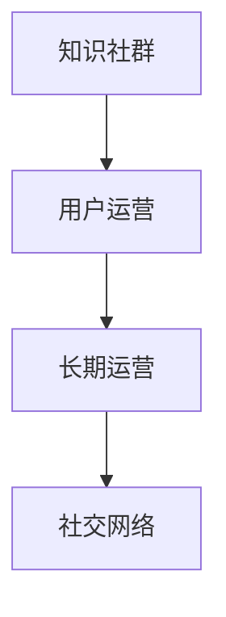

                 

# 如何利用知识社群实现用户的长期运营

> 关键词：知识社群,用户运营,长期运营,用户黏性,社交网络

## 1. 背景介绍

在数字经济时代，用户运营成为了企业获取竞争优势的关键。传统的营销手段如付费广告、直邮等成本高昂，效果也不确定。相比之下，基于知识社群的用户运营方式，不仅成本低，而且能够更好地提升用户黏性和忠诚度。通过知识社群，企业不仅能够吸引用户关注，更能够提供持续价值，留住现有用户，防止流失。

知识社群是一种基于共同兴趣或需求的网络社区，用户在其中分享、交流和学习知识。相比传统的论坛、贴吧等社区形式，知识社群具有更强的互动性、专业性和内容质量。典型的知识社群平台如知乎、Slack、GitHub等，正在成为企业用户运营的新途径。

## 2. 核心概念与联系

### 2.1 核心概念概述

要充分理解如何利用知识社群实现用户的长期运营，首先需要明确几个核心概念：

- **知识社群**：基于共同兴趣、专业领域或业务需求的网络社区，用户在其中分享、交流和学习知识。知识社群往往拥有丰富的内容资源和专业用户，能够吸引和留存高质量用户。

- **用户运营**：通过有效的手段和管理策略，吸引新用户，维护现有用户，提升用户满意度和忠诚度。用户运营是企业获取竞争优势的重要手段，能够帮助企业构建稳定用户基础，提升品牌价值。

- **长期运营**：用户运营的一个关键目标是实现用户的长期留存和忠诚度提升。相比短期的广告效应，长期运营更注重与用户的深度互动和持续价值提供。

- **社交网络**：社交网络是用户交流和互动的主要形式，具有很强的用户粘性和社群效应。知识社群是社交网络的一个细分形式，更注重知识分享和专业交流。

这些概念之间的逻辑关系可以通过以下Mermaid流程图来展示：



## 3. 核心算法原理 & 具体操作步骤

### 3.1 算法原理概述

基于知识社群的用户运营，本质上是利用社群的社交网络效应，通过持续的知识分享和学习，吸引和保留用户。这一过程可以概括为以下几个关键步骤：

1. **内容创建与分享**：知识社群的核心是高质量的内容资源。通过用户自主创建和分享内容，社群能够不断丰富其知识库。
2. **互动与交流**：通过互动和交流机制，增强社群的凝聚力和用户粘性。
3. **价值提供**：持续提供有价值的内容和服务，满足用户需求，提升用户满意度和忠诚度。
4. **反馈与改进**：通过用户反馈不断改进社群运营策略，实现良性循环。

### 3.2 算法步骤详解

基于知识社群的用户运营可以分为以下几个关键步骤：

**Step 1: 内容激励与平台建设**
- 设计合理的激励机制，鼓励用户自主创建和分享内容。激励方式包括积分奖励、荣誉认证、话题热门等。
- 建设易于使用的知识共享平台，如论坛、问答社区等，提供便捷的发布和阅读功能。

**Step 2: 用户互动与社区管理**
- 设计丰富的互动机制，如评论、点赞、私信等，增强社群的活跃度。
- 引入社区管理机制，如版主、审核等，维护社群的健康有序。

**Step 3: 持续价值提供**
- 定期发布有价值的内容，如深度分析、专家讲座、行业趋势等，满足用户需求。
- 提供个性化推荐和搜索功能，方便用户获取所需知识。

**Step 4: 用户反馈与改进**
- 建立用户反馈机制，收集用户意见和建议，及时改进社群运营策略。
- 分析用户行为数据，优化内容推荐算法，提升用户体验。

**Step 5: 社区生态构建**
- 引入关键意见领袖(KOL)和专家，提升社群权威性和内容质量。
- 开展社群活动，如线上沙龙、线下聚会等，增强社群凝聚力。

以上是基于知识社群的用户运营的一般流程。在实际应用中，还需要根据具体平台和用户特点，对各个环节进行优化设计，如引入专业领域专家、优化用户行为分析等，以进一步提升社群的用户粘性和运营效果。

### 3.3 算法优缺点

利用知识社群进行用户运营，有以下几个显著的优点：

1. **成本低**：相比传统的广告手段，知识社群的用户运营成本较低，能够以较低的投入获得较高的用户价值。
2. **用户粘性高**：社群的社交网络效应能够增强用户粘性，提高用户留存率。
3. **用户价值高**：通过高质量的内容和专业交流，社群能够提供持续的价值，提升用户满意度和忠诚度。
4. **用户互动性强**：丰富的互动机制能够增强用户的参与感和归属感，提升社群的活跃度。

同时，这一方法也存在一些局限性：

1. **内容质量依赖用户**：社群的运营效果高度依赖于用户的内容创作和互动，如果用户活跃度不高，社群的运营效果可能大打折扣。
2. **管理难度大**：社群的管理和维护需要投入大量的人力和精力，如果管理不当，社群可能会出现内容质量下降、用户体验差等问题。
3. **平台依赖性强**：社群运营依赖于平台的技术架构和用户体验，平台的不稳定可能影响社群的正常运作。
4. **用户行为复杂**：用户行为复杂多变，社群运营者需要持续跟踪用户反馈，及时调整策略，才能保持社群的健康发展。

尽管存在这些局限性，但知识社群的用户运营方法在实际应用中已经展现出了显著的效果，成为企业用户运营的重要手段。未来相关研究的重点在于如何进一步提升社群的用户粘性、优化内容质量和互动机制，同时兼顾平台稳定性和用户行为管理，以实现更高的用户价值和运营效果。

### 3.4 算法应用领域

基于知识社群的用户运营方法，已经在多个行业领域得到了广泛应用，如科技、教育、金融、医疗等。以下是几个典型的应用场景：

- **科技行业**：如GitHub、Stack Overflow等，通过技术交流和代码分享，提升开发者社区的活跃度和专业性。
- **教育行业**：如Coursera、edX等，通过在线课程和讨论区，提供持续学习支持和互动交流。
- **金融行业**：如雪球、豆瓣财经等，通过市场分析和投资交流，提升用户的专业水平和决策能力。
- **医疗行业**：如丁香园、医学界等，通过医学知识和病例讨论，提升医生和患者的健康意识和医疗水平。
- **生活服务**：如美团、大众点评等，通过用户评价和经验分享，提升服务质量和用户满意度。

## 4. 数学模型和公式 & 详细讲解

### 4.1 数学模型构建

为了更好地理解知识社群的用户运营机制，本节将使用数学语言对相关模型进行建模。

假设知识社群中用户数为 $N$，内容量为 $C$，互动频率为 $I$。则知识社群的用户运营效果可以表示为以下数学模型：

$$
E = f(N, C, I, X)
$$

其中 $X$ 为社群的运营策略，包括内容激励、互动机制、价值提供、用户反馈等。

### 4.2 公式推导过程

为了更好地理解上述模型的含义，我们可以通过简单的推导来解释。

假设用户每个时间单位内可以生成 $c$ 篇内容，参与互动的概率为 $p$，对内容质量的要求为 $q$。则社群的总内容量 $C$ 和互动频率 $I$ 可以表示为：

$$
C = \sum_{t=0}^{T} c \cdot p^t
$$

$$
I = \sum_{t=0}^{T} p^t \cdot (1-q)
$$

其中 $T$ 为时间单位数。

根据上述推导，我们可以看到，社群的内容量和互动频率与内容生成率、互动概率、内容质量要求等因素密切相关。用户运营的目标是最大化社群效果 $E$，因此需要优化 $N, C, I, X$ 等参数，以提升用户满意度和忠诚度。

### 4.3 案例分析与讲解

**案例1: GitHub的用户运营**
GitHub是一个著名的开发者社区，通过代码分享和协作，吸引了大量高质量用户。GitHub的用户运营策略包括：
1. 内容激励：GitHub通过“Stars”（星标）、“Forks”（分叉）等机制，鼓励开发者分享和参与开源项目。
2. 互动机制：GitHub提供丰富的评论、Issue（问题）、Pull Request（代码合并请求）等互动功能，增强用户粘性。
3. 价值提供：GitHub通过市场化的“付费计划”，提供高级功能和服务，满足不同用户需求。
4. 用户反馈：GitHub定期收集用户反馈，优化产品功能和用户体验。

**案例2: 知乎的问答社区**
知乎是一个知识分享和问答社区，通过高质量的内容和专业交流，吸引了大量知识型用户。知乎的用户运营策略包括：
1. 内容激励：知乎通过“赞同”、“评论”、“热门话题”等机制，鼓励用户创作和参与讨论。
2. 互动机制：知乎提供丰富的评论、私信、投票等互动功能，增强用户粘性。
3. 价值提供：知乎通过商业化的“会员制度”，提供高级功能和增值服务，提升用户满意度。
4. 用户反馈：知乎定期收集用户反馈，优化社区运营和算法推荐。

通过上述案例，我们可以看到，知识社群的用户运营策略可以因地制宜，根据平台和用户特点进行优化设计。

## 5. 项目实践：代码实例和详细解释说明

### 5.1 开发环境搭建

在进行用户运营实践前，我们需要准备好开发环境。以下是使用Python进行Django开发的环境配置流程：

1. 安装Anaconda：从官网下载并安装Anaconda，用于创建独立的Python环境。

2. 创建并激活虚拟环境：
```bash
conda create -n django-env python=3.8 
conda activate django-env
```

3. 安装Django：从官网获取安装命令。例如：
```bash
pip install django
```

4. 安装各种库：
```bash
pip install Pillow markdown Django REST framework django-website-finder django-model-utils django-crispy-forms django-uuidfield
```

5. 安装各类工具包：
```bash
pip install django-admin-assets django-assets django-templated
```

完成上述步骤后，即可在`django-env`环境中开始用户运营实践。

### 5.2 源代码详细实现

这里我们以知乎问答社区为例，给出使用Django框架进行知识社群构建的PyTorch代码实现。

首先，定义社区模型：

```python
from django.db import models

class Community(models.Model):
    name = models.CharField(max_length=255)
    description = models.TextField()
    owner = models.ForeignKey(User, on_delete=models.CASCADE)
    created_at = models.DateTimeField(auto_now_add=True)
```

然后，定义用户模型：

```python
from django.contrib.auth.models import AbstractUser

class User(AbstractUser):
    def save(self, *args, **kwargs):
        self.activities = models.ManyToManyField(Community, through='UserActivity')
        super().save(*args, **kwargs)
```

接着，定义活动模型：

```python
class UserActivity(models.Model):
    user = models.ForeignKey(User, on_delete=models.CASCADE)
    community = models.ForeignKey(Community, on_delete=models.CASCADE)
    activity_type = models.CharField(max_length=255)
    activity_date = models.DateTimeField(auto_now_add=True)
```

最后，定义视图函数：

```python
from django.shortcuts import render
from .models import Community, UserActivity

def community_list(request):
    communities = Community.objects.all().order_by('-created_at')
    return render(request, 'community_list.html', {'communities': communities})
```

完成上述步骤后，即可在`community_list`视图中展示社区列表。

### 5.3 代码解读与分析

让我们再详细解读一下关键代码的实现细节：

**Community类**：
- `__init__`方法：定义社区的基本属性，如名称、描述、创建时间等。
- `save`方法：在用户创建或更新时，自动记录用户的活动信息，构建用户与社区的关联关系。

**User类**：
- 继承Django的内置User模型，并重写`save`方法，记录用户的活动信息。

**UserActivity类**：
- `__init__`方法：定义活动的基本属性，如用户、社区、活动类型、创建时间等。

**社区列表视图**：
- 查询社区列表，并按创建时间排序。
- 渲染视图，展示社区列表。

可以看到，Django框架使得社区构建和用户运营的代码实现变得简洁高效。开发者可以将更多精力放在业务逻辑和用户体验上，而不必过多关注底层的实现细节。

当然，工业级的系统实现还需考虑更多因素，如模型的保存和部署、超参数的自动搜索、更灵活的社区管理等。但核心的用户运营逻辑基本与此类似。

## 6. 实际应用场景

### 6.1 科技社区

科技社区如GitHub、Stack Overflow等，通过代码分享和协作，吸引了大量高质量用户。这些社区不仅提供了技术交流的平台，还通过内容激励、互动机制、价值提供、用户反馈等手段，不断提升用户粘性和满意度。例如，GitHub通过"Stars"（星标）、"Forks"（分叉）等机制，鼓励开发者分享和参与开源项目，并通过付费计划提供高级功能和服务，满足不同用户需求。

### 6.2 教育平台

教育平台如Coursera、edX等，通过在线课程和讨论区，提供持续学习支持和互动交流。这些平台通过奖励机制、互动功能、个性化推荐等手段，增强用户的学习兴趣和参与度。例如，Coursera通过在线课程和社区讨论，提供高质量的教育资源，并通过奖励机制和互动功能，提升用户的学习体验和参与度。

### 6.3 金融社区

金融社区如雪球、豆瓣财经等，通过市场分析和投资交流，提升用户的专业水平和决策能力。这些社区通过专家讲座、数据分析、投资策略等手段，提供持续的价值支持，并通过付费会员、商业广告等形式，满足不同用户需求。例如，雪球通过市场分析和投资交流，提供专业的金融知识，并通过付费会员和商业广告，提升用户的专业水平和决策能力。

### 6.4 医疗平台

医疗平台如丁香园、医学界等，通过医学知识和病例讨论，提升医生和患者的健康意识和医疗水平。这些平台通过专家讲座、医学知识分享、病例讨论等手段，提供高质量的医疗资源，并通过社区活动、知识付费等形式，满足不同用户需求。例如，丁香园通过医学知识和病例讨论，提供高质量的医疗知识，并通过社区活动和知识付费，提升用户的健康意识和医疗水平。

### 6.5 生活服务平台

生活服务平台如美团、大众点评等，通过用户评价和经验分享，提升服务质量和用户满意度。这些平台通过用户评价和推荐、社区互动等手段，增强用户粘性，并通过积分奖励、优惠券等形式，提升用户的参与度和满意度。例如，美团通过用户评价和推荐，提升服务质量和用户满意度，并通过积分奖励和优惠券，增强用户的参与度和忠诚度。

## 7. 工具和资源推荐

### 7.1 学习资源推荐

为了帮助开发者系统掌握知识社群的用户运营理论基础和实践技巧，这里推荐一些优质的学习资源：

1. 《社区运营实战手册》系列博文：由社区运营专家撰写，深入浅出地介绍了社区运营的各个环节和策略，涵盖内容激励、互动机制、价值提供、用户反馈等。

2. Coursera《社区管理与运营》课程：通过Lecture视频和配套作业，带你系统学习社区运营的基本概念和经典案例。

3. GitHub《开发者社区运营指南》书籍：详细介绍了GitHub社区的运营策略和成功案例，提供了丰富的实践参考。

4. Medium《社区运营的科学与艺术》系列文章：通过作者的实践经验和理论思考，深入探讨社区运营的各个方面，既有理论深度又有实用技巧。

5. 知乎官方博客：知乎社区的运营团队定期发布博客，分享运营经验和方法，帮助你更好地理解和运用知识社群的用户运营策略。

通过对这些资源的学习实践，相信你一定能够快速掌握知识社群的用户运营精髓，并用于解决实际的社区运营问题。

### 7.2 开发工具推荐

高效的开发离不开优秀的工具支持。以下是几款用于知识社群构建和用户运营开发的常用工具：

1. Django：基于Python的开源Web框架，提供了便捷的Web开发和数据库管理功能，适合快速迭代研究。

2. Flask：基于Python的轻量级Web框架，简单易用，灵活高效，适合小规模社区构建和微服务开发。

3. React：基于JavaScript的前端框架，支持丰富的用户界面和交互功能，适合构建动态社区页面和活动展示。

4. Bootstrap：流行的前端CSS框架，提供了丰富的样式和组件，适合快速构建美观的社区界面。

5. Markdown：轻量级文本标记语言，支持富文本格式，适合用于知识分享和文档编辑。

6. Django REST framework：Django的RESTful API框架，支持JSON数据格式，适合构建社区API接口。

合理利用这些工具，可以显著提升知识社群构建和用户运营的开发效率，加快创新迭代的步伐。

### 7.3 相关论文推荐

知识社群的用户运营技术源于学界的持续研究。以下是几篇奠基性的相关论文，推荐阅读：

1. "Online Community Dynamics and Evolution"：探讨在线社区的形成、演化和用户行为模式，提供了社区运营的理论基础。

2. "Community Knowledge Sharing and Interaction in Online Learning Platforms"：研究在线学习平台的知识共享和用户互动，提出社区运营的最佳实践。

3. "User Engagement in Online Communities: An Empirical Study"：通过实证研究，分析用户在线社区的参与度和影响因素，提供社区运营的策略参考。

4. "Designing Effective Social Features for Online Communities"：探讨社区互动机制的设计和实现，提出社区运营的实用技巧。

5. "Community Recommendation Systems: Survey and Future Directions"：研究社区推荐系统的算法和应用，提供社区运营的推荐工具支持。

这些论文代表了大规模用户运营的研究进展，通过学习这些前沿成果，可以帮助研究者把握学科前进方向，激发更多的创新灵感。

## 8. 总结：未来发展趋势与挑战

### 8.1 总结

本文对知识社群的用户运营方法进行了全面系统的介绍。首先阐述了知识社群在用户运营中的重要性，明确了其通过高质量内容、互动交流和持续价值提供等手段，提升用户黏性和忠诚度的独特价值。其次，从原理到实践，详细讲解了知识社群的用户运营机制，给出了知识社群构建和用户运营的完整代码实例。同时，本文还广泛探讨了知识社群在科技、教育、金融、医疗等多个行业领域的应用前景，展示了知识社群的用户运营潜力。此外，本文精选了知识社群的用户运营相关学习资源，力求为读者提供全方位的技术指引。

通过本文的系统梳理，可以看到，知识社群的用户运营方法正在成为企业用户运营的重要手段，极大地拓展了用户运营的边界，催生了更多的落地场景。利用知识社群，企业不仅能够吸引新用户，更能够提供持续价值，留住现有用户，防止流失。未来，伴随知识社群技术的持续演进，必将有更多的企业和行业受益于这一创新的用户运营范式。

### 8.2 未来发展趋势

展望未来，知识社群的用户运营技术将呈现以下几个发展趋势：

1. **个性化推荐系统的优化**：未来的知识社群将通过更精确的个性化推荐系统，提升用户的体验和满意度，增强用户粘性。
2. **互动机制的丰富化**：社区将引入更多互动机制，如直播、视频会议、虚拟现实等，增强用户沉浸感和互动性。
3. **数据驱动的社区管理**：通过大数据分析，实时监控和优化社区运营策略，提升社区的健康度和活跃度。
4. **多模态内容整合**：未来的知识社群将整合文本、图像、视频等多种内容形式，提供更加丰富和多样的知识体验。
5. **社交网络与知识社群的融合**：未来的知识社群将与社交网络平台深度融合，形成更紧密的社群生态。
6. **人工智能的引入**：通过引入AI技术，如自然语言处理、推荐系统、内容生成等，提升社区运营的智能化水平。

以上趋势凸显了知识社群的用户运营技术的广阔前景。这些方向的探索发展，必将进一步提升知识社群的用户价值和运营效果，为企业的用户运营提供更强大和灵活的工具。

### 8.3 面临的挑战

尽管知识社群的用户运营技术已经取得了瞩目成就，但在迈向更加智能化、普适化应用的过程中，它仍面临着诸多挑战：

1. **用户活跃度的管理**：社群的运营效果高度依赖于用户活跃度，如何提升用户参与度和留存率，仍是一大难题。
2. **内容质量的保障**：高质量的内容是社群的核心，如何激励用户创作高质量内容，避免垃圾信息泛滥，需要持续优化。
3. **社区管理的复杂性**：社区管理需要投入大量的人力和精力，如何通过技术手段自动化社区管理，降低管理成本，需要不断创新。
4. **平台稳定性的提升**：社群的正常运作依赖于平台的稳定性和用户体验，如何提升平台的性能和可靠性，需要持续投入资源。
5. **用户行为预测的难度**：用户行为复杂多变，如何通过模型预测用户行为，优化社区运营策略，需要更多理论和实践的积累。

尽管存在这些挑战，但知识社群的用户运营方法在实际应用中已经展现出了显著的效果，成为企业用户运营的重要手段。未来相关研究的重点在于如何进一步提升社群的用户粘性、优化内容质量和互动机制，同时兼顾平台稳定性和用户行为管理，以实现更高的用户价值和运营效果。

### 8.4 研究展望

面对知识社群用户运营所面临的种种挑战，未来的研究需要在以下几个方面寻求新的突破：

1. **智能推荐系统的优化**：开发更加精确和个性化的推荐算法，提升用户满意度。
2. **动态内容生成与更新**：引入动态内容生成机制，实时更新社区内容，保持内容的新鲜性和多样性。
3. **社区管理工具的引入**：开发社区管理工具，自动化社区审核和用户管理，降低运营成本。
4. **多模态内容的管理与展示**：整合文本、图像、视频等多种内容形式，提供更加丰富和多样的知识体验。
5. **人工智能技术的引入**：引入AI技术，如自然语言处理、推荐系统、内容生成等，提升社区运营的智能化水平。
6. **用户行为预测的改进**：开发更加准确的用户行为预测模型，优化社区运营策略。

这些研究方向将进一步推动知识社群的用户运营技术发展，为企业的用户运营提供更强大和灵活的工具。通过技术创新和持续优化，知识社群将能够更好地吸引和留住用户，提升用户的满意度和忠诚度，成为企业用户运营的重要手段。

## 9. 附录：常见问题与解答

**Q1：如何衡量知识社群的用户运营效果？**

A: 知识社群的用户运营效果可以通过以下指标进行衡量：
1. 用户留存率：衡量用户在社群中停留的时间长度。
2. 用户活跃度：衡量用户在社群中的活跃程度，如访问次数、参与互动等。
3. 内容质量：衡量社群中内容的高质量程度，如投票支持、评论反馈等。
4. 社区满意度：通过问卷调查等方式，收集用户对社区的满意度评价。

**Q2：知识社群中的内容激励机制有哪些？**

A: 知识社群中的内容激励机制可以包括：
1. 点赞、评论、分享等社交激励。
2. 积分奖励、徽章认证等积分激励。
3. 热门话题、精选回答等话题激励。
4. 付费会员、广告投放等商业激励。

**Q3：知识社群中的互动机制有哪些？**

A: 知识社群中的互动机制可以包括：
1. 评论、点赞、分享等基本互动。
2. 私信、语音聊天等高级互动。
3. 问答、直播、视频会议等多样化互动。

**Q4：知识社群中的价值提供有哪些形式？**

A: 知识社群中的价值提供可以包括：
1. 高质量的内容，如深度分析、专家讲座、行业趋势等。
2. 个性化推荐，如内容推荐、用户推荐等。
3. 商业服务，如付费会员、广告投放等。

**Q5：知识社群中的社区管理有哪些策略？**

A: 知识社群中的社区管理可以包括：
1. 版主审核机制，防止垃圾信息。
2. 用户反馈机制，收集用户意见和建议。
3. 用户行为监控，防止恶意行为。

通过对这些问题的解答，相信你能够更好地理解知识社群的用户运营策略，并在实际应用中灵活运用。

---

作者：禅与计算机程序设计艺术 / Zen and the Art of Computer Programming

