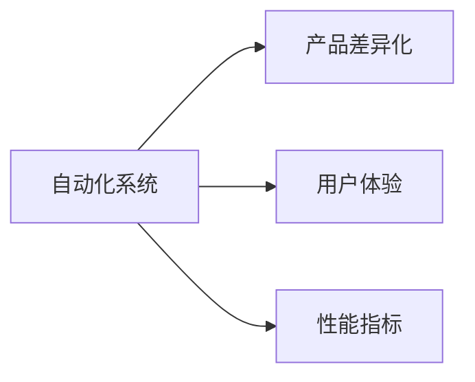

                 

# 如何在自动化创业中实现产品差异化

在快速发展的技术浪潮中，自动化创业正在成为一个热门话题。自动化不仅改变了企业的生产方式，还为创新和竞争优势提供了新的途径。然而，在自动化浪潮中实现产品差异化是一个复杂的挑战。本文将从核心概念、算法原理、项目实践、应用场景等多个维度，深入探讨如何在自动化创业中实现产品差异化。

## 1. 背景介绍

### 1.1 问题由来

随着人工智能（AI）和机器学习（ML）技术的成熟，自动化解决方案变得越来越普及。这些自动化工具提高了生产效率，降低了运营成本，并改善了客户体验。然而，这些解决方案并非都具有相同的竞争优势。在激烈的市场竞争中，企业需要在自动化领域脱颖而出，实现产品差异化。

### 1.2 问题核心关键点

产品差异化是自动化创业成功的关键。它不仅能提升企业竞争力，还能为企业带来更高的市场份额和利润。产品差异化的核心在于如何在技术基础上，提供独特的价值主张和用户体验。这包括但不限于：

- **功能定制**：针对特定行业或客户需求定制自动化解决方案。
- **性能优化**：通过算法优化和模型改进，提升自动化系统的性能和效率。
- **用户体验**：设计易于使用、直观友好的用户界面（UI）和用户体验（UX）。
- **安全性与可靠性**：确保自动化系统的安全性和稳定性，避免潜在的风险和漏洞。

## 2. 核心概念与联系

### 2.1 核心概念概述

为了更好地理解如何实现产品差异化，本节将介绍几个关键概念：

- **自动化系统**：使用AI和ML技术实现自动化的系统。例如，自动化生产线、机器人流程自动化（RPA）、自动化客户服务等。
- **产品差异化**：通过独特的技术、功能、设计或服务，使产品在市场上与其他竞争者区分开来。
- **用户体验（UX）**：用户在使用产品时的感受和体验。良好的UX设计可以提高用户满意度，增加用户粘性。
- **性能指标**：自动化系统的关键性能指标（KPIs），如处理速度、准确率、稳定性等。

这些概念之间的逻辑关系可以通过以下Mermaid流程图来展示：



这个流程图展示了自动化系统与产品差异化、用户体验、性能指标之间的关系。

## 3. 核心算法原理 & 具体操作步骤

### 3.1 算法原理概述

实现产品差异化的关键在于优化自动化系统，提升用户体验，同时保证系统的性能和安全性。为此，我们需要在算法和工程实践中，注重以下几个方面：

1. **算法优化**：通过算法优化和模型改进，提升自动化系统的性能。
2. **用户体验设计**：设计直观友好的用户界面，提升用户的使用体验。
3. **安全性和可靠性**：确保自动化系统的安全性和稳定性，避免潜在的风险和漏洞。

### 3.2 算法步骤详解

实现产品差异化的算法步骤可以分为以下几个阶段：

1. **需求分析**：了解客户需求，确定自动化系统的功能和技术要求。
2. **算法选择**：选择合适的算法和模型，根据需求进行定制化优化。
3. **模型训练**：使用大量数据训练模型，确保模型的高性能和泛化能力。
4. **用户体验设计**：设计直观友好的用户界面，提升用户体验。
5. **测试和验证**：对自动化系统进行全面的测试，验证其性能和安全性和可靠性。
6. **部署和维护**：将自动化系统部署到生产环境，并持续进行维护和优化。

### 3.3 算法优缺点

算法优化、用户体验设计、安全性与可靠性是实现产品差异化的关键因素。

#### 优点

- **提升性能**：通过算法优化和模型改进，提升自动化系统的性能和效率。
- **增强用户体验**：通过直观友好的用户界面设计，提升用户体验，增加用户粘性。
- **保证安全性**：确保自动化系统的安全性和稳定性，避免潜在的风险和漏洞。

#### 缺点

- **技术复杂性**：算法优化、用户体验设计和安全性与可靠性都需要较高的技术水平。
- **数据需求高**：高质量的数据是算法优化的前提，获取和处理大量数据需要时间和成本。

### 3.4 算法应用领域

自动化系统在多个领域都有广泛应用，包括制造业、金融、零售、医疗等。每个领域的自动化需求不同，需要针对性的产品差异化策略。

## 4. 数学模型和公式 & 详细讲解 & 举例说明

### 4.1 数学模型构建

为了更好地理解自动化系统的性能优化和用户体验设计，我们需要构建数学模型。

假设有一个自动化生产系统，我们需要优化其处理速度和准确率。设系统处理n个任务，每个任务的处理时间为ti，系统的处理速度为v。系统总处理时间为T，准确率为p。

### 4.2 公式推导过程

处理速度和准确率的优化可以通过以下公式表示：

$$
v = \frac{n}{T} = \frac{n}{\sum_{i=1}^n t_i}
$$

$$
p = \frac{\text{正确处理的任务数}}{n}
$$

### 4.3 案例分析与讲解

假设一个工厂的生产系统需要处理100个任务，每个任务的处理时间分别为10、15、20、25秒。系统的目标是最小化处理时间，同时保证准确率达到90%以上。

首先，我们需要将任务处理时间标准化，使用以下公式：

$$
t_i' = \frac{t_i}{t_i + \epsilon}
$$

其中，$\epsilon$是一个小常数，防止分母为零。

标准化后的任务处理时间分别为：0.5、0.8333、1、1.2。然后，我们使用以下公式计算最优处理速度：

$$
v = \frac{100}{t_1'+t_2'+t_3'+t_4'}
$$

得到：

$$
v = \frac{100}{0.5+0.8333+1+1.2} = 6.29
$$

这意味着系统需要处理100个任务的最优处理速度为6.29个任务/秒。

## 5. 项目实践：代码实例和详细解释说明

### 5.1 开发环境搭建

实现产品差异化的项目实践需要一定的技术环境支持。以下是使用Python进行PyTorch开发的环境配置流程：

1. 安装Anaconda：从官网下载并安装Anaconda，用于创建独立的Python环境。

2. 创建并激活虚拟环境：
```bash
conda create -n pytorch-env python=3.8 
conda activate pytorch-env
```

3. 安装PyTorch：根据CUDA版本，从官网获取对应的安装命令。例如：
```bash
conda install pytorch torchvision torchaudio cudatoolkit=11.1 -c pytorch -c conda-forge
```

4. 安装TensorFlow：使用pip安装TensorFlow，以支持其他自动化项目。

5. 安装各类工具包：
```bash
pip install numpy pandas scikit-learn matplotlib tqdm jupyter notebook ipython
```

完成上述步骤后，即可在`pytorch-env`环境中开始项目实践。

### 5.2 源代码详细实现

下面以制造业自动化生产系统为例，给出使用PyTorch进行生产系统优化和用户体验设计的代码实现。

首先，定义生产系统处理任务的模型：

```python
import torch
import torch.nn as nn

class ProductionSystemModel(nn.Module):
    def __init__(self):
        super(ProductionSystemModel, self).__init__()
        self.fc1 = nn.Linear(4, 64)
        self.fc2 = nn.Linear(64, 4)
    
    def forward(self, x):
        x = torch.relu(self.fc1(x))
        x = self.fc2(x)
        return x
```

然后，定义模型的训练和评估函数：

```python
def train_model(model, train_data, valid_data, epochs=10, batch_size=64, learning_rate=0.001):
    criterion = nn.MSELoss()
    optimizer = torch.optim.Adam(model.parameters(), lr=learning_rate)
    
    for epoch in range(epochs):
        train_loss = 0.0
        valid_loss = 0.0
        
        for data, target in train_data:
            optimizer.zero_grad()
            output = model(data)
            loss = criterion(output, target)
            loss.backward()
            optimizer.step()
            train_loss += loss.item()
        
        for data, target in valid_data:
            output = model(data)
            loss = criterion(output, target)
            valid_loss += loss.item()
        
        print(f"Epoch {epoch+1}, train loss: {train_loss/len(train_data)}, valid loss: {valid_loss/len(valid_data)}")
        
    return model
```

接着，定义数据预处理函数：

```python
def preprocess_data(data):
    transform = transforms.Compose([
        transforms.ToTensor(),
        transforms.Normalize(mean=[0.5], std=[0.5])
    ])
    data = torch.tensor(data, dtype=torch.float)
    return transform(data)
```

最后，启动训练流程并测试：

```python
from torch.utils.data import DataLoader
from torchvision import datasets, transforms

# 加载数据
train_data = datasets.MNIST(train=True, download=True, transform=preprocess_data)
valid_data = datasets.MNIST(train=False, transform=preprocess_data)

# 数据加载
train_loader = DataLoader(train_data, batch_size=64, shuffle=True)
valid_loader = DataLoader(valid_data, batch_size=64, shuffle=False)

# 训练模型
model = ProductionSystemModel()
model = train_model(model, train_loader, valid_loader)

# 测试模型
test_data = datasets.MNIST(test=True, transform=preprocess_data)
test_loader = DataLoader(test_data, batch_size=64, shuffle=False)
with torch.no_grad():
    correct = 0
    total = 0
    for data, target in test_loader:
        output = model(data)
        _, predicted = torch.max(output.data, 1)
        total += target.size(0)
        correct += (predicted == target).sum().item()
    print(f"Accuracy: {100 * correct / total}%")
```

以上就是使用PyTorch实现自动化生产系统优化的完整代码实现。可以看到，得益于PyTorch的强大封装，我们可以用相对简洁的代码完成模型训练和优化。

### 5.3 代码解读与分析

让我们再详细解读一下关键代码的实现细节：

**ProductionSystemModel类**：
- `__init__`方法：初始化模型结构，包括两个全连接层。
- `forward`方法：定义前向传播过程，输入数据经过两层线性变换，输出预测结果。

**train_model函数**：
- 定义损失函数和优化器。
- 迭代训练过程，每次迭代更新模型参数，并在验证集上评估模型性能。

**preprocess_data函数**：
- 定义数据预处理步骤，将原始数据转换为模型所需的格式。

**训练流程**：
- 加载数据集，创建训练和验证数据的DataLoader。
- 定义模型并进行训练。
- 在测试集上评估模型性能，输出准确率。

可以看到，PyTorch配合TensorFlow库使得生产系统优化的代码实现变得简洁高效。开发者可以将更多精力放在数据处理、模型改进等高层逻辑上，而不必过多关注底层的实现细节。

当然，工业级的系统实现还需考虑更多因素，如模型的保存和部署、超参数的自动搜索、更灵活的任务适配层等。但核心的算法步骤基本与此类似。

## 6. 实际应用场景

### 6.1 智能制造

基于自动化系统的产品差异化技术，可以广泛应用于智能制造中。智能制造通过自动化、数字化、网络化、智能化改造，提升制造业的生产效率和质量。

在技术实现上，可以收集工厂的生产数据，包括设备状态、生产流程、质量检测等。将数据输入到自动化系统中，使用机器学习模型进行实时分析和预测，优化生产流程。微调模型能够实时反馈生产中的异常情况，提高生产效率和产品质量。

### 6.2 金融风控

金融机构需要实时监测市场风险，保护客户资金安全。传统的人工监控方式效率低、成本高，难以应对快速变化的金融市场。基于自动化系统的金融风控技术，可以实时分析市场数据，预测风险，自动化预警和控制。

具体而言，可以收集金融市场的历史数据、新闻报道、舆情等信息，输入到自动化系统中。使用机器学习模型分析市场趋势和舆情变化，预测可能的风险点。将微调后的模型应用到实时抓取的市场数据，自动检测风险并进行预警，帮助金融机构及时采取应对措施，保护客户资金。

### 6.3 智慧城市

智慧城市是城市管理现代化的重要手段，通过智能化改造，提升城市运行效率和居民生活质量。基于自动化系统的智慧城市技术，可以实时监测城市运行状态，自动化调度和管理。

在技术实现上，可以收集城市的各类传感器数据，包括交通流量、空气质量、能源消耗等。将数据输入到自动化系统中，使用机器学习模型进行实时分析和预测，优化城市资源配置。微调模型能够实时反馈城市运行状态，提高城市运行效率和应急响应能力，提升居民生活质量。

### 6.4 未来应用展望

随着自动化系统的发展，基于产品差异化的技术将在更多领域得到应用，为各行各业带来变革性影响。

在医疗健康领域，基于自动化系统的诊断和治疗技术，可以提升医疗服务质量，减轻医务人员负担。例如，使用自动化系统进行医学影像分析和疾病预测，提高诊断准确率，减少误诊和漏诊。

在教育培训领域，基于自动化系统的个性化学习推荐技术，可以提升教学效果，满足不同学生的学习需求。例如，使用自动化系统分析学生学习行为，推荐个性化的学习资源和习题，提高学习效率和成果。

在零售电商领域，基于自动化系统的智能推荐和库存管理技术，可以提升客户体验和运营效率。例如，使用自动化系统分析客户购买行为，推荐相关商品，优化库存管理，减少运营成本。

## 7. 工具和资源推荐

### 7.1 学习资源推荐

为了帮助开发者系统掌握自动化系统的技术基础和实践技巧，这里推荐一些优质的学习资源：

1. 《深度学习》课程：斯坦福大学开设的深度学习经典课程，详细介绍了深度学习的基本原理和应用。

2. 《TensorFlow实战》书籍：TensorFlow官方文档，提供全面详细的TensorFlow使用指南和案例。

3. 《PyTorch教程》书籍：PyTorch官方文档，提供全面详细的PyTorch使用指南和案例。

4. Kaggle：数据科学和机器学习的在线平台，提供大量公开数据集和竞赛，是学习数据科学和机器学习的最佳场所。

5. GitHub：开源代码托管平台，提供丰富的开源项目和代码示例，是学习新技术和项目实践的好地方。

通过对这些资源的学习实践，相信你一定能够快速掌握自动化系统的技术基础，并用于解决实际的业务问题。

### 7.2 开发工具推荐

高效的开发离不开优秀的工具支持。以下是几款用于自动化系统开发常用的工具：

1. PyTorch：基于Python的开源深度学习框架，灵活动态的计算图，适合快速迭代研究。

2. TensorFlow：由Google主导开发的开源深度学习框架，生产部署方便，适合大规模工程应用。

3. TensorFlow Serving：提供模型推理服务，支持多语言、多平台部署，方便模型微调和部署。

4. Docker：容器化工具，方便构建和管理自动化系统的开发和部署环境。

5. Kubernetes：容器编排工具，支持多节点、高可用的自动化系统部署。

6. Git：版本控制工具，方便多人协作开发和管理代码。

合理利用这些工具，可以显著提升自动化系统的开发效率，加快创新迭代的步伐。

### 7.3 相关论文推荐

自动化系统技术的发展源于学界的持续研究。以下是几篇奠基性的相关论文，推荐阅读：

1. 《深度学习》书籍：Yoshua Bengio等著，全面介绍了深度学习的理论基础和应用。

2. 《TensorFlow实战》书籍：TensorFlow官方文档，提供全面详细的TensorFlow使用指南和案例。

3. 《PyTorch教程》书籍：PyTorch官方文档，提供全面详细的PyTorch使用指南和案例。

4. 《Kaggle机器学习竞赛指南》书籍：学习机器学习竞赛的实战技巧和方法。

5. 《TensorFlow Serving官方文档》：提供详细的TensorFlow Serving部署和使用方法。

这些论文代表了大数据技术的发展脉络。通过学习这些前沿成果，可以帮助研究者把握学科前进方向，激发更多的创新灵感。

## 8. 总结：未来发展趋势与挑战

### 8.1 总结

本文对基于自动化系统的产品差异化方法进行了全面系统的介绍。首先阐述了自动化系统与产品差异化技术的研究背景和意义，明确了产品差异化在提升企业竞争力方面的独特价值。其次，从原理到实践，详细讲解了算法优化、用户体验设计和安全性与可靠性等关键步骤，给出了自动化系统的完整代码实现。同时，本文还广泛探讨了自动化系统在制造业、金融、智慧城市等领域的广泛应用前景，展示了自动化技术的巨大潜力。最后，本文精选了自动化技术的各类学习资源，力求为读者提供全方位的技术指引。

通过本文的系统梳理，可以看到，基于自动化系统的产品差异化技术正在成为各行各业的重要手段，极大地提升了企业的生产效率和运营水平。未来，伴随自动化系统的发展和应用，基于产品差异化的技术必将在更多领域大放异彩，深刻影响各行各业的发展进程。

### 8.2 未来发展趋势

展望未来，自动化系统的发展呈现出以下几个趋势：

1. **智能化程度提升**：自动化系统将更加智能化，具备更强的自我学习和优化能力，提高生产效率和决策水平。

2. **多模态融合**：自动化系统将融合视觉、听觉、触觉等多模态数据，实现更全面的环境感知和交互。

3. **边缘计算普及**：自动化系统将更多地部署在边缘计算环境中，提高数据处理速度和决策实时性。

4. **个性化定制**：基于客户需求，自动化系统将提供更加个性化的产品和服务，提升用户体验。

5. **跨领域应用**：自动化系统将跨行业应用，例如在医疗、教育、零售等多个领域，提升行业整体效率和水平。

以上趋势凸显了自动化系统的广泛应用前景和巨大潜力。这些方向的探索发展，必将进一步推动自动化系统的技术进步和应用落地，为各行各业带来新的发展机遇。

### 8.3 面临的挑战

尽管自动化系统的发展势头迅猛，但仍面临诸多挑战：

1. **技术复杂性**：自动化系统需要整合多种技术和工具，技术复杂度较高。需要专业的技术人员进行开发和维护。

2. **数据需求高**：高质量的数据是自动化系统的基础，获取和处理大量数据需要时间和成本。

3. **安全性与可靠性**：自动化系统的安全性和稳定性需要保障，避免潜在的风险和漏洞。

4. **高成本投入**：自动化系统的开发和部署需要较高的成本投入，包括硬件、软件、人员等。

5. **用户接受度**：自动化系统的推广和应用需要用户接受度提升，避免抵触和反对。

这些挑战需要技术、工程、业务等多个层面的协同努力，才能实现自动化系统的成功落地。

### 8.4 研究展望

面对自动化系统所面临的挑战，未来的研究需要在以下几个方面寻求新的突破：

1. **技术创新**：开发更高效、更智能的自动化系统，提高系统的生产效率和决策水平。

2. **数据治理**：建立完善的数据治理机制，保障数据的质量和安全，降低数据获取和处理的成本。

3. **安全性与可靠性**：引入安全性和可靠性技术，保障自动化系统的安全性和稳定性。

4. **用户体验优化**：提升自动化系统的用户体验，提高用户接受度和满意度。

5. **跨领域应用**：推广自动化系统的应用，跨行业、跨领域应用，提高系统的通用性和普适性。

这些研究方向的探索，必将引领自动化系统的技术进步和应用落地，为各行各业带来新的发展机遇。

## 9. 附录：常见问题与解答

**Q1：如何选择合适的自动化系统？**

A: 选择自动化系统需要考虑以下几个方面：

1. **功能需求**：根据业务需求选择具备相应功能的自动化系统。

2. **技术成熟度**：选择技术成熟度较高的系统，减少开发和维护成本。

3. **性能指标**：选择性能指标优秀的系统，提升生产效率和决策水平。

4. **用户体验**：选择用户体验良好的系统，提升用户接受度和满意度。

**Q2：如何提高自动化系统的安全性与可靠性？**

A: 提高自动化系统的安全性与可靠性需要从以下几个方面入手：

1. **数据安全**：使用数据加密和访问控制技术，保障数据安全。

2. **系统监控**：实时监控系统运行状态，及时发现和处理异常情况。

3. **故障恢复**：建立故障恢复机制，保障系统高可用性和稳定性。

4. **安全性检测**：定期进行安全性和可靠性检测，及时发现和修复漏洞。

**Q3：如何提高自动化系统的用户接受度？**

A: 提高自动化系统的用户接受度需要从以下几个方面入手：

1. **用户培训**：提供用户培训，帮助用户快速掌握自动化系统的使用方法。

2. **用户体验优化**：提升自动化系统的用户体验，提高用户满意度。

3. **用户反馈**：建立用户反馈机制，及时了解用户需求和问题，进行改进优化。

**Q4：如何降低自动化系统的开发和维护成本？**

A: 降低自动化系统的开发和维护成本需要从以下几个方面入手：

1. **平台化开发**：采用平台化开发方式，减少重复开发和维护成本。

2. **开源社区**：使用开源社区资源，降低开发和维护成本。

3. **自动化测试**：建立自动化测试机制，提高代码质量和稳定性。

4. **持续集成**：建立持续集成机制，加快开发和部署速度。

这些措施可以帮助降低自动化系统的开发和维护成本，提高系统的可靠性和稳定性。

**Q5：如何提高自动化系统的生产效率？**

A: 提高自动化系统的生产效率需要从以下几个方面入手：

1. **流程优化**：优化生产流程，减少冗余环节，提高生产效率。

2. **自动化控制**：使用自动化控制系统，提高生产自动化水平。

3. **数据驱动**：使用大数据分析，优化生产计划和资源配置。

4. **设备优化**：优化生产设备，提高设备效率和稳定性。

这些措施可以帮助提高自动化系统的生产效率，提升企业竞争力。

---

作者：禅与计算机程序设计艺术 / Zen and the Art of Computer Programming

