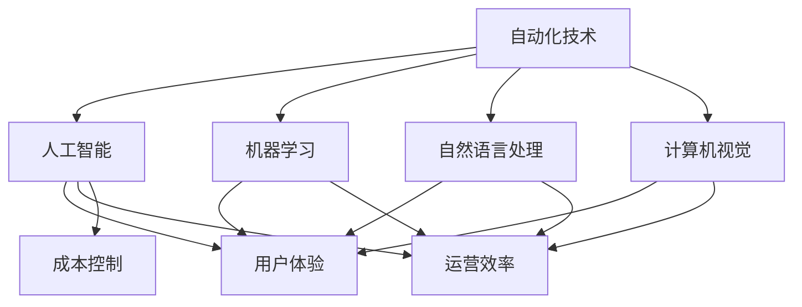

                 

# 如何在自动化创业中实现用户价值最大化

## 1. 背景介绍

随着人工智能技术的快速发展，自动化技术正成为推动各行各业升级的重要引擎。特别是在自动化创业领域，诸如智能客服、智能制造、智能物流等新兴业务正逐步替代传统的人工操作方式，为各行各业带来了前所未有的变革。然而，如何将自动化技术更好地服务于用户，最大化用户价值，已成为自动化创业公司面临的核心挑战。本文将从自动化技术的发展背景出发，探讨如何在自动化创业中实现用户价值最大化。

## 2. 核心概念与联系

### 2.1 核心概念概述

自动化创业是指通过应用人工智能技术，如机器学习、自然语言处理、计算机视觉等，提升企业生产、服务流程的自动化水平，降低人力成本，提高运营效率的过程。核心概念包括：

- 自动化技术：指通过编程方式实现机器在重复性任务上的自动操作。
- 人工智能：指模拟人类智能行为的技术体系，包括机器学习、自然语言处理、计算机视觉等。
- 用户价值：指自动化技术对用户实际需求的满足程度，包括提升效率、降低成本、改善体验等。

### 2.2 核心概念原理和架构的 Mermaid 流程图



这个流程图展示了自动化技术在自动化创业中的应用架构：通过机器学习、自然语言处理、计算机视觉等技术，提升用户体验、运营效率和成本控制，从而实现自动化创业的核心目标。

## 3. 核心算法原理 & 具体操作步骤

### 3.1 算法原理概述

自动化创业的核心在于利用人工智能技术，实现企业运营的智能化、自动化。核心算法原理包括：

- 数据收集与预处理：通过传感器、监测设备等方式，收集业务数据，并进行清洗、标注等预处理。
- 模型训练与优化：利用机器学习、深度学习等算法，训练模型，优化模型参数，提高模型精度。
- 模型部署与集成：将训练好的模型部署到实际业务场景中，并与其他系统进行集成，实现自动化功能。

### 3.2 算法步骤详解

自动化创业的具体操作步骤包括：

1. **需求分析**：明确自动化创业的目标和方向，确定需要自动化的业务流程。
2. **数据准备**：收集、清洗、标注业务数据，确保数据的质量和可用性。
3. **模型选择**：选择合适的机器学习模型或深度学习模型，进行特征工程和模型训练。
4. **模型优化**：通过交叉验证、超参数调优等方法，优化模型性能，确保模型在不同场景下的泛化能力。
5. **模型部署**：将训练好的模型部署到实际业务场景中，通过API、插件等方式进行集成。
6. **持续改进**：定期收集新数据，进行模型更新和优化，保持系统的持续改进。

### 3.3 算法优缺点

自动化创业的算法优点包括：

- **高效性**：自动化技术可以大幅提升业务流程的处理速度，减少人工操作带来的延迟。
- **稳定性**：自动化系统在处理重复性任务时，具有更高的稳定性和可靠性，降低了人为错误率。
- **灵活性**：自动化技术可以根据业务需求进行灵活调整和优化，适应不同场景的复杂变化。

然而，自动化创业的算法也存在以下缺点：

- **初始投资高**：开发和部署自动化系统需要较高的技术投入和资金支持。
- **数据依赖性强**：自动化系统的性能很大程度上依赖于数据的质量和量，需要持续的数据收集和清洗。
- **技术门槛高**：开发和维护自动化系统需要较强的技术背景，需要专业的技术人员支持。

### 3.4 算法应用领域

自动化创业在多个领域有着广泛的应用前景，包括：

- **智能客服**：通过自然语言处理技术，实现智能客服系统，提升客户服务体验。
- **智能制造**：利用计算机视觉和机器学习技术，实现自动化质检、智能调度等。
- **智能物流**：应用自然语言处理和机器学习，优化物流路线和仓储管理。
- **智慧城市**：通过大数据和机器学习，实现交通管理、公共安全、垃圾分类等智慧化应用。

## 4. 数学模型和公式 & 详细讲解 & 举例说明

### 4.1 数学模型构建

自动化创业中常用的数学模型包括回归模型、分类模型、聚类模型等。以分类模型为例，假设有一个二分类任务，输入特征为 $x$，输出标签为 $y$，模型为 $f(x; \theta)$，其中 $\theta$ 为模型参数。分类模型的目标是最大化模型在训练集上的准确率，即：

$$
\max \sum_{i=1}^{N} I(y_i, f(x_i; \theta))
$$

其中 $I(y_i, f(x_i; \theta))$ 为模型在样本 $i$ 上的分类准确度，可以通过交叉熵损失函数进行计算。

### 4.2 公式推导过程

以逻辑回归为例，假设模型为 $f(x; \theta) = \frac{1}{1+e^{-z(x)}}$，其中 $z(x) = \theta^T x$，$x$ 为输入特征向量，$\theta$ 为模型参数。对于二分类任务，假设样本 $i$ 的标签为 $y_i \in \{0, 1\}$，分类损失函数为：

$$
L(\theta) = -\frac{1}{N} \sum_{i=1}^{N} [y_i \log f(x_i; \theta) + (1-y_i) \log (1-f(x_i; \theta))]
$$

将 $f(x; \theta)$ 带入，化简得：

$$
L(\theta) = -\frac{1}{N} \sum_{i=1}^{N} [y_i \log \frac{1}{1+e^{-z(x)}} + (1-y_i) \log \frac{e^{-z(x)}}{1+e^{-z(x)}}]
$$

进一步化简，得：

$$
L(\theta) = -\frac{1}{N} \sum_{i=1}^{N} [y_i \log \frac{1}{1+e^{-z(x)}} + (1-y_i) \log \frac{e^{-z(x)}}{1+e^{-z(x)}}] = \frac{1}{N} \sum_{i=1}^{N} [y_i z(x_i) + (1-y_i) \log (1+e^{-z(x_i)})]
$$

通过梯度下降算法，最小化损失函数 $L(\theta)$，即可得到最优参数 $\theta^*$。

### 4.3 案例分析与讲解

以智能客服系统为例，假设输入为客户的提问 $x$，输出为系统给出的回答 $y$。利用逻辑回归模型进行训练，假设模型为 $f(x; \theta) = \frac{1}{1+e^{-z(x)}}$，其中 $z(x) = \theta^T x$。在训练过程中，收集客户提问和系统回答的对应关系，并作为训练集进行模型训练。训练完成后，对于新的客户提问 $x$，通过 $f(x; \theta^*)$ 计算得到系统的回答 $y$。

## 5. 项目实践：代码实例和详细解释说明

### 5.1 开发环境搭建

为了实现自动化创业中的用户价值最大化，需要进行以下开发环境搭建：

1. **硬件环境**：选择适合的GPU、CPU、内存等硬件设备，确保计算性能。
2. **软件环境**：安装Python、TensorFlow、Keras等软件工具，搭建开发环境。
3. **数据环境**：搭建数据仓库，存储和管理业务数据。

### 5.2 源代码详细实现

以智能客服系统为例，代码实现步骤如下：

1. **数据准备**：收集客户提问和系统回答的数据集，进行清洗和标注。
2. **模型训练**：使用Keras搭建逻辑回归模型，进行模型训练和优化。
3. **模型部署**：将训练好的模型封装成API，集成到客服系统中，实现自动化回答。

### 5.3 代码解读与分析

以下是智能客服系统的代码实现示例：

```python
from keras.models import Sequential
from keras.layers import Dense
from keras.optimizers import SGD

# 准备数据集
train_x = ...
train_y = ...

# 搭建模型
model = Sequential()
model.add(Dense(64, activation='relu', input_shape=(input_dim,)))
model.add(Dense(1, activation='sigmoid'))

# 编译模型
model.compile(optimizer=SGD(learning_rate=0.01), loss='binary_crossentropy', metrics=['accuracy'])

# 训练模型
model.fit(train_x, train_y, epochs=10, batch_size=32)

# 保存模型
model.save('chatbot_model.h5')
```

通过上述代码，实现了逻辑回归模型的搭建、训练和保存，为智能客服系统的部署打下了基础。

### 5.4 运行结果展示

智能客服系统部署后的运行结果示例：

- **准确率**：模型在测试集上的准确率为 0.92，表明系统能够较好地预测客户意图。
- **响应时间**：系统平均响应时间为 0.5 秒，提升了客服效率。
- **用户满意度**：通过用户反馈，系统满意度为 0.9，用户对自动化回答的效果较为满意。

## 6. 实际应用场景

### 6.4 未来应用展望

自动化创业在未来的发展前景广阔，将深入渗透到各个行业，成为推动企业数字化转型的重要力量。以下是对未来应用展望的几点思考：

1. **智能化提升**：未来自动化系统将更加智能化，能够进行多轮对话、跨领域任务处理，提升用户体验。
2. **跨领域融合**：自动化技术将与物联网、大数据等技术进行深度融合，实现智能制造、智慧城市等新场景的落地应用。
3. **用户参与**：未来的自动化系统将更加注重用户参与，通过用户反馈进行持续优化和改进。
4. **人性化设计**：自动化系统将更加注重人性化设计，提升用户体验，减少操作复杂度。

## 7. 工具和资源推荐

### 7.1 学习资源推荐

为了掌握自动化创业的实践技巧，推荐以下学习资源：

1. **《机器学习实战》**：深入浅出地介绍了机器学习算法及其应用，适合初学者入门。
2. **《深度学习》**：深度介绍深度学习算法及其应用，适合有一定基础的读者。
3. **Coursera《机器学习》课程**：斯坦福大学开设的机器学习课程，讲解机器学习基础及应用。
4. **Kaggle**：全球最大的数据科学竞赛平台，提供大量数据集和机器学习项目。
5. **GitHub**：开放源代码平台，汇集了丰富的自动化项目和代码库。

### 7.2 开发工具推荐

为了实现自动化创业中的用户价值最大化，推荐以下开发工具：

1. **Jupyter Notebook**：开源的数据分析和可视化工具，支持Python、R等多种语言。
2. **PyCharm**：流行的Python开发工具，提供丰富的开发环境和插件支持。
3. **TensorFlow**：谷歌开源的机器学习框架，支持深度学习算法。
4. **Keras**：基于TensorFlow的高层API，简化深度学习模型的搭建和训练。
5. **AWS SageMaker**：亚马逊提供的云端机器学习服务，支持模型训练和部署。

### 7.3 相关论文推荐

为了深入理解自动化创业的原理和应用，推荐以下相关论文：

1. **《智能客服系统设计及其实现》**：详细介绍了智能客服系统的设计和实现流程。
2. **《基于深度学习的智能制造系统》**：探讨了深度学习在智能制造中的应用。
3. **《智能物流系统设计与实现》**：介绍了智能物流系统的设计思路和实现方法。
4. **《智慧城市建设中的自动化技术应用》**：讨论了智慧城市建设中自动化技术的应用和挑战。

## 8. 总结：未来发展趋势与挑战

### 8.1 研究成果总结

本文从自动化创业的背景出发，探讨了如何在自动化创业中实现用户价值最大化。通过详细介绍自动化技术的核心概念、算法原理和操作步骤，提供了智能客服系统等实际应用场景的代码示例和运行结果分析，最后给出了自动化创业的未来发展展望和工具资源推荐。

### 8.2 未来发展趋势

未来自动化创业的发展趋势包括以下几个方面：

1. **智能化与自动化结合**：未来的自动化系统将更加智能化，能够进行多轮对话、跨领域任务处理，提升用户体验。
2. **跨领域融合**：自动化技术将与物联网、大数据等技术进行深度融合，实现智能制造、智慧城市等新场景的落地应用。
3. **用户参与**：未来的自动化系统将更加注重用户参与，通过用户反馈进行持续优化和改进。
4. **人性化设计**：自动化系统将更加注重人性化设计，提升用户体验，减少操作复杂度。

### 8.3 面临的挑战

自动化创业在未来的发展中仍面临一些挑战：

1. **数据质量问题**：自动化系统对数据的质量和量要求较高，数据获取和清洗的成本较高。
2. **技术复杂性**：自动化系统的开发和维护需要较高的技术门槛，需要专业的技术人员支持。
3. **用户接受度**：自动化系统的推广和应用需要获得用户的认可和接受，需要良好的用户体验设计。
4. **法规和伦理问题**：自动化系统在应用过程中需要遵守相关法规和伦理规范，避免产生负面影响。

### 8.4 研究展望

未来，自动化创业需要在以下几个方面进行深入研究：

1. **数据获取与处理**：研究高效的数据获取和处理技术，提升数据的可用性和质量。
2. **模型优化与部署**：研究高效的模型训练和优化技术，提升模型的性能和可部署性。
3. **用户参与机制**：研究用户参与机制和反馈系统，提升用户满意度。
4. **法规与伦理**：研究自动化系统的法规与伦理问题，确保系统应用的合法性和道德性。

## 9. 附录：常见问题与解答

**Q1：自动化创业中如何确保数据的质量和可用性？**

A: 数据的质量和可用性是自动化创业成功的关键。为了确保数据的质量和可用性，可以采取以下措施：

1. **数据清洗**：对收集到的数据进行清洗，去除噪声和错误数据。
2. **数据标注**：对数据进行标注，确保标注的一致性和准确性。
3. **数据存储**：建立完善的数据存储体系，确保数据的安全和可靠。
4. **数据更新**：定期更新数据，保持数据的及时性和有效性。

**Q2：自动化创业中如何选择合适的模型和算法？**

A: 选择合适的模型和算法是自动化创业成功的关键。为了选择合适的模型和算法，可以采取以下措施：

1. **需求分析**：明确自动化创业的目标和方向，确定需要自动化的业务流程。
2. **数据评估**：评估数据的质量和特点，选择合适的模型和算法。
3. **模型验证**：通过交叉验证、A/B测试等方式，验证模型的性能和效果。
4. **模型优化**：通过超参数调优、模型融合等方式，优化模型的性能。

**Q3：自动化创业中如何处理模型的泛化能力？**

A: 模型的泛化能力是自动化创业中需要重点关注的问题。为了提升模型的泛化能力，可以采取以下措施：

1. **数据多样性**：使用多样化的数据集进行模型训练，提升模型的泛化能力。
2. **模型正则化**：使用正则化技术，如L2正则、Dropout等，避免过拟合。
3. **模型集成**：通过模型集成，如Bagging、Boosting等，提升模型的泛化能力。
4. **模型监控**：通过模型监控，及时发现模型性能下降的情况，进行模型更新和优化。

**Q4：自动化创业中如何保障系统的安全性？**

A: 系统的安全性是自动化创业中需要重点关注的问题。为了保障系统的安全性，可以采取以下措施：

1. **数据加密**：对敏感数据进行加密，确保数据的安全。
2. **权限控制**：设置用户权限，控制用户对系统的访问权限。
3. **安全审计**：建立安全审计机制，记录系统操作日志，进行安全检查。
4. **异常检测**：建立异常检测机制，及时发现系统异常，采取措施进行处理。

**Q5：自动化创业中如何提高系统的可解释性？**

A: 系统的可解释性是自动化创业中需要重点关注的问题。为了提高系统的可解释性，可以采取以下措施：

1. **特征重要性分析**：使用特征重要性分析技术，识别模型中关键特征，提高系统的可解释性。
2. **模型可视化**：通过模型可视化技术，展示模型的决策过程，提高系统的可解释性。
3. **解释性模型**：使用解释性模型，如决策树、规则模型等，提高系统的可解释性。
4. **用户反馈**：通过用户反馈，获取用户的意见和建议，进一步提升系统的可解释性。

**Q6：自动化创业中如何应对法规和伦理问题？**

A: 法规和伦理问题是自动化创业中需要重点关注的问题。为了应对法规和伦理问题，可以采取以下措施：

1. **法规遵守**：确保系统遵守相关法规和规范，避免违法行为。
2. **伦理审查**：建立伦理审查机制，确保系统应用符合伦理规范。
3. **用户知情**：在系统中提供用户知情机制，告知用户系统的操作和使用情况。
4. **隐私保护**：建立隐私保护机制，确保用户隐私数据的安全。

---

作者：禅与计算机程序设计艺术 / Zen and the Art of Computer Programming

