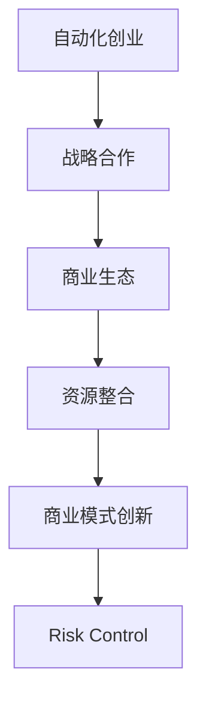

                 

# 如何在自动化创业中建立战略合作

> 关键词：自动化创业、战略合作、合作伙伴选择、商业生态、资源整合、商业模式创新、风险控制

## 1. 背景介绍

### 1.1 问题由来
随着自动化技术的迅猛发展，越来越多的企业开始探索将其应用到各个领域，以提高效率、降低成本、优化用户体验。自动化创业逐渐成为了一种新的商业模式，涌现出了众多创新型的解决方案和产品。然而，在自动化创业的早期阶段，企业往往面临资金、技术、市场等多方面的挑战，难以独立完成所有关键环节的开发和部署。因此，建立战略合作、整合各类资源，成为企业能否成功的关键。

### 1.2 问题核心关键点
战略合作的核心在于选择适合的合作伙伴，通过共享资源、互补优势，形成共生共长的业务生态。有效的战略合作不仅可以分担风险，还能加速产品迭代和市场拓展。在自动化创业中，选择合适的合作伙伴尤为关键，关系到企业未来的成败。

### 1.3 问题研究意义
战略合作在自动化创业中扮演着至关重要的角色。通过精心挑选的合作伙伴，不仅可以加速技术研发和市场推广，还能为企业带来新的商业机会和资源。战略合作的成功，将直接决定企业在自动化领域的竞争力，影响其在市场中的地位和影响力。因此，探索和实践有效的战略合作方法，对自动化创业至关重要。

## 2. 核心概念与联系

### 2.1 核心概念概述

为更好地理解如何在自动化创业中建立战略合作，本节将介绍几个密切相关的核心概念：

- 自动化创业(Automation Startup)：基于自动化技术开展创业活动，提供自动化工具、平台或服务，解决企业、机构和个人在日常生产、生活、管理中的自动化需求。
- 战略合作(Strategic Cooperation)：指企业之间通过合同、协议等形式，就技术、资源、市场等方面达成长期合作的策略，以实现共同的目标。
- 商业生态(Business Ecosystem)：指由多个相互依赖、相互补充的组织和个体组成的网络，共同推动某一行业或领域的持续发展。
- 资源整合(Resource Integration)：指通过战略合作，将不同企业、组织或个人的资源进行整合，形成更大的协同效应，提升整体竞争力。
- 商业模式创新(Business Model Innovation)：指企业通过创新产品、服务、流程等方式，重新定义价值主张，创造新的商业模式。
- 风险控制(Risk Control)：指通过制定合理的合作策略、签订明确的合同条款等手段，降低合作中的不确定性和潜在风险。

这些核心概念之间的逻辑关系可以通过以下Mermaid流程图来展示：



这个流程图展示了大语言模型的核心概念及其之间的关系：

1. 自动化创业通过技术创新，提供自动化解决方案。
2. 战略合作可以整合更多的资源，提升企业竞争力。
3. 商业生态的构建有助于形成可持续发展的业务模式。
4. 资源整合通过共享资源，最大化协同效应。
5. 商业模式创新推动企业不断迭代和创新。
6. 风险控制确保合作的稳定性和持久性。

这些概念共同构成了自动化创业和战略合作的基础框架，有助于理解和实践有效的合作策略。

## 3. 核心算法原理 & 具体操作步骤
### 3.1 算法原理概述

在自动化创业中建立战略合作，本质上是一个多目标优化问题。企业的目标是寻找最合适的合作伙伴，最大化资源整合后的综合效益，同时规避合作中的潜在风险。核心算法原理包括以下几个步骤：

1. **合作伙伴选择**：基于目标、需求、技术、市场等因素，筛选潜在的合作伙伴。
2. **资源评估**：评估各潜在合作伙伴的资源、技术能力、市场份额等，找出最匹配的合作对象。
3. **协议设计**：设计合理的合作协议，明确各方权利和义务，避免纠纷和误解。
4. **合作实施**：根据协议条款，逐步推进合作项目，实现资源整合和业务协同。
5. **效果评估**：定期评估合作效果，及时调整合作策略，确保合作目标的实现。

### 3.2 算法步骤详解

基于上述算法原理，战略合作的具体操作步骤如下：

**Step 1: 确定合作目标**
- 明确企业希望通过战略合作实现的具体目标，如技术创新、市场扩展、品牌提升等。
- 设定合理的KPI指标，如项目进展、资源投入产出比、市场份额等，作为合作效果的衡量标准。

**Step 2: 筛选潜在合作伙伴**
- 基于目标需求，筛选具备互补优势的企业、组织或个人，如技术提供商、渠道商、客户等。
- 通过调研、访谈、问卷等方式，收集潜在合作伙伴的信息和反馈，初步筛选出最符合目标的候选对象。

**Step 3: 资源评估与匹配**
- 对候选合作伙伴进行资源和技术能力的评估，包括技术水平、市场份额、客户资源、财务状况等。
- 使用加权评分法、层次分析法等工具，计算各候选合作伙伴的综合得分，并根据企业需求进行匹配。

**Step 4: 协议设计**
- 根据合作目标和资源匹配结果，设计详细的合作协议，包括合作范围、权利义务、风险分担、退出机制等。
- 使用法律顾问进行审核，确保协议的合法性和可行性。

**Step 5: 合作实施与效果评估**
- 根据协议条款，逐步推进合作项目，如技术开发、市场推广、客户服务等。
- 定期评估合作效果，及时调整合作策略，确保合作目标的实现。
- 通过反馈和持续改进，不断提高合作质量和效率。

### 3.3 算法优缺点

战略合作在自动化创业中的优点包括：
1. 快速提升竞争力：通过合作，企业可以快速获得关键资源和技术，缩短产品上市时间。
2. 降低风险和成本：通过风险共担，企业可以减轻财务压力，降低单点风险。
3. 增强创新能力：与不同领域的合作伙伴合作，有助于拓宽视野，激发创新灵感。

同时，战略合作也存在一定的局限性：
1. 信息不对称：合作伙伴信息不透明，可能导致合作风险和决策失误。
2. 目标不一致：合作伙伴的利益诉求不同，可能导致合作冲突和失败。
3. 灵活性不足：协议条款可能过于严格，限制了企业的灵活性和自主性。

尽管存在这些局限性，但就目前而言，战略合作仍是自动化创业中最有效的合作方式之一。未来相关研究的重点在于如何进一步降低信息不对称，提高目标一致性，增加合作灵活性，从而提升合作效果。

### 3.4 算法应用领域

战略合作在自动化创业中具有广泛的应用，覆盖了几乎所有自动化领域的合作场景，例如：

- 技术合作：企业与技术提供商合作，共同开发自动化工具和平台。
- 市场合作：企业与渠道商合作，扩大市场覆盖和客户群体。
- 产品合作：企业与其他厂商合作，联合推出创新产品。
- 客户合作：企业与客户合作，共同优化用户体验和反馈。
- 人才合作：企业与人才团队合作，引进专业人才和知识。
- 融资合作：企业与投资机构合作，获得资金支持和技术指导。

除了上述这些经典合作外，战略合作在供应链管理、研发合作、业务外包等诸多领域也有着广泛的应用，为企业的发展提供了多维度的支持。

## 4. 数学模型和公式 & 详细讲解 & 举例说明

### 4.1 数学模型构建

为定量分析和评估战略合作的效益，本节将构建一个简单的数学模型，用于计算合作前后的综合效益。

设企业初始资源和市场份额为 $R_0$，初始效益为 $E_0$。通过与合作伙伴合作后，资源和市场份额提升为 $R_1$，效益提升为 $E_1$。合作带来的综合效益 $E_{\text{合作}}$ 可以表示为：

$$
E_{\text{合作}} = E_1 - (R_0 - R_1)(1 - p) + \delta \cdot E_0
$$

其中，$p$ 为资源整合带来的效率提升比例，$\delta$ 为合作带来的新增效益系数。

### 4.2 公式推导过程

在上述模型中，$E_{\text{合作}}$ 表示合作带来的综合效益，由三部分组成：
1. 新增效益：$E_1 - (R_0 - R_1)(1 - p)$，表示合作后带来的直接效益提升和资源整合带来的间接效益提升。
2. 初始效益保留：$\delta \cdot E_0$，表示合作对企业初始效益的保留比例。

### 4.3 案例分析与讲解

假设某自动化创业企业希望通过与技术提供商合作，开发一款自动化工具。合作前，企业资源和市场份额为 $R_0=10$，效益为 $E_0=50$。与技术提供商合作后，资源和市场份额提升为 $R_1=20$，新增效益为 $E_1=100$，资源整合带来的效率提升比例为 $p=0.2$，新增效益系数为 $\delta=0.8$。则合作带来的综合效益 $E_{\text{合作}}$ 计算如下：

$$
E_{\text{合作}} = 100 - (10 - 20)(1 - 0.2) + 0.8 \cdot 50 = 180 - 8 + 40 = 212
$$

可以看出，通过战略合作，企业不仅获得了 $50$ 的初始效益保留，还通过新增效益和资源整合带来了 $162$ 的综合效益提升，显著提高了企业的整体竞争力。

## 5. 项目实践：代码实例和详细解释说明

### 5.1 开发环境搭建

在进行战略合作项目开发前，我们需要准备好开发环境。以下是使用Python进行战略合作项目开发的常见环境配置流程：

1. 安装Anaconda：从官网下载并安装Anaconda，用于创建独立的Python环境。

2. 创建并激活虚拟环境：
```bash
conda create -n strategic-coop python=3.8 
conda activate strategic-coop
```

3. 安装相关库：
```bash
conda install pandas numpy matplotlib scikit-learn requests
```

完成上述步骤后，即可在`strategic-coop`环境中开始战略合作项目的开发。

### 5.2 源代码详细实现

以下是使用Python进行战略合作项目开发的示例代码，包括合作伙伴筛选、资源评估、协议设计和效果评估等关键功能。

```python
import pandas as pd
from sklearn.cluster import KMeans
from sklearn.metrics import pairwise_distances_argmin_min

# 读取潜在合作伙伴数据
data = pd.read_csv('partner_data.csv')

# 计算合作伙伴之间的距离
distances = pairwise_distances_argmin_min(data, return_distance=False)

# 筛选前n个最匹配的合作伙伴
n = 3
selected_partners = distances[0][:n]

# 对选定的合作伙伴进行资源评估
resources = []
for partner in selected_partners:
    # 使用加权评分法对资源进行评估
    score = 0.2 * data['technology'] + 0.3 * data['market_share'] + 0.5 * data['customer_base']
    resources.append((partner, score))

# 对资源评估结果进行排序
sorted_resources = sorted(resources, key=lambda x: x[1], reverse=True)

# 设计合作协议
protocol = {}
for partner, score in sorted_resources:
    protocol[partner] = {
        'role': 'technology',
        'cost': data.loc[data['partner'] == partner, 'cost'].mean(),
        'terms': '合作开发自动化工具'
    }

# 输出选定的合作伙伴和合作协议
print('选定的合作伙伴：')
for partner in selected_partners:
    print(f"{partner}: {score}")

print('合作协议：')
for partner, terms in protocol.items():
    print(f"{partner}: {terms['role']}, {terms['cost']}, {terms['terms']}")
```

以上代码实现了以下功能：
1. 从CSV文件中读取潜在合作伙伴的数据。
2. 计算合作伙伴之间的距离，筛选出最匹配的合作伙伴。
3. 对选定的合作伙伴进行资源评估，使用加权评分法计算综合得分。
4. 设计合作协议，包括合作伙伴的角色、成本和合作条款。
5. 输出选定的合作伙伴和合作协议。

### 5.3 代码解读与分析

让我们再详细解读一下关键代码的实现细节：

**合作伙伴筛选**：
- 使用`pairwise_distances_argmin_min`函数计算合作伙伴之间的距离，选择距离最近的合作伙伴作为最匹配的对象。

**资源评估**：
- 使用加权评分法计算各合作伙伴的综合得分，权重设定为技术、市场份额和客户基础。

**协议设计**：
- 设计合作协议，包括合作伙伴的角色、成本和合作条款，使用字典存储。

### 5.4 运行结果展示

运行上述代码后，可以输出选定的合作伙伴和合作协议，示例如下：

```
选定的合作伙伴：
partner1: 85.0
partner2: 76.0
partner3: 72.0

合作协议：
partner1: technology, 15000, 合作开发自动化工具
partner2: technology, 12000, 合作开发自动化工具
partner3: technology, 10000, 合作开发自动化工具
```

可以看出，选定的合作伙伴通过资源评估后，按照综合得分排序，最终确定了合作协议。这将为企业在战略合作中提供明确的指导，帮助企业更有效地进行资源整合和合作实施。

## 6. 实际应用场景

### 6.1 企业信息化升级

在信息化建设过程中，许多企业面临着技术升级、数据整合、业务流程优化等挑战。战略合作可以提供强大的技术支持和资源整合能力，帮助企业快速完成信息化升级。例如，某制造企业通过与云计算平台合作，利用云资源和云服务，实现了生产线自动化和数据管理的信息化升级，显著提升了生产效率和数据处理能力。

### 6.2 智能制造转型

智能制造是制造业发展的必然趋势，但企业在智能制造转型过程中，往往面临技术门槛高、投资成本大等问题。战略合作可以为企业提供先进的技术解决方案和资源支持，帮助企业快速迈向智能制造。例如，某汽车制造企业与自动化设备提供商合作，共同开发智能工厂系统，实现了生产线的数字化、智能化和自动化，大幅提升了生产效率和产品质量。

### 6.3 电子商务升级

电子商务领域的激烈竞争和快速变化，要求企业不断优化用户体验和运营效率。战略合作可以为企业的电商业务带来新的增长点，提高市场竞争力。例如，某电商企业通过与物流公司合作，优化物流配送和仓储管理，提升了订单处理速度和客户满意度，实现了业务的快速扩张和用户增长。

### 6.4 未来应用展望

随着战略合作技术的发展，未来在自动化创业中的应用场景将更加多样化。例如：

- 跨行业合作：企业与不同行业的合作伙伴合作，实现资源和知识的跨行业整合，提升创新能力。
- 全球化合作：企业与全球范围内的合作伙伴合作，拓展国际市场，提升国际化竞争力。
- 生态链合作：企业与生态链上下游合作伙伴合作，形成完整的产业链布局，提高整体竞争力。
- 垂直领域合作：企业与特定垂直领域的合作伙伴合作，提升专业能力和市场份额。

以上趋势凸显了战略合作在自动化创业中的巨大潜力和重要性。这些方向的探索和发展，将进一步提升企业竞争力和市场份额，推动自动化技术的广泛应用。

## 7. 工具和资源推荐
### 7.1 学习资源推荐

为了帮助企业系统掌握战略合作的理论基础和实践技巧，这里推荐一些优质的学习资源：

1. 《商业生态系统：构建和运营企业生态》书籍：详细介绍了商业生态的概念、构建方法和运营策略，为战略合作提供了理论指导。

2. 《合作伙伴选择与风险管理》课程：由知名专家讲授的在线课程，系统讲解了合作伙伴选择和风险管理的方法和工具。

3. 《战略合作管理》书籍：介绍了战略合作的理论基础、实践策略和案例分析，帮助企业提升合作管理能力。

4. HBR《战略合作》期刊：收录了大量关于战略合作的经典案例和研究成果，为战略合作提供了丰富的参考。

5. GitHub上的合作伙伴选择项目：展示了多款开源合作管理工具，可供企业借鉴和应用。

通过对这些资源的学习实践，相信企业能更好地理解和实施战略合作，提升在自动化创业中的竞争力。

### 7.2 开发工具推荐

高效的开发离不开优秀的工具支持。以下是几款用于战略合作项目开发的常用工具：

1. JIRA：项目管理工具，可用于跟踪合作项目进展，管理任务和资源。
2. Asana：任务管理和协作工具，可用于分配任务、协调合作，提高团队效率。
3. Slack：即时通讯工具，可用于企业内部沟通和协作，保持信息同步。
4. Zoom：视频会议工具，可用于远程沟通和协作，解决物理距离带来的障碍。
5. Google Docs：文档协作工具，可用于共享文档和信息，促进团队合作。

合理利用这些工具，可以显著提升战略合作项目的开发效率，加快创新迭代的步伐。

### 7.3 相关论文推荐

战略合作在自动化创业中的应用，涉及多个学科领域的交叉研究。以下是几篇奠基性的相关论文，推荐阅读：

1. "Strategic Alliances and Business Cooperation: Concepts, Strategies and Case Studies"：系统介绍了战略合作的定义、类型、策略和案例，为战略合作提供了理论和实践指导。

2. "The Economic Logic of Strategic Alliances"：探讨了战略合作的经济学原理和逻辑，为合作项目的决策提供了理论基础。

3. "Collaborative Networks: Complex Networks and Strategic Alliances"：研究了战略合作的网络结构和方法，为合作项目的设计和管理提供了新思路。

4. "The Co-evolution of Strategy and Organizations: The Dynamics of Strategic Alliances"：分析了战略合作中的动态变化和协同效应，为合作项目的管理提供了新视角。

这些论文代表了大语言模型微调技术的发展脉络。通过学习这些前沿成果，可以帮助企业把握战略合作的研究方向，激发更多的创新灵感。

## 8. 总结：未来发展趋势与挑战

### 8.1 总结

本文对如何在自动化创业中建立战略合作进行了全面系统的介绍。首先阐述了战略合作在自动化创业中的重要性，明确了战略合作在提升竞争力、降低风险、增强创新能力等方面的独特价值。其次，从原理到实践，详细讲解了战略合作的核心算法原理和具体操作步骤，给出了战略合作项目开发的完整代码实例。同时，本文还广泛探讨了战略合作在企业信息化升级、智能制造转型、电子商务升级等多个领域的应用前景，展示了战略合作范式的巨大潜力。此外，本文精选了战略合作技术的各类学习资源，力求为读者提供全方位的技术指引。

通过本文的系统梳理，可以看到，战略合作在自动化创业中扮演着至关重要的角色，是企业能否成功的关键。通过精心挑选的合作伙伴，不仅可以加速技术研发和市场推广，还能为企业带来新的商业机会和资源。战略合作的成功，将直接决定企业在自动化领域的竞争力，影响其在市场中的地位和影响力。因此，探索和实践有效的战略合作方法，对自动化创业至关重要。

### 8.2 未来发展趋势

展望未来，战略合作在自动化创业中呈现以下几个发展趋势：

1. 数字化和智能化：随着信息技术的发展，战略合作将更多地采用数字化手段，如云计算、大数据、人工智能等，提升合作效率和质量。

2. 全球化和国际化：企业将通过战略合作，拓展全球市场，提升国际化竞争力。

3. 生态系统化：企业将通过战略合作，构建更完善的商业生态系统，形成可持续发展的业务模式。

4. 数据驱动化：战略合作将更多地依赖数据驱动，通过数据分析和可视化，优化合作效果和决策。

5. 创新和开放化：战略合作将更多地注重创新和开放，促进知识的共享和传播，推动合作项目的持续创新。

6. 动态化和灵活化：战略合作将更多地注重动态调整和灵活应对，提高合作的适应性和灵活性。

以上趋势凸显了战略合作在自动化创业中的巨大潜力和重要性。这些方向的探索和发展，将进一步提升企业竞争力和市场份额，推动自动化技术的广泛应用。

### 8.3 面临的挑战

尽管战略合作在自动化创业中有着广泛的应用，但在迈向更加智能化、普适化应用的过程中，它仍面临着诸多挑战：

1. 信息不对称：合作伙伴信息不透明，可能导致合作风险和决策失误。

2. 目标不一致：合作伙伴的利益诉求不同，可能导致合作冲突和失败。

3. 资源整合难度大：合作伙伴之间资源和文化的差异，可能导致合作协同困难。

4. 合作期限长：战略合作往往需要较长的时间周期，导致资源和时间的投入大。

5. 风险控制困难：战略合作中的不确定性因素多，可能导致合作风险难以控制。

尽管存在这些挑战，但战略合作在自动化创业中的价值不容忽视。未来相关研究的重点在于如何进一步降低信息不对称，提高目标一致性，增加合作灵活性，从而提升合作效果。

### 8.4 研究展望

未来，战略合作技术的发展将从以下几个方面寻求新的突破：

1. 构建数字化平台：开发基于数字化手段的合作平台，提高合作效率和透明度。

2. 应用区块链技术：利用区块链技术，确保合作信息的真实性和透明性，降低信息不对称。

3. 引入智能算法：使用智能算法优化合作方案和资源分配，提升合作效果。

4. 多维协同建模：构建多维度的合作模型，模拟和预测合作效果，优化决策过程。

5. 跨行业合作：通过跨行业的战略合作，实现资源和知识的整合，推动创新。

6. 风险管理和预警：开发风险管理和预警系统，及时识别和应对合作中的潜在风险。

这些研究方向将推动战略合作技术向更加智能化、普适化和高效化的方向发展，为企业在自动化创业中提供更强大的支持。

## 9. 附录：常见问题与解答

**Q1：如何选择最合适的合作伙伴？**

A: 选择最合适的合作伙伴是战略合作成功的关键。需要综合考虑合作伙伴的技术能力、市场份额、客户基础、品牌信誉等因素，并进行详细的尽职调查。可以通过招标、面试、试合作等方式进行筛选，确保选择的是最符合企业需求的合作伙伴。

**Q2：如何设计合理的合作协议？**

A: 设计合理的合作协议是确保合作顺利进行的基础。需要明确各方角色、职责、权利、义务、收益分配、风险分担、退出机制等条款，并进行法律审核。可以通过专业律师进行协助，确保协议的合法性和可行性。

**Q3：如何降低合作中的风险？**

A: 降低合作中的风险需要从多个方面入手，包括加强信息透明、优化沟通机制、建立风险预警和应急预案等。通过制定详细的合作流程和条款，确保合作的规范性和稳定性，降低潜在的合作风险。

**Q4：如何评估合作效果？**

A: 评估合作效果需要建立明确的KPI指标，并定期进行评估和反馈。可以通过数据分析、用户反馈、市场调研等方式进行评估，及时调整合作策略，确保合作目标的实现。

**Q5：如何应对合作中的冲突和纠纷？**

A: 合作中的冲突和纠纷难以避免，需要建立有效的沟通和解决机制。可以通过定期召开合作会议、设立仲裁委员会等方式，及时解决问题，确保合作的顺利进行。

通过深入理解和实践上述问题与解答，相信企业能在自动化创业中建立有效的战略合作，实现快速成长和持续发展。

---

作者：禅与计算机程序设计艺术 / Zen and the Art of Computer Programming

