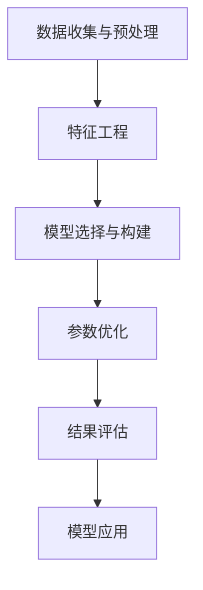

                 

# 如何将模型思维应用于实际管理

> 关键词：模型思维,管理,数据分析,决策支持,预测建模,智能优化

## 1. 背景介绍

在当今快速变化的商业环境中，企业的管理决策越来越依赖于数据驱动和模型辅助。传统的管理方法往往基于经验和直觉，难以应对复杂和动态的市场需求。而将模型思维引入管理实践，不仅能够提高决策的科学性和准确性，还能大幅提升企业的运营效率和竞争力。本文将系统阐述如何将模型思维应用于实际管理，包括核心概念、关键算法、具体操作步骤以及实际应用场景，旨在为企业领导者和管理者提供切实可行的参考。

## 2. 核心概念与联系

### 2.1 核心概念概述

模型思维，本质上是一种基于数学模型和统计学方法，用于分析和解决实际问题的思维方式。它涉及数据收集、特征工程、模型构建、参数优化、结果评估等多个环节，旨在通过结构化的方式理解和解决管理问题。

核心概念包括：

- **数据收集与预处理**：从内部和外部数据源获取数据，并进行清洗、转换和整理，以便模型训练和分析。
- **特征工程**：从原始数据中提取和构建对模型预测有帮助的特征。
- **模型选择与构建**：根据问题的性质和数据的特性，选择合适的模型架构和算法进行训练。
- **参数优化**：通过交叉验证等技术，选择最佳的模型参数和超参数组合。
- **结果评估**：使用多种评估指标，如精确率、召回率、F1分数等，衡量模型的性能。
- **模型应用**：将训练好的模型应用于实际管理决策，提供预测和优化建议。

### 2.2 核心概念原理和架构的 Mermaid 流程图(Mermaid 流程节点中不要有括号、逗号等特殊字符)



## 3. 核心算法原理 & 具体操作步骤

### 3.1 算法原理概述

模型思维在管理中的应用，核心是利用数学和统计学方法构建和管理模型，从而辅助决策。常见的模型类型包括回归模型、分类模型、聚类模型、时间序列模型等。这些模型通过训练学习数据的规律，预测未来结果，提供决策支持。

### 3.2 算法步骤详解

#### 3.2.1 数据收集与预处理

- **数据源**：选择合适的数据源，包括企业内部数据（如销售记录、财务报表、客户反馈）和外部数据（如市场趋势、行业报告、竞争对手信息）。
- **数据清洗**：处理缺失值、异常值、重复记录等问题，确保数据质量。
- **数据转换**：对原始数据进行标准化、归一化等操作，便于模型处理。

#### 3.2.2 特征工程

- **特征选择**：从数据中提取对模型预测有帮助的特征。常见的特征包括时间特征、统计特征、业务特征等。
- **特征构建**：通过组合、变换、编码等方法，生成新的特征。如计算日均销售额、月度收入变化率等。

#### 3.2.3 模型选择与构建

- **模型评估**：使用交叉验证等技术，评估不同模型的预测性能。
- **模型优化**：根据评估结果，调整模型参数，选择最佳模型。

#### 3.2.4 参数优化

- **超参数调优**：通过网格搜索、随机搜索等方法，找到最优的超参数组合。
- **模型训练**：使用训练数据集训练模型，得到模型参数。

#### 3.2.5 结果评估

- **性能指标**：使用准确率、召回率、F1分数、均方误差等指标评估模型性能。
- **模型验证**：使用测试集验证模型泛化能力。

#### 3.2.6 模型应用

- **决策支持**：基于模型预测结果，辅助管理决策。
- **优化调整**：根据模型反馈，调整业务策略。

### 3.3 算法优缺点

#### 3.3.1 优点

- **科学性**：模型思维基于数据和数学原理，提供科学的决策依据。
- **系统性**：通过系统化的数据分析和模型构建，提升决策的系统性和客观性。
- **预测性**：模型能够预测未来趋势，提供前瞻性的决策支持。
- **可优化性**：通过参数优化和模型调整，不断提升决策效果。

#### 3.3.2 缺点

- **数据依赖**：模型的有效性依赖于数据的质量和数量。
- **复杂性**：构建和优化模型需要一定的技术门槛。
- **动态性不足**：模型一旦构建，难以适应快速变化的环境。
- **黑箱性**：复杂的模型可能缺乏可解释性，影响决策的可理解性。

### 3.4 算法应用领域

模型思维在企业管理中的应用广泛，涵盖多个领域，包括：

- **销售管理**：通过预测模型分析市场需求，优化库存管理，提高销售效率。
- **财务分析**：利用时间序列模型预测财务趋势，进行风险管理和投资决策。
- **客户管理**：构建客户行为模型，识别高价值客户，提升客户满意度和忠诚度。
- **运营优化**：使用优化模型分析流程瓶颈，提升生产效率和供应链管理水平。
- **人力资源管理**：利用预测模型评估员工绩效，优化招聘和培训策略。

## 4. 数学模型和公式 & 详细讲解 & 举例说明

### 4.1 数学模型构建

假设我们要构建一个用于预测销售额的回归模型。基本的数学模型可以表示为：

$$ y = \beta_0 + \beta_1 x_1 + \beta_2 x_2 + \ldots + \beta_n x_n + \epsilon $$

其中，$y$ 为预测的目标值（如销售额），$x_i$ 为模型输入的特征变量，$\beta_i$ 为模型参数，$\epsilon$ 为误差项。

### 4.2 公式推导过程

以线性回归模型为例，假设我们收集了历史销售数据，共包含10个月份的数据，每个月的销售额和相关特征如下：

| 月份 | 销售额（万元） | 促销活动 | 节假日 | 天气状况 | ... |
| --- | --- | --- | --- | --- | --- |

我们可以构建一个线性回归模型来预测下个月销售额。首先，将数据标准化处理：

$$ \hat{y} = \hat{\beta}_0 + \hat{\beta}_1 \hat{x}_1 + \hat{\beta}_2 \hat{x}_2 + \ldots + \hat{\beta}_n \hat{x}_n $$

其中，$\hat{\beta}_i$ 为标准化后的系数，$\hat{x}_i$ 为标准化后的特征值。

通过最小二乘法，可以求解$\hat{\beta}_i$：

$$ \hat{\beta}_i = \frac{\sum_{j=1}^{n} (\hat{x}_j - \overline{x})(y_j - \hat{y})}{\sum_{j=1}^{n} (\hat{x}_j - \overline{x})^2} $$

最后，代入新月份的特征值，即可预测下个月的销售额。

### 4.3 案例分析与讲解

假设我们是一家电商公司，希望通过模型预测下个月的产品销售额。我们收集了过去一年每个月的销售数据，包含促销活动、节假日、天气状况等特征。使用上述方法构建线性回归模型，进行参数求解和性能评估。根据模型预测结果，我们可以调整下个月的市场策略，如调整促销力度、优化库存管理等，以提高销售额。

## 5. 项目实践：代码实例和详细解释说明

### 5.1 开发环境搭建

要使用Python进行模型构建和训练，我们需要准备以下开发环境：

1. 安装Anaconda：
```bash
conda create -n model_env python=3.7
conda activate model_env
```

2. 安装必要的库：
```bash
pip install pandas numpy scikit-learn seaborn matplotlib jupyter notebook
```

3. 准备数据集：
假设我们有一个包含历史销售数据的CSV文件`sales_data.csv`，包含`月份`、`销售额`、`促销活动`、`节假日`等特征。

### 5.2 源代码详细实现

```python
import pandas as pd
from sklearn.model_selection import train_test_split
from sklearn.linear_model import LinearRegression
from sklearn.metrics import mean_squared_error, r2_score
import matplotlib.pyplot as plt

# 加载数据
data = pd.read_csv('sales_data.csv')

# 数据清洗
data.fillna(method='ffill', inplace=True)
data.dropna(inplace=True)

# 特征选择
X = data[['促销活动', '节假日', '天气状况']]
y = data['销售额']

# 数据划分
X_train, X_test, y_train, y_test = train_test_split(X, y, test_size=0.2, random_state=42)

# 模型构建
model = LinearRegression()
model.fit(X_train, y_train)

# 模型评估
y_pred = model.predict(X_test)
mse = mean_squared_error(y_test, y_pred)
rmse = mse**0.5
r2 = r2_score(y_test, y_pred)

print('RMSE:', rmse)
print('R2:', r2)

# 模型应用
new_X = pd.DataFrame({促销活动: 1, 节假日: 1, 天气状况: '晴'})
new_y_pred = model.predict(new_X)
print('预测销售额:', new_y_pred)
```

### 5.3 代码解读与分析

1. **数据加载**：使用pandas库加载CSV文件，并进行初步的数据清洗。
2. **特征选择**：选择促销活动、节假日、天气状况等特征，作为模型的输入变量。
3. **数据划分**：将数据划分为训练集和测试集，便于模型评估和应用。
4. **模型构建**：使用sklearn库中的LinearRegression模型，进行模型训练。
5. **模型评估**：使用均方误差和R²系数评估模型性能。
6. **模型应用**：基于训练好的模型，预测新数据点（如下个月的市场策略）的销售额。

### 5.4 运行结果展示

运行上述代码，输出RMSE和R²系数，可以评估模型的预测性能。通过调整模型参数和特征工程，进一步提升模型效果。

## 6. 实际应用场景

### 6.1 销售管理

在销售管理中，通过预测模型分析市场需求，可以优化库存管理，提高销售效率。例如，利用历史销售数据构建预测模型，预测下季度的销售额，据此调整采购和生产计划，避免库存积压和缺货。

### 6.2 财务分析

财务分析中，时间序列模型常用于预测未来收入和成本，进行风险管理和投资决策。例如，通过预测未来的现金流，评估企业的财务健康状况，制定合理的资金筹集和投资策略。

### 6.3 客户管理

构建客户行为模型，识别高价值客户，提升客户满意度和忠诚度。例如，通过分析客户购买记录、行为数据，构建预测模型，预测客户的生命周期价值，据此进行客户分层和精准营销。

### 6.4 运营优化

优化模型分析流程瓶颈，提升生产效率和供应链管理水平。例如，通过预测订单交付时间，优化物流和仓储管理，提高配送速度和客户满意度。

### 6.5 未来应用展望

随着模型技术的不断进步，模型思维将在企业管理中发挥越来越重要的作用。未来，模型将更加智能和个性化，能够根据实时数据动态调整预测结果，提供更为精准的决策支持。

## 7. 工具和资源推荐

### 7.1 学习资源推荐

1. **《Python数据科学手册》**：详细介绍Python在数据科学中的应用，涵盖数据处理、模型构建、结果评估等多个环节。
2. **《机器学习实战》**：通过实战案例，详细讲解机器学习模型的构建和优化。
3. **Kaggle**：全球最大的数据科学竞赛平台，提供大量公开数据集和竞赛机会，实战练习模型思维。

### 7.2 开发工具推荐

1. **Jupyter Notebook**：强大的交互式编程环境，便于模型开发和结果展示。
2. **Tableau**：数据可视化工具，直观展示模型结果。
3. **TensorFlow**：强大的深度学习框架，支持多种模型构建和优化算法。

### 7.3 相关论文推荐

1. **《机器学习实战》**：由Peter Harrington撰写，详细介绍各种机器学习算法的实现和应用。
2. **《数据科学导论》**：由Mark A. Griffiths和Anthony C. Morton撰写，系统介绍数据科学的核心概念和方法。
3. **《深度学习入门》**：由斋藤康毅撰写，详细讲解深度学习模型和应用实例。

## 8. 总结：未来发展趋势与挑战

### 8.1 研究成果总结

模型思维在企业管理中的应用，已经取得了显著的成果，提升了决策的科学性和系统性。未来，随着模型技术的不断进步，模型思维将更加深入地应用于管理决策中，提供更为精准和前瞻性的支持。

### 8.2 未来发展趋势

1. **智能优化**：未来模型将更加智能化，能够根据实时数据动态调整预测结果，提供更为精准的决策支持。
2. **个性化**：通过深度学习等技术，模型将具备更强的个性化能力，能够根据用户行为和偏好提供定制化的推荐和服务。
3. **跨领域应用**：模型思维将与其他技术（如区块链、物联网）相结合，拓展到更多领域，提升整体效率。

### 8.3 面临的挑战

1. **数据质量**：模型依赖于高质量的数据，数据质量问题将影响模型效果。
2. **模型复杂性**：复杂模型可能难以解释，影响决策的可理解性。
3. **实时性**：模型需要具备实时性，能够快速响应变化的市场需求。
4. **隐私保护**：模型的应用需要考虑数据隐私和安全性，避免数据泄露风险。

### 8.4 研究展望

未来研究应关注以下几个方面：

1. **数据治理**：建立数据治理机制，确保数据质量和安全。
2. **模型解释**：引入可解释性算法，提升模型的透明性和可理解性。
3. **实时性优化**：优化模型计算图，提高实时响应速度。
4. **隐私保护**：引入隐私保护技术，确保数据安全。

## 9. 附录：常见问题与解答

### Q1: 模型思维在企业管理中如何应用？

**A**: 模型思维在企业管理中应用广泛，涵盖销售管理、财务分析、客户管理等多个领域。通过构建预测模型和优化模型，提升决策的科学性和系统性。

### Q2: 模型的选择和构建需要哪些步骤？

**A**: 模型的选择和构建需要以下步骤：
1. 数据收集与预处理
2. 特征工程
3. 模型选择与构建
4. 参数优化
5. 结果评估
6. 模型应用

### Q3: 模型评估和优化的常用方法有哪些？

**A**: 模型评估和优化的常用方法包括：
1. 交叉验证
2. 网格搜索
3. 随机搜索
4. 正则化
5. 集成学习

### Q4: 模型应用中需要注意哪些问题？

**A**: 模型应用中需要注意以下问题：
1. 数据质量
2. 模型解释
3. 实时性
4. 隐私保护

### Q5: 如何提升模型的预测准确性？

**A**: 提升模型的预测准确性需要：
1. 高质量的数据
2. 特征工程
3. 合适的模型选择
4. 参数优化
5. 交叉验证

---

作者：禅与计算机程序设计艺术 / Zen and the Art of Computer Programming

