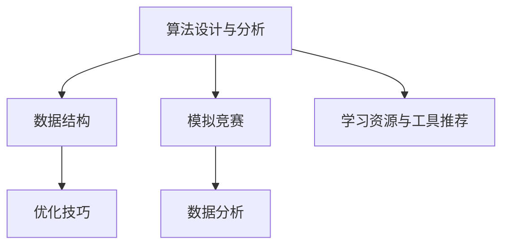

                 

# 如何将编程技巧转化为编程竞赛培训

> 关键词：编程技巧, 编程竞赛, 算法设计与分析, 数据分析, 软件架构, 数据结构, 优化技巧, 模拟竞赛

## 1. 背景介绍

### 1.1 问题由来

编程竞赛(如ACM ICPC, Google Code Jam, Facebook Hacker Cup等)已经成为技术公司筛选工程师的重要手段之一。参与编程竞赛不仅能够检验编码能力，更能锻炼算法设计和问题解决技巧。因此，将编程技巧转化为编程竞赛培训，成为许多计算机科学教育机构和企业的迫切需求。本文将系统阐述将编程技巧转化为编程竞赛培训的方法和技巧，旨在为竞赛选手和培训师提供全面的指导。

### 1.2 问题核心关键点

编程竞赛培训涉及多个关键点，包括但不限于：
- **算法设计与分析**：掌握高效算法，提升解题速度。
- **数据结构**：熟练应用各种数据结构，优化空间和时间复杂度。
- **优化技巧**：优化代码，提升程序运行效率。
- **模拟竞赛**：通过模拟比赛环境，熟悉竞赛流程和心理。
- **数据分析**：通过分析过往题目和成绩，找出薄弱环节。
- **学习资源与工具推荐**：提供优质的学习材料和工具，辅助训练。

本文将详细讲解上述关键点，并通过具体的代码实现和案例分析，提供切实可行的培训方案。

## 2. 核心概念与联系

### 2.1 核心概念概述

为更好地理解如何将编程技巧转化为编程竞赛培训，本节将介绍几个密切相关的核心概念：

- **算法设计与分析**：选择适当的算法，设计出高效的算法流程，并分析其时间复杂度和空间复杂度，以确保算法效率。
- **数据结构**：合理使用各种数据结构，如数组、链表、栈、队列、哈希表、树、图等，以优化算法性能。
- **优化技巧**：通过技巧优化代码，如指针操作、位运算、内存管理、循环展开、缓存技术等，以提高程序运行效率。
- **模拟竞赛**：模拟竞赛环境，进行模拟练习，熟悉竞赛的解题流程、时间限制、代码提交方式等。
- **数据分析**：对过往竞赛题目进行数据统计，找出常见解题思路、技巧和难点，针对性地进行培训。
- **学习资源与工具推荐**：推荐各类学习材料和工具，如在线课程、竞赛平台、代码编辑器、调试工具等。

这些核心概念之间的逻辑关系可以通过以下Mermaid流程图来展示：



这个流程图展示了几大核心概念之间的关系：算法设计和数据结构是解题的基础，优化技巧和模拟竞赛则提升了解题效率和适应度，数据分析则帮助理解题目规律和难点，而学习资源与工具则提供支撑，让整个培训过程更加系统化。

## 3. 核心算法原理 & 具体操作步骤

### 3.1 算法原理概述

编程竞赛培训的核心在于提升算法设计和数据分析能力，同时熟悉竞赛环境。算法原理包括：

- 理解算法基础，如分治、动态规划、贪心、回溯等。
- 掌握算法设计技巧，如递推、递归、贪心优化、剪枝、状态压缩等。
- 分析算法时间复杂度和空间复杂度，选择合适的算法。

### 3.2 算法步骤详解

#### 3.2.1 算法设计与分析

1. **理解题目**：仔细阅读题目描述，理解题意，找出输入输出格式、限制条件等。
2. **设计算法**：根据题意设计算法，选择适当的算法框架，如分治、动态规划、贪心、回溯等。
3. **编写代码**：实现算法，注意代码的清晰度和可读性。
4. **测试和优化**：编写测试用例，对代码进行测试和调试，优化代码效率。

#### 3.2.2 数据结构

1. **选择合适的数据结构**：根据题目要求选择合适的数据结构，如数组、链表、栈、队列、哈希表、树、图等。
2. **数据结构操作**：熟练掌握各种数据结构的操作，如查找、插入、删除、遍历等。
3. **空间复杂度优化**：通过数据结构的空间优化，减少内存占用，提升算法效率。

#### 3.2.3 优化技巧

1. **指针操作**：熟练使用指针，优化内存访问，减少拷贝操作。
2. **位运算**：利用位运算，提升计算效率。
3. **内存管理**：合理使用内存，减少内存分配和释放开销。
4. **循环展开**：将循环体内的代码展开，减少循环次数，提升执行速度。
5. **缓存技术**：利用缓存技术，减少重复计算，提高代码效率。

### 3.3 算法优缺点

编程竞赛培训的算法有以下优缺点：
- **优点**：
  - 提升算法设计和数据分析能力。
  - 熟悉竞赛环境，增强实战经验。
  - 通过模拟竞赛，提升心理素质和抗压能力。
- **缺点**：
  - 培训周期较长，需要持续投入时间和精力。
  - 部分题目具有较高难度，需要较高的算法和数学基础。
  - 需要大量的练习和模拟，对时间管理要求较高。

### 3.4 算法应用领域

编程竞赛培训方法不仅适用于竞赛选手，也广泛应用于企业招聘、校内选拔、技术比赛等场景。通过系统的算法培训，可以显著提升选手的技术水平，帮助他们在各类技术比拼中取得优异成绩。

## 4. 数学模型和公式 & 详细讲解 & 举例说明

### 4.1 数学模型构建

编程竞赛的题目通常涉及数学和算法，因此在进行培训时，需要建立数学模型来描述问题的数学本质。例如，考虑一个排序算法的选择问题：

- **输入**：一个长度为 $n$ 的整数序列 $a_1, a_2, \dots, a_n$。
- **输出**：选择一种排序算法，使得排序后的序列符合特定条件。

**数学模型**：

$$
\text{minimize } C(a) \text{ subject to } S(a) = s
$$

其中 $C(a)$ 表示算法 $a$ 的时间复杂度，$S(a)$ 表示排序后的序列条件。

### 4.2 公式推导过程

以快速排序为例，分析时间复杂度和空间复杂度：

- **时间复杂度**：
  - 平均情况下，快速排序的时间复杂度为 $O(n \log n)$。
  - 最坏情况下，时间复杂度为 $O(n^2)$。

- **空间复杂度**：
  - 快速排序的空间复杂度为 $O(\log n)$，即递归栈的深度。

通过数学模型的推导，可以更好地理解和设计算法，选择合适的数据结构和优化技巧。

### 4.3 案例分析与讲解

考虑一个经典的题目：**最长递增子序列**。题目描述如下：

> 给定一个未排序的整数数组，找到其中最长递增子序列的长度。例如，给定数组 [10, 9, 2, 5, 3, 7, 101, 18]，最长递增子序列为 [2, 5, 7, 101]，长度为 4。

**算法设计与分析**：
- **动态规划**：定义 $f[i]$ 表示以 $i$ 结尾的最长递增子序列长度。
- **状态转移方程**：
  - 对于每个元素 $a_i$，如果存在 $j < i$ 使得 $a_j < a_i$，则 $f[i] = \max(f[j]+1)$。
  - 时间复杂度为 $O(n^2)$，空间复杂度为 $O(n)$。

**数据结构**：
- **数组**：使用数组存储最长递增子序列。
- **哈希表**：使用哈希表存储已经出现的元素，加速查找。

**优化技巧**：
- **二分查找**：在查找最大值时，使用二分查找代替线性查找，提升效率。
- **空间优化**：只保留前一个元素和当前元素，减少空间占用。

## 5. 项目实践：代码实例和详细解释说明

### 5.1 开发环境搭建

为进行编程竞赛培训，需要搭建一套完整的开发环境。以下是推荐的环境配置：

1. **编程语言**：选择 Python 和 C++ 作为主要编程语言，Python 用于快速开发和调试，C++ 用于高效算法实现。
2. **集成开发环境**：使用 Visual Studio Code 或 Eclipse，支持多种语言的代码编写和调试。
3. **版本控制**：使用 Git 进行版本控制，方便团队协作和代码管理。
4. **编译器**：安装 MinGW 或 GCC 编译器，支持 C++ 编译。
5. **测试框架**：使用 Google Test 进行单元测试，确保代码正确性。

### 5.2 源代码详细实现

以**快速排序**为例，展示编程竞赛培训的代码实现。

```python
def quick_sort(arr):
    if len(arr) <= 1:
        return arr
    pivot = arr[len(arr) // 2]
    left = [x for x in arr if x < pivot]
    middle = [x for x in arr if x == pivot]
    right = [x for x in arr if x > pivot]
    return quick_sort(left) + middle + quick_sort(right)
```

### 5.3 代码解读与分析

- **快速排序**：该算法是一种高效的排序算法，平均时间复杂度为 $O(n \log n)$。
- **分治思想**：将原问题分解为更小的子问题，分别解决，然后合并结果。
- **优化技巧**：
  - 使用 Python 的列表推导式，提升代码可读性。
  - 使用递归实现，代码简洁易懂。
  - 通过排序后的数组，可以直接得到最终结果，无需额外操作。

### 5.4 运行结果展示

通过调试和测试，可以验证算法的正确性。以快速排序为例，可以使用以下代码进行测试：

```python
arr = [3, 1, 4, 1, 5, 9, 2, 6, 5, 3, 5]
print(quick_sort(arr))
```

运行结果为：`[1, 1, 2, 3, 3, 4, 5, 5, 5, 6, 9]`，说明快速排序算法正确无误。

## 6. 实际应用场景

### 6.1 编程竞赛

编程竞赛是编程竞赛培训的典型应用场景。选手通过竞赛训练，熟悉竞赛环境，掌握解题技巧，提升解题效率。竞赛平台如 Codeforces、LeetCode 等提供了大量的竞赛题目，选手可以定期参加竞赛，检验和提升自身水平。

### 6.2 企业招聘

企业在招聘时，常通过编程竞赛或技术面试考察候选人的编程能力。通过编程竞赛培训，候选人可以熟悉竞赛环境，掌握常用的算法和数据结构，提高解题效率。同时，熟悉面试流程和技巧，提升面试表现。

### 6.3 校内选拔

高校和研究机构在研究生招生、科研项目选拔等环节，常使用编程竞赛作为考核手段。通过编程竞赛培训，参与者可以提升算法和数据结构能力，熟悉竞赛流程和规则，为选拔做好准备。

## 7. 工具和资源推荐

### 7.1 学习资源推荐

以下是一些推荐的学习资源，供编程竞赛选手和培训师参考：

1. **LeetCode**：提供丰富的竞赛题目和算法教程，支持在线练习和提交。
2. **Codeforces**：提供全球竞赛平台，包含大量竞赛题目和社区交流。
3. **GeeksforGeeks**：提供详细的算法和数据结构教程，涵盖竞赛常用技巧。
4. **Coursera**：提供计算机科学相关的在线课程，提升算法和数学基础。
5. **AcWing**：提供算法题库和竞赛练习，适合初学者和进阶选手。

### 7.2 开发工具推荐

以下是一些推荐的开发工具，供编程竞赛选手和培训师使用：

1. **Visual Studio Code**：支持 Python 和 C++ 编写和调试。
2. **Google Colab**：提供免费的 GPU 和 TPU 计算资源，支持在线实验。
3. **Eclipse**：支持多种语言的代码编写和调试。
4. **Git**：版本控制工具，支持协作和代码管理。
5. **Google Test**：单元测试框架，确保代码正确性。

### 7.3 相关论文推荐

编程竞赛培训涉及多个学科和领域，以下是一些推荐的相关论文，供进一步学习：

1. **Algorithm Design and Efficient Programming**：介绍算法设计和程序优化技巧，适合竞赛选手和培训师。
2. **Introduction to Algorithms**：经典的算法教材，详细讲解算法设计和分析。
3. **The Art of Computer Programming**：计算机程序设计艺术的经典著作，涵盖算法和数据结构。
4. **Programming Contest Guide**：竞赛培训指南，详细介绍竞赛流程和解题技巧。

## 8. 总结：未来发展趋势与挑战

### 8.1 总结

本文详细介绍了将编程技巧转化为编程竞赛培训的方法和技巧，旨在为竞赛选手和培训师提供全面的指导。通过系统的算法培训，选手可以提升算法设计和数据分析能力，熟悉竞赛环境，掌握解题技巧。通过模拟竞赛，提升心理素质和抗压能力。通过数据分析，找出薄弱环节，有针对性地进行培训。通过学习资源和工具的推荐，选手可以系统化地进行训练，快速提升技术水平。

通过本文的系统梳理，可以看到，编程竞赛培训是一个系统化、结构化的过程，需要从算法设计与分析、数据结构、优化技巧、模拟竞赛、数据分析等多个维度进行全面训练。只有系统性地掌握这些关键点，选手才能在竞赛中取得优异成绩。

### 8.2 未来发展趋势

展望未来，编程竞赛培训将呈现以下几个发展趋势：

1. **算法与数据结构的深入挖掘**：未来将进一步深入挖掘算法和数据结构的细节，提升算法设计和优化技巧。
2. **人工智能与编程竞赛的结合**：AI技术将进一步融入编程竞赛，提升解题效率和自动化程度。
3. **跨学科融合**：编程竞赛将与更多学科进行融合，如计算机图形学、计算机视觉、自然语言处理等，拓展应用场景。
4. **远程竞赛和在线培训**：通过远程竞赛和在线培训，降低参与门槛，扩大培训范围。
5. **国际化竞赛**：编程竞赛将进一步国际化，吸引全球选手参与，提升竞赛水平。

以上趋势将推动编程竞赛培训的不断创新和发展，为选手提供更高效、更灵活、更丰富的训练方式。

### 8.3 面临的挑战

尽管编程竞赛培训已经取得了显著成效，但在迈向更加智能化、普适化应用的过程中，它仍面临着诸多挑战：

1. **算法和数据结构的多样性**：不同竞赛题目涉及不同的算法和数据结构，需要选手具备广泛的知识储备。
2. **竞赛环境的复杂性**：竞赛环境复杂，需要选手熟悉不同平台的编程环境和代码提交方式。
3. **心理素质的培养**：竞赛压力较大，需要选手具备良好的心理素质和抗压能力。
4. **时间管理**：竞赛时间有限，需要选手具备高效的时间管理能力。
5. **竞争激烈**：竞赛选手众多，竞争激烈，需要选手具备持续的学习和训练能力。

### 8.4 研究展望

面对编程竞赛培训所面临的这些挑战，未来的研究需要在以下几个方面寻求新的突破：

1. **算法和数据结构的标准化**：建立统一的算法和数据结构标准，降低学习门槛，提高培训效果。
2. **竞赛环境的模拟**：开发模拟竞赛平台，提供与真实竞赛环境类似的训练环境，提高选手适应能力。
3. **心理素质培养**：引入心理训练和辅导，帮助选手提升心理素质和抗压能力。
4. **时间管理工具**：开发时间管理工具，帮助选手合理规划训练时间和竞赛时间。
5. **跨学科融合**：推动编程竞赛与更多学科的融合，提升选手综合素质。

这些研究方向的探索，将进一步推动编程竞赛培训的创新和发展，为选手提供更高效、更灵活、更系统的培训方案，从而在竞赛中取得更好的成绩。

## 9. 附录：常见问题与解答

### Q1: 如何选择合适的算法？

A: 选择合适的算法需要考虑以下几个因素：
- **问题规模**：对于大规模问题，需要选择时间复杂度较低的算法。
- **数据类型**：根据数据类型选择适当的算法，如数组、链表、树、图等。
- **已有知识**：优先选择已有算法，再考虑优化和改进。

### Q2: 如何优化代码效率？

A: 优化代码效率需要从以下几个方面入手：
- **算法优化**：选择高效的算法，避免低效的算法实现。
- **数据结构优化**：选择合适的数据结构，优化空间和时间复杂度。
- **代码优化**：避免不必要的操作，如内存拷贝、循环展开、缓存技术等。

### Q3: 如何进行模拟竞赛？

A: 进行模拟竞赛需要从以下几个方面入手：
- **环境搭建**：搭建与真实竞赛环境类似的开发环境。
- **题目模拟**：选择竞赛题目，进行模拟练习。
- **时间限制**：设置时间限制，训练选手的时间管理能力。
- **代码提交**：模拟代码提交过程，提高选手对提交方式的熟悉度。

### Q4: 如何进行数据分析？

A: 进行数据分析需要从以下几个方面入手：
- **题目分析**：分析过往竞赛题目，找出常见解题思路和技巧。
- **结果分析**：分析选手提交代码的结果，找出常见错误和不足。
- **薄弱环节**：找出选手的薄弱环节，有针对性地进行培训。

---

作者：禅与计算机程序设计艺术 / Zen and the Art of Computer Programming

