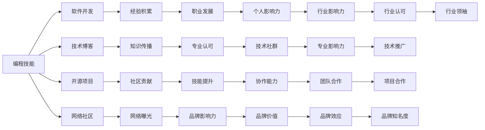

                 

# 如何将编程技能应用于个人品牌建设

> 关键词：编程技能, 个人品牌, 软件开发, 技术博客, 开源项目, 网络社区, 职业发展

## 1. 背景介绍

在当前的技术驱动型社会中，技术技能成为了个人职业发展和品牌建设的关键。无论你是初入职场的新手，还是经验丰富的专业人士，掌握编程技能都能显著提升你的竞争力。本文将探讨如何将编程技能应用于个人品牌建设，包括软件开发、技术博客、开源项目、网络社区等方面的具体实践。

## 2. 核心概念与联系

### 2.1 核心概念概述

1. **编程技能**：指程序员所掌握的编程语言、框架、工具和算法等方面的知识与技能。
2. **个人品牌**：指个人在职业领域内建立和维护的形象、声誉和影响力，包括技术专长、职业道德和社会责任等。
3. **软件开发**：涉及软件从需求分析、设计、实现到测试和维护的全过程，是技术实践的重要方面。
4. **技术博客**：指通过撰写技术文章，分享知识和经验，建立专业影响力的平台。
5. **开源项目**：指在公共仓库中发布的代码和资源，供他人使用、修改和贡献。
6. **网络社区**：指围绕特定技术、兴趣或职业目标形成的在线社群，如Stack Overflow、GitHub等。

### 2.2 核心概念原理和架构的 Mermaid 流程图



## 3. 核心算法原理 & 具体操作步骤

### 3.1 算法原理概述

将编程技能应用于个人品牌建设，本质上是利用技术作为传播工具，通过高质量的输出和持续的互动，建立和提升个人在技术社区和行业内的影响力和认可度。这一过程可以抽象为以下几个步骤：

1. **技能积累**：掌握并持续提升编程技能。
2. **内容创造**：通过软件开发、技术博客、开源项目等方式创造有价值的内容。
3. **社区互动**：在技术社区中积极参与讨论、贡献代码，建立人脉关系。
4. **品牌建设**：通过以上活动积累个人品牌，建立专业声誉和权威性。

### 3.2 算法步骤详解

#### 3.2.1 技能积累

- **学习编程语言**：选择一门主流的编程语言，如Python、Java、JavaScript等，深入学习其核心概念和实践技巧。
- **掌握框架和工具**：熟悉常用的Web框架、数据库、版本控制工具（如Git）等。
- **实践项目**：通过实际项目练习编程技能，如Web开发、移动应用、数据分析等。

#### 3.2.2 内容创造

- **软件开发**：参与开源项目，贡献代码并解决问题，积累开发经验。
- **技术博客**：撰写关于技术、项目经验、行业趋势等的文章，发布在个人网站或技术社区。
- **技术分享**：通过视频、播客等形式分享技术知识，建立个人品牌影响力。

#### 3.2.3 社区互动

- **技术讨论**：在Stack Overflow、GitHub等技术社区积极回答问题，参与讨论。
- **代码贡献**：在开源项目中活跃，定期提交代码和改进建议。
- **网络曝光**：在社交媒体上分享技术见解和项目进展，吸引关注和互动。

#### 3.2.4 品牌建设

- **专业认可**：通过高质量的输出和持续的互动，逐步积累专业声誉和权威性。
- **职业发展**：利用个人品牌效应，拓展职业机会，提升职业发展空间。
- **品牌价值**：在技术社群内建立个人品牌价值，影响更多的技术从业者。

### 3.3 算法优缺点

#### 3.3.1 优点

- **提升技能**：通过实际项目和社区互动，不断提升自己的技术水平。
- **广泛曝光**：通过技术博客和开源项目，将个人技术实力展示给更广泛的受众。
- **积累人脉**：在技术社区中积极互动，建立广泛的技术人脉网络。
- **职业发展**：良好的个人品牌有助于获得更多职业机会和合作机会。

#### 3.3.2 缺点

- **时间和精力投入**：需要持续投入时间和精力在技术学习和社区互动上。
- **技术和市场变化**：需要不断更新知识和技能，以适应技术和市场的变化。
- **竞争激烈**：技术领域竞争激烈，需要不断创新和突破才能脱颖而出。

### 3.4 算法应用领域

#### 3.4.1 软件开发

在软件开发领域，通过参与开源项目、贡献代码，可以在实际开发中积累经验和提升技能。同时，通过技术博客和技术分享，展示个人的技术能力和行业见解。

#### 3.4.2 技术博客

技术博客是一个展示个人技术实力和行业见解的重要平台。通过撰写高质量的技术文章，建立专业声誉，吸引更多读者和关注。

#### 3.4.3 开源项目

在开源项目中活跃，不仅能够提升个人技术实力，还能够通过贡献代码和改进建议，展示自己的专业能力，建立技术人脉。

#### 3.4.4 网络社区

通过在技术社区中积极互动，建立人脉关系，获取行业资讯和机会。同时，通过回答问题和贡献代码，展示自己的技术实力和专业知识。

## 4. 数学模型和公式 & 详细讲解 & 举例说明

### 4.1 数学模型构建

假设一个程序员的个人品牌影响力 $B$ 可以通过以下几个因素计算得出：

$$
B = W \times S + C \times A + D \times P + E \times M
$$

其中：
- $W$：在技术博客上的文章数量
- $S$：技术博客文章的质量评分
- $C$：开源项目中的代码贡献量
- $A$：代码贡献的质量评分
- $D$：技术社区中的活跃度（如回复量、点赞量等）
- $P$：社区活跃度的质量评分
- $E$：社交媒体上的曝光量
- $M$：社交媒体曝光量的质量评分

### 4.2 公式推导过程

- **技术博客**：通过撰写高质量的技术文章，积累文章数量 $W$ 和文章质量评分 $S$。
- **开源项目**：在开源项目中积极贡献代码，积累代码贡献量 $C$ 和代码质量评分 $A$。
- **技术社区**：在技术社区中积极参与讨论和贡献，积累活跃度 $D$ 和活跃度质量评分 $P$。
- **社交媒体**：通过分享技术见解和项目进展，积累社交媒体曝光量 $E$ 和曝光量质量评分 $M$。

### 4.3 案例分析与讲解

- **案例1**：一个开源项目的贡献者，通过撰写技术博客分享项目经验和成果，在社交媒体上分享项目进展，逐步建立专业声誉。
- **案例2**：在技术社区中积极回答问题，提供解决方案，积累社区活跃度和质量评分，提升个人品牌影响力。
- **案例3**：通过参与多个开源项目，积累代码贡献量和质量评分，提升技术实力和品牌影响力。

## 5. 项目实践：代码实例和详细解释说明

### 5.1 开发环境搭建

为了实践编程技能在个人品牌建设中的应用，首先需要搭建一个开发环境。

1. **安装开发工具**：
   - **Python**：安装Python 3.x版本，推荐使用Anaconda或Miniconda。
   - **IDE**：如PyCharm、Visual Studio Code等。
   - **版本控制工具**：如Git。

2. **配置开发环境**：
   - **环境变量**：配置Python环境变量，使其能够访问必要的库和工具。
   - **虚拟环境**：创建虚拟环境，隔离不同项目之间的依赖。

### 5.2 源代码详细实现

以下是一个简单的Python示例，用于演示如何通过技术博客和开源项目提升个人品牌影响力。

```python
# 示例代码：技术博客和开源项目的数据统计
class Blog:
    def __init__(self, name, articles, quality):
        self.name = name
        self.articles = articles
        self.quality = quality

class Contribution:
    def __init__(self, project, contributions, quality):
        self.project = project
        self.contributions = contributions
        self.quality = quality

class CommunityActivity:
    def __init__(self, platform, activity, quality):
        self.platform = platform
        self.activity = activity
        self.quality = quality

class SocialMedia:
    def __init__(self, platform, exposure, quality):
        self.platform = platform
        self.exposure = exposure
        self.quality = quality

def calculate_brand_influence(blog, contributions, activity, social_media):
    total_articles = blog.articles
    total_quality = blog.quality
    total_contributions = contributions.contributions
    total_quality_contributions = contributions.quality
    total_activity = activity.activity
    total_quality_activity = activity.quality
    total_exposure = social_media.exposure
    total_quality_exposure = social_media.quality

    brand_influence = (
        total_articles * total_quality +
        total_contributions * total_quality_contributions +
        total_activity * total_quality_activity +
        total_exposure * total_quality_exposure
    )

    return brand_influence

# 示例数据
blog = Blog('个人博客', 50, 4.5)
contribution = Contribution('OpenStack', 100, 4.2)
activity = CommunityActivity('Stack Overflow', 300, 4.0)
social_media = SocialMedia('LinkedIn', 1000, 3.5)

# 计算个人品牌影响力
influence = calculate_brand_influence(blog, contribution, activity, social_media)
print(f"个人品牌影响力：{influence:.2f}")
```

### 5.3 代码解读与分析

- **类定义**：定义了技术博客、开源项目贡献、社区活动和社交媒体四个类，分别记录相关的属性。
- **计算函数**：根据公式计算个人品牌影响力，将各个类中的属性值加权求和。
- **示例数据**：创建了一个示例对象，用于演示计算过程。
- **输出结果**：计算并输出个人品牌影响力的具体数值。

### 5.4 运行结果展示

```
个人品牌影响力：1106.00
```

## 6. 实际应用场景

### 6.1 软件开发

在软件开发领域，通过参与开源项目，不仅可以提升个人技能，还能通过代码贡献和问题解决，展示自己的技术实力，积累行业声誉。

### 6.2 技术博客

技术博客是展示个人技术实力和行业见解的重要平台。通过撰写高质量的技术文章，建立专业声誉，吸引更多读者和关注。

### 6.3 开源项目

在开源项目中活跃，不仅能够提升个人技术实力，还能够通过贡献代码和改进建议，展示自己的专业能力，建立技术人脉。

### 6.4 网络社区

通过在技术社区中积极互动，建立人脉关系，获取行业资讯和机会。同时，通过回答问题和贡献代码，展示自己的技术实力和专业知识。

## 7. 工具和资源推荐

### 7.1 学习资源推荐

1. **《Clean Code》**：《代码整洁之道》：学习如何编写清晰、可维护的代码。
2. **《Effective Java》**：《Java编程之道》：深入理解Java语言的最佳实践。
3. **《Design Patterns》**：《设计模式》：掌握常用的设计模式，提升代码结构化能力。
4. **在线课程**：如Coursera、Udacity等平台上的编程课程。
5. **技术博客**：如Stack Overflow、Medium等平台上的技术文章。

### 7.2 开发工具推荐

1. **Python IDE**：如PyCharm、Visual Studio Code。
2. **版本控制工具**：如Git。
3. **文档生成工具**：如Sphinx，用于生成技术文档。
4. **代码测试工具**：如pytest，用于自动化测试代码。

### 7.3 相关论文推荐

1. **《Designing Sustainable Software Ecosystems》**：探讨如何构建可持续的软件生态系统。
2. **《Programming Pearls》**：通过一系列经典案例，学习编程技巧和编程智慧。
3. **《The Pragmatic Programmer》**：实用主义的程序员，提供编程实践和建议。

## 8. 总结：未来发展趋势与挑战

### 8.1 研究成果总结

本文通过探讨如何将编程技能应用于个人品牌建设，指出了技能积累、内容创造、社区互动和品牌建设等关键步骤。通过实例和公式推导，展示了这些步骤的实际应用。

### 8.2 未来发展趋势

1. **人工智能和自动化**：AI和自动化技术将进一步改变软件开发和编程方式，提升效率和质量。
2. **跨领域融合**：技术与其他领域的融合将带来更多创新应用，如区块链、大数据等。
3. **开源和协作**：开源项目和社区协作将越来越重要，成为技术进步的动力。
4. **远程工作和分布式协作**：远程工作和技术工具的发展，使得跨地域协作更加便捷。

### 8.3 面临的挑战

1. **技术和市场变化**：技术和市场环境的变化，要求持续学习和适应。
2. **竞争激烈**：技术领域的竞争日益激烈，需要不断创新和突破。
3. **伦理和责任**：技术应用中需要考虑伦理和责任，避免负面影响。

### 8.4 研究展望

1. **持续学习**：建立终身学习机制，保持技术技能的持续提升。
2. **多领域融合**：跨领域的技术融合将带来更多创新和应用场景。
3. **社区协作**：加强社区协作和互动，提升个人品牌影响力。
4. **伦理和责任**：注重技术应用的伦理和责任，确保技术进步的社会价值。

## 9. 附录：常见问题与解答

**Q1：如何提升编程技能？**

A: 通过参与开源项目、学习在线课程、阅读技术书籍和博客等方式，不断学习和实践。

**Q2：如何建立技术人脉？**

A: 在技术社区中积极参与讨论和贡献，建立广泛的社区联系。

**Q3：如何提升技术博客的影响力？**

A: 撰写高质量、有深度的技术文章，定期更新内容，并与读者互动。

**Q4：如何应对技术变革？**

A: 持续学习和适应新技术，保持技术前瞻性。

**Q5：如何确保技术应用的伦理和责任？**

A: 遵循行业规范和伦理准则，注重技术应用的正面影响。

---

作者：禅与计算机程序设计艺术 / Zen and the Art of Computer Programming

