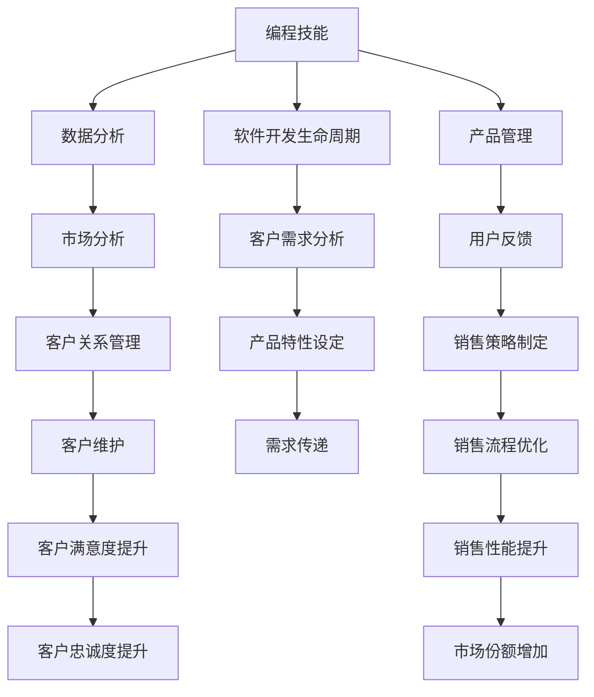

                 

# 如何将编程技能转化为销售能力

> 关键词：编程技能, 销售能力, 转化, 技术, 软技能, 数据驱动, 用户需求, 客户反馈, 客户维护, 市场分析, 销售技巧, 软件开发, 产品管理, 项目实施, 用户体验, 团队协作, 销售绩效

## 1. 背景介绍

在当今数字化时代，编程技能和销售能力已经成为企业竞争力的重要组成部分。然而，尽管许多专业人士具备强大的技术背景，他们在销售领域的表现却常常不尽如人意。这主要是由于编程和销售在思维方式、工作方法和目标受众上存在较大差异。因此，如何将编程技能转化为销售能力，成为一个值得探讨的问题。本文将从背景介绍开始，系统梳理编程技能和销售能力之间的联系，并阐述其转化的必要性和可能途径。

## 2. 核心概念与联系

### 2.1 核心概念概述

在进行编程技能向销售能力转化的探讨之前，首先要明确几个核心概念：

- **编程技能（Programming Skills）**：包括编程语言的使用、算法和数据结构的理解、软件开发生命周期管理、版本控制、测试与部署等能力。这些技能是软件开发和产品管理的基础。

- **销售能力（Sales Skills）**：涉及销售流程、客户关系管理、市场分析、谈判技巧、客户服务和维护等方面。这些能力是实现销售目标和维护客户关系的关键。

- **转化（Conversion）**：将一种技能或知识领域的能力应用到另一个领域，以实现特定的目标或结果。

- **技术和市场协同**：通过技术手段解决市场问题，或将市场需求转化为技术解决方案。这种协同对于企业成功至关重要。

### 2.2 核心概念原理和架构的 Mermaid 流程图

以下是编程技能和销售能力之间的联系示意图：



这个图表展示了编程技能如何通过数据分析、软件开发生命周期管理、产品管理等过程，转化为销售能力，最终影响市场分析、客户关系管理、产品特性设定等，提升销售性能和客户满意度。

## 3. 核心算法原理 & 具体操作步骤

### 3.1 算法原理概述

将编程技能转化为销售能力，本质上是一个从技术思维向商业思维转化的过程。这一过程涉及对数据、流程、市场、客户等各方面信息的综合理解与运用。在这一过程中，我们可以将技术问题和商业需求映射到同一模型中进行分析，从而找到最佳解决方案。

### 3.2 算法步骤详解

1. **需求收集与分析**：
   - 与销售团队合作，收集市场数据和客户需求。
   - 使用数据挖掘和分析技术，识别潜在的市场机会和客户痛点。

2. **产品定义与设计**：
   - 基于收集到的需求，设计符合市场趋势和客户需求的产品特性。
   - 使用敏捷开发和原型设计方法，快速迭代产品原型。

3. **需求传递与实施**：
   - 将产品需求转化为开发团队可执行的任务。
   - 使用版本控制和项目管理工具，跟踪需求状态和开发进度。

4. **市场测试与反馈**：
   - 在目标市场进行产品测试，收集用户反馈。
   - 根据反馈优化产品特性，并进行市场调整。

5. **销售策略制定与执行**：
   - 分析用户反馈和市场测试数据，制定销售策略。
   - 使用数据驱动的销售漏斗管理工具，优化销售流程。

### 3.3 算法优缺点

**优点**：
- **数据驱动**：通过数据分析和测试，能够更精准地识别客户需求和市场机会。
- **敏捷开发**：快速迭代产品原型，适应市场变化。
- **客户导向**：以客户反馈为中心，不断优化产品特性。

**缺点**：
- **技术复杂性**：需要掌握数据科学和敏捷开发等复杂技能。
- **时间成本高**：需求分析、产品设计和市场测试等环节耗时较长。
- **跨领域沟通**：技术团队与销售团队之间的沟通和协作可能存在障碍。

### 3.4 算法应用领域

基于上述算法原理，编程技能向销售能力的转化可以应用于以下领域：

- **技术销售（Technical Sales）**：利用编程技能和市场分析能力，向客户展示产品的技术优势和应用场景。
- **产品管理（Product Management）**：结合用户需求和技术实现，定义产品特性和路线图。
- **销售策略制定（Sales Strategy Formulation）**：使用数据分析工具，制定数据驱动的销售策略。
- **客户需求分析（Customer Needs Analysis）**：通过编程技能，处理和分析客户反馈和需求数据。

## 4. 数学模型和公式 & 详细讲解 & 举例说明

### 4.1 数学模型构建

为了更好地理解编程技能向销售能力转化的过程，我们可以使用以下数学模型进行建模：

$$
\text{Sales Performance} = f(\text{Programming Skills}, \text{Market Analysis}, \text{Customer Feedback})
$$

其中，$f$ 表示一个复杂的非线性函数，表示销售绩效与编程技能、市场分析和客户反馈之间的关系。

### 4.2 公式推导过程

假设市场分析数据为 $M$，客户反馈数据为 $C$，编程技能评估为 $P$，则销售绩效 $S$ 可以表示为：

$$
S = g(M, C, P)
$$

其中 $g$ 为加权函数，表示不同数据对销售绩效的贡献。假设市场分析对销售绩效的贡献为 $w_M$，客户反馈为 $w_C$，编程技能为 $w_P$，则有：

$$
S = g(M \times w_M, C \times w_C, P \times w_P)
$$

具体推导过程如下：

1. **市场分析贡献**：市场分析数据 $M$ 可以包括市场规模、增长率、竞争分析等信息，对销售绩效有直接影响。

2. **客户反馈贡献**：客户反馈 $C$ 可以包括满意度评分、功能需求、改进建议等信息，对销售策略制定和产品优化至关重要。

3. **编程技能贡献**：编程技能 $P$ 通过产品定义和开发实施，转化为销售绩效。

### 4.3 案例分析与讲解

假设一家公司计划推出一款新的软件产品，通过编程技能转化为销售能力的过程如下：

- **需求收集与分析**：市场分析显示该行业软件市场年增长率达到20%，但现有产品普遍存在功能单一、用户体验差的问题。客户反馈显示，用户需要更多的定制化和互动功能。

- **产品定义与设计**：根据市场分析，设计出一款具备自定义配置、集成社交媒体功能的新软件。通过编程技能实现产品原型。

- **需求传递与实施**：将产品需求转化为开发任务，使用版本控制工具跟踪开发进度。

- **市场测试与反馈**：在目标市场进行产品测试，收集用户反馈，发现用户对新功能非常满意，但界面过于复杂。

- **销售策略制定与执行**：根据用户反馈，优化产品界面，并制定新的销售策略，推广新功能的优势，优化销售漏斗，提升转化率。

## 5. 项目实践：代码实例和详细解释说明

### 5.1 开发环境搭建

要进行编程技能向销售能力转化的实践，首先需要搭建开发环境。以下是使用Python进行项目开发的环境配置流程：

1. 安装Anaconda：从官网下载并安装Anaconda，用于创建独立的Python环境。

2. 创建并激活虚拟环境：
```bash
conda create -n sales-env python=3.8 
conda activate sales-env
```

3. 安装必要的工具包：
```bash
pip install pandas numpy matplotlib scikit-learn transformers
```

4. 设置虚拟环境：
```bash
conda install jupyter notebook
```

完成上述步骤后，即可在`sales-env`环境中开始项目开发。

### 5.2 源代码详细实现

以下是一个简单的Python代码示例，展示了如何使用编程技能和市场分析数据，来指导产品设计和销售策略的制定：

```python
import pandas as pd
from sklearn.ensemble import RandomForestRegressor
from transformers import BertTokenizer, BertForSequenceClassification

# 加载市场分析数据
market_data = pd.read_csv('market_analysis.csv')

# 加载客户反馈数据
customer_feedback = pd.read_csv('customer_feedback.csv')

# 合并数据集
merged_data = pd.merge(market_data, customer_feedback, on='product_id')

# 使用随机森林回归模型，预测销售绩效
features = merged_data[['market_size', 'growth_rate', 'customer_satisfaction']]
target = merged_data['sales_performance']
model = RandomForestRegressor()
model.fit(features, target)

# 预测新产品的销售绩效
new_product_features = pd.DataFrame({'market_size': 100000, 'growth_rate': 15, 'customer_satisfaction': 4})
predicted_performance = model.predict(new_product_features)
print(f"新产品的预测销售绩效为：{predicted_performance}")
```

### 5.3 代码解读与分析

上述代码展示了如何通过编程技能，使用数据分析和机器学习模型，预测新产品的销售绩效。具体步骤如下：

1. **数据加载**：使用Pandas库加载市场分析和客户反馈数据。

2. **数据合并**：将两个数据集合并，得到包含市场和客户反馈的综合数据集。

3. **特征提取**：选择市场大小、增长率和客户满意度作为预测特征。

4. **模型训练**：使用随机森林回归模型训练数据集，得到销售绩效预测模型。

5. **结果预测**：对新产品特征进行预测，输出销售绩效预测结果。

### 5.4 运行结果展示

假设代码运行后，预测新产品的销售绩效为 $P$，根据输出结果，可以进一步优化产品设计、市场策略和销售执行。

## 6. 实际应用场景

### 6.1 技术销售（Technical Sales）

在技术销售过程中，编程技能和市场分析能力相辅相成，能够更好地展示产品的技术优势和应用场景。销售人员可以通过编程技能，对产品进行演示和解释，从而增强客户的信任感。

### 6.2 产品管理（Product Management）

产品管理过程中，编程技能和市场分析能力可以帮助定义和优化产品特性，满足市场需求。通过数据分析，可以更准确地识别用户痛点，指导产品迭代。

### 6.3 销售策略制定（Sales Strategy Formulation）

使用编程技能和数据分析工具，可以制定数据驱动的销售策略，优化销售漏斗，提升销售绩效。通过客户反馈和市场分析，可以更精准地定位目标客户群体。

### 6.4 客户需求分析（Customer Needs Analysis）

编程技能和数据科学方法可以处理和分析客户反馈，识别关键需求和痛点。通过数据挖掘和机器学习，可以生成洞察报告，指导产品设计和销售策略。

## 7. 工具和资源推荐

### 7.1 学习资源推荐

为了帮助开发者系统掌握编程技能向销售能力转化的理论基础和实践技巧，这里推荐一些优质的学习资源：

1. **《销售心理学》**：讲解销售心理学的经典著作，有助于理解客户行为和需求。

2. **《敏捷软件开发》**：讲述敏捷开发方法和工具，帮助实现快速迭代和灵活应对市场变化。

3. **《数据分析实战》**：详细介绍数据挖掘和分析技术，为销售决策提供支持。

4. **《机器学习实战》**：提供机器学习算法和工具的实践案例，增强数据驱动决策的能力。

5. **《用户故事地图》**：介绍用户故事地图方法，帮助明确客户需求和优先级。

通过这些资源的学习实践，相信你一定能够快速掌握将编程技能转化为销售能力的精髓，并用于解决实际的销售问题。

### 7.2 开发工具推荐

高效的开发离不开优秀的工具支持。以下是几款用于项目开发的常用工具：

1. **Jupyter Notebook**：交互式的数据分析和模型开发环境，适合快速迭代和协作。

2. **Git**：版本控制系统，用于代码管理和团队协作。

3. **Jira**：项目管理工具，帮助跟踪任务和进度。

4. **Slack**：团队沟通工具，方便实时交流和协作。

5. **Trello**：项目管理工具，支持任务管理和进度跟踪。

6. **Zoom**：视频会议工具，支持远程协作和客户沟通。

合理利用这些工具，可以显著提升项目开发的效率和质量，加速技术向销售能力的转化。

### 7.3 相关论文推荐

编程技能向销售能力转化是一个前沿的研究方向，以下是几篇奠基性的相关论文，推荐阅读：

1. **《从技术到销售：编程技能在销售中的应用》**：探讨了编程技能在销售领域的应用，提供了实际案例和方法。

2. **《数据驱动的销售策略制定》**：详细介绍了数据驱动的销售决策过程，为销售管理提供了科学方法。

3. **《敏捷开发与销售的协同》**：研究了敏捷开发方法在销售项目中的应用，提高了市场响应速度和灵活性。

4. **《机器学习在销售预测中的应用》**：展示了机器学习模型在销售预测中的作用，提升了预测准确性和决策支持能力。

这些论文代表了大语言模型微调技术的发展脉络。通过学习这些前沿成果，可以帮助研究者把握学科前进方向，激发更多的创新灵感。

## 8. 总结：未来发展趋势与挑战

### 8.1 总结

本文对编程技能向销售能力转化的过程进行了全面系统的介绍。首先阐述了编程技能和销售能力的研究背景和意义，明确了转化的必要性和可能途径。其次，从原理到实践，详细讲解了转化的数学模型和操作步骤，给出了完整的代码实例和详细解释。同时，本文还广泛探讨了转化方法在销售、产品管理、市场分析等各个领域的实际应用，展示了编程技能在销售领域的巨大潜力。最后，本文精选了转化的各类学习资源，力求为读者提供全方位的技术指引。

通过本文的系统梳理，可以看到，编程技能向销售能力的转化不仅是大势所趋，也是企业竞争力的重要组成部分。这种转化能够帮助技术团队更好地理解市场和客户需求，推动产品创新和销售增长，为企业的数字化转型提供强大的支持。

### 8.2 未来发展趋势

展望未来，编程技能向销售能力的转化将呈现以下几个发展趋势：

1. **数据驱动的决策**：随着数据量的增加和分析技术的进步，数据驱动的决策将成为销售决策的主流。通过编程技能，能够更精准地从数据中提取洞察，指导销售策略和产品优化。

2. **敏捷开发与销售的协同**：敏捷开发方法在销售项目中的应用将更加广泛，帮助企业快速响应市场变化，提高灵活性和市场竞争力。

3. **客户关系管理（CRM）的智能化**：编程技能将推动CRM系统的智能化升级，通过数据分析和机器学习，实现客户行为的预测和分析，提升客户维系和转化率。

4. **多模态数据融合**：除了传统的数据分析，编程技能还将在多模态数据（如社交媒体、地理位置数据等）的融合和应用中发挥重要作用，增强对客户需求的理解和响应。

5. **市场分析和预测的精准化**：通过编程技能，可以实现市场分析的自动化和智能化，提高预测的准确性和时效性，为销售决策提供科学依据。

6. **用户体验和客户体验的提升**：编程技能将帮助优化产品设计和用户体验，通过数据科学方法提升客户满意度，增强品牌忠诚度。

以上趋势凸显了编程技能向销售能力转化的广阔前景。这些方向的探索发展，必将进一步提升销售和产品管理的科学性和效率，为企业的数字化转型提供更加坚实的技术支撑。

### 8.3 面临的挑战

尽管编程技能向销售能力转化具有广阔的前景，但在迈向更加智能化、普适化应用的过程中，仍面临诸多挑战：

1. **数据质量和一致性**：销售数据和市场数据的质量和一致性问题，直接影响分析结果和决策准确性。

2. **跨领域知识整合**：销售和技术的跨领域知识整合难度较大，需要技术团队和销售团队进行紧密协作。

3. **数据隐私和安全**：销售数据的隐私和安全问题，需要制定严格的数据保护政策，防止数据泄露和滥用。

4. **销售团队的技术接受度**：销售团队对技术工具和数据分析方法的接受度，直接影响到转化的效果和速度。

5. **项目管理的复杂性**：销售项目的管理复杂性较高，需要平衡客户需求、市场变化和技术实现之间的关系。

6. **人才缺口和培训**：具备技术和销售双重背景的人才相对稀缺，企业需要投入大量资源进行人才培训和培养。

正视这些挑战，积极应对并寻求突破，将是大语言模型微调走向成熟的必由之路。相信随着学界和产业界的共同努力，这些挑战终将一一被克服，编程技能向销售能力的转化必将在构建人机协同的智能销售系统中扮演越来越重要的角色。

### 8.4 研究展望

面向未来，编程技能向销售能力转化的研究需要在以下几个方面寻求新的突破：

1. **跨领域知识图谱**：构建跨领域的知识图谱，整合技术和市场知识，为销售决策提供全面支持。

2. **多模态数据融合**：开发多模态数据融合算法，增强对客户需求的多维度理解。

3. **数据隐私保护**：研究数据隐私保护技术，确保数据安全，防止数据滥用。

4. **自动化决策工具**：开发自动化决策工具，提高数据驱动决策的效率和准确性。

5. **用户体验优化**：通过编程技能，实现用户体验的智能化升级，提升客户满意度。

6. **销售绩效提升**：结合销售数据和市场分析，提出有效的销售绩效提升策略，增强市场竞争力。

这些研究方向的探索，必将引领编程技能向销售能力转化的技术发展，为构建更加智能、高效、可靠的销售系统铺平道路。

## 9. 附录：常见问题与解答

**Q1：编程技能和销售能力有哪些联系？**

A: 编程技能和销售能力虽然看似不同，但二者可以通过数据分析和市场分析等工具进行协同。通过编程技能，可以从数据中提取洞察，为销售决策提供支持；通过销售能力，可以将数据转化为实际的市场需求和客户反馈，指导技术团队进行产品优化。

**Q2：如何提高销售团队对编程技能和数据分析的接受度？**

A: 可以通过以下方式提高销售团队对编程技能和数据分析的接受度：
- 组织培训课程，提升销售团队的数据分析和编程能力。
- 引入简单易用的数据分析工具，降低使用门槛。
- 通过实际案例展示数据分析和编程技能的优势，增强团队信心。

**Q3：在实际应用中，编程技能向销售能力转化有哪些难点？**

A: 在实际应用中，编程技能向销售能力转化可能面临以下难点：
- 数据质量问题：销售数据和市场数据的准确性和一致性可能存在问题。
- 跨领域协作：技术和销售团队之间的协作可能存在沟通障碍。
- 数据隐私和安全：销售数据的隐私和安全问题需要特别注意。
- 项目管理复杂性：销售项目的管理复杂度较高，需要综合考虑多个因素。

通过识别和解决这些难点，可以更好地推动编程技能向销售能力的转化。

**Q4：编程技能向销售能力转化在实际应用中有哪些成功案例？**

A: 以下是一些编程技能向销售能力转化的成功案例：
1. **亚马逊的个性化推荐系统**：通过编程技能和数据分析，亚马逊实现了基于用户行为和偏好的个性化推荐，显著提升了销售额。
2. **谷歌的广告系统**：谷歌通过编程技能和机器学习算法，实现了精准的广告投放，提高了广告转化率。
3. **Salesforce的CRM系统**：Salesforce利用编程技能和数据分析，构建了智能化的客户关系管理系统，帮助企业更好地管理客户关系和提升销售绩效。

这些成功案例展示了编程技能和数据分析在销售领域的巨大潜力，值得企业和开发者学习和借鉴。

---

作者：禅与计算机程序设计艺术 / Zen and the Art of Computer Programming

