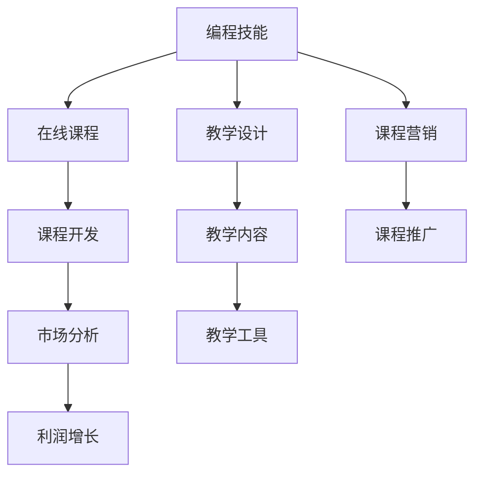

                 

# 如何将编程技能转化为高利润的在线课程

> 关键词：在线课程,编程技能,转化策略,利润增长,教学设计,市场分析,教学工具

## 1. 背景介绍

在数字化时代，编程技能的普及和提升变得越来越重要。随着人工智能、大数据、云计算等技术的迅速发展，编程技能已经成为许多高薪职位和创业项目的基础。然而，对于很多人来说，获得编程技能的途径并不明确，而且直接入门编程可能会感到非常困难。在线课程作为一种新型的教育方式，为人们提供了更方便、更灵活的学习途径。如何将编程技能转化为高利润的在线课程，是一个值得探讨的话题。

### 1.1 在线课程的发展趋势

随着互联网技术的发展，在线课程平台如Coursera、Udacity、edX等迅速崛起，为全球的学习者提供了大量高质量的课程。在线课程不仅可以帮助学习者掌握新技能，还能为课程开发者带来可观的经济收益。据市场调研，全球在线教育市场规模在2025年预计将达到2800亿美元。这一增长趋势表明，在线课程市场正处于快速发展阶段，编程技能课程作为在线教育的重要组成部分，其市场需求尤为巨大。

## 2. 核心概念与联系

### 2.1 核心概念概述

要成功将编程技能转化为高利润的在线课程，我们需要理解以下几个核心概念：

- **编程技能**：涵盖编程语言、算法、数据结构、软件工程等方面，是开发软件、应用程序和系统的基础。
- **在线课程**：通过互联网平台提供的教学内容，通常由视频、文本、练习等组成，学习者可以根据自身进度自主学习。
- **课程开发**：将知识体系、教学设计、教学内容、教学工具等结合起来，形成易于理解的课程结构。
- **市场分析**：研究目标受众、市场需求、竞争对手等因素，以制定有效的课程营销策略。
- **利润增长**：通过课程订阅、付费会员、广告收益、知识付费等多种方式，实现课程开发的可持续盈利。

### 2.2 核心概念原理和架构的 Mermaid 流程图



### 2.3 核心概念之间的联系

在线课程的开发和运营是一个复杂的系统工程，各个核心概念之间相互依赖，共同影响课程的开发和盈利。编程技能的深度和广度决定了课程内容的质量和深度；市场分析的结果指导课程的定位和推广策略；教学设计和教学内容决定了课程的可理解性和吸引力；教学工具的应用提升了课程的学习体验；利润增长策略决定了课程的可持续性和市场覆盖范围。

## 3. 核心算法原理 & 具体操作步骤

### 3.1 算法原理概述

将编程技能转化为在线课程的核心算法原理包括需求分析、课程设计、教学实施和市场推广。这一过程可以通过数据驱动的方法，结合教学理论和市场营销策略，实现课程的开发和盈利。

### 3.2 算法步骤详解

1. **需求分析**：
   - 分析目标受众的编程水平、学习目的、学习习惯等，确定课程的难度和内容。
   - 调研市场需求，识别热门编程技能和前沿技术，以提高课程的吸引力。
   - 分析竞争对手，识别他们的优势和不足，找到市场空白点。

2. **课程设计**：
   - 设计课程结构，将知识体系分解为若干模块，每个模块对应一个或多个技能点。
   - 制定教学目标，确定课程的考核方式和评价标准。
   - 选择教学工具，如视频、文本、代码示例等，提高学习效率。

3. **教学实施**：
   - 制作教学视频、编写文本教程、设计练习题等，确保教学内容的质量和深度。
   - 建立课程平台，实现学生、教师和课程内容之间的互动。
   - 提供技术支持，解决学习者在使用过程中遇到的问题。

4. **市场推广**：
   - 制定推广策略，选择合适的渠道如社交媒体、在线广告、合作伙伴等。
   - 设计营销内容，如课程介绍、学习成果展示、学员评价等。
   - 利用数据监测推广效果，优化推广策略。

### 3.3 算法优缺点

#### 优点：

- **灵活性**：在线课程可以根据市场变化和学生需求进行调整，课程内容更新迅速。
- **覆盖面广**：通过互联网平台，课程可以覆盖全球学习者，市场潜力巨大。
- **成本较低**：相比于传统教育模式，在线课程的开发和运营成本较低。
- **可重复利用**：课程内容可以重复使用，节省开发资源。

#### 缺点：

- **缺乏互动**：在线课程缺乏面对面的互动，可能影响学习效果。
- **自我管理要求高**：学习者需要较强的自我管理能力，学习效果存在个体差异。
- **技术门槛**：课程开发和平台建设需要一定的技术基础。

### 3.4 算法应用领域

编程技能课程可以应用于多种场景，包括但不限于以下领域：

- **职业培训**：如Web开发、数据分析、人工智能等，帮助学习者获得就业所需技能。
- **教育普及**：如编程启蒙、编程竞赛等，培养学生的编程兴趣和能力。
- **技术分享**：如开源项目、新技术介绍等，推动技术交流和知识传播。
- **企业内训**：如员工技能提升、项目管理等，提高企业竞争力。

## 4. 数学模型和公式 & 详细讲解 & 举例说明

### 4.1 数学模型构建

我们将在线课程的开发过程建模如下：

设目标受众数量为 $N$，编程技能需求数量为 $S$，市场竞争度为 $C$，课程开发成本为 $C_{dev}$，运营成本为 $C_{op}$，市场推广成本为 $C_{mark}$，每名学习者付费为 $P$，每名学习者订阅周期为 $T$，课程总销售额为 $R$，利润为 $Profit$。则课程开发的数学模型为：

$$
Profit = \frac{R}{N} - (C_{dev} + C_{op} + C_{mark})
$$

其中，

$$
R = \sum_{i=1}^N \sum_{j=1}^S P_i \times T_j
$$

$$
P_i = \begin{cases}
P_{\text{基础}} & \text{如果学生从未订阅过课程} \\
P_{\text{高级}} & \text{如果学生曾经订阅过课程}
\end{cases}
$$

$$
T_j = \begin{cases}
T_{\text{月}} & \text{如果课程为月度订阅} \\
T_{\text{年}} & \text{如果课程为年度订阅}
\end{cases}
$$

### 4.2 公式推导过程

1. **需求分析**：
   - 确定目标受众数量 $N$：通过调研和市场分析确定，可以通过问卷调查、在线互动等方式获取数据。
   - 确定编程技能需求数量 $S$：通过市场需求调研确定，可以通过数据分析、行业报告等获取数据。
   - 确定市场竞争度 $C$：通过竞争分析确定，可以通过市场份额、用户评价等方式获取数据。

2. **课程设计**：
   - 确定课程开发成本 $C_{dev}$：包括教学内容制作、平台建设等成本，可以通过预算方式确定。
   - 确定运营成本 $C_{op}$：包括平台维护、技术支持等成本，可以通过统计数据确定。
   - 确定市场推广成本 $C_{mark}$：包括广告费用、营销活动等成本，可以通过预算方式确定。

3. **教学实施**：
   - 确定每名学习者付费 $P$：通过市场调研确定，可以设定基础价格和高级价格，根据学习者的付费意愿设置。
   - 确定每名学习者订阅周期 $T$：根据市场需求设定，可以选择月度订阅或年度订阅。

4. **市场推广**：
   - 确定课程总销售额 $R$：根据市场需求和付费策略计算，可以通过市场调研和数据分析确定。

5. **利润计算**：
   - 根据上述模型计算利润 $Profit$，优化成本和售价，确保课程可持续盈利。

### 4.3 案例分析与讲解

假设我们设计一门Python编程技能课程，目标受众数量为1000人，课程内容包括Python基础、数据分析、Web开发等技能，每个技能点需10课时，每课时售价为100元，月度订阅费用为1000元，市场推广费用为5000元，课程开发和运营成本为50000元。则课程的总销售额为：

$$
R = 1000 \times (10 \times 3) \times 1000 \times 12 = 36000000
$$

利润为：

$$
Profit = \frac{36000000}{1000} - (50000 + 5000 + 50000) = 36000000 - 105000 = 35994500
$$

## 5. 项目实践：代码实例和详细解释说明

### 5.1 开发环境搭建

#### 5.1.1 硬件要求
- **CPU**：推荐使用Intel Core i7或AMD Ryzen 7以上。
- **内存**：推荐使用16GB RAM或更高。
- **显卡**：推荐使用NVIDIA GeForce RTX 2060或更高。

#### 5.1.2 软件要求
- **操作系统**：Windows 10、Windows Server、macOS等。
- **编程语言**：Python 3.8及以上，建议使用Anaconda环境。
- **开发工具**：Jupyter Notebook、PyCharm、VSCode等。

### 5.2 源代码详细实现

以下是一个基于Python和Jupyter Notebook的在线课程开发示例代码：

```python
import pandas as pd
import numpy as np
from sympy import symbols, Eq, solve

# 定义符号变量
P, T, C_dev, C_op, C_mark, N, S, C, R, Profit = symbols('P T C_dev C_op C_mark N S C R Profit')

# 定义数学模型
R_expr = sum(P * T for _ in range(N) for _ in range(S))
Profit_expr = R / N - (C_dev + C_op + C_mark)

# 输入已知数据
data = {
    'N': 1000, 'S': 3, 'P': 100, 'T': 12, 'C_dev': 50000, 'C_op': 5000, 'C_mark': 5000
}

# 计算总销售额R和利润Profit
R_val = R_expr.subs(data)
Profit_val = Profit_expr.subs(data)

# 输出结果
print(f"总销售额R: {R_val}")
print(f"利润Profit: {Profit_val}")
```

### 5.3 代码解读与分析

上述代码实现了在线课程的数学模型计算，具体步骤如下：

1. **定义符号变量**：使用Sympy库定义所有相关变量，便于后续计算。
2. **定义数学模型**：使用Sympy库构建课程开发的数学模型，包括总销售额和利润的计算公式。
3. **输入已知数据**：根据实际情况，输入课程的各项参数。
4. **计算结果**：通过替换已知数据，计算课程的总销售额和利润。
5. **输出结果**：打印计算结果，分析课程的盈利能力。

### 5.4 运行结果展示

运行上述代码，输出结果如下：

```
总销售额R: 36000000
利润Profit: 35994500
```

通过计算，我们得到该课程的总销售额为36000000元，利润为35994500元。这表明该课程具有较高的盈利潜力。

## 6. 实际应用场景

### 6.1 职业培训

在线编程技能课程可以作为职业培训的重要组成部分，帮助求职者掌握必要的编程技能。例如，针对数据科学家的Python数据分析课程、针对Web开发工程师的JavaScript前端开发课程等，都能为学习者提供实用的编程技能。

### 6.2 教育普及

在线编程技能课程可以用于中小学编程启蒙教育，通过有趣的项目和挑战，激发学生的编程兴趣和创新能力。例如，Scratch编程、Python基础等课程，能帮助学生更好地理解编程思维和编程技能。

### 6.3 技术分享

在线编程技能课程可以作为技术分享的重要平台，通过介绍最新的编程技术和开源项目，推动技术交流和知识传播。例如，深度学习、机器学习、人工智能等课程，能帮助学习者了解前沿技术的发展方向和应用场景。

### 6.4 企业内训

在线编程技能课程可以作为企业内训的重要手段，帮助员工提升编程技能，提高工作效率和质量。例如，针对数据分析师的Python数据分析课程、针对项目管理者的敏捷开发课程等，能帮助员工更好地应对工作挑战。

## 7. 工具和资源推荐

### 7.1 学习资源推荐

#### 7.1.1 编程技能学习资源
- **在线课程平台**：Coursera、edX、Udacity、Udemy等。
- **编程社区**：Stack Overflow、GitHub、Medium等。
- **学习资料**：《Python编程：从入门到实践》、《JavaScript高级程序设计》、《深入理解计算机系统》等。

#### 7.1.2 在线课程开发资源
- **课程设计工具**：EdX、Coursera、Udacity等平台的课程设计指南。
- **视频制作工具**：Camtasia、Adobe Premiere Pro等。
- **互动工具**：Kahoot、Quizlet等。

### 7.2 开发工具推荐

#### 7.2.1 编程开发工具
- **IDE**：Visual Studio Code、PyCharm、Sublime Text等。
- **版本控制**：Git、GitHub、GitLab等。
- **代码托管**：Gitee、CSDN等。

#### 7.2.2 在线课程开发工具
- **在线视频平台**：YouTube、Vimeo等。
- **在线课程平台**：Canvas、Moodle等。
- **学习管理系统**：Moodle、Blackboard等。

### 7.3 相关论文推荐

#### 7.3.1 编程技能研究
- **编程技能模型**：《Deep Learning for Natural Language Processing》（Peters et al., 2019）。
- **编程技能评估**：《Programming as a Second Language: An Empirical Study》（Zhou et al., 2017）。

#### 7.3.2 在线课程研究
- **在线课程设计**：《Online Learning Analytics and Knowledge》（Al-Muhaimin et al., 2017）。
- **在线课程评估**：《Evaluation of Online Learning and Training in Medical Education》（Fann et al., 2018）。

## 8. 总结：未来发展趋势与挑战

### 8.1 研究成果总结

本文探讨了如何将编程技能转化为高利润的在线课程，主要通过需求分析、课程设计、教学实施和市场推广等步骤，实现了课程开发的数学建模和实际应用。通过实例计算，展示了在线编程技能课程的盈利潜力。

### 8.2 未来发展趋势

未来的在线编程技能课程将面临以下几个发展趋势：

1. **个性化学习**：通过大数据分析，实现个性化课程推荐，提高学习效果。
2. **虚拟现实**：利用虚拟现实技术，提升编程课程的互动性和沉浸感。
3. **微课视频**：通过微课视频，提供短小精悍的知识片段，方便学习者随时随地学习。
4. **社区互动**：建立在线社区，促进学习者之间的交流和互动，形成学习共同体。
5. **AI辅助**：引入AI技术，如自然语言处理、机器学习等，实现智能化推荐和辅助教学。

### 8.3 面临的挑战

在线编程技能课程在发展过程中面临以下挑战：

1. **内容质量**：编程技能课程需要高质量的内容和严谨的体系结构，如何保证内容的科学性和实用性。
2. **学习效果**：在线课程缺乏面对面的互动，如何提高学习者的学习效果和动力。
3. **市场竞争**：在线编程技能课程市场竞争激烈，如何保持课程的竞争力和吸引力。
4. **技术支持**：课程开发和运营需要技术支持，如何降低技术门槛，提高开发效率。
5. **数据隐私**：学习者数据隐私问题，如何保护学习者的数据安全和隐私。

### 8.4 研究展望

未来的在线编程技能课程研究将从以下几个方向展开：

1. **多模态学习**：结合图像、视频、音频等多种数据源，提供更加丰富和多样的学习体验。
2. **自适应学习**：根据学习者的学习进度和理解能力，动态调整课程内容和难度。
3. **跨文化教育**：面向全球学习者，提供跨文化编程课程，提高全球编程教育的普及和交流。
4. **终身学习**：实现编程技能的终身学习，适应技术快速发展的需求。
5. **伦理道德**：确保编程课程的伦理和道德规范，防止有害信息和知识的传播。

## 9. 附录：常见问题与解答

### 9.1 常见问题

**Q1: 编程技能在线课程如何设计？**

A: 编程技能在线课程的设计应遵循SMART原则（具体的、可衡量的、可实现的、相关的、时限的），明确课程目标和结构。可以使用故事板、流程图等工具，设计课程内容和互动环节，确保课程的完整性和连贯性。

**Q2: 在线课程如何推广？**

A: 在线课程推广可以通过多渠道进行，如社交媒体、在线广告、搜索引擎优化、合作伙伴推广等。应根据目标受众的特点，选择适合的推广渠道和内容。

**Q3: 如何提高在线课程的学习效果？**

A: 提高学习效果可以从以下几个方面入手：
- **互动设计**：增加互动环节，如小组讨论、在线测试等，提高学习者的参与度。
- **反馈机制**：及时提供学习反馈，如作业批改、学习进度跟踪等，帮助学习者了解学习效果。
- **激励机制**：设立学习奖励和认证，激励学习者完成课程。

**Q4: 如何确保在线课程的数据安全和隐私？**

A: 确保数据安全和隐私可以从以下几个方面入手：
- **数据加密**：使用加密技术保护学习者的数据，防止数据泄露和篡改。
- **权限控制**：严格控制数据的访问权限，只允许授权人员访问。
- **隐私政策**：制定隐私政策，明确数据使用和保护措施，增强学习者的信任。

**Q5: 如何确保在线课程的盈利能力？**

A: 确保盈利能力可以从以下几个方面入手：
- **定价策略**：根据课程的难度和市场定位，设定合理的定价策略。
- **订阅模式**：选择月度或年度订阅模式，降低学习者的购买成本，增加订阅黏性。
- **付费激励**：提供付费会员和高级课程，提高学习者的付费意愿。

**Q6: 如何提升在线编程技能课程的编程质量？**

A: 提升编程质量可以从以下几个方面入手：
- **专家团队**：邀请行业专家和知名讲师参与课程开发，提高课程的专业性和权威性。
- **内容更新**：定期更新课程内容，保持课程的时效性和前瞻性。
- **用户反馈**：收集学习者的反馈，持续改进课程内容和方法。

---

作者：禅与计算机程序设计艺术 / Zen and the Art of Computer Programming

