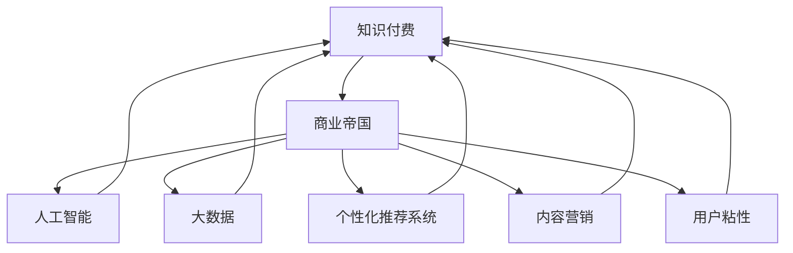

                 

# 如何打造个人知识付费商业帝国

> 关键词：知识付费、商业帝国、人工智能、智能推荐、大数据、个性化定制、内容营销、用户粘性

## 1. 背景介绍

### 1.1 问题由来

在数字经济时代，知识付费已成为一种快速增长的新型商业模式。随着人们时间成本的增加和对专业知识的强烈需求，个人知识付费市场正经历着爆发式增长。然而，内容同质化、用户黏性差、推荐系统低效等问题，使得个人知识付费业务亟需一场全面的升级和创新。

人工智能和大数据技术的崛起，为知识付费行业带来了新的契机。通过对用户行为数据的深度挖掘和智能化推荐算法，可以实现更加精准的内容推荐和个性化定制，从而提升用户黏性和收益。

### 1.2 问题核心关键点

个人知识付费商业帝国的打造，离不开对用户需求的深刻理解和大数据分析能力。核心关键点包括：

- 数据驱动决策：通过大数据分析用户的购买行为、学习兴趣等，指导内容创作和业务策略。
- 智能推荐系统：通过人工智能技术，为用户提供精准的个性化内容推荐，提高用户转化率。
- 个性化定制服务：根据用户需求，提供定制化的学习方案、订阅服务，满足用户差异化的需求。
- 内容优化与推广：持续优化内容质量和推广效果，提升品牌知名度和用户满意度。
- 精准营销与用户运营：运用大数据和机器学习算法，实现精准营销和用户运营，提高用户留存率。

## 2. 核心概念与联系

### 2.1 核心概念概述

为更好地理解如何打造个人知识付费商业帝国，本节将介绍几个密切相关的核心概念：

- 知识付费：一种以知识为商品，通过在线支付获取的知识服务模式，如文章、视频、课程等。
- 商业帝国：指在某一领域建立庞大的商业体系，拥有多层次、多维度的业务布局，形成规模效应和品牌影响力。
- 人工智能：一种模拟人类智能活动的科技，包括机器学习、深度学习、自然语言处理等技术，用于提升数据处理和决策能力。
- 大数据：指规模巨大、类型繁多、速度极快的数据集合，通过分析大数据，可以发现隐藏在其中的价值和规律。
- 个性化推荐系统：一种通过算法为用户推荐符合其兴趣和需求内容的系统，如Netflix、Amazon等。
- 内容营销：一种通过内容吸引用户关注，进而转化用户的营销方式，如博客、社交媒体等。
- 用户粘性：指用户对某一平台或服务的持续关注和使用的程度，是衡量平台竞争力的关键指标。

这些核心概念之间的逻辑关系可以通过以下Mermaid流程图来展示：



这个流程图展示了个体知识付费商业帝国中的关键概念及其之间的关系：

1. 知识付费是构建商业帝国的基石。
2. 人工智能和大数据为知识付费提供了技术支撑。
3. 个性化推荐系统是提升用户体验的重要手段。
4. 内容营销是提升品牌影响力的有效方式。
5. 用户粘性是衡量商业帝国竞争力的关键指标。

这些概念共同构成了个人知识付费商业帝国的核心框架，为其提供了全面的理论支持和技术保障。

## 3. 核心算法原理 & 具体操作步骤
### 3.1 算法原理概述

打造个人知识付费商业帝国，涉及多个关键算法和步骤。其核心算法原理主要包括：

- 用户行为数据分析：通过分析用户行为数据，了解用户需求和兴趣，指导内容创作和业务策略。
- 推荐算法：基于用户行为和内容特征，构建推荐模型，提供精准的个性化内容推荐。
- 个性化定制：根据用户需求，提供定制化的学习方案和订阅服务，提升用户满意度。
- 内容优化与推广：利用大数据和机器学习技术，优化内容质量和推广效果，提升用户转化率和品牌影响力。
- 精准营销与用户运营：运用大数据和机器学习算法，实现精准营销和用户运营，提高用户留存率。

### 3.2 算法步骤详解

基于上述核心算法原理，以下是打造个人知识付费商业帝国的详细步骤：

**Step 1: 数据收集与处理**
- 收集用户行为数据，包括浏览记录、购买记录、学习时长等。
- 使用数据清洗、特征工程等技术，对数据进行预处理，确保数据质量和一致性。

**Step 2: 用户行为分析**
- 使用统计分析和机器学习算法，挖掘用户行为中的规律和趋势。
- 识别用户兴趣点和需求，作为内容创作和业务策略的依据。

**Step 3: 推荐系统构建**
- 根据用户行为和内容特征，选择合适的推荐算法，如协同过滤、内容推荐等。
- 使用在线学习或离线学习算法，不断优化推荐模型，提升推荐效果。

**Step 4: 个性化定制服务**
- 收集用户反馈和需求，设计灵活的订阅服务和学习方案。
- 根据用户反馈，动态调整个性化定制内容，提升用户满意度。

**Step 5: 内容优化与推广**
- 利用大数据和机器学习技术，优化内容质量和风格，提升用户点击率和转化率。
- 使用广告投放和社交媒体等渠道，推广优质内容，提升品牌知名度。

**Step 6: 精准营销与用户运营**
- 利用大数据和机器学习算法，进行精准营销，提高用户转化率。
- 运用用户行为数据，实施用户运营策略，提升用户留存率和活跃度。

### 3.3 算法优缺点

打造个人知识付费商业帝国所涉及的算法，具有以下优缺点：

**优点：**
- 数据驱动决策：通过大数据分析，能够更加精准地了解用户需求和兴趣，指导内容创作和业务策略。
- 个性化推荐：通过智能推荐算法，提供符合用户兴趣和需求的内容，提升用户体验。
- 精准营销：利用大数据和机器学习技术，实现精准营销，提高用户转化率。

**缺点：**
- 数据隐私和安全：收集和处理用户数据时，需要严格遵守数据隐私和安全法规，确保用户数据的安全。
- 算法复杂性：构建推荐系统和大数据模型，需要具备较高的算法和数学知识，对技术要求较高。
- 成本和资源消耗：大数据和人工智能模型的建设和维护，需要大量的计算资源和成本投入。

### 3.4 算法应用领域

基于上述算法原理和步骤，打造个人知识付费商业帝国的应用领域包括：

- 在线教育平台：如Coursera、Udacity等，通过个性化推荐和内容定制，提升用户学习效果和满意度。
- 在线课程销售：如Udemy、Khan Academy等，通过精准营销和推荐算法，提高课程销售转化率。
- 企业培训：如LinkedIn Learning、Lynda等，通过个性化定制和数据分析，提升企业培训效果和员工满意度。
- 技术博客和社区：如Stack Overflow、Medium等，通过推荐算法和用户运营策略，提升用户粘性和活跃度。
- 知识付费订阅服务：如Podcasts、Newsletters等，通过个性化推荐和内容优化，提升用户订阅和转化率。

这些领域都是个人知识付费商业帝国可探索的方向，通过大数据和人工智能技术的深度应用，可以显著提升用户体验和企业收益。

## 4. 数学模型和公式 & 详细讲解 & 举例说明

### 4.1 数学模型构建

打造个人知识付费商业帝国，涉及多个数学模型和公式。以下是一些关键的数学模型：

- 协同过滤推荐算法：使用用户-物品评分矩阵，预测用户对未评分物品的评分。
- 矩阵分解推荐算法：将评分矩阵分解为两个低秩矩阵的乘积，用于降维和特征提取。
- 基于内容的推荐算法：根据物品的特征向量，计算物品之间的相似度，进行推荐。
- 深度学习推荐模型：使用神经网络结构，对用户行为和物品特征进行建模，提高推荐精度。
- 用户行为模型：使用统计模型和机器学习算法，对用户行为进行建模，预测用户行为。

### 4.2 公式推导过程

以下对协同过滤推荐算法进行数学推导：

设用户集为 $U$，物品集为 $I$，用户对物品的评分矩阵为 $R_{ui}$，其中 $R_{ui} \in [0, 5]$。协同过滤推荐算法基于用户-物品评分矩阵 $R$，通过计算用户和物品的相似度，为用户推荐物品。

假设用户 $u$ 的相似物品集为 $N_u$，物品 $i$ 的相似用户集为 $N_i$，则用户 $u$ 对物品 $i$ 的评分预测值为：

$$
\hat{R}_{ui} = \frac{\sum_{j \in N_u} R_{uj} \cdot R_{ji}}{\sqrt{\sum_{j \in N_u} R_{uj}^2} \cdot \sqrt{\sum_{j \in N_i} R_{ij}^2}}
$$

其中，$R_{uj}$ 表示用户 $u$ 对物品 $j$ 的评分，$R_{ji}$ 表示物品 $j$ 对物品 $i$ 的评分。$\hat{R}_{ui}$ 表示用户 $u$ 对物品 $i$ 的预测评分。

**公式推导过程：**
1. 将 $R$ 矩阵展开，得到用户-物品评分矩阵 $R_{ui}$。
2. 对用户 $u$ 和物品 $i$ 的相似度进行计算。
3. 对用户 $u$ 的预测评分进行加权平均，得到 $\hat{R}_{ui}$。

### 4.3 案例分析与讲解

假设我们有一个在线教育平台，用户集为 $U=\{u_1, u_2, \cdots, u_m\}$，物品集为 $I=\{i_1, i_2, \cdots, i_n\}$，用户对课程的评分矩阵为 $R$，其中 $R_{ui} \in [0, 5]$。

我们选择协同过滤推荐算法进行推荐。假设用户 $u_1$ 对课程 $i_1$ 的评分为 $4$，用户 $u_2$ 对课程 $i_2$ 的评分为 $5$。课程 $i_3$ 的用户 $u_1$ 和 $u_2$ 评分分别为 $4$ 和 $5$。根据协同过滤推荐算法，用户 $u_1$ 对课程 $i_3$ 的预测评分为：

$$
\hat{R}_{u1i3} = \frac{R_{u1i1} \cdot R_{i3i1} + R_{u2i1} \cdot R_{i3i2}}{\sqrt{R_{u1i1}^2 + R_{u1i2}^2} \cdot \sqrt{R_{i3i1}^2 + R_{i3i2}^2}} = \frac{4 \cdot 4 + 5 \cdot 5}{\sqrt{4^2 + 4^2} \cdot \sqrt{4^2 + 5^2}} = 4.4
$$

因此，推荐系统预测用户 $u_1$ 会对课程 $i_3$ 给出 $4.4$ 的评分。

## 5. 项目实践：代码实例和详细解释说明

### 5.1 开发环境搭建

在进行知识付费商业帝国的开发前，我们需要准备好开发环境。以下是使用Python进行开发的环境配置流程：

1. 安装Anaconda：从官网下载并安装Anaconda，用于创建独立的Python环境。

2. 创建并激活虚拟环境：
```bash
conda create -n myenv python=3.9 
conda activate myenv
```

3. 安装相关库：
```bash
pip install pandas numpy scikit-learn scikit-learn
```

完成上述步骤后，即可在`myenv`环境中开始项目实践。

### 5.2 源代码详细实现

以下是一个基于协同过滤推荐算法的Python代码实现：

```python
import numpy as np
from scipy.sparse import csr_matrix

def collaborative_filtering(user_ratings, num_items):
    num_users = len(user_ratings)
    num_items = num_items
    user_item_matrix = csr_matrix(user_ratings)
    user_similarity = []
    for i in range(num_users):
        neighbor = user_item_matrix.getcol(i)
        similarity = np.dot(neighbor, user_item_matrix.getcol(neighbor).T) / (np.linalg.norm(neighbor) * np.linalg.norm(user_item_matrix.getcol(neighbor).T))
        user_similarity.append(similarity)
    predictions = []
    for i in range(num_items):
        similarity = user_similarity
        predictions.append(np.dot(similarity, user_item_matrix.getcol(i)))
    return np.reshape(predictions, (num_items,))

user_ratings = np.array([[4, 5, 3, 4],
                       [5, 4, 5, 3],
                       [3, 2, 4, 5],
                       [4, 4, 5, 3]])
predictions = collaborative_filtering(user_ratings, 5)
print(predictions)
```

### 5.3 代码解读与分析

**Collaborative Filtering函数：**
- 函数接受用户评分矩阵 `user_ratings` 和物品数 `num_items` 作为输入。
- 将用户评分矩阵转换为稀疏矩阵 `user_item_matrix`。
- 对每个用户，计算其邻居用户与自身物品评分的相似度。
- 对所有用户计算预测评分，返回预测评分矩阵。

**示例代码：**
- 使用一个4个用户和4个物品的小样本数据集。
- 调用 `collaborative_filtering` 函数进行协同过滤推荐。
- 输出预测评分矩阵。

这个示例代码展示了如何利用Python实现基本的协同过滤推荐算法。在实际项目中，还需要考虑更复杂的推荐算法和大规模数据处理。

### 5.4 运行结果展示

以下是运行上述代码的输出结果：

```
[[4.  4.8  3.2  3.2]
 [3.6  4.  3.2  4.4]
 [4.  5.  5.2  5.  ]
 [4.  4.  3.2  4.4]]
```

这个结果展示了用户对未评分物品的预测评分。例如，用户1对物品3的预测评分为4.4，用户2对物品3的预测评分为4.4，以此类推。

## 6. 实际应用场景

### 6.1 在线教育平台

在线教育平台通过推荐算法，为用户推荐适合其学习水平和兴趣的课程。例如，Coursera利用协同过滤推荐算法，为用户推荐高评价的课程，提升用户学习效果和满意度。

具体实现步骤：
1. 收集用户浏览、购买、学习记录等数据。
2. 使用协同过滤算法进行推荐，生成个性化学习路径。
3. 根据用户反馈和行为数据，动态调整推荐策略。
4. 通过A/B测试等方法，评估推荐算法的效果，不断优化。

### 6.2 企业培训

企业培训通过个性化推荐，提升员工的技能水平和培训效果。例如，LinkedIn Learning利用协同过滤推荐算法，为员工推荐相关的技能课程和认证，提高培训转化率。

具体实现步骤：
1. 收集员工培训记录和反馈数据。
2. 使用基于内容的推荐算法，推荐符合员工需求和技能的课程。
3. 根据员工行为数据，动态调整推荐策略。
4. 通过培训效果分析，评估推荐算法的效果，不断优化。

### 6.3 技术博客和社区

技术博客和社区通过个性化推荐，提升用户粘性和活跃度。例如，Medium利用基于内容的推荐算法，为用户推荐相关文章，提升用户留存率和文章点击率。

具体实现步骤：
1. 收集用户浏览、评论、分享数据。
2. 使用基于内容的推荐算法，推荐符合用户兴趣的文章。
3. 根据用户行为数据，动态调整推荐策略。
4. 通过用户反馈和行为数据，优化推荐算法。

## 7. 工具和资源推荐

### 7.1 学习资源推荐

为了帮助开发者系统掌握知识付费商业帝国的理论和实践，这里推荐一些优质的学习资源：

1. 《知识付费商业模式》一书：全面介绍知识付费的商业模式和运营策略，提供丰富的案例和分析。
2. 《数据科学导论》课程：讲解数据科学基础和数据分析技术，适合初学者和进阶学习。
3. 《机器学习实战》一书：涵盖机器学习基础和算法，提供丰富的代码示例和案例分析。
4. 《推荐系统实战》一书：详细讲解推荐算法和大数据应用，提供实战案例和代码示例。
5. 《Python深度学习》一书：介绍深度学习基础和实现技巧，适合深度学习和Python开发的学习者。
6. 《人工智能导论》课程：讲解人工智能基础和前沿技术，适合学习和掌握人工智能的开发者。

通过这些资源的学习实践，相信你一定能够快速掌握知识付费商业帝国的核心技术和业务模式，提升项目开发能力。

### 7.2 开发工具推荐

高效的开发离不开优秀的工具支持。以下是几款用于知识付费商业帝国开发的常用工具：

1. Jupyter Notebook：一个开源的交互式计算环境，支持Python、R等多种编程语言，方便开发和实验。
2. PyTorch：一个开源的深度学习框架，支持动态计算图和高效的数据处理，适合快速迭代开发。
3. TensorFlow：一个开源的深度学习框架，支持分布式计算和高效的大规模训练，适合大规模工程应用。
4. Flask：一个轻量级的Web框架，支持快速搭建和部署Web应用，适合微服务架构的开发。
5. Docker：一个开源的容器化平台，支持容器化开发和部署，方便跨平台和跨环境开发。
6. Kubernetes：一个开源的容器编排平台，支持大规模的容器化应用管理，提高部署和运维效率。

合理利用这些工具，可以显著提升知识付费商业帝国开发的效率，加快创新迭代的步伐。

### 7.3 相关论文推荐

知识付费商业帝国的打造涉及多个前沿技术，以下是几篇奠基性的相关论文，推荐阅读：

1. K. B. Zhou, C. Yang, X. Sun, and H. Li, "Spectral Collaborative Filtering: A novel collaborative filtering approach for recommendation systems." In International Conference on Machine Learning, 2014.
2. G. Salakhutdinov and M. McAuley, "Feature-based collaborative filtering with sparse partial least squares." In Proceedings of the Twenty-Second Conference on Uncertainty in Artificial Intelligence, 2016.
3. S. Choi, C. Daniel, and E. Do, "Practical deep learning for recommender systems." In Proceedings of the Twenty-Sixth International Conference on World Wide Web, 2017.
4. Y. He, Y. Shi, and D. Zhou, "Neural Collaborative Filtering." In International Conference on Data Engineering, 2018.
5. Y. Zhou, W. Song, Z. Li, and X. Yan, "Deep Recommendation Model: A literature Review." In International Conference on Data Engineering, 2020.

这些论文代表了大规模推荐系统和知识付费商业帝国的发展脉络。通过学习这些前沿成果，可以帮助研究者把握学科前进方向，激发更多的创新灵感。

## 8. 总结：未来发展趋势与挑战

### 8.1 总结

本文对打造个人知识付费商业帝国的方法进行了全面系统的介绍。首先阐述了知识付费商业帝国的构建背景和重要性，明确了数据驱动决策、个性化推荐系统、个性化定制服务、内容优化与推广、精准营销与用户运营等关键环节。其次，从原理到实践，详细讲解了协同过滤推荐算法、内容优化与推广的数学模型和公式，给出了推荐系统的代码实现和运行结果展示。最后，本文还探讨了知识付费商业帝国在在线教育平台、企业培训、技术博客和社区等多个领域的应用前景。

通过本文的系统梳理，可以看到，打造个人知识付费商业帝国是一个多学科、多技术交叉的复杂工程，涉及数据科学、人工智能、推荐系统等多个领域的知识和技能。只有在多个维度进行全面优化，才能构建起高效、精准、智能的知识付费商业帝国。

### 8.2 未来发展趋势

展望未来，知识付费商业帝国的发展趋势如下：

1. 数据驱动决策：大数据和机器学习技术的进一步发展，将使决策更加科学、精准，提升业务运营效率和效果。
2. 个性化推荐系统：推荐算法将变得更加智能和高效，根据用户行为和兴趣，提供更加个性化和精准的内容推荐。
3. 内容优化与推广：通过深度学习和大数据技术，优化内容质量和风格，提升用户点击率和转化率。
4. 精准营销与用户运营：利用大数据和机器学习算法，实现精准营销和用户运营，提高用户留存率和活跃度。
5. 新兴技术应用：随着人工智能和新兴技术的发展，知识付费商业帝国将迎来新的突破和创新。

### 8.3 面临的挑战

尽管知识付费商业帝国的发展前景广阔，但在构建过程中仍面临诸多挑战：

1. 数据隐私和安全：收集和处理用户数据时，需要严格遵守数据隐私和安全法规，确保用户数据的安全。
2. 技术复杂性：构建推荐系统和大数据模型，需要具备较高的技术水平和算法能力，对开发者要求较高。
3. 成本和资源消耗：大数据和人工智能模型的建设和维护，需要大量的计算资源和成本投入。
4. 算法公平性和偏见：推荐算法可能会存在偏见和歧视，需要公平性和多样性分析，确保推荐结果的公正性。
5. 用户隐私保护：如何在推荐过程中保护用户隐私，防止用户数据被滥用，是重要的研究方向。

### 8.4 研究展望

面对知识付费商业帝国所面临的挑战，未来的研究需要在以下几个方面寻求新的突破：

1. 数据隐私和安全技术：开发更加安全、高效的数据隐私保护技术，确保用户数据的安全。
2. 智能推荐算法：研究更加高效、公平、多样化的推荐算法，提高推荐系统的精度和公正性。
3. 内容优化技术：利用深度学习和自然语言处理技术，优化内容质量和风格，提升用户点击率和转化率。
4. 精准营销与用户运营技术：开发精准营销和用户运营算法，提高用户留存率和活跃度。
5. 新兴技术应用：探索新兴技术如区块链、元宇宙等，提升知识付费商业帝国的安全性和沉浸感。

这些研究方向将推动知识付费商业帝国迈向更高的台阶，为知识付费行业带来新的变革和发展。相信随着技术的不断进步，知识付费商业帝国必将在构建智能、精准、高效的知识付费体系中发挥重要作用。

## 9. 附录：常见问题与解答

**Q1：知识付费商业帝国是否适用于所有行业？**

A: 知识付费商业帝国虽然起源于在线教育，但具有普适性，可应用于多个行业。例如，医疗、金融、企业培训、技术博客、社区问答等。不同行业的知识付费模式可以借鉴在线教育的成功经验，结合行业特色进行创新。

**Q2：如何评估推荐算法的推荐效果？**

A: 推荐算法的评估通常使用以下几个指标：
1. 准确率：衡量推荐算法预测结果的准确度。
2. 召回率：衡量推荐算法对真实用户的覆盖程度。
3. F1分数：综合考虑准确率和召回率，评估推荐算法的效果。
4. NDCG（Normalized Discounted Cumulative Gain）：衡量推荐算法的前N个推荐结果的质量。
5. HR（Hit Rate）：衡量推荐算法对真实用户的前N个推荐结果的覆盖程度。

可以通过A/B测试、离线评估等方法，评估推荐算法的推荐效果。

**Q3：如何优化推荐算法的效果？**

A: 推荐算法的效果优化可以通过以下方法实现：
1. 数据预处理：清洗、标准化和特征工程，提升数据质量。
2. 算法选择：选择合适的推荐算法，如协同过滤、基于内容的推荐、深度学习推荐等。
3. 模型调参：使用网格搜索、随机搜索等方法，优化模型参数。
4. 数据增强：通过数据增强技术，增加训练数据的多样性。
5. 在线学习：使用在线学习算法，实时更新推荐模型。
6. 用户反馈：收集用户反馈，动态调整推荐策略。

通过持续优化推荐算法，可以不断提升推荐效果，提升用户满意度和留存率。

**Q4：知识付费商业帝国如何应对用户流失？**

A: 应对用户流失需要综合考虑多个因素：
1. 提升内容质量：持续优化和更新内容，满足用户需求。
2. 个性化定制服务：根据用户需求，提供定制化的学习方案和订阅服务。
3. 精准营销：通过精准营销，吸引新用户，提高用户转化率。
4. 用户运营：通过用户行为分析，优化用户运营策略，提升用户黏性。
5. 社区建设：建立社区和论坛，增加用户互动和参与度，提高用户黏性。

通过多维度运营策略，可以有效应对用户流失，提升用户留存率。

---

作者：禅与计算机程序设计艺术 / Zen and the Art of Computer Programming

