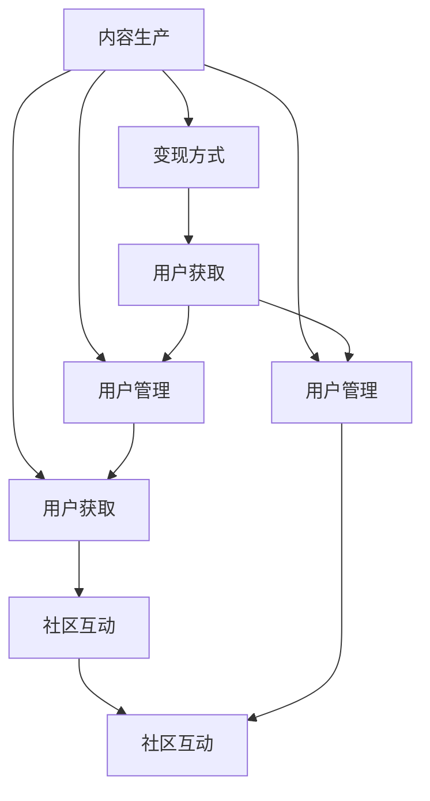

                 

# 如何打造个人知识付费生态圈

## 1. 背景介绍

### 1.1 问题由来

随着知识付费行业的兴起，越来越多的个人开始通过提供高质量内容来获取收入。知识付费平台如得到、喜马拉雅、知乎等，为广大用户提供丰富多样的学习内容。然而，对于个人来说，如何构建可持续发展的知识付费生态圈，仍然是一个挑战。

### 1.2 问题核心关键点

打造个人知识付费生态圈，需要从以下几个关键点进行思考：

- 内容生产：如何高效产出优质内容，持续更新，满足用户需求。
- 用户获取：如何吸引和保留用户，增加订阅和付费流量。
- 变现策略：如何通过不同的变现方式，最大化收入。
- 生态闭环：如何构建闭环系统，实现内容、用户、收入的正循环。

这些问题相互关联，需要全面系统地解决，才能实现长期的成功。

## 2. 核心概念与联系

### 2.1 核心概念概述

在打造知识付费生态圈的过程中，涉及多个核心概念，包括内容生产、用户管理、变现方式、社区互动等。

- **内容生产**：涉及知识付费生态圈的核心，高质量内容的产出是吸引用户和变现的基础。
- **用户管理**：如何吸引用户，增加用户黏性，是生态圈可持续发展的关键。
- **变现方式**：通过订阅、单次购买、会员制等不同方式变现，是确保收入的重要环节。
- **社区互动**：通过社群、讨论区等形式增强用户互动，提升用户参与度。

这些概念之间的联系是通过内容、用户、收入三者之间的互动关系建立的。优质的内容吸引用户，增加订阅和付费流量；订阅和付费流量带来稳定的收入；稳定的收入又可以进一步支持内容生产和社区建设，形成正循环。

### 2.2 核心概念原理和架构的 Mermaid 流程图



## 3. 核心算法原理 & 具体操作步骤

### 3.1 算法原理概述

打造个人知识付费生态圈，主要涉及以下几个算法原理：

- **内容推荐算法**：通过机器学习算法，分析用户行为，推荐高质量内容，增加用户黏性。
- **用户行为分析**：通过数据挖掘技术，分析用户互动数据，了解用户需求和偏好，优化内容生产策略。
- **变现优化算法**：通过分析不同变现方式的效果，优化价格策略、内容组合等，最大化收入。
- **社区互动算法**：通过文本挖掘和情感分析，优化社群管理策略，增强用户互动和参与度。

这些算法原理通过协同工作，形成闭环，共同推动知识付费生态圈的发展。

### 3.2 算法步骤详解

1. **内容生产**
   - 确定内容主题：根据市场调研和用户需求分析，确定内容主题。
   - 制定生产计划：制定详细的内容生产计划，包括时间、地点、方式等。
   - 进行内容创作：按照计划进行内容创作，可以是文字、视频、音频等。
   - 质量控制：对创作的内容进行质量控制，确保符合用户需求和平台标准。

2. **用户获取**
   - 市场调研：通过问卷调查、社交媒体等渠道进行市场调研，了解潜在用户需求。
   - 内容宣传：利用SEO、社交媒体、广告等手段进行内容宣传，吸引用户。
   - 用户转化：通过免费试用、限时优惠等方式，将潜在用户转化为付费用户。
   - 用户留存：通过提供优质的内容和服务，增强用户黏性，减少流失。

3. **变现策略**
   - 订阅模式：提供按月或按年订阅，根据用户需求和内容价值定价。
   - 单次购买：针对特定内容提供单次购买，满足用户个性化需求。
   - 会员制：提供会员制服务，包括独家内容、特权服务等，增加用户粘性。
   - 付费广告：通过内容平台进行付费广告推广，获取更多流量和收入。

4. **社区互动**
   - 社群建设：建立用户社群，提供互动交流平台，增强用户参与感。
   - 用户反馈：收集用户反馈，优化内容和服务，满足用户需求。
   - 活动策划：定期举办线上线下活动，增强用户互动和黏性。

### 3.3 算法优缺点

**优点**：

- **自动化和智能化**：利用机器学习和数据分析技术，提高内容推荐和用户管理的效率，降低人力成本。
- **灵活性和可扩展性**：根据用户需求和市场变化，灵活调整内容和变现策略，适应市场变化。
- **数据驱动决策**：通过数据分析，优化决策过程，提升业务效果。

**缺点**：

- **技术依赖性**：对技术要求高，需要专业的数据科学和算法工程师支持。
- **数据隐私问题**：大量数据分析和使用用户数据，需要确保数据隐私和用户安全。
- **市场变化风险**：市场变化和用户需求不确定，需要持续跟踪和调整策略。

### 3.4 算法应用领域

这些算法原理在多个领域都有广泛应用，包括但不限于：

- **内容推荐系统**：广泛应用于电商、视频、音乐等领域，推荐用户感兴趣的商品和内容。
- **用户行为分析**：应用于广告、营销、金融等领域，分析用户行为，优化决策。
- **变现优化算法**：在电商、娱乐、在线教育等行业，优化价格策略和内容组合，提升收入。
- **社区互动算法**：在社交媒体、论坛、在线教育等行业，增强用户互动和参与度，提升用户体验。

## 4. 数学模型和公式 & 详细讲解 & 举例说明

### 4.1 数学模型构建

假设用户对内容的评价为 $r_i$，内容 $c_j$ 的评分矩阵为 $R_{ij}$，内容特征向量为 $x_j$，用户特征向量为 $u_i$。则内容推荐算法的基本模型为：

$$
\hat{R}_{ij} = \text{sigmoid}(X_{ij}^T \theta + b)
$$

其中，$X_{ij}$ 为输入矩阵，$\theta$ 为模型参数，$b$ 为偏置项，$\text{sigmoid}$ 为激活函数。

### 4.2 公式推导过程

根据矩阵分解和线性回归的原理，推导出上述推荐算法的矩阵分解形式：

$$
R_{ij} \approx \sum_{k=1}^K u_{ik}x_{jk}
$$

其中，$u_i$ 为用户兴趣向量，$x_j$ 为内容特征向量，$K$ 为分解维度。

### 4.3 案例分析与讲解

以电商推荐系统为例，该系统通过分析用户历史购买行为，推荐相似商品。具体步骤如下：

1. **数据预处理**：收集用户历史购买记录和商品描述，进行数据清洗和特征提取。
2. **矩阵分解**：将用户和商品表示为低维向量，计算相似度得分。
3. **推荐算法**：利用用户兴趣向量和商品特征向量计算推荐得分，排序推荐商品。
4. **模型评估**：通过A/B测试等方法，评估推荐效果，优化模型参数。

## 5. 项目实践：代码实例和详细解释说明

### 5.1 开发环境搭建

1. **环境准备**：安装Python、MySQL、Flask等开发工具，搭建Web服务器。
2. **数据库设计**：设计用户、内容、交易等数据表，存储和管理数据。
3. **API接口**：开发内容推荐、用户管理、交易处理等API接口。
4. **监控系统**：部署监控系统，实时跟踪网站性能和用户行为。

### 5.2 源代码详细实现

以下是一个简单的内容推荐系统的代码实现：

```python
from flask import Flask, request, jsonify
from sklearn.decomposition import TruncatedSVD
from sklearn.metrics.pairwise import cosine_similarity
import pandas as pd

app = Flask(__name__)

# 加载数据
data = pd.read_csv('data.csv')

# 数据预处理
user_ids = data['user_id'].unique()
item_ids = data['item_id'].unique()

# 矩阵分解
svd = TruncatedSVD(n_components=10)
user_matrix = svd.fit_transform(data[['user_id', 'item_id']])
item_matrix = svd.transform(data[['user_id', 'item_id']]).T

# 推荐算法
def recommend(user_id):
    user_vector = user_matrix[user_id]
    item_scores = cosine_similarity(user_vector, item_matrix)
    recommendations = pd.DataFrame(item_scores, columns=['item_id']).sort_values('item_id', ascending=False).head(10)
    return recommendations.to_dict(orient='records')

@app.route('/recommend', methods=['GET'])
def recommend_api():
    user_id = request.args.get('user_id')
    recommendations = recommend(int(user_id))
    return jsonify(recommendations)

if __name__ == '__main__':
    app.run(debug=True)
```

### 5.3 代码解读与分析

1. **环境准备**：搭建Web服务器，部署MySQL数据库，提供API接口服务。
2. **数据预处理**：收集用户和商品数据，进行数据清洗和特征提取。
3. **矩阵分解**：利用TruncatedSVD算法进行矩阵分解，获取用户和商品的低维向量表示。
4. **推荐算法**：利用余弦相似度计算推荐得分，推荐用户最感兴趣的商品。
5. **API接口**：开发推荐API接口，根据用户ID返回推荐商品列表。

## 6. 实际应用场景

### 6.1 内容电商

内容电商是一种新型电商模式，通过高质量内容吸引用户，推荐商品，提升销售转化率。例如，通过视频、图文介绍商品，让用户了解商品详情，增强购买意愿。同时，根据用户行为数据，个性化推荐相关商品，提高用户体验和满意度。

### 6.2 在线教育

在线教育平台通过提供高质量课程和互动内容，吸引用户订阅和付费。例如，通过视频、直播、社区互动等方式，提供个性化学习路径和答疑服务，提升学习效果。同时，通过数据分析和推荐算法，优化课程内容和推荐，提高用户留存率。

### 6.3 健身应用

健身应用通过提供科学健身知识和个性化训练计划，吸引用户付费。例如，通过视频教程、训练记录、社区互动等方式，提供全面健身指导和动力支持。同时，根据用户健身数据和行为，个性化推荐训练计划和商品，提高用户粘性和满意度。

### 6.4 未来应用展望

未来，随着AI和大数据分析技术的不断发展，知识付费生态圈将更加智能化和个性化。通过深度学习、强化学习等技术，提升内容推荐和用户管理的效率，实现更精准的用户需求匹配和内容推荐。同时，通过区块链等技术，保障数据隐私和用户权益，增强用户信任和黏性。

## 7. 工具和资源推荐

### 7.1 学习资源推荐

1. **《数据科学与人工智能基础》**：全面介绍数据科学、人工智能基础，涵盖机器学习、深度学习等前沿技术。
2. **《推荐系统实战》**：详细讲解推荐系统的原理和实践，提供多个实际案例和代码实现。
3. **《自然语言处理基础》**：深入浅出地讲解自然语言处理基础，涵盖文本处理、情感分析、语义理解等技术。
4. **《用户行为分析》**：介绍用户行为分析的原理和应用，提供数据挖掘和机器学习工具。
5. **《在线教育平台建设》**：系统讲解在线教育平台建设，涵盖课程设计、用户管理、推荐算法等。

### 7.2 开发工具推荐

1. **Flask**：简单易用的Web框架，适合快速开发API接口。
2. **MySQL**：稳定可靠的关系型数据库，适合存储和管理结构化数据。
3. **Pandas**：高效的数据处理和分析工具，适合数据清洗和特征提取。
4. **Scikit-learn**：开源机器学习库，提供多种算法和工具。
5. **TensorFlow**：灵活高效的深度学习框架，适合大规模机器学习应用。

### 7.3 相关论文推荐

1. **《推荐系统十大算法》**：详细介绍推荐系统的常见算法和应用。
2. **《用户行为分析方法综述》**：系统总结用户行为分析的原理和应用，提供多个实际案例。
3. **《自然语言处理技术综述》**：全面介绍自然语言处理技术，涵盖文本处理、情感分析、语义理解等。
4. **《在线教育平台研究综述》**：系统总结在线教育平台的建设和发展，涵盖课程设计、用户管理、推荐算法等。
5. **《深度学习在推荐系统中的应用》**：详细介绍深度学习在推荐系统中的应用，提供多个实际案例和代码实现。

## 8. 总结：未来发展趋势与挑战

### 8.1 研究成果总结

本文全面介绍了打造个人知识付费生态圈的核心概念、算法原理和具体操作步骤，详细讲解了内容生产、用户获取、变现策略和社区互动等方面的方法。通过理论分析和实践经验，提供了系统的指导和解决方案。

### 8.2 未来发展趋势

未来，随着AI和大数据分析技术的不断发展，知识付费生态圈将更加智能化和个性化。通过深度学习、强化学习等技术，提升内容推荐和用户管理的效率，实现更精准的用户需求匹配和内容推荐。同时，通过区块链等技术，保障数据隐私和用户权益，增强用户信任和黏性。

### 8.3 面临的挑战

尽管知识付费生态圈前景广阔，但在发展过程中仍然面临诸多挑战：

1. **技术门槛高**：需要掌握AI和大数据分析技术，对技术要求较高。
2. **数据隐私问题**：大量数据分析和使用用户数据，需要确保数据隐私和用户安全。
3. **市场变化风险**：市场变化和用户需求不确定，需要持续跟踪和调整策略。
4. **内容质量保证**：如何保证内容高质量，满足用户需求和平台标准。
5. **用户管理复杂**：如何有效管理用户，增强用户黏性，减少流失。

### 8.4 研究展望

未来，需要在以下方面进行深入研究和实践：

1. **内容自动化生产**：利用AI技术，自动化生成高质量内容，提高内容生产效率。
2. **个性化推荐算法**：优化推荐算法，实现更精准的用户需求匹配和内容推荐。
3. **数据隐私保护**：采用区块链等技术，保护用户数据隐私和权益。
4. **智能社区建设**：利用AI技术，增强社群管理，提升用户互动和参与度。
5. **市场趋势分析**：利用大数据技术，分析市场变化和用户需求，优化内容和服务。

总之，打造知识付费生态圈需要系统化思考和全面优化，才能实现长期的成功。只有在技术、内容、用户、收入等多个方面协同发力，才能构建一个健康、可持续发展的知识付费生态圈。

## 9. 附录：常见问题与解答

**Q1：如何提高内容推荐效果？**

A: 提高内容推荐效果需要从以下几个方面进行优化：

- **数据质量**：确保数据准确、完整，提高特征提取质量。
- **算法优化**：采用更高效、更准确的推荐算法，如深度学习、协同过滤等。
- **用户反馈**：收集用户反馈，优化推荐算法和内容库。
- **模型监控**：实时监控推荐效果，及时调整模型参数和推荐策略。

**Q2：如何选择变现策略？**

A: 选择变现策略需要根据内容类型、用户需求和市场环境进行综合考虑：

- **订阅模式**：适合高质量、持续更新的内容，满足用户长期需求。
- **单次购买**：适合特定内容或服务，满足用户一次性需求。
- **会员制**：适合提供独家内容或特权服务，增强用户粘性。
- **付费广告**：适合广告主推广产品，增加流量和收入。

**Q3：如何进行社区互动？**

A: 社区互动是知识付费生态圈的重要环节，需要从以下几个方面进行优化：

- **社群建设**：建立用户社群，提供互动交流平台，增强用户参与感。
- **用户反馈**：收集用户反馈，优化内容和服务，满足用户需求。
- **活动策划**：定期举办线上线下活动，增强用户互动和黏性。

**Q4：如何保障数据隐私？**

A: 保障数据隐私需要从以下几个方面进行优化：

- **数据加密**：采用数据加密技术，保护数据传输和存储安全。
- **权限控制**：设置用户权限，控制数据访问和使用。
- **合规性检查**：遵守数据隐私法规，进行合规性检查和审计。

总之，打造知识付费生态圈需要全面考虑内容、用户、收入等多个因素，综合运用技术、市场、管理等多方面手段，才能实现长期的成功。

